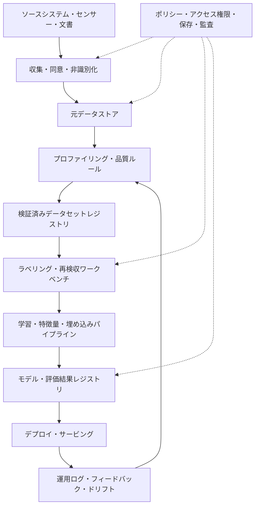

# データ中心AI（Data-Centric AI）と学習データ品質エンジニアリング

## 1. 概要

> **定義**: データ中心AI（Data-Centric AI, DCAI）とは、モデル構造とコードだけを高度化するのではなく、問題に適した学習・検証データを体系的に設計し、その品質を反復的に改善することで、AIシステムの性能と信頼性を高めるアプローチである。

従来の機械学習プロジェクトでは、同じデータセットを前提に、モデルの層数、ハイパーパラメータ、損失関数、アンサンブル手法を変えるモデル中心（Model-Centric）のアプローチが多く用いられてきた。この方式はアルゴリズム研究には有効であるが、現場で性能低下の原因がラベルの誤り、欠落、重複、偏り、現場の分布の未反映である場合には、モデルだけを変えても改善幅は小さい。データ中心のアプローチとは、モデルを必ず固定するという意味ではなく、データもモデルと同等のシステム資産とみなし、明示的な品質目標と改善ループを運用するという意味である。

情報管理技術士の観点から見ると、DCAIは単なる前処理技法ではない。データの収集、定義、ラベリング、検収、バージョン管理、学習、評価、デプロイ後のモニタリングをつなぐ、データガバナンスとMLOpsの結合の問題である。したがって技術士は、正解率という一つの数字だけを提示するのではなく、業務目的に適したデータの適合性、代表性、追跡可能性、個人情報保護、運用の持続性を併せて答案に含めるべきである。

登場背景は三つに整理できる。第一に、公開モデルや事前学習モデルの性能が底上げされて平準化したことで、同一モデルではデータの違いが結果を左右するようになった。第二に、実際の業務データは季節性、機器の変更、ユーザー行動の変化によって、学習時点と運用時点で分布が異なる。第三に、生成AIやマルチモーダルAIは、元データの出所と著作権、個人情報、重複、汚染の有無を追跡しなければ、モデル性能だけでなく法的・倫理的リスクまで増大させる。

DCAIの目的はデータを大量に集めることではなく、目的に合ったデータを確保することである。希少な障害類型を示す1,000件の代表サンプルは、正常状態を繰り返しただけの100,000件のサンプルより有用な場合がある。逆に、サンプル数が不足した状態で少数事例だけを拡大すると、過学習や実環境での誤判定が発生するため、品質と量のバランスを実験によって検証しなければならない。

## 2. データ中心AIの概念と推進構造

### 2.1 モデル中心アプローチとの違い

モデル中心アプローチは、データセットを比較的固定された入力とみなし、モデルの表現力と最適化手法を改善する。これに対しDCAIは、モデルのバージョンが同じでも、データセットのバージョン、ラベルポリシー、サンプル構成、誤りの類型を変えることで性能を改善する。重要なのは、両アプローチが二者択一ではないという点である。ベースラインモデルを固定してデータ変更の効果を測定し、一定のデータ品質水準に達した後にモデル改善を並行させるのが実務的である。

DCAIにおけるデータ品質とは、データベースにおける一般的な品質とAIの学習適合性の両方を意味する。値が形式的に埋まっていても、実際の分類境界を説明できなければ、AIの観点からは低品質である。たとえば製造画像のすべてのピクセルが高解像度であっても、欠陥部位が隠れていたり欠陥のないサンプルしか含まれていなかったりすれば、現場での判定には適さない。

次の表は、二つのアプローチの違いを凝縮したものである。表の項目は暗記用の結論ではなく、後述する改善活動の方向性を決める基準として用いる。

| 区分 | モデル中心AI | データ中心AI |
|---|---|---|
| 主な改善対象 | 構造、パラメータ、損失関数、推論コード | 収集、ラベル、代表性、誤り・重複、データ分布 |
| 基本的な前提 | データセットは比較的固定 | データセットも反復的に設計・改善 |
| 性能測定 | モデル指標中心 | モデル指標とデータ品質指標の連携 |
| 中核的な役割 | MLエンジニア・研究者 | ドメイン専門家・データエンジニア・ラベラー・ガバナンス担当者 |
| 主なリスク | 過学習、計算量、汎化の失敗 | ラベルの偏り、ドリフト、出所不明、個人情報・著作権 |
| 運用方式 | 学習パイプライン中心 | データとモデルを併せてバージョン管理・検証・モニタリング |

モデル中心アプローチの利点は、新しいモデル構造が問題の表現力を大きく向上させる状況において、素早い突破口を提供する点にある。しかし誤りの原因がデータの意味的不一致であれば、より大きなモデルは誤りをより複雑に学習してしまいかねない。DCAIはモデルを単純化しようという主張ではなく、モデルに投入されるデータの原因と文脈を管理しようという主張である。

### 2.2 全体の推進フロー

DCAIは一度限りのクレンジング作業ではなく、データの誤りを発見・改善したうえで再評価するクローズドループである。次の構造において品質ゲートは、パイプラインを停止させる装置であると同時に、どの基準を通過したかのエビデンスを残す監査ポイントでもある。

最初の段階では、正解率の目標よりも業務上の意思決定における損失構造を定義する。不良品を見逃すコストと良品を不良と分類するコストが異なるのであれば、単純な正解率よりも再現率、適合率、コスト加重損失を用いるべきである。この目標がなければ、データチームは見栄えの良いバランスの取れたデータばかりを作り、現場にとって重要な失敗類型を見逃すことになる。

データプロファイリングは、スキーマ、欠損率、値の範囲、重複、分布、時間範囲、出所を把握する活動である。画像であれば解像度・照明・撮影機器・ファイル破損の有無を、テキストであれば言語・文字エンコーディング・長さ・機微情報の含有有無を確認する。プロファイリングの結果は、データ品質のベースラインとその後の改善の優先順位を決める根拠となる。

ラベルポリシーは、ラベル名だけを定める文書ではない。境界事例をどう判定するか、複数ラベルが可能か、不確実なサンプルを保留するか、ラベラー間で意見が分かれた場合に誰が決定するかまでを含む。ポリシーが変わると過去のデータと新しいデータの意味が異なり得るため、ラベルスキーマのバージョンも併せて管理しなければならない。

クレンジングの段階では、無条件に削除しない。外れ値が測定誤りなのか実際の希少事例なのか、まず原因を確認する。希少事例を削除すると平均的な指標は改善しても、運用環境のテールリスクを学習できなくなる。したがって、削除、修正、保留、重み調整、追加収集のうちどの措置を講じたかをデータリネージに記録する。

### 2.3 データとモデルの結合資産

AIの再現性は、コードとモデルファイルだけでは確保できない。学習に用いたデータスナップショット、前処理ルール、ラベルポリシー、特徴抽出器、評価セット、実行環境が併せて保存されてこそ、同一の結果を再現できる。データのバージョンが変われば、モデルのバージョンも別のリリース候補として扱わなければならない。

データコントラクト（Data Contract）は、生産者と利用者がスキーマ、意味、品質閾値、変更通知の方式について合意する仕組みである。たとえば、顧客イベントの`event_time`はUTC基準で5分以内に到着しなければならず、識別子は個人情報の原文ではなくトークンでなければならない、と宣言できる。コントラクト違反は学習の失敗や運用上の誤判定につながり得るため、CI段階で自動検査する。

## 3. データ品質エンジニアリング

### 3.1 品質の次元と測定

AIに必要な品質の次元は、目的とデータの種類によって異なる。次の表は代表的な次元を整理したものであるが、実際のプロジェクトでは業務リスクとモデルの誤り分析を結び付けて測定項目を選択する。

| 品質の次元 | 意味 | 代表的な測定例 |
|---|---|---|
| 正確性 | 実際の対象・業務ルールと値が一致する度合い | 参照データとの一致率、ラベル検収率 |
| 完全性 | 必須の値と必要な事例が漏れなく存在する度合い | 欠損率、必須フィールドの充足率 |
| 一貫性 | レコード・出所・時間を通じて意味が矛盾しない度合い | ルール違反件数、単位の不一致率 |
| 一意性 | 同一の事象・個体の重複が統制されている度合い | 重複率、近似重複の検出率 |
| 適時性 | 業務上の意思決定に必要な時点に到着する度合い | 遅延時間、最新性 |
| 代表性 | 運用対象の集団・条件・境界を十分に反映する度合い | 分布の差異、グループ別カバレッジ |
| ラベル信頼性 | 基準に適合し、ラベラー間の合意が高い度合い | 再検収率、Cohenのカッパ |
| リネージ・追跡可能性 | 出所と変換過程を再現できる度合い | lineageの欠落率、provenanceのカバレッジ |

欠損率は、特定フィールドの欠損レコード数を全レコード数で割った値として定義できる。しかし、欠損そのものが無作為なのか、特定の顧客層・機器・時間帯に集中しているのかのほうが重要である。選択的に発生した欠損を平均値で補完すると、モデルが欠損の発生原因を学習できなくなったり、特定集団の偏りが大きくなったりする可能性がある。

重複率は、同一の事象を繰り返し数えてしまう問題を測定する。テキストや画像では、完全一致だけでなく、意味的に類似した近似重複も検出しなければならない。重複データが学習セットとテストセットに分かれて入ると、実際の汎化ではなくデータリークによって指標が水増しされるおそれがある。

代表性とは、データ全体が現実の比率と同じであるという意味だけではない。運用上コストの大きい希少な条件を意図的に十分含めているかどうかも確認する。たとえば夜間・雨天・低照度の条件が実際には全体の5%であっても、安全事故に結び付くのであれば、別途評価スライスとして管理すべきである。

### 3.2 ラベル品質と人の役割

教師あり学習のラベルは事実そのものではなく、業務ルールを適用した判断結果である。同じ医用画像や顧客からの問い合わせを見ても、ポリシーの解釈によってラベルが異なり得るため、ラベル品質はラベラーの熟練度とガイドラインの明確さに左右される。ドメイン専門家がすべてのデータを直接ラベリングすることが難しい場合は、サンプルの再検収と難しい事例の重点検収によってコストを配分する。

ラベルガイドには、正例・負例の例示、境界事例、保留基準、複数ラベルの優先順位、個人情報のマスキングルールを含める。単なるラベル名の一覧では、ラベラー間のばらつきを減らせない。ガイドが変更された場合は、変更理由、適用時点、影響を受けたデータバージョンを記録し、必要に応じて過去のラベルを再マッピングする。

ラベラー間の一致度は、正解を代替する単一の数値ではない。一致度の低い事例は、問題自体が曖昧であるか、ガイドラインが不十分であることのシグナルである可能性がある。こうした事例を除去するよりも、不確実性ラベル、多数決と専門家判定の区別、モデル学習における低い重み付けなどによって意味を保持することができる。

### 3.3 代表性・偏り・データ分割

データ分割は、無作為にシャッフルすることが常に安全とは限らない。時間的順序のある需要予測では、未来の情報が過去の学習に混入しないよう、時間を基準に分割しなければならない。同一ユーザー・同一機器・同一文書の派生物が複数のセットに入る場合には、グループ単位の分割を適用すべきである。

分割後は、全体の平均だけでなく、地域、性別、年齢、機器、言語、時間帯、業務類型といったスライス別の指標を確認する。全体のF1スコアが高くても、少数集団の再現率が低ければ、サービス品質と公平性の問題が生じる。スライスとは、個人情報を不必要に拡大収集せよという意味ではなく、合法かつ必要な範囲でリスクを診断できる集計基準を設計せよという意味である。

データ拡張は不足している条件を補完できるが、元の分布の意味を損なうおそれがある。画像の回転が物体の向きと無関係か、テキストの置換が文の意図を保持しているか、生成データが実際の誤りパターンを反映しているかを検証しなければならない。拡張データは元データと区別し、生成ルールと品質検収を記録する。

### 3.4 誤り分析と能動的なデータ収集

学習後の誤り分析は、誤ったサンプルを列挙するだけにとどまらず、誤りをソース・ラベル・表現・分布・モデルの境界に分類する。同じ誤りが繰り返される場合は、モデルを大きくする前に、その誤りをよく示すサンプルを追加するか、ラベルポリシーを修正する。このとき、誤りの分類体系がデータ改善バックログの単位となる。

能動学習（Active Learning）は、モデルが不確実または代表性が低いと判断したサンプルを優先的にラベリングする戦略である。ラベリングのコストが高いドメインでは無作為なラベリングより効率的な場合があるが、初期モデルが見逃している領域を除外し続けてしまう可能性がある。したがって、不確実性に基づくサンプルと無作為・希少条件のサンプルを併せて抽出し、探索の偏りを緩和する。

ハードネガティブとは、モデルがしばしば誤認するが実際には別のクラスである事例である。ハードネガティブを追加する際には、誤認の理由を説明できなければならない。単に難しい画像ばかりを繰り返すと、データセットが特定の撮影条件に過度に適合してしまうおそれがあるため、クラス・環境・時間帯別のカバレッジを併せて点検する。

## 4. ライフサイクル・アーキテクチャ・ガバナンス

### 4.1 品質改善のアーキテクチャ

次は、データストア、品質検証、ラベリング、学習、運用フィードバックを結び付けた論理アーキテクチャである。要点はデータレイクや保存技術の名称ではなく、すべての変換と判定に責任者・バージョン・品質結果が結び付く構造である。

収集レイヤでは目的外の収集を減らし、同意・法的根拠・保存期間を確認する。非識別化が適用されていても、他の情報と結合すれば再識別され得るため、アクセス権限、持ち出し統制、ログを併せて設計しなければならない。データ中心AIは品質を高めるためにデータをもっと集めようというアプローチではなく、必要な目的に適した最小限のデータという原則と矛盾しない。

検証済みデータセットレジストリは、データセットのバージョン、スキーマ、統計、ラベルポリシー、品質結果、承認者、利用制限を管理する。モデルレジストリと連携させれば、どのモデルがどのデータバージョンで学習されたかを照会できる。この連携は、障害や規制上の照会の際に影響範囲を素早く絞り込むうえで重要である。

運用フィードバックは、ユーザーによる正解の修正、現場での差し戻し、モニタリングのアラート、新たな環境のサンプルで構成できる。フィードバックをそのまま学習に投入すると、攻撃者が汚染データを注入したり、誤ったユーザーの入力を信頼したりする問題が生じる。したがって、信頼度・検収状態・出所を基準に再学習の候補を分離する。

### 4.2 DataOpsとMLOpsの統合

DataOpsはデータフローの品質・再現性・デプロイを管理し、MLOpsはモデルの学習・デプロイ・観測を管理する。DCAIにおいて二つのパイプラインが分離したまま運用されると、データの変更がモデル性能に及ぼす影響を見逃してしまう。データスナップショットの変更をモデル再評価のトリガーとして結び付け、モデル性能の低下をデータの誤り分析のトリガーとして結び付けなければならない。

CI段階では、スキーマ検査、必須フィールド、値の範囲、重複・リーク、個人情報の検出、ラベル分布を検査する。CDまたは学習結果のデプロイ段階では、ベースラインモデルとの性能比較、スライス別の性能、公平性の基準、説明可能性、推論コストを確認する。自動ゲートは人の判断を代替するというより、反復的な違反を早期に遮断し、例外承認の手続きを標準化するものである。

データドリフトは入力分布の変化であり、コンセプトドリフトは入力と正解の関係が変化する現象である。入力分布が変わらなくても、業務ポリシーが変われば、コンセプトドリフトが生じ得る。したがって統計的な分布の検査だけでは不十分であり、可能であればラベルの遅延を考慮した実際の誤り率と業務KPIを併せてモニタリングする。

### 4.3 個人情報・セキュリティ・説明責任

データ中心AIには、元データの収集と再利用を増加させるリスクがある。収集目的、最小限の収集、保存期間、アクセス権限、処理記録、削除要求への対応を設計に含める。機微情報を含む学習データについては、非識別化だけを万能の解決策とみなさず、仮名化・アクセス制御・暗号化・安全な分析環境・出力検査を組み合わせる。

データポイズニング攻撃とは、攻撃者が学習データに悪意あるサンプルや誤ったラベルを混入させ、モデルの全般的な性能や特定条件下での挙動を変える攻撃である。防御のために、出所の信頼度、変更履歴、承認された収集経路、異常なラベルパターン、基準データとの性能変化を点検する。データセットのハッシュや署名は完全性の証拠を提供するが、データの意味的な正確性までは保証しない。

生成データや外部データについては、ライセンス、利用目的、再配布の条件を確認する。データの出所を追跡できなければ、モデル出力に対する説明や権利対応が難しくなる。データシートやモデルカードにデータ構成、制約、既知の偏り、評価範囲を明記すれば、ユーザーや監査人がシステムを正しい範囲で利用できるようになる。

## 5. 比較および事例

### 5.1 データ品質改善とモデルチューニングの比較

モデルチューニングは、学習率、正則化、構造、アンサンブルを調整し、同一のデータにおける表現力と汎化性能を高める。データ品質改善は、ラベルの誤りや欠落を直し、分布の隙間を埋め、重複やリークを除去することで、モデルが学習するシグナルそのものを変える。前者はモデルの関数空間を変え、後者は入力シグナルの信頼度とカバレッジを変えると説明できる。

性能が停滞している原因が偏ったラベルであれば、モデルを変える実験よりもラベルの再検収のほうが投資対効果が高い場合がある。逆に、データが十分にクレンジングされており、複雑な非線形の境界が必要な場合には、モデルチューニングのほうが効果的である。技術士はどちらか一方を正解と断定せず、誤りの分解と実験設計を通じて改善の方向性を選択すると提示すべきである。

| 状況 | 優先すべき措置 | 確認指標 |
|---|---|---|
| 学習・テスト性能がともに低い | ラベル・特徴量・問題定義の点検 | ラベルの一致度、クラス別再現率 |
| 学習性能のみ高くテスト性能が低い | リーク・重複・代表性・過学習の点検 | セット間の重複、スライス性能 |
| 全体は高いが特定条件で低い | 条件別のデータ補強・再分割 | グループ別指標、カバレッジ |
| 運用時にのみ急落 | ドリフト・センサー・ポリシー変更の分析 | PSI/分布変化、業務上の誤り率 |
| ラベリングコストが高く候補が多い | 能動学習・優先順位付けラベリング | サンプル当たりの性能向上、コスト |

### 5.2 架空の製造欠陥検査の事例

以下は原理を説明するための架空の事例である。ある製造ラインがカメラ画像で表面欠陥を判定していると仮定する。初期データは12万枚あるが、大部分が日勤帯・昼間照明下の正常製品であり、新しいカメラや微細欠陥のサンプルはほとんどない。ベースラインモデルの全体の正解率は高いが、新ラインでは欠陥の見逃しが多い。

第一に、データプロファイリングによって撮影機器・ライン・時間帯・欠陥の種類別に分布を分ける。第二に、同一製品の連続撮影画像が学習とテストの両方に入っていたリークを除去する。第三に、ドメイン専門家が欠陥の境界事例5,000枚を再検収し、ラベルガイドと保留ラベルを作成する。第四に、新しいカメラと低照度条件のデータを意図的に追加収集しつつ、正常と欠陥の比率を別途管理する。

第五に、全体スコアとともに、欠陥の再現率、ライン別の再現率、低照度スライスの再現率を比較する。第六に、モデルが頻繁に誤るハードネガティブを優先的に検収し、運用フィードバックのうち信頼度の高い事例のみを次のデータセットバージョンに含める。この過程は、モデル構造を変更しなくてもデータの代表性とラベルの一貫性を改善して欠陥の見逃しを減らせる、典型的なDCAIのループである。

成果を報告する際には、「正解率が向上した」とだけ書かない。データバージョン、追加された条件、ラベルの一致度、テストセットの固定の有無、スライス別の改善とコストを併せて記録する。そうしてこそ、改善が特定のテストセットに対する偶然の最適化なのか、実際の運用品質の向上なのかを区別できる。

## 6. 深掘り：最新動向と出題との連携

DCAIとは、データラベリング会社の作業を指すものではない。近年は、データ準備、ラベリング、拡張、誤り分析、データ検証を自動化し、その結果をMLOpsパイプラインに結び付ける方向へと発展している。ただし自動化モデルが生成したラベルにも誤りの可能性があるため、人による検収とサンプル監査を必要とするリスクベースの運用が適切である。

データ品質を評価する標準化の流れでは、正確性・完全性・一貫性だけでなく、代表性、追跡可能性、ラベル品質、個人情報といったAI特有の側面を併せて見ようとする傾向がある。ISO/IEC 25012のようなデータ品質モデルを組織の品質基準として参照することはできるが、すべての特性に同一の閾値を適用するとコストが大きくなる。サービスのリスクとデータの用途に応じて、中核となる品質の次元と測定周期を選択しなければならない。

生成AIでは、文書のクレンジングと重複除去、チャンクの品質、メタデータ、検索の適合性、個人情報と著作権の検証が重要である。RAGの回答品質を高めるには、モデルだけをチューニングするよりも、検索コーパスの最新性、文書の権限、チャンクの境界、根拠の紐付けを改善しなければならない。すなわち、DCAIの対象は従来のラベルデータから、検索・評価データやプロンプトデータにまで拡大している。

過去問と連携した答案では、「定義－必要性－構造－品質指標－ライフサイクル－ガバナンス－事例－考慮事項」の順に展開すると論理的である。データガバナンス、DataOps・MLOps、AIの信頼性、個人情報保護、データコントラクト、モデルモニタリングと結び付けて技術間の関係を説明すれば、単一用語の暗記ではなく設計型の答案となる。

## 7. 考慮事項および示唆

### 7.1 目標指標を先に定める

データ品質の指標は多ければ良いというものではない。業務上の失敗コストとモデルの誤り類型を分析し、正確性、代表性、ラベルの一致度、最新性のうちで優先順位を定める。指標の定義・分子・分母・測定周期・責任者を文書化してこそ、チームごとに異なる数字を比較してしまう問題を減らせる。

### 7.2 テストセットと評価プロトコルを保護する

データを反復的に改善する過程でテストセットまで覗いてしまうと、過学習が生じる。テストセットは可能な限り固定し、改善用の検証セットと運用モニタリング用のセットを分離する。分布が大きく変化した場合は新しいテストセットを追加するが、既存の基準セットとの連続性は維持する。

### 7.3 ドメイン専門家を品質ループに配置する

ラベルポリシーや誤りの原因は、データチームだけでは決めにくい。ドメイン専門家は難しい事例の意味を解釈し、業務上重要な失敗を定義する。専門家はすべてのサンプルを直接処理するよりも、ガイドの作成、サンプル監査、紛争解決、誤り類型の定義に集中する方式が効率的である。

### 7.4 自動化の限界を管理する

データ検証ルールや自動ラベリングは反復業務を減らすが、ルールに表現されていない意味上の誤りを見逃すおそれがある。自動判定には信頼度と例外経路を設け、高リスクの変更は人による承認とサンプルの再検収で統制する。自動化率そのものを成果とするのではなく、品質・コスト・処理時間のバランスを評価する。

### 7.5 個人情報と権利の範囲を設計に含める

データをより多く集める戦略は、個人情報の侵害や目的外利用を拡大させかねない。収集前に目的と保存期間を検討し、不要な原文を学習用ストアに複製しない。外部データと生成データはライセンスと出所を記録し、削除要求や利用制限がモデル・データパイプラインに及ぼす影響を追跡する。

### 7.6 運用の変化に対応する再学習基準を設ける

ドリフトのアラートが発生したからといって即座に再学習すると、汚染されたデータや一時的なイベントを学習してしまうおそれがある。アラートの継続時間、実際のラベルの確認、業務への影響、データ出所の信頼度を確認したうえで、再学習の要否を決定する。再学習前後のベースラインモデルとの比較とロールバック用のバージョンを準備する。

### 7.7 投資効果をデータ単位で算出する

ラベルの再検収、追加収集、品質ツール導入のコストを性能向上と結び付ける。サンプル当たりのラベリングコスト、データ準備時間、誤りの減少による業務コストの削減、再学習コストを併せて算出する。正解率の1%ポイントの改善が実際の業務損失をどれだけ減らすかを示してこそ、経営上の意思決定につながる。

### 7.8 技術士はエビデンスと責任の構造を提示する

優れたDCAI設計とは、「クリーンなデータを使う」という宣言ではなく、誰がどの基準で承認し、どのバージョンをいつ使ったかを再現できる体系である。データセットカード、ラベルガイド、品質レポート、リネージ、モデルカード、アクセスログ、例外承認の記録を残す。このエビデンスは、障害対応だけでなく、監査・規制・紛争においてもシステムの説明可能性を高める。

## 参考資料

1. [Data-Centric Artificial Intelligence, arXiv](https://arxiv.org/html/2212.11854v4) — データ中心AIの定義、モデル中心アプローチとの比較、データのクレンジング・拡張の観点。
2. [ETSI TR 104 180: Data Quality Metrics](https://www.etsi.org/deliver/etsi_tr/104100_104199/104180/01.01.01_60/tr_104180v010101p.pdf) — データ品質の測定次元と指標化の参考。
3. [NIST AI Risk Management Framework](https://www.nist.gov/itl/ai-risk-management-framework) — AIの信頼性・リスク管理とライフサイクルの観点の参考。
4. [The Principles of Data-Centric AI, Communications of the ACM](https://cacm.acm.org/research/the-principles-of-data-centric-ai/) — データ中心の改善ループと誤り分析の観点の参考。

---

> **一言まとめ**: データ中心AIとは、より大きなモデルよりも、目的に合ったデータの品質・代表性・リネージを反復的に改善し、それをMLOps・ガバナンスと結び付けることで信頼できるAIを作る方法論である。
