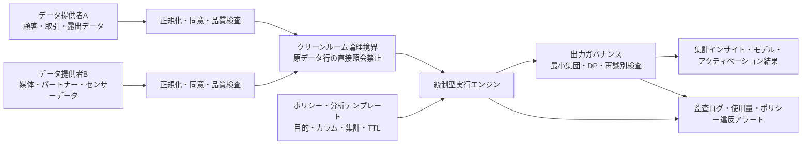
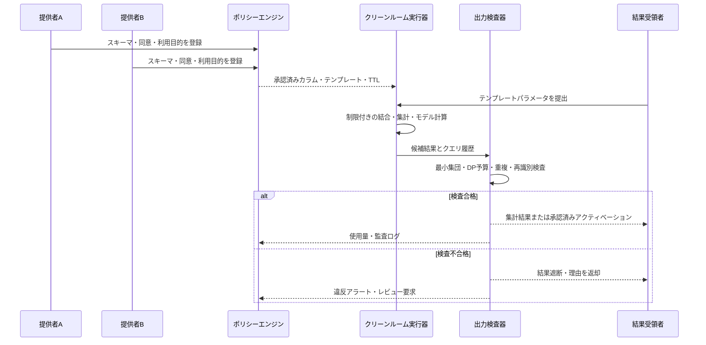

# データクリーンルーム(Data Clean Room)によるプライバシー保護型データ連携

## 1. 概要

> **定義**: データクリーンルーム(Data Clean Room, DCR)とは、二つ以上の組織が原データを互いに直接公開・複製することなく、事前に合意した分析・マッチング・アクティベーションの演算と出力ポリシーの範囲内で共同データを活用する、統制型の分析環境である。

デジタルサービスは、広告効果測定、不正取引検知、サプライチェーン分析、医療研究のように、複数組織のデータを結合して初めて精度が高まる問題に繰り返し直面する。しかし原データには顧客識別子、購買履歴、位置、金融・医療情報といった機微な属性が混在しているため、ファイルを相手方に渡す従来型のデータ交換は漏えいや目的外利用のリスクを高める。クリーンルームはこの問題を「データを共有するか否か」ではなく、「許可された質問の結果だけをどう共有するか」という問いに置き換える。

AWSはClean Roomsを「基礎となるデータセットを互いに共有・複製することなく、共同のデータセットを分析・協業する空間」と説明している([AWS Clean Rooms概要](https://aws.amazon.com/clean-rooms/))。Snowflakeも、協業者が原データの行を直接照会できず、許可されたテンプレートと集計結果のみを受け取る構造を示している([Snowflake Data Clean Rooms](https://docs.snowflake.com/en/user-guide/cleanrooms/about))。したがってDCRは、単なる暗号化ストレージや特定のデータベース製品名ではなく、データ・演算・出力・監査の境界を一体的に設計するガバナンスパターンとして理解すべきである。

### 1.1 登場の背景と必要性

第一に、データの価値は組織の境界を越えた結合から生まれる。広告主は自社の購買データと媒体の露出データを結合しなければコンバージョンを測定できず、製造業者は装置メーカーと運用事業者のデータを突き合わせなければ故障予測モデルを改善できない。個々の組織のデータだけを見ると、原因と結果のつながりが断たれ、分析の偏りが大きくなる。

第二に、直接識別子を交換する方式はデータ最小化の原則と衝突しやすい。メールアドレスや電話番号をハッシュ化しても、同じ入力に同じハッシュが得られる以上、辞書攻撃や外部データとの結合によって再識別されうる。そのため識別子の変換だけで「匿名」と断定せず、誰がどの演算をいつ実行し、小集団の結果をどう遮断するかまで統制しなければならない。

第三に、Cookieやモバイル広告識別子への依存度が低下するにつれ、同意を得たファーストパーティデータ間の測定とマッチングが重要になった。Google Ads Data Hubは、Google所有のプロジェクト内でプライバシーチェックと集計を適用した後、結果を顧客プロジェクトに書き出す方式を説明している([Ads Data Hubの紹介](https://developers.google.com/ads-data-hub/guides/intro))。この事例の本質は、データが一か所にすべて集まるという事実ではなく、生のイベントをそのまま外に出さない分析境界にある。

### 1.2 目標と非目標

DCRの目標は、協業による分析価値を保ちながら、原データの不要な露出、目的を横断した再利用、個人単位の結果返却を減らすことである。したがって成功は「どれだけ多くの原データを複製したか」ではなく、「許可された目的に必要な最小限の結果を再現可能な形で算出できたか」で測る。

逆に、DCRがあらゆるリスクを自動的に取り除くわけではない。許可された集計クエリであっても、何度も繰り返したり外部の補助データと結合したりすれば個人を推定できる。運用者がポリシーを誤って設定したり、参加者が不適切なデータを投入したりすれば、クリーンルームという名前だけが残る。DCRは個人情報保護設計の一構成要素であり、法的根拠・同意・保存期間・アクセス制御・インシデント対応を代替するものではない。

## 2. 中核概念と参照構造

### 2.1 役割と信頼境界

クリーンルームには通常、データ提供者(provider)、分析依頼者(consumer)、プラットフォーム運用者(operator)、結果承認者またはデータ保護責任者が参加する。一つの組織が複数の役割を兼ねることもあるが、役割を分離して権限と責任を明示するほうが安全である。

データ提供者は、自らの原データ、利用目的、マッチング可能なキー、許容できる分析の種類を決定する。分析依頼者は必要な質問と結果スキーマを提出するが、原データの行を探索する権限は持たない。運用者は実行環境とログを管理するが、業務上原データにアクセスしないよう技術的・管理的な分離を適用する。結果承認者は、小集団、異常なクエリ、目的外のカラムが出力されていないかを確認する。

重要な境界は三つある。保存境界は、原データが各参加者のアカウントまたは統制領域に留まっているかを確認する。実行境界は、結合と集計が許可されたエンジン・テンプレートでのみ行われるかを確認する。出力境界は、結果の最小集団サイズ、ノイズ、カラム、ダウンロード・アクティベーション先を制限する。保存を分離していても、実行と出力が開かれていればDCRの実質的な保護水準は低い。

### 2.2 全体参照アーキテクチャ

上記の構造において「クリーンルーム」は単一の中央ストレージを意味しない。参加者のデータが元のアカウントに残ったままエンジンが各所から読み取ることもあれば、暗号化された標準領域に限定的に取り込むこともある。どの配置を選ぶにせよ、原データの行を任意に照会・持ち出す経路があってはならない。

データのオンボーディング段階では、スキーマ、データオーナー、収集根拠、同意状態、保存期間、更新周期、欠損・重複率を登録する。単にメールアドレスをSHA-256でハッシュ化するよりも、正規化ルールとキー生成主体を統一し、キーの利用目的と廃棄手順を記録することが重要である。キーが複数の協業で再利用されると、異なる目的のデータが連結されうるため、協業ごとのトークンや使い捨てのマッチング識別子を検討する。

ポリシー層は、どのカラムをどの演算に使うかを宣言する。例えばキャンペーン測定ではキャンペーン・期間・地域別の集計のみを許可し、原データのユーザー識別子や詳細なタイムスタンプは結果から除外できる。分析テンプレートを事前承認すれば、任意のSQLから生じる組み合わせ攻撃を減らせるが、テンプレートパラメータの範囲と反復実行も併せて制限しなければならない。

### 2.3 DCRのデータフロー

1. 各参加者は目的と法的根拠を確認したうえで、必要最小限のフィールドを選別する。
2. スキーマ・コード値・タイムゾーン・識別子の正規化ルールをそろえ、データ品質を測定する。
3. 共有する原データまたは連結可能なキーをポリシーに登録し、同意の失効・削除要求を反映できる更新経路を準備する。
4. 参加者と分析目的、許可クエリ、結果受領者、保存期間、再委託条件を協業契約として確定する。
5. 分析者は承認済みテンプレートのパラメータのみを入力し、エンジンは結合・フィルタ・集計・プライバシーチェックを実行する。
6. 出力検査器は、最小集団サイズ、差分プライバシー予算、重複クエリ、異常な組み合わせを確認する。
7. 承認された集計結果またはモデル指標のみを持ち出し、すべての実行と承認・却下の理由を監査ログに残す。
8. 目的が終了したら結果と中間成果物を分類して保存・削除し、協業キーと権限を廃棄する。

このフローは「マッチングできたか」よりも「マッチング後に何が外に出るか」を中心に設計すべきである。マッチ率が高くても、特定顧客層の希少な属性がそのまま結果に現れれば失敗である。逆に、結果がやや粗くても意思決定に十分であり、個人を保護できるならば目的に適った設計といえる。

## 3. プライバシー保護の統制と実行原理

### 3.1 出力制限と集計ルール

最も基本的な統制は、k最小集団サイズ(threshold)である。結果グループのレコード数が基準を下回れば、結果を返さないか他のグループとまとめる。例えば特定のキャンペーン・地域・年齢の組み合わせに該当する顧客が5人しかいなければ、その集団のコンバージョン率は出力しない。しかし閾値だけでは十分ではない。異なる条件の結果を比較して小集団の値を逆算する差分攻撃を防ぐため、クエリ履歴とグループ間の重なりも併せて管理しなければならない。

丸め、バケット化、抑制(suppression)は、結果の精度を下げる代わりに活用可能性を残す手法である。時間は秒単位ではなく日・週単位で、地域は詳細な住所ではなく行政区画単位で提供できる。その際、分析目的に必要な解像度と再識別リスクを実験によって見極める必要があり、一律に粗くすれば業務上の価値が失われる。

### 3.2 差分プライバシー

差分プライバシー(Differential Privacy, DP)は、ある個人のデータが含まれるか否かが結果の分布に与える影響を制限するようにノイズを付加する数学的フレームワークである。AWS Clean Roomsは、集計結果に較正されたノイズを加え、協業全体に有限のプライバシー予算を適用する機能を文書化している([AWS Differential Privacy](https://docs.aws.amazon.com/clean-rooms/latest/userguide/differential-privacy.md)、[プライバシーポリシー](https://docs.aws.amazon.com/clean-rooms/latest/userguide/dp-settings.html))。

DPを適用する際は、ノイズを加えたという事実よりも予算の意味を説明すべきである。一般に\(\varepsilon\)が小さいほど保護は強くなるが、結果の不確実性は大きくなる。クエリを繰り返すと予算が累積するため、ユーザー・テーブル・期間・分析目的の単位で予算を割り当て、予算を使い切った後の追加実行を遮断する。実務者は、生の数値とDP結果を比較し、意思決定を歪めない誤差範囲を事前に合意しておく。

DPは、少数の精密な個人別照会を許すための技術ではない。集計・統計・ベンチマーキング・実験指標のように、結果が本来集団レベルであるユースケースに適している。ノイズの大きさ、クリッピング範囲、反復照会の制限を記録しなければ、結果の再現性と監査可能性が弱まる。

### 3.3 暗号学的マッチングと計算の保護

マッチングキーをそのまま交換しないために、協業ごとのトークン、仮名識別子、安全なマッチングプロトコルを利用できる。単純なハッシュは低エントロピーのメールアドレス・電話番号に対して脆弱であるため、ソルト管理、鍵付きハッシュ、トークン化、あるいは双方計算プロトコルを検討する。ただし、トークンが安定して再利用されるほど異なる目的のデータが連結されるため、目的別の分離とトークンのライフサイクル管理が必要である。

より強い保護が必要な場合は、秘密計算(MPC)、準同型暗号(HE)、信頼実行環境(TEE)を組み合わせることができる。MPCは参加者が入力を公開せずに共同の関数を計算できるようにし、HEは暗号文のまま特定の演算を可能にし、TEEはハードウェアで隔離された実行領域で平文処理を限定する。それぞれ計算コスト・対応演算・ハードウェアへの信頼仮定が異なるため、「暗号化されている」という一文で片づけてはならない。

### 3.4 統制型実行と結果の持ち出し

分析クエリは一般的なデータベースのように無制限に開放しない。テンプレートの入力値についても、許可リスト、期間範囲、結合キー、結果行数を検証し、同じ母集団を少しずつ変えて繰り返し照会するパターンを検知する。結果に含まれる数値だけでなく、モデルファイル、埋め込み、デバッグログ、エラーメッセージも持ち出しの対象となりうるため、同一の出力ポリシーを適用する。

アクティベーション(activation)とは、集計結果を広告・CRM・レコメンドシステムへ引き渡す場合を指す。アクティベーションの対象は個人のリストではなく、事前に同意されたセグメントやキャンペーンシグナルに限定し、受信システムのアクセス権限・保存期間・削除要求との連携を検証する。測定結果は匿名の集計として出力しつつ、アクティベーションには別の目的と別の承認を求めるといった形で目的を分離できる。

## 4. 実装設計と運用ライフサイクル

### 4.1 データ準備と品質

クリーンルームプロジェクトは、分析SQLよりもデータ契約から始まる。各フィールドの意味、単位、許容値、ソースシステム、更新時刻、欠損処理、オーナー、個人情報の分類をデータカタログに登録する。例えば「購入日」が決済承認日なのか配送完了日なのかが異なれば、結合結果におけるコンバージョン期間が歪む。

マッチングの前には、識別子の正規化率、重複率、マッチ率、衝突率を測定する。マッチ率を上げるために不要な識別子を追加すれば、リスクとコストが共に増大する。マッチ率の低さが判明した場合は、まず原データの品質、同意の範囲、キー生成ルールを改善し、無理な確率的マッチングで個人を推定しない。

時間と地域の基準を統一することも重要である。異なるタイムゾーンのイベントを単純に日付で結合すると、露出とコンバージョンの因果の順序が入れ替わることがある。原データの精度は保持しつつ、クリーンルームの分析層で結果の解像度を下げる二層構造を用いれば、品質と保護を両立できる。

### 4.2 ポリシー・権限・テンプレート

ポリシーには少なくとも、目的、参加者、データセット、許可演算、結果カラム、閾値、DP予算またはノイズ規則、持ち出し先、保存期間、レビュー周期、違反時の対応を含める。権限は「クリーンルームに入れるか」ではなく、「どのデータにどの演算でアクセスできるか」の単位で細分化する。

分析テンプレートは、再利用可能な業務上の質問を標準化する。キャンペーンの重複リーチ率、集団別コンバージョン率、サプライチェーンの納期遅延率といったテンプレートはパラメータの変更のみを許し、自由形式のSQLは限定的な管理者レビューを経るようにする。テンプレートの変更には、コードレビュー・承認・バージョン管理・ロールバックの手順を備えなければならない。

ポリシーをコードで表現すれば、実行時に自動検証できる。しかしポリシーファイルがそのまま保護を保証するわけではないため、ポリシーテストには小集団、反復クエリ、境界値、同意の失効、削除要求、結合の爆発といったケースを含める。ポリシーの「許可」だけでなく「遮断されるべき質問」をテストケースとして残すことが、技術士の観点からの要点である。

### 4.3 セキュリティと監査

転送時・保存時の暗号化、顧客管理鍵、シークレット管理、ネットワーク分離、管理者の多要素認証は基本的な統制である。これに加えて、原データへのアクセスログ、テンプレートのバージョン、入力パラメータ、実行者、出力承認者、ダウンロード・アクティベーション履歴を関連づける。ログ自体に識別子や機微なクエリ値が入らないよう、ログのマスキングと保存期間を別途設計する。

運用者は、正常な分析と探索的な攻撃を区別するためにクエリグラフを観察する。短時間のうちに条件だけを少しずつ変える照会、特定の個人を絞り込むクロスフィルタ、閾値直前の結果の繰り返しは、アラートの対象とすることができる。自動遮断は業務停止を招きうるため、アラート・保留・手動承認などリスク度に応じた対応を設ける。

監査は結果の正確性だけを見るものではない。データ提供者が承認した目的と実際のテンプレートが一致しているか、同意を撤回したデータが次のバッチで除外されているか、結果受領者が契約上の組織であるか、削除・保存ポリシーが実行されたかを確認する。独立した監査人が再現可能なサンプルで検証できなければならない。

### 4.4 性能・コスト・運用指標

DCRはプライバシー統制のため、一般的な分析プラットフォームよりもクエリの遅延とコストが大きくなりうる。結合前のパーティション化・フィルタリング、集計単位の事前定義、キャッシュの再識別レビュー、バッチ分析と対話型分析の分離によってコストを管理する。しかし性能向上のために原データの行を広範に複製したり、キャッシュを長期間保持したりすれば、保護境界が弱まる。

推奨される指標はマッチ率一つではない。データ品質については鮮度・欠損率・重複率・スキーマ違反率を、プライバシーについては遮断クエリ率・予算使用率・小集団露出の試行・ポリシー違反からの復旧時間を、分析については結果の遅延・誤差範囲・再現性・業務上の意思決定の改善を併せて見る。指標が衝突する場合は、保護水準を下げるよりも、目的と結果の精度を再協議する。

## 5. 類似技術との比較

データレイクやデータウェアハウスは、複数のソースを一か所で分析するための保存・処理構造である。組織内部の統合には効率的だが、外部との協業では原データの複製と広範な権限が必要になりうる。DCRは中央集約の有無よりも、協業者に露出する演算と結果を制限することに焦点を当てる。

| 区分 | データクリーンルーム | データレイク/ウェアハウス | TEEベースの処理 | MPC・準同型暗号 | 連合学習 |
|---|---|---|---|---|---|
| 主な目的 | 多者間データ協業と結果の統制 | 統合保存・分析 | 隔離された平文実行 | 入力非公開の共同計算 | 原データの所在を保ったままの学習 |
| 出力統制 | テンプレート・集計・閾値・DP | 権限に応じて原データ・詳細結果も可能 | プログラムと出力ポリシーに依存 | プロトコルと結果関数に依存 | モデル・勾配の漏えい対策が必要 |
| 性能 | 集計・マッチング中心で実用的 | 一般的な分析に強い | ハードウェア・メモリの制約 | 計算・通信コストが大きい | 学習時の通信と非同質データのコスト |
| 信頼仮定 | 運用者・ポリシー・参加者契約 | ストレージ運用者とアクセス制御 | CPU・ファームウェア・アテステーション体系 | 暗号プロトコル・鍵の分散 | クライアントとサーバ・集約者 |
| 適合事例 | 広告測定、ベンチマーキング、共同セグメント | 組織内部のBIとデータプロダクト | 機微データの限定的な計算 | 少数参加者による高リスクのマッチング | 複数病院による共同モデル学習 |

この表で重要な違いは、技術の名称ではなく保護の対象である。DCRは「誰がどの質問をし、どの結果を受け取るか」を直接扱う。TEEは実行領域の機密性を強化できるが、検証されていないコードや許可された出力は依然としてリスクとなる。MPC・HEは暗号学的保護が強い反面、対応演算と運用の複雑さを検討しなければならない。連合学習も、モデル更新や希少クラスから情報が漏えいしうるため、安全な集約とDPが必要である。

したがって一つの方式に固執するよりも、リスクの度合いに応じて組み合わせる。一般的なキャンペーン集計はテンプレート・最小集団・クエリ履歴から始め、高リスクのマッチングには協業ごとのトークン・MPC・TEEを追加し、共同モデル学習には連合学習・安全な集約・DPを検討する。組み合わせが増えるほど、鍵管理、障害対応、性能測定、監査責任が複雑になるというトレードオフも併せて記録すべきである。

## 6. 適用事例

### 6.1 広告キャンペーンの測定

広告主は、自社の購買・会員データと媒体の露出・クリックイベントを結合し、リーチ率とコンバージョン率を測定しようとする。DCRでは、双方が同意を得たマッチングキーを協業ごとのトークンに変換し、キャンペーン・期間・地域といった集計の次元のみをテンプレートで許可する。結果は最小集団未満であれば遮断し、反復照会にはDP予算を適用する。

このとき「コンバージョンした顧客のリスト」を返す方式は、測定目的を逸脱しうる。集計結果を広告予算の調整に用い、別途の法的根拠と承認なしには個人単位のアクティベーションを防ぐことが、目的の分離に当たる。Google Ads Data Hubのプライバシーチェック・集計ポリシーは、こうした出力中心の設計を理解するための参考事例である([Ads Data Hubポリシー](https://developers.google.com/ads-data-hub/resources/policies))。

### 6.2 金融機関による共同不正取引分析

複数の金融機関が共通の不正パターンを見つけたくても、顧客の口座・取引の詳細を互いに提供することはできない。各機関は許可された特徴量や事象指標を協業ルールに従って提供し、クリーンルームは共通パターン・期間別発生率・モデル性能といった集計結果のみを提供できる。

不正検知は個人単位の遮断につながりうるため、誤検知・異議申し立て・説明可能性を併せて管理しなければならない。モデル性能を高めるという理由で原取引を過度に共有せず、結果を実際の措置に用いる前には別途の審査と人によるレビューを設ける。金融機関ごとのデータ分布の違いや希少事象の問題があるため、結果の統計的不確実性も報告書に含める。

### 6.3 製造サプライチェーンのベンチマーキング

製造業者と部品協力会社は、納期遅延、不良率、設備稼働率を比較してサプライチェーンのボトルネックを見つけることができる。協力会社ごとの原価や生産量を公開せず、業種・地域・期間別の集計と中央値・分位数のみを共有すれば、競争情報の露出を抑えつつ改善対象を見いだせる。

この場合、データクリーンルームでは単純な匿名化よりも契約と出力ポリシーが重要である。特定の協力会社が一社しかない地域・部品の組み合わせを結果から遮断し、少数企業の指標を逆算できる比較照会を制限する。参加者が指標の定義に合意しなければ、同じ「不良率」でも分母が異なり、誤った意思決定を招く。

## 7. 深掘り: 相互運用性とプライバシー強化技術の組み合わせ

クリーンルーム市場が拡大するにつれ、特定事業者のAPIに縛られず、データ提供者・分析プラットフォーム・測定ツールの間の相互運用性が重要になっている。IAB Tech Labは2025年に広告アトリビューション測定のためのADMaP 1.0を公開し、暗号学的手法によるデータクリーンルーム間のマッチングと測定の相互運用性を扱っている([IAB Tech Lab ADMaPの紹介](https://iabtechlab.com/secure-matching-measurement-for-data-clean-rooms/)、[ADMaP 1.0 PDF](https://iabtechlab.com/wp-content/uploads/2025/02/ADMAP-Version-1.0-FINAL.pdf))。

この動向は、DCRを単一の製品機能ではなく、プロトコル・ポリシー・アテステーション・監査の組み合わせとして捉えることを促す。標準化されたマッチングメッセージと結果表現があれば、参加者の入れ替えやマルチクラウドでの協業が容易になるが、標準がそのまま個人情報保護を保証するわけではない。どの識別子とどの目的を結びつけるのか、小集団と反復照会をどう制限するのかについての実装・契約は引き続き必要である。

今後は、DCR、差分プライバシー、安全なマッチング、TEE、MPC、連合学習をリスクベースで組み合わせる構造が現実的である。単純な集計は低コストのポリシーで処理し、機微度の高い共同計算にのみ暗号学的保護を追加すれば、性能と保護のバランスをとることができる。逆に、すべてのデータをすべてのPETで包めば、計算コストと運用の複雑さが分析価値を上回りうるため、データ分類と脅威モデルに基づく段階的な適用が必要である。

## 8. 考慮事項および示唆

### 8.1 目的制限とデータ最小化

分析の質問・フィールド・結果・保存期間を目的単位で束ね、目的が変われば新たな承認と影響評価を行う。「将来の分析のためにひとまず保管する」といった包括的な収集は、クリーンルームの趣旨にそぐわない。

### 8.2 再識別の脅威モデル

内部でのクエリの反復、外部の公開統計との結合、希少集団、補助識別子、モデル・ログの持ち出しを攻撃経路として想定する。閾値・DP・トークン化の組み合わせを実際の攻撃シナリオで検証し、保護されていないメタデータまで点検する。

### 8.3 同意・法的根拠・削除との連携

参加者ごとに同意文言と利用目的が異なる場合、マッチング集合を統合してはならない。同意撤回・閲覧・削除の要求が、原データ、派生結果、キャッシュ、モデルの特徴量、アクティベーションシステムにまで伝播しているかを、データリネージで追跡する。

### 8.4 鍵とアイデンティティの管理

協業ごとのトークン、鍵付きハッシュ、暗号鍵、TEEの証明書について、所有者とライフサイクルを区別する。一つの安定した識別子をすべてのパートナーで再利用すると組織間の追跡可能性が高まりうるため、トークンの分離とローテーション・廃棄をデフォルトとする。

### 8.5 出力ポリシーと反復照会

最小集団とノイズを設定して終わりにせず、クエリ履歴・重なり合うグループ・差分結果・モデルファイル・エラーメッセージまでを出力とみなす。分析の生産性のために例外を認める場合は、承認者、有効期限、事後検証を記録に残す。

### 8.6 精度と保護のトレードオフ

ノイズやバケット化によって結果が揺らぎうるため、誤差範囲と最低限の実用精度を業務担当者と先に合意する。保護水準を下げて精度を得るよりも、質問の解像度、集計期間、モデルの目的を調整して、必要な意思決定の水準に合わせることが望ましい。

### 8.7 プラットフォーム依存と持続可能性

データ契約、テンプレート、ポリシー、ログスキーマを移植可能な形で管理し、プラットフォーム変更時にはマッチング・出力・削除の動作を回帰テストする。クラウドコスト、特殊ハードウェア、暗号計算のコスト、専門の運用人材まで含めた総所有コストを算定する。

### 8.8 技術士答案への示唆

技術士の答案では、DCRを「安全な場所でデータを合わせる技術」とだけ定義するのでは不十分である。利害関係者・データリネージ・信頼境界・許可演算・出力統制・監査・削除にわたる全ライフサイクルを構造図で示さなければならない。

また、データ品質と個人情報保護を別々の業務として切り分けず、スキーマ・同意・キー・精度・ノイズ・結果の活用を一つの統制面として結びつける必要がある。構築の順序としては、高リスクの目的からPETを増やしていく段階的な実証が適切であり、パイロットの成功基準はマッチ率ではなく、安全かつ再現可能な意思決定上の価値である。

## 参考資料

- AWS, “Data Collaboration Service - AWS Clean Rooms” — https://aws.amazon.com/clean-rooms/
- AWS Documentation, “What is AWS Clean Rooms?” — https://docs.aws.amazon.com/clean-rooms/latest/userguide/what-is.html
- AWS Documentation, “AWS Clean Rooms Differential Privacy” — https://docs.aws.amazon.com/clean-rooms/latest/userguide/differential-privacy.md
- AWS Documentation, “Differential privacy policy” — https://docs.aws.amazon.com/clean-rooms/latest/userguide/dp-settings.html
- Snowflake Documentation, “About Snowflake Data Clean Rooms” — https://docs.snowflake.com/en/user-guide/cleanrooms/about
- Google for Developers, “Introduction | Ads Data Hub” — https://developers.google.com/ads-data-hub/guides/intro
- Google for Developers, “Ads Data Hub Policies” — https://developers.google.com/ads-data-hub/resources/policies
- IAB Tech Lab, “Secure Matching & Measurement for Data Clean Rooms” — https://iabtechlab.com/secure-matching-measurement-for-data-clean-rooms/
- IAB Tech Lab, “ADMaP Version 1.0 FINAL” — https://iabtechlab.com/wp-content/uploads/2025/02/ADMAP-Version-1.0-FINAL.pdf

---

> **一言まとめ**: データクリーンルームは、原データを無制限に共有することなく、承認されたマッチング・分析・出力ポリシーの範囲内で共同インサイトを算出するプライバシー保護型の協業アーキテクチャであり、最小収集・差分プライバシー・暗号学的保護・監査・削除を一体的に設計しなければならない。
