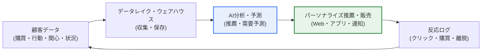
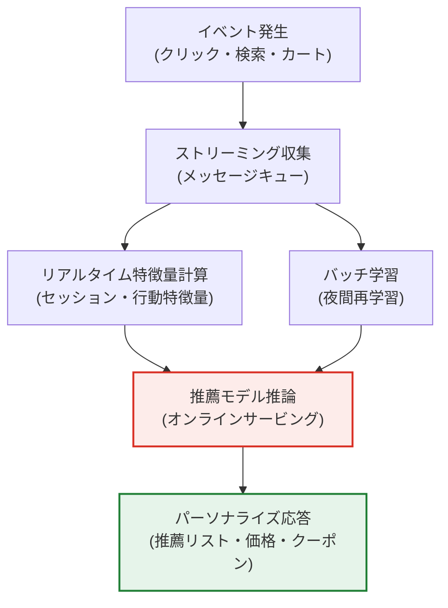

# データコマース（Data Commerce）

## 1. 概要

### A. 概念

> **データコマース**（Data Commerce）とは、顧客の**データ（購買・行動・関心・状況）を収集・分析し、パーソナライズされた商品・サービスを望む瞬間に推薦・販売する**データ駆動型の商取引方式である。データが商品棚やマーケティングに代わる中核資産となり、「何を売るか」よりも「誰に、いつ、何を提案するか」が競争力の源泉となる。

データコマースの核心的な発想は、「**データで顧客を理解し、望むものを望む瞬間に提案しよう**」というものである。従来のコマースは、すべての顧客に同一の商品を同一の陳列順で提示していた。この方式は「平均的な顧客」を想定しているが、実際には平均的な顧客など存在しない。価格に敏感な人もいればブランドへのロイヤルティが高い人もおり、同じ人でも朝と夜、通勤途中と週末とで求めるものが異なる。データコマースはこの多様性に正面から向き合う。顧客一人ひとりのデータを分析して「この顧客は今何を求めているか」を予測し、それに合わせた提案を行う。

これを可能にするのがビッグデータとAI技術である。膨大な顧客データを収集・保存し（ビッグデータ）、個人の嗜好・需要を予測し（推薦アルゴリズム・機械学習）、行動が発生した瞬間に最適な提案を出す（リアルタイム処理）。その結果、顧客は探索コストなしに自分に合った体験を得られ、企業はコンバージョン率・客単価・リピート率を高める。すなわちデータコマースは「**データ分析力がそのまま販売力**」となる商取引の進化であり、今日ではEコマース・コンテンツ・金融・リテール全般の成長エンジンとして定着している。

### B. 登場背景と必要性

データコマースが台頭した背景には、三つの構造的変化が重なっている。第一に、**デジタル接点の爆発的増加**である。Web・アプリ・キオスク・IoTを通じて顧客のクリック・滞在・カート・検索語が秒単位で蓄積されるようになり、かつては知り得なかった「購買以前の意図」までもがデータとして観察可能になった。第二に、**選択過剰のパラドックス**である。商品数が数百万件に及ぶと、顧客はかえって何を買うべきかわからなくなり離脱する。このときパーソナライズされた推薦は、探索の負担を軽減する「キュレーション」として機能する。第三に、**競争の激化**である。価格や物流が平準化されたことで、差別化の軸が「誰がより深く理解し、より的確に提案できるか」へと移った。これら三つの潮流が噛み合い、データは付加機能ではなくコマースの中心的資産となった。

### C. 主要技術

各技術は独立して機能するのではなく、データパイプライン上で有機的に結び付いている。以下の表は構成要素を整理したものであり、続く第3節で各要素が「なぜ」必要なのかを段落で説明する。

| 技術 | 内容 | コマースにおける役割 |
|---|---|---|
| **ビッグデータ分析** | 大量の顧客データの収集・保存・分析 | 顧客理解の原材料の確保 |
| **推薦システム** | 協調フィルタリング・コンテンツベース・ハイブリッド推薦 | 個人別の商品表示の決定 |
| **機械学習・AI** | 需要予測・離反予測・LTV予測 | 先回りの提案・リテンション |
| **リアルタイム処理** | ストリーミング・イベント駆動の反応 | 行動の瞬間における即時提案 |
| **ダイナミックプライシング** | 需要・在庫・競合価格に基づく価格最適化 | 収益とコンバージョンの同時最適化 |

## 2. データコマースの動作構造

データコマースは、「収集 → 保存・処理 → 分析・予測 → パーソナライズされた提案 → フィードバック学習」という循環構造を持つ。この循環が速く正確であるほどパーソナライズの品質が高まり、パーソナライズがうまくいくほどより豊富な反応データが蓄積されるという好循環（データフライホイール）が形成される。

上の構造で最も重要なのは、**フィードバックループ**である。推薦が提示された後、顧客がクリックしたか、購入したか、無視したかが再びデータとして回収され、モデルを再学習させる。初期には推薦が不慣れであっても、このループが繰り返されることで精度が向上する。逆にフィードバックの回収が遅かったり歪んでいたりすると（例：人気商品ばかりを表示して人気がさらに固定化する偏り）、パーソナライズはかえって後退する。したがってデータコマースの設計は、アルゴリズムそのものと同じくらい、「フィードバックをどれだけ正直かつ迅速に学習へ反映できるか」に左右される。

### A. 推薦システムの三つの系統

推薦システムはデータコマースの心臓部である。方式は大きく三つに分かれ、それぞれ長所と短所が明確であるため、実務では組み合わせて用いる。

**協調フィルタリング**（Collaborative Filtering）は、「自分と似た人々が好んだもの」を推薦する。ユーザー・アイテム間の相互作用行列から類似ユーザーや類似アイテムを見つけて予測し、商品の内容を知らなくても機能するという利点がある。しかし、新規顧客や新規商品には相互作用データがないため推薦が難しい**コールドスタート**（cold start）問題が生じる。Netflix・Amazonの初期の推薦の根幹はこの方式である。

**コンテンツベースフィルタリング**（Content-based Filtering）は、「自分が好んだものと似た属性の商品」を推薦する。商品のジャンル・ブランド・価格帯・キーワードといった属性をベクトル化して類似度を計算する。コールドスタートには比較的強いが、顧客がすでに見たものと似たものばかりを繰り返し推薦して多様性が低下する**フィルターバブル**のリスクがある。

**ハイブリッド・ディープラーニング推薦**は、二つの方式を組み合わせたり、ニューラルネットワークで複雑なパターンを学習したりする。近年では、ユーザーの行動順序を時系列として学習する逐次推薦、グラフニューラルネットワークに基づく推薦、そして生成AIに基づく対話型推薦が広がっている。実際の大規模コマースでは、複数モデルの結果をアンサンブルし、ビジネスルール（在庫・マージン・プロモーション）を後処理として反映して最終的な表示を決定する。

### B. リアルタイムパーソナライズのアーキテクチャ

推薦がどれほど正確でも、「遅ければ」意味がない。顧客が特定の商品を検索したそのセッション内で関連する提案を行ってこそ、コンバージョンが生まれる。以下は、リアルタイムパーソナライズの処理フローを詳細化したものである。

この構造の要点は、**オンラインサービングとバッチ学習の分離**である。重いモデル学習は夜間バッチで処理しつつ、サービス提供時にはミリ秒単位で推論結果を返さなければならない。そのために、あらかじめ計算したユーザー・商品の埋め込みをキャッシュに載せておき、セッション中に発生するリアルタイム特徴量（直前に見たカテゴリ、現在のカート金額）だけをその場で結合する。たとえばカート金額が送料無料の基準に近づいたら、少額商品を合わせて推薦して客単価を引き上げる、といった具合である。遅延が100msを超えると体感性能が急激に悪化するため、精度と応答速度のトレードオフをアーキテクチャの段階で調整することが鍵となる。

## 3. 活用分野と具体的事例

データコマースは特定の産業に限定されない。ただし産業ごとに活用の焦点が異なるが、これは各産業の収益構造と顧客接点の性格が異なるためである。

| 分野 | 活用 | 代表的な効果 |
|---|---|---|
| **Eコマース** | パーソナライズ推薦・ダイナミックプライシング・カート放棄の防止 | コンバージョン率・客単価の向上 |
| **コンテンツ・メディア** | コンテンツ推薦・サムネイルのパーソナライズ・視聴の維持 | 滞在時間・サブスクリプションの継続 |
| **金融** | 顧客に合わせた商品推薦・信用評価・不正取引の検知 | クロスセル・リスク管理 |
| **リテール** | 需要予測・在庫最適化・オフラインとの連携 | 欠品・過剰在庫の削減 |

第一に、**Amazon**は売上の相当部分が推薦エンジンから生まれているといわれており、「この商品を買った顧客が一緒に購入した商品」のような協調フィルタリングに基づく表示がクロスセルを牽引している。正確な数値は公開資料によってばらつきがあるため断定は難しいが、推薦が売上の中核的な軸であるという点は業界で一貫して観察されている。

第二に、**Netflix**は視聴履歴に基づいてコンテンツを推薦するだけでなく、同じ作品であっても顧客の嗜好に応じてサムネイル画像を変えて表示するパーソナライズを適用している。コンテンツの発見率を高めて離脱（解約）を減らすことが目的であり、推薦の失敗はそのままサブスクリプションの解約に直結するため、推薦精度が事業の存続に直接結び付いている。

第三に、**リテール・物流**では、需要予測データによって店舗別・SKU別の在庫を最適化する。特定の地域・曜日・天候によって売れ筋の商品が異なるというパターンを学習し、欠品と過剰在庫を同時に削減する。ここではパーソナライズよりも「集計された需要の予測」が中核であるという点で、Eコマースとは焦点が異なる。

## 4. 類似概念との比較

データコマースはしばしば「Eコマース」や「リテールメディア」と混同されるが、焦点が異なる。違いを理解すれば、各概念が答えようとしている問いが何であるかが明確になる。

| 区分 | 従来型Eコマース | データコマース | リテールメディア |
|---|---|---|---|
| **中心となる資産** | 商品・物流 | 顧客データ・モデル | 顧客データ・広告枠 |
| **核心的な問い** | 何を売るか | 誰に、いつ、何を | 誰に、何を広告するか |
| **収益源** | 商品マージン | コンバージョン・客単価・リテンション | 広告手数料 |
| **成否の要因** | 価格・配送 | データ品質・推薦精度 | ターゲティング・インベントリ |

従来型Eコマースが「取引をデジタルに移したもの」だとすれば、データコマースは「取引をデータで最適化したもの」である。違いが生じる根本的な理由は、**データを副産物と見るか資産と見るか**にある。従来型Eコマースもデータを蓄積するが、それを事後的なレポーティングに用いるにとどまるのに対し、データコマースはデータをリアルタイムの意思決定の入力としてフィードバックする。一方リテールメディアは、蓄積した顧客データを自社の販売ではなく「広告商品」として外部に販売するという点で、データコマースの収益モデルの拡張と見なすことができる。Amazonや韓国のCoupangが自社プラットフォームの広告で大きな収益を上げているのが代表例であり、これはデータ資産の再活用が新たな収益源を生み出すことを示している。

## 5. 深掘り：生成AIと対話型コマースへの進化

近年のデータコマースにおける最大の変化は、**生成AIとの結合**である。従来の推薦が「決められた商品リストのうち何を表示するか」であったとすれば、生成AIは顧客と自然言語で対話しながら意図を把握し、比較・要約・説明まで生成して提案する。たとえば「50万ウォン台で、子ども二人のいる家族向けのキャンプ用テントを推薦して」という質問に対して、条件を理解して候補を絞り込み、長所と短所を説明する**対話型コマース**（Conversational Commerce）が台頭している。

この変化には三つの含意がある。第一に、**コールドスタートの緩和**である。相互作用の履歴がなくても対話だけで意図を把握できるため、新規顧客のパーソナライズという長年の難題を部分的に解消する。第二に、**ロングテールの発掘**である。自然言語による質問は、定型的なカテゴリでは表現しにくいきめ細かなニーズ（「騒音が少なくアレルギーにも安全なドッグフード」）を捉え、あまり売れていなかった商品にも到達の機会を与える。第三に、**ハルシネーション**（hallucination）**のリスク**である。生成AIが存在しない商品スペックや価格をでっち上げれば信頼が崩れるため、実際の商品カタログを根拠に回答を生成する検索拡張生成（RAG）方式によって事実性を統制することが、実務上の標準として定着しつつある。

一方で、規制環境もともに進化している。個人情報保護の強化によってサードパーティCookieが廃止されつつあるなか、自社が直接収集した**ファーストパーティデータ**の価値が急騰した。同意に基づいて収集した自社データを安全に結合・分析する**データクリーンルーム**（Data Clean Room）技術が、パーソナライズとプライバシーを両立させる代替策として注目されている。すなわちデータコマースの将来の競争力は、「より多くのデータ」ではなく「同意を得た良質なデータをどれだけうまく活用できるか」へと移りつつある。

## 6. 考慮事項および示唆（技術士の観点）

1. **データ品質とプライバシーのバランスが成否を分ける。** 正確なパーソナライズには豊富なデータが必要であるが、過度な収集・活用は個人情報保護法・GDPRへの違反や顧客の離反を招く。最小限の収集・目的の明示・明示的な同意・仮名化を原則とし、データクリーンルームやプライバシー強化技術（PET）によって「パーソナライズと保護の両立」を設計しなければならない。プライバシーを規制遵守のコストではなく信頼資産として捉える視点の転換が必要である。

2. **推薦精度と偏りの管理こそが競争力である。** 不正確な推薦はかえって拒否感を与え、人気商品ばかりを繰り返し表示する偏りはロングテールを衰退させ、長期的には多様性と売上をともに損なう。A/Bテストでアルゴリズムを継続的に検証し、表示の多様性・公平性の指標を並行して管理し、フィルターバブルを緩和する探索（exploration）ロジックを意図的に組み込むべきである。

3. **リアルタイムのデータアーキテクチャとMLOpsの能力が前提条件である。** パーソナライズは、ストリーミング収集・オンラインサービング・モデル再学習が安定して回ってこそ成立する。時間の経過とともにモデル性能が低下するデータドリフトを監視し、再学習・デプロイを自動化するMLOps体制がなければ、初期の成果は持続しない。これは技術投資であると同時に、組織能力の問題でもある。

4. **生成AIとの結合時には事実性・説明可能性を統制しなければならない。** 対話型コマースはコンバージョンを高めるが、ハルシネーションや誇張のリスクを伴う。実際のカタログを根拠に回答を生成するRAG、推薦理由を顧客に説明するXAI、そして不適切な推薦を除外するガードレールを備え、信頼を守らなければならない。

5. **データ資産の二次的な収益化（リテールメディア）を戦略的に検討する。** 蓄積された顧客データは、自社の販売だけでなく広告やインサイト商品へと拡張可能な資産である。ただしデータ販売はプライバシーや競争法上の問題を伴うため、同意の範囲や匿名化の水準を明確にし、ガバナンスのもとで推進してこそ持続可能となる。

## 参考資料

- Netflix Research, "Recommendations" — https://research.netflix.com/research-area/recommendations
- Google Cloud, "What is a data clean room?" — https://cloud.google.com/bigquery/docs/data-clean-rooms
- 韓国個人情報保護委員会、仮名情報処理ガイドライン — https://www.pipc.go.kr

---

> **一言まとめ**: データコマースとは、*顧客データをAIで分析し、パーソナライズされた商品・サービスを適時に推薦・販売する*データ駆動型の商取引であり、ビッグデータ・推薦・リアルタイム処理・ダイナミックプライシングを軸にデータフライホイールを回す。近年は生成AIやデータクリーンルームと結合して進化しているが、データ品質とプライバシーのバランスと推薦の偏りの管理が成否を分ける。
