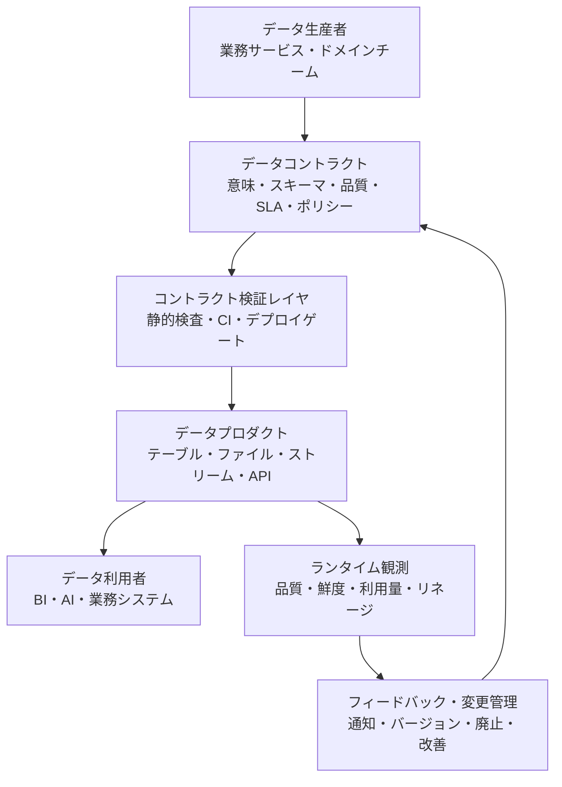
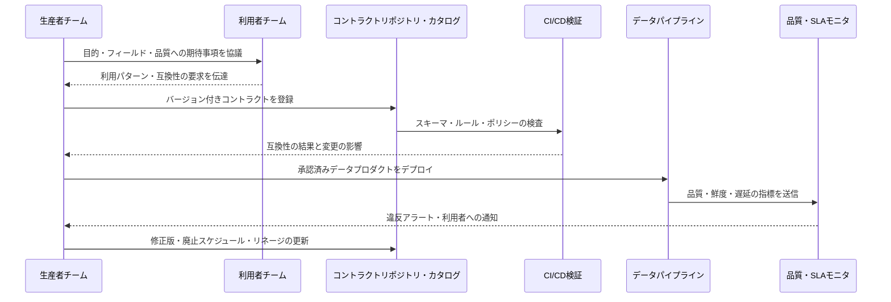
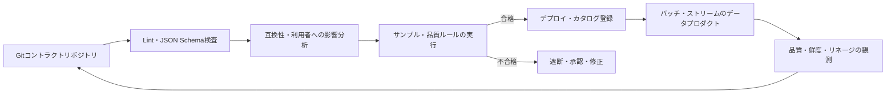

# データコントラクト（Data Contract）とデータプロダクトの信頼性

## 1. 概要

> **データコントラクト**（Data Contract）とは、データの生産者と利用者が、データの意味、構造、品質、更新・可用性、セキュリティ・アクセス条件および変更手続きを明示的に合意し、それを文書と自動化された検証によって実行する、データプロダクトのインタフェース規約である。

データプラットフォームが大きくなるほど、データの誤りはデータベース一か所の問題ではなく、複数のチームや業務プロセスへと伝播する。
注文サービスが`customer_id`を文字列から整数に変えたり、売上集計がタイムゾーンをUTCから現地時間に変えたりすると、生産チームのデプロイは成功しても、ダッシュボード・推薦モデル・精算システムが気づかれないまま誤った結果を出しかねない。
このように分散したデータパイプラインでは、利用者は生産者の内部実装を知ることが難しく、生産者は誰がどのフィールドに依存しているかを把握しにくい。
データコントラクトは、この境界に「どのようなデータを、どのような意味と品質で提供するか」という明示的な約束を置く。

単なるスキーマ文書とデータコントラクトは同じではない。
スキーマ文書はカラム名と型を知らせることに主眼があるが、コントラクトはそのフィールドが何を意味し、いつ更新され、どのような品質を満たすべきで、誰が障害に責任を持つのかまでを含む。
したがってデータコントラクトは、技術的なインタフェースであると同時に、組織間の運用契約でもある。
コントラクトの核心は文書を作成する行為ではなく、デプロイ前に違反を発見し、デプロイ後も品質と鮮度を監視し、変更を互換性ポリシーに従って管理するという実行可能性にある。

データコントラクトが必要とされる背景は、データの利用形態の変化とも関係している。
中央のデータチームがすべての変換を統制する構造では、中央のスキーマとETLルールが比較的強い統制点となる。
しかしデータメッシュのようにドメインチームがデータプロダクトを直接所有したり、複数のクラウド・ウェアハウス・ストリーミングプラットフォームを併用したりする環境では、生産者と利用者が組織的にも技術的にも分離される。
このときコントラクトは、チーム間の依存関係を透明にし、データプロダクトを再利用可能なサービスのように扱えるようにする共通言語となる。

論述答案では、データコントラクトを「スキーマの固定」に矮小化しないことが重要である。
スキーマ・意味・品質・運用・ガバナンスの五つの層を併せて提示し、設計時点のコントラクト → CIによる検証 → デプロイ → ランタイムの観測 → 変更・廃止というクローズドループを結び付けなければならない。
また、コントラクトが強いほど変更の安全性は高まるが、生産者の開発速度と運用コストが増大するため、すべてのデータに同じ強度で適用するのではないリスクベースの戦略が必要である。

### A. 登場背景と必要性

第一に、データのサイロ化と引き継ぎのコストを削減しなければならない。
生産チームのコードを読まなくても、利用チームがデータセットの意味と利用条件を理解できてこそ、分析・AI・業務システムの開発のボトルネックが減る。
コントラクトは、データセットの説明、担当者、例、アクセス方法を一か所に集約し、発見可能性を高める。

第二に、パイプラインのサイレントな失敗を前段で遮断しなければならない。
カラムが欠落したり型が変わったりしているにもかかわらず、ロードジョブ自体は成功してしまうことがある。
コントラクトの検証をCIまたはデプロイ前の段階に組み込めば、下流で障害が発生する前に、生成物の形式がコントラクトと一致しているかを判断できる。

第三に、データ品質の責任を利用者に押し付けてはならない。
利用者が毎回欠損率・重複率・鮮度を検査し直すと、同じ検査が複数のチームで重複し、品質問題を発見しても原因となったチームを突き止めにくい。
生産者が品質指標とサービスレベルをコントラクトに含めれば、品質のオーナーシップはデータが生成される地点へと移る。

第四に、変更を予測可能な形で管理しなければならない。
フィールドの削除や意味の変更は、利用者に直接影響を与える互換性を破壊する変更である。
コントラクトのバージョン、変更の承認、利用者への告知、並行提供と廃止期間を運用ルールとして定義すれば、「デプロイして初めて壊れる」状況を減らすことができる。

## 2. データコントラクトの範囲と構成要素

データコントラクトは、一つのYAMLファイルや一枚の表を指すものではない。
組織の合意が実際のデータプロダクトに反映されるよう、ビジネス上の意味から物理的な接続情報までを階層的に構成する。
以下の構造は、生産者と利用者の間の約束が実行経路にどのように結び付くかを示している。



### A. ビジネス上の意味とデータセット識別子

コントラクトの最初の部分では、データセットが何を表すかを定義する。
名前を`orders`と書くだけでは、注文作成イベントなのか決済完了注文なのか、キャンセルされた注文を含むのかがわからない。
したがって、目的、対象範囲・除外範囲、基準時点、金額の通貨や税込みか否かのように、解釈結果を変える意味を文章で明示しなければならない。
同じ物理テーブルであっても、利用目的が異なるのであれば別々の論理データプロダクトに分けるほうが安全である。

識別子は、組織内でデータセットを安定して参照できるよう、ドメイン、プロダクト名、データセット名、バージョンの組み合わせで設計する。
たとえば`commerce.order.completed`は注文ドメインの完了注文という意味を伝え、物理ストレージが変わっても論理識別子は維持できる。
コントラクトには、所有チーム、技術担当者、問い合わせチャネル、データ分類など、責任と統制に必要なメタデータも含める。
これらの情報がなければ、コントラクト違反が発見されても、誰が判断し復旧するのかを決められない。

### B. スキーマと意味上の制約

スキーマ層では、フィールド名、論理型、物理型、必須か否か、主キー、関係、許容されるコード値を定義する。
論理型は「顧客識別子」のような業務上の意味を表し、物理型は`string`、`integer`、`timestamp`のように保存・伝送の形式を表す。
二つの型を分離すれば、同じ業務上の意味がシステムごとの物理型にマッピングされる際に意味が失われない。
たとえば注文番号は数字のみで構成されていても算術計算の対象ではないため、整数よりも文字列として扱うほうが安全な場合がある。

フィールド定義には説明と例を併記する。
`status`に`P`、`C`、`X`のみを許容すると書くことと、「決済待ち・完了・キャンセルを意味する」と書くことは、異なるレベルのコントラクトである。
前者は形式の検証を可能にし、後者は業務上の解釈の一貫性を保証する。
機微情報が含まれ得る場合は、個人情報の等級、マスキング方法、保存期間、目的外利用の制限もスキーマの横に結び付けなければならない。

### C. データ品質とサービスレベル

データ品質は、正確性・完全性・一貫性・有効性・一意性・適時性のように測定可能なルールへと置き換える。
「正確なデータの提供」は検証できないが、「完了注文の`order_id`の欠損率は0%で、同一注文番号の重複率は0.1%未満」であれば検証できる。
品質ルールには、測定対象、計算ウィンドウ、閾値、重大度、違反時の措置と例外承認の主体を併記しなければならない。

サービスレベルは、データの運用上の約束を説明する。
たとえば、日次バッチのデータは毎日6時までに提供し、ストリーミングイベントは生成後5分以内に到着しなければならず、障害時には最後の正常なデータの時刻と復旧目標を告知する、と定めることができる。
可用性だけを書くと、データが存在していても古い状態であるという問題を見逃すため、鮮度・遅延・完全性・サポート時間を目的に応じて併せて管理しなければならない。

次の表は、コントラクトの代表的な構成要素と設計上の問いを整理したものである。
表に列挙された項目を、実際の運用上の文章と検証ルールへと変換することが要となる。

| 領域 | コントラクトに含める内容 | 検証・運用上の問い |
|---|---|---|
| 識別・所有 | データセットID、ドメイン、バージョン、生産者、責任者 | 障害と変更承認の主体は明確か |
| ビジネス上の意味 | 目的、範囲、基準時点、用語、対象・除外ルール | 生産者と利用者が同じ値を同じ意味で解釈しているか |
| スキーマ | フィールド名、論理・物理型、必須、キー、コード値 | デプロイ結果が宣言された構造と互換性があるか |
| 品質 | 欠損・重複・有効性・正確性のルール、閾値 | どの時点で、どのクエリで測定するか |
| 鮮度・SLA | 更新周期、遅延、可用性、復旧・告知目標 | 遅れたり途切れたりしたデータに利用者が気づけるか |
| アクセス・セキュリティ | 認証、権限、暗号化、分類、保存・削除 | 最小権限と目的制限が適用されているか |
| リネージ・サポート | ソース、変換、利用者、問い合わせ・エスカレーション | 影響分析と障害時の連絡が可能か |

## 3. コントラクトの動作原理とライフサイクル

データコントラクトは作成後に保管しておく文書ではなく、データプロダクトのライフサイクルを貫く統制点である。
コントラクトの草案が作られた後、利用者の要求を確認し、保存・伝送の形式に合わせて検証ルールを実装し、デプロイパイプラインとランタイムの監視に結び付ける。
以下のフローは、コントラクトを変更する際の一般的なクローズドループを示している。



### A. 発見と協議

最初から全社のすべてのデータセットについてコントラクトを作ると、文書ばかりが増えて実質的な合意は弱くなる。
利用者が多い、あるいは障害コストの大きい共用データプロダクトから候補を選定し、実際の利用SQL・ダッシュボード・モデル入力を調査する。
生産者が認識している意図と利用者が期待する慣行の間には差があるため、コントラクトの作成は一方的なスキーマの告知ではなく、協議のプロセスでなければならない。

協議の段階では、フィールドごとに「欠落し得るか」、「値が変わると何が壊れるか」、「過去データを再処理するか」を問う。
たとえば`customer_id`が退会後も維持されるのか、`created_at`がイベント生成時刻なのかロード時刻なのか、金額がウォン建てなのか決済通貨建てなのかが不明確であれば、コントラクトがあっても誤った分析となる。
この段階でドメイン用語集とリネージを併せて結び付ければ、データコントラクトは単なるスキーマファイルを超え、共通の意味モデルへと発展する。

### B. 検証とデプロイゲート

コントラクトファイルは、構文の検証、スキーマの検証、互換性の検証、データサンプルの検証の順に確認する。
構文の検証ではYAML・JSONの形式と必須キーを確認し、スキーマの検証ではカラムの型・必須か否か・コード値を確認する。
互換性の検証では新バージョンが既存利用者のクエリを壊すかどうかを判断し、サンプルの検証では実際のレコードが宣言されたルールを満たしているかを確認する。

検証は開発者のノートPCで終わらせるのではなく、CI/CDパイプラインのデプロイゲートとならなければならない。
たとえば既存フィールドの削除が検知されれば失敗させ、任意フィールドの追加は利用者が無視できる場合に限って許可し、品質閾値を引き下げる変更は承認ステップへ回す、といったことができる。
ただし、データベースの制約が実際に強制されるかどうかはストレージプラットフォームによって異なるため、「コントラクトで宣言した」ことと「ランタイムで強制される」ことを区別しなければならない。

### C. バージョンと互換性

コントラクトのバージョン戦略では、変更の種類と利用者への影響を併せて考える。
既存フィールドの意味・型の変更やフィールドの削除は、一般に後方互換性のない破壊的変更である。
一方、任意フィールドの追加は、利用者が未知のフィールドを無視し、生産者がデフォルト値を保証するのであれば、後方互換となり得る。
しかし、すべてのフォーマットと利用者がこの原則を自動的に保証するわけではないため、実際の利用パターンを確認しなければならない。

互換性は、生産者の視点と利用者の視点とで異なる。
生産者は新しいフィールドの追加を安全だと考えるかもしれないが、`SELECT *`の結果を位置でパースしている利用者は、列数の増加によって壊れる可能性がある。
したがってコントラクトの検証は、データフォーマットだけを見るのではなく、登録された利用者・クエリ・パイプラインと結び付けなければならない。
破壊的変更が避けられない場合は、新バージョンを並行提供し、利用者の移行状況と廃止日を追跡したうえで旧バージョンを削除する。

| 変更例 | 一般的な互換性の判断 | 安全な対応 |
|---|---|---|
| 任意フィールドの追加 | 利用者が未知のフィールドを無視すれば互換 | デフォルト値・文書・利用者テストを確認 |
| 必須フィールドの追加 | 既存レコード・利用者の入力が失敗し得る | 任意として提供した後、段階的に必須化 |
| フィールドの削除 | 既存のクエリやモデルが失敗し得る破壊的変更 | 新バージョン・並行提供・廃止の告知 |
| 型の変更 | パース・計算・保存精度が変わる | 新フィールドまたは新バージョンへ移行 |
| 意味・単位の変更 | 形式が同じでも分析結果が変わる | 意味の変更を破壊的変更として扱う |
| 許容コード値の縮小 | 既存データが無効になり得る | 利用への影響分析と猶予期間の運用 |

### D. ランタイムの観測と違反への対応

CIはデプロイ時点の構造を検証するが、デプロイ後に発生する遅延・欠損・重複・分布の変化までは保証しない。
したがってランタイムでは、データ品質モニタとコントラクトモニタを結び付けなければならない。
コントラクトの各ルールを測定指標に置き換え、ベースラインと閾値を比較して、正常・警告・重大の状態を判断する。

違反が検知された場合に、データプロダクトを無条件に遮断するのか、利用者に警告して最後の正常なバージョンを提供するのか、ポリシーをあらかじめ定めておく。
決済・精算のように誤った値のコストが大きいデータでは安全な停止と再処理が優先され、探索的分析用のデータでは遅延を知らせながら部分的に提供する戦略も可能である。
重要なのは、利用者が違反の事実と影響範囲を知ることができなければならないという点である。
アラートには、コントラクトID、違反したルール、最初の発生時刻、影響を受ける利用者、最後の正常時点、担当者と復旧予定時刻を含める。

## 4. 実装アーキテクチャと例

データコントラクトの実装は、コントラクトリポジトリ、スキーマ・品質の検証器、データカタログ、パイプラインオーケストレータ、ランタイムモニタを連携させた形で設計できる。
コントラクトリポジトリはGitでバージョン管理し、カタログはコントラクトとリネージ・ユーザー・アクセスポリシーを検索可能にする。
検証器はデプロイ前の静的検査とサンプル・実データの検査を行い、オーケストレータは検証の合否を次のステップの実行条件として用いる。



以下は特定の標準の完全な例ではなく、注文完了データプロダクトを説明するための概念的なコントラクトの例である。
実際の組織では、使用する標準やプラットフォームのフィールド名に合わせて変換しつつ、意味・品質・運用上の約束を併せて表現しなければならない。

```yaml
apiVersion: data.example/v1
kind: DataContract
id: commerce.order-completed
version: 2.1.0
owner:
  team: commerce-data
  contact: data-commerce@example.org
purpose: 決済が完了した注文の分析・精算用データプロダクト
schema:
  - name: order_id
    logicalType: string
    physicalType: varchar
    required: true
    unique: true
  - name: completed_at
    logicalType: timestamp
    physicalType: timestamp_tz
    required: true
  - name: amount
    logicalType: decimal
    physicalType: decimal(18,2)
    required: true
    description: 税金と割引を反映した後の決済通貨建ての金額
quality:
  - rule: not_null
    column: order_id
    threshold: 100%
  - rule: freshness
    maxDelay: 5m
serviceLevel:
  availability: 99.5%
  support: business-hours
```

上の例では、`order_id`の一意性は単純な型では表現されず、品質ルールによって検証される。
`amount`は数値という形式だけでなく、税金・割引・通貨の基準を併せて明示してこそ、利用者が売上を正しく解釈できる。
`freshness`は、データが存在するかどうかとは別に、最後のイベントがどれだけ遅れて到着したかを測定する。
このようにコントラクトは、スキーマ、品質、運用目標が互いに補完し合うように設計しなければならない。

たとえば1日100万件の注文のうち0.5%が欠落すると、5,000件の分析・精算対象が失われる。
生産パイプラインが「成功」状態を返したという事実だけでは、この損失を発見できない。
コントラクトに完全性の閾値と欠落の検知方法、再処理の手順を含めれば、バッチ終了後の品質検証で問題を明らかにし、影響範囲を算出できる。
精算データであれば、閾値違反時に利用テーブルを更新せず前日の正常なスナップショットを維持するという安全な失敗戦略も、コントラクトの運用ポリシーとして結び付けることができる。

## 5. 類似概念との比較

データコントラクトは、データ品質テストやデータカタログを代替する単一のツールではない。
各技術はデータライフサイクルの異なる問題を扱っており、コントラクトはそれらを結び付ける合意とインタフェースの役割を担う。
これらを区別しなければ、カタログに文書を載せただけでコントラクトが適用されたと誤解したり、テストを大量に書いても生産者の責任と変更手続きを見落としたりすることになる。

**スキーマレジストリ**は、主にイベント・メッセージのスキーマとシリアライズの互換性を管理する。
これに対しデータコントラクトは、ビジネス上の意味、品質、SLA、オーナーシップとアクセスポリシーにまで範囲を広げる。
スキーマレジストリはストリーミングの互換性の技術的基盤であり、データコントラクトはストリームとバッチ・テーブル・ファイルを包括するプロダクトレベルの運用上の約束であるといえる。

**データ品質テスト**は、実際のデータの内容と分布を検証する実行ルールである。
コントラクトは何を保証すべきかを宣言し、テストはその保証をどのようなクエリ・プロファイリング・統計で確認するかを実装する。
コントラクトで宣言された品質項目がテストに結び付かなければコントラクトは文書にとどまり、テストだけが存在すれば、なぜその閾値が必要なのかや責任者が不明確になる。

**データカタログ**は、データセットを検索し、メタデータ・リネージ・ユーザーを探索する知識システムである。
コントラクトはカタログに表示され得るが、カタログがあるからといってコントラクトが自動的に強制されるわけではない。
カタログは発見性と影響分析を高め、コントラクトは予測可能な提供条件と変更の統制を定義する。

**APIコントラクト**（OpenAPIなど）は、リクエスト・レスポンスを中心とした同期型サービスのインタフェースを定義する。
データコントラクトもインタフェースであるという点は同じだが、大量のバッチ・イベントストリーム・テーブルの品質・鮮度・再処理・保存の特性までを考慮する。
データプロダクトがAPIとして公開される場合はAPIコントラクトとデータコントラクトを結び付けるが、どちらか一方にすべての要求事項を詰め込まないほうがよい。

| 区分 | データコントラクト | スキーマレジストリ | 品質テスト | データカタログ | APIコントラクト |
|---|---|---|---|---|---|
| 主な対象 | データプロダクト・生産者・利用者の合意 | メッセージスキーマ | 実際のデータの状態 | データ探索・メタデータ | サービスのリクエスト・レスポンス |
| 核心的な問い | 何を、どのような条件で提供するか | このメッセージ形式は互換性があるか | データがルールを満たしているか | どこにどのようなデータがあるか | API呼び出しの形式は正しいか |
| 範囲 | 意味・構造・品質・SLA・責任 | 構造・シリアライズ | 欠損・分布・整合性など | 説明・リネージ・オーナー | パス・メソッド・レスポンス |
| 実行時点 | 設計・CI・デプロイ・ランタイム | 生産・利用時点 | 定期・バッチ・パイプライン | 主に照会・影響分析 | 呼び出し時点 |
| 変更管理 | バージョン・互換性・廃止・通知 | 互換性モード | ルールの変更 | メタデータの更新 | APIバージョン・deprecated |

## 6. 事例と適用戦略

### A. 小売の注文データプロダクトの事例

小売企業が、注文完了データを分析・精算・推薦の各チームに提供すると仮定する。
当初は運用DBを分析チームが直接照会していたため、スキーマ変更がそのままダッシュボードのエラーにつながり、配送キャンセルが売上集計に含まれるかどうかについてチームごとに解釈が異なっていた。
データプロダクトの所有チームは、注文完了イベントと精算用テーブルを分離し、コントラクトに基準時点・ステータスの定義・金額の算式・鮮度・オーナー・廃止ポリシーを記録する。

コントラクトのバージョン1では`amount`がウォンのみに対応していたが、海外販売のために通貨コードが必要になったとしよう。
既存の`amount`の意味を外貨金額に変えると、形式は同じでも意味が変わるため破壊的変更となる。
安全な方法は、`amount_local`と`currency_code`を新たに追加し、換算基準と為替レートの時点を別のフィールドとして提供したうえで、利用者を移行させることである。
精算の利用者が旧バージョンのウォン建て金額のみを使っているのであれば、一定期間二つのバージョンを並行させ、財務の締め処理の周期と衝突しないようにする。

### B. 機械学習の特徴量パイプラインの事例

推薦モデルが`customer_7d_order_count`を入力として使っているとしよう。
生産チームが集計ウィンドウを「直近7日間」から「直近の暦週」に変えると、カラムの型と名前は同じでもモデルにとっての意味が変わる。
したがってコントラクトには、集計ウィンドウの境界、タイムゾーン、未来のデータが混入してはならないというリーク防止ルール、欠損の処理方法、生成遅延の目標を明示しなければならない。
モデル性能の低下が発生したときにスキーマしか検査していなければ原因を突き止められないが、意味と分布のベースラインを併せて観測していれば、変更の時点を追跡できる。

この事例において、コントラクトはモデルチームの開発を妨げるための文書ではない。
むしろ特徴量の意味と生成条件を合意することで学習とサービングの不一致を減らし、モデルの再学習やロールバックの判断根拠を提供する。
ただし、すべての特徴量に同一のSLAを課すとコストが大きくなるため、リアルタイム推論に使われる中核的な特徴量と実験用の特徴量を分類し、検証の強度に差をつける。

### C. 段階的な導入ロードマップ

最初の段階では、最も広く共有され、障害コストの大きいデータプロダクトを選定する。
オーナーと利用者を確認し、現在のスキーマ・品質・鮮度・リネージをベースラインとして測定する。
最初から完璧な目標値を宣言するよりも、現状を透明に記録したうえで改善目標を別バージョンとして管理するほうが、組織の抵抗を小さくできる。

第二の段階では、コントラクトをGitリポジトリとCIに結び付ける。
必須フィールド・型・基本的な品質ルール・互換性の検査を自動化し、失敗時にはどの利用者に影響があるかを表示する。
第三の段階では、カタログとランタイムモニタを連携させ、コントラクト・リネージ・品質・利用量を一つの画面で確認できるようにする。
最後に、標準テンプレートと教育を展開するが、共用データ・機微データ・規制対象データに優先順位を置く。

## 7. 深掘り：データメッシュ・dbt・ODCSとの連携

データメッシュ環境において、データコントラクトはドメインごとのデータプロダクトの境界を明示する実務上の仕組みである。
ドメインチームが生産を所有していても、組織全体で利用できる意味・品質・アクセスのルールが必要だからである。
コントラクトをセルフサービスプラットフォームのテンプレートとして提供すれば、チームごとに形式を一から設計しなくても、責任者・リネージ・品質・SLAを一貫して登録できる。
ただし、連邦型ガバナンスとは中央チームがすべてのフィールドを承認する方式ではなく、共通の最小ルールとドメイン別の拡張ルールを組み合わせるものでなければならない。

dbtのモデルコントラクトは、モデルが返すデータセットの構造を明示するものであり、コントラクトを強制すると、ビルド前（preflight）にカラム名と型が期待どおりかを確認し、不一致であればビルドを失敗させるという形で活用される。
dbtのドキュメントも、下流で依存される公開モデルにコントラクトを定義するアプローチを推奨しているが、制約が実際に強制されるかどうかはデータプラットフォームとマテリアライゼーションの方式によって異なり得ると説明している。
したがってdbtのコントラクトを導入する際には、コントラクトの宣言、データテスト、ウェアハウスの制約の違いを確認しなければならない。

Open Data Contract Standard（ODCS）は、データコントラクトを表現するオープンなYAML構造であり、基本情報・スキーマ・参照・データ品質・サポートチャネル・価格・チーム・ロール・SLA・サーバ・カスタムプロパティといったカテゴリを定義している。
この標準を適用すれば、特定のカタログやウェアハウスに依存しない交換形式を作ることができるが、標準ファイルが存在するからといって品質検証やSLAの執行が自動的に完了するわけではない。
組織は、ODCSのような表現形式、dbt・Great Expectationsのような検証ツール、カタログ・モニタリングプラットフォームを、それぞれの役割に応じて組み合わせなければならない。

最新のデータプラットフォームの方向性は、コントラクトを設計文書からポリシーコードとプロダクトのメタデータへと拡張することである。
コントラクトの変更がpull requestとして提案され、自動的な影響分析・品質サンプリング・ドキュメント生成・カタログ更新・利用者への通知が連鎖的に実行されれば、データプロダクトのデプロイの安全性が高まる。
逆に、自動化によって意味の変更を完全に判断することはできないため、金額・個人情報・モデルの特徴量のように業務上の文脈が重要な変更には、ドメイン担当者による承認を残さなければならない。

## 8. 考慮事項および示唆

### A. コントラクトの強度と開発速度のバランス

コントラクトを厳格にするほど利用者にとっての予測可能性は高まるが、生産者の実験や変更のスピードは遅くなる。
中核となる精算・規制データには強力な遮断と承認手続きを適用し、探索・実験用のデータには警告中心の柔軟なポリシーを適用するという、リスクに基づく区分が必要である。
コントラクトの目的は変更を禁止することではなく、変更のコストと影響を事前に可視化することである。

### B. 意味のコントラクトと形式のコントラクトの分離

型とカラムを検証しても、「売上」の計算基準や「アクティブユーザー」の定義が異なれば、結果は変わる。
したがって、用語集、レコード例、計算式、単位、タイムゾーン、対象・除外条件をコントラクトの説明層に含めなければならない。
意味の変更はコードのdiffでは捉えられない場合があるため、生産者・利用者間の協議と承認の記録を別途残す。

### C. 品質指標の測定可能性と責任

品質ルールは、測定クエリと計算ウィンドウがあってはじめて運用できる。
欠損率の分母が全行なのか特定ステータスの行なのか、鮮度の基準時刻がイベント生成なのかロードなのかを合意しなければ、同じデータから異なる結果が得られる。
各指標にオーナー・アラートレベル・復旧目標・例外承認者をマッピングし、品質ダッシュボードを責任体系と結び付けなければならない。

### D. 互換性と廃止ポリシー

互換性のルールはフォーマットだけでは決まらず、利用者の使い方によって変わる。
`SELECT *`、位置ベースのパース、ハードコードされたコード値を用いる利用者は、任意フィールドの追加でも影響を受ける可能性がある。
利用者の登録と利用量の計測によって実際の影響範囲を把握し、新バージョンの並行提供・移行支援・明確な廃止日を運用する。

### E. 個人情報・セキュリティ・規制の内在化

データコントラクトは、品質のコントラクトであると同時に、保護措置の出発点ともなり得る。
機微度、アクセスロール、暗号化、マスキング、保存期間、削除・訂正要求への対応、国外移転の制限を、データプロダクトのメタデータに結び付ける。
しかし、コントラクトに「暗号化済み」と書くだけで統制が完了するわけではないため、IAMポリシー・鍵管理・アクセスログ・監査証跡を実際のシステムと照らして検証しなければならない。

### F. 標準とプラットフォームの分離

特定ツールの設定ファイルをそのまま全社標準として採用すると、プラットフォームを入れ替える際にコントラクト資産を失いかねない。
論理的なコントラクトとプラットフォーム別の実行設定を分離し、標準フィールドからdbt・ストリーミングスキーマ・ウェアハウス制約へと変換するアダプタレイヤを置くことが、可搬性の面で有利である。
ただし、抽象化が過ぎるとプラットフォームの実際の強制の限界を覆い隠しかねないため、どのルールが宣言のみで、どのルールが実際に遮断されるのかを明示しなければならない。

### G. 技術士の観点からの導入判断

技術士は、データコントラクトをツール導入プロジェクトではなく、データ運用モデルの変革として判断すべきである。
まずデータプロダクトの候補と失敗のコストを評価し、標準テンプレート・オーナーシップ・変更管理・品質測定・プラットフォーム連携を一つのガバナンス体系として設計する。
成果指標は、コントラクトの登録数を数えるだけでなく、スキーマ変更に起因する障害の減少、平均復旧時間、品質違反の事前検知率、利用者のオンボーディング時間といった結果指標として設定しなければならない。

## 参考資料

- dbt Developer Hub, “Model contracts”: https://docs.getdbt.com/docs/mesh/govern/model-contracts
- dbt Developer Hub, “contract configuration”: https://docs.getdbt.com/reference/resource-configs/contract
- Open Data Contract Standard v3.1.0: https://bitol-io.github.io/open-data-contract-standard/v3.1.0/
- Bitol Open Data Contract Standard repository: https://github.com/bitol-io/open-data-contract-standard

---

> **一言まとめ**: データコントラクトとは、生産者と利用者がデータの意味・構造・品質・運用条件を合意し、CI・ランタイムの検証によって実行することで、分散したデータプロダクトの変更の安全性と信頼性を高めるインタフェースである。
