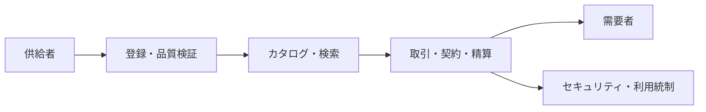

# データ取引所（Data Exchange/Marketplace）

## 1. 概要

### A. 定義
> データの供給者と需要者が**データを一つの商品（資産）として取引**できるよう、登録・検索・価格算定・流通・精算・利用統制を一貫して支援する**仲介プラットフォーム**。

データ取引所は、本質的にデータを対象とした「市場（Market）」である。伝統的な市場が財の探索・価格形成・契約・決済を一か所に集めて取引コストを下げるように、データ取引所も散在するデータをカタログに集めて**探索コストを下げ、価値評価によって価格を形成し、標準的な契約・精算によって取引を完結**させる。すなわちデータ取引所の存在意義は、個々の企業がいちいちデータの供給元を探し、交渉・契約・精算していた高い取引コストを、プラットフォームが代わりに吸収する点にある。

### B. 登場背景および必要性
データが「21世紀の石油」と呼ばれるほどAIの学習・分析の需要が急増したが、実際に必要なデータは個々の企業・機関の内部に閉じ込められて流通しない**データサイロ**（silo）の問題が大きかった。流通を阻んでいた決定的な障害は二つあった。一つは個人情報保護と所有権に関する法的な不確実性であり、もう一つは「このデータにいくらの価値があるか」を判断する基準の欠如である。韓国では、**データ3法の改正**（2020年）によって仮名情報の活用根拠が、**データ産業振興法**（2022年）によってデータ取引・分析提供・安心区域の法的根拠が整備され、流通の制度的な土台が築かれた。その結果、データ取引所は、断片化したデータを市場メカニズムによって循環させるインフラとして浮上した。

## 2. 構成要素

データ取引所は、商品の登録から精算までの流れを四つの軸で支えている。**データカタログ**は取引所の心臓部であり、データの出所・スキーマ・更新周期・品質指標といったメタデータを標準様式で登録し、需要者が実際のデータを開かなくても適合性を判断できるようにする。カタログが不十分であれば、「何があるのかわからない」という探索の失敗によって取引そのものが成立しない。**価格算定・精算**は、データの価値を貨幣単位に換算し、ダウンロードやAPI呼び出し量などに応じて課金・精算する機能である。**取引・契約**は、利用目的・期間・再販売禁止といった条件をライセンスとして明文化し、紛争を予防する。**セキュリティ・利用統制**は、アクセス権限の管理、仮名・非識別処理、利用履歴の追跡によって、契約違反や個人情報の漏えいを防ぐ。

| 構成 | 役割 | 不十分な場合の問題 |
|---|---|---|
| **データカタログ** | メタデータ・品質情報の登録・検索 | 探索の失敗による取引不成立 |
| **価格算定・精算** | 価値評価、課金・精算 | 価格への信頼低下、取引の萎縮 |
| **取引・契約** | 利用条件・ライセンスの管理 | 誤用・濫用、所有権をめぐる紛争 |
| **セキュリティ・統制** | アクセス制御、仮名・非識別化、利用追跡 | 個人情報の漏えい・再識別 |

## 3. 取引データの類型と取引方式

取引対象は、整備前の**生（Raw）データ**から分析・ラベリングを経た**加工データセット**まで幅広く、加工度が高いほど需要者がすぐに活用できるため、価格も高く形成される。取引方式はデータの機微度によって異なる。機微でないデータは**ファイルダウンロード**や**API連携**によって実データをそのまま引き渡すが、個人情報を含む機微データは、原本を持ち出さずに統制された**データ安心区域**の中で分析のみを行い、結果だけを持ち出す方式をとる。価格は、データ構築にかかった費用を根拠とする**原価ベース**、類似データの相場を参照する**市場ベース**、そのデータによって創出される将来の収益を推定する**収益ベース**のアプローチを組み合わせて算定するが、無形で複製可能というデータの特性上、いずれも完結的ではなく、価値評価は依然として難題として残っている。

## 4. 主要な論点

データ取引所の活性化を阻む論点は、互いに絡み合っている。**プライバシー**の面では、個別には非識別化されたデータであっても、他のデータと結合すると個人が再び特定される**再識別リスク**があるため、仮名化やPET（プライバシー強化技術）の適用が前提となる。**価格・品質**の面では、公認された価値評価の基準がないため同じデータでも取引所ごとに価格が異なって信頼を得にくく、データの正確性・最新性を保証する品質体系も不十分である。**信頼・標準**の面では、データの所有権・著作権の帰属やライセンスの範囲が曖昧であり、取引所間でメタデータの形式が異なるため相互運用ができないという問題がある。たとえば韓国データ取引所（KDX）や金融データ取引所のような韓国国内のプラットフォームでも、初期の取引実績の低迷の相当部分は、この価値評価と品質への信頼の問題に起因していた。

| 論点 | 原因 | 対応 |
|---|---|---|
| **プライバシー** | 結合による再識別 | 仮名化・PET・安心区域 |
| **価格・品質** | 評価基準の欠如、品質の未保証 | 価値評価の標準・品質認証 |
| **信頼・標準** | 所有権・ライセンスの曖昧さ | 標準メタデータ・契約テンプレート |

## 5. 考慮事項および示唆
- **価値評価・品質の標準化が活性化の鍵**: 市場が信頼する共通の価格・品質基準がなければ、取引は生まれない。政府・業界共同の価値評価ガイドと品質認証体系の確立が先決課題である。
- **安全な流通アーキテクチャとの結合**: 仮名情報の結合、データ安心区域、PET（差分プライバシー・準同型暗号）と連携し、「活用はするが原本は渡さない」構造をデフォルトとすべきである。
- **国家データエコシステムの軸**: マイデータ（個人主導の流通）、データダム（公共データの集積）とともに、データ取引所はデータ経済の循環を完成させるインフラであり、今後はデータ信託・データスペース（EU Data Spaces）へと拡張していく見通しである。

---

> **一言まとめ**: データ取引所とは、*データを商品として登録・検索・取引・精算する*仲介プラットフォームであり、カタログ・価値評価・契約・セキュリティ統制を備え、再識別・品質・価値評価の標準化の問題を解決してはじめて活性化する。安心区域・PET・マイデータと連携する国家データエコシステムの軸である。
