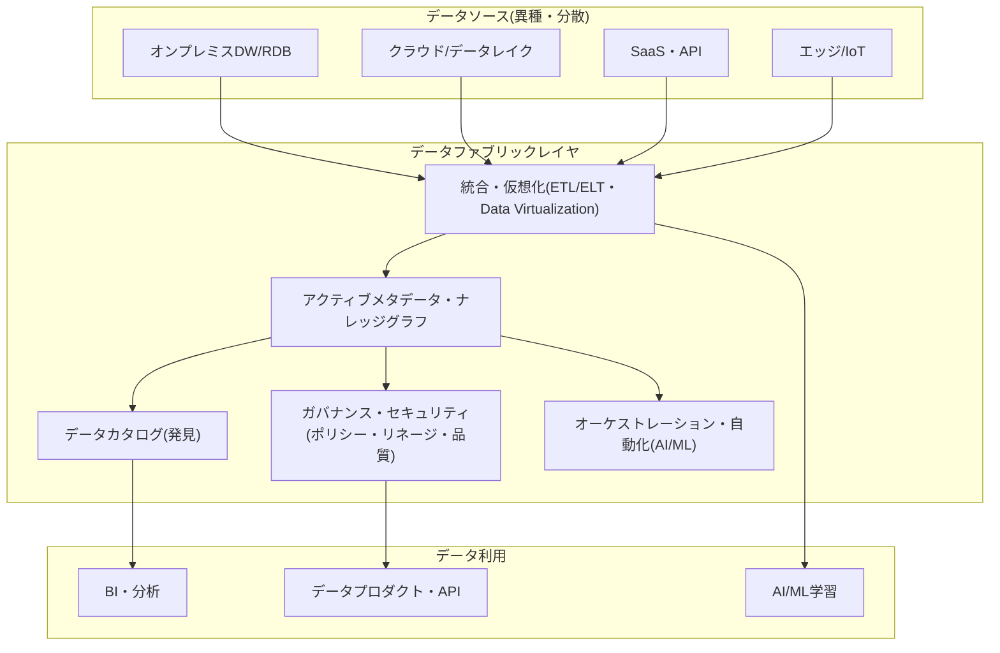
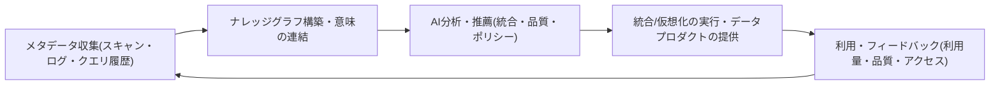

# データファブリック（Data Fabric）

## 1. 概要

### A. 定義

> **データファブリック**（Data Fabric）とは、分散・異種環境に散在するデータ資産を物理的に一か所へ集めることなく、**アクティブメタデータ（active metadata）とナレッジグラフ、AI/MLに基づく自動化**を活用して、発見・統合・ガバナンス・提供を一つの一貫した論理レイヤとして織り上げるデータ管理アーキテクチャであり、設計概念である。

データファブリックは特定の製品一つを指すものではなく、複数の統合・カタログ・ガバナンス技術をメタデータ中心に結合し、「どこにどのようなデータがあり、どのように信頼・接続・利用できるか」に自動で答えられるようにするアーキテクチャパターンである。
従来のデータ統合は、ソースごとに人が手作業でETLパイプラインを設計し、データが移動するたびに新たなコピーと新たなパイプラインが増えていく構造であった。
データファブリックは、この反復作業を、**メタデータを観察・学習して統合を半自動的に推薦・実行する**方式に置き換えようとするものである。

中核となる視点は、「データをもっと複製して中央リポジトリを大きくしよう」ではなく、**データは元の場所に置いたまま（仮想化優先）、メタデータで全体を見通し、必要なときだけ移動させよう**というものである。
したがってデータファブリックは、ストレージ技術の問題ではなく、メタデータ・自動化・ガバナンスを併せて設計しなければならない、情報管理技術士らしいテーマである。

### B. 登場背景と必要性

第一に、データの爆発的な分散である。
オンプレミスのDW、複数のパブリッククラウド、SaaS、データレイク、エッジなどにデータが散在するようになり、いずれか一つのリポジトリにすべてを集める中央集権的な戦略は、コスト・遅延・規制の面で限界に突き当たった。
データを移動させずに統合的に扱える論理レイヤが必要になったのである。

第二に、手作業による統合のスケーラビリティの欠如である。
ソースと利用先の組み合わせが増えるほどパイプラインの数は組み合わせ的に増加し、少数のデータエンジニアではすべてのスキーマ変更や品質問題に追いつけない。
メタデータを分析して統合を自動的に推薦し、自己修復するアプローチが求められる。

第三に、ガバナンスと規制遵守への圧力である。
個人情報保護法やGDPRなどは、データのリネージ（lineage）・目的・アクセス履歴を証明することを求めている。
データが散在するほどリネージの追跡やポリシーの一貫した適用が難しくなるため、グローバルなメタデータにポリシーを結び付けて自動執行する構造が必要となる。

第四に、セルフサービスとデータ価値実現のスピード（time-to-value）への要求である。
現場の分析者やAIチームがIT部門を経由せずに、信頼できるデータを自ら見つけて使えるようにするには、検索可能なカタログと自動化された準備・提供レイヤによる裏付けが必要である。

## 2. アーキテクチャと中核構成要素

データファブリックは、物理レイヤ（多様なソース）の上に、メタデータを中心とした複数の論理レイヤを積み上げた構造として理解できる。
以下の概念図は、ソースから利用までデータファブリックがどのようなレイヤで構成されるかを示している。

### A. アクティブメタデータとナレッジグラフ

データファブリックの心臓部は、**アクティブメタデータ**（active metadata）である。
従来のパッシブなメタデータがカタログに静的に記録され、人が照会するだけのものであったとすれば、アクティブメタデータはシステムログ・クエリ履歴・パイプラインの実行・アクセスパターンなどを継続的に収集・分析し、**行動を引き起こす生きたメタデータ**である。
たとえば特定テーブルの結合パターンを学習して新たな関係を推薦したり、利用量が急増したデータセットの性能を自動的に最適化したりする。

これらのメタデータは、**ナレッジグラフ**（knowledge graph）の形で結び付けられる。
テーブル・カラム・用語・ポリシー・ユーザー・パイプラインをノードとし、それらの間の意味的な関係（派生・所属・類似・依存）をエッジとして表現すれば、「この指標はどのソースから来て、どのような変換を経たか」にグラフの探索だけで答えられる。
この意味レイヤ（semantic layer）があってこそ、統合・ガバナンス・推薦が文脈を持って自動化される。

### B. データカタログと発見

カタログは、組織のすべてのデータ資産をインデックス化し、検索・探索できるようにするレイヤである。
単なる一覧ではなく、メタデータに基づいて各資産の意味・オーナー・品質スコア・リネージ・機微度の等級を併せて提供し、利用者が「信頼して使えるデータ」を自ら判断できるようにする。
アクティブメタデータと組み合わせれば、実際の利用頻度や信頼度が検索順位に反映され、組織の知識が蓄積されるほど発見の品質が向上する。

### C. 統合とデータ仮想化

データファブリックは、状況に応じた統合方式を併せて支援する。
大量の履歴データはETL/ELTで物理的にロードするが、リアルタイム性が重要な場合や移動コストが大きい場合には、**データ仮想化**（data virtualization）によってソースを移動させずに論理ビューを通じて即座に照会する。
ストリーミングが必要であれば、CDC（変更データキャプチャ）によってソースの変更をリアルタイムに反映する。
どの方式を使うかをメタデータに基づいて自動的に推薦・切り替えることが、ファブリックの目指すところである。

### D. ガバナンス・セキュリティとオーケストレーション

グローバルなポリシー（マスキング・アクセス制御・保存期間・分類）をメタデータに結び付け、データがどこにあっても一貫して自動執行する。
リネージ（lineage）がグラフとして管理されるため、規制対応や影響分析（impact analysis）が迅速になる。
オーケストレーションレイヤは、AI/MLを活用して統合パイプラインの生成・スケジューリング・自己修復を自動化し、異常の兆候（スキーマドリフト、品質低下）を検知して対応する。

## 3. 動作手順（設計・運用の流れ）

データファブリックが実際に価値を生み出す過程は、メタデータの収集から始まり、自動化された提供・学習へと循環するクローズドループとして捉えることができる。

まず組織全体のソースをスキャンして技術・業務・運用のメタデータを収集し、それをナレッジグラフで結び付けて意味レイヤを構築する。
その上でAIが統合方式・品質ルール・セキュリティポリシーを推薦し、承認されたものを自動実行して、信頼できるデータプロダクトとして提供する。
利用過程で発生した利用量・品質・アクセスのフィードバックは再びメタデータとして取り込まれ、次の推薦の精度を高める好循環を形成する。
このクローズドループが繰り返されるほど、人の介入は減り、自動化の水準は高まる。

## 4. データファブリック vs データメッシュ（比較）

データファブリックとデータメッシュは、「分散したデータをどう扱うか」という同じ問題に対する異なる答えであるため、しばしば比較され、混同される。
核心的な違いは、**問題を技術で解くのか、組織で解くのか**にある。
データファブリックはメタデータとAIによる自動化という**技術中心**のアプローチで統合を機械に代行させようとし、データメッシュはオーナーシップをドメインに分散させる**組織・社会技術中心**のアプローチでボトルネックを解消しようとする。

| 区分 | データファブリック | データメッシュ |
|---|---|---|
| 本質 | 技術・アーキテクチャ中心の統合レイヤ | 組織・運用モデル（社会技術） |
| 統合方式 | アクティブメタデータ・AIによる自動統合 | ドメインごとのデータプロダクトの自律的提供 |
| ガバナンス | 中央集権型の自動執行 | 連邦型（federated）ガバナンス |
| オーナーシップ | 中央/プラットフォーム中心 | ドメインによる分散所有 |
| 中核となる推進力 | メタデータ・ナレッジグラフ・自動化 | ドメインオーナーシップ・データプロダクト化 |

重要なのは、両者が排他的ではないという点である。
データメッシュが求めるセルフサービスプラットフォームと連邦型ガバナンスは、**データファブリックの自動化技術によって実装**できるため、実際の組織では「メッシュの組織原則 + ファブリックの技術基盤」を組み合わせる形が増えている。
したがって答案では、「どちらが優れているか」ではなく、「組織の成熟度や問題の性質に応じてどう組み合わせるか」で締めくくるのが、技術士の観点である。

## 5. 適用事例

グローバルな物流・製造企業では、数十のERP・MES・倉庫管理システムが国ごとに分散しており、全社の在庫可視性を確保するのに数週間かかるという問題があった。
データファブリックを導入して各システムのメタデータをナレッジグラフで結び付け、大量の履歴はELTで、リアルタイムの在庫はデータ仮想化で統合したところ、データを物理的に集めることなく統合在庫ダッシュボードを提供できるようになった。
その結果、新規データソースのオンボーディング期間が数週間から数日に短縮され、リネージがグラフで管理されることで規制監査への対応時間が大きく減ったという類の効果が報告されている。
このように、データファブリックの価値は「移動の最小化 + メタデータに基づく自動化 + 一貫したガバナンス」の組み合わせから生まれる。

## 6. 考慮事項および示唆

第一に、**メタデータの品質が成否を左右する。** データファブリックのあらゆる自動化はアクティブメタデータの正確性に依存するため、メタデータの収集・整備・管理体制をまず整えなければ、自動推薦がかえって誤った統合を拡散させてしまう。カタログとリネージ管理の成熟度が前提条件である。

第二に、**仮想化と物理ロードのトレードオフを設計しなければならない。** 仮想化は移動・複製のコストを減らすが、複雑な結合や大容量の集計ではソースへの負荷と遅延が大きくなる。ワークロードの特性（リアルタイム性・ボリューム・頻度）に応じて物理/仮想/ストリーミングを混在させるハイブリッド戦略と性能モニタリングが必要である。

第三に、**ガバナンス自動化の信頼性と説明可能性を確保しなければならない。** ポリシーがメタデータに基づいて自動執行されるほど、なぜ特定のアクセスが遮断・マスキングされたのかを説明し監査できなければならず、AIが推薦する統合には人による検証ゲート（human-in-the-loop）を設けて誤適用のリスクを統制すべきである。

第四に、**段階的な導入と既存資産との連携戦略が現実的である。** データファブリックは一度に構築される製品ではなく、カタログ→リネージ→仮想化→自動化の順に成熟させていく旅路である。既存のDW・レイクハウス・統合ツールを置き換えるのではなくメタデータで結び付ける方向でアプローチし、ドメインのオーナーシップを重視するのであれば、データメッシュの原則と組み合わせて組織の成熟度に合わせて進化させることが望ましい。

第五に、**標準・相互運用性とロックイン（lock-in）のリスクを併せて考える。** 特定ベンダーのメタデータモデルに依存すると可搬性が低下するため、オープンなメタデータ標準・APIを優先し、ナレッジグラフの可搬性を確保することが長期的な戦略上有利である。

---

> **一言まとめ**: データファブリックとは、分散・異種のデータを物理的に集めることなく、アクティブメタデータ・ナレッジグラフ・AIによる自動化によって発見・統合・ガバナンス・提供を一貫して織り上げる技術中心のアーキテクチャであり、組織中心のデータメッシュと相互補完的に組み合わせることで実効を上げる。
