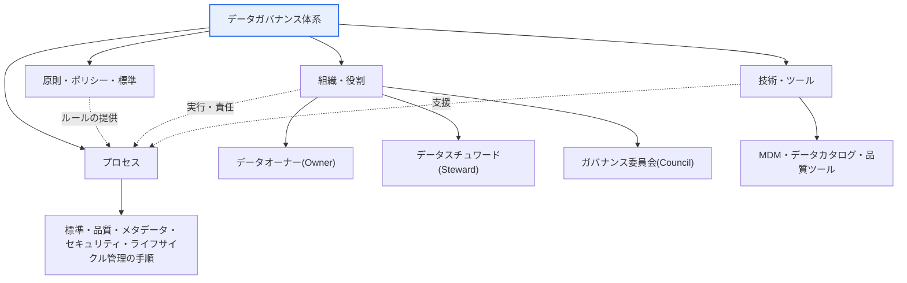
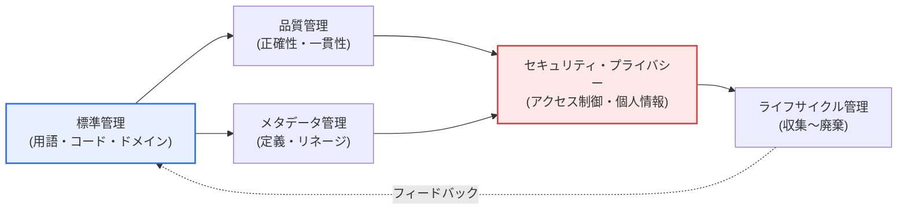

# データガバナンス（Data Governance）

## 1. 概要

### A. 定義
> **データガバナンス**とは、データの**可用性（Availability）・有用性（Usability）・完全性（Integrity）・セキュリティ（Security）を確保**するために、データ管理に関する**ポリシー・標準・組織・プロセスを確立し、継続的に統制する**全社的な管理体系である。データを個別部門の副産物ではなく、**信頼できる全社共通の資産**として管理することを目標とする。

データガバナンスが必要とされる根本的な理由は、データが「**全社共通の資産であるにもかかわらず持ち主が不明確である**」という逆説にある。データは部門ごとに作られ使われるが、「誰がこのデータの正確性とセキュリティに最終的な責任を負うのか」が定まっていなければ、品質の低下・重複・不整合・セキュリティ事故が繰り返される。たとえば営業部門の「顧客」と財務部門の「顧客」が異なる基準で集計されると、同じ会社の売上報告書が部門ごとに異なるという事態が生じる。ガバナンスは、「誰がデータを所有し責任を負い、どのようなルールと標準で管理するのか」を明確に定義することによって、データ活用の信頼の基盤を作る。

とりわけ韓国のデータ3法・マイデータ・生成AIの普及によって、データが中核的な経営資産であると同時に強力な規制の対象となったことで、個別的・散発的な管理の限界が明らかになった。AIモデルの品質は学習データの品質を超えられず（"Garbage In, Garbage Out"）、個人情報規制への違反は莫大な課徴金と信頼の喪失につながる。このため、データの品質・標準・セキュリティ・規制遵守を一つの統合された統制体系として管理するガバナンスが、企業の競争力とリスク管理の中核として浮上した。

### B. 登場背景と必要性
データガバナンスの必要性は、三つの潮流が重なって高まった。第一に、システムが部門ごと・時期ごとに別々に構築されたことで、**データのサイロ（Silo）化と不整合**が蓄積した。統合された標準がないまま各システムが独自のコードや用語を使った結果、全社的な視点での信頼できる唯一の情報源（Single Source of Truth）が失われた。第二に、**データに基づく意思決定とAIの信頼性がデータ品質に左右される**ようになり、品質を定義・測定・改善する常設の体制が求められるようになった。第三に、**個人情報保護・規制の強化**によって、データの収集・利用・保管・廃棄の全過程に対する統制と追跡（リネージ）が法的義務となった。これら三つの潮流が、標準・品質・セキュリティを包括する統合管理体系、すなわちデータガバナンスを必要とするようになったのである。

## 2. 構成要素

データガバナンスは、いくつかの要素が有機的に噛み合って機能する。ツール（MDM・カタログ）の導入をガバナンスと誤解することが多いが、実際には「原則－組織－プロセス－技術」が互いを支え合う構造でなければならず、とりわけ「誰が責任を負うのか」という組織・役割が欠けていれば、ポリシーやツールがどれほど優れていても機能しない。

### A. 原則・ポリシー・標準 — 管理のルール
原則・ポリシーは、「データをどのように管理するか」についてのルールと標準を定める。これには、データ管理の原則（例：単一ソースの維持、最小限の収集・最小限の保管）、用語・ドメイン・コードの標準、データの等級分類（公開/社内/機微）のポリシーが含まれる。ポリシーは抽象的な宣言にとどまってはならず、実際のシステム設計・運用ルールとして具体化されてこそ実効性を持つ。たとえば「顧客識別子には全社共通のキーを使用する」という原則が標準として文書化され、新規システムの検討（設計レビュー）段階で強制されてはじめて、サイロの発生を防ぐことができる。

### B. 組織・役割 — 責任の所在
組織・役割は、ガバナンスを実際に実行する主体を立てる。**データオーナー**（Owner）は特定のデータ領域の実質的な責任者（主に現場部門の管理者）であり、データの定義・品質・アクセス権限に関する意思決定の権限と責任を持つ。**データスチュワード**（Steward）はオーナーのポリシーを現場で執行する実務管理者であり、標準の遵守・品質の点検・問題への対処を担う。**ガバナンス委員会**（Council）は、部門間の利害が衝突した際に標準や優先順位を決定する意思決定機関である。この三者構造がなければ、データの問題が発生しても「それはうちの部門の責任ではない」として放置されやすい。すなわちガバナンスの成否は、ツールではなく**責任体系（スチュワードシップ）の定着**にかかっている。

### C. プロセス — 管理の手順
プロセスは、標準化・品質・メタデータ・セキュリティを実際に管理する、反復可能な手順である。新規データ標準の登録・変更承認の手順、定期的な品質診断と改善の手順、データアクセス権限の付与・回収の手順、個人情報影響評価の手順などがこれに該当する。プロセスがなければガバナンスは一過性のプロジェクトに終わり、時間の経過とともに再びデータ品質が低下する。プロセスは、組織（誰が）とポリシー（何を）を、実際の業務フロー（どのように）へと結び付ける役割を果たす。

### D. 技術・ツール — 実行の支援
技術は、前述の三つの要素を拡張・自動化する。**MDM**（Master Data Management）は顧客・商品のような中核的な基準情報を一元的に管理し、**データカタログ**はどこにどのようなデータがあり、それが何を意味するのかを検索可能にし、**データ品質ツール**はルールに基づいて誤りを自動検出する。ただし、技術はあくまで支援手段であり、明確なポリシーと責任体系なしにツールだけを導入すれば「高価な抜け殻」になるという点に留意すべきである。

| 構成要素 | 内容 | 失敗時の症状 |
|---|---|---|
| **原則・ポリシー** | データ管理の原則、標準・ルール、等級ポリシー | 部門ごとのばらばらな管理、サイロ化 |
| **組織・役割** | データオーナー、スチュワード、ガバナンス委員会 | 責任の不明確化、問題の放置 |
| **プロセス** | 標準・品質・メタデータ・セキュリティの管理手順 | 一過性の改善の後に再び悪化 |
| **技術** | MDM、データカタログ、品質ツール | （ポリシーがない場合）ツールだけが残り無用化 |

## 3. 管理領域と実行プロセス

データガバナンスは、データ管理の複数の領域を一つの体系の中で統合的に管理する。個々の領域がそれぞれ最適化されるのではなく、標準を基礎として品質・メタデータ・セキュリティ・ライフサイクルが一貫して結び付くことが要である。

**標準管理**は用語・ドメイン・コードを統一する活動であり、他のすべての領域の出発点である。標準がなければ、品質を定義することも、データを統合することもできない。**品質管理**は正確性・完全性・一貫性・適時性を確保する活動であり、標準を基準として誤りを診断・改善する。**メタデータ管理**は、データの定義とリネージ（Lineage。データがどこから来て、どのように変換・移動されたか）を管理し、信頼性と規制対応（追跡可能性）の根拠を提供する。**セキュリティ・プライバシー**はアクセス制御と個人情報保護を担い、データの等級に応じて暗号化・非識別化・アクセスロギングを適用する。**ライフサイクル管理**は収集・保存・利用・保管・廃棄の全過程を規定し、不要なデータを放置せず、規制（保有期間など）を遵守させる。

| 領域 | 内容 | 代表的な成果物・手段 |
|---|---|---|
| **標準管理** | 用語・ドメイン・コードの標準化 | データ標準辞書、命名規則 |
| **品質管理** | 正確性・一貫性・完全性の確保 | 品質ルール、診断レポート、改善指標 |
| **メタデータ** | データの定義・リネージ（Lineage）の管理 | データカタログ、リネージマップ |
| **セキュリティ・プライバシー** | アクセス制御・個人情報保護 | 等級分類、非識別化、アクセスログ |
| **ライフサイクル** | 収集〜廃棄の管理 | 保有・廃棄ポリシー、アーカイブルール |

### A. データ品質の次元 — 何を測定するか
管理領域の中でも品質管理はガバナンスの成果を最も直接的に示す領域であるため、「何を良い品質とみなすか」を次元として定義して測定しなければならない。一般に、**正確性**（Accuracy）はデータが現実を正しく反映しているか、**完全性**（Completeness）は必要な値が漏れなく埋まっているか、**一貫性**（Consistency）は複数システム間で値が互いに矛盾していないか、**適時性**（Timeliness）は必要な時点に最新のデータが提供されるか、**一意性**（Uniqueness）は同一の実体が重複なく管理されているか、**有効性**（Validity）は値が定義された形式・範囲（ドメイン）を守っているか、に分けられる。

これらの次元が重要なのは、品質を漠然と「良い/悪い」と表現していては、改善の優先順位を決められないからである。たとえば「顧客メールアドレスの完全性92%、有効性97%」のように次元別の指標で測定してこそ、どの項目をどのルールで改善するかを決めることができる。スチュワードはこれらの指標を定期的に診断・報告し、目標値に達していない項目について原因（入力ミス・標準の不遵守・システムの欠陥）を究明して改善措置を実行する。すなわち、標準（何が正しいか）があってはじめてルールを作ることができ、ルールがあってはじめて次元別に測定でき、測定があってはじめて改善が持続するという点で、標準・ルール・測定・改善は一つの循環の輪を形成している。

### B. ガバナンスの成熟度 — 段階的に定着させる
ガバナンスは一度に完成するものではなく、成熟の段階を踏む。初期は管理が個人や部門に依存する非公式（Ad-hoc）な段階であり、その後、ポリシー・標準が文書化されオーナー・スチュワードが指定される定型化の段階を経て、プロセスが組織全体に定着し指標で管理される管理の段階、そして最後に、指標に基づいて継続的に改善され自動化（DataOps）される最適化の段階へと進む。自社の現在の成熟度を診断し、次の段階へ進むためのロードマップを策定することが、理想的なモデルを一挙に導入しようとして形式主義に陥る失敗を避ける道である。

## 4. 比較・事例 — データ管理・MDM・データアーキテクチャとの関係

実務においてデータガバナンスは、データ管理（Data Management）やMDMとしばしば混同される。その違いを区別してこそ、役割を誤解せずに済む。**データ管理**がデータを扱うあらゆる実行活動の総称であるとすれば、**データガバナンス**はその実行を律する上位の統制・意思決定体系である。**MDM**は、そのうち基準情報（マスターデータ）に焦点を当てた具体的な実行手段である。すなわち、ガバナンスが「ルールと審判」であるとすれば、MDMや品質ツールは「選手と用具」に相当する。

| 区分 | データガバナンス | データ管理 | MDM |
|---|---|---|---|
| 性格 | 統制・意思決定の体系 | 実行活動の総称 | 基準情報の実行手段 |
| 関心事 | ポリシー・標準・責任・規制遵守 | 保存・統合・処理・運用 | 顧客・商品などのマスターの一貫性 |
| 成果物 | ポリシー・標準・組織・プロセス | パイプライン・DB・サービス | 単一の基準情報（Golden Record） |

具体的な事例として、ある金融機関が部門ごとに顧客情報を別々に管理していたために、同一の顧客がシステムごとに異なる等級で集計されていた問題を、ガバナンスの導入によって解決したケースが挙げられる。まず「顧客」の標準定義と共通識別子を確定し（標準管理）、顧客データのオーナーを指定したうえで（組織）、MDMによって単一の基準情報を構築し（技術）、新規システムがこの基準情報を参照するよう設計レビューのプロセスで強制した（プロセス）。このように、ガバナンスは特定のツールではなく四つの要素の組み合わせによって機能するという点が、実務上の含意である。

## 5. 深掘り — データメッシュ・DataOpsへの進化とAIガバナンス

従来のデータガバナンスは、中央組織が標準と統制を独占する**中央集権型**であった。しかし、データの規模とドメインが爆発的に増加したことで、中央組織がすべてのドメインのデータを深く理解して統制することが難しくなり、それがボトルネックと形式的な遵守を生んだ。その代替策として浮上したのが**データメッシュ**（Data Mesh）である。データメッシュは、データをドメインごとに分散して所有・管理しつつ（「データをプロダクトのように」、Data as a Product）、相互運用のための共通の標準・ポリシーは全社レベルで共有する**連邦型**（Federated）**ガバナンス**を志向する。すなわち、自律（ドメインによる所有）と統制（共通標準）のバランスが最新の潮流である。

また**DataOps**は、データパイプラインに品質検証やガバナンスのルールをコードとして内在化させ、事後的な点検ではなく、データが流れる過程で自動的に品質・ポリシーを強制する。これにより、ガバナンスは文書・会議中心から「自動化・常時化」へと転換する。

最も新しい拡張は、**AI/MLガバナンス**である。生成AIの普及によって学習データの出所・著作権・偏り・個人情報が新たな規制・リスクの論点となり、従来のデータガバナンスが扱ってきた品質・リネージ・セキュリティを、AIの学習・推論データにまで拡張する流れが鮮明になっている。とりわけデータリネージ（Lineage）は、「このAIがどのようなデータで学習されたのか」を追跡する説明責任（Accountability）の基盤となり、その重要性はさらに高まっている。ただし、関連する標準・規制（例：EU AI Actなど）は引き続き整備が進められているため、詳細な要件については断定するよりも、「データガバナンスの範囲がAIのデータへと拡張していく傾向」として理解するのが正確である。

## 6. 考慮事項および示唆（技術士の観点）

1. **データスチュワードシップこそが持続性の鍵である。** 明確な責任体系（オーナー・スチュワード）がなければ、ガバナンスはツール導入プロジェクトに終わり、すぐに再び悪化する。人に明示的な責任（R&R）を与え、それを評価・報酬と連動させてこそ、データ品質が常時管理される。技術の導入よりも、組織・責任の設計が優先される。
2. **標準化がすべての出発点である。** データ標準がなければ品質を定義・測定することはできず、統合も不可能である。用語・コード・ドメインの標準をまず確立し、それを新規システムの設計レビューで強制して、サイロの再発を根本から遮断しなければならない。
3. **ビジネス価値と連動した段階的な推進が必要である。** 全社的な完全なガバナンスを一度に構築しようとすると、形式主義に陥りやすい。規制リスクが大きい、あるいは活用価値の高い中核データドメインから優先的に適用し、成果（品質指標・規制対応）を実証しながら拡大していくのが現実的である。
4. **中央統制とドメインの自律のバランス（連邦型ガバナンス）へと進化すべきである。** 規模が大きくなるほど中央による独占的な統制はボトルネックとなるため、共通の標準・ポリシーは中央が定義しつつ、ドメインがデータをプロダクトのように責任を持って所有するデータメッシュ型のモデルを検討すべきである。DataOpsによってガバナンスをパイプラインに自動的に内在化させることも、持続性確保の鍵である。
5. **AI時代のリネージ・説明責任への備え。** AIの学習・推論データの出所・偏り・個人情報を追跡できるようメタデータ・リネージ管理を強化し、データガバナンスの範囲をAIガバナンスへと拡張するロードマップを準備しなければならない。

## 参考資料
- DAMA International, DMBOK2(Data Management Body of Knowledge): https://www.dama.org/cpages/body-of-knowledge
- Zhamak Dehghani, Data Mesh Principles: https://martinfowler.com/articles/data-mesh-principles.html
- 韓国データ産業振興院（K-DATA）データ管理・ガバナンス資料: https://www.kdata.or.kr/

---

> **一言まとめ**: データガバナンスとは、*ポリシー・組織・プロセス・技術*によってデータの標準・品質・メタデータ・セキュリティ・ライフサイクルを統合的に管理し、データを信頼できる全社資産にする統制体系であり、その成否はツールではなくデータスチュワードシップ（責任体系）と標準化にかかっている。近年はデータメッシュ・DataOps・AIガバナンスへと進化している。
