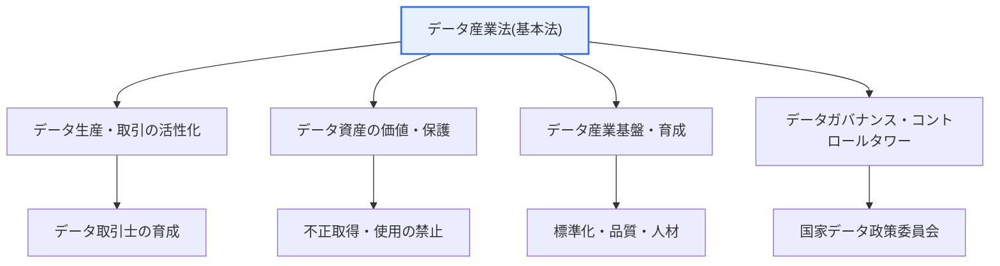
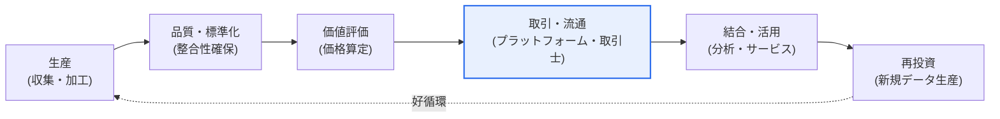

# データ産業振興及び利用促進に関する基本法(データ産業法)

## 1. 概要

### A. 目的
> **データ産業法**は、データの生産・取引・活用を促進することで**データ産業を振興し、国民生活の向上と国家経済の発展に寄与する**ために制定された、データ分野の基本法である。

データ産業法が制定された根本的な理由は、「**データが中核的な生産要素となった時代において、データを一つの資産として取引・活用するための制度的基盤が必要であった**」という点にある。データは「21世紀の石油」と呼ばれ経済の中核資源となったが、肝心のデータを資産として売買し活用するための法的枠組みは不十分であった。データの経済的価値をどのように認め、取引をどう保護し、データ基盤産業をどのように育成するかについての統合的な根拠が欠けていたのである。

ここで必ず区別すべきなのが、**「保護法制」と「振興法制」の役割分担**である。個人情報保護法がデータに含まれる個人の権利を守る「保護」に焦点を当てるのに対し、データ産業法はデータの「**活用と産業振興**」に焦点を当てた基本法である。基本法とは、特定分野の政策方向と基本原則を宣言し、他の個別法・政策が従うべき上位の枠組みを提供する法をいう。すなわちデータ産業法はデータ政策全般において憲法的地位を持つ根拠法であり、データを資産とみなして生産・取引・流通を促進し、データ取引を支援・保護し、データ産業エコシステム(取引士・分析提供事業者・取引プラットフォーム)を育成する基盤を整える。

まとめると、データ産業法はデータ経済(Data Economy)を支える制度的土台である。データが生産されて流通し、結合・分析されて新たな価値を生み、その価値が市場で取引されるという全周期(生産→流通→活用)を、法・政策・インフラの各次元で促進することがこの法の目指すところである。

### B. 登場背景及び必要性
登場背景の第一の軸は**データ経済の急速な台頭**である。AI・クラウド・IoTの普及によりデータの量と価値が爆発的に増加し、データを原料とするサービス・産業が経済成長の新たな原動力として定着した。しかしデータは物と異なり、無形・非競合・複製容易という特性があるため、所有・取引・価値認定のあり方を既存の財産権の枠組みで完全に扱うことは難しかった。データ取引の根拠と不正取得に対する保護が明確でなければ、市場参加者は安心してデータを売買できない。

第二の軸は**分断されたデータ法制の統合の必要性**である。これまでデータ関連の規律は、個人情報保護法(保護)、公共データ法(公共データの開放)、データ3法改正(仮名情報の活用)などに分散しており、「データ産業そのものをどう育てるか」を総括する上位法が存在しなかった。産業育成・人材育成・標準化・取引支援を包括するコントロールタワーと基本原則が求められ、これを受けてデータ産業法がデータ分野の基本法として制定された。これにはデータ政策のコントロールタワーを確立し、省庁・機関に分散した振興政策を整合させるという目的も込められている。

## 2. 主要内容と推進体制

法の全体骨格は「振興の対象(データ資産)–振興の手段(取引・価値評価・インフラ)–振興の主体(ガバナンス)」で構成される。大きな構造を図式化すると次のとおりである。

### A. データ生産・取引の活性化
法は、データが市場で円滑に流通するよう取引基盤を整備する。中核となる手段は、**データ取引を仲介・支援する専門人材と事業者(データ取引士など)を育成**し、データ取引標準契約書・取引支援事業を通じて取引コストと紛争リスクを低減することである。データは品質・範囲・利用条件がまちまちであるため取引交渉が複雑になるが、標準化された手続きと専門的な仲介があれば取引は活発になる。

この点が重要である理由は、データ市場における「信頼」の問題にある。販売者はデータを引き渡した後の無断再流通を懸念し、購入者は購入前にデータの実際の品質・有用性を確信しにくい。この情報の非対称性を緩和するには、取引を支援・仲介し利用条件を明確にする制度が必要であり、法はその根拠を提供する。例えば、データ取引プラットフォームと標準契約が整備されれば、中小企業も自前の交渉力がなくとも必要なデータを合理的な条件で確保できる。

### B. データ資産の価値と保護
データを取引するには、まず「資産としての地位」が認められなければならない。法はデータを経済的価値を持つ資産とみなし、**データ資産の不正取得・使用・公開を禁止**する根拠を設けている。あわせて、データの値付けを行う**データ価値評価**を支援する。データが資産として会計・担保・投資の対象となるためには、その価値を信頼性をもって算定する方法が必要だからである。

ここで生じる実務上の論点は「データの財産権的性格」である。データは複製・再利用が容易であるため排他的所有を貫徹しにくく、著作権・営業秘密などの既存の権利では完全に包摂されないグレーゾーンが広い。法はこの空白において、不正競争防止に近い方法でデータの不正取得を規律し、「正当な対価なしに他人のデータを無断で取得・利用する行為」を抑止する。これはデータ生産者に投資回収の期待を与え、データ生産を促進するインセンティブとなる。

データ価値評価はまだ方法論が確立される段階にあるため、断定的に記述するよりも「支援・促進」の観点から理解するのが正確である。原価アプローチ(収集・加工コスト)、市場アプローチ(類似取引価格)、収益アプローチ(データが生み出す将来収益)の観点が議論されており、この評価インフラが成熟してはじめて、データ担保融資・データ資産化といった後続の金融が可能となる。

### C. データ産業基盤の整備
データ市場が持続するためには、個別の取引を超えた産業インフラが必要である。法は**データ標準化、データ品質管理、専門人材の育成、創業・中小企業支援、データ基盤技術の開発**を国が後押しするよう定めている。データの形式・意味がまちまちであれば結合・分析が難しいため標準化が前提となり、品質の低いデータは取引・活用の価値がないため、品質管理体制もあわせて求められる。

人材・中小企業支援が強調される背景には、データ産業の裾野拡大という目標がある。大企業は自前のデータと人材を備えているが、中小・スタートアップ企業はデータの確保と分析能力の両方が不足している。国がデータバウチャー(データ購入・加工費用の支援)のような事業で参入障壁を下げれば、データを活用した新規サービスが多様な主体から生まれうる。これは産業エコシステムの多様性とレジリエンスを高める。

### D. ガバナンスと推進体制
法は、データ政策を総括・調整するコントロールタワーとして**国家データ政策委員会**(省庁横断の審議・調整機関)を置き、データ産業振興基本計画を策定・推進するよう定めている。データ政策は複数の省庁(科学技術情報通信部・個人情報保護委員会・産業・金融など)にまたがっているため、調整機関がなければ政策が重複・衝突しやすいからである。

ガバナンスの実効性は「調整力」にかかっている。委員会が単なる協議体にとどまらず、基本計画・予算・標準を実質的に整合させるとき、分散した振興政策が一つの方向へ収束する。とりわけ保護法制を所管する個人情報保護委員会との協業が鍵であり、「活用を促進する振興」と「個人の権利を守る保護」が衝突なくかみ合ってはじめて、データ経済は社会的信頼の上で成長できる。

### E. データ取引・活用の全周期
法が促進しようとする対象をプロセスの観点から見ると、データは生産から活用までの一つのライフサイクル(lifecycle)を経る。各段階で法・政策が介入し、ボトルネックを解消する構造である。

この全周期の観点が重要である理由は、データ産業のボトルネックが特定の段階に集中しているためである。生産が活発でも品質・標準が低ければ取引につながらず、取引が成立しても価値評価の基準がなければ価格交渉は決裂する。法が品質管理・標準化・価値評価・取引支援を幅広く規定するのは、いずれか一つの段階だけを支援しても全体の流れが滞ってしまうからである。特に最後の「活用→再投資→再生産」の好循環が形成されてはじめてデータ産業は自律的に成長し、法はその循環を呼び水のように促進する役割を担う。

## 3. 期待効果と事例

法の期待効果は、データ取引の活性化、新産業・雇用の創出、データ活用の促進、データ主権の強化に要約される。ただし表はあくまで補助であり、各効果が実際の産業でどのように現れるかが核心である。

| 効果 | 内容 |
|---|---|
| **データ取引の活性化** | データを資産として売買する市場の形成 |
| **新産業・雇用の創出** | データ基盤のサービス・分析・仲介業 |
| **データ活用の促進** | データへのアクセス・結合・利用の拡大 |
| **データ主権** | 情報主体・企業のデータ権益の強化 |

具体的な流れを見ると、データ取引プラットフォームが活性化すれば、金融・流通・医療など各分野のデータが結合されて新たなサービスが生まれる。例えば、カード消費データと商圏データを結合すれば商圏分析・立地推薦サービスが可能となり、これはマイデータ・データコマースのような後続産業へとつながる。データバウチャー事業によって中小企業が外部データを低コストで確保できれば、自社データが不足する企業もデータ基盤の新製品を試すことができる。

また、データの不正取得禁止が明文化されれば、データ生産者は無断複製・再販売のリスクが減り、データに投資するインセンティブが高まる。これは「質の高いデータがより多く生産→市場により多く供給→活用が増えて再び生産を促進」という好循環の制度的な呼び水となる。

### A. 保護–開放–振興法制の比較
データ産業法の位置付けを明確にするには、隣接する法制との役割の違いを理解する必要がある。三つの法は規律対象と目的が異なり、互いに代替ではなく補完の関係にある。

| 区分 | 個人情報保護法 | 公共データ法 | データ産業法 |
|---|---|---|---|
| 焦点 | 保護(個人の権利) | 開放(公共データの利用) | 振興(産業育成) |
| 対象 | 個人情報 | 公共機関保有データ | データ全般(民間を含む) |
| 中核手段 | 同意・安全措置 | 開放リスト・提供 | 取引・価値評価・インフラ |

この比較から浮かび上がる実務上の含意は、一つのデータサービスが三つの法の交差点に位置するという点である。例えば、公共データ(開放)と民間データを結合して個人向けサービス(保護)を作り、市場で販売する(振興)場合、三つの法の要件を同時に満たさなければならない。したがってデータ産業法だけを切り離して理解しても実際の事業の規制地形を描くことはできず、保護・開放法制との接点をあわせて設計する必要がある。違いが生じる根本的な理由は、各法がそれぞれ異なるリスク(プライバシー侵害、公共情報の独占、産業の未発達)を狙って作られたためである。

## 4. 深化 — データ法制の地形と関連テーマの連携

技術士の答案において、データ産業法は単独で記述するよりも、**データ法制全体の地形の中で位置付けること**が高得点のポイントである。データ法制は大きく三つの軸で理解できる。第一は**保護の軸**で、個人情報保護法とその改正(仮名情報・マイデータの根拠)、第二は**開放の軸**で公共データ法(公共データの開放・利用)、第三は**振興の軸**でデータ産業法である。この三つが保護–開放–振興の三角構図をなす。

この地形においてデータ産業法は振興の総括的根拠として機能し、データ3法(個人情報保護法・情報通信網法・信用情報法の改正)による仮名情報の活用、信用情報法のマイデータ(本人信用情報管理業・送信要求権)と有機的に結びつく。すなわち、「仮名情報として安全に活用可能なデータ」と「情報主体が送信を要求して移動させるデータ」が実際の取引・産業へとつながる出口を、データ産業法が制度的に開いていると見ることができる。

予想される出題方向としては、①データ産業法と個人情報保護法の関係(振興 vs 保護)と調和方策、②データ資産の財産権的性格と不正取得禁止の意義、③データ取引活性化のための価値評価・標準化・ガバナンスの課題、④マイデータ・データ3法との連携及びデータ経済戦略、がよく扱われる。答案構成の際は「なぜ必要だったのか(背景)→何を盛り込んだのか(主要内容)→どのように機能するのか(ガバナンス・連携)→課題と展望(考慮事項)」の流れで展開すると論理が堅固になる。ただし条文番号・改正時期などの細部の事実は変動・不確実性があるため、断定を避け、原則と趣旨を中心に記述するほうが安全である。

## 5. 考慮事項及び示唆点(技術士の観点)

1. **保護と活用の調和が最優先課題である。** データ産業法(活用・振興)と個人情報保護法(保護)は相互補完的に機能しなければならない。活用を促進しつつ個人情報・プライバシー保護とのバランスを取る必要があり、仮名処理・プライバシー強化技術(PET)・プライバシー強化演算(連合学習・準同型暗号など)を組み合わせ、「保護しながら活用する」技術的土台をあわせて整えなければならない。

2. **データ取引エコシステムの信頼インフラ構築が鍵である。** データを安全に取引できるプラットフォーム・標準契約・価値評価・品質管理体制が整ってはじめて、実際の市場が活性化する。特に情報の非対称性(品質・再流通リスク)を解消する取引支援・仲介・紛争調整の体制が成熟しなければならない。

3. **データ資産の財産権的性格という難題。** データは無形・非競合・複製容易という特性のため、排他的所有・取引が既存の財産権の枠組みと衝突する。不正取得禁止は生産インセンティブを与えるが、過度な排他性はデータの共有・活用を阻害しうるため、保護と開放の適正点を継続的に調整しなければならない。

4. **マイデータ・データ3法・公共データとの整合的な連携。** データ経済の法的基盤は複数の法の協業によって完成する。送信要求権(マイデータ)・仮名情報の活用(データ3法)・公共データの開放とデータ産業法の振興政策が互いに整合してはじめて、生産から活用までの全周期が円滑に機能する。

5. **ガバナンスの実行力と国際整合性。** 国家データ政策委員会のようなコントロールタワーが、省庁間の政策を実質的に調整しなければならない。さらに、データの越境移転(cross-border)・データ主権・ソブリンクラウドなど国際規範との整合性まで考慮してはじめて、国内データ産業はグローバル市場で競争力を持つ。

---

> **一言まとめ**: データ産業法は*データの生産・取引・活用を促進してデータ産業を振興するデータ分野の基本法* であり、データ資産の価値・保護(不正取得禁止)・取引活性化・産業基盤の整備・ガバナンス(国家データ政策委員会)を盛り込んでデータ経済を支え、個人情報保護法(保護)・データ3法・マイデータとともに保護–開放–振興の調和を実現する。
