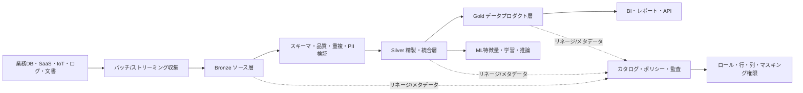
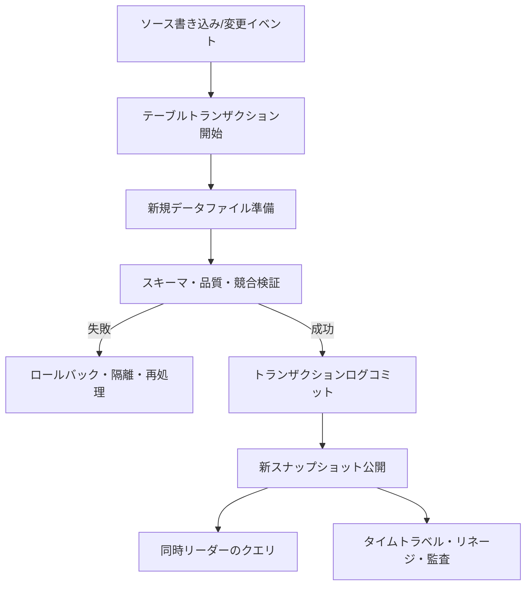

# データレイクハウス(Data Lakehouse)のアーキテクチャとガバナンス

## 1. 概要

### A. 定義

> **データレイクハウス(Data Lakehouse)**は、オブジェクトストレージ基盤のデータレイクが持つ拡張性・オープン性と、データウェアハウスが持つ整合性・管理性・分析性能を組み合わせ、バッチ・ストリーミング・BI・AI・機械学習が共通のデータを活用できるように設計したデータ管理アーキテクチャである。

データレイクはソースデータを多様な形式で安価に保管できるが、スキーマ・品質・同時実行の管理が弱いとデータスワンプ(Data Swamp)へと変質しうる。
逆に従来のデータウェアハウスは、定型化されたデータとレポートには強いが、非構造化データや大規模なソースデータの保管、迅速な実験に対してはコストと柔軟性の制約がある。
レイクハウスはこの二つを単に貼り合わせたストレージではなく、共通のストレージ層の上にトランザクション・メタデータ・カタログ・権限・リネージを結合する統合運用モデルである。

核心は「すべてのデータを一か所に積み上げる」ことではない。
ソースデータの再処理可能性を保持しつつ、利用者が信頼できる品質・意味・アクセスポリシーを段階的に付与し、分析目的に合ったコンピューティングを分離することにある。
したがってレイクハウスは、データプラットフォーム、データエンジニアリング、分析・AI、ガバナンスを一体として設計すべき、情報管理技術士型のテーマである。

### B. 登場背景と必要性

第一に、企業データは構造化テーブルだけでは説明できなくなった。
業務データベース、モバイルイベント、センサーストリーム、アプリケーションログ、文書・画像・音声、外部公開データが同時に流入する。
これらのデータをソース形式ごとに別々のストレージに分離すると複製が増加し、同一の顧客・商品の定義がシステムごとに異なって分析結果が衝突する。

第二に、BIとAIのデータ要求が一つのプラットフォームで交わる。
BIは安定したディメンション・メジャーと高速なクエリを求めるが、AI・機械学習は大量のソース履歴と特徴量の再現性、非構造化データを要求する。
レイクハウスは共通のデータコピーを基盤に、ワークロードごとにエンジンとサービングモデルを選択できるようにして、重複した移動を減らす。

第三に、データの信頼性がビジネス意思決定の前提条件となった。
ファイルが保存されているという事実は、データが正確である、あるいは最新であることを意味しない。
スキーマ変更、重複、遅延到着イベント、削除要求、個人情報マスキング、パイプライン障害を管理するには、トランザクションログと品質ルール、リネージが必要である。

第四に、クラウドオブジェクトストレージと分離型コンピューティングが一般化し、ストレージと処理の独立性が重要になった。
複数のクラスターがデータを同時に読み書きしてもテーブル状態が壊れてはならず、使用量に応じてSQL・ストリーミング・ML演算のリソースを個別に拡張する必要がある。

### C. 目標と特徴

レイクハウスの目標は、データレイクの柔軟性とウェアハウスの信頼性をバランスよく達成することである。
そのために、オープンなファイル形式、トランザクション可能なテーブルフォーマット、中央カタログ、きめ細かなアクセス制御、品質の自動化、履歴・リネージの追跡を組み合わせる。
特定製品の機能一覧よりも重要なのは、「ストレージ・処理・ガバナンスの責任をどのような境界で分けるか」という設計原則である。

下表はレイクハウスの設計目標を答案で素早く整理するのに役立つが、各目標は互いにtrade-offを持つ。
例えば、ソースデータを長期間保存すれば再現性と監査性は向上するが、保存・保持・削除のコストと個人情報管理の負担が大きくなる。

| 目標 | 設計方向 | 得られる効果 | 注意すべきtrade-off |
|---|---|---|---|
| オープン性 | 標準ファイル・カタログ・コネクタの活用 | エンジンロックインの緩和 | 互換性検証と機能差の管理 |
| 信頼性 | ACID、スキーマ検証、品質ルール | 同時処理と再現性 | トランザクションログ・コンピューティングコスト |
| 拡張性 | オブジェクトストレージと分離型コンピューティング | データ・ユーザー増加への対応 | ネットワーク・ファイル数・メタデータのボトルネック |
| 統合性 | BI・AI・ストリーミングの共通データ | 重複複製の削減 | ワークロード間のリソース・ポリシー衝突 |
| ガバナンス | カタログ・権限・リネージ・監査 | 説明責任と規制対応 | 中央統制とドメイン自律性のバランス |

## 2. 全体アーキテクチャとデータフロー

### A. 構成レイヤー

レイクハウスは一般に、データソース、収集、ストレージ・テーブル、処理・品質、カタログ・ガバナンス、利用の各レイヤーに分けられる。
これらのレイヤーは必ずしも物理的に分離された製品を意味するものではなく、責任とインターフェースを明確にするための論理的な分解である。

### B. データソースと収集レイヤー

ソースは、リレーショナル業務DB、SaaS、ファイル・オブジェクトストレージ、メッセージブローカー、IoTデバイス、外部APIなどに区分される。
ソースごとに変更検知の方式が異なるため、単に「1日1回のファイルコピー」に統一すると、鮮度・重複・削除反映の面で問題が生じる。
リレーショナルシステムは変更データキャプチャ(CDC)、イベントシステムはオフセット・パーティション、ファイルは到着イベントとチェックサム、APIはカーソルとリトライポリシーをあわせて設計しなければならない。

収集段階でソースデータを即座に完全に精製しようとすると、障害がソースシステムと分析システムの間で伝播する。
したがって、元のペイロード、収集時刻、ソース識別子、イベントキー、パーティション、スキーマバージョンを保持し、最小限のフォーマット・ウイルス・アクセス検査を経たうえでソース層にロードする。
ソースの保持は品質が低いことを意味するのではなく、後でルールが変わっても再計算できる証拠と再処理の基盤を確保するということである。

| 収集パターン | 適した状況 | 中核となる制御 | 代表的リスク |
|---|---|---|---|
| バッチ | 日次・時間単位の業務抽出 | ウォーターマーク、再実行、パーティション | 遅延と重複 |
| CDC | DB変更をほぼリアルタイムに反映 | ログ位置、順序、削除イベント | ソース負荷とスキーマ変更 |
| イベントストリーミング | クリック・センサー・注文イベント | オフセット、パーティションキー、再処理 | 重複・順序の入れ替わり |
| ファイル到着ベース | 大容量ファイル・外部受け渡し | チェックサム、アトミックな完了マーク | 不完全ファイルと再送 |
| API収集 | パートナー・公共API | カーソル、rate limit、バックオフ | 欠落・呼び出し制限 |

### C. ストレージ・コンピューティングの分離

データファイルは拡張可能なオブジェクトストレージに置き、SQL・ストリーミング・ノートブック・MLのジョブは必要な時点でコンピューティングクラスターを使用するように分離できる。
この構造は、保存データとクエリ需要がそれぞれ異なる速度で増加する場合に有利である。
しかし、コンピューティングを分離したからといって、ネットワーク遅延とファイル管理の問題が消えるわけではない。
小さなファイルが過度に生成されたりパーティションが偏ったりすると、メタデータ参照とファイルオープンのコストが増大し、クエリ全体が遅くなりうる。

テーブルフォーマットは、データファイルとトランザクションログの組み合わせによって「現在有効なファイル集合」を定義する。
書き込み処理は新しいファイルを準備した後にログへアトミックにコミットし、リーダーはコミット済みのスナップショットを読む。
このとき、古いファイルのクリーンアップとタイムトラベルの保持期間をあわせて管理しなければならない。
クリーンアップが過度に積極的だと、過去バージョンの参照や再現性、削除監査に必要なファイルが失われうる。

## 3. メダリオンアーキテクチャとデータプロダクト

### A. Bronze ソース層

Bronzeは、ソースデータの忠実性を保持する層である。
ソースシステムのフィールドとイベントを可能な限りそのまま保存し、収集時刻・ソース・ファイル名・メッセージオフセット・スキーマバージョンなどのprovenanceを付与する。
ここで重要なのは「何の検査もしない」ことではなく、ソースの毀損を防ぐ最小限の妥当性検査と隔離ポリシーを設けることである。

誤ったレコードをすべて破棄すると後で欠落の原因を説明できなくなるため、正常・エラー・未確定のレコードを区別して保持するほうが、再処理と監査に有利である。
例えば、決済イベントの金額フィールドが文字列で入ってきた場合、原文はBronzeに残し、パース失敗の理由と隔離場所をメタデータとして記録する。
その後ルールが修正されれば、ソース履歴全体を再びSilverへ投入できる。

### B. Silver 精製・統合層

Silverは、分析とモデリングに使えるよう品質と意味を付与する層である。
型変換、重複排除、欠損値・外れ値処理、コード標準化、キーマッピング、遅延到着データの補正、複数ソースの結合を行う。
ただし、Silverでビジネス集計まですべて行うと再利用性が低下するため、アトミックで非集計の精製レコードを優先して保持するのがよい。

Silverの品質ルールはパイプラインコードの中だけに隠さず、ルールID、期待範囲、失敗率、検査時刻、担当ドメインとともに管理しなければならない。
品質障害が発生した場合に、パイプライン全体を無条件に停止するのか、エラーを隔離して部分的成功を許容するのかは、業務の重要度に応じて決める。
金融元帳のように整合性が最優先されるデータと、広告クリックのように一部の損失を許容できるデータとでは、ポリシーが異なるべきである。

### C. Gold データプロダクト層

Goldは、特定の業務上の問いに答えられるよう意味を整理したデータプロダクト層である。
売上、顧客アクティブ度、在庫回転率のように定義が合意された指標とディメンション・集計を提供し、BI・経営層・業務API・ML特徴量がすぐに活用できるよう性能を最適化する。
Goldはデータが「より良いもの」という階層ではなく、目的と利用者に合わせて公開された契約(contract)であるという観点が重要である。

Goldのデータプロダクトには、オーナー、説明、更新周期、品質SLO、許容遅延、アクセス対象、リネージ、変更互換性ポリシーを明記する。
例えば「日次売上」が注文日基準か決済完了日基準か、返金をいつ差し引くのか、タイムゾーンは何かが定義されていなければ、数値があっても意思決定には使えない。
したがって、技術メタデータとビジネス用語集をあわせて運用しなければならない。

| 層 | データの性格 | 主な処理 | 利用者 | 品質基準 |
|---|---|---|---|---|
| Bronze | ソース・再現可能 | 収集・最小検証・原文保持 | エンジニア・監査 | 収集漏れ・ファイル完全性 |
| Silver | 精製・統合・非集計 | 型・重複・キー・欠損・遅延処理 | アナリスト・データサイエンティスト | 正確性・一意性・参照整合性 |
| Gold | 業務的意味・集計・公開 | 指標・ディメンション・セキュアビュー・性能最適化 | 経営・BI・サービス・ML | 鮮度・定義の一貫性・応答時間 |

## 4. トランザクション・スキーマ・品質の設計

### A. ACIDと同時実行

レイクハウスのテーブルトランザクションは、複数の書き手が同時に作業してもリーダーが不完全なファイル集合を見ないようにするための基盤である。
原子性は処理全体が成功するか失敗するかのいずれかとなるようにし、一貫性は定義されたスキーマ・制約・品質条件を逸脱した状態を防ぐ。
分離性は同時処理が互いの中間状態を汚染しないようにし、永続性はコミットした結果が障害後も再構成されるようにする。

ただし、ACIDがソースシステムからBI画面に至るまで、あらゆる分散システムの業務トランザクションを自動的に保証するわけではない。
二つの外部システムを同時に更新する分散トランザクション、モデルサービングのキャッシュ、メッセージブローカーの配信保証には、別途の設計が必要である。
レイクハウス内でテーブルのコミットがアトミックであっても、外部の決済承認とデータロードの間には重複・遅延・補償処理の問題が残る。

### B. スキーマ管理と進化

スキーマは列名と型だけでなく、必須性、コード体系、意味、許容範囲、個人情報分類、互換性ルールを含む。
ソース層は予期しない変更を受け入れる余地を残しつつ、Silver・Goldでは契約を厳格に適用すべきであり、変更を検出したら影響度分析と利用者への通知が続かなければならない。

後方互換な列追加と異なり、列削除・型の縮小・コードの意味変更は利用者を壊しうる。
スキーマレジストリ、データコントラクト、自動検証、バージョンフィールド、廃止予告期間を用いれば、パイプライン間の暗黙的な依存を減らすことができる。
「スキーマ進化のサポート」とは、どんな変更でも許容するという意味ではなく、許容・警告・遮断の境界を明示するという意味である。

| 変更タイプ | 例 | 基本判定 | 対応 |
|---|---|---|---|
| 後方互換 | 任意列の追加 | 許容可能 | 利用者への影響・文書の確認 |
| 非互換 | 必須列の削除 | 遮断 | 新バージョンの契約・マイグレーション |
| 意味の変更 | コード値の定義変更 | 非常に危険 | 用語集・変換ルール・再計算 |
| 型の変更 | 整数→文字列 | 条件付き | 精度・パーサー・サンプル検証 |
| 個人情報の変化 | 一般値→機微情報に分類 | 即時統制 | マスキング・権限・保持ポリシーの再検討 |

### C. データ品質とオブザーバビリティ

品質は正確性だけで完結しない。
完全性は必要なレコードが漏れなく存在するか、一意性は重複がないか、妥当性は形式・範囲が合っているか、一貫性はシステム・期間の間で定義が同じか、適時性は約束した時間内に到着したかを意味する。
業務によって品質次元の重要度としきい値が異なるため、すべてのデータを同一の100点基準で管理してはならない。

データオブザーバビリティは、パイプライン実行の成否を超えてデータの状態を監視する。
鮮度の遅延、行数の急変、分布の変化、スキーマの変化、null比率、参照キーの失敗、Gold指標の変動を追跡し、異常が発生した場合にはどのソース・変換・利用者に影響するかをリネージで結びつける。
これにより「ジョブは成功したがデータは誤っている」というサイレント障害を発見できる。

## 5. ガバナンス・セキュリティ・個人情報保護

### A. カタログとリネージ

カタログはテーブル名を集めた一覧ではなく、データの発見・理解・アクセス・責任を支援する運用体系である。
技術メタデータにはスキーマ、場所、パーティション、オーナー、更新時刻、品質結果を記録し、ビジネスメタデータには用語定義、指標の計算式、データ分類、利用目的を記録する。

リネージは、データがどのソースから来て、どのような変換を経て、どのレポート・モデルで使われたかを結びつける。
個人情報の削除や指標の誤りが発生したときに影響範囲を素早く把握し、モデル学習データの再現性と監査証跡を確保するには、列・行レベルのリネージが有用である。
ただしリネージ収集自体が運用負担となるため、すべての一時生成物まで同じレベルで管理するよりも、重要なデータプロダクトから優先順位をつける。

### B. アクセス制御と個人情報

レイクハウスではソース層に機微な原文が存在しうるため、層ごとの公開範囲を同一にしてはならない。
ロールベースアクセス制御(RBAC)、属性ベースポリシー(ABAC)、行・列レベルのフィルター、動的マスキング、トークン化、暗号化、ネットワーク境界を組み合わせて最小権限を実現する。
データサイエンティストがモデル学習に住民登録番号の原文を必要としないのであれば、非識別化された識別子と必要な派生特徴量のみを提供すべきである。

保持期間と削除要求は、タイムトラベル・バックアップ・派生Gold・学習データまで考慮しなければならない。
ソースの保持が監査に有利だという理由で、目的を逸脱した無期限保管を正当化することはできない。
分類→目的・根拠の確認→アクセス承認→マスキング・暗号化→保持・廃棄→監査ログというライフサイクルを、データプロダクトの設計に組み込まなければならない。

| 統制領域 | 適用例 | 検証証跡 |
|---|---|---|
| アイデンティティ・権限 | SSO、MFA、RBAC、ABAC | 権限マトリクス・アクセスログ |
| 機密性 | 保存・転送時の暗号化、マスキング | 鍵管理ログ・サンプル点検 |
| 最小収集 | 必要な列・期間のみロード | 目的・フィールドのマッピング |
| リネージ・監査 | データ・クエリ・ポリシーの履歴 | 変更・参照の監査ログ |
| 保持・廃棄 | 保持期間、削除の伝播 | 廃棄ジョブと例外記録 |
| サプライチェーン | コネクタ・ライブラリの検証 | SBOM・脆弱性対応履歴 |

## 6. データレイク・ウェアハウスとの比較

データレイクはソース形式と規模に対する柔軟性が最も大きい反面、利用者が自ら品質と意味を判断しなければならない負担が大きくなりやすい。
ウェアハウスは統合スキーマとクエリ最適化によって定型レポートに強いが、非構造化ソースや長期履歴、大規模な実験データの保管・処理には制約が生じうる。
レイクハウスは共通ストレージとテーブル管理によってその隔たりを縮めるが、ウェアハウスのすべての性能とレイクのすべての柔軟性を自動的に得られるわけではない。

選択は流行ではなく、業務の遅延要求、データ形式、規制、運用能力、クエリパターンによって決めるべきである。
例えば、月末の財務決算は強い整合性と承認された意味が重要であるためGoldのウェアハウス型モデルを優先でき、センサーソースの異常検知研究ではBronze・Silverの長い履歴とストリーミング処理が重要となる。
一つのプラットフォーム内でも、層ごとに異なるモデルを併用するのが現実的なアプローチである。

| 区分 | データレイク | データウェアハウス | データレイクハウス |
|---|---|---|---|
| 主な目的 | ソース・大規模・多様なデータの保持 | 構造化分析・レポート | BI・AI・ストリーミングの統合 |
| スキーマ | 主にschema-on-read | 主にschema-on-write | 層ごとに柔軟・厳格を併用 |
| トランザクション | ファイル・実装により異なる | 強力なテーブル管理 | テーブルフォーマット・ログで強化 |
| 利用者 | エンジニア・研究者 | アナリスト・経営ユーザー | ロール別の共同活用 |
| 長所 | 低コスト・オープン性 | 一貫性・クエリ性能 | コピー・プラットフォームの統合 |
| リスク | データスワンプ・品質不明 | 複製・移動・高コスト | 複雑な運用・ベンダーロックイン |

## 7. 実装手順と運用モデル

### A. 段階的構築

第1段階は、業務目標とデータプロダクト候補を定義することである。
「湖を一つ作ろう」ではなく、顧客360、リアルタイム在庫、不正取引検知のように、利用者と意思決定、許容遅延、品質SLOを明示する。
第2段階は、ソース一覧・分類・オーナー・法的根拠・保持期間を把握し、Bronzeへのロードとメタデータ標準を作ることである。

第3段階は、CDC・ストリーミング・バッチ収集をデータ特性に合わせて選択し、再実行・重複・順序・遅延・障害隔離のポリシーを実装する。
第4段階は、Silverの共通キーと品質ルール、Goldの指標契約をドメインと合意する。
第5段階は、カタログ・権限・リネージ・監査・コストタグをパイプラインのデプロイプロセスに組み込む。

運用移行後は、データプロダクトごとの鮮度・品質・コスト・使用量を観測し、障害対応ランブックと利用者への告知を検証する。
データプラットフォームを構築した後に運用チームへ引き渡す方式よりも、エンジニア・ドメイン専門家・セキュリティ・監査・分析利用者がプロダクトのライフサイクル全体を通じて共同で責任を負うモデルが適している。

### B. データプロダクトの運用指標

| 領域 | 指標例 | 意味 |
|---|---|---|
| 鮮度 | 最終成功ロード時刻、遅延p95 | 約束した更新を守ったか |
| 品質 | null率、重複率、妥当性失敗率 | データが使用可能か |
| 信頼性 | パイプライン成功率、再処理率 | 運用が安定しているか |
| 性能 | クエリp95、ファイル数、スキャン量 | 利用者が十分に速く使えるか |
| コスト | ストレージ・コンピューティング・転送コスト/プロダクト | 価値に対してコストは妥当か |
| ガバナンス | 未分類資産、過剰権限、リネージのカバレッジ | 統制が実際に適用されているか |
| 活用 | アクティブユーザー、再利用クエリ、プロダクト採用率 | 投資価値が実現しているか |

### C. コストと性能の最適化

オブジェクトストレージは安価だが、保存フォーマット・圧縮・パーティション・ファイルサイズ・スキャン範囲によって、クエリのコストと時間は大きく変わる。
時間・地域・業務キーで無条件に細かくパーティションを切るとパーティション数が爆発的に増え、逆にパーティションを大きくしすぎると不要なデータスキャンが増える。
実際のフィルターパターンとデータ分布を観察してパーティションとクラスタリングを決め、小さなファイルを定期的に統合しつつ、同時書き込みとタイムトラベルの保持を損なわないようにする。

コスト最適化は単なる削除ではない。
未使用のGoldビューを見つけて計算を減らし、反復クエリにはキャッシュ・マテリアライズド結果を活用し、開発・検証・本番環境を分離し、ストリーミングが本当に必要なデータと定期バッチで十分なデータを区別する。
データプロダクトの鮮度SLOを下げればコストは減りうるが、そのtrade-offを事業担当者が同意できるよう、指標と予算で透明に提示しなければならない。

## 8. 比較事例と実務適用

### A. 事例1:ECの顧客・注文分析

ECでは、注文DB、決済イベント、アプリのクリック、商品カタログ、配送状態がそれぞれ異なる速度で更新される。
Bronzeにはソースイベントと CDC ログを保持し、Silverで注文・顧客・商品のキーを整合させ、Goldで日次売上・コンバージョン率・再購入率のデータプロダクトを提供する。
決済承認と注文状態は遅れて到着しうるため、Silverはイベント時刻と収集時刻の両方を保持し、遅延イベントの再計算ポリシーを持たなければならない。

経営層のダッシュボードはGoldの承認済み売上定義を使用し、レコメンドモデルはSilverの行動履歴と別途の特徴量ビューを使用する。
同じソースを共有するためチャネルごとに数値が異なる問題を減らせるが、個人情報へのアクセスとマーケティング目的の利用は分離しなければならない。
失敗したパイプラインは最後に成功したスナップショットを表示し、利用者にデータ遅延を通知する運用ルールまでプロダクトに含める。

### B. 事例2:製造設備の予知保全

センサーデータは毎秒複数件発生し、設備マスターと保全履歴はバッチで変更される。
Bronzeはセンサーの原文・デバイス識別子・収集時刻・メッセージ順序を保持し、Silverは単位変換・異常範囲・欠損補間・設備マスターとの結合を行う。
Goldは設備ごとの故障率、最近の振動特徴、保全予定、モデル入力特徴量を提供する。

センサーの遅延到着やデバイスの時計誤差を単純に破棄すると、故障の前兆が失われうる。
イベント時間ウィンドウとウォーターマーク、再処理範囲を設計し、モデル学習データの生成バージョンと品質結果を記録しなければならない。
現場の運用者は最新のアラームを求め、アナリストはソース履歴と再現性を求めるため、ストリーミングサービングと長期的なSilver保持を併用する。

## 9. 深化:データメッシュ・MLOpsとの連携

レイクハウスは中央プラットフォームの技術基盤であり、データメッシュ(Data Mesh)はドメイン中心の所有とデータプロダクトの観点を強調する組織・運用原則である。
レイクハウスを導入しただけでは、オーナー・品質責任・用語の合意が自動的に生まれるわけではなく、中央チームがすべてのパイプラインのボトルネックになりうる。
逆にドメインの自律性だけを強調すると、共通識別子・セキュリティ・リネージ・品質基準がばらばらになりうる。

現実的なモデルは、中央プラットフォームチームがストレージ・カタログ・権限・オブザーバビリティ・テンプレートを提供し、ドメインチームがGoldデータプロダクトの意味・品質SLO・変更契約に責任を負う方式である。
これをfederated governanceとして運用すれば、共通ポリシーは強制しつつ、業務上の意味と優先順位はドメインが決定できる。

MLOpsと連携する際は、Silver・Goldのデータバージョンを保存するだけにとどまらず、学習スナップショット、特徴量定義、コードバージョン、パラメータ、評価結果、承認状態をあわせて記録しなければならない。
そうしてはじめて、モデルの予測結果を再現し、データドリフトが発生したときにどのソース・変換・期間から問題が始まったかを追跡できる。
特に個人情報・著作権・機微属性を含む学習データは、アクセス権限と削除の伝播をモデルアーティファクトまで結びつけなければならない。

## 10. 考慮事項及び示唆点

### A. 目的・価値中心の段階的導入

レイクハウスを技術プラットフォームの入れ替え事業として推進すると、ユーザーが実感できるデータプロダクトと投資効果が遅れる。
優先度の高い業務を一つか二つ選び、現在の複製コスト・遅延・品質エラー・レポート不一致のベースラインを測定したうえで、改善効果を検証しなければならない。
その結果をもとに共通テンプレートと標準を拡張していくほうが、ビッグバン型の移行よりもリスクが低い。

### B. トランザクションの境界と一貫性レベルの明示

テーブルのACIDと業務プロセス全体の一貫性を混同してはならない。
ソースシステム・ブローカー・レイクハウス・ダッシュボードの間で、どの区間がexactly-onceに近いのか、どこで重複排除・冪等性が必要なのか、エラー時に補償処理をどう行うのかを文書化しなければならない。
再処理可能なキーとスナップショットを設計しなければ、障害時に重複集計と手作業による修正が繰り返される。

### C. セキュリティ・個人情報を事後統制にしない

ソース層の機微情報を広く公開した後、Goldでのみマスキングする方式は危険である。
収集時点での分類と最小収集、目的別アクセス、開発データの非識別化、鍵管理、監査ログ、保持・廃棄の伝播をアーキテクチャの基本経路に置かなければならない。
カタログに登録されていない一時ファイルや派生モデルも統制の死角とならないよう、資産登録と自動ポリシー検査を適用する。

### D. データコントラクトと品質SLOを運用上の契約にする

品質ルールを「良いデータ」という宣言にとどめず、指標・しきい値・測定周期・オーナー・違反時の措置として具体化する。
Goldプロダクトの鮮度と定義が変更される場合は、利用者に影響と適用時期を知らせ、互換性が壊れる場合にはバージョン移行期間を提供しなければならない。
これはソフトウェアAPIのコントラクトテストと同じ方式で、データ利用者の信頼を守る。

### E. コスト・性能・環境影響のバランス

すべてのデータをリアルタイム・無期限・最高解像度で処理することが最善ではない。
業務価値の低いデータはバッチ・低コストストレージ・短期保持で設計し、中核プロダクトにのみ高性能コンピューティングと高速な更新を提供する。
ストレージ・スキャン・転送・学習のコストをプロダクトごとに配賦すれば最適化の責任が明確になり、不要な複製と過度な再学習を減らすことができる。

### F. オープン性とプラットフォームロックインのバランス

オープンなファイルと標準インターフェースを使用しても、カタログ、最適化、権限、ワークフロー、ML機能が特定のプラットフォームに縛られることがある。
中核データの移植性、メタデータのエクスポート、災害復旧、契約終了時の脱出計画を、調達・アーキテクチャ審査の段階で確認しなければならない。
逆にすべての機能を抽象化すると現在のプラットフォームの性能・セキュリティ上の利点を失いうるため、業務の重要度に応じてロックインを許容する領域と禁止する領域を分ける。

## 11. 参考資料

- Databricks, “What is the medallion lakehouse architecture?”: https://docs.databricks.com/aws/en/lakehouse/medallion
- Delta Lake Documentation, “Welcome to the Delta Lake documentation”: https://docs.delta.io/
- Microsoft Learn, “What is a data lakehouse?”: https://learn.microsoft.com/en-us/azure/databricks/lakehouse/
- Databricks, “What are ACID guarantees on Databricks?”: https://docs.databricks.com/aws/en/lakehouse/acid
- Databricks, “Phase 6: Design Delta Lake architecture”: https://docs.databricks.com/aws/en/lakehouse-architecture/deployment-guide/delta-lake

---

> **一言まとめ**: データレイクハウスは、共通のオブジェクトストレージ上にACIDテーブル・メダリオン品質階層・カタログ・リネージ・きめ細かなセキュリティを組み合わせ、BI・AI・ストリーミングが信頼できるデータプロダクトを共に利用できるようにする統合データアーキテクチャである。
