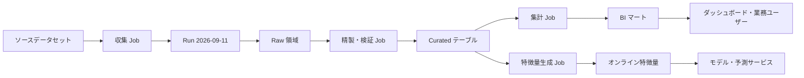
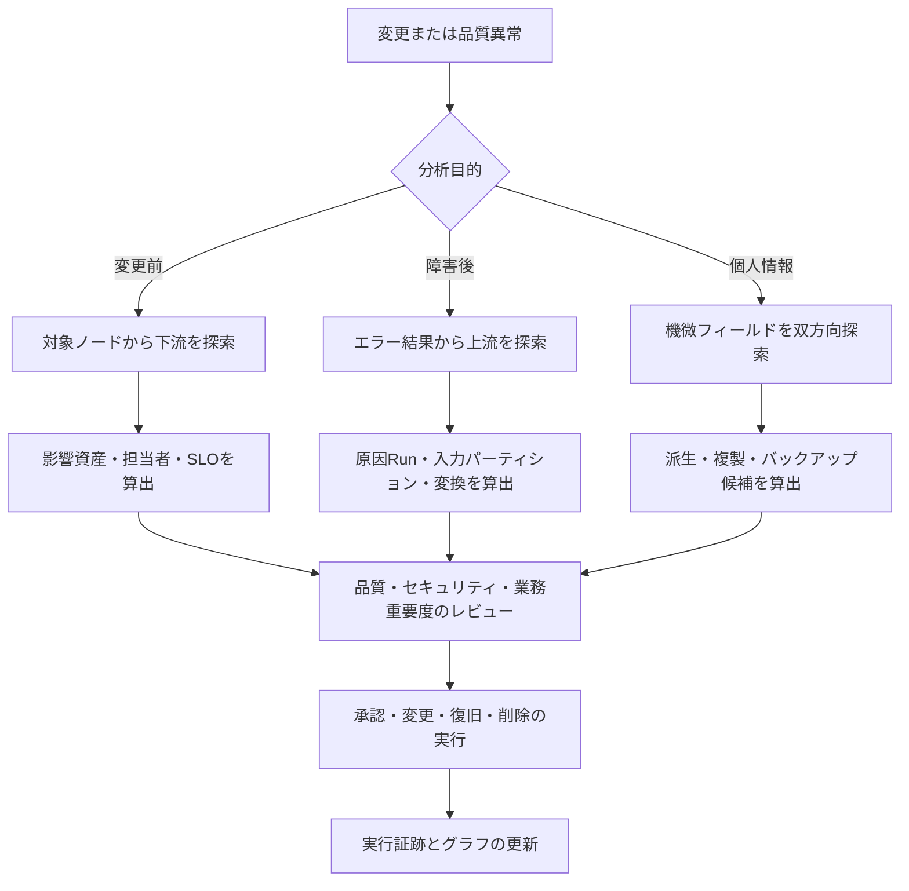

# データリネージ(Data Lineage)と影響分析

## 1. 概要

> **データリネージ(Data Lineage)**とは、データが生成された出所から収集・変換・保存・分析・サービス・廃棄に至るまで、どのような処理とシステムを経て移動したかを、メタデータと関係グラフによって追跡する体系である。

データはソースシステムにとどまらず、ETL・ELT、ストリーミング、データウェアハウス、データレイクハウス、BI、機械学習パイプラインを通過しながら、さまざまな形で再生産される。結果テーブルやダッシュボードだけを見ても値は確認できるが、その値がどのソースから来たのか、どのような変換ルールと実行バージョンを経たのか、どの利用者が影響を受けるのかを知ることは難しい。リネージはこの断絶をメタデータで結びつける。

リネージは単なる画面機能ではない。データ資産、処理ジョブ、実行インスタンス、スキーマ、オーナー、品質指標、セキュリティ分類を共通の識別子で束ね、その関係を収集・保存・参照・検証するデータガバナンスの運用能力である。したがって、カタログが資産を「見つけられるように」するものだとすれば、リネージは資産が「どのように作られ、どこで使われているか」を説明する。

実務においてリネージが特に必要とされる理由は、変更の波及効果が大きくなったためである。ソース列の名前を変えたり個人情報の保持ポリシーを変更したりすると、数十のパイプライン、レポート、レコメンド特徴量、学習データが同時に影響を受けうる。影響分析(impact analysis)とは、特定のデータ資産または列から下流方向にグラフを探索し、変更・障害・削除の影響範囲を特定する活動である。

逆に根本原因分析(root-cause analysis)は、エラーが発生した結果から上流方向へ移動し、最初の汚染・欠落・変換エラーがどこで始まったかを突き止める。一つのシステムのリネージを双方向で運用してはじめて、変更前の影響分析と障害後の原因分析の両方を行うことができる。

データリネージの目標は、すべての関係をきれいに描くことではなく、意思決定に必要な信頼と追跡可能性を確保することである。したがって、系譜の範囲、粒度、鮮度、収集漏れ、セキュリティ上の露出可能性をあわせて管理しなければならない。

### A. 登場背景と必要性

第一に、データプラットフォームが分散化したことで処理経路が複雑になった。オンプレミスDB、SaaS、メッセージブローカー、オブジェクトストレージ、クラウドDWが接続されると、単一ツールのログだけでは全体の流れを説明できない。異なるシステムが共通のメタデータモデルと識別ルールを用いてはじめて、エンドツーエンドの系譜がつながる。

第二に、規制・監査・個人情報保護の要求が、データの出所と利用目的にまで拡大した。特定の個人情報がどのレポートやモデルに使われたか、保持期間が満了したデータがどこに複製されたかを確認するには、データ分類とリネージが結びついていなければならない。ただし、リネージだけですべての複製を証明することはできないため、アクセスログ・資産一覧・バックアップ一覧で補完する必要がある。

第三に、分析とAIの運用においては、データ品質とモデル結果の信頼性が結びついている。学習データの一部が誤った結合や遅延したパーティションから作られていた場合、モデル性能低下の原因はモデルコードではなくデータの系譜にあるかもしれない。特徴量・学習データ・モデル・予測結果の関係を記録すれば、MLOpsの再現性と監査可能性が高まる。

第四に、変更管理と障害対応のスピードが重要になった。影響を受けるダッシュボードを手作業で調査していては、デプロイ承認と障害復旧が遅れる。系譜グラフで変更対象の下流資産と担当者をすぐに参照できれば、レビュー範囲とコミュニケーションコストを削減できる。

### B. リネージと隣接概念の区別

データカタログは、データ資産の名前・説明・オーナー・分類・検索情報を提供する資産一覧である。リネージは資産間の生成・変換・利用の関係を提供するため、カタログの関係情報として統合されることが多いが、カタログとリネージは同一ではない。

データプロビナンス(provenance)は、データの出所、生成過程、責任主体、時点といった証拠を広く表現する概念である。リネージは、プロビナンスのうちデータフローの側面を運用的に収集・参照する実装と見なすことができる。W3C PROV-Oは、Entity・Activity・Agentを中心に、こうした出所と責任の関係を表現できるオントロジーモデルを提供している。

データコントラクト(data contract)は、データの生産者と利用者がスキーマ・品質・鮮度・変更ルールについて合意した、設計時点の約束である。リネージは実際のジョブ実行とデータ移動の事実を記録するため、両者を組み合わせれば「どうあるべきか」と「実際にどうなったか」を比較できる。

データオブザーバビリティは、鮮度・ボリューム・分布・スキーマ・品質の異常を監視する運用の観点であり、リネージはそのデータがどのような経路で生成・消費されるかを説明する関係の観点である。品質異常イベントをリネージグラフに結びつければ、エラーが発生した資産と影響を受ける利用者をあわせて把握できる。

| 区分 | 中核となる問い | 代表的な成果物 | リネージとの関係 |
|---|---|---|---|
| データカタログ | 何が存在し、誰が責任を負うのか? | 資産一覧・定義・オーナー | リネージのノードとメタデータを提供 |
| データリネージ | どこから来てどこへ行くのか? | フローグラフ・実行履歴 | 資産・ジョブ・実行の関係を連結 |
| データプロビナンス | どのような証拠と責任で作られたのか? | 出所・時点・行為者の記録 | リネージの意味・監査範囲を拡張 |
| データコントラクト | どのような品質・スキーマを守るべきか? | 契約・検証ルール | 設計系譜と実行系譜を比較 |
| データオブザーバビリティ | 今、正常に到着しているか? | 品質・鮮度・ボリューム指標 | 異常イベントをグラフに連結 |

## 2. データリネージの構造とモデル

### A. グラフベースの構成

リネージは一般に、データ資産をノードとし、変換ジョブと実行を関係または中間ノードとして表現する有向グラフである。入力データセットがジョブを通じて出力データセットへとつながる構造を保持すれば、上流・下流の探索が可能になる。実際の実装では、ジョブそのものとジョブの1回の実行とを区別してはじめて、実行失敗、再処理、バージョンごとの結果を識別できる。

最も単純なグラフは、`入力データセット → ジョブ → 出力データセット`という三項関係を持つ。しかし運用可能なモデルでは、これに実行時刻、実行ID、コードバージョン、スキーマバージョン、品質結果、オーナーとセキュリティ分類をあわせて記録する。同じジョブでも毎日異なるパーティションを処理し、実行結果が異なりうるため、ジョブ(Job)と実行(Run)を一緒にしてしまうと再現性が低下する。

OpenLineageのオブジェクトモデルは、Job、Run、Datasetを中核エンティティとし、Facetによって追加メタデータを拡張する。Jobはデータを消費・生成する処理単位であり、Runはその Job の特定の実行、Datasetはテーブル・ファイル・オブジェクトといったデータ単位の抽象表現である。このモデルは特定のストレージ製品ではなく、複数のオーケストレーターと処理エンジンの間で系譜イベントを交換するための共通言語として活用される。

W3C PROV-OのEntity・Activity・Agentモデルは、リネージの意味をより広く表現する。DatasetはEntity、変換はActivity、実行主体や組織はAgentに対応させることができる。`wasDerivedFrom`、`wasGeneratedBy`、`used`、`wasAttributedTo`といった関係を通じて、変換・責任・利用の根拠をモデル化する。製品のデータモデルと標準オントロジーとでは目的が異なるため、無条件に一つに統一するよりも、必要な相互運用の範囲を定めるべきである。

### B. メタデータの階層

技術リネージは、データベース・ファイル・トピック・テーブル・列といった物理資産のつながりを表す。例えば、`orders_raw`がSQL変換を経て`sales_daily`になったという事実は技術リネージである。システムが自動収集しやすく初期構築に適しているが、ビジネス上の意味までは自動的に保証しない。

列レベルのリネージは、特定の出力列がどの入力列と式に由来するかを表す。`customer_grade`が`customer.score`と`rule_table.grade_code`の組み合わせで生成されたのであれば、テーブルレベルのつながりだけではこの関係はわからない。個人情報フィールドの伝播やスキーマ変更の影響分析には列レベルが有用だが、SQLパース、UDF分析、動的クエリの解釈のために、収集コストと漏れの可能性が大きくなる。

ビジネスリネージは、「売上」「アクティブ顧客」「リスク等級」のような業務用語と指標が、どのデータ資産・計算ルールに結びついているかを説明する。技術リネージがあっても、同じ名前の指標が部署ごとに異なる定義で計算されることがあるため、業務用語集と指標定義をグラフに結びつけてはじめて、意思決定者が理解できるようになる。

実行リネージは、実際のRunで読み込んだ入力パーティション、書き込んだ出力パーティション、実行時刻、状態と品質結果を記録する。設計リネージが「このJobはAを読みBを書く」という宣言だとすれば、実行リネージは「今回の実行でAの9月10日パーティションを読み、Bの特定バージョンを作った」という証拠である。事故分析では、この二つの階層の違いを示すことが重要である。

| 階層 | 例 | 強み | 主な限界 |
|---|---|---|---|
| システム・資産レベル | DB AのテーブルがDW Bへ移動 | 範囲が広く自動化が容易 | 詳細な列・変換式が見えない |
| テーブル・ファイルレベル | `orders_raw` → `sales_daily` | 運用上の影響分析の基本単位 | 一部の列変更を過大評価しうる |
| 列レベル | `orders.amount` → `sales.revenue` | 個人情報の伝播・精密な影響分析 | SQL・UDF・動的クエリの解釈コストが大きい |
| ビジネスレベル | 売上指標 → 経営ダッシュボード | ユーザーの理解と責任の所在が明確 | 定義の合意と手作業のキュレーションが必要 |
| 実行レベル | Run・パーティション・スナップショット・品質結果 | 再現性と障害原因の分析 | イベント漏れ・保持期間の管理が必要 |

### C. ノード・エッジに持たせる属性

データセットのノードには名前と場所だけでなく、システム、環境、スキーマバージョン、オーナー、分類、保持期間、品質SLO、作成・更新時刻を持たせる。識別子は、名前を人間が読みやすくすることよりも、複数の環境で衝突しないように設計することが優先である。OpenLineageも、namespaceとnameの組み合わせでJobとDatasetを識別する方式を採用している。

Jobノードには、コードリポジトリとコミット、オーケストレーターのDAG・タスク、実行主体、使用したSQLまたはモデルのバージョンを結びつけることができる。Runには、一意の実行ID、開始・終了時刻、状態、エラーメッセージ、入力・出力のパーティション、品質指標を記録する。この情報があれば、同じDAGの正常実行と再処理実行を区別できる。

エッジには方向だけでなく、変換タイプと信頼度を持たせることができる。例えば`DERIVES`、`COPIES`、`AGGREGATES`、`FILTERS`、`JOINS`を区別すれば、影響分析の結果を人が解釈しやすくなる。パーサーが推定した関係なのか実行ログで確認された関係なのか、その出所と収集時刻を記録すれば、グラフの信頼度を評価できる。

機微データの分類はノードとエッジを通じて伝播させることができるが、自動伝播の結果を確定した事実として扱ってはならない。マスキング・集計・匿名化が実際に識別可能性を除去したかを確認し、分類伝播ルールと例外承認の記録をあわせて管理しなければならない。

## 3. 収集・保存・活用の手順

### A. 収集方式

第一の方式は設計ベースの収集である。パイプライン定義書、SQL、DAG、データコントラクト、IaCを分析し、予定された入力と出力を登録する。デプロイ前に影響範囲をレビューできるという利点があるが、ランタイムの条件分岐・動的なテーブル名・例外経路を完全に把握することは難しい。

第二の方式は実行ベースの収集である。ジョブ実行イベント、クエリ監査ログ、オーケストレーターのコールバック、DB CDC、ストレージイベントを用いて、実際の入力と出力を記録する。実態の反映度は高いが、ログの保持期間、サンプリング、権限、失敗した実行の扱いといった運用上の問題が生じる。

第三の方式はパース・推論ベースの収集である。SQL AST、コード、スキーマ変更、クエリプランを分析して列の関係を推定する。定型的なSQLでは有用だが、UDF、外部API、文字列で組み立てられる動的SQLでは推論が不完全になりうる。したがって「自動生成された関係」と「レビュー済みの関係」の状態を区別しなければならない。

第四の方式はアプリケーション計装である。処理コードが開始・完了・入出力Datasetの情報を標準イベントとして発行するよう、SDKやエージェントを組み込む。標準イベントはツール間の相互運用性を高めるが、すべてのチームが同一の識別ルールとバージョンポリシーを守るよう、プラットフォームのガードレールが必要である。

収集方式は一つだけを選ぶよりも、設計系譜と実行系譜を併用するのが望ましい。設計系譜で変更前の影響範囲を素早く算出し、実行系譜で実際の実行と品質異常を検証する。収集漏れがある場合は、グラフに空の接続を黙って残すのではなく、カバレッジと信頼度の状態を表示しなければならない。

### B. 標準イベントと保存

標準イベントの最小構造は、ジョブを表すJob、ジョブの1回の実行であるRun、入力・出力データセットであるDatasetの関係である。OpenLineageは、実行状態を表すRunEventと、設計時点のメタデータを表すJobEvent・DatasetEventを区別している。同じRunの複数の状態イベントには同一のrunIdを使用する必要があり、Datasetの静的スキーマと実行ごとのパーティション情報のように性格の異なるメタデータは、適切なFacetに分離する。

イベントコレクターは、メッセージブローカーやHTTP APIを通じて中央のメタデータサービスへ送信できる。ネットワーク障害が発生してもパイプライン自体が停止しないよう、非同期バッファと再送ポリシーを設ける。ただし、イベントが失われた状態でグラフが完全であるかのように見えると誤った影響分析を招くため、送信失敗率と遅延を別途の指標として管理する。

保存モデルは、グラフDB、リレーショナルメタストア、検索インデックスの組み合わせで構成できる。グラフクエリが多く関係探索が中心であればグラフモデルが便利だが、大規模な実行履歴や時系列の品質指標は、カラム型・リレーショナル型の保存が効率的な場合がある。重要なのは製品選定よりも、ノード識別子、イベントの冪等性、時間・バージョンモデル、保持ポリシーを先に確定することである。

イベントは再送されうるため、`event_id`、`run_id`、Datasetバージョンといったキーで冪等処理を実装する。同一イベントの重複保存はグラフを膨らませ、下流の影響数を誤って算出させる。逆に、同じ名前の資産がスキーマやパーティションのバージョンを変えて生成される場合には、単純な重複排除ではなく、バージョン関係を保持しなければならない。

### C. 影響分析と根本原因分析

影響分析は、変更対象のノードから下流方向にグラフを走査する作業である。列を削除したり意味を変更したりする際に、どのテーブル・特徴量・モデル・レポート・外部送信が影響を受けるのか、各資産のオーナーと業務重要度は何かをあわせて出力する。単に到達可能なノード数を数えるのではなく、重要度・鮮度・規制分類・実行の新しさをあわせて評価しなければならない。

根本原因分析は、異常な結果から上流方向へ走査する。データ品質アラートが`sales_daily`で発生した場合、直近の成功Run、入力パーティション、スキーマ変更、upstreamの品質結果を時系列で確認する。グラフに実行時刻とバージョンがなければ、上流とのつながりは存在していても、その障害を引き起こした実行を特定することは難しい。

個人情報の削除要求は双方向活用の事例である。まず機微列の上流の出所と下流の派生資産を参照し、オンラインキャッシュ・モデル学習データ・バックアップ・外部提供ファイルを別個の資産として確認する。リネージは候補範囲を絞り込むための根拠であって、削除完了を自動的に証明する仕組みではないため、実際の削除ログと検証結果を保持しなければならない。

グラフ探索には、深さ制限、時間範囲、バージョン条件、資産タイプのフィルターが必要である。すべての過去の実行を無制限に走査すると結果が大きくなりすぎ、現在の運用と無関係な廃棄済み資産が混ざる。「直近30日の成功Run」「本番環境」「列レベルの確定関係」のように問いを具体化してはじめて、分析結果が実行可能なリストになる。

### D. リネージの品質管理

リネージ自体もデータプロダクトとみなし、品質指標を運用しなければならない。代表的な指標は、中核パイプラインの系譜カバレッジ、イベント収集遅延、孤立ノードの比率、未識別Datasetの比率、設計系譜と実行系譜の一致率、列関係の検証率である。系譜画面にノードが多いという事実は品質の証拠ではない。

カバレッジを「全資産数に対する接続済み資産数」だけで算出すると歪みが生じうる。業務重要度の高い中核データプロダクトと規制対象データに重みを与え、資産レベル・列レベル・実行レベルに分けて測定する。自動推定された関係と担当者が承認した関係を区別し、信頼度の等級を表示することも必要である。

系譜の鮮度は、最終イベント時刻と実際のデータ変更時刻の差で点検できる。イベントが収集されていない間にもパイプラインが実行されれば、画面は古い関係を表示し続ける。したがって、メタデータ収集の遅延そのものをSLOとして設定し、違反時には影響分析の結果に警告を付ける。

## 4. 比較と適用事例

### A. 手作業の文書と自動リネージの比較

手作業の文書は業務上の意味と例外ルールをよく説明できるが、変更のたびに更新する必要があり、実際の実行とずれやすい。自動リネージは実行の事実を素早く反映するが、コード外の業務ルール・手作業ファイル・外部への受け渡しを見落とすことがある。したがって、自動化を手作業キュレーションの代替とみなすのではなく、自動収集をベースラインとし、中核的な意味と例外を人が補完する方式が現実的である。

| 区分 | 手作業のデータフロー文書 | 自動リネージ |
|---|---|---|
| 鮮度 | 変更の反映が遅れうる | イベント・ログに応じて迅速に反映 |
| 意味のレベル | 業務ルールと例外を詳細に表現 | 技術的関係が中心、意味の補強が必要 |
| 範囲 | 文書作成者が選んだ中核フロー | 収集可能なシステムの範囲 |
| 信頼性 | 承認手続きがあれば高い | 漏れ・パースエラー・重複の検証が必要 |
| 運用コスト | 初期作成と継続的な更新のコスト | プラットフォーム構築・計装・観測のコスト |
| 適した用途 | ポリシー・業務定義・例外の説明 | 影響分析・障害対応・再現性 |

両者の違いは自動化のレベルではなく、証拠の性格から生じる。文書は意図と意味を含み、実行イベントは実際に起きた事実を含む。技術士の観点では、どちらか一方を選ぶのではなく、データコントラクト・カタログ・標準イベント・承認ワークフローを結びつけ、意図と事実の不一致を発見する体系を設計すべきである。

### B. テーブルレベルと列レベルの比較

テーブルレベルのリネージは収集範囲が広く、システム間のつながりを素早く示す。初期構築や大規模プラットフォームの運用フローの把握には十分な場合がある。しかし、特定の個人情報列がどこへ伝播するのか、一つの列の型変更がどの利用者に影響するのかは、テーブルレベルだけでは判断しにくい。

列レベルのリネージはより精密であるが、すべての変換を正確に解釈しなければならない。単純な列マッピングは自動化しやすいが、集計・結合・条件分岐・UDFでは「どの入力が結果に寄与するのか」の意味が変わる。過度に精密な関係を不正確に提供すると、かえってユーザーが誤った確信を持つため、確定・推定・未収集の状態を明示しなければならない。

### C. 事例:コマースの売上ダッシュボードの変更

架空のコマース企業が、注文ソースの`discount_amount`の型を整数から小数に変更すると仮定する。まず影響分析は、ソース列を起点に、精製テーブル、日次売上集計、財務ダッシュボード、プロモーション分析モデルまで下流を探索する。テーブルレベルだけを使うと無関係な注文列まですべて影響対象として拾ってしまうが、列レベルと変換式を組み合わせれば、実際に金額計算に関与する利用者だけを優先的にレビューできる。

変更承認者は下流資産のSLOとオーナーを確認し、過去のRunで新しい型を処理できるか回帰テストを行う。ダッシュボードが丸め処理を行っているか、財務システムが整数単位を想定しているか、モデル学習データのスキーマ契約が固定されているかを確認する。このようにリネージは変更を自動承認するツールではなく、レビューすべき問いと担当者を素早く提示するツールである。

### D. 事例:AI学習データの異常

レコメンドモデルの直近のAUCが低下したが、モデルコードは変わっていないと仮定する。モデル入力特徴量から上流へたどると、直近のRunの入力パーティションが普段より遅れて到着し、精製Jobが空値を0で置き換えていた事実を見つけることができる。品質Facetのnull比率と実行リネージのパーティション情報を結びつければ、モデル性能の低下とデータ異常を一つの証拠の連鎖として説明できる。

このとき原因候補が複数ある場合、単に最も近い上流ノードを原因と確定してはならない。パイプラインの実行時刻、データ品質アラート、コードコミット、モデルバージョン、特徴量ストアのオンライン・オフラインの一致状況をあわせて照合しなければならない。リネージは原因候補と影響範囲を絞り込むが、原因の確定には品質検証と運用者の判断が必要である。

## 5. 深化:標準・AI・データガバナンスとの連携

OpenLineageは特定のデータベース製品ではなく、系譜メタデータの共通イベントモデルと統合エコシステムを志向している。Job・Run・DatasetとFacetを用いれば、スケジューラーと処理エンジンが異なる環境でも基本的な関係を交換できる。標準を導入する際は、バージョン固定、namespaceルール、イベントの冪等性、ユーザー定義Facetのガバナンスを先に定めてこそ、長期的な相互運用性が維持される。

PROV-Oのようなprovenanceモデルは、単純なデータ移動を超えて、責任主体と活動の意味を表現する基盤となる。例えば、モデル学習データがどの承認済みデータプロダクトに由来し、どの組織がパイプラインを運用したかを記録すれば、AI監査と再現性のレビューに活用できる。ただし、オントロジー表現を導入したからといって業務定義が自動的に合意されるわけではないため、データ用語集と責任マトリクスがあわせて必要である。

生成AIとエージェントシステムでは、プロンプト、検索された文書、ツール呼び出し、モデルバージョン、出力の根拠が新たなリネージの対象となる。これらの情報は従来のテーブル系譜よりもイベントと実行コンテキストが重要であり、機微なプロンプトや応答をそのまま保存すると個人情報・営業秘密が露出しうる。したがって、入出力の原文の代わりにハッシュ・分類・保持期間・アクセス権限を記録する最小収集の原則を検討しなければならない。

データメッシュ・データプロダクト環境では、ドメインチームがデータ資産を所有し、中央プラットフォームは標準と検索・観測機能を提供する。このときリネージは、中央チームがすべての接続を手作業で管理する方式よりも、各ドメインが標準イベントを発行し、中央カタログが共通識別子と品質ポリシーを執行する連邦型モデルに適している。分散された所有権が分散された無責任に変わらないよう、系譜カバレッジと運用SLOをドメインの評価指標に含める。

予想される出題では、データガバナンスの構成要素、メタデータ管理、影響分析、個人情報の伝播、AIデータの信頼性を一つの答案で結びつけることができる。答案は定義を示すだけでなく、`収集→標準化→保存→探索→影響分析→品質検証→ガバナンスへのフィードバック`という好循環と、技術・組織・セキュリティのトレードオフをあわせて説明するのがよい。

## 6. 考慮事項及び示唆点

### A. 範囲と優先順位を定める

すべてのシステムとすべての列の完全なリネージを一度に構築しようとすると、コストと複雑さが爆発的に増える。売上・顧客・個人情報・AI学習データのように業務・規制上の重要度が高いドメインから中核経路を選定し、資産・列・実行レベルの目標を段階的に定める。構築範囲と未収集範囲を文書化することのほうが、過度な完全性の主張よりも重要である。

### B. 識別子とバージョンを標準化する

同じ名前のテーブルが開発・検証・本番環境に同時に存在しうるため、namespace、環境、システム、データセットバージョンのルールを定める。パーティション・スナップショット・コードコミット・モデルバージョンをイベントに結びつけてはじめて、再実行とロールバックを区別できる。識別ルールが揺らぐと、グラフが分断されたり、異なる資産が一つに統合されたりする。

### C. 信頼度と鮮度を公開する

自動パースによる関係、実行ログによる関係、担当者承認済みの関係を同じ色で表示すると、ユーザーはすべての接続を確定した事実と誤解する。収集時刻、出所、カバレッジ、推定か否か、最終成功Runを表示し、メタデータ収集のSLOを運用する。グラフの空白を隠さず、不確実性そのものを情報として提供しなければならない。

### D. セキュリティと個人情報をリネージにも適用する

リネージのメタデータにはテーブル名、列名、SQL、ユーザー、ファイルパスが含まれうるため、元データがなくても機微な業務情報が露出する可能性がある。ロールベースアクセス制御、列名のマスキング、テナント分離、監査ログ、保持期間を適用し、運用者に必要な最小限のレベルだけを公開する。データへのアクセス権限とリネージの参照権限を同じものと仮定せず、別個のポリシーとして設計する。

### E. 変更管理とSLOを結びつける

影響分析の結果は単なるグラフではなく、変更承認・テスト・告知・ロールバック計画へとつながらなければならない。中核利用者の鮮度・可用性・正確性のSLOと変更対象の重要度を組み合わせ、リスクベースのレビュー順序を作る。系譜があるからといって無条件に変更を止めればイノベーションが遅れるため、低リスクの変更は自動検証と標準デプロイで通過させ、高リスクの変更に人の承認を集中させる。

### F. 組織の責任と運用能力を確保する

プラットフォームチームがツールを導入するだけでは、リネージは定着しない。データの生産者・利用者・スチュワード・セキュリティ・監査担当者の責任をRACIで定義し、イベント発行と例外修正の責任をプロダクトのライフサイクルに組み込む。系譜品質を定期的にレビューし、漏れているパイプラインをオンボーディングする運用プロセスが、技術実装よりも長く持続しなければならない。

## 参考資料

- OpenLineage, “About OpenLineage” — https://openlineage.io/docs/
- OpenLineage, “Object Model” — https://openlineage.io/docs/spec/object-model/
- Apache Atlas, “Data Governance and Metadata framework” — https://atlas.apache.org/
- W3C, “PROV-O: The PROV Ontology” — https://www.w3.org/TR/prov-o/
- OpenLineage GitHub, “An Open Standard for lineage metadata collection” — https://github.com/OpenLineage/OpenLineage

---

> **一言まとめ**: データリネージは、Dataset・Job・Runと実行証跡を結びつけてデータの出所と影響範囲を説明する基盤であり、標準化・品質・セキュリティ・組織責任をあわせて運用するとき、変更管理とAIの信頼性を高める。
