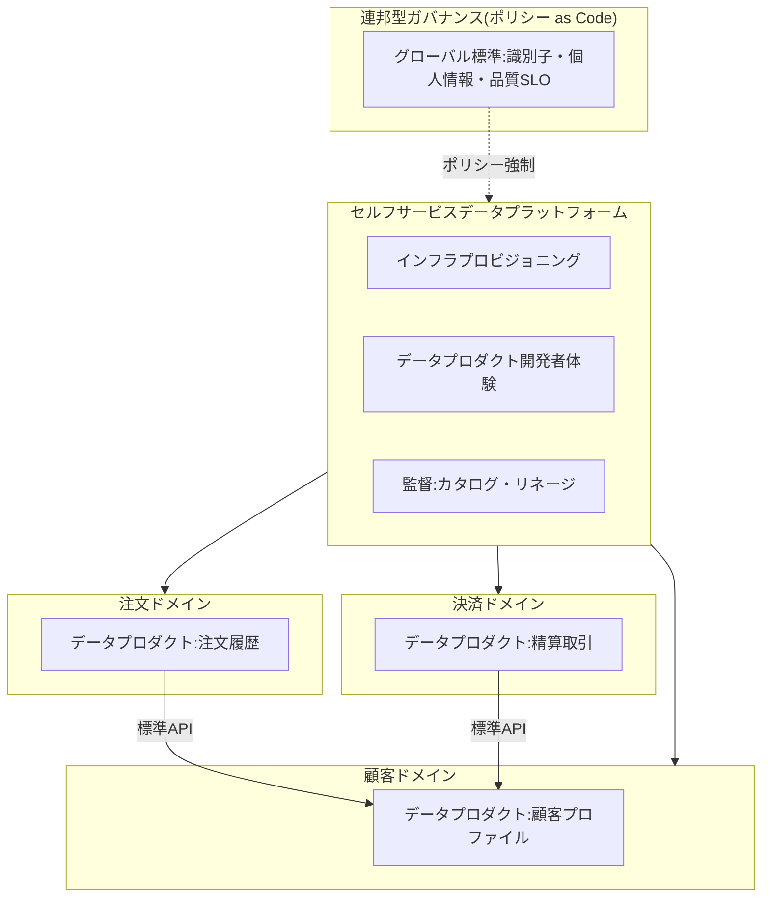
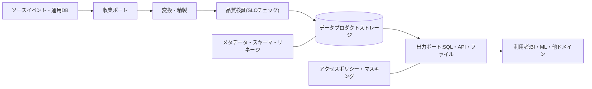

# データメッシュ(Data Mesh)と分散データアーキテクチャ

## 1. 概要

### A. 定義

> **データメッシュ(Data Mesh)**は、データの所有・生産・品質の責任を中央データチームから各業務ドメインへ移譲し、データを一つの管理対象ファイルではなく利用者に提供される**プロダクト(Data as a Product)**として扱い、これをセルフサービスプラットフォームと連邦型ガバナンスで支える、**分散型・社会技術的(sociotechnical)データアーキテクチャのパラダイム**である。

データメッシュは特定の製品やストレージではなく、組織運営モデルとアーキテクチャ原則の組み合わせである。
従来の中央集中型データアーキテクチャ(データウェアハウス、その後のデータレイク)は、すべてのソースデータを一つのプラットフォームに集め、少数の中央データチームが収集・精製・モデリング・サービングを一手に担う構造であった。
この構造はデータ規模とソースが少ないうちは効率的だが、ドメインと利用ケースが爆発的に増えると中央チームがボトルネックとなる。
データメッシュはこのボトルネックを組織構造の問題と規定し、マイクロサービスがアプリケーション開発で実現した分権化をデータ領域へと拡張する。

核心は「データを一か所にもっとうまく集めよう」ではなく、**データを最もよく知るドメインが自ら責任を持ち、プロダクトのように提供するようにしよう**という視点の転換である。
したがってデータメッシュはストレージ技術だけの問題ではなく、組織・ガバナンス・プラットフォーム・文化をあわせて設計しなければならない情報管理技術士型のテーマである。

### B. 登場背景と必要性

第一に、中央データチームの構造的ボトルネックである。
すべてのドメインのデータ要求が一つの中央チームに集中すると、ドメイン知識のないエンジニアがソースの意味を解釈しなければならず、優先順位の競合によって待ち時間が長くなる。
データ利用の需要が組織の成長よりも速く増える環境では、人員の増強だけでこのボトルネックを解消するのは難しい。

第二に、責任と知識の分離の問題である。
ソースシステムを運用するドメインはデータの意味を最もよく知っているが分析データの品質には責任がなく、中央チームは責任を負うがソースの文脈を知らない。
その結果、スキーマ変更が音もなくパイプラインを壊し、データ品質問題の原因究明と修正が遅れる。

第三に、スケーラビリティの限界である。
単一のレイク・ウェアハウスですべてのドメインを抱えると、パイプラインが巨大なモノリス(monolith)となり、一つのドメインの変更が全体に影響し、デプロイ・テストが困難になる。
これはマイクロサービスが解決しようとしたモノリスの問題と同型である。

第四に、データの価値実現スピード(time-to-value)への要求である。
AI・データドリブンな意思決定が一般化するにつれ、データを発見し、信頼し、使用するまでのリードタイムを短縮することが競争力となった。
データメッシュは、所有権を分散して並行的に価値を創出しつつ、標準とガバナンスで相互運用性を維持しようとする試みである。

### C. 4大原則と特徴

データメッシュは、Zhamak Dehghaniが提示した四つの原則に要約される。
これらの原則は個別に存在するのではなく互いを補完しており、一つだけを導入するとかえって混乱を大きくするという点が重要である。

| 原則 | 中核内容 | 得られる効果 | 注意すべきtrade-off |
|---|---|---|---|
| ドメイン所有権 | 分析データの責任をドメインに帰属 | 文脈に基づく品質・迅速な対応 | ドメイン間の重複・サイロのリスク |
| データのプロダクト化 | データを発見・信頼可能なプロダクトとして提供 | 再利用性・利用者体験の向上 | プロダクトオーナーシップ・運用負担の増加 |
| セルフサービスプラットフォーム | 共通インフラをセルフサービスとして抽象化 | ドメインの自律性・重複開発の削減 | プラットフォームチームの能力・初期投資が必要 |
| 連邦型ガバナンス | グローバル標準を自動化で強制 | 相互運用性・規制遵守 | 中央統制と自律性のバランス |

## 2. 4大原則の詳細

### A. ドメイン指向の分権的所有権(Domain Ownership)

データメッシュの出発点は、分析データの所有権と責任を、ソースをよく知る業務ドメイン(例:注文、決済、物流、顧客)へ移譲することである。
各ドメインは自らが生産するデータについて、収集・変換・品質・サービング・ライフサイクルをend-to-endで責任を負う。
これはコンウェイの法則(Conway's Law)を逆手に取った設計であり、組織の境界とデータの境界を一致させてコミュニケーションコストを削減する。

ドメイン所有権は、三つのデータタイプに分けて理解すると明確になる。
ソース整合(source-aligned)データは運用システムから直接派生した事実データであり、利用者整合(consumer-aligned)データは特定のユースケース(例:レコメンド、レポーティング)に合わせて加工されたデータであり、集約(aggregate)データは複数のドメインを結合したデータである。
所有権分散の落とし穴はサイロ化であるため、ドメイン間のデータを標準インターフェースで公開し、他のドメインが利用できるようにすることが前提となる。

### B. プロダクトとしてのデータ(Data as a Product)

データをパイプラインの副産物ではなく、明確な利用者を持つプロダクトとして扱う。
プロダクトにはデータプロダクトオーナーが存在し、SLA・SLO(鮮度、正確性、可用性)と文書・契約が伴う。
優れたデータプロダクトが備えるべき属性は、しばしば**DATSIS**に要約される。

- 発見可能(Discoverable):カタログで検索・探索が可能
- アドレス指定可能(Addressable):標準化された一意のパスでアクセス
- 信頼可能(Trustworthy):品質指標・SLOを明示し遵守
- 自己記述的(Self-describing):スキーマ・意味・例を文書で提供
- 相互運用可能(Interoperable):グローバル標準(識別子・形式)を遵守
- セキュア(Secure):アクセス制御・ポリシーがデータに組み込まれている

データプロダクトは単なるテーブルではなく、データ、メタデータ、アクセスAPI、品質検証コード、インフラ定義をまとめてカプセル化した**アーキテクチャ量子(architectural quantum)**として設計する。
例えば、決済ドメインが「精算完了取引」データプロダクトを提供するのであれば、スキーマ・SLO・サンプル・利用方法を含め、他のドメインがコード変更なしに利用できるようにする。

### C. セルフサービスデータプラットフォーム(Self-serve Data Platform)

ドメインごとにデータインフラをゼロから構築させると、重複と非効率が生じる。
これを防ぐため、プラットフォームチームがストレージ・処理・カタログ・モニタリング・アクセス制御といった共通機能をセルフサービスの形で抽象化して提供する。
目標は、データエンジニアではないドメイン開発者でもデータプロダクトを容易に作成・デプロイ・運用できるようにし、ドメインの認知負荷(cognitive load)を下げることである。

プラットフォームは大きく三つのプレーンに分けて設計する。
データインフラプロビジョニングプレーンはストレージ・コンピューティング・アカウントを自動割り当てし、データプロダクト開発者体験プレーンはデータプロダクトの作成・テスト・デプロイのワークフローを提供し、データメッシュ監督プレーンはグローバルカタログ・リネージ・ポリシー遵守状況を可視化する。
プラットフォームは「ポリシーを文書で強制する」のではなく、「ポリシーをコードとテンプレートで標準装備」することで、ドメインが正しい道を容易に進めるようにする。

### D. 連邦型コンピュテーショナルガバナンス(Federated Computational Governance)

完全な分権は相互運用性を破壊する。
連邦型ガバナンスでは、各ドメインの代表とプラットフォーム・セキュリティの専門家が集まってグローバル標準(識別子体系、データ形式、個人情報ポリシー、品質基準)を定め、それを人が毎回検査する代わりに、プラットフォームに**自動化されたポリシー(policy as code)**として組み込んで強制する。
「コンピュテーショナル」という表現は、ガバナンスが会議体の文書ではなく、パイプラインで自動的に実行・検証されるコードであることを強調している。

中核となるバランスは、グローバル標準(何を統一するか)とドメインの自律(何を委任するか)の境界設定である。
個人情報のマスキング、アクセスポリシー、相互運用のための識別子はグローバルに強制し、内部のモデリング・技術選択はドメインに委任するのが一般的である。

## 3. データプロダクトの内部構造と相互作用

個々のデータプロダクトは、利用インターフェース、データストレージ、変換ロジック、品質検証、メタデータ・ポリシーを一つのデプロイ単位としてカプセル化する。
下の図は、一つのデータプロダクトがソース入力を受け取り、検証を経て、利用者に契約された出力ポートとして提供する過程を示している。

品質検証の段階は、データプロダクトが契約(SLO)を満たさない場合に利用者へ公開しないよう、ゲートの役割を果たす。
例えば鮮度SLOが「1時間以内」であるにもかかわらず遅延が発生した場合、古いデータをそのまま公開する代わりに、利用者に遅延状態を通知するよう設計できる。
このように、データプロダクトは利用者との明示的な契約(data contract)をコードで強制することが特徴である。

## 4. データレイク/ウェアハウス及びデータファブリックとの比較

データメッシュは既存のアーキテクチャを置き換えるというよりも、**組織・所有権モデルの違い**として理解すべきである。
データレイクハウスが「何で保存・処理するか(技術レイヤー)」への答えだとすれば、データメッシュは「誰が責任を持ち、どう組織するか(運用モデル)」への答えである。
実際、各ドメインのデータプロダクトが内部的にレイクハウスやウェアハウスをストレージ技術として使用できるため、両者は排他的ではなく組み合わせ可能である。

| 区分 | 中央レイク/ウェアハウス | データファブリック | データメッシュ |
|---|---|---|---|
| アプローチの観点 | 中央集中型ストレージ | メタデータ・自動化中心の統合 | ドメイン分権的所有 |
| 所有権 | 中央データチーム | 中央+自動化レイヤー | 各業務ドメイン |
| 中核軸 | 技術プラットフォーム | インテリジェントなメタデータ・AI | 組織・プロセス |
| 拡張方式 | 人員・クラスターの増強 | 自動化の拡張 | ドメインの並行拡張 |
| 主なリスク | 中央のボトルネック | メタデータ品質への依存 | サイロ・重複・ガバナンスの複雑化 |

データファブリックとの違いはしばしば混同される。
データファブリックはメタデータと自動化(アクティブメタデータ、AIベースの統合)によって分散したデータを**技術的に**接続することに焦点を当てるのに対し、データメッシュは所有権と責任の**組織的な**分権に焦点を当てる。
すなわち、ファブリックは「技術が統合を自動化」し、メッシュは「人と組織が分権に責任を持つ」という点で、相補的に組み合わせることができる。

## 5. 深化:導入戦略と実務適用

データメッシュは、組織の成熟度が低い状態で全面導入すると失敗のリスクが大きい。
Netflix、Zalando、JPMorgan Chaseなど、大規模なデータドメインを持つ組織がボトルネック解消のために先駆的に適用したが、共通して**段階的導入**と**プラットフォームへの先行投資**を強調している。

実務での導入は、次の順序が推奨される。
第一に、価値が高く境界が明確な少数のドメインでデータプロダクトのパイロットを開始し、成功事例を作る。
第二に、繰り返し発生するインフラ作業をセルフサービスプラットフォームとして抽象化し、ドメインの参入障壁を下げる。
第三に、最小限のグローバル標準(識別子・個人情報・品質)からポリシー as codeとして自動化し、標準を段階的に拡張する。
第四に、データプロダクトオーナーの役割と成果指標(プロダクト採用率、SLO遵守率、リードタイム)を制度化する。

注意すべき点は、組織規模とデータの複雑さが低い場合は、むしろ中央集中方式のほうが効率的だということである。
データメッシュはドメイン・利用ケースが多く中央チームがボトルネックとなる場合に正当化されるものであり、無分別な導入は重複インフラとガバナンスの混乱を招くだけになりうる。
したがって、「メッシュが必要か」についての判断(組織規模、ドメイン数、データ成熟度)が先行しなければならない。

## 6. 考慮事項及び示唆点

技術士の観点から、データメッシュは次の点を総合的に考慮しなければならない。

- **組織・文化の前提条件**:データメッシュは技術導入ではなく所有権の再配置であるため、ドメインによるデータ責任の受け入れとデータプロダクトオーナーの育成がなければ、原則だけが残って失敗する。組織改編・役割定義・インセンティブ設計を、アーキテクチャよりも先に検討すべきである。
- **プラットフォーム成熟度とのトレードオフ**:セルフサービスプラットフォームが未成熟な状態で所有権だけを分散すると、ドメインごとに重複パイプラインと品質のばらつきが生じる。プラットフォーム投資と分権のスピードを合わせる段階的ロードマップが必要である。
- **ガバナンスと自律性のバランス**:グローバル標準を過度に強制すれば分権の利点が失われ、緩すぎれば相互運用性が崩壊する。個人情報・セキュリティ・識別子はポリシー as codeで強制し、モデリング・技術選択はドメインに委任する境界設計が核心である。
- **コスト・重複の管理**:ドメインごとのインフラとデータプロダクトが増えると、ストレージ・コンピューティングコストと重複データが増加しうるため、FinOpsの観点によるコストの可視化と共通プラットフォームの再利用を並行しなければならない。
- **適用判断の基準**:小規模・低複雑度の組織には中央集中が有利であるため、ドメイン数・利用ケース・中央チームのボトルネックの程度を診断して導入の可否を決定し、必要に応じてレイクハウス・データファブリックと組み合わせるハイブリッド戦略を選択する。

## 参考資料

- Zhamak Dehghani, "Data Mesh Principles and Logical Architecture", martinfowler.com — https://martinfowler.com/articles/data-mesh-principles.html
- Zhamak Dehghani, "How to Move Beyond a Monolithic Data Lake to a Distributed Data Mesh", martinfowler.com — https://martinfowler.com/articles/data-monolith-to-mesh.html
- AWS, "What is a Data Mesh?" — https://aws.amazon.com/what-is/data-mesh/

---

> **一言まとめ**: データメッシュは、分析データの所有権をドメインへ分権してデータをプロダクトとして扱い、セルフサービスプラットフォームとポリシー as codeに基づく連邦型ガバナンスで相互運用性を維持する社会技術的な分散データアーキテクチャであり、組織・プラットフォームの成熟度を備えた大規模データ環境において中央のボトルネックを解消する戦略である。
