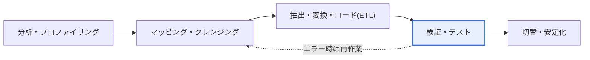
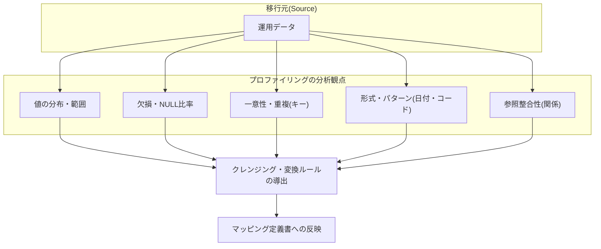

# データ統合及びマイグレーション — 完全性・整合性の確保

## 1. 概要

### A. 定義と登場背景
> **データマイグレーション(Data Migration)** は、老朽化したシステムの入れ替え・システム統合・クラウド移行などの過程で、移行元(Source)のデータを移行先(Target)のシステムへ移す一連の活動であり、その成否はデータが欠落・歪曲なく正確に移行されるよう**完全性(Integrity)と整合性(Consistency)を確保**できるかどうかにかかっている。データこそが企業の中核資産である以上、移行エラーはサービスの信頼を直接損なう。

データマイグレーションが一般的な開発作業よりも難しい根本的な理由は、「**一度誤って移すと元に戻しにくく、そのエラーがサービスに影響し続ける**」という不可逆性にある。新規開発であれば、欠陥が見つかればコードを修正して再デプロイすればよいが、マイグレーションでは、移したデータが運用で使われ始めると移行元との時間差が開き、単純な再移行では復旧できなくなる。数年にわたって蓄積された大容量データを新システムの構造へ移す際には、移行元と移行先のデータ形式・ルール(スキーマ・コード体系・エンコーディング)が異なるため、値が切り捨てられたり歪曲されたり、一部が欠落したり、相互に結びついたデータの関係が壊れたりしやすい。

特にリレーショナルデータは相互に参照し合う構造であるため、部分的なエラーが連鎖的に拡散する。例えば、注文(Order)データは移したが関連する顧客(Customer)データが欠落した場合、注文が参照する顧客が存在しない「孤立レコード(orphan record)」が生じ、参照整合性が壊れる。こうしたデータは、照会画面でエラーを起こしたり、バッチ集計で金額が狂ったりする形で、稼働後になって遅れて表面化する。そのためマイグレーションは単にデータをコピーすることではなく、移行の前後で**データが正確かつ完全であり、相互に一貫していることを検証**する体系的なプロセスでなければならない。

こうした検証なしに稼働を強行すると、大規模なシステム障害の主因となる。大手金融機関の次世代システムや公共情報システムの稼働遅延・障害事例の多くがデータ移行品質の問題に起因しているという点は、マイグレーションがプロジェクト後半の付随作業ではなく、独自の方法論と検証体系を備えた独立した課題として扱われるべきことを示唆している。

### B. 完全性と整合性の違い
この二つの概念はしばしば混同されるが、焦点が異なる。**完全性**はデータがそれ自体として正確かつ有効であり、ルール(制約条件)を満たす「**縦方向**」の品質であり、**整合性**は複数の場所にあるデータが互いに矛盾なく一致する「**横方向**」の品質である。完全性が「この一つの値は正しいか?」を問うのに対し、整合性は「移行元と移行先、あるいは相互に結びついたテーブル同士が食い違っていないか?」を問う。

完全性違反の典型は値そのもののエラーである。年齢の列に負の値が入っていたり、NOT NULLであるべき必須値が空であったり、コードドメインに定義されていない値が混在したりするケースである。一方、整合性違反は、個々の値はルールを守っていてもデータ間の関係に矛盾が生じるケースであり、移行元の100万件が移行先には99万8千件しか入らず件数が食い違ったり、移行元と移行先の合計金額が異なったりする状況がこれに該当する。マイグレーションの検証が難しいのは、この二つの軸の両方を守らなければならないからであり、完全性だけを見れば件数の欠落を見逃し、整合性だけを見れば誤った値を見逃す。

| 区分 | 完全性(Integrity) | 整合性(Consistency) |
|---|---|---|
| **焦点** | データ自体の正確性・有効性 | データ間の一致・無矛盾 |
| **方向** | 縦(個々の値・レコード) | 横(移行元↔移行先、テーブル間) |
| **例** | 年齢が負でない、必須値の存在、ドメイン遵守 | 移行元と移行先の件数・合計の一致、参照の有効性 |
| **違反時** | 誤った値・ルール違反 | データ不一致・矛盾・孤立レコード |
| **検証手段** | 制約条件・ドメインチェック | 件数/集計/チェックサムの照合 |

## 2. マイグレーションの手順とアーキテクチャ

マイグレーションは通常「分析 → マッピング・クレンジング → ETL → 検証 → 切替・安定化」の段階を経て、検証でエラーが見つかればマッピング・クレンジングの段階に戻って反復(iteration)する。各段階は次の段階の品質を左右する前提条件であるため、前の段階をおろそかにすると、後で何倍ものコストとなって返ってくる。

**分析・プロファイリング**の段階では、移行元データの実際の状態を診断し、移行範囲を確定する。移行元システムの文書化されたスキーマと実際に保存されている値が一致しないことはよくあるため(例:文書上は日付の列に文字列'N/A'が混在している)、文書ではなく実データを根拠に計画を立てなければならない。**マッピング・クレンジング**の段階は、移行元の列と移行先の列の対応関係(1:1、1:N、コード変換)を定義し、プロファイリングで発見したエラーデータのクレンジング・変換ルールを策定する、設計の中核である。

**ETL(抽出・変換・ロード)** は、定義されたルールに従って実際にデータを移す実行段階である。大容量であるほど全体の停止時間(downtime)を短縮するため、稼働前に大部分を事前に移す初期ロードと、変更分だけを追いかける差分(CDC、Change Data Capture)方式を併用することもある。**検証・テスト**は後述するように多層で行い、最後の**切替・安定化**は、実際のサービスを新システムへ切り替え(cut-over)、初期エラーを監視しながら安定化させる区間である。

## 3. データ値の診断 — プロファイリングの重点分析観点

移行前に移行元データの実際の状態を診断する**データプロファイリング(Data Profiling)** は、移す前に「何が汚れているか」を定量的に把握し、クレンジング・変換計画の根拠を用意する活動である。プロファイリングを省略すると、エラーデータをそのまま移した後に検証段階で遅れて発見することになり、再作業コストが激増する。プロファイリングは、次のようにそれぞれ異なる観点から値を分析する。

**値の分布・範囲分析**は、列の値の最小・最大・分布を見て、外れ値と範囲超過の値を見つける。例えば年齢の列に999が混在していないか、金額に負の値が存在しないかを確認し、ドメインルール違反を事前に洗い出す。**欠損・NULL分析**は、列ごとのNULL・空値の比率を測定する。必須であるべき列の欠損率が高ければ、移行後に完全性制約をかけることができないため、デフォルト値での置換・業務確認などのクレンジング方針を事前に決めておかなければならない。

**一意性・重複分析**は、主キー・業務キーの重複の有無と一意性違反を確認する。移行元で論理的に一意であるべき事業者番号が重複して保存されていると、移行先でユニーク制約をかけた際にロードが失敗するため、統合・整理のルールが必要である。**形式・パターン分析**は、日付('2026-09-16' vs '20260916' vs '2026.9.16')やコード体系の表記の一貫性を点検し、変換ルールを導出する。最後に**参照整合性分析**は、外部キーで結ばれたデータの関係が実際に有効かどうか、すなわち参照先が存在するかを確認し、孤立レコードを事前に特定する。

このようにプロファイリングは「**移す前に移行元と正直に向き合う**」段階であり、ここで得られた数値(例:「顧客コードの欠損率3.2%、注文-顧客の孤立レコード1万2千件」)が、クレンジング・変換ルールと検証基準線の根拠となる。

## 4. マイグレーションの検証テスト方法

検証は、移行後のデータが完全性・整合性を満たしているかを複数の階層でクロスチェックするプロセスである。一つの方法だけでは特定の種類のエラーを見逃すため、多層検証(defense in depth)が原則である。例えば、件数だけを合わせれば値の歪曲を見逃し、値だけを比較すれば関係の崩壊を見逃す。

| 方法 | 内容 | 検出するエラーの種類 |
|---|---|---|
| **件数検証** | 移行元-移行先のレコード数の一致を確認 | 欠落・重複ロード |
| **値の比較** | サンプル・全件の値の照合(チェックサム・ハッシュ) | 値の歪曲・切り捨て・エンコーディングエラー |
| **集計検証** | 合計・平均などの集計値の一致 | 部分的な欠落・変換エラー |
| **参照整合性** | 関係・外部キーの有効性を検証 | 孤立レコード・関係の崩壊 |
| **業務検証** | 実際の業務シナリオで結果を確認 | 業務ルールの観点からの異常 |

**件数検証**は最も基本的でありながら強力である。移行元テーブルと移行先テーブルのレコード数が一致するかを比較し、フィルター・結合条件ごとに分けて数えれば、どの区間で欠落が生じたかまで特定できる。**値の比較**は個々の値が正確に移されたかを確認するものであり、全件比較の負担が大きい大容量データでは、列・行単位でチェックサム(MD5などのハッシュ)を算出し、移行元と移行先のハッシュが一致するかを照合することで、全件検証の効果を効率的に得られる。一文字でも異なればハッシュが変わるため、微細な切り捨て・エンコーディングエラーまで検出される。

**集計検証**は、合計・平均・件数といった集計値を移行元と移行先でそれぞれ算出して比較する。特に金額・数量のように業務上総量が保存されなければならないデータでは、総和が一致すれば部分的な欠落・重複がないという強い根拠となる。**参照整合性検証**は、外部キーで結ばれたデータがすべて有効な親を持つかを確認し、孤立レコードを洗い出す。最後に**業務検証**は、技術的な一致を超えて、実際の業務シナリオ(例:特定顧客の直近6か月の取引履歴の照会、月次締めの精算)を実行し、現場の担当者が目で結果を確認する段階であり、技術検証を通過しても業務的に不自然なデータを最終的にふるい落とす。

## 5. 深化 — 実務における切替戦略と最新動向

マイグレーションの実務上の難題は、「**無停止に近い切替をいかに安全に行うか**」に収束する。小規模であれば、サービスを一時停止して一度に移すビッグバン(Big-bang)切替が単純だが、24時間サービスや大容量データでは許容停止時間が短く、別のアプローチが必要になる。このとき、初期ロード後に移行元の変更分だけをリアルタイムで追いかける**CDC(Change Data Capture)** ベースの並行運用が広く使われている。移行元DBのトランザクションログ(redo/binlog)を読み取って変更分を移行先に反映すれば、稼働直前の停止時間を分単位にまで短縮できる。

もう一つの実務戦略は**並行稼働(parallel run)** である。新旧システムを一定期間同時に稼働させ、両システムの出力(例:日次締めレポート)を照合し、結果の一致が確認されたら旧システムを廃止する。金融機関の次世代プロジェクトでよく採用される方式であり、検証の信頼度を高める代わりに運用コストと期間が増えるというトレードオフがある。クラウド移行が一般化するにつれ、AWS DMS、GCP Database Migration Serviceのようなマネージド型マイグレーションサービスがCDC・スキーマ変換を標準で提供し、dbt・Great Expectationsのようなツールで検証ルール(assertion)をコードとして管理する「データ品質のコード化」の流れも広がっている。ただし、特定ツール・バージョンの詳細機能は変わり続けるため、導入時点で公式ドキュメントにより再確認するのが望ましい。

視野を広げると、マイグレーションはデータガバナンス・標準化とも接している。移行を機にデータ標準(コード体系・命名規則)を整備し、マスターデータを整理すれば、単なる移転を超えてデータ品質そのものを引き上げる契機となる。

## 6. 考慮事項及び示唆点 (技術士の観点)

1. **検証がマイグレーションの成否を左右する。** 移行の実行そのものよりも移行後の完全性・整合性検証が核心であり、件数・値・集計・参照整合性・業務シナリオを多層でクロスチェックしてはじめて、特定の種類に偏ってエラーを見逃すことを防げる。検証基準線はプロファイリングの数値に基づいて定量的に設定する。
2. **リハーサルとロールバック計画は選択ではなく必須である。** 実際の切替の前に、本番と同一の条件でリハーサルを繰り返して手順・所要時間・エラーを点検し、定められた停止時間内に完了するかを検証しなければならない。問題発生時に即座に戻すためのロールバック計画とロールバックの判断基準(go/no-go)を事前に合意し、リスクを統制する。
3. **移行元データのクレンジングが必ず先行しなければならない。** プロファイリングで発見した汚れたデータをクレンジングせずに移すと、問題がそのまま新システムへ引き継がれ、「ゴミを移せばゴミになる(Garbage In, Garbage Out)」。移行はデータ品質を高める機会でもあるため、クレンジング・標準化を移行タスクに含める。
4. **不可逆性と監査証跡を考慮する。** マイグレーションは元に戻しにくい作業であるため、どのルールでどの値をどのように変換したかというマッピング・変換履歴を監査ログとして残し、後日問題が発生した際に原因追跡と説明ができるようにしなければならない。
5. **性能・停止時間と検証強度のトレードオフを管理する。** 全件検証は信頼度が高いが時間がかかり、CDC・並行稼働は停止時間を短縮するが運用の複雑さとコストを高める。データの重要度・規模・許容停止時間に合わせて検証強度と切替方式をバランスよく選択することが、技術士の判断領域である。

## 参考資料
- AWS Database Migration Service 概要 — https://aws.amazon.com/dms/
- Google Cloud Database Migration Service — https://cloud.google.com/database-migration
- Great Expectations (データ検証フレームワーク) — https://greatexpectations.io/

---

> **一言まとめ**: データマイグレーションは*完全性(値の正確性)と整合性(データ間の一致)* の確保が核心であり、プロファイリングで移行元を正直に診断し、件数・値(チェックサム)・集計・参照整合性・業務シナリオを多層で検証し、リハーサル・ロールバック・CDC・並行稼働によって安全に切り替える。
