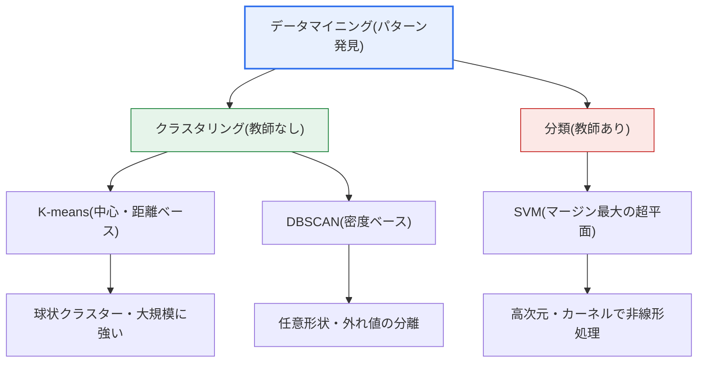
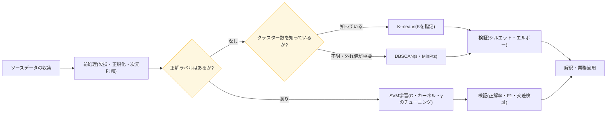

# データマイニング手法:K-means · DBSCAN · SVM

## 1. 概要

### A. 定義
> データマイニング(Data Mining)は、大量のデータから**人が事前に知ることが難しい意味のあるパターン・ルール・知識を発見**する知識発見(KDD, Knowledge Discovery in Databases)プロセスの中核段階であり、本テーマでは代表的な**クラスタリング(Clustering: K-means・DBSCAN)** と**分類(Classification: SVM)** のアルゴリズムを扱う。

データマイニングを理解するための第一の関門は、「**正解(ラベル)の有無**」という軸である。学習データに正解が付いていれば、その正解を模倣するよう境界を学習する**教師あり学習(Supervised Learning)** であり、正解なしにデータ自体の類似性だけで構造を発見するのであれば**教師なし学習(Unsupervised Learning)** である。K-meansとDBSCANは正解なしに似たもの同士をまとめる教師なしクラスタリングであり、SVMは正解を学習して二つのクラスを分ける境界を引く教師あり分類である。三つの手法を一つのテーマとしてまとめて学習すると、「正解があるときとないとき、そして類似性を何で定義するか」によってアルゴリズムがどのように分かれるかを一目で整理できる。

第二の関門は、クラスタリングの内部でさらに分かれる「**類似性の定義**」である。K-meansは「クラスター中心に近いもの同士」という**距離(distance)ベース**の考え方に従い、DBSCANは「密集しているもの同士」という**密度(density)ベース**の考え方に従う。この根本的な違いが、二つのアルゴリズムの長所と短所を決定する。K-meansは中心の周囲に丸く広がったクラスターをうまく見つけるが、細長いクラスターや三日月形のクラスター、外れ値(outlier)に弱く、DBSCANは任意の形状のクラスターと外れ値をあわせて識別できる。結局、どの手法が正しいかはデータの形状・規模・目的によって異なるため、技術士の観点では「いつ何を使うか」を判断する見識が核心となる。

### B. 登場背景と必要性
クラスタリングと分類の手法が台頭した背景には、データの爆発的増加がある。企業が蓄積した顧客・取引・ログのデータは、人が目で見てルールを探すにはあまりに膨大であり、事前に分析仮説を立てることも難しい。このとき、教師なしクラスタリングは「まずデータが自らどのような塊に分かれるかを見てみよう」という**探索的(exploratory)アプローチ**を提供し、教師あり分類は「既知の正解を根拠に新しいデータのクラスを予測しよう」という**予測的(predictive)アプローチ**を提供する。例えば、通信事業者が数千万の加入者をマーケティングセグメントに分ける場合は正解がないためクラスタリングを使い、クレジットカード取引が正常か不正かを判定する場合は過去のラベルを学習した分類を使う。

## 2. K-means Clustering

> データを事前に定めた**K個のクラスターに分け、各クラスター中心(centroid)と所属データとの距離の二乗和(SSE, Sum of Squared Errors)を最小化**するよう中心を反復的に更新する、中心ベース(centroid-based)のクラスタリング手法である。

K-meansの動作は直感的であり、四つの段階の反復に要約される。まずK個の初期中心を任意に配置し(初期化)、各データを最も近い中心に割り当て(割り当て)、割り当てられたデータの平均座標で中心を再計算し(更新)、中心がそれ以上動かなくなるまで割り当てと更新を繰り返す(収束)。このプロセスはSSEを単調に減少させるため必ず収束するが、その収束点が大域最適であるという保証はない点が中核的な限界である。

K-meansの最大の弱点は、**初期中心への依存性とKの事前指定**である。初期中心の取り方を誤ると局所最適(local optimum)に陥り、見当違いのクラスターが得られ、Kをいくつにするかも分析者が事前に決めなければならない。これを緩和するため、初期中心を互いに遠くへ散らして取る**K-means++** 初期化が広く使われており、今日ではscikit-learnなどの主要ライブラリがこれをデフォルトとして採用している。適切なKを見つける実務的手法としては、Kを増やしながらSSEの減少が折れ曲がる点を探す**エルボー(Elbow)法**と、クラスターの凝集度・分離度をあわせて見る**シルエット(Silhouette)係数**が代表的である。

K-meansは計算量がO(n・K・反復回数)と軽く、大規模データにも拡張しやすいため、実務で最初に試されるクラスタリングである。例えば、ECサイトで顧客を購入頻度・金額・最新性(RFM)の3軸で5つのセグメント(K=5)に分け、優良顧客と離脱リスク顧客を区別するキャンペーンが典型的である。ただしK-meansは各クラスターが球状(spherical)で大きさが似ていると暗黙的に仮定しているため、細長いクラスターや密度が大きく異なるクラスター、外れ値が混在するデータでは中心が歪められて性能が低下する。また距離尺度に敏感であるため、**特徴量スケールの正規化(標準化)** が事実上必須である。

数値で見ると理解が明確になる。例えば、月間購入額が数百万ウォン単位の軸と、購入回数が一桁の軸を正規化せずに併用すると、ユークリッド距離は事実上購入額の軸だけを反映し、回数の情報を無視してしまう。そのため、二つの軸を平均0・標準偏差1に標準化してはじめて、二つの特徴量がバランスよくクラスタリングに寄与する。また、Kを3・4・5・6と変えながらSSEをプロットすると、たいてい特定のKで減少幅が急激に緩やかになる「ひじ」が現れる。この点を適切なKの候補とし、シルエット係数(通常0.5以上なら良好)でクロスチェックするのが実務の手順である。

## 3. DBSCAN

> **密度(特定の半径内に存在する近傍点の数)を基準にクラスターを形成**する密度ベースのクラスタリング手法であり、密度の高い領域を一つのクラスターとして拡張し、どこにも属さない低密度の点をノイズ(外れ値)として分離する。DBSCANはDensity-Based Spatial Clustering of Applications with Noiseの略である。

DBSCANは二つのパラメータ、すなわち近傍を規定する半径**ε(epsilon)** と、コア点となるための最小近傍数**MinPts** で動作する。ある点のε半径内にMinPts以上の点があれば、その点を**コア点(core point)** とみなし、その近傍を同じクラスターに取り込みながら連鎖的にクラスターを拡張する。コア点の近傍ではあるが自らはコア点になれない点は**境界点(border point)**、どのコア点の近傍でもない点は**ノイズ(noise)** に分類される。このように密度が続く限り伸び続けるため、三日月形・らせん形のような**任意形状のクラスター**も自然に見つけ出す。

DBSCANの強みは三つに要約される。第一に、Kを事前に決める必要がなく、クラスター数がデータから自動的に決定される。第二に、外れ値を別途処理することなくノイズとして除外するため、**異常検知(anomaly detection)** にそのまま活用できる。第三に、凸でない任意の形状を捉える。実務では、GPS座標をもとに店舗が密集する商圏を自動的に導出したり、LiDARの点群から物体を分割してノイズを除去したりするのに使われる。例えば、配達注文の位置をDBSCANでまとめれば、Kがわからなくても密集配達エリアが自動的に浮かび上がる。

一方、DBSCANの弱点は**パラメータへの敏感さと密度のばらつき**である。εとMinPtsの設定を誤ると、クラスターが一つにまとまってしまったり、すべてがノイズになったりし、一つのデータの中に密度が大きく異なるクラスターが混在していると、一つのεですべてを捉えることは難しい。この問題を緩和するため、密度の階層構造を反映する**HDBSCAN**(Hierarchical DBSCAN)が提案され、実務での活用が増えている。また、高次元データでは「次元の呪い」によって距離の概念が希薄になり、密度ベースのアプローチの有効性が低下する。

εの値を決める実務的手法としては、**k距離グラフ(k-distance plot)** が広く使われている。各点からk番目に近い近傍までの距離を計算して昇順に並べると、大部分の点では緩やかだが、ノイズ区間で急激に跳ね上がる「ひざ(knee)」の点が現れ、そのひざに相当する距離をεの候補とする。MinPtsは通常、データの次元数の2倍前後(例:2次元なら4程度)を出発点として調整する。このようにDBSCANはKを決めない代わりにε・MinPtsのチューニングという別のコストを払い、その見返りとして、任意形状のクラスターと外れ値の分離というK-meansにはできない能力を得る。

## 4. SVM(Support Vector Machine)

> 二つのクラスを分ける**最適な超平面(hyperplane)** を見つける際に、境界に最も近いデータ点(サポートベクター)との余白である**マージン(margin)を最大化**することで汎化性能を高める、教師あり分類手法である。

SVMが二つのクラスを分ける任意の境界ではなく、あえて「マージン最大」の境界を探す理由は**汎化性能**にある。境界が学習データから遠く離れていて余裕(マージン)が大きいほど、学習時に見なかった新しいデータが多少揺らいでも境界を越えにくく、誤分類が減る。この境界を決定するのはデータ全体ではなく、境界に最も近い少数の点、すなわち**サポートベクター(support vector)** だけであるという点が、SVMのエレガンスであり効率の源泉である。現実のデータは完全には分離できないため、多少の誤分類を許容しつつ、その程度をハイパーパラメータ**C** で調整する**ソフトマージン(soft margin)** を使用する。Cが大きければ誤分類を強く罰してマージンが狭くなり、小さければマージンを広げる代わりに誤分類に寛容になる。

線形に分離できないデータは**カーネルトリック(kernel trick)** で解決する。元の空間で絡み合ったデータを高次元の特徴空間へ写像すれば線形の超平面で分離可能になるが、実際に高次元の座標を計算することなく、カーネル関数(内積)だけでその効果を得ることが核心である。代表的には、放射基底関数である**RBFカーネル**が非線形の境界を柔軟に作れるため実務のデフォルトとしてよく使われ、多項式・シグモイドカーネルも使われる。RBFの幅を決めるγ(gamma)と前述のCをあわせてチューニング(グリッドサーチ・交差検証)することが、SVM実務の核心である。

SVMは、特徴量の数がサンプル数よりも多い**高次元・小規模データ**で特に強力である。遺伝子発現データからがんの有無を分類する問題(数千の遺伝子に対して数百人のサンプル)や、テキストをスパム/正常に分ける問題で、長らく強力な性能を示してきた。ディープラーニング以前の時代における最強の分類器の一つであり、理論的根拠(構造的リスク最小化)が堅固で、過学習に比較的強いという長所がある。ただし、サンプルが数十万以上に増えると学習コストが急激に増加し、確率を直接出力せず(別途の較正が必要)、カーネル・C・γのチューニングに手間がかかるという限界がある。

SVMは本来二つのクラスを分ける二値分類器であるため、三つ以上のクラスを扱う場合は、**一対他(One-vs-Rest)** または**一対一(One-vs-One)** 戦略で複数の二値分類器を組み合わせる。また回帰問題に拡張した**SVR(Support Vector Regression)** も存在し、マージンの概念を許容誤差の帯(ε-tube)に置き換えて連続値を予測する。このようにSVMは単一のアルゴリズムではなく、マージン最大化という思想を共有する系統として理解するのが正確であり、カーネル選択とハイパーパラメータチューニングの自由度が、そのまま柔軟性であると同時に運用負担にもなる。

## 5. 比較

三つの手法の違いは単なる表の項目の羅列ではなく、「**正解の有無と類似性の定義**」という二つの軸から必然的に分かれる。K-meansとDBSCANは正解がないという点では同じだが、類似性を距離で見るか密度で見るかが異なるため、外れ値の扱いとクラスターの形状において正反対の傾向を示す。SVMはそもそも正解を学習するという点で前の二つとは階層が異なり、クラスターを作るのではなく、すでに定義されたクラスの境界を引く。したがって、「クラスター数を知っているか、外れ値を除外すべきか、正解ラベルがあるか」という三つの問いが、そのまま手法選択の意思決定ツリーとなる。

| 区分 | K-means | DBSCAN | SVM |
|---|---|---|---|
| **学習タイプ** | 教師なし(クラスタリング) | 教師なし(クラスタリング) | 教師あり(分類) |
| **中核基準** | 中心との距離(SSE) | 密度(ε・MinPts) | マージン最大の超平面 |
| **クラスター・クラス数** | Kを事前指定 | 自動決定 | ラベルで与えられる |
| **外れ値** | 敏感(中心が歪む) | ノイズとして自動分離 | ソフトマージン(C)で吸収 |
| **クラスター形状** | 球状を仮定 | 任意形状 | カーネルで非線形境界 |
| **主要パラメータ** | K、初期化 | ε、MinPts | C、カーネル、γ |
| **強みの領域** | 大規模・高速 | 異常検知・任意形状 | 高次元・小規模 |
| **代表的な弱点** | 初期値・Kに敏感 | 密度のばらつき・高次元 | 大容量での学習が遅い |

以下は、三つの手法が実際の分析パイプラインでどのように選択・適用されるかを示した手順図である。元データをクレンジング・正規化した後、目的とラベルの有無によって分岐し、結果は必ず定量的な指標で検証する。

## 6. 深化:実務適用と最新動向

実務においてこれら三つの手法は、単独で使われるよりも**パイプラインの一段階**として組み合わされる。代表的な流れは、「教師なしクラスタリングでまずデータ構造を把握 → 得られたクラスターラベルを特徴量とするか外れ値を除去 → 教師あり分類で予測モデルを構築」という方式である。例えば、金融の異常取引検知では、DBSCANや密度ベースの異常検知で明白なノイズをまず除外し、残ったデータにSVM・ツリー系の分類器を学習させて精度を高める。製造の品質管理では、センサーログをK-meansで正常運転パターンのクラスターに分けた後、どのクラスターからも遠く離れた観測を異常信号として警報する。

手法発展の最新の流れにも触れておく必要がある。第一に、DBSCANの密度のばらつきという弱点を補ったHDBSCANが、ライブラリ(hdbscan、scikit-learn 1.3+に内蔵)として普及し、パラメータへの敏感さが低い密度クラスタリングとして定着しつつある。第二に、高次元・非構造化データでは、元データを直接クラスタリングするよりも、**オートエンコーダー・埋め込みで低次元表現を学習した後にK-meansを適用**するディープクラスタリングが標準となった。第三に、SVMは超大規模データではディープラーニング・勾配ブースティングにその座を譲ったものの、サンプルが少なく特徴量が多いバイオ・テキストの領域や、軽量な組み込み環境では、依然として効率的な選択肢として残っている。技術士の答案では、「万能のアルゴリズムは存在せず(No Free Lunch)、データ特性に合わせた手法選択と検証こそが本質である」という観点を堅持することが有効である。

## 7. 考慮事項及び示唆点

1. **データ特性に基づく選択が最優先である。** クラスター数を知っていておおむね丸いクラスターであればK-means、クラスター数がわからない、あるいは任意形状・異常検知が必要であればDBSCAN、正解ラベルがあり明確な境界を持つ高次元の分類であればSVMが適している。「どの手法が最高か」ではなく、「この問題にはどの仮定が合うか」でアプローチすべきである。

2. **前処理と正規化が性能を左右する。** 三つの手法はいずれも距離・内積に基づくため、特徴量のスケールが異なると、大きな値を持つ軸が結果を支配する。標準化(z-score)・次元削減(PCA)・欠損処理はアルゴリズム選択と同じくらい重要であり、特に高次元では次元の呪いを緩和する特徴量選択が必須である。

3. **結果は必ず定量的・定性的な検証で裏付ける。** クラスタリングはシルエット係数・エルボーで適切なクラスターを確認し、業務専門家の解釈で妥当性を検証する。分類は正解率だけでなく、適合率・再現率・F1と交差検証によって過学習を警戒する。単一の指標・単一の実行に依存しない。

4. **アンサンブルと組み合わせで頑健性を確保する。** 一つの手法に依存するよりも、クラスタリング結果を分類の入力特徴量として使ったり、複数のアルゴリズムの結果をクロスチェックしたりして信頼度を高める。教師なし(構造発見)と教師あり(予測)を組み合わせたパイプラインが実務の標準である。

5. **解釈可能性と運用コストのトレードオフを考慮する。** SVMのカーネルによる決定は解釈が難しく、K-meansはKの設定が恣意的になりうるし、DBSCANにはパラメータチューニングのコストがかかる。規制・監査対象の領域では、精度だけでなく説明可能性と再現性まであわせて評価して手法を選択しなければならない。

## 参考資料

- scikit-learn User Guide — Clustering(K-means・DBSCAN): https://scikit-learn.org/stable/modules/clustering.html
- scikit-learn User Guide — Support Vector Machines: https://scikit-learn.org/stable/modules/svm.html
- HDBSCAN documentation: https://hdbscan.readthedocs.io/

---

> **一言まとめ**: K-means(中心・距離ベース)とDBSCAN(密度ベース)は正解のない教師なしクラスタリング、SVM(マージン最大の超平面)は正解を学習する教師あり分類であり、データの形状・クラスター数・外れ値・ラベルの有無に合わせて選択し、前処理・検証・アンサンブルで頑健性を高めることが核心である。
