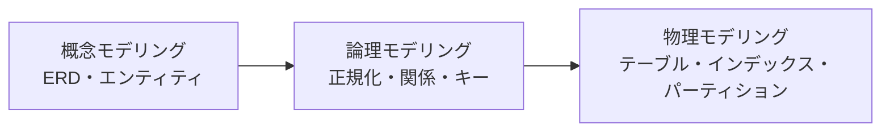
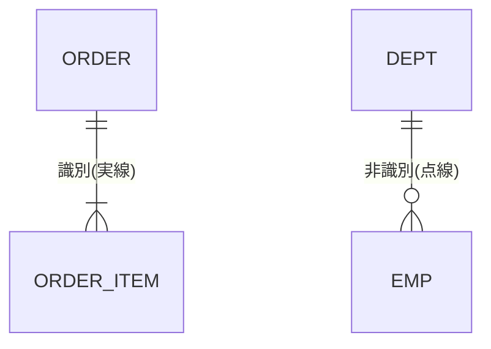

# RDBMSのデータモデリング(識別・非識別関係)

## 1. 概要

### A. 定義
> 現実世界の業務・データをリレーショナルDBの構造へ**抽象化・構造化**し、データの**完全性・一貫性・再利用性**を確保するように設計するプロセス。

データモデリングは単にテーブルを描く作業ではなく、業務ルールをデータ構造に溶け込ませ、**誤ったデータがそもそも入り込めないように**する作業である。構造こそがルールであるため、モデリングの品質がその後のアプリケーションの複雑さ・性能・保守性を決定する。

### B. モデリングの段階別実施内容
モデリングは、抽象的な視点から具体的な実装へと**概念→論理→物理**の3段階を経る。このように段階を分ける理由は、初期段階で特定のDBMSの制約に縛られることなく業務の本質をまず捉え、その後段階的に具体化していくことで、再利用性・移植性が高まるためである。

| 段階 | 実施内容 | 成果物 |
|---|---|---|
| **概念** | 中核エンティティ・関係の識別、業務ルールの反映(DBMS非依存) | 概念ERD |
| **論理** | 属性・識別子の定義、**正規化**、関係・カーディナリティの設定 | 論理ERD |
| **物理** | DBMS特性の反映(データ型・インデックス・パーティション・非正規化) | テーブルスキーマ |

概念段階は「何を管理するのか」に答え、論理段階は正規化によってデータを異常のない構造へと精製し、物理段階ではじめて性能・保存特性を考慮してインデックス・パーティション・非正規化を適用する。

## 2. 識別関係 vs 非識別関係

リレーショナルモデリングにおいて、親の主キー(PK)が子に継承される際、そのキーを**子のPKの一部として使うのか(識別)、通常の外部キーとしてのみ使うのか(非識別)** が分かれる。この選択は表記法の問題ではなく、**二つのエンティティの存在従属性**をどのように規定するかの問題である。

### A. 識別関係(Identifying)
親のPKが子のPKに含まれる関係であり、子は**親なしには存在そのものが不可能**である。例えば`注文明細`は必ずある`注文`に属していなければ意味を持たないため、`注文明細`のPKは`(注文番号 + 明細連番)`のように親のキーを含む複合キーとなる。親のキーが子へと伝播し続けるため結合条件が自然になるという長所があるが、継承が複数段階にわたると**下位テーブルのPKがどんどん肥大化する**という短所がある。ERDでは実線で表記する。

### B. 非識別関係(Non-Identifying)
親のPKが子の**通常の属性(FK)** としてのみ継承され、子は独自のPKを持つ関係である。子が親から**独立して存在**できる場合に用いる。例えば`社員`は自らの`社員番号`をPKとして持ち、`部署番号`はFKとして参照するだけなので、部署が未配属であったり変更されたりしても、社員レコードは独立して存在する。PKがシンプルに保たれるという長所があり、ERDでは点線で表記する。

| 区分 | 識別(Identifying) | 非識別(Non-Identifying) |
|---|---|---|
| **概念** | 親のPKが子の**PKの一部として継承** | 親のPKが子の**通常のFKとして継承** |
| **表記(ERD)** | 実線 | 点線 |
| **従属性** | 強い従属 — 親なしに子は存在不可 | 弱い従属 — 子は独立して存在可能 |
| **PK構成** | 親のキーを含む(複合キー) | 子が独自のPKを保有 |
| **例** | 注文 ↔ 注文明細 | 部署 ↔ 社員 |
| **影響** | 結合の単純化、PK肥大化のリスク | PKはシンプル、結合時にFKを使用 |

選択基準は結局、**業務上、子が親なしに成立するか**である。成立しなければ(強い従属)識別、成立しうるなら(弱い従属)非識別を選ぶのが原則であり、識別関係の無分別な濫用は、下位PKの肥大化と結合性能の低下を招く。

## 3. データモデリング時の考慮事項

正規化と非正規化は、**完全性と性能のトレードオフ**を調整する代表的な手段である。正規化は重複を排除して異常(挿入・更新・削除時のデータ不整合)を防ぐが、結合が増えて参照性能が低下しうる。非正規化は意図的な重複によって参照を高速化するが、更新時の完全性管理の負担を増やす。

| 区分 | 考慮内容 |
|---|---|
| **正規化** | 異常(挿入・更新・削除)の排除、1NF~BCNFで重複を最小化 |
| **非正規化** | 参照が頻繁な区間で意図的な重複を許容、正規化との**バランス** |
| **完全性** | エンティティ・参照・ドメイン・業務の完全性を制約条件で強制 |
| **キー設計** | 代替キー(Surrogate) vs 自然キー、識別子の安定性・不変性 |
| **標準化・履歴** | 命名標準、履歴・変更管理、拡張性の確保 |

キー設計において代替キー(例:自動採番ID)を使えば、自然キーが変わっても関係は安定的に維持されるが、業務上の意味を持たないため別途一意性制約が必要となる。安定して変化しない識別子を選ぶことが、結合・参照整合性の土台となる。

## 4. 考慮事項及び示唆点
実務における設計原則は、**正規化によってまず完全性を確保し、その後、実際の性能要件が確認された区間に限って選択的に非正規化**を適用することである。最初から性能を理由に非正規化すると、完全性のリスクが大きくなるだけである。識別/非識別関係もまた、従属性・PKの伝播・結合性能を総合して判断すべきであり、習慣的に一方だけを使うことを戒めなければならない。さらに大容量・分散環境では、単一のRDBMSの限界を超えて**パーティショニング・シャーディング**で水平拡張したり、非構造化・超大容量の領域には**NoSQLを併用**するポリグロット設計へと拡張したりすることが、技術士の観点からの方向性である。

---

> **一言まとめ**: データモデリングは*概念→論理→物理* の段階で進められ、識別関係は親のPKが子のPKに継承される(強い従属・実線)関係、非識別関係は通常のFKとして継承される(弱い従属・点線)関係として存在従属性に応じて選択し、正規化・非正規化・完全性・キー設計をトレードオフの観点からバランスよく扱う。
