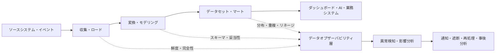
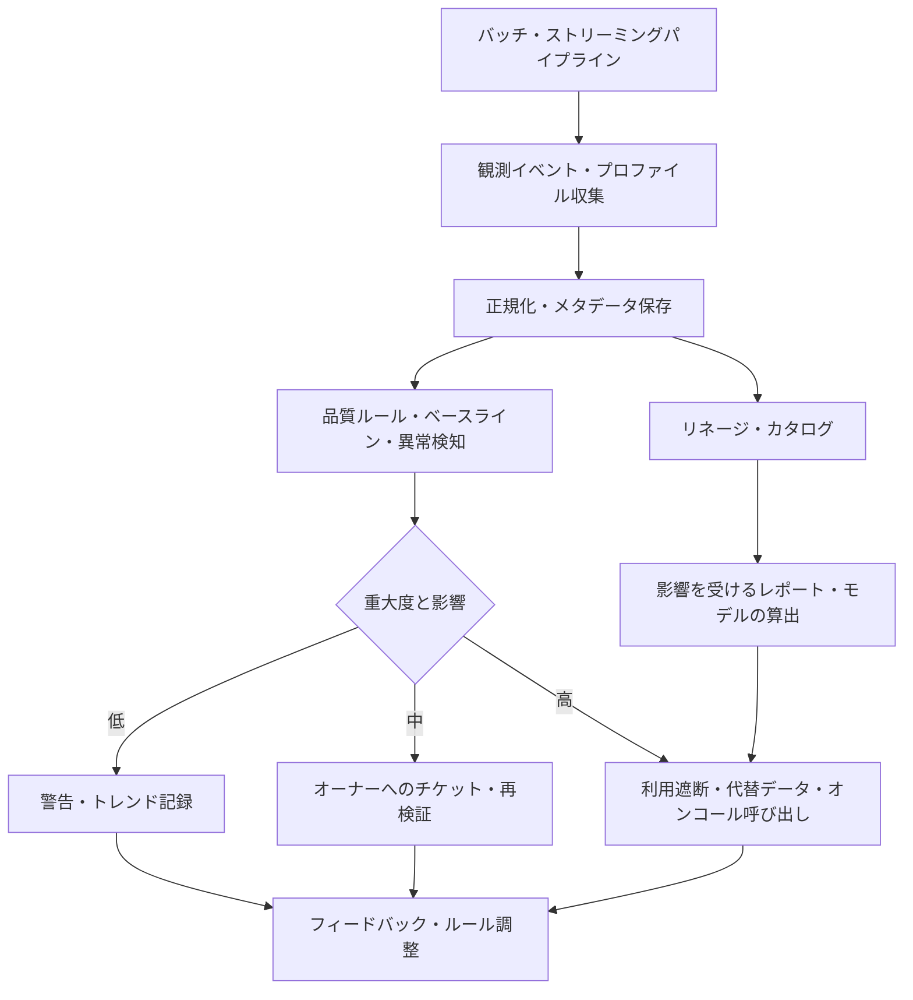

# データオブザーバビリティ(Data Observability)とデータ信頼性管理

## 1. 概要

> **定義**: データオブザーバビリティ(Data Observability)とは、データパイプラインとデータセットの現在の状態を、鮮度・完全性・妥当性・一貫性・分布・リネージなどのシグナルから継続的に推論し、異常発生時には影響範囲と原因を突き止めて復旧する運用能力である。

データウェアハウス、データレイク、レイクハウスとリアルタイムストリーミングが普及するにつれ、データは一度保存すれば終わりの資産ではなく、生成・変換・消費され続けるプロダクトとなった。
アプリケーション運用では、サービスが稼働しているか、応答が遅くないか、エラーが増えていないかを監視するが、データパイプラインが正常終了したからといって、その結果が分析に使えるという保証はない。
例えば、バッチジョブが成功で終わったとしても、ソースシステムのタイムゾーンの誤りによって前日のデータが重複ロードされたり、スキーマ変更によって売上の列がすべてnullになったりすることがある。

この問題を単純なデータ品質チェックだけで解決するのが難しいのは、データの状態が時間と文脈によって変わるためである。
昨日と今日で行数が異なることもあり、特定のキャンペーン期間には欠損率が普段より高くても正常である場合がある。
したがってオブザーバビリティは、静的なルールの合否を表示するだけでなく、期待範囲とリネージに基づいて異常を検知し、業務への影響まで説明しなければならない。

技術士の観点から見ると、データオブザーバビリティはツール導入の問題ではなく、データ信頼性(Data Reliability)をサービスレベルとして管理するガバナンスの問題である。
データオーナー、プラットフォーム運用者、アナリスト、個人情報保護担当者が、誰がどの品質シグナルに責任を持つのかを合意し、障害検知から再処理・事後分析に至るまでの運用手順を設計しなければならない。

### 1.1 登場背景と必要性

第一に、データパイプラインの分散化と複雑化である。
一つの指標がAPI収集、メッセージキュー、ストリーミング処理、オブジェクトストレージ、変換モデル、データマートを経由すると、どの段階で問題が発生したのかを単純な成功・失敗ログだけで知ることは難しい。
多段パイプラインにおいて下流のダッシュボードの異常を発見した際に上流のソースまで遡って追跡できなければ、障害復旧時間が長くなる。

第二に、データの変動性が大きくなったためである。
スキーマと分布は、ソースアプリケーションのデプロイ、ポリシー変更、季節性、イベント、ユーザー行動の変化によって変わる。
固定のしきい値だけを使うと、正常な変動を障害と誤認したり、ゆっくり進行する品質劣化を見逃したりする可能性がある。
データオブザーバビリティは、時間的な文脈と業務上の期待をあわせて用いることで、こうした誤検知と見逃しを減らす。

第三に、AIと経営意思決定における失敗のコストが大きくなったためである。
学習データの欠落や分布の変化はモデルの性能と公平性に影響を与え、財務・規制報告データの誤りは法的・評判上のリスクへとつながる。
データが信頼できるかを確認せずにダッシュボードとモデルの結果だけを検証しても問題の原因は見つけられないため、データそのものを運用対象に含めなければならない。

## 2. データオブザーバビリティの構成概念

データオブザーバビリティを説明する際には、五つの中核的な問いを用いるとよい。
第一に、データが時間どおりに到着したかを問う鮮度(Freshness)である。
第二に、必要なデータが漏れなく存在するかを見る完全性(Completeness)である。
第三に、値が業務ルールと型に合っているかを確認する妥当性(Validity)である。
第四に、時間・組織・ソースごとの分布が普段と比べて異常に変化していないかを見る分布の安定性(Distribution)である。
第五に、このデータがどこから来て、どの利用者に影響を与えるのかを示すリネージ(Lineage)である。

### 2.1 鮮度と適時性

鮮度とは、データが最後に更新された時点またはイベント発生時刻と、現在時刻との差を意味する。
日次売上バッチであれば前日締め後の一定時間内にデータが到着しなければならず、リアルタイム取引であれば遅延時間が秒・分単位の目標で管理されうる。
単にファイルの更新時刻だけを見ると、ソースから古いデータが再送された状況を見逃す可能性があるため、イベント時刻と処理時刻を分けて記録しなければならない。

鮮度のルールは業務の重要度によって異なる。
法定報告データは締め時点での完結性が重要であり、レコメンドサービスのクリックイベントは遅延よりも継続的なフローが重要な場合がある。
したがって、すべてのパイプラインに同じしきい値を適用するよりも、データプロダクトごとのSLOと許容遅延を合意する。

### 2.2 完全性と妥当性

完全性は、期待されるレコード・フィールド・パーティションが欠落していないかを確認する品質軸である。
行数の比較、必須列のnull比率、日付ごとのパーティションの有無、ソースと移行先の件数照合が代表的な方法である。
しかし行数が同じでも同一レコードが重複している可能性があるため、キーの重複率と一意性もあわせて見る必要がある。

妥当性は、値が定められた型・ドメイン・業務ルールを満たしているかを評価する。
金額が数値であり負数が許容されないか、国コードが許可リストに含まれているか、終了日が開始日より前になっていないかといったルールがこれに該当する。
妥当性チェックでは、パイプライン全体を停止するのか、問題のある行だけを隔離するのか、警告を出して継続するのかを、データプロダクトのリスク等級に応じて決定しなければならない。

### 2.3 分布とボリュームの変化

ボリュームとは、一定期間に流入・処理されたレコードの数とサイズの変化である。
平均注文数が突然半分になった場合、ソース障害の可能性もあるが、営業方針の変更や休日の影響である可能性もある。
したがってボリュームのアラートは、単一の絶対値よりも、曜日・時間帯・季節性を考慮したベースラインとあわせて設計する。

分布の観測は、特定の列の平均、分位数、最小値・最大値、ユニーク値の数、null比率などの統計的特徴を追跡する。
例えば、顧客年齢の平均がわずかに変わることよりも、本来は多様だった状態値が一つの値に収束することのほうが、スキーママッピングの誤りの強いシグナルとなりうる。
分布統計は生の個人情報を露出しない集計レベルで収集し、機微な属性はアクセス権限と保持期間を別途管理する。

### 2.4 スキーマとリネージ

スキーマの観測は、列の追加・削除・名前変更・型変更・NULL許容性の変更を検知する。
スキーマ変更は技術的にはデプロイの成功であっても、下流クエリの意味を変えうるため、互換性ポリシーと変更承認手続きをデータコントラクトと結びつけなければならない。
下流の利用者が問題を発見した後になって変更の事実を知るようではデータプラットフォームの信頼性が低下するため、事前通知とコントラクトテストを運用する。

リネージは、データがどのソースから出発し、どのようなジョブと変換を経て現在のテーブルとレポートに到達したかを表現する。
リネージがあれば、障害発生時に影響を受けるダッシュボード・モデル・組織を算出し、変更前に影響分析を行うことができる。
OpenLineageは、ジョブとデータセットの実行メタデータを収集・交換するためのオープンなアプローチであり、異なるツール間でリネージ情報を結びつけるのに活用できる。

## 3. データオブザーバビリティのアーキテクチャと処理フロー

データオブザーバビリティ層は、収集対象、プロファイラー、ルールエンジン、メタデータストア、通知・影響分析、対応の自動化で構成される。
パイプラインのコードとオブザーバビリティのコードを分離すればツールの入れ替えは容易になるが、業務上の意味を持つチェックは、データプロダクトのオーナーが管理できるよう宣言的に定義するほうがよい。

### 3.1 収集とプロファイリング

観測イベントには、データセット識別子、パイプライン実行ID、スキーマバージョン、処理開始・終了時刻、レコード数、品質チェック結果、リネージ識別子を含める。
実行IDがなければ再試行と重複実行を区別することが難しく、異なるバッチの結果を合算して誤ったアラートを生み出す可能性がある。
ストリーミングでは、ウィンドウごとの遅延・スループット・遅延到着イベントの比率をあわせて記録する。

プロファイリングは、データの統計的特徴を計算して現在の状態を要約する。
すべての生の値を観測プラットフォームへコピーするよりも、カウント、null比率、ハッシュ化されたスキーマ、分布の要約のように、目的に合ったメタデータだけを送信するほうが、個人情報とコストの面で安全である。
プロファイリングの頻度はデータの変更周期とリスク度に合わせて定め、高コストの全件チェックは定期的にサンプリングすることができる。

### 3.2 ルールエンジンとベースライン

ルールエンジンは、明示的なデータ品質ルールと統計ベースの異常検知を併せて実行する。
`注文IDは一意でなければならない`のような決定論的ルールは再現性が高いが、新しい種類の異常を見つけるには限界がある。
逆にベースラインに基づく検知は、過去の時間帯・季節性を反映できるが、説明が難しく、十分な正常履歴が必要である。

したがってルールの結果は、単純な合否よりも、観測値、期待範囲、ベースライン期間、重大度、根拠をあわせて残さなければならない。
データオーナーがアラートをレビューし、実際の障害なのか業務上の変化なのかを分類すれば、ベースラインの品質も改善される。
しきい値を自動で学習するとしても、重要な財務・規制データの遮断判断には、承認可能なポリシーと人によるレビューを残すべきである。

### 3.3 通知と対応の自動化

すべての異常を同じように通知すると、アラート疲れが生じる。
影響を受ける利用者数、業務の重要度、データの遅延、エラーの継続時間、個人情報・規制との関連性を組み合わせて重大度を算出し、重複するアラートは一つのインシデントにまとめる。
重大度の低いものはトレンドダッシュボードへ送り、重大度の高いものは担当者の呼び出しと利用遮断に結びつける。

自動対応は、元に戻せて安全な作業から始める。
失敗したパーティションの再試行、キャッシュされた最新の正常データの提供、問題のあるレコードの隔離、下流ジョブの一時停止が代表的である。
ソースデータを自動削除したり承認なしに補正したりする作業は、誤った復旧が元の証拠を毀損しうるため、別途の承認と監査ログを要求する。

## 4. 中核指標とサービスレベル

データ信頼性を運用するには、技術指標と業務指標を結びつけなければならない。
パイプラインの成功率が高くてもデータが遅れていたり誤っていたりすれば、利用者は失敗と受け止めるため、データセット単位の鮮度・品質・影響範囲をSLOに含める。

|区分|代表的な指標|解釈と運用上の問い|
|---|---|---|
|鮮度|最終更新の遅延、イベント遅延p95|約束した時点までに使えるか?|
|完全性|必須列のnull率、欠落パーティションの比率|必要なデータが漏れなく到着したか?|
|妥当性|ドメイン違反率、型エラー率|値が業務ルールと契約を守っているか?|
|一貫性|ソース-移行先の件数差、参照整合性違反|異なるデータセットが同じ事実を示しているか?|
|分布|平均・分位数・ユニーク値・ボリュームのベースライン逸脱|データの生成過程が普段と同じか?|
|リネージ|影響資産数、未接続データセットの比率|問題のソースと下流を追跡できるか?|
|対応|検知時間、復旧時間、再発率|異常にどれだけ早く気づき、直せるか?|

例えば、毎日午前7時までに更新される営業ダッシュボードのSLOを定めるのであれば、単にバッチの成否だけを記録するのではない。
午前7時前の更新率、中核となる売上列のnull率、前日比で許容可能なボリューム変化、エラー発生後に担当者が認知するまでの時間と復旧時間をあわせて定義する。
これらの指標をデータプロダクトの重要度に応じて分ければ、プラットフォームチームがすべてのデータに過剰な統制を適用する問題を減らすことができる。

## 5. データオブザーバビリティ・データ品質・パイプラインモニタリングの比較

データ品質はデータが要件を満たしているかを評価する属性・活動であり、パイプラインモニタリングはジョブが実行され、リソースを使用しているかを監視する運用活動である。
データオブザーバビリティはこの二つを包含しつつ、時間的変化とリネージを用いて原因・影響・対応までを結びつける上位の運用能力に近い。
三つのうち一つだけを構築すると死角が残る。

|区分|データ品質管理|パイプラインモニタリング|データオブザーバビリティ|
|---|---|---|---|
|主な問い|値が要件を満たしているか?|ジョブが実行され、終了したか?|なぜ異常で、誰に影響するのか?|
|対象|レコード・列・ルール|ジョブ実行・リソース・エラーログ|データ・パイプライン・リネージ・利用者|
|時間の観点|チェック時点の品質|実行状態・遅延|ベースライン・変化・累積的影響|
|対応|失敗の報告・隔離|再試行・運用通知|原因追跡・影響遮断・復旧・学習|
|限界|運用の文脈と原因が不足|データの意味と値の誤りを見逃す|メタデータ品質とコストの管理が必要|

例えば、変換ジョブは正常終了したが、入力ファイルのある列がすべて空文字列であった場合を考えてみよう。
パイプラインモニタリングは成功を報告しうるし、単一のnullチェックがあれば問題を発見できる。
データオブザーバビリティはそれに加えて、その列を使用する財務ダッシュボードとレコメンドモデルを見つけ出して担当者に影響範囲を伝え、必要であれば利用を遮断する。

## 6. 適用手順

### 6.1 データプロダクトと重要度の分類

最初の段階はテーブル一覧を作ることではなく、利用者と意思決定を基準にデータプロダクトを定義することである。
月次財務報告、顧客通知、レコメンドモデル、社内探索用サンドボックスでは、許容できる遅延とエラーのコストが異なる。
プロダクトごとのオーナー、利用者、更新周期、機微度、保持期間、障害時の代替手段をカタログに記録する。

重要度の分類が終わったら、すべての列に同じチェックを適用するのではなく、中核データセットから最小限のシグナルを収集する。
中核データには鮮度・完全性・妥当性・リネージを優先的に適用し、安定化した後に分布とコスト最適化へと拡張する。
このように段階的に導入すれば、オブザーバビリティ自体がデータプラットフォームにおける新たな大規模障害の発生源になることを防げる。

### 6.2 期待状態とデータコントラクトの定義

データコントラクトはスキーマだけを固定する文書ではなく、生産者と利用者が合意した意味、品質、変更通知、責任を含む。
コントラクトには、列の意味と単位、許容null、更新周期、キー、有効範囲、互換性ルール、品質SLOを明記する。
コントラクトがあってはじめて、オブザーバビリティのルールが業務上の期待を反映し、アラートが単なる数値比較にとどまらなくなる。

生産者がコントラクトを検証し、利用者が変更を事前に確認する双方向の手順を整える。
後方互換な変更は自動デプロイできるが、列の削除や意味の変更は影響分析と承認を経て進める。
コントラクト違反を無条件にパイプラインの失敗として扱うのではなく、利用者の重要度とエラーの種類に応じて、遮断・隔離・警告のポリシーを区別する。

### 6.3 検知・措置・事後分析

運用手順は、検知、分類、原因分析、対応、検証、事後分析のサイクルとして定義する。
検知時には実行IDと最後の正常時点、変更履歴をあわせて確保し、リネージを通じて影響を受けるデータセットとレポートを算出する。
担当者は、ソース障害なのか、スキーマ変更なのか、変換ロジックのバグなのか、正常な業務上の変化なのかを分類する。

措置後は同じ品質チェックを再実行し、復旧が実際に利用者側の状態を回復させたかを検証する。
再処理によって重複が生じないよう冪等性キーと処理区間を管理し、補正したデータには元データ・補正者・補正理由・時刻を記録する。
事後分析では、検知漏れ、アラートの遅延、誤ったしきい値、所有権の不明確さ、再発防止項目を改善バックログに登録する。

## 7. 産業適用事例

### 7.1 金融・財務報告データ

金融機関や企業の財務チームにとっては、取引ソース、勘定系、データウェアハウス、報告マートの間の整合性が重要である。
1日の取引件数と金額合計、通貨単位、基準日、重複取引の有無を観測し、締め時点におけるデータ鮮度のSLOを運用する。
中核となる報告テーブルでコントラクト違反が発生した場合は、レポート生成を自動的に遮断し、担当の会計・データオーナーに証跡を渡す方式が適している。

このとき、単純な行数チェックでは、取消・返金・分割取引の業務上の意味を反映できない。
ソースシステムの業務ルールと会計基準を品質ルールとしてモデル化し、照合結果と変更履歴をあわせて保存しなければならない。
オブザーバビリティは財務統制の代替ではなく、統制の実施状況を迅速に確認し、例外を追跡するための技術的基盤である。

### 7.2 レコメンド・パーソナライズモデル

レコメンドシステムでは、ユーザーイベントが遅れたり特定のチャネルで欠落したりするとモデル入力の分布が変化し、レコメンドの品質と公平性が影響を受ける。
イベント収集の遅延、ユーザーごとの寄与上限、主要特徴量のnull率、新規・既存ユーザーの比率、学習とサービングの分布の差をあわせて観測しなければならない。
モデルの性能が低下した後になってからデータを調査すると原因の切り分けが難しいため、特徴量のリネージと学習データのバージョンを結びつける。

個人情報を含むイベントのプロファイリングでは、生の識別子を露出しない集計と仮名化を優先する。
分布統計が少数集団を再識別する可能性がないかを評価し、観測メタデータのアクセス権限と保持期間を制限する。
データオブザーバビリティの目的はより多くの個人情報を収集することではなく、最小限のメタデータで信頼性を判断することである。

### 7.3 製造・IoTストリーミング

工場のセンサーデータは、機器ごとの収集周期とネットワーク状態によって遅れて到着したり、一時的に途切れたりすることがある。
センサーごとの収集率、イベント時刻と処理時刻の差、欠損区間、値の物理的範囲、機器ファームウェアの変更時点を観測する。
値の突然の固定は設備故障の可能性もあればセンサー接続の問題の可能性もあるため、データのリネージと機器状態イベントをあわせて分析する。

リアルタイム運用では、あらゆる異常に対してストリームを停止すると、生産にさらに大きな損失が生じうる。
安全しきい値を逸脱した値は隔離して代替値を使用しつつ、予知保全モデルの学習データには隔離の事実を表示するポリシーが必要である。
オブザーバビリティの設計では、遅延・精度・安全の優先順位を現場の運用者と合意しなければならない。

## 8. 深化:データコントラクト・リネージ・AI運用の結合

最近のデータプラットフォームは、データ品質チェックをパイプラインの最終段階のバッチジョブとしてだけ置くのではなく、生産者・利用者間のコントラクトとリネージイベントを通じて、変更の影響を事前に算出する方向へと発展している。
スキーマが変われば、どのモデルとレポートが影響を受けるかを自動的に示し、品質SLOが破られれば単なる通知を超えて、利用を制限したり代替データへ切り替えたりする。
この構造は、データメッシュのドメイン所有権、データプロダクトの責任、プラットフォームの共通標準と組み合わせたときに効果が高い。

生成AIと自然言語分析が普及すると、データオブザーバビリティのメタデータそのものが問い合わせの対象となる。
ユーザーが「今週の売上はなぜ減少したのか?」と尋ねたとき、回答システムは値だけを示すのではなく、更新遅延・ソースの変更・品質アラート・リネージを根拠として提示しなければならない。
AIが原因として推定した内容を事実のように確定させないよう、観測イベントと推論結果を区別し、人が再現できるリンクと実行IDを提供する。

技術士の答案では、データオブザーバビリティをデータ品質、DataOps、データコントラクト、データリネージ、MLOpsと関連づけて提示すると体系性が高まる。
ただし、オブザーバビリティのツールが増えるほど、メタデータ標準、イベントの重複、保存コスト、個人情報の露出、所有権の不明確さも大きくなる。
したがって、共通識別子と最小収集の原則、データプロダクトごとのSLO、自動化の承認境界をあわせて設計しなければならない。

## 9. 考慮事項及び示唆点

### 9.1 業務SLO中心の設計

技術指標を多く収集することよりも、データ利用者がいつ、どのような品質を必要としているかを先に定めなければならない。
鮮度と正確性の優先順位が異なるプロダクトに同じルールを適用すると、コストとアラート疲れが増大する。
データプロダクトごとのSLOとエラーバジェットを定め、繰り返し違反される項目についてはパイプライン構造と所有権を改善する。

### 9.2 原因・影響の分析可能性

アラートが鳴るだけでリネージと実行IDがなければ、運用者は複数のシステムを手作業で確認しなければならない。
メタデータにソース、変換ジョブ、バージョン、利用者、最後の正常時点を結びつけ、平均復旧時間を短縮すべきである。
リネージが不完全な場合には「影響なし」と結論づけず、未確認の範囲を表示する保守的なポリシーが必要である。

### 9.3 個人情報とセキュリティ

データオブザーバビリティのプラットフォームは、生データを複製することなく状態を判断できるよう、最小限のプロファイルと集計を使用しなければならない。
列名・値の統計・サンプルデータにも個人情報や営業秘密が含まれうるため、マスキング、ロールベースアクセス制御、暗号化、保持期間を適用する。
オブザーバビリティログへのアクセスそのものを監査し、開発・運用・外部ツール間のデータ移動の境界を明確にする。

### 9.4 自動化の安全境界

自動再試行と隔離は復旧時間を短縮するが、誤ったルールが正常な業務を遮断するリスクがある。
遮断・代替・補正のような影響の大きい措置には、承認、ロールバック、段階的適用、事後検証を含めなければならない。
AIベースの異常検知は補助的な判断として用い、原因と措置の証拠を人が確認できるようにする。

### 9.5 コストとスケーラビリティ

すべての列のすべての値を毎回の実行でプロファイリングすると、オブザーバビリティのコストがデータ処理のコストを上回りうる。
データの重要度に応じたチェック頻度、サンプリング、集計メタデータ、保持期間を設計し、高カーディナリティのタグを制限する。
コスト削減のためにシグナルを捨てる際には、障害診断に必要な最小限の情報が残るかどうか影響評価を行う。

### 9.6 組織と運用文化

品質アラートをプラットフォームチームの失敗としてのみ扱うと、生産者はコントラクトと原因の改善に参加しなくなる。
データプロダクトのオーナーとプラットフォーム運用者のRACIを定め、アラート対応と事後分析を共同責任として運用する。
品質指標を評価・報酬と結びつける際には、データの欠陥を隠さないよう、改善活動と透明な例外記録もあわせて評価しなければならない。

### 9.7 標準と関連技術

データカタログ、データコントラクト、リネージイベント、品質ルール、パイプライン実行メタデータに共通識別子を適用すれば、ツールが異なっても観測情報を結びつけることができる。
OpenLineageのようなリネージ標準、DataOps・MLOpsパイプライン、アクセス制御・個人情報保護の体系をあわせて考慮する。
特定製品のダッシュボードに依存するよりも、メタデータを移植可能な形で保管し、バックエンドの入れ替えと再現性を確保する。

## 参考資料

1. OpenLineage, “OpenLineage Documentation,” https://openlineage.io/docs/
2. OpenLineage, “About OpenLineage,” https://openlineage.io/
3. Great Expectations, “What is GX Core?”, https://docs.greatexpectations.io/docs/core/introduction/
4. Apache Airflow Documentation, “Best Practices,” https://airflow.apache.org/docs/apache-airflow/stable/best-practices.html
5. dbt Labs, “Data tests,” https://docs.getdbt.com/docs/build/data-tests

---

> **一言まとめ**: データオブザーバビリティは、鮮度・完全性・妥当性・分布・リネージのシグナルを継続的に収集してデータの異常を早期に発見し、影響分析・復旧・学習までを結びつけることで、データプロダクトの信頼性を運用する体系である。
