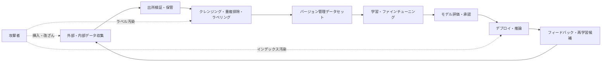
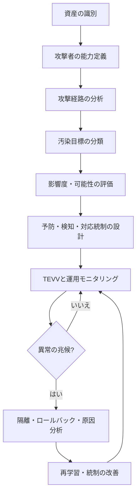

# AI学習データ汚染攻撃(Data Poisoning)とデータ完全性の防御

## 1. 概要

> **定義:** AI学習データ汚染(Data Poisoning)とは、攻撃者が事前学習・ファインチューニング・埋め込み・検索インデックス作成に使用されるデータまたはそのメタデータを意図的に挿入・改ざん・削除し、モデルの性能、公平性、安全性、あるいは特定条件下での振る舞いを攻撃者に有利なものにする敵対的攻撃である。

近年のAIシステムは、モデルそのものよりも、データパイプラインと外部の知識源により広く依存している。公開Webデータ、ユーザーフィードバック、社内文書、ラベリング業者の成果物、オープンなモデルとデータセット、ベクトルインデックスが、一つの連続したサプライチェーンを構成する。したがって、データが学習時に一度だけ使われるのではなく、継続的に収集され再学習されるMLOps環境では、小さな汚染も反復学習を通じて拡大しうる。

従来のソフトウェアセキュリティにおいて完全性とは、ファイルやコードが許可なく変更されていないという性質であった。AIでは、入力データの統計的分布と意味的品質がモデルのパラメータと意思決定に反映されるため、データが形式上は正常であっても、意味的に偏っていたり特定のトリガーが仕込まれていたりすれば完全性が損なわれる。すなわち、ハッシュが一致するファイルであっても、信頼できない出所で生成されたものであれば安全とは断定できない。

データ汚染は機密性の侵害とは異なる。攻撃者はデータを盗まなくても意図した結果を得ることができ、モデルの可用性を低下させたり、特定の入力に対してのみ誤作動を起こさせたり、特定の集団に不利な決定を誘導したりすることができる。特に、正常な入力に対しては高い精度を維持するバックドア型の攻撃は、一般的な品質評価を通過しやすく、早期発見が難しい。

このテーマの核心は、単に悪性レコードを削除することではない。データの出所と変換履歴を証明し、学習パイプラインの権限を最小化し、モデルリリースの前後で振る舞いを検証し、異常発生時にはクリーンなデータとモデルへ戻すという、ライフサイクル全体にわたる統制体系を設計することにある。

## 2. 攻撃対象領域とライフサイクル

AIのデータサプライチェーンは、収集、クレンジング、ラベリング、保存、学習、デプロイ、運用フィードバックの段階で構成される。各段階で攻撃者は、データの内容だけでなく、ラベル、タイムスタンプ、出所、ライセンス、サンプリング比率、埋め込み、インデックス更新イベントを操作しうる。防御側はモデルファイルだけを点検するのではなく、データとパイプラインのつながりをあわせて見なければならない。

第一の攻撃対象領域は収集段階である。公開クローリングの結果や第三者APIの内容を信頼してそのまま保存すると、攻撃者は検索順位の操作、虚偽文書の掲載、悪性アカウントの大量作成によってデータセットを汚染できる。収集時点では正常なテキストに見えても、後にモデルの特定の応答を誘導する文を含んでいる可能性がある。

第二の攻撃対象領域は、クレンジングとラベリングの段階である。ラベルを意図的に反転させれば分類境界が移動し、特定の集団のサンプルを欠落させれば代表性が低下する。自動ラベリングシステムが攻撃者の作ったルールを学習すると、人の検収なしに大量の汚染サンプルを生産しうる。

第三の攻撃対象領域は、学習及びファインチューニングの段階である。攻撃者はごく一部のサンプルを制御するだけで、まれなトリガーと目標出力を結びつけることができる。一般的な検証セットにはトリガーが含まれないため、平均精度は正常に見えながら、特定の条件下でのみ攻撃者の意図どおりに振る舞うバックドアが可能となる。

第四の攻撃対象領域は、埋め込みとRAGインデックスである。検索拡張生成システムは運用中の文書ストアとベクトルデータベースを直接参照するため、再学習をしなくても悪性文書を挿入することで検索結果と回答の根拠を変えることができる。この攻撃は厳密な意味でのパラメータ汚染とは異なるが、ランタイムの知識ベースの完全性を損なうという点で、同じ統制原理が必要である。

第五の攻撃対象領域は、ユーザーフィードバックとオンライン学習である。顧客の評価、報告、会話ログが自動的に再学習データに組み込まれると、攻撃者は繰り返し虚偽のフィードバックを送ることで、モデルの選好やポリシーを少しずつ移動させることができる。運用上の利便性のために承認段階を省略すると、データ汚染が正常な改善プロセスに偽装される。

| ライフサイクル段階 | 主要資産 | 考えられる攻撃 | 代表的な影響 |
|---|---|---|---|
| 収集 | ソース文書、API応答 | 虚偽文書・アカウントの挿入 | 偏り・誤りの拡散 |
| クレンジング | フィルター、重複排除ルール | フィルター回避、サンプル削除 | 代表性の毀損 |
| ラベリング | ラベルと注釈 | ラベル反転、境界操作 | 分類性能の低下 |
| 学習 | データセット、パラメータ | 汚染サンプル・バックドア | 特定条件での誤作動 |
| 埋め込み | ベクトルとメタデータ | 悪性文書・メタデータの挿入 | 誤った検索根拠 |
| 運用 | フィードバック、再学習キュー | 評価・ログの操作 | 持続的なモデルの偏り |

この表で重要なのは、同じ攻撃であっても段階によって証拠と対応時間が異なるという点である。ソースデータの段階で発見すれば汚染サンプルを隔離して再生成できるが、すでにパラメータに反映された後であれば、どのデータが原因なのかを逆追跡することは難しい。したがって、前段の予防統制と後段の振る舞い検証をあわせて設けなければならない。

## 3. 攻撃の類型と動作原理

### 3.1 無差別・標的・バックドア汚染

無差別汚染は、全体の性能を低下させたり、学習分布を特定の方向へ移動させたりする方式である。攻撃者は大量の誤りサンプル、重複サンプル、特定集団の過剰サンプリングを利用しうる。データが十分に大きければ単純な外れ値検知に引っかかる可能性があるため、複数のアカウントと異なるバリエーションを使って正常な分布のように見せかけることもある。

標的型汚染は、特定のクラス、特定の顧客、特定の地域、あるいは特定の業務条件に対してのみ誤作動を誘導する。例えば、正常な金融取引の大部分は正確に分類しつつ、特定の加盟店コードを含む取引だけを不正取引と判定するよう学習境界を操作することができる。標的型攻撃は、平均指標よりもサブグループごとの指標を確認してはじめて明らかになる。

バックドア汚染は、入力に攻撃者が定めたトリガーが現れたときにのみ目標の振る舞いを実行させる。トリガーは、特定の単語、ピクセルパターン、メタデータの値、文書の書式、ユーザーIDのように、一般的な評価ではほとんど登場しない特徴でありうる。モデルは平常時には正常に見えるため、テストカバレッジを高めるだけでは十分ではない。

| 類型 | 攻撃目標 | 観察される現象 | 検知難易度 | 優先的な防御 |
|---|---|---|---|---|
| 無差別汚染 | 全体の品質・可用性の低下 | 精度・損失の悪化 | 中 | 分布・品質のモニタリング |
| 標的型汚染 | 特定クラス・集団の操作 | 部分的な指標の悪化 | 高 | グループ別評価・出所分析 |
| バックドア | トリガー条件での目標行動 | 平常時は正常、条件付きで誤作動 | 非常に高 | トリガー探索・振る舞い検証 |
| ラベル汚染 | 決定境界の移動 | ラベルと特徴の不一致 | 中 | 多重検収・ラベルの合意 |
| RAG汚染 | 検索根拠・応答の操作 | 特定クエリにおける根拠の歪曲 | 高 | 文書署名・根拠検証 |

攻撃の類型を区別する理由は、同じ防御手法でも効果が異なるためである。例えば、全体の損失を監視すれば無差別汚染は発見しやすいが、バックドアは見逃す可能性がある。逆に、すべてのデータを人が再検収すれば検知力は高まりうるが、コストと処理時間が増える。リスクベースでデータと評価に差をつけなければならない。

### 3.2 データ・ラベル・メタデータへの攻撃

データへの攻撃は、テキスト、画像、音声、センサー値のように、モデルが直接読み取る内容を変える。ラベルへの攻撃は、入力自体は正常なまま正解を変えて学習の方向をずらす。メタデータへの攻撃は、出所、時刻、信頼度、権限、削除の有無といった周辺情報を操作し、正常なデータが誤った経路を通過するようにする。

メタデータはしばしば補助情報として扱われるが、実際のパイプラインではフィルターとサンプリングの基準となる。例えば、`trusted=true`のフィールドだけを通過させるポリシーがある場合、この値を変更するだけで悪性文書が学習に入り込みうる。したがって、内容のハッシュとあわせて、メタデータの変更履歴、変更主体、承認イベントも保存しなければならない。

データの重複も攻撃要素となる。同一または非常に類似したサンプルを繰り返し挿入すると、モデルは特定の表現を過度に記憶する。データセット全体のサイズが大きくなるとサンプルの比率は小さく見えるが、実際には同じ意味の影響力が過度に大きくなり、モデルの決定境界を動かしうる。

| 攻撃対象 | 例 | なぜ危険か | 検証方法 |
|---|---|---|---|
| 特徴量 | 画像のピクセル・センサー数値の操作 | 入力と正解の関係の歪曲 | 範囲・分布・物理法則のチェック |
| ラベル | 正常/異常の反転 | 学習境界の汚染 | 独立したラベラーによる合意 |
| 出所 | 虚偽の作成者・ドメイン | 信頼ポリシーの回避 | 出所の評判・署名の確認 |
| 時刻情報 | 作成日・更新日の変更 | 時系列順序の歪曲 | 元ログ・タイムスタンプとの照合 |
| 権限情報 | 承認フラグの操作 | 禁止データの流入 | アクセス制御・不変の監査ログ |

### 3.3 フロントランニングとスプリットビュー

フロントランニング型は、攻撃者が今後収集されるデータや評価基準を予測し、先回りして汚染データを配置する方式である。公開データセットの次のバージョンに特定の文書を事前に投稿したり、検索エンジンに繰り返し露出させたり、ラベリング作業者が目にする位置にデータを配置したりすることがその例である。防御側は収集日だけを記録するのではなく、最初に発見された時点と元の状態を証明しなければならない。

スプリットビュー型は、対象によって異なるデータが見えるようにし、検証者と実際の学習者が同じ世界を見られないようにする。例えば、セキュリティ検査用アカウントにはクリーンな文書を見せ、学習パイプライン用アカウントには操作された文書を返すことができる。キャッシュ、地域別のCDN、権限別のAPI応答が互いに異なると、この攻撃は隠蔽されうる。

こうした攻撃は、単一のスナップショット検査では発見しにくい。同じデータセットを独立した経路で再収集して比較したり、ハッシュだけでなく原文と応答ヘッダー、認証主体、収集時刻をあわせて記録したりしなければならない。検証環境と学習環境のデータビューが同じであるという前提も、定期的に試験する必要がある。

## 4. 脅威モデルとリスク評価

脅威モデリングは、攻撃者の能力、アクセス可能な段階、目標、影響範囲を明示する作業である。攻撃者がデータ全体を制御すると仮定するのか、一部のレコードしか挿入できないと仮定するのかによって、防御策と残余リスクは変わる。技術士は、攻撃シナリオを資産・経路・影響・統制・証拠のつながりとして整理しなければならない。

資産は、ソースデータ、クレンジング済みデータ、ラベル、特徴量ストア、データセットバージョン、モデルの重み、埋め込み、検索インデックス、再学習キュー、評価セットに細分化する。「学習データ」一つにひとまとめにすると、どの資産の完全性が損なわれたのかを追跡できない。資産ごとにオーナー、保持期間、変更を許可された者、復旧基準を指定する。

攻撃者の能力は、公開データに投稿できるレベル、ラベリング業者のアカウントを乗っ取ったレベル、パイプラインのリポジトリへの書き込み権限を持つレベル、モデルと評価セットのすべてを閲覧できるレベルに分けて考えることができる。権限が高くなるほど、暗号化よりも承認の分離と独立した検証が重要になる。

リスク評価は可能性だけで終わらせず、業務への影響と検知の遅延を掛け合わせて考える。医療分類モデルでは、0.1%のバックドアであっても特定の患者群に集中すれば、平均精度よりはるかに大きな被害を生みうる。金融・製造・公共サービスのように、自動決定が外部の権利と安全に影響を与えるシステムでは、低い発生確率も高いリスクとして扱わなければならない。

| 評価の次元 | 問い | 指標の例 |
|---|---|---|
| 影響 | 汚染されると何が変わるか? | 精度、安全事故、金銭的損失 |
| 可能性 | 攻撃者はどの段階にアクセスできるか? | アカウント数、外部依存度 |
| 隠蔽性 | 通常の検査で隠れることができるか? | トリガーの希少性、検出時間 |
| 拡散性 | 再学習・複製の過程で広がるか? | 派生データセット数 |
| 復旧性 | クリーンな状態に戻れるか? | RTO、バックアップ復旧成功率 |

## 5. 防御アーキテクチャ

### 5.1 予防:出所・完全性・権限

第一の防御線は、データの出所と系譜(Lineage)を管理することである。元のURL、収集主体、収集時刻、ライセンス、変換コードのバージョン、ラベラー、承認者を記録し、各変換結果について親データセットとの関係を残す。出所が不明なデータは、品質が良さそうに見えても信頼等級を下げ、隔離領域でのみ使用する。

第二の防御線は、データのバージョン管理と不変保管である。学習に使用した正確なデータセットと設定を再現できてはじめて、事故発生時に汚染が始まった時点を比較できる。ハッシュは変更検知に有用だが、鍵管理が脆弱であったり、正規の権限者が悪性データに署名したりすれば、ハッシュだけでは意味的な汚染を防ぐことはできない。

第三の防御線は、最小権限と承認の分離である。収集サービスが本番のモデルリポジトリに直接書き込めないようにし、ラベラーが承認フラグを変更できないようにし、再学習を開始する権限とモデルをデプロイする権限を分ける。自動化は便利だが、データとモデルの信頼境界を越える際には、人または独立したサービスによる承認を求める。

### 5.2 検知:統計・意味・振る舞いの検証

統計的検知は、分布の変化、重複率、希少値、ラベルの不均衡、埋め込みクラスターからの逸脱を見つける。この方法は大量挿入や異常なサンプルに強いが、正常な分布に紛れた低比率の攻撃や、意味的に自然な文書には弱い。したがって、統計指標をそのまま遮断基準として使うよりも、リスクスコアと手動レビューのキューを作るほうが安全である。

意味的検知は、文書間の矛盾、出所と内容の不一致、ラベルと特徴の不整合、特定の文言の反復的な関連性を分析する。LLMを検収に活用することもできるが、検収モデル自体が同じ汚染データにさらされていると、エラーが連鎖しうる。高リスクのサンプルは、独立したモデル、ルールベースのチェック、人によるレビューを組み合わせなければならない。

振る舞いの検証は、モデルがさまざまな条件下で期待されるポリシーを守っているかを確認する。正常・境界・敵対・トリガー候補の入力を含む評価セットを別途維持し、リリース前後の出力分布とグループ別の性能を比較する。モデルが正常なテストを通過したという事実はバックドアが存在しないことの証明ではないため、検証の限界と見逃しの可能性もあわせて報告しなければならない。

| 防御層 | 統制例 | 長所 | 限界 |
|---|---|---|---|
| 出所 | 署名・評判・許可リスト | 流入前の遮断 | 信頼できる出所も乗っ取られうる |
| 完全性 | ハッシュ・不変ストレージ・DVC | 変更追跡・再現性 | 正規に署名された悪性内容は見逃す |
| 品質 | 重複・外れ値・分布のチェック | 大量汚染に効果的 | 低比率・正常型の攻撃に弱い |
| 検証 | グループ別性能・バックドアテスト | 振る舞いへの影響を確認 | すべてのトリガーの探索は不可能 |
| 権限 | 最小権限・承認の分離 | 攻撃範囲の縮小 | 運用の複雑さの増大 |
| 対応 | 隔離・ロールバック・再学習 | 被害継続時間の短縮 | 原因データの追跡が必要 |

### 5.3 対応と復旧

異常の兆候が発見されたら、まず該当するデータセット、モデル、インデックスの使用を停止するか隔離する。問題を確認する前に運用データを削除すると証拠と再現性が失われうるため、読み取り専用のコピーと監査ログを保存する。高リスクのサービスでは、自動遮断と人による承認を組み合わせて検知の遅延を減らす。

原因分析では、最初の汚染時点、影響を受けた派生データ、モデルリリース、インデックス更新、ユーザーへの出力に至るまでの経路をたどる。データの系譜がなければすべてのデータを最初から再検収しなければならないため、復旧コストが大幅に増加する。汚染サンプルを除去した後も、すでにパラメータに学習された影響が残りうるため、クリーンなスナップショットから再学習するほうが安全な場合が多い。

復旧完了の基準は、単にサービスが再び応答することではない。クリーンなデータとモデルのハッシュ、評価結果、脆弱なシナリオの再現の有無、再発防止統制、承認記録を確認しなければならない。ロールバック可能なモデルとデータセットを定期的に復元してみる復旧訓練も必要である。

## 6. 比較:データ汚染と隣接する攻撃

データ汚染は、学習または知識供給の経路を変えることで、モデルの基本的な振る舞いを変形させる。回避攻撃は、モデルがすでに学習を終えた状態で入力を操作して誤った結果を出させるものであり、モデル抽出は出力の観察によってモデルの機能を複製することに焦点がある。プロンプトインジェクションはランタイムの指示の優先順位を揺るがし、RAG汚染は検索知識源を汚染する。

この区別はインシデント対応において重要である。モデルの再学習が必要な事案なのか、入力フィルターとポリシー検証で緩和できる事案なのか、文書インデックスだけをロールバックすればよい事案なのかによって、復旧手順が異なるためである。一つの事案が複数の攻撃を組み合わせている可能性もあるため、最初から単一の分類に固定してはならない。

| 区分 | 発生時点 | 主な対象 | 典型的な対応 |
|---|---|---|---|
| データ汚染 | 学習前・学習中・再学習 | データ・ラベル・パラメータ | データの隔離・再学習 |
| 回避攻撃 | 推論時 | 入力・センサー・クエリ | 入力検証・頑健性評価 |
| モデル抽出 | 推論の反復 | モデルの機能・パラメータ | API制限・出力監視 |
| プロンプトインジェクション | ランタイム | 指示・コンテキスト | 権限分離・出力ポリシー |
| RAG汚染 | インデックス作成・更新 | 文書・埋め込み | 出所検証・インデックスのロールバック |

## 7. 事例:コールセンターRAGモデルにおけるナレッジベース汚染

架空の金融コールセンターが、商品約款、FAQ、相談履歴を収集して検索拡張生成モデルを運用しているとする。運用チームは最新の約款を迅速に反映するため、協力会社のポータルから文書を自動収集し、ベクトルインデックスを毎時更新している。文書の出所ドメインだけを確認し、電子署名と承認状態を検証していなければ、攻撃者は協力会社のアカウントや公開掲載領域に操作された約款をアップロードできる。

攻撃者は、返金条件を変更する文書を複数の類似ファイルとして作成して検索頻度を高め、文書本文の中にモデルに対して社内システムへ接続するよう指示する文を挿入することもできる。モデルを再学習しなくてもインデックスが汚染されるため、ユーザーは誤った返金案内を受け、エージェントが決済取消ツールを呼び出すといった被害が発生しうる。

対応設計は次のとおりである。第一に、約款は協力会社の公開文書ではなく、署名された原本リポジトリを基準とする。第二に、収集文書は悪性コンテンツ検査と重複・類似度チェックを経た後、隔離インデックスに保存する。第三に、回答には文書ID、バージョン、承認者、有効期間をあわせて提示し、高リスクの業務は人が最終承認する。

第四に、インデックス更新の前後で基準クエリを自動実行し、返金・解約・個人情報請求のような中核業務の回答の変化を比較する。第五に、文書はポリシーを変更するものではなく参考資料であるという境界を、システムプロンプトとツール権限で強制する。第六に、異常時には最後に承認されたスナップショットへインデックスをロールバックし、影響を受けた会話と業務処理を追跡する。

| 統制の時点 | 実装例 | 検証証跡 |
|---|---|---|
| 収集前 | 許可ドメイン・署名・アカウントの検証 | 収集ログ・証明書 |
| 保存時 | 原本の不変保存・ハッシュ | オブジェクトバージョン・ハッシュ |
| インデックス作成前 | 悪性文書・重複・類似度のチェック | チェック結果・隔離キュー |
| デプロイ前 | 基準クエリ・ポリシーテスト | 評価レポート |
| 推論時 | 出所の表示・ツール権限の制限 | 回答・ツールの監査ログ |
| インシデント時 | インデックスのロールバック・影響の通知 | 復旧記録・承認記録 |

## 8. 深化:MLOps・LLMOpsと標準との連携

データ汚染の防御はモデル開発チーム単独の業務ではなく、DataOps、セキュリティ、個人情報、法務、運用が共同で遂行するサプライチェーン・ガバナンスの課題である。データセットとモデルをそれぞれバージョン管理することからさらに進み、「どのソースがどの変換を経て、どのモデルとインデックスに反映されたか」をリリース単位で束ねなければならない。

NISTの敵対的機械学習の分類体系は、汚染を回避攻撃・プライバシー攻撃とあわせて分析できる共通言語を提供する。OWASPの生成AIセキュリティガイドは、事前学習、ファインチューニング、埋め込みの段階におけるデータとモデルの汚染を区別し、出所検証、サンドボックス化、異常検知、データのバージョン管理、レッドチームによる検証を推奨している。MITRE ATLASは、攻撃者の戦術と技術の観点から、データとモデルのサプライチェーンにおける攻撃経路を整理するのに活用できる。

実務では、データセットに対するSBOMに類似した成果物、すなわちデータの構成・出所・ライセンス・変換・ラベラー・検証結果を記録するデータBOMを検討することができる。データBOMは、ソフトウェアの構成要素一覧を提供するSBOMとは目的が異なるが、モデルリリースの再現性とインシデントの影響分析を高めるという共通点がある。ただし、標準が完全に統一されたと断定せず、組織のデータコントラクトとメタデータ標準から定めるべきである。

LLMOpsでは、RAG文書、埋め込みモデル、ベクトルインデックス、システムプロンプト、ツール権限がまとめてリリースされる。したがって、モデル評価だけでは不十分であり、「検索された根拠は承認済みの最新文書か」「回答は根拠を誇張していないか」「文書内の指示がツール呼び出し権限へと昇格していないか」をテストしなければならない。この検証は、データ汚染とプロンプトインジェクションを組み合わせた攻撃を減らす。

予想される出題としては、データ品質管理、AIの信頼性、MLOps、SBOM、個人情報保護、サプライチェーンセキュリティが組み合わさった形式が有力である。答案は定義だけを書くのではなく、攻撃対象領域と脅威モデル、予防・検知・対応の統制、事例アーキテクチャ、成果指標と技術士の観点からのガバナンスを結びつける形で構成するのがよい。

## 9. 考慮事項及び示唆点

### 9.1 精度と完全性は別の指標として管理する

高い精度は、データが信頼できることを意味しない。全体の平均精度、グループ別の性能、バックドア候補入力における目標行動率、根拠文書の一致率を、それぞれ別の指標として管理しなければならない。特に標的型汚染は平均スコアに埋もれうるため、重要業務ごとの最低性能と異常の許容範囲を定める。

### 9.2 予防統制と検知統制のバランス

すべての外部データを遮断すれば最新性と業務上の活用性が低下し、すべてを許可すれば汚染リスクが大きくなる。信頼等級と業務への影響に応じて、隔離・サンドボックス・承認・直接使用の経路に差をつける。コストの大きい人による検収は高リスク・高影響のデータに集中させ、低リスクのデータには自動チェックを適用する。

### 9.3 説明可能な系譜と監査可能性

インシデント時に「モデルがなぜそのように回答したのか」を説明するには、入力データと検索根拠の系譜が必要である。データバージョン、変換コード、承認者、モデルのチェックポイント、インデックスのバージョンをあわせて記録し、保持期間と個人情報の最小収集の原則を守る。系譜ログ自体が個人情報や営業秘密を過度に保管しないよう、アクセス権限を分離する。

### 9.4 復旧可能性を設計品質として評価する

データとモデルのバックアップがあっても、それがクリーンな状態であるかを検証しなければ、汚染を再び復元してしまう可能性がある。最後の正常スナップショット、再学習手順、インデックスの再生成、サービスの段階的な復帰を定期的に試験する。RTOとRPOだけでなく、汚染除去にかかるMTTDとMTTRをAI運用指標に含める。

### 9.5 人による承認と自動化の境界

自動パイプラインはスピードを高めるが、モデルの振る舞いに影響を与える変更を無条件に自動承認してはならない。高リスクデータセットの新規出所、ラベルポリシーの変更、再学習範囲の拡大、外部ツールとの接続には、独立した承認と事後監査を求める。人によるレビューも形式的なクリックにならないよう、レビューの根拠と差し戻しの理由を記録する。

### 9.6 個人情報・著作権・サプライチェーンの同時考慮

データをクリーンにする過程で原本を過度に複製すると、個人情報の侵害とライセンス違反が発生しうる。データの出所検証は、セキュリティだけでなく、収集根拠、利用目的、保有期間、削除要求への対応と結びつけなければならない。外部のデータ・モデル・ラベリング業者との契約には、完全性の証明、インシデントの通知、監査権、再利用の制限を含めることが望ましい。

## 10. 答案構成戦略(要約)

試験答案は、「定義と必要性 → ライフサイクル別の攻撃対象領域 → 無差別・標的・バックドア及びRAG汚染の比較 → 脅威モデルと概念図 → 出所・完全性・権限に基づく予防 → 統計・意味・振る舞いの検証 → 隔離・ロールバック・再学習による対応 → コールセンターRAG事例 → 標準との連携と技術士としての示唆」の流れで展開する。

## 参考資料

1. NIST, *Adversarial Machine Learning: A Taxonomy and Terminology of Attacks and Mitigations*, AI 100-2 E2025 (Final), https://csrc.nist.gov/pubs/ai/100/2/e2025/final
2. OWASP GenAI Security Project, *LLM04:2025 Data and Model Poisoning*, https://genai.owasp.org/llmrisk/llm042025-data-and-model-poisoning/
3. MITRE, *MITRE ATLAS: Adversarial Threat Landscape for Artificial-Intelligence Systems*, https://atlas.mitre.org/
4. NIST, *Adversarial Machine Learning: A Taxonomy and Terminology of Attacks and Mitigations*, https://csrc.nist.gov/pubs/ai/100/2/e2023/final

---

> **一言まとめ**: AIデータ汚染は、学習・埋め込み・フィードバックのサプライチェーンの完全性を損なう攻撃であるため、出所・バージョン・権限・振る舞い検証・ロールバックを結びつけたライフサイクル全体にわたる防御が必要である。
