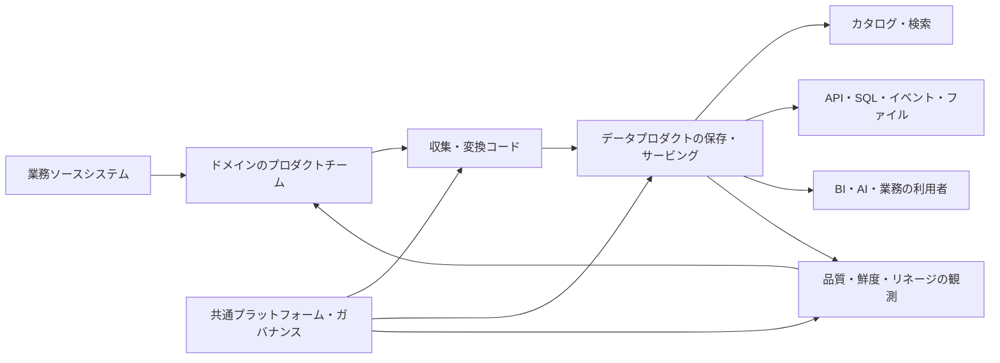
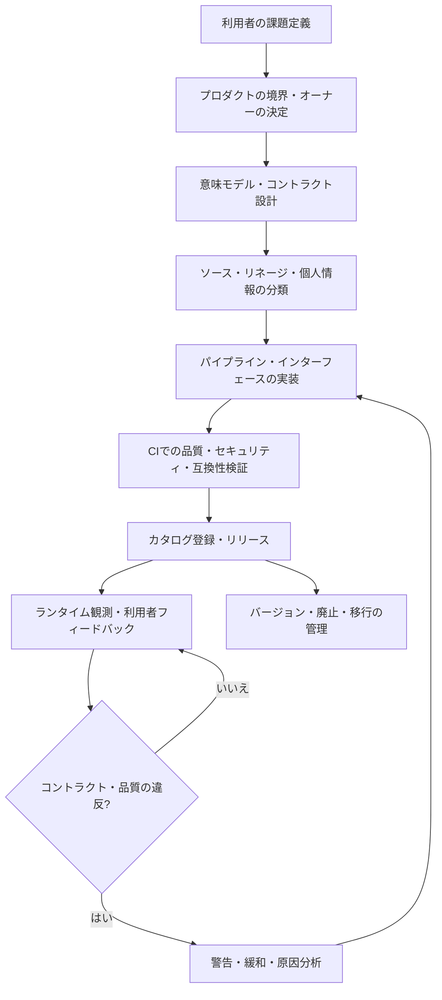

# データプロダクト(Data Product)の設計と運用

## 1. 概要

> **定義**: データプロダクト(Data Product)とは、特定の利用者と業務目的のために、データ、メタデータ、意味モデル、処理コード、アクセスインターフェース、品質・セキュリティ・運用の責任を一つのデプロイ・管理単位として束ね、継続的に価値を提供するデータ資産である。

データプロダクトは、単によく整理されたテーブルやデータベースの別名ではない。
利用者が意味を解釈できる説明、安全に使えるアクセス方法、品質を確認できる指標、変更を予測できるバージョンポリシー、問題が起きたときに連絡すべきオーナーをあわせて提供する。
したがってデータプロダクトは、データそのものと、データを生産・検証・配布・観測する周辺能力とをあわせて含むプロダクト単位として理解しなければならない。

従来の中央集中型データウェアハウスでは、中央データチームが複数の業務システムのデータを収集し、利用者の要求に応じてテーブルとレポートを作成して提供する方式が一般的であった。
この構造は標準化と統制を確保しやすいが、ドメイン知識が中央チームに集中し、要求の待ち行列が長くなり、ソースシステムにおける意味の変化が分析データに反映されるのが遅れるという問題が生じる。
データプロダクトのアプローチは、注文・顧客・決済・物流のように、データを最もよく理解するドメインチームが分析用データをプロダクトとして責任を持ち、中央プラットフォームチームは共通の実行基盤とガードレールを提供するという方式で、このボトルネックを減らす。

データプロダクトはデータメッシュ(Data Mesh)の中核的な実装単位としてしばしば論じられるが、二つの概念を同一視してはならない。
データメッシュは、ドメイン指向の所有権、データをプロダクトとして扱う考え方、セルフサービスデータプラットフォーム、連邦型コンピュテーショナルガバナンスという、組織・アーキテクチャ原則の組み合わせである。
データプロダクトは、その原則を利用可能な成果物として具体化した単位である。
中央集中型の環境でもデータプロダクトを作ることはでき、データメッシュを導入してもプロダクトの基準がなければ、ドメインごとのテーブルが増えるだけになりうる。

技術士の答案では、「データをプロダクトのように管理する」というスローガンを繰り返すよりも、プロダクトの顧客、価値、インターフェース、品質の約束、責任、ライフサイクルを結びつけて説明しなければならない。
特にデータは一般的なソフトウェアとは異なり、複製・組み合わせが容易で利用文脈によって意味が変わるため、スキーマの互換性だけではプロダクトの品質を保証できない。
業務定義と時間基準、集計ルール、個人情報の処理目的、ソースの追跡可能性まであわせて管理してはじめて、信頼できるデータプロダクトとなる。

### A. 登場背景と必要性

第一に、データの利用者と生産者の距離が遠くなった。
マイクロサービス、SaaS、マルチクラウド、ストリーミングプラットフォームを使用すると、一つのドメインの運用データが複数の分析パイプラインを経て多様な利用者へ届けられる。
生産チームはどのフィールドが重要かを知っていても、利用者はその意味を推測するか、別途の文書や担当者を探さなければならない。
プロダクト化は、発見、理解、アクセス、利用、フィードバックの流れを一つの責任として束ねる。

第二に、データのサイレント障害がビジネス損失につながる。
パイプラインのジョブが成功していても、前日比で売上が異常に減少していたり顧客識別子が重複していたりすれば、意思決定や精算の結果が誤りうる。
プロダクトは可用性だけでなく、完全性、妥当性、鮮度、重複率、分布の変化といった品質目標を明示し、それを継続的に測定しなければならない。

第三に、AI活用の拡大に伴い、学習・評価・推論に適したデータの供給が競争力となった。
モデルの性能はアルゴリズムだけで決まるのではなく、ラベルの定義、時間的リークの防止、データのリネージ、バイアスの点検、再現可能な抽出条件に左右される。
再利用可能な学習データセットや特徴量セットも、オーナーと品質基準を持つデータプロダクトとして運用できる。

### B. データセット・データサービスとの区別

データセットはデータの集まりという技術的な成果を指し、データプロダクトは利用者価値と運用責任を含む管理概念である。
例えば`orders_daily`テーブルが存在するからといって、自動的にデータプロダクトになるわけではない。
定義された売上認識ルール、更新完了時刻、品質検証、アクセスポリシー、変更通知、サポートチャネルがあってはじめて、利用者は業務に安全に使用できる。

データサービスは、APIやクエリのようにデータを提供する接点に焦点を当てる。
一方データプロダクトは、APIを使うかファイル・テーブル・イベント・ダッシュボードを使うかにかかわらず、結果の意味と品質に責任を持つ。
すなわち、データサービスはデータプロダクトのインターフェースにはなりうるが、データプロダクト全体と同一ではない。

| 区分 | データセット | データサービス | データプロダクト |
|---|---|---|---|
| 中心 | 保存されたデータの集まり | 提供インターフェース | 利用者価値とライフサイクル全体 |
| 構成 | 行・列・ファイル・イベント | API・クエリ・ストリーム | データ・メタデータ・コード・インフラ・ポリシー |
| 品質の約束 | 文書化されていない場合がある | 応答性中心 | 正確性・鮮度・可用性・意味・セキュリティ |
| 責任 | 保存管理者中心 | サービス運用者中心 | ドメインのプロダクトチームによるエンドツーエンドの責任 |
| 変更方式 | 恣意的な変更のリスク | APIのバージョンポリシー | 契約・影響分析・告知・廃止手順 |

## 2. データプロダクトの概念モデルと構成要素

データプロダクトは、特定のドメインの中で独立して理解可能な情報概念を提供しなければならない。
顧客ドメインが顧客の現在の状態と同意履歴を提供し、決済ドメインが承認・取消・返金の事実を提供するというように境界を設定する。
利用者は、データのソースシステムの構造ではなく、プロダクトの業務上の意味を基準にアクセスしなければならない。

### A. 論理的構成要素

**データ**は、バッチテーブル、変更イベント、時系列、文書、グラフ、特徴量ベクトルなど、さまざまな形態をとりうる。
形式よりも重要なのは、プロダクトの目的に合ったデータが選別され、時間・単位・キー・欠損の表現が一貫して定義されているかどうかである。
ソースのコピーをそのまま公開するよりも、利用者が使える安定した公開モデルとソースの追跡可能性をあわせて提供するほうが安全である。

**メタデータと意味**は、プロダクトの取扱説明書であると同時に検索インデックスでもある。
フィールドの説明を並べるだけでなく、顧客の定義、注文確定の時点、売上認識の基準、金額の通貨と税込みか否かのように、判断に影響する業務上の意味を明記しなければならない。
技術メタデータには、スキーマ、パーティション、フォーマット、場所、オーナー、更新周期、リネージ、品質指標を含める。

**コード**は、収集・変換・検証・サービング・アクセスポリシーを実行する。
プロダクトのコードはバージョン管理リポジトリで管理し、スキーマと品質ルールをコードとして宣言して、デプロイ前に自動検証する。
コードとデータのバージョンをあわせて記録すれば、同一の結果を再現し、障害原因を追跡しやすくなる。

**インフラ**は、ストレージ、処理エンジン、カタログ、オーケストレーター、認証・認可、モニタリング、コスト追跡を含む。
これはドメインチームがすべてのインフラを独自に構築するという意味ではなく、セルフサービスプラットフォームが標準テンプレートと安全なデフォルト値を提供し、プロダクトチームが必要な構成を選択できるようにするという意味である。

### B. 参照概念図

ソースシステムは業務処理のための整合性を優先するが、分析利用者がそのまま使うには、結合・コード値・変更履歴が扱いにくい場合がある。
ドメインのプロダクトチームは、ソースの意味を理解したうえで分析用の表現を作り、プロダクトのインターフェースを通じて利用者に公開する。
共通プラットフォームは、デプロイ・認証・カタログ・観測の機能を提供し、ドメインチームが毎回ゼロから構築しなくて済むようにする。

品質観測の結果は、中央のダッシュボードに蓄積されるだけであってはならない。
鮮度の低下や契約違反が発見されれば、プロダクトのオーナーに自動的に伝えられ、重大度に応じて利用者への警告・デプロイの遮断・代替データの提供へとつながらなければならない。
このクローズドループがあってはじめて、データプロダクトは静的なファイルではなく、運用されるプロダクトとなる。

### C. データプロダクトの品質特性

データプロダクトは**発見可能性**を備えていなければならない。
利用者はプロダクトカタログで、業務用語、ドメイン、タグ、例、オーナー、状態からプロダクトを探し、類似プロダクトや重複プロダクトを比較できなければならない。
検索結果に技術的なテーブル名だけが表示されるとプロダクト化の効果が薄れるため、ビジネス用語と技術用語を結びつける用語集が必要である。

**アドレス指定可能性**とは、プロダクトを見つけた後に安定した方法でアクセスできるという意味である。
環境ごとのエンドポイント、データ共有領域、APIパス、認証方式、利用例を提供し、権限がない場合にはアクセス申請の手順を案内する。
アクセス経路が担当者の個人アカウントや一時的なファイルリンクに依存していると、プロダクトの再現性と運用性が低下する。

**理解可能性と相互運用性**は、利用者が毎回生産者に質問することなく使えるようにする。
日付・タイムゾーン・通貨・コード値・識別子のルールを明記し、標準フォーマットと共通のドメインモデルを活用する。
ただし、すべてのドメインに一つの巨大スキーマを強制すると変化のスピードが遅くなりうるため、意味の核心だけを連邦化し、細部の表現はプロダクト契約で管理する。

**信頼性とセキュリティ**は、一つの数値の正確さよりも広い概念である。
品質の測定方法と結果、ソースのリネージ、既知の制約事項、個人情報の等級、利用目的、保持期間を確認できなければならない。
信頼性とはデータが常に完璧であるという約束ではなく、品質の状態と不確実性を利用者が判断できるようにする透明性まで含むものである。

| 品質特性 | プロダクトが提供すべき証拠 | 代表的な指標 |
|---|---|---|
| 発見可能 | カタログ・用語集・例 | 検索成功率、未登録資産の比率 |
| 理解可能 | 意味・単位・時間基準・サンプル | 問い合わせ件数、文書の完成度 |
| アドレス指定 | 安定したエンドポイントと権限手続き | アクセス成功率、平均承認時間 |
| 信頼可能 | リネージ・品質結果・制約事項 | 完全性、妥当性、重複率 |
| 最新性 | 更新周期と遅延通知 | freshnessの遅延、定時配布率 |
| 相互運用 | 標準の型・キー・契約 | 互換利用者数、変換回数 |
| セキュリティ・コンプライアンス | 等級・ポリシー・監査ログ | ポリシー違反、過剰権限、監査漏れ |

## 3. 設計手順とアーキテクチャ

### A. プロダクトの発見と境界設定

最初の段階は、技術チームが作りたいテーブルを決めることではなく、解決すべき利用者の課題を定義することである。
「マーケティング分析用のすべての顧客データ」のような範囲の広い要求よりも、「キャンペーンの成果を顧客の同意状態とあわせて週単位で評価する」のように、意思決定と時間範囲を明確にしなければならない。
プロダクトの成功指標は参照数だけでなく、意思決定時間の短縮、手作業の削減、モデル性能、精算エラーの減少のように、利用者価値として設定する。

境界は、ドメインと情報概念を基準に定める。
一つのプロダクトが顧客の個人情報、注文の状態、配送の位置をすべて所有すると、変更責任と個人情報の目的が混ざり合う。
逆にプロダクトを小さく作りすぎると、利用者が数十のプロダクトを組み合わせなければならなくなり、組み合わせのコストが大きくなる。
独立した価値と凝集度、変更理由、アクセス権限、運用責任を基準に、適切な大きさを定める。

プロダクトオーナーは技術担当者一人の別名ではなく、プロダクトの意味と品質の約束を決定する責任主体である。
ドメイン専門家、データエンジニア、アナリスト、セキュリティ・個人情報担当者、主要な利用者を含むプロダクトチームを構成し、意思決定権限を明記する。
中央データチームはポリシーとプラットフォームを支援するが、ドメイン知識が必要な品質判断を代行しない。

### B. データコントラクトと公開インターフェース

データコントラクトは、フィールド名と型だけでなく、意味、必須性、許容値、時間基準、品質ルール、更新周期、アクセスポリシー、変更・廃止の手順を含む。
例えば、`order_status`の`COMPLETED`が決済承認の時点なのか配送完了の時点なのかが異なれば、同じコード値でも異なる結論を生む。
コントラクトには、定義と例示レコード、禁止された利用、既知の遅延と欠損の処理方法も記録する。

インターフェースは利用者のタイプに応じて選択する。
ダッシュボードと定期分析にはテーブル・ファイル・SQLビューが便利であり、リアルタイムの不正検知や状態伝播にはイベントストリームが適している。
モデル学習では再現可能なスナップショットとバージョン固定が重要であり、外部サービスには認証されたAPIと利用量ポリシーが必要である。
一つのプロダクトが複数のインターフェースを提供するとしても、意味と品質の基準は共通に維持しなければならない。

互換性ポリシーは、変更のリスク度に応じて定める。
新しい任意フィールドの追加は多くの利用者にとって互換性があるが、既存フィールドの意味や単位を変えることは論理的な破壊的変更である。
破壊的変更は、新バージョンの発行、並行提供、利用者の確認、移行期間、廃止告知を経なければならない。
コントラクトの検証はCIでサンプル・スキーマ・品質ルールをチェックし、運用中は実際の分布と遅延を観測する。

### C. デプロイと運用のフロー

設計段階で個人情報と機微情報を分類しておかなければ、プロダクトの完成後にアクセスポリシーを付け加えることは難しい。
収集目的、最小収集、仮名・匿名化処理、保持期間、国外移転の有無、利用者ごとの許可目的をプロダクトの属性として記録する。
機微なソースをすべての利用者に複製するよりも、必要な集計・仮名化の結果を別のプロダクトとして提供するほうが、露出面積と誤用・濫用の可能性を減らせる。

デプロイは、アプリケーションのリリースと同じレベルで扱う。
コードとコントラクトの変更をレビューし、バックフィル(backfill)や再処理の際に既存の結果が変わるかを確認し、カタログと変更ログをあわせて更新する。
データ品質の検証では、デプロイの遮断条件と警告条件を分けなければならない。
一時的な遅延を無条件に遮断すれば業務が止まりうるし、深刻な識別子の重複を警告だけで済ませれば誤った精算が拡散しうる。

運用中は、データのオブザーバビリティとサービスのオブザーバビリティをあわせて見る。
パイプラインの成否、処理時間、コスト、保存量だけでなく、最新性、行数の変化、値の分布、NULL比率、参照整合性、利用者のクエリエラーを結びつける。
利用者への影響が大きいプロダクトでは、障害等級と連絡体制、代替データ、再処理の目標時間、事後分析の手順を宣言する。

## 4. ガバナンスと組織運営

### A. 中央集中型とドメイン分散型の比較

中央集中型は、共通の標準と統制に強い。
小規模な組織や規制の厳しい環境では、一つのチームが標準モデルと品質チェックを一貫して運用するほうが効率的な場合がある。
しかし、ドメイン数と利用者数が増えると、中央チームがすべての要求を処理するのは難しくなり、ドメインの変化がプロダクトに反映されるまでの時間が長くなる。

ドメイン分散型には、データと業務知識に近いチームで継続的に管理されるという長所がある。
その代わり、チームごとに品質基準・ツール・用語が異なり、コストと責任が分散し、全社的な統合分析が難しくなる可能性がある。
したがって、分散とは無規則を意味するのではなく、グローバルな原則と自動化されたポリシーを共有する連邦型モデルでなければならない。

| 判断軸 | 中央集中型データチーム | ドメイン中心のデータプロダクト | 実務的な折衷 |
|---|---|---|---|
| 意味の責任 | 中央チーム | ドメインチーム | ドメインの定義と全社用語集の連携 |
| 標準化 | 迅速で一貫している | ばらつきが生じうる | 最小限の標準と自動チェック |
| 変化への対応 | 要求の待ちが生じうる | ドメインの変化に近い | プロダクトロードマップとプラットフォーム支援 |
| 運用負担 | 中央チームに集中 | ドメインチームに分散 | ゴールデンパス・共通テンプレート |
| 統合分析 | 容易 | 組み合わせの契約が必要 | 共通キー・意味モデル・カタログ |
| 責任の所在 | 比較的明確 | 境界の協議が必要 | プロダクトオーナーとデータスチュワードの指定 |

### B. 連邦型ガバナンスの統制ポイント

全社ガバナンスは、すべてのプロダクトの内部実装を承認する方式よりも、相互運用とリスクを統制する方式が適している。
必須メタデータ、個人情報の処理、アクセス制御、監査ログ、保持、暗号化、共通データ型、コントラクトの形式はグローバルポリシーとして定める。
プロダクトの内部パイプラインやストレージエンジンまで画一化すると、ドメインの自律性とイノベーションを損なう可能性がある。

ポリシーは人が読む文書としてだけ残すのではなく、プラットフォームで実行する。
カタログ未登録のプロダクトのデプロイを阻止し、個人情報の等級が高いフィールドには自動的にマスキングポリシーを適用し、コントラクトにない破壊的変更はCIで失敗させる。
アクセスの承認・取消、データの利用目的、クエリ監査、ポリシー例外の有効期限も自動的に記録してはじめて、事後監査が可能になる。

プロダクトポートフォリオの管理は、重複と放置を減らす。
利用のないプロダクト、最新性の約束を守れないプロダクト、同じ意味を互いに異なる形で提供しているプロダクトは、利用者と協議して統合または廃止する。
プロダクト数を増やすことが成熟度の証拠なのではなく、利用者が信頼し再利用するプロダクトの比率と業務価値こそが成果の核心である。

### C. 指標と責任体系

品質指標はプロダクトのコントラクトと結びついていなければならない。
完全性は必須フィールドの充足率、妥当性は許容範囲・参照ルールの通過率、最新性は約束時刻に対する遅延、一意性は業務キーの重複率で測定できる。
正確性には正解データや業務検証用のサンプルが必要であるため、単一の自動指標で断定せず、サンプル検収・照合・利用者フィードバックを併用する。

SLAはプロダクトの重要度に合わせて現実的に定める。
リアルタイムの不正検知プロダクトは秒単位の遅延と高い可用性を要求しうるが、月次の経営報告プロダクトでは、営業日の朝までの定時配布のほうが重要な目標である場合がある。
指標を過度に多く宣言すると測定・運用のコストだけが増えるため、利用者への影響が大きい中核指標から始める。

## 5. 比較・事例

### A. データプロダクトとデータコントラクトの関係

データコントラクトは、データプロダクトのインターフェースと品質の約束を定義する中核的な構成要素であるが、コントラクトだけでプロダクト全体が完成するわけではない。
コントラクトは生産者と利用者が何を期待するかを定め、プロダクトはその約束を実際のパイプライン・ストレージ・サービング・観測・サポート体制によって履行する。
逆に、プロダクトカタログがあってもコントラクトがなければ、説明と品質は人の記憶に依存することになる。

注文プロダクトが`order_id`、`customer_id`、`ordered_at`、`status`、`amount`を提供するとしよう。
コントラクトでは、`ordered_at`がUTCのISO 8601形式であること、`amount`が付加価値税込みのウォン建てであること、`status=COMPLETED`が配送完了ではなく決済承認完了を意味することを明記できる。
また、毎日06時までに前日のデータを提供し、`order_id`の一意性99.99%以上を保証し、意味の変更は30日前に告知すると宣言することができる。
こうしたコントラクトがあってはじめて、マーケティング・財務・物流の利用者が同じデータを互いに異なって解釈するリスクが減る。

### B. 製造・金融・公共の事例

製造ドメインは、設備イベントと品質検査結果を組み合わせた予知保全プロダクトを提供できる。
プロダクトには、設備識別子、センサーの観測値、保全履歴、欠損・補正フラグ、残存寿命の推定値、モデルバージョンが含まれる。
分析チームはソースのPLCフォーマットを知らなくても故障リスクを参照できるが、推定値を確定した事実と誤解しないよう、信頼区間とモデルの適用範囲をあわせて確認しなければならない。

金融の決済ドメインは、承認・取消・返金のイベントをもとに、日次取引プロダクトとリアルタイムの異常取引シグナルプロダクトを分けることができる。
日次プロダクトは精算の再現性と勘定科目のマッピングを重視し、リアルタイムプロダクトは数秒以内の配信と重複イベントの除去を重視する。
同じ取引ソースを使うとしても、利用目的が異なれば一つの巨大なプロダクトにまとめるよりも、コントラクトと運用特性の異なるプロダクトに分けるほうが適切である。

公共機関は、苦情・福祉・施設のデータを連携する際に、業務目的と個人情報の最小化を優先しなければならない。
機関間で原文の個人情報を大量に共有するよりも、仮名識別子、必要な属性の集計、利用目的ごとのアクセス用プロダクトを提供し、利用機関・照会理由・保持期間を監査ログとして残す。
プロダクトカタログには、データの公開範囲と制約事項をあわせて表示し、「検索可能」と「無条件にアクセス可能」を区別しなければならない。

### C. 失敗事例と改善の方向性

第一の失敗は、プロダクトという名前を付けただけのデータダンプである。
オーナー・定義・品質指標・更新の約束がなければ、利用者は結局ソースの担当者に問い合わせ、個人ごとのコピーを作ってしまう。
改善するには、最小限のプロダクトテンプレートによって、目的、利用者、中核用語、品質基準、サポートチャネルをデプロイ前に記入させなければならない。

第二の失敗は、ドメインの自律性をツール選択の自由と誤解することである。
チームごとにタイムゾーンや識別子のルールが異なれば、統合分析は不可能になる。
全社標準をすべての内部スキーマに強制するよりも、中核となる共通の意味、コントラクトの形式、セキュリティポリシー、カタログの必須項目を連邦ルールとして定め、自動検証する。

第三の失敗は、品質を生産者だけが測定することである。
生産パイプラインが成功しても、利用者側の結合結果や業務分類でエラーが生じることがある。
重要なプロダクトでは、生産側の指標と利用者側の結果検証をあわせて運用し、品質の問題をプロダクトのバックログとリリース計画に反映しなければならない。

## 6. 深化:データプロダクトとAI・データメッシュの連携

データプロダクトは、AIライフサイクルの再現性と説明責任を高める基盤となりうる。
学習データプロダクトは、ソースのリネージ、抽出時点、ラベルのルール、除外条件、個人情報の処理、データ分割の方式、品質検証の結果をバージョンとともに保存する。
モデルプロダクトは、入力データプロダクトのコントラクトバージョンとモデルファイル、評価セット、バイアス・安全性の結果、推論インターフェースを結びつける。
こうすることで、モデル性能の低下がデータ分布の変化によるものなのか、モデルコードの変化によるものなのかを切り分けて調査できる。

検索拡張生成システムでは、文書の収集・チャンキング・埋め込み・権限フィルターを含むナレッジプロダクトと、検索結果のコントラクトを定義できる。
文書が最新であるか、どの出所から来たものか、ユーザーがアクセス可能な文書だけが返されるか、削除要求が埋め込みストアにも反映されるかを、プロダクトの品質とセキュリティの基準として管理しなければならない。
単にベクトルデータベースを運用することと、権限・リネージ・更新・評価を備えた検索データプロダクトを運用することは異なる。

データプロダクトのコストも、プロダクトの指標に含める必要がある。
高解像度のソースをすべての利用者に複製すると、保存・処理・送信のコストと個人情報の露出面積が大きくなる。
利用量・価値・遅延要件を分析して、ソースの保持、集計プロダクト、キャッシュ、ストリーム、バッチプロダクトを組み合わせ、利用者にコストと品質のトレードオフを公開する。

今後、データプロダクトカタログは単なる資産一覧を超えて、ポリシー・コントラクト・観測・利用量を結びつけるコントロールプレーンとなる可能性が高い。
しかし、自動化が業務上の意味を代わりに決定することはできないため、自動品質判定の限界と人による承認ポイントを明確に残しておかなければならない。
AIが生成したスキーマの説明や分類結果も、ソース担当者のレビューと変更履歴なしに確定したガバナンスとして扱ってはならない。

## 7. 考慮事項及び示唆点

### A. プロダクト戦略と投資の優先順位

すべてのデータを一度にプロダクト化するのではなく、利用者への影響と再利用性の大きいデータから選定する。
中核となる顧客・売上・安全・規制のデータには高い品質と強力なアクセス制御が必要であり、実験用データはより軽量な文書化から始めることができる。
プロダクトポートフォリオとロードマップを作成する際には、構築の難易度だけでなく、失敗時の業務損失と利用者数をあわせて評価しなければならない。

### B. 品質と意味の同時管理

スキーマ検証を通過しただけでデータが正しいとは言えない。
業務定義、タイムゾーン、コード値、集計ルール、ソースのリネージを品質基準に含め、意味の変更を技術的な変更と同じレベルで管理する。
利用者とともに代表的なクエリを検証し、実際の業務結果と照合する手順を導入しなければならない。

### C. セキュリティ・個人情報と利便性のバランス

過度な開放は個人情報の侵害と目的外利用につながり、過度な制限はデータプロダクトの活用価値を下げる。
最小権限、目的ベースのアクセス、フィールド・行レベルの統制、仮名化、保持・廃棄、監査ログをプロダクトのコントラクトとプラットフォームに組み込む。
権限の申請と取消が迅速かつ透明であってはじめて、利用者は迂回的なコピーを作らなくなる。

### D. プラットフォーム標準とドメインの自律性

セルフサービスプラットフォームは、ストレージエンジンを一つに統一する事業ではなく、プロダクトチームが安全なデフォルト値で迅速にデプロイできるようにする能力である。
標準テンプレート、コントラクトチェック、カタログ登録、観測ダッシュボード、コスト追跡をゴールデンパスとして提供しつつ、ドメインごとの処理方式の違いを受け入れる。
プラットフォームがプロダクトチームのボトルネックとならないよう、開発者体験と例外処理の手順もあわせて改善する。

### E. 変化・廃止・責任の持続性

データプロダクトは一度公開して終わる成果物ではなく、利用量と品質を見ながら進化するサービスである。
バージョン、後方互換期間、利用者への影響分析、廃止告知、代替プロダクト、再処理と復旧の目標を明記する。
プロダクトオーナーが交代したり組織が再編されたりしても、カタログ・コード・コントラクト・運用記録が引き継がれるよう、チーム単位の責任と個人への依存を切り離す。

### F. 技術士の観点からの出題・答案戦略

答案の序論では、データプロダクトの定義とデータセットとの違いを提示し、本論では構成要素・品質特性・設計手順・ガバナンスを概念図で結びつける。
比較問題では、中央集中型とドメイン分散型の長所と短所を並べるだけでなく、組織規模・規制・データの変更頻度に応じた選択理由を説明する。
結論では、段階的導入、品質・セキュリティの自動化、利用者価値の測定、廃止までを含めたライフサイクルの観点を強調することが、技術士の観点からの示唆となる。

## 参考資料

- Martin Fowler, “Designing data products”, https://martinfowler.com/articles/designing-data-products.html
- Google Cloud, “Architecture and functions in a data mesh”, https://docs.cloud.google.com/architecture/data-mesh
- IBM, “What Is a Data Product?”, https://www.ibm.com/think/topics/data-product
- AWS, “What is a Data Mesh?”, https://aws.amazon.com/what-is/data-mesh/
- Martin Fowler, “Data Mesh Principles and Logical Architecture”, https://martinfowler.com/articles/data-mesh-principles.html

---

> **一言まとめ**: データプロダクトは、データセットを超えて意味・品質・セキュリティ・インターフェース・運用責任を一つに束ね、ドメインが継続的に信頼できる業務価値を提供できるようにするプロダクト単位である。
