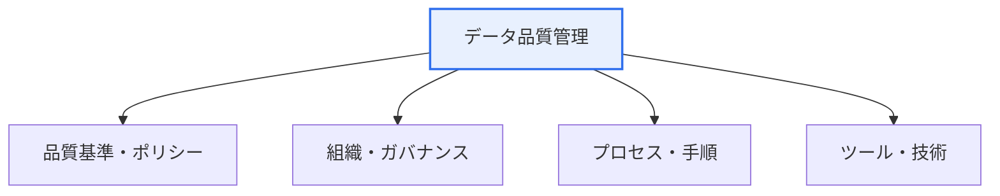

# データ品質管理(Data Quality Management)

## 1. 概要

### A. 定義
> データの**正確性・完全性・一貫性・適時性などの品質を継続的に確保・管理**する体系的な活動である。データを信頼できる意思決定・AI資産とするための基盤となる。

データ品質管理が決定的に重要である理由は、「**品質の悪いデータは誤った意思決定に直結する**」からである。誤った顧客住所によって配送が失敗し、重複した売上データによって実績が歪められ、偏ったデータで学習したAIは誤った予測を出す。特にデータ・AIに基づく経営が広がるにつれ、データ品質は分析とモデルの信頼性を左右する中核要素となった。重要なのは、データ品質が偶然に良くなることはないという点である。品質は、アーキテクチャ・プロセス・組織・技術が結合した管理体系を通じてのみ継続的に確保される。一度クレンジングすれば終わりではなく、絶えず流入するデータを継続的に管理しなければならない。

### B. 必要性
データが複数のシステムに分散し、異なる基準で蓄積されると、不一致・重複・誤りが累積する。これを放置するとデータ活用への信頼が崩れるため、標準・品質・ガバナンスを備えた管理体系が必要である。

## 2. データ品質管理アーキテクチャ

品質管理アーキテクチャは、4つの階層が有機的にかみ合って構成される。最上位には何を品質とみなすかを定める**ポリシー・基準**(品質指標・標準)があり、それに責任を持って実行する**組織・ガバナンス**(データオーナー・スチュワード)がある。その下で実際に品質を確保する**プロセス**(プロファイリング・クレンジング・検証・モニタリング)が回り、これを支援する**ツール・技術**(品質診断ツール・MDM・メタデータ管理)が裏付ける。特に「誰がデータ品質に責任を持つのか」という組織・ガバナンスが欠けると、いかに優れたツールも役に立たなくなる。

| 階層 | 構成 |
|---|---|
| **ポリシー・基準** | 品質基準・指標・標準の定義 |
| **組織・ガバナンス** | データオーナー・スチュワード、責任体系 |
| **プロセス** | プロファイリング・クレンジング・検証・モニタリング |
| **ツール・技術** | 品質診断・MDM・メタデータ管理 |

## 3. データ品質管理成熟度

品質管理の水準は組織ごとに異なり、成熟度モデルによって現在の位置を診断し、改善の方向性を定める。初期段階では品質管理が個人の能力に依存し、定型化段階では部分的な手順が生まれ、標準化段階では全社標準・プロセスが定着し、最適化段階では定量的な測定と継続的改善・自動化が実現される。

| 段階 | 特徴 |
|---|---|
| **1 初期** | 品質管理が不十分、個人依存 |
| **2 定型化** | 部分的な手順・基準が存在 |
| **3 標準化** | 全社標準・プロセスが定着 |
| **4 最適化** | 定量測定・継続的改善、自動化 |

## 4. 構造化/非構造化データの品質基準

品質基準はデータの種類によって異なる。テーブル・コード値のような**構造化データ**は規則が明確であるため、正確性・完全性・一貫性・有効性・一意性といった定量的基準で検証する。文書・画像・ログのような**非構造化データ**は定型的な規則の適用が難しいため、信頼性・適合性・理解可能性・活用性など相対的に定性的な基準と、メタデータ・ラベリングの品質によって管理する。

| 区分 | 構造化データ | 非構造化データ |
|---|---|---|
| **基準** | 正確性・完全性・一貫性・有効性・一意性 | 信頼性・適合性・理解可能性・活用性 |
| **対象** | テーブル・コード値 | 文書・画像・ログ |
| **方法** | 規則ベースのプロファイリング | メタデータ・ラベリング品質 |

## 5. データ品質管理戦略

効果的な品質管理戦略には4つの方向性がある。第一に、データの**標準化**によって品質の基盤を整える(標準なくして品質なし)。第二に、事後のクレンジングよりも発生源(入力)段階で品質を統制する**予防中心**のアプローチがはるかに効率的である。第三に、品質を定量的な**指標(KPI)で測定・モニタリング**して成熟度を高める。第四に、データオーナー・スチュワードシップによって**責任体系**を確立し、持続性を確保する。

## 6. 考慮事項および示唆点

1. **データ品質はAI・分析の信頼性の前提**である。データ中心AI(Data-centric AI)の観点では、品質管理がモデル性能より優先される場合が多い。
2. **リアルタイム・大量データでは自動品質モニタリング**をパイプラインに組み込む。データが入るたびに自動で品質を検証し、異常を検知しなければならない。
3. **規制対応と連携**する。韓国のデータ3法・マイデータなどは正確で信頼できる個人情報・データ管理を求めるため、品質管理はコンプライアンスに直結する。

---

> **一言まとめ**: データ品質管理は*ポリシー・組織・プロセス・ツールのアーキテクチャ*によって成熟度を高め、構造化・非構造化別の品質基準を適用し、標準化・予防・測定・責任の戦略によってデータを信頼できるAI・意思決定資産とする。
