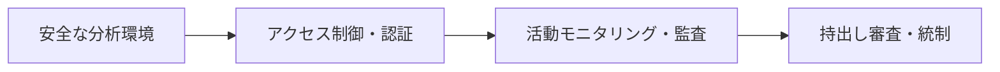

# データ安心区域(Data Safe Zone)

## 1. 概要

### A. 定義
> 韓国の**データ産業振興法(第11条)**などに基づき、非公開・機微データを**原本を流出させることなく安全に分析・活用**できるよう、政府が提供・指定する**統制された物理・論理的な分析環境**である。

### B. 登場背景および必要性
データ活用には根本的なジレンマがある。データを公開して引き渡せば活用は促進されるが、個人情報・企業秘密が流出・再識別されるリスクが高まり、逆に保護のために公開を止めればデータは死蔵される。特に個人の詳細な履歴を含む機微データは、仮名処理だけでは再識別リスクを完全に取り除けないため、そもそも持ち出しが難しい。データ安心区域はこのジレンマを、**「データを外に出さず、人がデータのある場所に入って分析する」**という発想の転換によって解消する。すなわち原本は統制された区域内に置き、分析者のみをアクセスさせ、成果物のみを審査後に持ち出すことで、活用と保護を同時に実現する。これはデータ経済の活性化とプライバシー保護を両立させる中核インフラである。

## 2. 主要機能

安心区域の機能は、データが外部に漏れるあらゆる経路を遮断するよう設計される。**安全な分析環境**は持込み・持出しが統制された閉鎖空間(物理的な分析室または遠隔の仮想デスクトップ)であり、インターネット・USB・印刷などの流出チャネルを根本的に遮断する。**アクセス制御・認証**は利用者の登録・審査・承認手続きと本人確認により、認可された者だけが入れるようにする。**活動モニタリング**は、分析者がどのデータを照会・操作したかをログとして残し、事後監査と誤用・濫用の抑止を可能にする。最も中核となる**持出し審査**は、分析の成果物(統計・モデルなど)のみを対象として再識別リスクを検討し、通過した結果だけを持ち出させるものであり、原本データはいかなる場合も持ち出さない。これに加え、異なる機関の仮名・匿名データを区域内で結合して分析する**結合分析支援**機能が備わる。

| 機能 | 内容 | 目的 |
|---|---|---|
| **安全な分析環境** | 持込み・持出しを統制した閉鎖空間(物理/遠隔) | 流出チャネルの根本遮断 |
| **アクセス制御・認証** | 利用者登録・承認、本人確認 | 認可者のみアクセス |
| **活動モニタリング** | 分析活動のログ・監査 | 誤用・濫用の抑止、追跡 |
| **持出し審査** | 成果物のみ再識別検討後に持出し | 原本流出の遮断 |
| **データ結合支援** | 仮名・匿名データの結合分析 | 複数機関の融合分析 |

## 3. 指定要件

政府が特定の施設を安心区域として指定するには、上記の機能を実質的に保証する物理・管理・組織的要件をすべて満たさなければならない。**セキュリティ設備**としては外部ネットワークから分離したネットワーク分離と持込み・持出しの統制装置が必要であり、**アクセス制御**としては本人確認・権限管理・接続ログが常時作動していなければならない。特に技術的統制だけでは不十分であり、**管理体系**の面で運営人員・標準手順とともに持出し結果を検討する**審議委員会**を必ず置かなければならない。再識別リスクの判断は自動化が難しい専門的判断の領域だからである。最後に、独立した空間・CCTV・入退室管理といった**施設・環境**要件が物理的な封鎖を完成させる。

| 要件 | 説明 |
|---|---|
| **セキュリティ設備** | 物理・ネットワーク分離、持込み・持出し統制装置 |
| **アクセス制御** | 本人確認・権限管理・接続ログ |
| **管理体系** | 運営人員・手順、持出し**審議委員会** |
| **施設・環境** | 独立空間、CCTV・入退室管理 |

## 4. 関連制度・連携

データ安心区域は単独で機能するのではなく、隣接する制度と相互に補完し合う。異なる機関のデータを結合する際は、**仮名情報結合制度(結合専門機関)**を経た結合データを区域内で分析するという形で連携し、個人が自らのデータを主体的に活用する**マイデータ**とは、活用主体・範囲の面で相互に補完する。また**PET(プライバシー強化技術)**である差分プライバシー・準同型暗号を区域内部に適用すれば、物理的統制(区域)と技術的統制(PET)が二重に重なり、安全性が一層高まる。

| 区分 | 連携内容 |
|---|---|
| **仮名情報結合** | 結合専門機関による結合データの安全な分析先 |
| **マイデータ** | 個人主導の活用と相互補完 |
| **PET** | 差分プライバシー・準同型暗号による二重統制 |

## 5. 考慮事項および示唆点
- **持出し審査基準の明確化**: 安心区域の信頼は持出し審査の一貫性にかかっている。再識別リスクを判断する定量的基準(例: k-匿名性の水準、セルの最小度数)を明文化し、審査者ごとに結果が異なる問題を減らさなければならない。
- **アクセス性と統制のバランス**: 物理的な訪問方式は安全であるが利用が不便であるため、遠隔安心区域を拡大しつつ、画面透かし・行為ロギングなどによって遠隔環境の統制水準を維持しなければならない。
- **データ公開と保護を両立するインフラ**: 安心区域は「公開せずに活用する」という新たなパラダイムの代表例であり、今後はクラウドベースでの拡張や国際的なデータ移転(データスペース)の信頼基盤へと発展すると見込まれる。

---

> **一言まとめ**: データ安心区域は*機微データを原本流出なしに分析・活用できるよう統制*する指定環境であり、閉鎖分析環境・アクセス制御・モニタリング・持出し審査の機能と、セキュリティ設備・審議委員会などの指定要件を備えることで、データ公開とプライバシー保護を両立させる。
