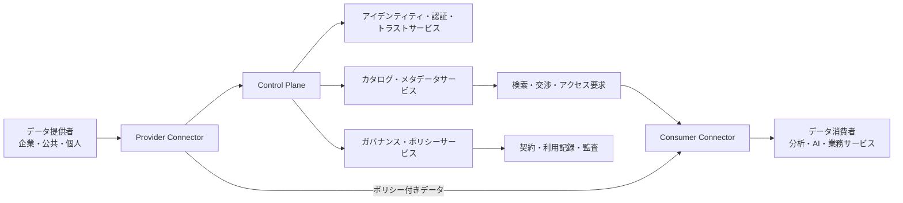
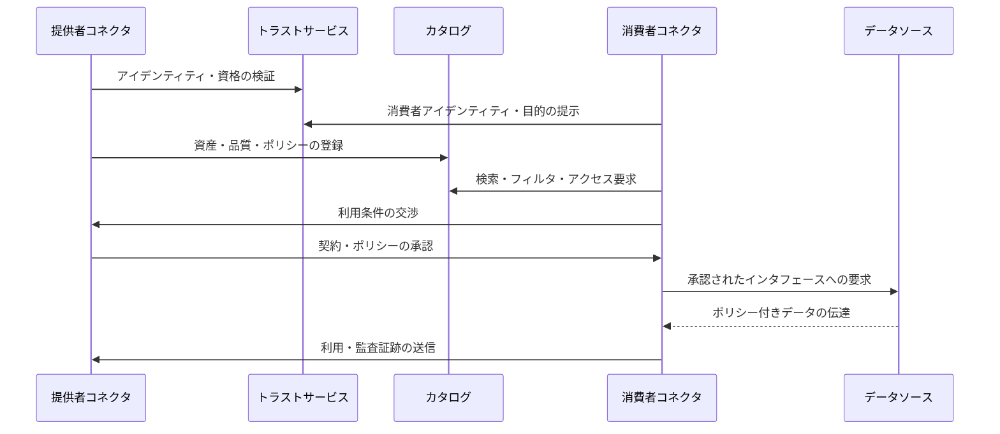

# データスペース(Data Space)とデータ主権に基づく信頼あるデータ共有

## 1. 概要

### 1.1 定義

> **データスペース(Data Space)**とは、特定の産業・公共分野の参加者が、共通ルール、信頼できるアイデンティティ、相互運用可能な意味体系、技術的統制を基盤としてデータを共有・再利用する連合型エコシステムである。

データスペースは、データを一か所に集めて中央プラットフォームが独占する方式とは異なる。データ提供者は元データを保有し続けながら、誰がどの目的でどの期間使用できるかを定め、消費者はその条件に同意したうえで必要なデータにアクセスする。したがって核心は単なるデータ転送ではなく、信頼、ルール、意味、利用ポリシーを併せて交換することにある。

データ取引所が商品の登録・検索・価格・精算を中心とするのに対し、データスペースは異なる組織が継続的に協業できる参加ルールと技術的な信頼基盤をより広く扱う。データレイクやデータウェアハウスが組織内部の保存・分析の最適化に焦点を当てるのに対し、データスペースは組織の境界を越えてデータが移動し利用される状況における権利と責任を設計する。

### 1.2 登場背景と必要性

第一に、企業と公共機関のデータが部署・企業・国ごとに分断され、データの社会的価値が十分に実現されていない。製造業者は設備データを持ち、物流業者は輸送データを持っているが、互いの品質・セキュリティ・責任の基準を信頼できなければサプライチェーンの最適化は難しくなる。

第二に、中央集権型プラットフォームは迅速な統合には有利であるが、データ主権、ベンダーロックイン、単一障害点、目的外利用というリスクを伴う。データスペースは、データを必ずしも中央リポジトリに複製しなくても、分散した主体間での標準化された交換を可能にすることで、このリスクを低減する。

第三に、AIと分析サービスの品質は、モデルそのものだけでなく、学習・推論に使用されるデータの正確性、最新性、出所、利用権に左右される。データスペースはデータ資産のメタデータと利用条件を併せて伝達し、再利用可能なデータサプライチェーンを構築する。

第四に、個人情報、営業秘密、産業機密、国ごとの規制を遵守しながらデータを活用しなければならない。したがって、アクセスの許可可否だけを判断する認証を超えて、許可されたデータがどの目的でどのように再利用されるかまで管理する利用統制(usage control)が求められる。

### 1.3 目標と特徴

データスペースの目標は、参加者の自律性を維持しながら、エコシステム水準でのデータ活用を可能にすることである。ここでいう自律性とは、データを無条件に公開しないという意味ではなく、データ提供者が共有範囲と利用条件を交渉し、それを契約・ポリシー・技術によって執行できるという意味である。

主な特徴は次のとおりである。

| 特徴 | 意味 | 技術士の観点での設計上の問い |
|---|---|---|
| 連合性 | データと運営主体が複数の組織に分散している | 中央集権なしにどのように信頼を醸成するか |
| データ主権 | 提供者がアクセス・利用・再共有の条件を統制する | ポリシーが契約層と実行層で一致しているか |
| 信頼性 | 参加者・コネクタ・データ出所を検証する | どのアイデンティティと認証レベルを適用するか |
| 意味的相互運用性 | 同じデータが同じ意味で解釈される | 共通語彙・識別子・オントロジーをどう運用するか |
| ポリシー執行性 | 利用条件を技術的に確認・記録する | 違反を予防・検知・監査できるか |
| ドメイン開放性 | 製造・保健医療・金融・モビリティなどに適用可能 | 共通基盤と分野別ルールをどう分離するか |

## 2. データスペース参照構造

### 2.1 全体概念図

データスペースでは、データプレーンとコントロールプレーンを区別することが重要である。データプレーンは実際のデータまたはデータへのアクセスを伝達し、コントロールプレーンは誰が参加できるか、どのような資産があるか、どのポリシーで取引するかを管理する。この分離によって、大容量の元データは提供者のストレージに残したまま、標準化された交渉手続きを適用できる。

### 2.2 参加者と役割

**データ提供者**は、データの生成または管理の責任を持つ主体である。提供者はデータ資産の品質、出所、更新周期、個人情報の含有有無、利用目的と対価条件を定義する。提供者はデータを提供したからといって所有権とすべての統制権を放棄するわけではないため、契約とポリシーの境界を明確にしなければならない。

**データ消費者**は、データを用いて分析、AI学習、サービス運営または意思決定を行う主体である。消費者はカタログでデータ資産を探索し、自らのアイデンティティ・目的・セキュリティ水準を提示したうえで利用条件を交渉する。消費者は許可された目的を超えて再販売したり第三者に再共有したりしないよう、内部統制を整備しなければならない。

**コネクタ(Connector)**は、提供者と消費者がデータスペースのプロトコルに従って通信できるようにする境界コンポーネントである。コネクタは元システムと外部ネットワークの間で、認証、ポリシー交渉、データ伝達、暗号化と監査イベントを処理する。組織ごとに異なるストレージやAPIをコネクタの背後に隠すことで、参加者は共通の交換方式を使用できる。

**アイデンティティ・トラストサービス**は、参加組織、ユーザー、サービスおよびコネクタが信頼できる主体であるかを確認する。証明書ベースの相互認証、トークン発行、トラストリスト、資格情報(クレデンシャル)の検証を組み合わせることができる。トラストサービスは単なるログインサーバーではなく、参加資格と認証レベルをエコシステムのルールとして管理する基盤である。

**カタログ・メタデータサービス**は、データそのものではなく、データ資産の説明、エンドポイント、品質、価格、ライセンス、更新周期、アクセス条件を検索できるようにする。カタログに機微な原文を入れずとも、消費者が適切な資産を見つけられるようにしなければならない。メタデータが不十分であれば、技術的に接続されていても実際の活用は不可能である。

**ガバナンス運営者**は、参加資格、紛争手続き、共通語彙、ポリシーテンプレート、セキュリティ基準、監査と制裁を運営する。中央運営者がすべてのデータを統制するのではなく、参加者が合意したルールを公正に執行する役割に近い。産業別データスペースでは、運営者、標準化機関、データ提供者、消費者の責任を契約によって具体化しなければならない。

### 2.3 データ資産とメタデータ

データ資産はファイル1つを意味するわけではない。リアルタイムAPI、ストリーム、テーブル、文書、モデル入力、集計結果のように、消費者が利用できる論理的な提供単位をデータ資産として定義できる。資産は識別子とバージョンを持たなければならず、同名のデータであっても意味・品質・権利が異なれば別の資産として区別しなければならない。

必須メタデータには、データ資産の説明、所有・管理主体、出所、生成時刻、最新更新時刻、スキーマ、単位、品質指標、保存期間、個人情報分類、ライセンス、価格または対価、許可目的、再共有条件が含まれる。これらの情報により、消費者はデータを受け取る前に適合性とリスクを判断できる。

データ品質は正確性だけで評価するものではない。完全性、有効性、適時性、一貫性、一意性、追跡可能性などをドメインごとに定義しなければならない。例えば製造設備の温度ストリームでは欠損率と遅延時間が核心であり、金融取引データでは整合性・重複・規制上の保存性が核心となりうる。

### 2.4 参照技術構成

| 階層 | 主要構成 | 中核責任 |
|---|---|---|
| 参加層 | 提供者、消費者、仲介者、運営者 | 役割・権利・責任と加入条件 |
| トラスト層 | デジタルアイデンティティ、証明書、トークン、トラストアンカー | 相互認証と資格検証 |
| 発見層 | カタログ、ブローカー、検索API | 資産の発見と条件確認 |
| 交渉層 | 契約テンプレート、ポリシー表現、同意 | 利用条件の合意 |
| 交換層 | コネクタ、API、ストリーム、ファイル転送 | 安全なデータ伝達 |
| 意味層 | 共通語彙、オントロジー、識別子 | データの意味の一致 |
| 統制・監査層 | 利用ログ、ポリシー決定・執行、モニタリング | 事後の証跡と違反対応 |

特定の製品1つをすべてのデータスペースに強制するよりも、各階層のインタフェースと適合性条件をまず定義すべきである。そうすることで、特定のクラウドや特定のコネクタ実装を置き換えても、エコシステムのデータ契約と信頼を維持できる。

## 3. データ共有のライフサイクルと利用統制

### 3.1 共有プロセス概念図

### 3.2 登録と発見

提供者はまず、内部データカタログと外部のデータスペースカタログを連携させる。この際、機微な原文の代わりに資産の説明とアクセスエンドポイントを登録し、データが実際にどのストレージにあるかはコネクタが保護する。資産のバージョンと変更履歴を管理しなければ、消費者の分析結果を再現することは難しい。

消費者はキーワードだけで検索するのではなく、ドメイン語彙、品質、地域、時間範囲、法的な利用条件を併せてフィルタリングしなければならない。検索結果が多くても、自らの目的と権限に合わないデータであれば実際の契約対象ではない。したがって発見サービスには、技術メタデータと業務・法務メタデータがともに存在しなければならない。

### 3.3 信頼形成と契約交渉

参加者は組織の登録情報、証明書、役割、セキュリティ水準とポリシー準拠の証明を提示する。相互認証は通信相手を確認するが、データ利用目的が適法であるという事実までは保証しないため、目的・法的根拠・保存期間と処理場所を別の属性として検証しなければならない。

契約交渉は、データ資産、利用目的、利用期間、許可される演算、再共有の可否、対価、責任、削除と返却の手続きを合意する過程である。例えば製造業者が故障予測モデルの学習を許可したとしても、元の設備識別子を外部に持ち出すことや競合他社に再販売することは禁止できる。

### 3.4 ポリシー決定とポリシー執行

ポリシー決定は、要求した主体、データ、目的、環境属性を評価して、許可・拒否・追加承認のいずれかを判断する過程である。ポリシー執行は、決定された結果を実際のAPIゲートウェイ、コネクタ、ストレージ、分析実行環境で強制する過程である。決定と執行を1つのコンポーネントに集約すると、ポリシーの変更と監査が難しくなるため、役割を分離するのが望ましい。

利用統制はアクセス制御よりも範囲が広い。アクセス制御は「今このデータを読めるか」を判断するが、利用統制は「許可された目的でのみ処理したか、指定期間が過ぎたら削除したか、結果を再共有しなかったか」まで管理する。技術的統制が完全でない場合には、契約、電子透かし、出力検証、監査と制裁を併用しなければならない。

### 3.5 伝達・処理・監査

データ伝達は通信経路の暗号化と相互認証を基本とし、必要に応じて提供者の環境で分析結果のみを持ち出す方式により、元データの露出を減らす。データが消費者の環境へ移動しなければならない場合は、必要最小限のフィールド、仮名化、トークン化とアクセス時間の制限を適用する。

コネクタは、要求者、データ資産、ポリシーのバージョン、契約識別子、処理時刻、結果の状態を監査ログとして残さなければならない。ログには原文の個人情報を複製せず、ハッシュ・識別子・要約値を使用し、改ざん防止ストレージと保存ポリシーを適用する。監査ログは紛争解決だけでなく、データ品質と費用精算の根拠にもなる。

## 4. ガバナンスと相互運用性

### 4.1 多層ガバナンス

データスペースのガバナンスは技術運用だけの問題ではない。参加資格、データの権利、契約標準、料金と対価、事故責任、紛争解決、脱退とデータ返却について合意してはじめて、エコシステムは持続する。技術士の答案では、アーキテクチャとともに運営委員会・ドメイン委員会・監査機能の責任を示さなければならない。

| ガバナンス層 | 決定項目 | 成果物 |
|---|---|---|
| エコシステム | 加入・脱退・制裁・紛争・収益配分 | Rulebook、参加契約 |
| ドメイン | 用語・データモデル・品質基準 | 共通語彙、データ契約 |
| 法務・倫理 | 目的・根拠・個人情報・国外移転 | 利用条件、影響評価 |
| 技術 | API・プロトコル・認証・ログ | 参照アーキテクチャ、適合性試験 |
| 運用 | 障害・変更・セキュリティ事故・サポート | SLA、ランブック、事故報告書 |

すべてのルールを中央運営者が一方的に変更すれば、参加者の信頼は低下する。逆にすべての組織がそれぞれルールを作れば、相互運用性は崩れる。したがって、変更提案、影響評価、投票または合意、猶予期間、後方互換性の検証を含む標準変更手続きを運用しなければならない。

### 4.2 意味的相互運用性

APIが接続されていても、「顧客」「設備」「事故」「炭素排出量」の定義が異なれば、結果は結合されない。意味的相互運用性とは、共通識別子、コード体系、単位、タイムゾーン、データ型、関係と制約を合意し、それを機械可読な形で表現する活動である。

ドメイン共通モデルを作る際、すべての企業の内部モデルを1つに統合しようとすると合意コストが過大になる。中核となる交換概念とマッピング規則を標準化し、組織内部の拡張属性は拡張領域として許容する方式が現実的である。データ契約には、スキーマ変更の規則と後方互換性の条件も含めなければならない。

### 4.3 技術的相互運用性と適合性

相互運用性はフォーマットが同じであるだけでは達成されない。アイデンティティ確認、カタログ照会、契約交渉、データ伝達、エラー処理、ログ交換のプロトコルが互いに互換でなければならない。バージョンの異なる実装間では、機能レベル、必須フィールド、エラーコード、セキュリティ要件を適合性試験によって検証する。

初期段階では、サンドボックスと参照コネクタを提供して参加者の参入障壁を下げることができる。しかし参照実装をそのまま運用標準と誤解すると特定製品へのロックインが生じるため、規範的要件と例示実装を文書上で区別しなければならない。

## 5. データスペースと類似概念の比較

データスペース、データ取引所、データメッシュ、データファブリック、データレイクハウスは、いずれもデータ活用を改善するが、解決する境界が異なる。データスペースは特に、複数の組織間の信頼・ルール・主権を中心に据えるという点で異なる。

| 区分 | 主な境界 | 中核目的 | データ統制主体 |
|---|---|---|---|
| データスペース | 組織・産業エコシステム | 信頼に基づく共有と利用統制 | 提供者と合意されたガバナンス |
| データ取引所 | 市場・取引関係 | 発見・価格・取引・精算 | プラットフォームと取引当事者 |
| データメッシュ | 企業内部のドメイン | ドメインデータプロダクトの自律運営 | ドメインチーム |
| データファブリック | 企業内部・ハイブリッド | メタデータに基づく統合・アクセス | 中央データアーキテクチャとドメイン |
| レイクハウス | 保存・分析プラットフォーム | 元データ・構造化データの統合分析 | プラットフォーム運営組織 |

データメッシュを採用した組織が外部のサプライチェーンとデータを交換するには、データスペースの信頼・契約・ポリシー層が追加で必要になりうる。逆に、データスペースを構築しても、各参加者の内部データ品質とプロダクト運営が不十分であれば、共有エコシステムは機能しない。両概念は代替関係というよりも、内部のデータプロダクトと外部とのデータ協業をつなぐ関係と捉えるのが適切である。

## 6. 適用事例

### 6.1 製造・モビリティのサプライチェーン

自動車メーカーは、部品サプライヤーの品質・納期・炭素データを活用して、サプライチェーンのリスクと生産計画を改善できる。部品メーカーは元の生産量や工程の詳細をすべて公開せず、契約したKPIと集計結果のみを提供することができる。

この場合、共通の部品識別子、納期イベント、品質等級、炭素算定単位をまず定義しなければならない。コネクタはサプライヤーのERP・MESと接続され、消費者は許可された期間の集計データを照会する。ポリシーには、競合他社への再共有の禁止と契約終了後の削除が含まれうる。

### 6.2 保健医療・研究データ

病院と研究機関は、研究目的のデータを共有しながら、患者の直接識別情報を保護しなければならない。データスペースは元データの所在とアクセス権限を分離し、研究者の資格・研究計画・承認範囲を検証したうえで、仮名化データや安全な分析空間を提供できる。

保健医療分野では、データの正確性と同じくらい、同意範囲、再識別リスク、保存期間、研究成果の公開条件が重要である。したがって技術的なコネクタとともに、IRB承認、目的制限、成果物の審査と撤回手続きをガバナンスに含めなければならない。

### 6.3 エネルギー・スマートシティ

電力事業者、建物運営者、充電事業者と地方自治体がエネルギー需要・充電・気象データを共有すれば、デマンドレスポンスや炭素削減サービスを生み出せる。データ提供者はリアルタイムの生の計量値の代わりに時間帯別の集計値を提供することで、個人の生活パターンの露出を減らすことができる。

都市間の相互運用のためには、位置グリッド、タイムゾーン、計量単位、機器識別子と品質指標を共通化しなければならない。緊急時には平常時とは異なる優先順位とアクセス範囲を適用しうるため、緊急時ポリシーと事後監査もあらかじめ設計しておかなければならない。

## 7. 深掘り: 標準化とポリシーの動向

International Data Spaces AssociationのIDS Reference Architecture Modelは、信頼でき、かつデータ提供者が利用を統制するデータ共有のための参照モデルを提示している。IDS-RAMは役割モデル、情報モデル、ポリシーに基づく共有と認証を中心とし、特定の製品1つに依存しない設計空間を志向する。

IDS系の実装では、コネクタ、トラストサービス、メタデータブローカーとポリシーに基づく契約が重要な概念として用いられる。Dataspace Protocolは、データ資産のカタログ照会、交渉と契約、伝達をデータスペース間で相互運用させるためのプロトコル層として理解できる。

欧州委員会は、保健医療、製造、モビリティ、エネルギー、金融、公共行政など分野別の共通欧州データスペースを推進している。共通インフラ、ガバナンス、セキュリティ・個人情報保護、意味体系、相互運用性仕様とデータモデルを併せて支援する点が重要である。

EU Data Actは、コネクテッド製品が生成したデータへの利用者のアクセスと公正な共有を重視し、クラウドサービスの乗り換えとデータ相互運用性の基盤を扱う。韓国企業が欧州のパートナーとデータを交換する際には、単なるAPI連携だけでなく、契約、国外移転、セキュリティとサプライチェーン上の責任を併せて検討しなければならない。

実務的には、「データをすべて集めてから活用する」という順序を、「目的と権利を定義し、最小限のデータで安全に接続する」という順序へ転換する必要がある。そのためには、パイロットドメインで資産カタログ、最小共通モデル、コネクタ、ポリシーテンプレート、監査指標を検証したうえで参加者を拡大する段階的アプローチが効果的である。

## 8. 考慮事項および示唆点

### 8.1 データ主権と事業価値のバランス

共有を制限すればデータの価値は低下し、過度に公開すれば営業秘密と個人情報のリスクが高まる。データ資産ごとに公開・制限・非公開の等級を定義し、目的・期間・地域・成果物ごとのポリシーを細分化しなければならない。技術士は、データ活用率とリスク露出を併せてKPIとして提示すべきである。

### 8.2 トラストモデルと責任の境界

証明書が有効であるからといって、データ品質や法的適合性が保証されるわけではない。アイデンティティ・資格・品質・契約・行為ログをそれぞれ検証し、事故発生時の提供者・コネクタ運営者・消費者の責任を契約で明示しなければならない。

### 8.3 意味標準の進化

初期に作成した共通データモデルは、産業の変化や新規参加者の要求によって拡張される。バージョン管理、拡張フィールド、廃止予告、マッピングと変換規則を運用しなければ、データスペースは特定時点の固定された辞書にとどまってしまう。標準変更の後方互換性と参加者のコストを併せて評価しなければならない。

### 8.4 ポリシー執行の限界

コネクタが転送条件を確認しても、消費者がデータを複製したり画面を撮影したりする行為までを完全に統制することはできない。したがって技術的な利用統制を万能と主張するのではなく、データ最小化・安全な分析環境・出力審査・電子透かし・監査・契約上の制裁を多層防御として組み合わせなければならない。

### 8.5 個人情報と機密情報の保護

仮名化は再識別リスクを自動的に除去するものではない。データ結合の可能性、希少な属性、アクセス主体、保存期間、成果物の再識別可否を評価しなければならない。機微度が高い場合は、元データの持ち出しの代わりに、提供者環境での連合分析、差分プライバシー、またはコンフィデンシャルコンピューティングを検討できる。

### 8.6 性能・可用性・コスト

相互認証とポリシー評価は、データ処理の遅延を増大させうる。リアルタイム制御データとバッチ分析データを同じ水準で設計せず、遅延時間・スループット・リトライ・キャッシュ・障害時の代替経路をデータ契約に反映しなければならない。コネクタの運用費とデータ利用料を含めたTCOも算定しなければならない。

### 8.7 セキュリティとサプライチェーン

コネクタは外部に露出する信頼境界であるため、脆弱性、クレデンシャル窃取、ポリシー回避、ログ改ざんとサービス拒否を防御しなければならない。イメージ・ライブラリ・プロトコル実装のSBOM、パッチ、署名、脆弱性対応SLAを参加条件とすれば、マルチサプライヤー環境のサプライチェーンリスクを低減できる。

### 8.8 段階的な展開と成果測定

最初から国全体や産業全体を接続するよりも、価値が明確でデータの権利に関する合意が可能な業務を選定する。パイロットの成果は接続機関数だけで評価せず、データ探索時間、契約交渉時間、再利用率、品質エラー率、ポリシー違反件数、分析サービスの業務成果を併せて測定しなければならない。

### 8.9 技術士答案の構成戦略

答案は、定義と必要性で中央集権型共有の限界を示し、参照構造で参加者・コネクタ・トラスト・カタログ・ポリシー・意味の各層を図式化する流れがよい。その後、登録→発見→認証→交渉→伝達→監査のライフサイクルを説明し、データ取引所・データメッシュ・データファブリックとの違いを比較する。

結論では、データ主権を宣言で終わらせず、契約・ポリシー・コネクタ・ログによって執行する戦略を強調すべきである。また、相互運用性という技術的問題と、データの権利・責任というガバナンスの問題を併せて解決してはじめて、持続可能なデータ経済になるという点を示唆点として提示する。

## 参考資料

- International Data Spaces Association, “IDS Reference Architecture Model” — https://internationaldataspaces.org/offers/reference-architecture/
- International Data Spaces Association, “Where the future of data happens” — https://internationaldataspaces.org/why/data-spaces/
- European Commission, “Common European data spaces” — https://digital-strategy.ec.europa.eu/en/policies/data-spaces
- European Commission, “Data Act” — https://digital-strategy.ec.europa.eu/en/policies/data-act
- Data Spaces Support Centre — https://dssc.eu/

---

> **一言まとめ**: データスペースはデータを中央に集めるプラットフォームではなく、参加者がデータ主権を維持しながら、アイデンティティ・カタログ・意味・契約・ポリシー執行を組み合わせて信頼できる形で共有する、連合型のデータガバナンスアーキテクチャである。
