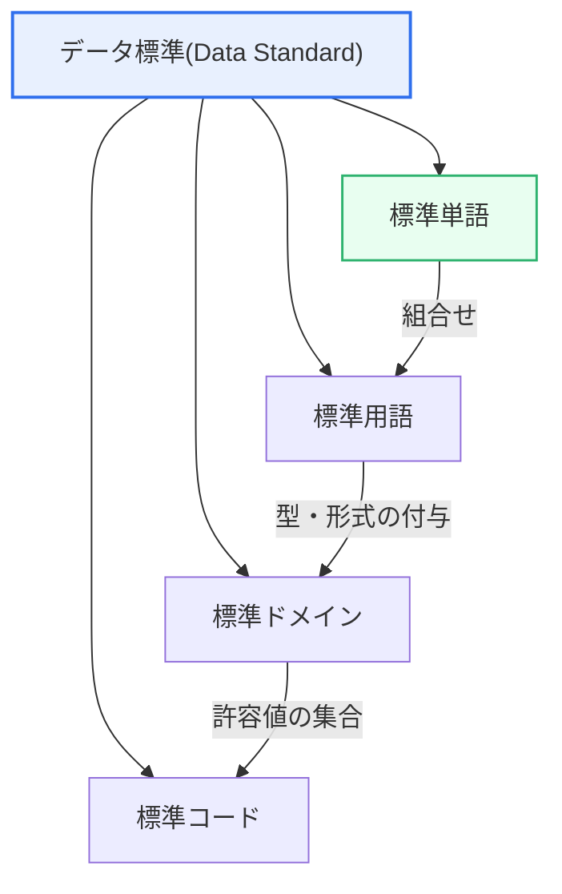

# データ標準化の必要性と期待効果

## 1. 概要

### A. 定義
> 組織内で使用するデータの**名称・定義・形式・表現規則を一貫した基準で統一**する活動である。標準単語・用語・ドメイン・コードを確立することで、データの一貫性・相互運用性・品質を確保する、データガバナンスの基盤となる活動である。

データ標準化が必要な根本的理由は、「**同じものを互いに異なる名前で呼ぶ混乱**」を取り除くことにある。同じ会社の中でも、営業システムは「顧客番号」、会計システムは「CUST_NO」、新規アプリは「client_id」と、同じ概念をばらばらに表現していれば、これらのデータを統合・比較するたびに「これとあれは同じもの」というマッピング作業が必要となり、その過程で誤りが紛れ込む。日付を「YYYY-MM-DD」と「MM/DD/YY」で混在させたり、性別を「M/F」と「1/2」で混用したりすれば、集計そのものが狂ってしまう。標準化はこうした不一致をデータが生成される時点で最初から遮断し、データを信頼できる組織の資産とする。

### B. 登場背景と必要性
標準化が注目されるようになった背景には、情報システムがたどってきた歴史がある。システムはおおむね部署ごと・時期ごとに別々に構築され、各システムは自らの都合で名称とコード体系を定めた。その結果、組織全体で見るとデータが島のように散在する**データサイロ(Data Silo)**と名称の不一致が長期間にわたって蓄積された。普段は各システムがそれぞれうまく動いているため問題は表面化しないが、全社統合・データウェアハウス構築・経営ダッシュボード・AI学習のように「データを一か所に集めて使おうとする」瞬間に、はじめて混乱が噴出する。

これに加え、ビッグデータ・人工知能の活用が組織の競争力を左右するようになるにつれ、「**測定できなければ管理できず、一貫していなければ活用できない**」という認識が広がった。韓国のデータ3法改正やマイデータ、公共データ開放政策のように、組織間・機関間でデータをやり取りする要求が高まったことも、標準化を必須課題へと押し上げた。標準化されていないデータは内部でさえ使いにくいのに、外部と交換するとなればなおさら不可能だからである。こうしてデータ標準化は、データ品質管理とガバナンスの「出発点」として位置づけられるようになった。

### C. 特徴
データ標準化には、① 単語からコードまで複数の層を扱う**階層性**、② 一度定めれば全社が従わなければならない**強制性・拘束性**、③ 新規・変更データに継続的に適用されなければならない**持続性**、④ 技術ではなく合意とプロセスが左右する**ガバナンス依存性**、という特徴がある。特に標準は「作ること」よりも「守らせること」が難しいという点で、ツール導入ではなく組織の規律の問題という性格が強い。

## 2. データ標準化の対象と体系

標準化はデータの名前と値を複数の層で統一し、各層は下から上へと組み上げられる関係を持つ。

**標準単語(Standard Word)**は、項目名を構成する最小の意味単位である。例えば「顧客番号」という項目名は「顧客」と「番号」という単語に分解されるが、組織は「取引先/顧客/クライアント」のように混在して使われている表現の中から1つを代表単語として確定し、残りは禁止語(使用禁止語)として管理する。単語を統一しなければ上位の用語も標準化できないため、単語は標準体系のレンガに相当する。実務では「英略語」まで併せて定め(顧客→CUST、番号→NO)、物理カラム名がシステムごとに分かれないようにする。

**標準用語(Standard Term)**は、標準単語を規則に従って組み合わせた「項目名(business term)」である。「顧客」+「番号」=「顧客番号」のように組合せの順序と方式を定めておけば、誰が作っても同じ概念に同じ名前が付く。用語標準の実務的価値は、開発者と業務部門が同じ名前でコミュニケーションすることで、要件の誤解を減らす点にある。「注文金額」と「決済金額」が実際には異なる概念であれば用語で明確に区別し、同じ概念であれば1つに統合する。

**標準ドメイン(Standard Domain)**は、各項目が取りうるデータ型・長さ・形式を定義する。例えば「金額」ドメインは「NUMBER(15)」、「住民登録番号」ドメインは「文字13桁」、「日付」ドメインは「YYYY-MM-DD」と確定する。ドメイン標準の中核的な効果は、物理設計の一貫性である。同じ性質の項目があるテーブルでは20文字、別のテーブルでは10文字と定義されていると、連携時に値が切り捨てられる事故が起きるが、ドメインを標準化すればこうした物理的な不一致はなくなる。

**標準コード(Standard Code)**は、コード系データの値体系を統一する。性別を「M/F」とするか「1/2」とするか、処理状態をどのコード値の集合で表現するかを全社基準で定める。コードは統計・集計の軸となることが多く、コードが統一されていなければ部署別の集計結果を合算することすらできない。そのためコード標準は、標準化の効果が最も即座に実感される領域である。

この4つの層は独立しておらず、下から上へと組み上げられる階層をなす。単語が集まって用語となり、用語にドメインが結合して物理的な形式が定まり、その値の許容範囲をコードが規定する。したがって下位の層(単語・ドメイン)が揺らげば上位の層(用語・コード)も標準化できないため、標準化は必ず単語・ドメインのような基礎的な層から固めなければならない。上位だけを急いで定めても、基盤がないためすぐに崩れる。

| 対象 | 内容 | 例 | 統一しなければ |
|---|---|---|---|
| **標準単語** | 名称の最小意味単位 | 顧客(CUST)、番号(NO)、金額(AMT) | カラム名・用語の乱立 |
| **標準用語** | 単語を組み合わせた項目名 | 顧客番号、注文金額 | 要件の誤解、重複項目 |
| **標準ドメイン** | 型・長さ・形式の定義 | 金額: NUMBER(15)、日付: YYYY-MM-DD | 連携時の値切捨て・型変換エラー |
| **標準コード** | コード値の許容集合 | 性別: M/F、状態: 01~09 | 集計不能、統計の歪み |

## 3. データ標準化の策定手順

標準化は一回限りの定義ではなく、循環する管理プロセスとして理解しなければならない。まず**現状分析・診断**の段階で、既存システムのカラム・用語・コードを収集し、どの程度重複・不一致しているかを把握する。この診断なしに標準を作ると、現実からかけ離れた理想論となり守られない。次に**標準化原則**を策定するが、単語の組合せ規則・略語規則・例外処理方針といった上位規範をまず合意しておかなければ、個別の標準がぶれてしまう。

続いて**標準定義**の段階で単語・用語・ドメイン・コードを実際に確定し、それを**標準辞書(Data Dictionary/Repository)**に登録して、誰もが照会・活用できるようにする。標準が文書としてのみ存在し、検索・再利用ができなければ形骸化するため、辞書は標準化の生命線である。

最後に**適用・検証**と**遵守点検**の段階で、新規開発・データモデリングに標準を強制し、定期的に違反事例を洗い出して標準を補完する。このフィードバックループが途切れれば、標準は時間とともに必ず崩れる。特に組織・業務が変化すれば新たな単語・コードが次々と生まれるため、標準は一度作って終わるプロジェクトではなく、常時運用する管理体系として位置づけなければならない。新規標準の要請を受け付け・審議・反映する手続きと担当組織(データ管理者、DA)がなければ、業務部門は標準を迂回して自己流でデータを作ることになる。

## 4. 必要性と期待効果 — 理由と実務上の含意

標準化の効果はデータ管理全般に波及し、各効果は互いに因果関係で結びついている。何よりも、名称・形式が統一されることでデータの**一貫性・整合性**が高まる。これは単なる見た目の問題ではなく、異なるシステムの「顧客番号」が本当に同じ顧客を指しているという信頼を生み出し、データ統合の前提を提供する。

この一貫性の上に、システム間でマッピングなしにデータをやり取りできるようになり、**相互運用性**が確保される。例えば、標準コードで統一された2つのシステムは別途の変換ロジックなしに連携できるが、標準がなければ連携ポイントごとに変換テーブルを作成・維持しなければならない。

システムがN個あれば連携の組合せは急激に増えるため、標準化によるコスト削減効果はシステムが多いほど大きくなる。実際、大規模な公共・金融機関において、標準化が次世代システム・再構築事業の中核タスクとして扱われる理由はここにある。数百のテーブル・数万のカラムを扱う大規模システムでは、標準がなければ統合自体がほぼ不可能であり、標準化なしに進めた統合はその後の保守段階で莫大なコストを招く。

また、重複データ・重複項目が除去され、開発者がデータの意味を毎回把握する必要がなくなるため、開発・保守の**コストが削減**される。最後に、標準化されたデータは検索・分析・再利用が容易で、データの**活用性**が高まる。特にAI学習データの品質は標準化の水準に直接左右される。形式がばらばらなデータでは信頼できるモデルを作れないからである。要するに標準化は、「品質 → 統合 → コスト → 活用」へと続くバリューチェーンの最初のボタンである。

具体的な事例で効果を見積もってみよう。ある組織で、営業・会計・CRMの3つのシステムが顧客識別子をそれぞれ「顧客番号(CHAR 10)」「CUST_NO(NUMBER 8)」「client_id(VARCHAR 12)」と異なって定義しているとする。この状態で3つのシステムを連携するには、システムのペアごとにマッピング・型変換ロジックが必要となるため、3つのシステムに対して最大3ペア(3×2/2)の変換器を作成・維持しなければならず、システムが増えるほど組合せ数はN(N-1)/2で急増する。標準用語「顧客番号」と標準ドメイン「CHAR(10)」に統一すれば、この変換ロジックはなくなり、3つのシステムが1つの共通規約で直接連携される。型変換の過程で発生していた値の切捨て・桁数エラーといったデータ事故も根本的になくなる。このように標準化の効果は、システム数が多く連携が複雑であるほど急激に大きくなる。

| 区分 | 内容 | 実務上の含意 |
|---|---|---|
| **一貫性・品質** | 名称・形式の統一による整合性・信頼性の向上 | データ統合の前提条件を確保 |
| **相互運用性** | システム間の連携・統合が容易(マッピング不要) | 連携コストの急激な削減 |
| **効率性** | 重複除去、開発・保守コストの削減 | 新規開発の生産性・品質を同時に向上 |
| **活用性** | 検索・分析・再利用・AI学習を促進 | データに基づく意思決定・AIの信頼性向上 |

## 5. 深掘り — データガバナンス・MDMとの連携、公共標準化の動向

データ標準化は単独では成り立たず、上位体系である**データガバナンス**、下位の実行体系である**MDM(マスターデータ管理)**、**データ品質管理**とかみ合ってはじめて実効性を発揮する。ガバナンスは標準を定め遵守を強制する組織・ポリシー・意思決定体系を提供し、標準化はその中で「何をどのように統一するか」を規定し、MDMは顧客・商品のように複数のシステムが共有する中核マスターデータを単一の基準で管理して、標準化の効果を実体として具現化する。例えば顧客マスターをMDMで一元化すれば、標準用語・コードが実際に1つの「ゴールデンレコード(golden record)」に収束する。標準化がルールだとすれば、MDMはそのルールが適用された成果物といえる。

最近の流れとしては、データメッシュ(Data Mesh)・データファブリックのような分散データアーキテクチャが広がるにつれ、中央集権的な標準の強制だけでは限界があるという認識が高まった。ドメインごとにデータの特性と変化の速度が異なり、中央がすべての標準を細かく定めると現実に追いつけないからである。そこで、全社共通標準(連合ガバナンスで定めた最小共通規約)とドメイン別の自律標準を組み合わせる**連合型(federated)ガバナンス**が代替案として提示されている。ドメイン間の連携に必要な最小限のみを全社標準として強制し、ドメイン内部は自律に委ねつつ、その自律標準も共通規約に違反しないようにする二層構造である。

また、データカタログ・メタデータ管理ツールが標準辞書と結合し、どのデータがどこにあり、どの標準に従っているかを自動的に追跡・検証する方向へと発展している。以前は標準遵守の可否を人手で点検していたが、現在はカラムメタデータを自動収集して標準辞書と照合し、違反項目をレポートする方式で点検が自動化されている。データコントラクト(Data Contract)のように、生産者と消費者がデータのスキーマ・形式・意味を事前に取り決め、それをパイプラインで強制する手法も、標準化を自動的に貫徹させる最新の手段として台頭している。

公共部門では、行政・公共機関を対象としたデータベース標準化指針と公共データ開放政策が、制度的に標準化を求めてきた。共通標準用語・共通標準ドメインのような国家レベルの標準を制定し、機関間のデータ連携と開放の基盤を固めようとする取り組みが続いている。

これは、標準化が個々の組織の効率の問題を超え、機関間の相互運用性とデータ経済の基盤インフラという位置づけを得たことを示している。マイデータのように機関・企業間でデータを安全に移動・結合するサービスが成立するには、参加主体が同じ項目を同じ形式で表現するという標準が先行していなければならない。標準がなければ、データを開放・取引しても受け取る側が解釈できず、活用価値が低下する。(具体的な指針の名称・改訂時期は発行時期によって異なりうるため、一般化して記述する。)

## 6. 考慮事項および示唆点

技術士の観点から、データ標準化をうまく定着させるための考慮事項は次のとおりである。

1. **標準化はデータガバナンス・品質管理の出発点である。** 標準がなければ品質基準を定義することも、違反を測定することもできない。「標準なくして品質なし」という言葉のとおり、データ戦略を立てる際には、標準化を個別の課題ではなくガバナンス体系全体の基礎工事として位置づけなければならない。標準化を単独で推進すると整合性が損なわれる。

2. **作ることより守らせることが難しい — プロセスへの内在化が鍵である。** いかに精緻な標準であっても、新規開発・データモデリング・検収の手順に標準遵守の検証を強制的に組み込まなければ、新しいデータが再び非標準のまま蓄積される。標準遵守の可否を自動点検するツールと、例外を承認・管理するガバナンス組織がともに存在してはじめて、標準は維持される。

3. **現実とのバランス — 過度な理想論を警戒すべきである。** 既存システムのすべてを直ちに標準に合わせて改修することは、コスト・リスクが大きい。新規システムから標準を適用し、既存システムは連携層でマッピングするか、再構築の時点で段階的に移行する現実的なロードマップが必要である。標準は組織が対応できる水準から始めて拡張すべきである。

4. **全社標準辞書・MDMとして実体化してこそ効果が持続する。** 標準が検索・再利用可能な辞書(Repository)として管理され、中核マスターデータがMDMで一元化されたとき、標準化の効果は最大化され長期間維持される。辞書とMDMなしに文書としてのみ存在する標準は形骸化する。

5. **ビジネス・業務部門の参加が成否を分ける。** 標準単語・用語は業務部門の業務言語を反映してこそ実際に使われる。IT部門が一方的に定めた標準は業務部門に敬遠されるため、標準制定の段階から業務部門を参加させ、合意された共通語彙としなければならない。標準化は技術プロジェクトであると同時に、組織の合意形成プロジェクトである。

## 参考資料
- 韓国データ産業振興院(K-DATA)、データ品質・標準化ガイド — https://www.kdata.or.kr/
- 韓国行政安全部、公共データ管理指針・共通標準関連政策 — https://www.data.go.kr/

---

> **一言まとめ**: データ標準化は*単語・用語・ドメイン・コードを一貫した基準で統一*し、データの一貫性・相互運用性・効率性・活用性を確保する活動であり、データガバナンス・品質管理の出発点として、MDM・標準辞書と継続的な遵守管理、業務部門の参加に支えられてはじめて効果が持続する。
