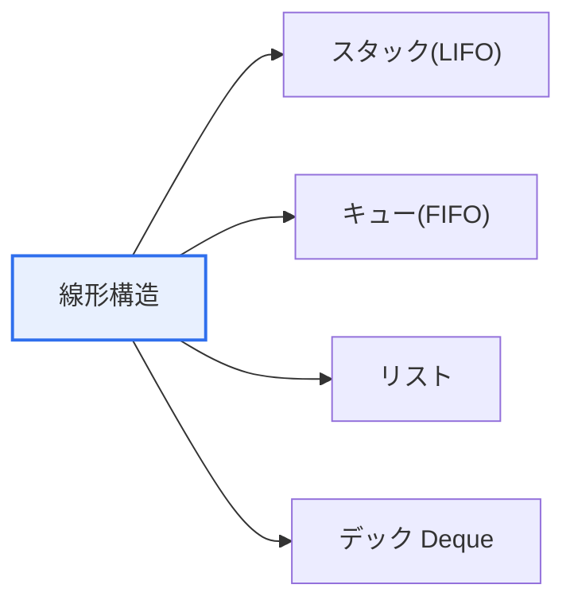

# データ構造: 線形構造と非線形構造

## 1. 概要

### A. 定義
> **データ構造(Data Structure)**は、データを効率的に格納・管理するための論理的な編成方式であり、要素間の接続形態によって**線形構造**(要素が一列)と**非線形構造**(階層・網の形態)に区分される。

両者を分ける本質は「**要素同士がどのように接続されているか**」である。線形構造は、要素が一列に並び、各要素の前後に隣接要素が1つずつだけ存在する1:1の接続である。一方、非線形構造は1つの要素が複数の要素と接続(1:NまたはN:M)され、階層や網目の形態をなす。この接続形態の違いが決定的である理由は、それがそのまま**どのような関係を表現でき、探索・挿入・削除がどれほど効率的か**を決定するからである。順序が重要なデータ(待ち行列、実行履歴)は線形構造で自然に表現され、組織図・地図・SNSの友人関係のような複雑な関係は非線形構造でなければ表現できない。

### B. 必要性
問題のデータの関係特性に合わない構造を用いると、性能が急激に悪化する。例えば、階層関係を無理に線形構造で表現すると探索が非効率になる。適切なデータ構造の選択は、アルゴリズムの時間・空間計算量を直接左右する。

## 2. 線形構造(Linear Structure)

線形構造は、データの入出力規則によって分類される。**スタック**は後から入れたものを先に取り出す後入れ先出し(LIFO)であり、関数呼び出しスタックや取り消し(Undo)機能のように「最も新しいものを先に処理する」状況で用いられる。**キュー**は先に入れたものを先に取り出す先入れ先出し(FIFO)であり、プリンタのジョブ待ち行列・バッファのように「順番に処理する」ために用いられる。**リスト**は順次・連結方式で任意位置へのアクセス・挿入をサポートし、**デック**は両端のどちらからでも挿入・削除が可能である。

| 種類 | 概念 | 代表的な活用 |
|---|---|---|
| **スタック** | 後入れ先出し(LIFO) | 関数呼び出し、取り消し、数式計算 |
| **キュー** | 先入れ先出し(FIFO) | ジョブ待ち行列、バッファ、BFS |
| **リスト** | 順次リスト・連結リスト | 順次アクセス・動的挿入 |
| **デック(Deque)** | 両端での挿入・削除 | スケジューリング、スライディングウィンドウ |

## 3. 非線形構造(Non-Linear Structure)

非線形構造の代表は木とグラフである。**木**は1つの親が複数の子を持つ階層(1:N)構造で、閉路(サイクル)を持たず、ファイルシステムのフォルダ構造やデータベースのインデックス(B-Tree)のように階層・整列データに用いられる。**グラフ**は頂点(Vertex)と辺(Edge)からなる網(N:M)構造であり、地下鉄路線図・SNSの友人関係・カーナビの経路のような複雑な相互接続を表現する。

| 種類 | 概念 | 活用 |
|---|---|---|
| **木(Tree)** | 階層構造(1:N)、閉路なし | ファイルシステム、インデックス、組織図 |
| **グラフ(Graph)** | 頂点・辺の網(N:M) | ネットワーク、最短経路(地図・SNS) |

## 4. 線形 vs 非線形の比較

両構造は、表現する関係と探索方式において対照的である。線形は順序関係を逐次的に探索し、非線形は階層・ネットワーク関係を深さ優先(DFS)・幅優先(BFS)などで探索する。

| 区分 | 線形構造 | 非線形構造 |
|---|---|---|
| **接続** | 1:1(一列) | 1:N、N:M(階層・網) |
| **表現する関係** | 順序関係 | 階層・ネットワーク関係 |
| **探索** | 逐次的 | DFS・BFS(経路探索) |
| **例** | スタック・キュー・リスト | 木・グラフ |
| **適する対象** | 順序のあるデータ | 複雑な関係・階層データ |

## 5. 考慮事項および示唆点

1. **データの関係特性に合った構造の選択が性能を左右**する。順序・履歴には線形、階層・関係には非線形が自然で効率的である。
2. **応用データ構造への拡張**を理解しなければならない。平衡木(AVL・B-Tree)は探索を、ヒープは優先度処理を、グラフアルゴリズム(ダイクストラ法)は最短経路探索を効率化する。
3. **データ構造の選択はアルゴリズムの計算量(O記法)に直結**する。同じ問題でもどの構造を使うかによってO(n)とO(log n)に分かれるため、データ構造とアルゴリズムを併せて設計しなければならない。

---

> **一言まとめ**: 線形構造(スタック・キュー・リスト)は要素が1:1で一列に接続され、非線形構造(木・グラフ)は1:N・N:Mの階層・網として接続されるものであり、データの関係特性に合った構造の選択が探索効率とアルゴリズムの計算量を左右する。
