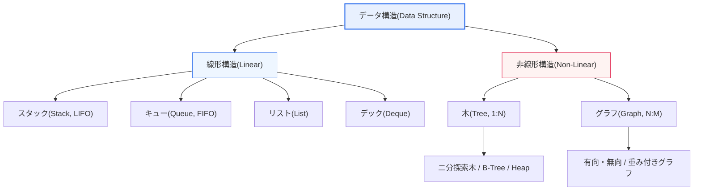
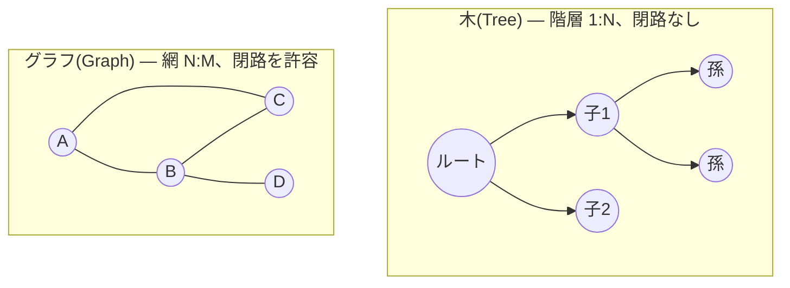

# データ構造: 線形構造と非線形構造

## 1. 概要

### A. 定義
> **データ構造(Data Structure)** とは、データを効率的に格納・管理・演算するための論理的な組織化の方式であり、要素間の接続形態によって、要素が一列に連なる **線形構造(Linear Structure)** と、階層・網の形で連なる **非線形構造(Non-Linear Structure)** とに区分される。

二つの構造を分ける本質は、「**要素同士がどのように接続されているか**」である。線形構造は、要素が一列に並び、各要素の前後に隣接要素が一つずつしか存在しない1:1の接続である。最初と最後の要素を除けば、すべての要素はちょうど一つの先行要素と一つの後続要素を持つ。一方、非線形構造は、一つの要素が複数の要素と接続(1:NまたはN:M)され、階層や網目の形をなす。一つの親が複数の子を持ったり、一つの頂点が複数の頂点と辺で結ばれたりする形態である。

この接続形態の違いが決定的である理由は、それがそのまま**どのような関係を表現でき、探索・挿入・削除がどれほど効率的か**を規定するからである。順序が重要なデータ(待ち行列、関数呼び出し履歴、取り消し用スタック)は、線形構造で自然に表現される。一方、組織図の上下関係、地下鉄路線の乗り換え関係、SNSの友人関係のように一つが多数と絡み合う複雑な関係は、非線形構造でなければ歪みなく表現できない。すなわち、データ構造の選択は単なる格納の便宜の問題ではなく、**問題ドメインの関係構造をコードに移すモデリングの問題**である。

一つ留意すべき点は、「線形/非線形」はあくまで**論理的(抽象的)構造**の区分であるということである。物理的に線形構造である配列がメモリ上に連続配置されるか、非線形構造である木がポインタによって分散配置されるかは、実装(物理構造)の問題である。例えば、ヒープ(Heap)は論理的には完全二分木(非線形)だが、物理的には配列(線形)で実装される。このように論理構造と物理構造を分けて理解することが、データ構造設計の出発点である。

### B. 登場背景および必要性
問題のデータ関係の特性に合わない構造を選択すると、性能は急激に悪化する。例えば、組織図のような階層関係を無理に配列(線形)で表現すると、特定ノードの下位組織を探すのに全体を走査しなければならず、探索はO(n)まで増える。逆に、単に順番に積んで取り出せばよい作業履歴を木で実装すると、不要な複雑さばかりが増す。

適切なデータ構造の選択は、アルゴリズムの時間・空間計算量を直接左右する。同じ「探索」操作でも、整列されていない線形リストではO(n)だが、平衡二分探索木ではO(log n)である。データが100万件のとき、O(n)は最大100万回、O(log n)は約20回の比較で終わる。この差がそのまま応答速度とスループットの差として現れるため、技術士の観点では、データ構造は**アルゴリズム・性能設計と切り離せない基盤技術**である。

## 2. データ構造の全体分類体系

まずデータ構造がどのような系統に分かれるかの全体地図を描いてみると、線形・非線形がどこに位置するかが明確になる。

上記の分類に見られるように、線形構造は「入出力の規則」によって、非線形構造は「接続のトポロジー(階層か網か)」によって細分される。次章からは、各系統の原理と実際の用途を文章で詳しく説明する。

## 3. 線形構造(Linear Structure)

線形構造は、データをどのような規則で出し入れするかによって性格がまったく異なる。規則こそがそのデータ構造のアイデンティティであり、この規則のおかげで特定の状況においてO(1)の非常に高速な演算が保証される。

### A. スタック(Stack) — 後入れ先出し(LIFO)
**スタック** は、最後に入れた要素を最初に取り出す後入れ先出し(Last-In-First-Out)構造である。皿を積み重ねて上から取っていく様子と同じであり、挿入(push)と削除(pop)がともに「最上部(top)」の一か所でのみ行われる。この制約のおかげで、両操作ともO(1)で処理される。

スタックが強力である理由は、「**最も直近の状態に戻る**」という問題に完璧に適合するからである。プログラムの関数呼び出しスタックが代表例である。関数AがBを呼び、BがCを呼ぶと、戻りは正確に逆順(C→B→A)で行われなければならず、これはまさにLIFOである。文書エディタの取り消し(Undo)、Webブラウザの「戻る」、数式の括弧の対応チェック、後置記法の計算も、すべてスタックで実装される。例えば、括弧が三重に入れ子になった数式で、開き括弧をpushし閉じ括弧でpopすれば、スタックが空になるかどうかで対応が正しいかをO(n)で判定できる。

注意すべき点はスタックのサイズ管理である。再帰呼び出しが深くなりすぎると呼び出しスタックが上限を超え、スタックオーバーフローが発生する。実務で再帰をループ+明示的スタックに置き換えたり、末尾再帰最適化を検討したりする理由はここにある。

### B. キュー(Queue) — 先入れ先出し(FIFO)
**キュー** は、先に入れた要素を先に取り出す先入れ先出し(First-In-First-Out)構造であり、切符売り場の行列と同じである。挿入(enqueue)は後方(rear)で、削除(dequeue)は前方(front)で行われる。キューは、「**入ってきた順序を公平に守って処理**」しなければならないあらゆる状況の基盤である。

プリンタの印刷ジョブ待ち行列、OSのプロセススケジューリング待ち行列、ネットワークのパケットバッファ、メッセージキュー(Kafka・RabbitMQ)などは、すべてキューである。グラフの幅優先探索(BFS)も、訪問するノードをキューに入れて近いところから走査する。実務では、配列を円環状に再利用する **循環キュー(Circular Queue)** を用いて前方が空いたときにメモリを無駄にしないようにし、生産者-消費者問題ではサイズが限定されたキューで流量を制御(バックプレッシャー)する。

### C. リスト(List)とデック(Deque)
**リスト** は、要素を順序どおりに格納しつつ、任意位置へのアクセス・挿入・削除をサポートする汎用構造である。実装方式によって性格が分かれ、**配列ベース(順次)リスト** はインデックスでi番目の要素にO(1)で即座にアクセスできるが、途中への挿入・削除時には要素をずらす必要があるためO(n)かかる。**連結リスト(Linked List)** は各ノードが次のノードのアドレスを指し、途中への挿入・削除はポインタを付け替えるだけで済むためO(1)だが、i番目を探すには先頭からたどる必要があるためO(n)である。このトレードオフにより、「**参照が多ければ配列、挿入・削除が多ければ連結リスト**」という実務上の原則が成り立つ。

**デック(Deque, Double-Ended Queue)** は、両端のどちらでも挿入・削除が可能な構造であり、スタックとキューの両方を包含する。スライディングウィンドウの最大値計算、最近使用した項目のキャッシュ(LRU)管理など、前後を自由に扱う必要がある場合に用いられる。

以下の表は、線形構造を規則・演算の計算量・活用の基準で整理したものである。表はあくまで前述の文章による説明を圧縮した補助資料である。

| 種類 | 規則 | 代表的な演算の計算量 | 代表的な活用 |
|---|---|---|---|
| **スタック** | 後入れ先出し(LIFO) | push/pop O(1) | 関数呼び出し、取り消し、括弧チェック、DFS |
| **キュー** | 先入れ先出し(FIFO) | enqueue/dequeue O(1) | ジョブ待ち行列、スケジューリング、バッファ、BFS |
| **リスト(配列)** | インデックス順次 | アクセスO(1)、途中挿入O(n) | 参照中心のコレクション |
| **リスト(連結)** | ポインタ接続 | アクセスO(n)、挿入O(1) | 挿入・削除が多いコレクション |
| **デック(Deque)** | 両端での挿入・削除 | 両端O(1) | スライディングウィンドウ、LRU |

## 4. 非線形構造(Non-Linear Structure)

非線形構造の代表は木とグラフである。両構造とも「一つが多数と接続」されるが、木は閉路のない階層(1:N)であり、グラフは閉路を許容する網(N:M)であるという点で分かれる。以下は、木とグラフのトポロジーの違いを示した詳細な概念図である。

### A. 木(Tree)
**木** は、一つのルート(root)から始まり、親が複数の子を持つ階層構造であり、閉路がなく、任意の二つのノード間の経路が一意である。木が重要な理由は、「**階層関係をそのまま表現しつつ、探索を対数時間にまで引き下げる**」力にある。

最も広く使われる **二分探索木(BST)** は、「左の子 < 親 < 右の子」という規則でデータを整列状態に保ち、探索・挿入・削除を平均O(log n)で行う。ただし、入力が整列された順序で入ってくると一方に偏ってO(n)に退化するため、これを防ぐために **AVL木・赤黒木** のような平衡木が回転操作によって高さを自動調整する。ディスクベースのデータベースやファイルシステムは、一つのノードが数百の子を持つ **B-Tree/B+Tree** をインデックスとして用い、ディスクアクセス回数を木の高さ(通常3~4段)にまで最小化する。数百万行のテーブルでも数回のブロック読み取りで目的のレコードを見つけられる秘訣は、まさにこの構造にある。また、優先度付きキューを実装する **ヒープ(Heap)** は、親が常に子より大きい(小さい)という規則によって、最大値・最小値をO(1)で取り出し、O(log n)で再整列する。

### B. グラフ(Graph)
**グラフ** は、頂点(Vertex)の集合とそれらを結ぶ辺(Edge)の集合で定義され、関係に方向があれば有向グラフ、辺にコストが付けば重み付きグラフとなる。グラフは、「**任意の個体間の複雑な相互接続**」を表現する最も一般的な道具である。

カーナビゲーションの最短経路探索は、交差点を頂点、道路を重み付きの辺とみなした上でダイクストラ(Dijkstra)法を適用した結果である。SNSの友人推薦はユーザグラフにおいて「友人の友人」を探す問題であり、Web検索のページランク(PageRank)はリンクグラフにおける重要度の計算である。グラフは隣接行列(頂点数Vに対してO(V²)の空間)または隣接リスト(辺の数に比例するO(V+E)の空間)で実装され、辺が疎(sparse)な実際のネットワークでは隣接リストの方がはるかに効率的である。探索は深さ優先(DFS、スタックを活用)と幅優先(BFS、キューを活用)が基本であり、これは先に見た線形構造が非線形構造の探索エンジンとして使われる好例である。

| 種類 | 接続形態 | 主な変種 | 活用 |
|---|---|---|---|
| **木(Tree)** | 階層 1:N、閉路なし | BST、AVL、B-Tree、Heap | インデックス、ファイルシステム、優先度付きキュー |
| **グラフ(Graph)** | 網 N:M、閉路を許容 | 有向・重み付き・二部グラフ | 最短経路、SNS、推薦、PageRank |

## 5. 線形 vs 非線形の比較 — 違いが生じる理由

二つの構造の違いは、表面的な形ではなく「**表現しようとする関係の性質**」に由来する。線形構造は時間・順序のように一列に並べられる関係に最適化されており、そのため探索も前から後ろへと順次に流れる。非線形構造は一列に並べられない階層・ネットワーク関係を収めるために生まれたものであり、そのため複数の枝に広がっていくDFS・BFSのような探索が必要となる。すなわち、探索方式の違いは、接続形態の違いから必然的に派生した結果である。

実務的な含意もここから生まれる。順序さえ守ればよいログ・履歴・バッファは線形で実装して実装の単純さとO(1)演算を得る方がよく、多対多で絡み合う関係や階層探索が核心となる問題(推薦・経路・組織)は、最初から非線形で設計してこそ、後になって性能ボトルネックと再設計コストを避けることができる。

| 区分 | 線形構造 | 非線形構造 |
|---|---|---|
| **接続** | 1:1(一列) | 1:N、N:M(階層・網) |
| **表現する関係** | 順序・時間関係 | 階層・ネットワーク関係 |
| **探索** | 逐次探索 | DFS・BFS(経路・階層探索) |
| **代表例** | スタック・キュー・リスト・デック | 木・グラフ |
| **適した状況** | 順序のあるデータ、バッファ・履歴 | 複雑な関係・階層・経路データ |
| **実装上の留意点** | オーバーフロー・循環再利用 | 平衡の維持・閉路の処理 |

## 6. 深掘り — 応用データ構造と実務適用戦略

現代のシステムは、純粋な線形・非線形をそのまま使うよりも、両者を組み合わせたり特化させたりした**応用データ構造**を用いる。これを理解することが技術士レベルの深さである。

第一に、**ハッシュテーブル(Hash Table)** は、キーをハッシュ関数で配列のインデックスに写像して平均O(1)の探索を実現しつつ、衝突解決に連結リスト(チェイニング)を組み合わせる。線形構造(配列+リスト)を組み合わせて「ほぼ定数時間の参照」という新たな性質を生み出した事例である。大規模キャッシュ(Redis)やデータベース結合の中核である。

第二に、データベースのインデックス設計はそのままデータ構造の選択である。範囲検索(BETWEEN)やソートが多ければ整列状態を維持する **B+Treeインデックス** を、等価検索だけが必要なら **ハッシュインデックス** を選ぶ。実際に、100万行のテーブルをインデックスなしで照会すると全件スキャンのO(n)となるが、B+Treeインデックスがあれば数回のノード探索で済み、応答時間が数十倍改善されることはよくある。

第三に、近年ではグラフの関係そのものを格納・照会する **グラフデータベース(Neo4jなど)** が台頭している。リレーショナルDBで多段階の結合として表現していた「友人の友人の友人」をグラフ走査で直接処理し、関係の探索が支配的な推薦・不正検知・ナレッジグラフのドメインで性能上の利点を示している。これは、ドメインの関係構造に合ったストレージを選ぶことが依然として根本原理であることを示している。

## 7. 考慮事項および示唆点

1. **データの関係特性に合った構造の選択が性能を左右する。** 順序・履歴は線形、階層・関係は非線形が自然で効率的である。誤った選択は単なる非効率を超えて、拡張段階で全面的な再設計を招くため、設計初期にドメインの関係構造をまず分析しなければならない。

2. **データ構造の選択はアルゴリズムの計算量(ビッグO)に直結する。** 同じ問題でも、どの構造を使うかによってO(n)とO(log n)、さらにはO(1)に分かれる。データ構造とアルゴリズムは併せて設計すべきであり、「探索・挿入・削除のうちどれが支配的な演算か」をまず定めた上で、その演算が速い構造を選ばなければならない。

3. **時間と空間のトレードオフを常に天秤にかける必要がある。** ハッシュテーブルは高速な参照のために余剰メモリを使い、隣接行列は密なグラフに有利だが疎なグラフでは空間を浪費する。メモリ制約の大きい組込み・モバイル環境では空間効率が、大容量サーバでは時間効率が優先され得る。

4. **論理構造と物理実装を分けて判断しなければならない。** ヒープが配列で、グラフが隣接リストで実装されるように、同じ論理構造でもアクセスパターン・キャッシュ局所性・ディスク特性によって最適な実装は異なる。特にディスク・SSDベースでは、キャッシュ局所性とブロックアクセス回数が理論的な計算量と同じくらい重要である。

5. **応用・特化構造への拡張を常に検討する。** 平衡木・ハッシュテーブル・グラフDBのように基本構造を組み合わせ・特化させた解法は発展し続けているため、問題の規模やアクセスパターンが変われば、データ構造の選択も再評価しなければならない。

---

> **一言まとめ**: 線形構造(スタック・キュー・リスト・デック)は要素が1:1で一列に接続されて順序関係をO(1)の演算で扱い、非線形構造(木・グラフ)は1:N・N:Mの階層・網で接続されて複雑な関係と対数時間の探索を支援するものであり、データの関係特性に合った構造の選択が探索効率とアルゴリズムの計算量を決定する。
