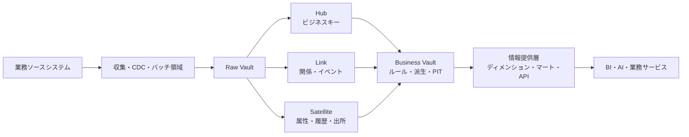
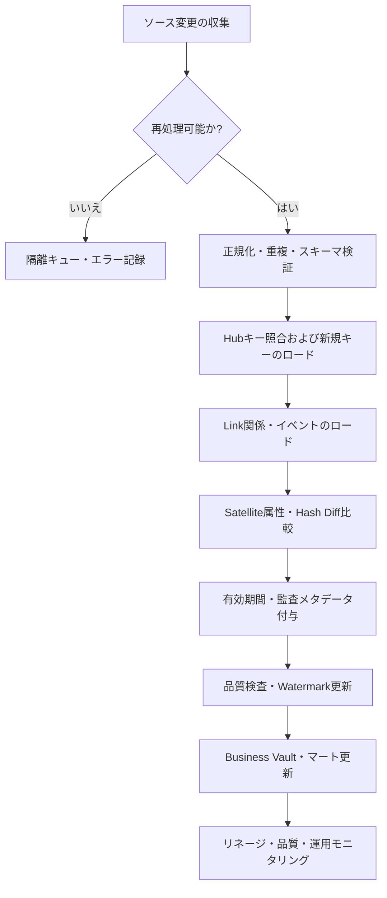

# Data Vault 2.0に基づくデータウェアハウスモデリング

## 1. 概要

### A. 定義

> **Data Vault 2.0**は、業務の変化を受け入れる拡張型データウェアハウスのために、ビジネスキーを保持するHub、関係を表現するLink、コンテキスト・履歴を格納するSatelliteにデータを分離し、並列ロード・履歴保持・監査可能性を中心にRaw VaultとBusiness Vaultを設計するデータモデリング方法論である。

Data Vaultは、特定のデータベース製品や単純なテーブルテンプレートではない。
業務システムが次々と追加され、ソーススキーマが変わる状況において、元データを可能な限り損失なくロードし、後から業務ルールと分析要求を再現できるよう、格納構造とロード原則を併せて提示するものである。
したがって、Hub・Link・Satelliteという3種類のテーブル名だけを覚えても、答案の核心を外すことになる。
核心は、識別子と関係、コンテキストと履歴を互いに異なる変化速度で分離し、変更を局所化することにある。

従来のディメンショナルモデルは分析クエリにすぐ使えるスタースキーマを提供するが、新しいソースや属性が入ってくるたびにディメンションテーブルとファクトテーブルを再調整しなければならない場合が多い。
一方、Data Vaultは元データの事実をまずRaw Vaultに記録し、消費者に必要なビジネスルールと性能最適化はBusiness Vaultと情報提供層で行う。
この分離により、元データの保持と使いやすさという異なる目標を1つのモデルに過度に求めずに済む。

Data Vaultにおける履歴保持は、単なるバックアップとは異なる。
どのソースからどの時刻にどのキーと属性が流入したのか、その値がいつ有効であったのか、どのロードバッチが作成したのかを追跡できなければならない。
このような時間性と出所は、財務・顧客・サプライチェーン分析において結果を再現し、データエラーの原因を遡って追跡し、規制監査に対応する基盤となる。

### B. 登場背景と必要性

第一に、企業のデータ環境は、M&A、SaaSの導入、組織再編、マイクロサービスの分離によってソースが増え続ける。
当初はERP1つだけを統合していたウェアハウスが、CRM、注文プラットフォーム、IoT、外部パートナーのデータまで接続されると、同じ顧客を識別するルールや更新周期が互いに異なってくる。
すべてのソースを最初から完全に統合しようとすると、共通モデルの合意がボトルネックとなり、要件が確定する前に設計が陳腐化しかねない。

第二に、分析結果が現在値だけを示すと、過去の意思決定を再現することが難しい。
顧客ランクや商品分類が変わったときに過去の注文を現在の基準で再分類すると、当時のレポートとは異なる結果が出る。
Data Vaultは、観測時刻、ロード時刻、元の識別子と変更履歴を分離し、「その時点でデータが何であったか」と「現在、業務上どのように解釈するか」を区別する。

第三に、データロードパイプラインをソースごとに並列化する必要がある。
中央の統合テーブルにすべての変換を一度に集約すると、特定ソースの遅延やスキーマ変更がロード全体を止めてしまう。
Hub・Link・Satelliteを業務キーと関係の単位に分解すれば、ソースごとの収集と属性ごとの履歴ロードを独立して運用できる。

第四に、データレイクやクラウドウェアハウスでは、ストレージコストよりも変更対応と運用自動化の方が大きなコストになりうる。
Data Vaultは、元データ保持層、履歴層、ルール層を分離し、メタデータに基づく自動生成と反復可能なロードパターンを適用しやすくする。
ただし、元データをすべて保存すれば無条件に良いというわけではなく、個人情報の最小収集と保存期間ポリシーを併せて設計しなければならない。

### C. 中核目標と適用範囲

Data Vaultの第一の目標は、**変更に対する弾力性**である。
新しい属性はSatelliteを追加するか、既存Satelliteの履歴構造を拡張する方式で受け入れることができ、新しい関係はLinkとして分離できる。
これにより、統合モデル全体を毎回書き直すことなく、変化が生じた領域だけを修正できる。

第二の目標は、**監査可能性と再現性**である。
各行に元システム、ロード時刻、バッチ識別子、レコードの有効時刻といった技術メタデータを保持すれば、結果がどこから来たのかを説明できる。
しかし、技術メタデータがあるからといって意味が自動的に整合するわけではないため、業務用語、データコントラクト、品質ルールを別途結び付けなければならない。

第三の目標は、**並列性と拡張性**である。
顧客情報と契約情報、注文と決済の関係を互いに独立したフローでロードし、複数ソースのSatelliteを並列処理すれば、大規模なバッチとストリーミングを組み合わせることができる。
このとき、並列性はテーブルを細かく分割するだけで生まれるものではなく、重複イベント、順序の逆転、再処理とキー衝突を制御する冪等性の設計が前提となる。

Data Vaultが適する範囲は、ソースが多く、変更が頻繁で、長期の履歴と追跡可能性が重要な統合分析プラットフォームである。
逆に、単一ソースの単純なレポートや小規模な業務データベースでは、Hub・Link・Satelliteを導入するオーバーヘッドの方が大きくなりうる。
技術士の答案では「すべてのデータウェアハウスに適用」と断定せず、変化率・監査水準・分析の遅延時間・運用能力を基準に適用可否を判断しなければならない。

## 2. 構成要素とデータフロー

### A. 全体構造

ソースシステムは、ERP、CRM、注文、決済、センサー、ファイル、外部APIのように、互いに異なるスキーマと更新周期を持つ。
収集層は、データ全体を一度に業務上の意味へ変換するよりも、元の識別子と変更イベントを保持したままRaw Vaultへ引き渡す。
CDCを使用する場合は、作成・更新・削除イベントの順序と再処理位置を併せて管理しなければならず、バッチファイルを使用する場合は、ファイルのハッシュと受信時刻を管理しなければならない。

Raw Vaultは、元データの事実を可能な限り加工せずに保持する層である。
ここでいう「加工しない」とは、すべての原本を無制限に保存するという意味ではなく、業務上の意味を恣意的に上書きせず、追跡可能なルールで正規化するという意味である。
文字エンコーディング、標準時刻、キーの正規化といった技術的処理は必要になりうるが、元の値と変換履歴を失ってはならない。

Business Vaultは、複数のソースを結合し、業務分析に必要な派生ルールを適用する層である。
Point-in-Timeテーブル、Bridgeテーブル、現在状態フラグ、有効性判定、重複除去の結果などがこの層に置かれうる。
こうすることで、Raw Vaultはソースの変更に対して安定したまま残り、ポリシーの変更はBusiness Vaultでバージョン管理できる。

情報提供層は、ユーザーのクエリとツールの性能に合わせて、スタースキーマ、ワイドテーブル、データマート、フィーチャービューなどで構成する。
エンドユーザーはHubやSatelliteを直接結合するよりも、意味が明確で品質SLOが定義されたデータプロダクトを使用すべきである。
Raw Vaultの正規性と監査性、マートの使いやすさと性能は互いに異なる最適化目標であるため、層を分離することが設計の核心である。

### B. Hub: ビジネスキーの安定した中心

Hubは、顧客番号、契約番号、商品コード、口座番号のように、業務上独立して識別される中核的なビジネスエンティティを表現する。
Hubの中心にはビジネスキーがあり、単なるデータベースの自動採番ではなく、ソースが変わっても業務上同じ対象を指す識別子が必要である。
ソースが複数ある場合は、元システムコードと元キーを併せて保持して衝突を防ぎ、統合識別子とのマッピング関係を明確にしなければならない。

Hubには通常、Hub Key、Business Key、Load Date、Record Sourceといった属性を置く。
Hub Keyは結合と参照の安定性を提供し、Business Keyは業務上の意味と重複判定の根拠となる。
Load Dateはデータがプラットフォームに入った時刻であり、業務イベントが発生した時刻や有効開始時刻と同じであると仮定してはならない。

Hubに顧客の氏名、住所、ランクのような変化する説明属性を入れない理由は、変化速度が異なるからである。
こうした属性をHubに入れると、顧客情報が変わるたびにHubの行を更新しなければならず、識別子と説明の役割が混在して履歴の追跡が難しくなる。
属性はSatelliteに置いて変更時に新しいバージョンを追加し、Hubはエンティティの存在と識別に集中させる。

ビジネスキーは、もっともらしく見えるからといってそのまま統合キーとして使用してはならない。
システムAの顧客番号とシステムBの会員番号が同じ顧客を意味すると確定するには、マッピングルール、重複解消の基準、業務オーナーの承認と例外処理手順が必要である。
キーが不安定であったり再利用されたりする場合は、元システムの識別子と有効期間を併せて保持し、統合的な顧客識別は別のマッピングモデルで管理する。

### C. Link: 関係とイベントの記録

Linkは、Hub間の関係や業務イベントを表現する。
顧客と契約の関係、注文と商品の関係、口座と取引の関係のように、2つ以上の業務エンティティがともに意味を形成するときにLinkを使用する。
Linkに関係の属性を過度に入れるよりも、関係の発生そのものと参加キーを保持し、変化する説明はSatelliteに分離するのが一般的な原則である。

Linkは、単なる多対多の中間テーブル以上の意味を持つ。
注文・決済・配送のように時間とともに発生するイベントは、参加Hubと発生時刻を結合して分析の中心となる。
同じHubの組合せが複数回発生しうるイベントであれば、ビジネスキーだけで重複を除去してはならず、取引番号・イベント番号・発生順序番号のようなイベント識別子を別途考慮しなければならない。

関係が3つ以上のHubにまたがる場合は、Linkをどのように分解するかを慎重に検討しなければならない。
例えば、注文、顧客、販売店、商品が同時に参加する取引で1つのLinkにすべてのキーを入れると、意味は明確であるが、変更と再利用が難しくなりうる。
逆に小さなLinkへ無条件に分解すると、結合の複雑さと重複イベントの可能性が高まるため、業務イベントの原子性と分析クエリを基準に設計する。

LinkのSatelliteには、状態、役割、数量、契約条件、有効期間のように、関係に帰属する属性を格納できる。
商品そのものの色は商品HubのSatelliteにあるべきだが、注文時点の販売価格と割引率は注文-商品関係のSatelliteにあってはじめて過去の取引を再現できる。
属性の帰属先を誤ると、顧客・商品の変更が過去の注文を汚染する問題が生じる。

### D. Satellite: コンテキスト・履歴・出所

Satelliteは、HubまたはLinkに従属する説明属性とその変化履歴を格納する。
顧客の氏名・住所、契約状態、商品説明、信用評価結果、注文状態が代表的な例である。
Satelliteは、データの意味と変化周期が似た属性をまとめ、セキュリティ等級や所有組織が異なる属性は分離することで、アクセス制御と変更管理を容易にする。

Satelliteの1行は、おおむね親キー、Load Date、Hash Diff、Record Source、属性値で構成される。
Hash Diffは、前のバージョンと属性集合が変わったかを迅速に判断するために使えるが、ハッシュが同じだからといって業務上の意味が必ず同一であると証明されるわけではない。
ハッシュアルゴリズム、文字列の正規化、nullの表現、カラムの順序、エンコーディング規則を標準化しなければ、同じ値が異なるハッシュになったり、異なる値が同じ比較規則で処理されたりしうる。

属性グループを1つのSatelliteにすべて入れるか複数に分けるかは、変更率とセキュリティ境界を基準に決定する。
毎日変わる顧客状態とほとんど変わらない人口統計属性を一緒に置くと、小さな変更でも大きな行が繰り返し保存され、個人情報へのアクセス範囲も不必要に広がる。
反対に細分化しすぎると結合が増え、メタデータ管理が複雑になるため、意味・変更周期・所有権・セキュリティ等級の共通性を確認する。

Satelliteが現在値テーブルではなく履歴テーブルであるという点が重要である。
現在の状態だけを提供すべきサービスは、Business Vaultまたは情報提供層で最新行を判定して作成する。
Raw Vaultの履歴を直接削除したり上書きしたりして最新状態を作ると、過去レポートの再現と監査可能性を失うため、原本層と消費層の目的を分離する。

## 3. ロード手順とキー設計

### A. ロード順序

まず、ソースイベントまたはファイルを収集し、受信IDとチェックポイントを保存して、同じ入力を再処理できるようにする。
収集の成功とビジネスロードの成功は、別々の状態として管理しなければならない。
ファイルを受信したという事実だけでHub・Link・Satelliteにすべて正常に反映されたと表示すると、障害復旧時に欠落区間を見つけることが難しくなる。

次の段階では、キーの正規化、タイムゾーンの統一、必須フィールドの検査、スキーマバージョンの確認、重複イベントの判別を行う。
この段階では元の値を無条件に捨てるよりも、エラー行を隔離領域に保存し、エラーコードと再処理可否を記録する。
品質検査を通過しなかった行を黙って除外すると、ロード件数は成功のように見えても、分析結果が静かに減少するという、より危険な問題が生じる。

Hubでは、まず業務キーがすでに存在するかを確認し、新規キーであればHub Keyを生成する。
Hash Keyを使用する場合は、キー生成関数と入力フィールドの順序を標準化し、異なるパイプラインが同じエンティティに同じキーを生成するようにする。
ハッシュ衝突の可能性、アルゴリズムの置き換え、キー長、大文字小文字と空白の正規化ポリシーを設計書に明記しなければならない。

Hubが準備できた後にLinkをロードすれば、参加Hubのキーを参照できる。
関係の元イベントIDを一意性の基準に含め、同じイベントが再送されても一度だけ反映される冪等キーを用意する。
Satelliteは、親キーと属性の変更有無を比較し、実際に変化があった場合に新しい履歴行を追加し、繰り返し受信した同一イベントが重複行を作らないようにする。

最後に、ロード件数、新規Hub数、未マッピングキー数、Linkの孤児行数、Satelliteの変更率、遅延時間を検証する。
検証結果は、パイプラインのログだけでなく、データ品質リポジトリや運用ダッシュボードからも照会できなければならない。
Watermarkは最後に成功した入力位置を示すため、失敗した段階の入力を飛ばさないよう、コミット順序と再処理範囲を併せて管理する。

### B. 有効性・時点モデル

Data VaultにおいてLoad Dateはプラットフォームで観測された時点であり、Effective Dateは業務上その値が有効な時点である。
例えば、9月1日に発生した顧客ランクの変更がネットワーク障害によって9月3日に到着した場合、2つの日付は異なる。
分析者が「9月2日当時に我々が知っていた値」を求めているのか、「業務上9月1日から適用された値」を求めているのかによって、照会ルールが変わる。

この2つの時点を混同すると、遅れて到着したデータを過去の期間に反映する際にレポートが変わったり、当時の意思決定に使用されたデータと現在再計算したデータが一致しなくなったりする。
したがって、Satelliteに有効開始・終了時刻、ロード時刻、ソースイベント時刻を必要な水準で保存し、時間の基準をデータコントラクトに明記する。

現在行を見つけるロジックも、単に最大のLoad Dateを選ぶだけでは十分でない場合がある。
将来有効な行、遅れて到着した修正、同一時刻の複数イベント、削除フラグが同時に存在しうるからである。
Business Vaultで業務上の優先順位と時点ルールを明示したPIT・現在状態ビューを生成し、消費者が恣意的に最新行を選ばないようにするのが安全である。

### C. データ品質と冪等性

冪等性とは、同じ入力を1回処理しても複数回処理しても最終結果が同じになる性質である。
Data Vaultは再処理と並列ロードを前提とするため、親キーと元イベント識別子、属性ハッシュ、ロードバッチ情報を組み合わせて重複防止の基準を作る。
単にパイプラインの実行IDをキーとすると、再実行のたびに同じデータが新しい行として積み上がる問題が生じる。

代表的な品質ルールは、Hubビジネスキーの必須性、Hub Keyの一意性、Link参加キーの参照可能性、Satellite親キーの存在、有効期間の重複、Record Sourceの許可リスト、Hash Diffの再現性である。
これらのルールはロード後のサンプル照会だけで終わらせず、バッチごとに自動検証し、失敗時に消費層へ伝播しないようにする。

ソースでの削除も重要な品質項目である。
ソフトデリートのフラグが渡されるのか、削除イベントが別途届くのか、保存ポリシーのために物理削除が必要なのかによって、モデルが変わる。
個人情報の削除要求はRaw Vaultの「履歴保持」原則より優先されうるため、トークン化・分離保管・削除証跡・バックアップの期限切れを含むポリシーを、データモデルと運用手順に反映する。

## 4. Data Vault 2.0と他のモデルとの比較

### A. スタースキーマとの違い

スタースキーマはファクトテーブルとディメンションテーブルを中心にクエリ経路が単純であり、BIツールが理解しやすい。
したがって、ユーザーダッシュボードの応答時間と業務用語中心の使いやすさを最優先とするなら、スタースキーマが直接的な選択肢となりうる。
しかし、複数ソースの元の履歴と変更過程を1つのモデルで同時に表現しようとすると、ディメンションの変更管理とETLの複雑さが増大しうる。

Data VaultはRaw Vaultで履歴と出所を優先的に保持し、エンドユーザーの利便性のためのスタースキーマは別の層で生成する。
その結果、Raw Vaultは結合が多く直接照会しにくいが、新しいソースや属性を受け入れる際にディメンショナルモデル全体を揺るがさない。
両モデルは競合関係というよりも、格納・統合層と消費・表現層で役割が異なりうるものである。

| 比較項目 | Data Vault 2.0 | スタースキーマ | 実務的判断 |
|---|---|---|---|
| 基本目的 | 変更弾力性・履歴・監査 | 分析クエリの単純化・性能 | 層ごとの目標を分離 |
| 中心構造 | Hub・Link・Satellite | Fact・Dimension | ソース数と消費者数を考慮 |
| スキーマ変更 | 影響範囲を局所化 | ディメンション・ファクトの再設計の可能性 | 変更率が高ければVaultが有利 |
| ユーザーアクセス | 直接利用よりもマートを生成 | BIツールと親和的 | 最終提供層に適する |
| 保存量・結合 | 履歴と技術メタデータにより増加 | 比較的単純 | ストレージ費とクエリ費を併せて計算 |
| 監査・再現 | ソース・時点・出所の追跡に強い | 実装方式によって異なる | 規制・監査要求を優先的に評価 |

例えば、金融機関が顧客・口座・取引のソースを統合しつつ、毎年商品や規定が変わるのであれば、Data Vaultで元の履歴と関係を保持し、月末の損益マートはスタースキーマで提供することができる。
逆に、1つの部署が1つのシステムの日別販売量だけを照会するのであれば、Data Vaultを間に挟むよりも、単純なディメンショナルモデルや集計テーブルの方が運用上合理的でありうる。

### B. データレイク・レイクハウスとの違い

データレイクは多様な形式の元データを低コストで保管することに強く、レイクハウスはオブジェクトストレージの上にトランザクション・スキーマ・テーブル管理を組み合わせる。
Data Vaultは、格納媒体よりも統合モデルと履歴管理の原則に焦点を当てる。
したがって、レイクハウスの上にRaw Vaultを実装したり、ウェアハウスエンジンにData Vaultを実装したりする組合せが可能である。

レイクの原本領域は構造変化や非構造化データを幅広く収容するが、業務キー・関係・履歴の意味が一貫して管理されなければ、消費者がそれぞれ独自に解釈することになる。
Data Vaultは元データの保持とは別に、ビジネスキーと関係を明示することで、統合カタログとリネージを作りやすくする。
ただし、すべてのソースをVaultテーブルに複製すると、レイクの柔軟性とコスト上の利点を失いうるため、原本領域と整合性の高い統合領域の役割を区別する。

### C. 3NFモデルとの違い

3NFモデルは、関数従属性と冗長性の除去によって業務データを正規化し、更新異常を減らす。
業務トランザクションの正確な状態管理には強いが、複数ソースの履歴と出所を分析の観点で維持するには、別途の履歴設計が必要である。
Data Vaultも構成要素の内部では冗長性を減らすが、分析用の最小テーブル数よりも、変化の隔離と履歴保持を優先する。

3NFとData Vaultの選択は「正規化が良いかどうか」の問題ではなく、業務目的と時間軸の問題である。
基幹系の注文処理には3NFと強い制約が適し、長期にわたるソース統合と変更追跡にはVaultが適しうる。
1つのデータプラットフォームの中でも、基幹系・Raw Vault・Business Vault・マートがそれぞれ異なるモデルを使用しうる。

## 5. 適用事例と深掘り

### A. 流通・コマースの事例

複数のオンラインチャネルとオフライン店舗が、顧客・商品・注文を互いに異なるキーで管理していると仮定しよう。
顧客Hubは各ソースの元キーと統合マッピングを保持し、注文Linkは顧客・商品・販売チャネル・注文イベントを接続する。
注文時点の価格と割引はLink Satelliteに置き、商品の現在価格が変わっても過去の注文金額が変わらないようにする。

この構造の利点は、新しい販売チャネルが追加された際に、既存の注文マートのETLをすべて再設計することなく、チャネルソースのHubマッピングと関連するLink・Satelliteを追加できる点である。
しかし、同一顧客の判定が不正確であれば顧客生涯価値が重複集計されるため、キーマッピングの信頼度と手動レビューのキューを運用しなければならない。
また、注文取消・一部返金・再配送は単なる現在状態の更新ではなく、イベントの順序と金額を保持しなければならないLink設計上の課題である。

### B. 製造・サプライチェーンの事例

製造企業では、工場・設備・資材・サプライヤー・製造指図が異なるシステムに存在し、設備センサーと品質検査のデータが継続的に流入する。
設備Hubと製造指図Hub、設備-指図Linkを設け、状態・保守履歴・検査結果をSatelliteに分離すれば、センサーシステムの置き換えとERPの刷新を別々に受け入れることができる。

Business Vaultでは、製造指図と検査結果を結合して、不良率、設備別稼働時間、サプライヤー別納期指標を計算する。
このとき、センサーのイベント時刻と収集時刻が異なるため、遅延到着イベントをどの製造期間に帰属させるかのルールを明示しなければならない。
リアルタイム制御が必要な場合は、Data Vaultを制御ループの直接のストアとして使用せず、運用システムと分析プラットフォームを分離するのが安全である。

### C. 公共・規制データの事例

公共機関には事業別のシステムや委託機関が多く、法令・コード・組織が変わるため、過去の統計の再現性が重要である。
Raw Vaultにソース機関、受信ファイル、適用コードのバージョン、ロードバッチを記録すれば、集計結果の根拠を説明しやすくなる。
Business Vaultでは、ポリシーに基づく対象者の判定と統計基準をバージョンで管理し、同じソースであっても当時のルールと現在のルールによる結果を区別できる。

ただし、公共データには住民識別情報や機微情報が含まれうる。
元の履歴保持を理由にアクセス権限を広げてはならず、トークン化・暗号化・列単位のアクセス制御・アクセスログ・保存期間・廃棄検証をData Vaultの運用に含めなければならない。
監査可能なモデルとは、データを永遠に保管するモデルではなく、保管目的と廃棄の証跡まで説明できるモデルである。

### D. 最新の実務的拡張の方向性

現代のData Vault 2.0の実装は、SQLスクリプトを人手で繰り返し作成する方式から、メタデータに基づく自動化へと移行している。
Hub・Link・Satelliteの定義、ソースマッピング、キールール、品質ルールをメタデータとして管理すれば、テーブル・ロードコード・ドキュメント・リネージを一括して生成できる。
しかし、自動生成は誤った業務キーや誤った属性の帰属を急速に拡散させうるため、ドメイン専門家の承認と変更履歴は必ず残さなければならない。

CDCとストリーミングを組み合わせる際は、順序、重複、遅延到着、削除、スキーマ進化を併せて処理しなければならない。
イベントの到着順序だけを信用せず、ソースログの位置とイベント時刻、ウォーターマーク、補正処理ポリシーを保存しなければならない。
リアルタイム性が重要であっても、すべての消費者に元イベントを直接読ませるよりも、検証済みのBusiness Vaultビューと品質状態を提供する方が運用の安定性に有利である。

## 6. 考慮事項および示唆点

### A. ビジネスキーと統合識別子

ビジネスキーの選定はモデルの成否を左右する。
業務上安定したキーであるか、システム間で意味が同じであるか、再利用・変更・複合キーの有無はどうかを確認し、キーのオーナーと例外処理ルールを文書化する。
Hash Keyは性能と分散ロードに有用であるが、業務キーの意味を代替するものではなく、ハッシュ入力の標準化と衝突への対応が必要である。

### B. 履歴保持と個人情報最小化のバランス

Raw Vaultの保持性は、個人情報保護と衝突しうる。
機微属性は別のSatelliteと権限領域に分離し、分析層にはトークンや非識別キーのみを提供し、目的達成後の廃棄とバックアップの期限切れまで管理する。
削除要求が発生した際には、ソース・派生・キャッシュ・バックアップの処理範囲をリネージで確認し、削除結果を監査証跡として残さなければならない。

### C. 性能とコスト

Hub・Link・Satelliteは履歴とメタデータを大量に保存し、結合数が増加しうる。
頻繁に使用する時点結合はPITテーブルと集計ビューで最適化しつつ、更新周期と再計算コストを測定しなければならない。
クラウドでは、ストレージ費を減らすためだけに元の履歴を削除するよりも、パーティション・圧縮・クラスタリング・ストレージクラス・保存期間を組み合わせて、コストと再現性を併せて最適化する。

### D. データ品質と運用責任

Data Vaultは、データ品質を自動的に保証するモデルではない。
キーの重複、孤児Link、有効期間の重複、欠落イベント、スキーマ変更、遅延到着を品質ルールとして定義し、閾値を超えた場合は消費層に警告・遮断・補正の状態を伝達しなければならない。
各データプロダクトのオーナー、ソースシステム担当者、プラットフォーム運用者、セキュリティ担当者の責任境界をRACIで定める。

### E. モデリングガバナンス

Hub・Link・Satelliteをどのような状況で追加するか、Satelliteをどのように分割するか、ビジネスキーを誰が承認するかの標準を整備する。
モデルの変更はコードレビューと自動検証を経て、スキーマ・メタデータ・品質ルール・リネージが一体で変更されるようパイプラインを構成する。
標準を過度に硬直化させると導入が遅れ、逆にチームごとに異なる解釈をすると統合の利点が失われるため、例外承認の手続きを設ける。

### F. 導入戦略と成功指標

最初から全社のすべてのドメインを変換するのではなく、変更が頻繁で履歴・監査の価値が高いドメインを1つ選定する。
顧客・注文のように効果が明確な領域で、キーマッピング、再処理、品質ダッシュボード、マートの提供までを1つの垂直スライスとして検証した後に拡張する。

成否はテーブル数ではなく、新規ソースのオンボーディング期間、再処理成功率、リネージのカバレッジ、品質エラーの検知時間、中核マートの再現性、消費者満足度とコストで測定する。
Data Vaultを導入したにもかかわらず、すべての消費者が元テーブルを直接結合し、手作業のルールを維持しているのであれば、モデルの目的を達成できていないことになる。

## 7. 答案構成戦略

試験の答案では、まずData Vaultを、変更弾力性・履歴・監査・並列ロードのための方法論として定義する。
次に、Hub・Link・Satelliteの役割と、Raw Vault→Business Vault→情報提供層の流れを概念図で示す。

その後、ビジネスキー、Hash Key、Hash Diff、Load Date、Effective Date、Record Source、冪等性をロード手順と結び付けて説明する。
単に用語を列挙するのではなく、なぜ属性をSatelliteに置くのか、なぜ注文価格のようにイベントに帰属する値をLink Satelliteに置くのかを事例で示す。

最後に、スタースキーマ・3NF・レイクハウスと比較して、適用条件とトレードオフを提示する。
個人情報の最小収集、品質・リネージ、コスト・性能、組織ガバナンスと導入戦略を考慮事項として整理すれば、技術士の観点での結論を構成できる。

## 参考資料

- Data Vaultモデルの概念とHub・Link・Satellite構造: https://en.wikipedia.org/wiki/Data_vault_modeling
- Kimball Groupのディメンショナルモデリング手法の参考: https://www.kimballgroup.com/data-warehouse-business-intelligence-resources/kimball-techniques/

---

> **一言まとめ**: Data Vault 2.0は、ビジネスキー・関係・属性履歴をHub・Link・Satelliteに分離して、ソースの変化と監査要求に耐える統合格納層を構築し、Business Vaultとデータマートで業務ルール・性能・使いやすさを補完する方法論である。
