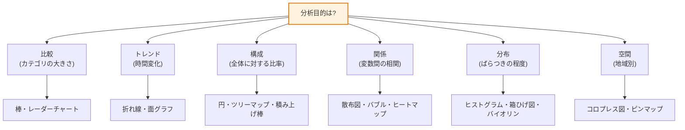

# データ可視化(Data Visualization)

## 1. 概要

### A. 定義
> データ可視化とは、定量・定性データを**位置・長さ・角度・面積・色・形状などの視覚的符号(visual encoding)に変換**し、人がパターン・トレンド・関係・外れ値を直感的に認識して洞察(Insight)を引き出せるよう支援する表現・コミュニケーション技法である。

可視化の力はツールではなく、**人間の認知構造**から生まれる。人間の脳は数字の羅列を順に読んで解釈することには遅いが、色・位置・大きさといった視覚属性は**注意を向ける前に(preattentive)並列的かつ瞬時に認知**する。数百行の表では見えなかった急増区間、外れ値、相関関係が、1つのグラフでは一目で浮かび上がる理由はここにある。したがって良い可視化とは「見栄えの良い図」ではなく、「**データの意味を歪めることなく、正確かつ効率的に伝達するコミュニケーションインタフェース**」と定義すべきである。

この点を劇的に示す古典的な事例が**アンスコムの例(Anscombe's Quartet)**である。平均・分散・相関係数・回帰式がほぼ同一の4つのデータセットは、散布図に描くとまったく異なる形状(線形・曲線・外れ値主導)を示す。要約統計だけを見れば同じに見えるデータが、可視化すると本質が分かれるというこの事例は、可視化が単なる補助的表現ではなく**分析の一方法論**であることを証明している。反対に、誤った可視化(軸の切断、3Dによる歪み、不適切なチャートの選択)はむしろ事実を歪めて誤った意思決定を誘導するため、可視化では「何を見せるか」と同じくらい「どう歪めないか」が重要である。

### B. 登場背景と必要性
データは爆発的に増加しているが、人間が消化できる認知の帯域幅は限られている。組織が収集するログ・取引・センサーデータは急激に増える一方で、意思決定者が1回の会議で理解できる情報量は数十年前と変わらない。この**「データの供給と認知的な消費の不均衡」**が、可視化を必須のものにしている。可視化は膨大なデータを圧縮し、意思決定者が迅速に状況を把握して行動できるよう支援する。

特にデータ駆動型経営・AIの時代には、分析結果を利害関係者に説得力をもって伝える**「データストーリーテリング」**の中核手段として定着した。いかに精緻な機械学習モデルであっても、その結果を非専門家の経営陣が理解できなければ意思決定にはつながらない。実際、ナイチンゲールがクリミア戦争の死因を「鶏頭図(rose diagram)」で可視化して衛生改革を導いたこと、ジョン・スノウがコレラの死亡地点を地図上にプロットして汚染された井戸(ブロード・ストリートのポンプ)を突き止めたことは、いずれも**データではなく可視化が意思決定を変えた**歴史的事例である。

## 2. 可視化の原理と制作手順

データ可視化は即興でチャートを描く作業ではなく、**分析目的から視覚符号へとつながるマッピング(mapping)の設計**である。全体の手順を構造図で表すと次のとおりである。

**第一に、データ収集・クレンジングの段階**では、欠損値・外れ値・尺度(scale)を整理する。この段階が不十分であれば、その上にいかに美しいチャートを載せても「ゴミを入れればゴミが出る(GIGO)」という原則から逃れられない。例えば、単位が混在した売上データ(ウォン・千ウォン・百万ウォン)を正規化せずに棒グラフにすると、軸が無意味になる。

**第二に、分析目的の定義**は、可視化の成否を分ける最も重要な段階である。「何を伝えたいのか」がそのままチャートを決定するからである。カテゴリ間の大きさを比べたいのか(比較)、時間による変化を見たいのか(トレンド)、2変数の関係を見たいのか(相関)によって、選択すべき視覚符号が変わる。目的を飛ばして「格好いいチャート」から選ぶと、データがメッセージに従うのではなく、メッセージがチャートに引きずられることになる。

**第三に、データを視覚符号にマッピング**する。ここでの核心は**認知精度の順序**である。クリーブランドとマギル(Cleveland & McGill)の実験によれば、人は値を「位置(共通軸上の長さ)」で表現したときに最も正確に読み取り、「角度・面積」で表現すると誤差が大きくなる。円グラフが棒グラフより比較に不利である理由は、まさに角度・面積でエンコーディングするからである。したがって精密な比較が目的であれば、値を「長さ・位置」にマッピングしなければならない。

**第四に、チャート制作後は必ず解釈・検証**を行う。自分が意図したメッセージとは異なって読まれる余地はないか、軸・凡例・色が誤解を招かないかを自ら点検する。この検証-フィードバックのループがあってはじめて、可視化が「データで嘘をつく」ことに堕さずに済む。

この手順全体を貫く制作原理は、4つに整理される。

| 原理 | 内容 | 違反時の問題 |
|---|---|---|
| **正確性(Truthfulness)** | データを歪めずに表現(軸は0から開始、3D禁止) | 軸の切断により3%の差を3倍に誇張 |
| **明確性(Clarity)** | 伝達メッセージが明確、強調点を明示 | 何を見ればよいのか分からない散漫なチャート |
| **効率性(Efficiency)** | 最小のインクで最大の情報(データインク比↑) | グリッド・影・装飾がデータを覆い隠す |
| **審美性(Aesthetics)** | 可読性の高い色・レイアウト・整列 | 彩度の高い色の多用による疲労・誤読 |

特に**正確性**は他の3つに優先する。軸の始点を0以外で切ったり(軸の切断、truncated axis)、3D効果によって遠近で面積を歪めたりすると、データが事実であっても図は嘘をつく。**データインク比(Data-Ink Ratio)**の概念を提示したエドワード・タフテ(Edward Tufte)は「伝達に寄与しないすべてのインク(チャートジャンク、chartjunk)を取り除け」と述べたが、これは効率性原理の理論的根拠である。

## 3. 可視化の類型 — 目的別のチャート選択

可視化の類型は、先に強調したとおり「**何を見せようとしているのか**」という分析目的から決定される。データの構造(カテゴリ型/連続型/時系列/地理)と伝達意図(比較/トレンド/構成/関係/分布/空間)の組合せがチャートを規定する。目的とチャートが食い違えば(例: 時系列を円グラフで表す)、いかに美麗であっても誤解を招く。

**比較(Comparison)**の目的には棒グラフが標準である。値を共通軸上の長さでエンコーディングするため、認知精度が最も高い。カテゴリ数が多い場合や多次元(例: 部署×能力)の場合はレーダーチャート(radar)も用いるが、各軸の尺度が異なると誤読のリスクがあるため、限定的に用いる。

**トレンド(Trend)**には折れ線グラフ・面グラフが適している。時間軸(x)に沿った値(y)の連続的な変化を線の傾きで示す。例えば月別の訪問者数を折れ線グラフにすると、季節性・急増・急減が傾きとして即座に現れる。ただし、**折れ線を複数重ねる場合は5本以内**に制限しなければ、スパゲッティチャートになってしまう。

**構成(Composition)**は、全体に対する部分の比率を示す。円・ドーナツ・ツリーマップがこれに該当するが、円グラフは角度でエンコーディングするため正確な比較が難しく、**項目が3~5個以下で合計が100%の場合**にのみ推奨される。項目が多い場合は、階層構造を面積で表現するツリーマップの方がよい。

**関係(Relationship)**は、散布図・バブルチャート・ヒートマップで表現する。例えば広告費(x)と売上(y)の相関を散布図に描くと、正の相関・クラスター・外れ値が一目で分かる。3つ目の変数を点の大きさ(バブル)や色として加えれば、多次元の関係も1つの画面に収めることができる。

**分布(Distribution)**は、ヒストグラム・箱ひげ図・バイオリンプロットが担当する。成績・所得のように、データがどのように散らばっているか、中央値・四分位・外れ値がどこにあるかを示す。A/Bテストで2つのグループの応答時間の分布を箱ひげ図で重ねて描けば、平均だけでは見落とす裾(tail)の違いを捉えられる。

**空間(Spatial)**は地図ベースである。地域別の販売をコロプレス図(choropleth)で、位置別の密度をヒートマップで表現する。ただし、コロプレス図には面積の大きい行政区域が視覚的に過大表現されるという偏りがあるため、人口基準のカルトグラムで補正することもある。

## 4. 比較・事例 — 良い可視化と悪い可視化

効果的な可視化は「より華やかに」ではなく「より明瞭に」を志向する。同じデータであっても、エンコーディングの選択によって伝達力は大きく変わる。

| 区分 | 悪い可視化 | 良い可視化 | 違いが生じる理由 |
|---|---|---|---|
| **軸** | y軸を90~100で切断 | 0から開始 | 切断は小さな差を誇張(歪曲) |
| **チャート** | 12項目の円グラフ | 並べ替えた横棒グラフ | 角度より長さの方が比較に正確 |
| **色** | 虹の7色を多用 | 強調1色+グレー | 色が多いと階層が失われる |
| **装飾** | 3D・影・グリッド | 最小限のインク | チャートジャンクがデータを覆い隠す |

第一に、**チャート選択の事例**として「12カテゴリの市場シェア」が挙げられる。これを円グラフで描くと隣接する扇形の大きさを角度で区別しにくいが、値の順に並べた横棒グラフで描けば、順位と格差が即座に読み取れる。実務において、円グラフを並べ替えた棒グラフに変えるだけで報告書の誤読率が目に見えて下がる理由である。

第二に、**軸操作の事例**である。2つの製品の満足度がそれぞれ92点、95点であるとき、y軸を90~96で切断すると、棒の高さの差がまるで数倍であるかのように見える。3点(約3%)の差が、視覚的には3倍に誇張されるのである。これはメディア・広告で頻繁に悪用される歪曲手法であり、軸を0から始めれば実際にはわずかな差であることが正直に示される。

第三に、**色とアクセシビリティの事例**である。全人口の約8%(男性基準)に及ぶ赤緑色覚異常を考慮すると、赤-緑の対比で増減を表現したダッシュボードは、相当数のユーザーにとって意味をなさない。青-オレンジのような色覚多様性に配慮したパレット(例: ColorBrewer、Viridis)に変えれば、アクセシビリティは大きく改善する。効率化の方策をまとめると、① 目的・データ特性を優先したチャート選択、② チャートジャンクの除去と色・ラベルの最小化・一貫化、③ ダッシュボード・インタラクティブ機能(ドリルダウン・フィルタ)によるユーザーの自律的な探索の支援、④ 色覚配慮パレット・モバイルレスポンシブ・代替テキストなどによるアクセシビリティの確保、に要約される。

## 5. 深掘り — 最新動向と生成AIに基づく可視化

可視化技術は「静的チャート → インタラクティブダッシュボード → 対話型・自動生成」へと進化している。この流れの背景には、データへのアクセスを専門家から業務部門(citizen analyst)へと広げようとする**データの民主化(data democratization)**の要求がある。

**第一に、BIツールのセルフサービス化**である。Tableau・Power BI・Lookerのようなツールは、SQL・コーディングなしにドラッグ&ドロップでダッシュボードを作れるようにし、可視化をデータチームの専有物から業務部門の日常的なツールへと変えた。最近ではリアルタイムのストリーミングデータと接続し、運用ダッシュボード(運用KPI、リアルタイムモニタリング)へと拡張されている。

**第二に、自然言語に基づく自動可視化(NL2Chart/NLQ)**である。生成AI・LLMの発展により、「前四半期の地域別売上を見せて」と自然言語で質問すると適切なチャートを自動生成する機能が、主要なBIツール(例: Power BI Copilot、Tableauの自然言語クエリ)に搭載されつつある。これは、チャート選択・エンコーディングという専門知識をツールが代行する方向であり、可視化リテラシーの敷居を下げる。ただし、自動生成されたチャートが常に最適かつ正直であるとは限らないため、**人による検証(軸・尺度・誤読の有無)**は依然として必要である。

**第三に、コードに基づく再現可能な可視化**である。PythonのMatplotlib・Seaborn・Plotly、JavaScriptのD3.js、そして「**グラフィックス文法(Grammar of Graphics)**」を実装したggplot2・Vega-Liteは、可視化をコードとして定義し、バージョン管理・自動化・再現を可能にする。特にVega-Liteはデータ・エンコーディング・マークを宣言的に記述し、可視化設計の原理をそのままコードに反映するという点で、理論と実務をつないでいる。

このほか、地理空間・ネットワーク・3D・VRによる可視化、そして大容量データをブラウザで処理するWebGLベースのレンダリング(deck.glなど)が広がっている。ただし、華やかさが明瞭さを圧倒した瞬間に可視化の本分(正確・明確なコミュニケーション)が損なわれるという原則は、いかなる新技術においても変わらない。

## 6. 考慮事項および示唆点(技術士の観点)

1. **可視化は分析の終わりではなく、コミュニケーションの始まりである。** 洞察を意思決定へとつなげるには、BIツール(Tableau・Power BI)とデータストーリーテリングを組み合わせなければならない。技術士は「どのモデルを使ったか」よりも「結果を意思決定者が理解・信頼しているか」を基準に可視化の成果物を評価すべきであり、分析パイプラインのラストワンマイル(last mile)として可視化に投資すべきである。

2. **可視化の倫理とガバナンスを制度化しなければならない。** 軸の操作・チェリーピッキング・不適切なチャートによって特定の結論を誘導することは、「データで嘘をつく」ことである。組織として可視化ガイドライン(軸の0開始原則、承認されたカラーパレット、チャート類型の標準)を策定し、一貫性・誠実性を強制することが、トレードオフを管理する方法である。

3. **アクセシビリティ・包摂性は選択肢ではなく要件である。** 色覚配慮パレット、代替テキスト、モバイルレスポンシブはWCAGなどのアクセシビリティ標準と連動し、公共・金融サービスでは法的要件となりうる。戦略的には、アクセシビリティを初期設計に組み込む(built-in)ことの方が、事後の補正よりもコストが低い。

4. **自動化と人による検証のバランスが鍵である。** 生成AIに基づくNL2Chartは生産性を高めるが、自動生成されたチャートには歪曲・ハルシネーション(hallucination)のリスクがある。技術士は「自動生成 + 人による検証(human-in-the-loop)」のガバナンスを設計し、スピードと誠実性をともに確保しなければならない。

5. **認知負荷とデータリテラシーを併せて考慮しなければならない。** いかに優れた可視化であっても、聴き手のデータ解釈能力が低ければ誤読される。組織のデータリテラシー教育と可視化の標準化を並行して進めることが、長期的なデータ文化の転換の前提である。

## 参考資料
- Edward Tufte, "The Visual Display of Quantitative Information" — データインク比・チャートジャンクの概念
- Cleveland & McGill, "Graphical Perception" (1984) — 視覚符号別の認知精度に関する実験
- ColorBrewerカラーパレット: https://colorbrewer2.org
- Vega-Lite(グラフィックス文法に基づく宣言的可視化): https://vega.github.io/vega-lite/

---

> **一言まとめ**: データ可視化は、*正確・明確・効率・審美*の原理に従ってデータを認知精度の高い視覚符号(位置・長さを優先)にマッピングし、目的別のチャート(比較・トレンド・構成・関係・分布・空間)を選択して洞察を直感的に伝えるコミュニケーション技法であり、チャートジャンクの除去・インタラクティブ化・アクセシビリティによって効率化しつつ、軸の操作を排する可視化倫理と、生成AIによる自動化時代における人による検証が核心である。
