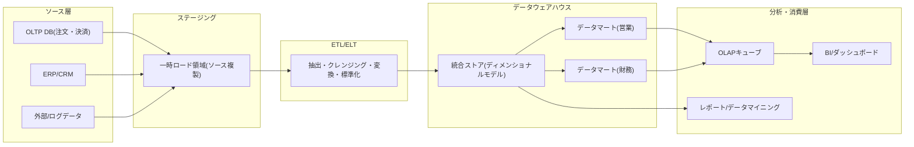
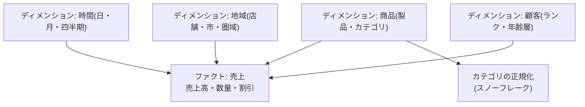

# データウェアハウス(Data Warehouse)とOLAP

## 1. 概要

> **データウェアハウス(Data Warehouse, DW)**は、複数の基幹系(OLTP)システムに散在するデータをサブジェクト(subject)中心に統合・クレンジングし、時間の経過に沿って蓄積し、削除・更新なしに保持することで、意思決定支援のための問い合わせ(分析)に最適化した統合データストアである。**OLAP(Online Analytical Processing)**は、こうして蓄積されたデータを多次元(multidimensional)の観点から高速に集計・探索できるよう支援する分析処理技術である。

企業が運営する情報システムの大半は、注文・決済・在庫のように個々のトランザクションを正確かつ高速に処理するOLTP(Online Transaction Processing)を目的として設計される。
OLTPデータベースは正規化されているため更新異常を防ぎ、短いトランザクションを大量に処理するのに有利であるが、「過去3年間の地域別・四半期別の売上推移を製品群ごとに比較する」といった広範な集計クエリには不向きである。
このようなクエリは数十のテーブルを結合し、数億件をスキャンしなければならないため基幹系に負荷をかけ、何よりも基幹系は過去の履歴を長く保持しない。
データウェアハウスはこのギャップを埋めるために登場した — 基幹系から分離した別のストアに履歴を蓄積し、分析に有利な構造へと再構成するのである。

ビル・インモン(Bill Inmon)はDWを「サブジェクト指向(subject-oriented)・統合的(integrated)・時系列的(time-variant)・非揮発的(non-volatile)なデータの集合」と定義しており、この4つの特性はDWをOLTP DBと区別する中核的な基準となる。
サブジェクト指向は「顧客・商品・売上」のように業務サブジェクト単位でデータを編成することを、統合は複数ソースのコード・単位・表現を一貫した形に標準化することを、時系列は スナップショットに時点を付与して履歴を残すことを、非揮発はロード後に原則として更新・削除せず、読み取り中心で運用することを意味する。

論述答案では、DWを単なる「大きなデータベース」に矮小化しないことが重要である。
DWは、(1) OLTPとの目的・構造の違い、(2) ETL/ELTによるデータ統合パイプライン、(3) ディメンショナルモデリング(スター/スノーフレークスキーマ)という設計手法、(4) OLAPキューブによる多次元分析、という4つの軸が結合した体系として記述しなければならない。
最近では、データレイク・レイクハウスとの関係、クラウドDW(MPP)とカラム型ストレージの台頭まで結び付ければ、時宜を得た答案となる。

### A. 登場背景と必要性

第一に、基幹系と分析系の分離が必要である。
分析クエリを基幹DBに直接投げると、ロック競合と大量スキャンによって注文・決済のような中核トランザクションの応答時間が悪化する。
DWは分析ワークロードを物理的に隔離して基幹系の性能を保護しつつ、読み取り・集計に最適化された別の環境を提供する。

第二に、データ統合と「信頼できる唯一の情報源(Single Source of Truth)」が求められる。
同じ「売上」であっても、営業・会計・物流システムで定義やコード体系が異なれば、部署ごとに数字が食い違う。
DWはETLの過程でコード・単位・基準を標準化し、全社が同じ定義で指標を解釈できるようにする。

第三に、履歴の蓄積とトレンド分析が必要である。
基幹系は最新の状態のみを維持するが、経営上の意思決定には過去と現在を比較する時系列分析が求められる。
DWは時点ごとのスナップショットを非揮発的に保持し、長期トレンド・季節性・異常の兆候を追跡できるようにする。

## 2. 全体構造とデータフロー

データウェアハウスは、ソースから最終的な分析まで複数の層を経る。
基幹系・外部データがステージング領域へ抽出され、クレンジング・変換を経てDWにロードされ、特定の部署・サブジェクトに合わせたデータマート(Data Mart)に分割されて、OLAP・BIツールで消費される。

**ソース層**は、DWが統合する元データを提供する。
基幹系DBだけでなく、ERP・CRM、外部の市場データ、Webログなど異質なソースが含まれ、それぞれスキーマ・コード体系・更新周期が異なる。
この異質性を吸収することが、その後のETLの中核課題である。

**ステージング領域**は、ソースから抽出した元データを一時的に格納しておく緩衝地帯である。
ソースシステムへのアクセス時間を最小化し、変換途中で失敗してもソースに影響を与えないよう隔離する。
ステージングでクレンジング・重複除去・型変換が行われた後、本体のDWへ引き渡される。

**ETL/ELT層**は、データ統合の心臓部である。
抽出(Extract)はソースからデータを取得し、変換(Transform)はコードの標準化・単位の統一・欠損処理・集計・サロゲートキーの生成を行い、ロード(Load)は結果をDWに格納する。
従来のETLは別のエンジンで変換してからロードするが、クラウドDWの演算能力が高まるにつれ、先にロードしてDW内部でSQLにより変換するELTが広がった。

**DW・データマート層**は、統合されたデータをディメンショナルモデルで格納する。
全社統合ストアを中心に置き、営業・財務のように特定の部署・サブジェクトに合わせた部分集合であるデータマートを派生させることで、クエリ性能とアクセス制御を改善する。
インモン式のトップダウン(中央DW→マート)と、キンボール(Ralph Kimball)式のボトムアップ(マート統合→バスアーキテクチャ)が代表的な設計思想である。

## 3. ディメンショナルモデリングとOLAP演算

DW設計の中核手法は**ディメンショナルモデリング(Dimensional Modeling)**である。
分析対象となる測定値(売上高・数量など)を**ファクトテーブル(Fact Table)**に置き、分析の観点(時間・商品・地域・顧客など)を**ディメンションテーブル(Dimension Table)**として分離し、ファクトを中心にディメンションが星形に接続される**スタースキーマ(Star Schema)**を構成する。
ディメンションテーブルは意図的に非正規化して結合数を減らし、クエリ性能を高める。

スタースキーマのディメンションをさらに正規化し、階層を別テーブルに分割すると**スノーフレークスキーマ(Snowflake Schema)**になる。
スノーフレークは格納の重複を減らし階層管理を明確にするが、結合が増えてクエリが複雑になり、性能が低下しうる。
したがって、格納効率と階層の整合性が重要であればスノーフレークを、クエリ性能と単純さが優先であればスタースキーマを選択するのが実務上の慣行である。
ディメンションの値が時間とともに変化する場合(例: 顧客ランクの変更)を扱う**SCD(Slowly Changing Dimension)**手法も重要であり、上書きするType 1、履歴行を追加するType 2、以前の値をカラムとして保持するType 3が代表的である。
例えばマーケティング分析で「VIP昇格前後の購買パターン」を見るには、Type 2でランク変更の履歴を残しておかなければならない。

**OLAP演算**は、このように構成された多次元キューブ(cube)を探索する標準的な操作である。
ユーザーは次のような演算によって、データをさまざまな角度から分析する。

| 演算 | 意味 | 例 |
|---|---|---|
| Roll-up | 上位階層へ集計 | 日別 → 月別 → 四半期別の売上を合算 |
| Drill-down | 下位階層へ詳細化 | 四半期売上 → 月 → 日単位に細分化 |
| Slice | 1つのディメンションを固定して部分集合を抽出 | 「2026年第3四半期」で時間ディメンションを固定 |
| Dice | 複数のディメンションに範囲条件を付与 | 特定地域・特定製品群のみを選択 |
| Pivot(Rotate) | 軸を回転させて観点を切り替え | 行・列のディメンションを相互に入れ替え |

これらの演算は、経営陣が「全体 → 異常区間 → 原因」と絞り込んでいく自然な探索過程をそのまま支援する。
例えば全社売上が減少した場合、Roll-upのレベルで異常を認識し、Drill-downでどの圏域・製品が原因かを掘り下げ、Slice/Diceで特定の条件を切り分けて原因を究明する。

## 4. OLAP実装方式の比較とOLTPとの違い

OLAPは、データをどこに・どのように格納するかによって3つの方式に分かれ、それぞれ性能・拡張性・柔軟性のトレードオフが異なる。
以下の比較の核心は、「あらかじめ計算しておけば速いが柔軟性と拡張性が落ち、リレーショナルに任せれば柔軟で拡張できるが応答が遅くなる」という原理である。

| 区分 | MOLAP | ROLAP | HOLAP |
|---|---|---|---|
| 格納 | 多次元キューブ(事前集計) | リレーショナルDB(スタースキーマ) | 要約=キューブ、詳細=リレーショナル |
| クエリ性能 | 非常に速い | 相対的に遅い | 中程度(要約は速い) |
| 拡張性/大容量 | キューブ爆発により制限 | 優秀 | 折衷 |
| 柔軟性 | 低い(事前定義) | 高い(任意のSQL) | 中程度 |
| 代表例 | Essbase、SSAS(MOLAP) | 大半のSQLベースBI | SSAS(HOLAP) |

MOLAPは集計をあらかじめ計算してキューブに格納するため応答が速いが、ディメンションとその組合せが増えると事前集計の量が爆発的に増える「データ爆発(data explosion)」の問題がある。
ROLAPはリレーショナルDBにスタースキーマとして置き、クエリ時点で集計するため、大容量と任意のクエリに強いが、応答が遅くなりうる。
HOLAPは、頻繁に使う要約はキューブに、詳細はリレーショナルに置いて、両者を折衷する。

DW/OLAPとOLTPの違いを明確に対比すると、設計判断の根拠が明確になる。

| 観点 | OLTP(基幹系) | OLAP/DW(分析系) |
|---|---|---|
| 目的 | トランザクション処理 | 意思決定支援のための分析 |
| クエリ | 短い読み取り/書き込みが多数 | 広範な読み取り・集計が少数 |
| 設計 | 正規化(3NF) | 非正規化(スタースキーマ) |
| データ | 現在の状態、詳細 | 履歴の蓄積、要約を含む |
| 格納方式 | 行指向(row-store) | 列指向(column-store)が有利 |
| 更新 | 頻繁な更新・削除 | 定期的なバッチロード、非揮発 |

特に格納方式の違いは性能に直結する。
分析クエリは少数のカラムを大量の行にわたって集計するため、同じカラムの値を連続して格納する**列指向(カラム型ストレージ)**が、I/Oと圧縮の面で圧倒的に有利である。
Amazon Redshift、Google BigQuery、SnowflakeのようなクラウドDWが、カラム型ストレージとMPP(Massively Parallel Processing)を組み合わせて数十億行の集計を数秒で処理しているのは、この原理の産業的な実装である。

## 5. 深掘り — クラウドDW・レイクハウスへの進化

従来のDWはオンプレミスに固定容量で構築されていたため、ピーク時の分析負荷に合わせて過剰投資するか、逆にリソースが不足するという問題があった。
2010年代以降、**クラウドデータウェアハウス**がこの限界を変えた。
Snowflakeは**ストレージとコンピュートの分離(decoupled storage/compute)**を導入し、同一データに対して複数の仮想ウェアハウスが独立して拡張・課金されるようにした — 大量ロードと対話型分析が互いに干渉せず、使った分だけ費用を支払う。
BigQueryはサーバーレスでインフラ管理なしにペタバイト級のクエリをサポートし、RedshiftはRA3ノードでコンピュート/ストレージを分離した。

一方、構造化DWだけではログ・画像・テキストのような非構造化・半構造化データを格納しにくいため、**データレイク(Data Lake)**が並行して導入されたが、レイクはガバナンス・スキーマ・トランザクションが弱く、「データスワンプ(swamp)」になりやすかった。
これを統合したのが**データレイクハウス(Lakehouse)**であり、安価なオブジェクトストレージの上にDelta Lake・Apache Iceberg・Hudiのようなオープンテーブルフォーマットによって、ACIDトランザクション・スキーマ進化・タイムトラベルを付与し、DWの信頼性とレイクの柔軟性を結合する。
すなわちDW→レイク→レイクハウスの流れは、「構造化分析の信頼性」と「多様なデータの受容性」を1つにまとめようとする進化として理解できる。

また、リアルタイムの意思決定の需要が高まるにつれ、バッチ中心の従来型DWにストリーミングロード(CDC・Kafka)とニアリアルタイムの集計が組み合わされつつある。
以前は夜間バッチで1日1回更新していたDWが、変更データキャプチャ(CDC)によって数分単位で最新の状態を反映する方向へと移行しているのである。

## 6. 考慮事項および示唆点

- **モデリング思想の選択(Inmon vs Kimball)**: 全社標準化・ガバナンスが重要であれば、中央DWを先に構築するトップダウン(Inmon)が、迅速な価値実現が重要であれば、部署のマートを先に作ってバスアーキテクチャで統合するボトムアップ(Kimball)が有利である。両方式は対立するものではなく、組織の成熟度と優先順位に応じた選択肢であり、実務ではハイブリッド型が一般的である。
- **性能と柔軟性のトレードオフ**: 事前集計(MOLAP)・サマリーテーブル・マテリアライズドビューは応答を速くするが、格納・更新コストとキューブ爆発を招く。クエリパターンを分析し、頻繁に使う集計のみを選択的に事前計算し、残りはカラム型ストレージ・MPPで処理するバランスの取れた設計が必要である。
- **データ品質と信頼できる唯一の情報源**: DWの価値は統合された指標定義から生まれる。ETL段階での標準化・検証とともに、データガバナンス・マスターデータ管理(MDM)・データコントラクトを連携させ、指標定義の一貫性を組織的に保証しなければならない。SCD戦略を明確に定め、履歴の正確性も確保する。
- **コスト・ガバナンス・展望**: クラウドDWは使用量ベースの課金であるため、無秩序な大規模クエリはコストの急増を招く — FinOpsの観点からのワークロードモニタリング・クエリ最適化・ライフサイクルポリシーが必要である。個人情報を含む履歴を長期保存するため、アクセス制御・マスキング・保存期間の管理も必須である。今後DWは、レイクハウスへの収斂、リアルタイム化、BIに組み込まれる生成AI(自然言語クエリ)の方向へ進化すると見込まれ、技術士はこれを組織の分析成熟度・規制・コスト制約と併せて総合的に判断しなければならない。

## 参考資料

- Kimball Group, "Dimensional Modeling Techniques", https://www.kimballgroup.com/data-warehouse-business-intelligence-resources/kimball-techniques/dimensional-modeling-techniques/
- Snowflake, "What Is a Data Warehouse?", https://www.snowflake.com/guides/what-data-warehouse
- Databricks, "What is a Data Lakehouse?", https://www.databricks.com/glossary/data-lakehouse
- AWS, "What is OLAP?", https://aws.amazon.com/what-is/olap/

---

> **一言まとめ**: データウェアハウスは、基幹系から分離し、サブジェクト指向・統合・時系列・非揮発の原則で履歴を蓄積した分析専用のストアであり、ディメンショナルモデリング(スター/スノーフレーク)とOLAP演算(ロールアップ・ドリルダウン・スライス・ダイス・ピボット)によって多次元分析を支援し、近年はカラム型ストレージ・MPPベースのクラウドDWとレイクハウスへと進化している。
