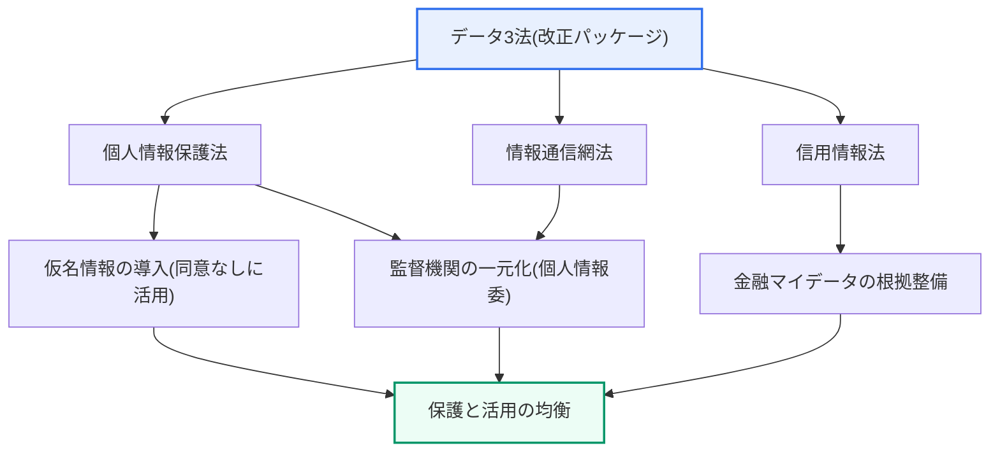
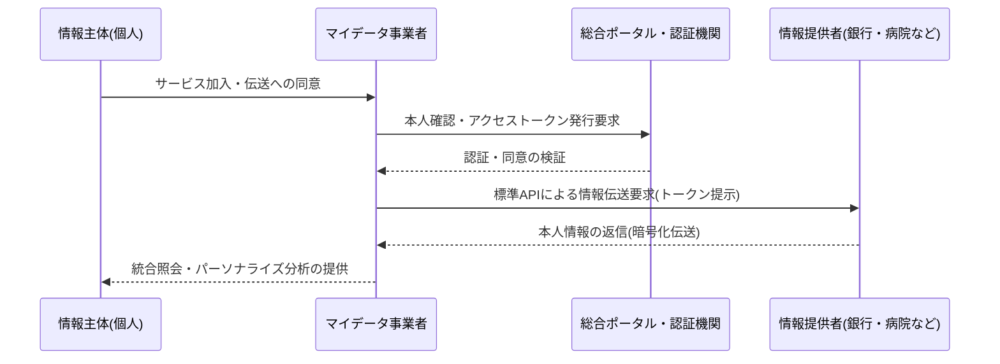

# データ3法とマイデータ

## 1. 概要

### A. 定義
> **データ3法**とは、韓国の個人情報保護法・情報通信網法・信用情報法を総称するものであり、個人情報保護を強化しつつも、**仮名情報の概念の導入などによってデータ活用の道を開いた**法改正(2020年施行)である。**マイデータ(MyData)**は、情報主体が複数の機関に散在する自らの個人情報を**直接管理し、望む先へ伝送を要求(伝送要求権)**して統合・活用できるようにする、**個人情報自己決定権**に基づくサービスである。

データ3法改正の中核的な趣旨は、「**保護と活用の均衡(Balance between Protection and Utilization)**」である。第4次産業革命の時代において、データは原油にたとえられるほど中核的な生産要素となったが、個人情報規制が過度に厳格であればデータに基づく産業が萎縮し、逆に規制が緩ければプライバシーが侵害されるというジレンマがあった。改正前の韓国では、個人情報を活用するには原則として情報主体の事前同意を得なければならなかったが(オプトイン)、ビッグデータ・AI学習のように大量のデータを結合・分析しなければならない産業では、この同意取得のコストが事実上活用を阻む障壁として作用していた。データ3法は、このジレンマを**仮名情報(Pseudonymized Data)**という制度的な仕組みによって解決した。個人を直接特定できないよう仮名処理した情報は、統計作成・科学的研究・公益的記録保存の目的に限り、情報主体の同意なしに活用できるよう開放する一方、特定の個人を再び識別する**再識別を厳格に禁止**し、違反時には課徴金・刑罰で制裁するという方式である。

同時に、分散していた個人情報の監督機関を**個人情報保護委員会(個人情報委)**に一元化し、規律体系の重複と死角を整理した。改正前は、個人情報保護法(行政安全部)・情報通信網法(放送通信委員会)・信用情報法(金融委員会)が類似の事案をそれぞれ異なる基準で規律しており、規制対象者の混乱が大きかったが、これを1つの独立監督機関に集約したのである。マイデータは、まさにこの整備された基盤の上で機能する。複数の機関に断片化した「自分の情報」を、自ら指定した事業者に集め、資産の統合照会・パーソナライズされた金融商品の推奨・健康管理といった個人化サービスを受けられるようにする、**データ主権(Data Sovereignty)**の具体的な実現がマイデータである。

### B. 改正の背景と必要性
データ3法の改正は、3つの相反し重なり合う要求がかみ合った結果である。第一は**データ経済の活性化**の要求であり、EUが2018年にGDPRとともにデータポータビリティ権を制度化してデータ産業の基盤を整えたことから、韓国も国際的な整合性と産業競争力のために活用の根拠が必要となった。第二は**プライバシー保護の強化**の要求であり、データの結合が増えるほど再識別・流出のリスクが高まるため、活用を開く分だけ安全装置も強化しなければならなかった。第三は、前述した**監督機関の分散の解消**である。これら3つの要求を1つの改正パッケージにまとめ、「同意なき活用の道(仮名情報)」と「再識別の禁止・監督の一元化(保護)」を引き換えにする均衡点を制度化したことが、データ3法の本質である。

## 2. データ3法の構造と主要な改正内容

### A. 全体構造
次の全体構造図は、データ3法が3つの法律をどのように包括し、仮名情報と監督の一元化という2つの軸に帰結するかを示している。

この図の核心は、3つの法律がそれぞれ異なる領域(一般の個人情報・オンライン・信用情報)を扱いながらも、最終的には「保護と活用の均衡」という1つの目標に収斂するという点である。情報通信網法の個人情報条項が個人情報保護法に移管されて重複が解消され、信用情報法が金融マイデータの法的根拠を整備したことで、散在していた規律が整合性を備えるようになった。

### B. 法律別の主要な改正内容
次の表は3つの法律の改正の要旨をまとめた補助資料であり、各項目の背景は前後の本文で説明する。

| 法 | 主要な改正内容 |
|---|---|
| **個人情報保護法** | 仮名情報の概念導入(統計・研究・公益目的で同意なしに活用)、個人情報保護委員会への監督の一元化、再識別の禁止・処罰の新設 |
| **情報通信網法** | 個人情報関連規定を個人情報保護法へ移管(規律の重複解消)、オンライン個人情報の特例を統合 |
| **信用情報法** | 金融マイデータ(本人信用情報管理業)の根拠整備、仮名情報・データ結合の活用を許容、情報伝送要求権の導入 |

改正の実務上の重心は、**仮名情報の活用の許容**と**データ結合の制度化**にある。異なる機関が保有する仮名情報を結合するには、任意に結合することはできず、国が指定した**データ専門機関(結合専門機関)**を経て安全に結合した後、再識別リスクの検証を受けなければならない。例えば、医療機関の診療データと保険会社の請求データを結合して疾病予測モデルを作る研究が、この手続きによって合法的に可能となった。このように「誰でも自由に」ではなく「指定された機関を通じて統制された条件の下で」という安全弁を設け、活用を開きつつ誤用・濫用を防ぐ構造をとったことが、改正の特徴である。

### C. 個人情報の3分類
データ3法以降、個人情報は処理可能な範囲に応じて3段階に区分される。この分類を理解することが、仮名情報制度の核心である。

| 区分 | 識別可能性 | 活用 |
|---|---|---|
| **個人情報** | 直接識別可能 | 原則として同意が必要 |
| **仮名情報** | 追加情報と結合した場合にのみ識別 | 統計・研究・公益目的で同意なしに活用(再識別禁止) |
| **匿名情報** | 復元不可(識別不可能) | 個人情報ではなく、自由に活用 |

仮名情報が「同意なき活用」と「完全な保護」の間の折衷領域であるという点が重要である。匿名情報は自由に使えるが、復元が不可能であるため分析価値が大きく低下し、元の個人情報は活用に同意が必要であるためコストが大きい。仮名情報は、分析価値を相当程度維持しながらも再識別を禁止してリスクを統制する、活用と保護の接点に位置する制度的な発明である。

## 3. マイデータの概念と動作構造

### A. 伝送要求権とデータフロー
マイデータの法的な心臓部は**伝送要求権(情報伝送要求権)**である。情報主体が、特定の機関(情報提供者)に保管されている自らの情報を別の機関(マイデータ事業者)へ送るよう要求できる権利であり、GDPRの「データポータビリティ権(Right to Data Portability)」に対応する。次の詳細アーキテクチャ図は、マイデータの実際のデータフローを示している。

このフローの核心は、「個人が自らの情報の移動を指示し、その移動が標準API・認証・暗号化によって安全に媒介される」という点である。情報提供者は、個人の同意と有効なアクセストークンが確認された場合にのみ情報を返信し、同意は目的・項目・期間が特定されていなければならず、いつでも撤回できる。すなわちマイデータは単なるデータのコピーではなく、**情報主体の統制権を手続き的に保障した伝送体系**である。

### B. 産業別の提供情報
マイデータは、産業ごとに提供情報の範囲と施行時期が異なる。金融分野が2022年1月の全面施行で最も先行し、医療・公共分野へと拡大しつつある。

| 産業 | 主な提供情報 | 活用例 |
|---|---|---|
| **金融** | 口座・カード・ローン・投資・保険の履歴 | 複数金融機関の資産統合照会、パーソナライズされたローン・商品推奨 |
| **医療** | 診療・処方・健康診断・投薬の記録 | 個人健康管理(PHR)、慢性疾患管理 |
| **公共** | 税金・福祉・資格・行政情報 | 福祉受給資格の自動案内、行政書類の簡素化 |
| **通信・流通** | 通信利用・消費・サブスクリプションの履歴 | 料金プランの最適化、消費パターンに基づく推奨 |

金融マイデータが先導した理由は、信用情報法が**本人信用情報管理業**という許可業種と標準API体系を先行して制度化したからである。複数の銀行・カード会社に散在する資産を1つのアプリで統合照会し、純資産・消費を分析するサービスが代表例であり、施行後に数千万人規模の加入者が形成され、個人化金融の標準として定着した。一方、医療マイデータ(例:「健康情報ハイウェイ」)は、データ標準化と機微情報保護の要件が厳しいため拡大速度が相対的に緩やかであるが、これは産業ごとのデータ特性と規制水準の違いが施行の順序に反映された結果である。

## 4. 国内外の比較と示唆点

マイデータの思想的な源流は、欧州・フィンランドのMyData運動とGDPRのデータポータビリティ権である。ただし、GDPRのポータビリティ権が、個人が自らのデータを「ダウンロードしたり移したりできる」という権利宣言に近いのに対し、韓国のマイデータは信用情報法を通じて**標準API・許可事業者・課金体系まで備えた産業型モデル**として具体化した点が差別的である。この違いが生じた理由は、韓国が権利保障に加えて「機能する市場」を作るために、情報提供者と事業者の間の標準伝送規格と費用精算の構造を制度として強制したからである。その結果、サービスの普及は速かったが、情報提供者のAPI構築の負担とデータ提供の対価をめぐる利害調整という実務上の課題も同時に抱えることになった。

## 5. 深掘り — マイデータ2.0と全分野への拡大

最近の政策の流れは、金融に限定されていたマイデータを全産業へ広げる方向である。2023年改正の個人情報保護法に**個人情報伝送要求権**が一般規定として導入されたことで、金融だけでなく医療・公共・通信などあらゆる分野にマイデータを適用する法的土台が整えられた(施行令・標準化は後続で推進中)。いわゆる「マイデータ2.0」は、① 情報提供範囲の拡大、② 情報主体の統制権の強化(伝送履歴・撤回の実効性の向上)、③ データ標準化・相互運用性の拡大、④ マイデータ事業者の兼業・結合サービスの拡大を志向している。

ただし、全分野への拡大には明確な解決課題もある。分野ごとにデータの形式・意味が異なるため**標準化(オントロジー・API規格)**が先決であり、医療・通信のような機微情報は流出時の被害が大きいため**強化されたセキュリティ・同意管理**が必要である。また、少数の大手プラットフォームがデータを寡占すれば、かえってデータ主権が形骸化しうるため、**情報主体中心性**を制度的に守ることが鍵となる。この点は、情報管理技術士の観点から、「技術標準化・セキュリティアーキテクチャ・ガバナンス」がどのように有機的にかみ合うべきかを示す好例である。

## 6. 考慮事項および示唆点

1. **標準化と安全な伝送インフラが活性化の前提**である。機関ごとに異なるデータをAPIで標準化し、認証・暗号化・アクセストークンに基づく安全な伝送規格を備えてはじめて、マイデータは実際に機能する。標準がなければ、各機関が独自の方式でデータを提供することになり、相互運用性が崩れて普及が停滞する。

2. **セキュリティ・プライバシーが信頼の基盤**である。散在する情報を一か所に集めるほど、流出・再識別時の被害が集中するため、最小収集・強力な認証(MFA)・伝送時および保存時の暗号化・同意撤回の実効的な保障が必須である。マイデータの便益は、「安全であるという信頼」の上にのみ成立する。

3. **仮名情報の再識別リスク管理とガバナンス**を並行しなければならない。データ結合・仮名処理が増えるほど、結合データからの再識別可能性を常時点検しなければならず、データ専門機関を通じた結合の統制・再識別禁止の遵守・定期的なリスク評価が、誤用・濫用を防ぐ制度的な安全弁として機能しなければならない。

4. **情報主体中心のデータ主権の実現**へと進まなければならない。技術と制度が最終的に目指すのは、個人が自らのデータの主人となってその価値を取り戻すことであるため、少数プラットフォームによるデータ寡占を牽制し、伝送履歴・統制権を個人が実質的に行使できる設計が求められる。

5. **国際的な整合性とデータの国境問題**を考慮しなければならない。GDPRなどのグローバル規制との整合性、国境を越えたデータ移転(十分性認定)の問題はデータ産業の国際競争力に直結するため、マイデータ・仮名情報制度を設計・運用する際には、国際標準・相互認証体系との連携を併せて考慮したガバナンスが必要である。

## 参考資料
- 韓国個人情報保護委員会、「個人情報保護法および仮名情報処理ガイドライン」
- 韓国金融委員会・金融保安院、「金融分野マイデータ標準API規格」
- EU, "General Data Protection Regulation (GDPR)", Art. 20 Right to data portability

---

> **一言まとめ**: データ3法は*仮名情報の導入と監督の一元化によって保護と活用の均衡*を制度化した改正であり、マイデータは*伝送要求権によって散在する本人情報を標準API・認証・暗号化で統合・活用*するデータ主権サービスであって、標準化・セキュリティ・再識別管理・情報主体中心性が活性化の前提である。
