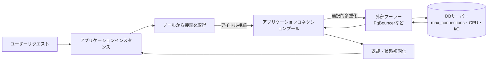
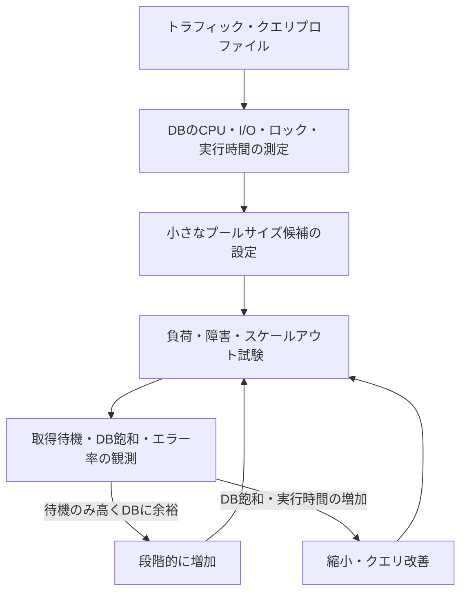

# データベースコネクションプール(Connection Pool)の設計とチューニング

## 1. 概要

> **データベースコネクションプール(Connection Pool)**とは、アプリケーションがデータベース接続を要求するたびに新しい接続を作成する代わりに、事前に生成した接続や使用後に返却された接続を、制限された集合として再利用するリソース管理手法である。

アプリケーションとデータベースの間の接続は、単なるソケット1本ではない。DNS照会、TCP接続、TLSネゴシエーション、ユーザー認証、セッション初期化、ドライバ・サーバーのプロトコルネゴシエーションが順に実行される。短いSQLを1件実行するためにこの手順を毎回繰り返すと、クエリそのものよりも接続確立のコストの方が大きくなりうる。プールはこのコストをリクエスト経路から切り離し、すでに認証済みの接続を貸し出しては返却させることで、平均遅延と接続の殺到を減らす。

しかし、プールは接続を無限に提供する装置ではない。プールの接続数は、データベースのCPU・メモリ・ディスク・ロック処理能力と併せて決定しなければならない。プールを大きくすると待ち行列は短く見えるが、データベースで同時に実行される処理が増えるため、コンテキストスイッチ、バッファ競合、ロック競合、キャッシュヒット率の低下が現れうる。逆に小さくしすぎると、アプリケーションスレッドがプールを待つため、ユーザーはタイムアウトを経験する。

したがって技術士の答案では、コネクションプールを単なるフレームワークのオプションとして説明するのではなく、**需要を有限なDBリソースへ安全に受け入れる制御面**として解釈しなければならない。サイズ算定、待機・タイムアウト、接続検証、返却時の状態初期化、フェイルオーバー、可観測性、セキュリティまでを1つの運用設計としてまとめることが核心である。

コネクションプールの目標は、次の4つに整理される。第一に、接続確立のコストを償却する。第二に、データベースの同時実行量に上限を設ける。第三に、ピークトラフィックを短い待ち行列で吸収しつつ、無限待機は遮断する。第四に、障害・リーク・セッション状態の汚染がサービス全体に波及しないようにする。

## 2. 動作原理と全体構造

コネクションプールは、アプリケーションプロセスの内部に置かれることもあれば、複数インスタンスの前段にある外部プーラーとして分離されることもある。アプリケーションプールはリクエストスレッドと実際のDB接続を分離して迅速に再利用し、外部プーラーは多数のクライアント接続をより少ないサーバー接続に多重化する。2つの層を併用する場合は、各層の上限を掛け算で捉えるのではなく、全体の接続予算として計算しなければならない。

リクエストが到着すると、アプリケーションはまずプールからアイドル接続を探す。アイドル接続があれば即座に貸し出し、なければプールの最大サイズに達しているかを確認する。まだ拡張の余地があれば新しい接続を作り、上限に達していれば待ち行列に入る。待機時間には必ず`connectionTimeout`のような制限を設けなければならず、制限を超えた場合は失敗を返し、上位層のリトライ・代替経路が作動するようにしなければならない。

接続を借りた後は、トランザクションを開始してSQLを実行し、コミットまたはロールバックを行う。アプリケーションが接続オブジェクトを「閉じる」という表現を使っていても、実際には物理接続を終了せず、プールに返却する場合が多い。したがって`close()`の呼び出しが漏れると、物理接続が生き続けるというよりも、プールから見て貸出中の接続として残り続け、プールの枯渇が発生する。

返却の過程は、単なるキューへの挿入ではない。トランザクションの終了、自動コミットモードの復元、セッション変数の初期化、ロールバック有無の確認、警告・エラー状態の破棄、プリペアドステートメントの整理、ユーザー・テナントコンテキストの除去が必要である。状態の初期化が漏れると、次のリクエストが前のリクエストの権限や分離レベルを引き継ぐ、セッション汚染の問題が発生する。

## 3. 構成要素とライフサイクル

### A. プールマネージャと接続状態

プールマネージャは、接続オブジェクトを生成・貸出・検証・返却・破棄するステートマシンである。一般に接続は、`生成中`、`アイドル`、`貸出中`、`検証中`、`破棄予定`の状態を経る。状態を明示的に管理すれば、障害の発生した接続をアイドルリストに戻したり、すでに返却された接続を二重に返却したりするエラーを減らすことができる。

アイドル接続は、すぐに使用できる正常な接続である。貸出中の接続は1つのリクエストまたはトランザクションが所有し、最大貸出時間を監視しなければならない。生成中の接続が失敗した場合は、そのリクエストのみを失敗させ、プール全体がロックされないよう、失敗回数とリトライ間隔を制御する。破棄予定の接続は、使用中のリクエストが終了した後に再利用せず閉じる。

プールの最小アイドル数と最大サイズは、異なる意味を持つ。最小アイドル数を大きくすると、ピーク直前の接続生成の遅延を減らせるが、平常時もDB接続とメモリを占有する。最大サイズは同時にDBへ接続できる上限であるため、データベースのリソース予算と直接結びつく。HikariCPの公式ドキュメントも、一般に固定サイズのプールを優先的に検討すべきであり、接続数を大きく取ることが性能を保証するわけではないと説明している。

### B. 貸出・返却とタイムアウト

`connectionTimeout`は、プールが接続を貸し出すために待機する最大時間である。この値は、SQL実行のタイムアウトと区別しなければならない。接続を取得した後に遅いクエリが実行され続けるとプールは枯渇するため、クエリタイムアウト・トランザクションタイムアウト・貸出タイムアウトを階層的に設計する。

待ち行列が無限に伸びると、ユーザーリクエスト、スレッド、メッセージコンシューマがすべて拘束される連鎖障害となる。したがって、待ち行列の長さと最大待機時間を制限し、超過時には即時失敗(fail fast)や優先度別の拒否を選択する。リトライは、指数バックオフとジッターを適用しなければ、同時にリトライするリクエストが再びプールを圧迫する。

返却時に例外が発生した接続は、正常なアイドル接続とはみなさない。ネットワーク断、プロトコルエラー、トランザクションのロールバック失敗、セッションリセットの失敗が確認された場合は破棄し、新しい接続を非同期で補充する。リクエストの成功だけを見て接続を再利用すると、潜在するエラーが次のリクエストへ伝播する。

### C. 接続検証とライフタイム管理

アイドル時間の長い接続は、ファイアウォール・ロードバランサー・DBのidle timeoutによって、すでに切断されている可能性がある。検証方法には、貸出時のpingまたは検証クエリ、定期的なkeepalive、ドライバによるソケット例外の検知がある。毎回検証すれば安全であるが、往復のコストが生じるため、最終使用時刻とネットワーク特性を反映してポリシーを定める。

`maxLifetime`は、接続を永遠に再利用しないようにするための上限である。DBやプロキシが先に接続を切断する直前にプールが入れ替えれば、リクエストの中断を減らせる。複数のインスタンスが同時刻に接続を破棄すると再接続の嵐が発生しうるため、実際の実装では期限切れの時点に小さなばらつきを持たせるのが有利である。

接続リークとは、貸し出された後に返却されない状態を指す。リーク検知の閾値は正常な長時間トランザクションよりも短く設定しつつ、単なる警告を障害と誤認しないよう、コールスタック・リクエストID・トランザクションIDを併せて記録する。リーク防止には、コードの`try-finally`または言語ごとの自動リソース管理と、運用指標を併用しなければならない。

## 4. プールサイズの算定とキャパシティ計画

プールサイズは、ユーザー数やアプリケーションスレッド数をそのまま写して決める値ではない。まずDBが実際に同時処理できるCPU・I/O作業数を測定し、クエリの平均・パーセンタイル実行時間と目標スループットを用いて出発点を作る。待ち行列理論の観点では、スループットはおおむね同時実行量をサービス時間で割った値に制約されるため、接続を追加してもDBのサービス時間が悪化すれば、全体のスループットはかえって低下する。

実務でよく言及される`(CPUコア数 × 2) + 有効ディスク数`という式は出発点にすぎず、普遍的な法則ではない。SSD、キャッシュヒット率、クエリの種類、レプリケーション構成、CPUのオーバープロビジョニング、コンテナの制限によって最適点は異なる。HikariCPのプールサイズに関する案内は、フロントエンドのユーザー数よりも、DBが同時に処理できる作業量を中心に小さく始めるべきであると強調している。

複数インスタンスの環境では、総接続量を次のように計算する。

`総接続上限 = インスタンス数 × インスタンスごとの最大プールサイズ + バッチ・管理・レプリケーション接続`

例えば、12個のPodがそれぞれ最大20個の接続を開くと、アプリケーションだけで240個になる。DBの`max_connections`が300であっても、管理者・モニタリング・レプリケーション・マイグレーション用の接続の余裕がないため安全ではない。オートスケーリングでPod数が2倍になった瞬間に接続数も2倍になるという点も、キャパシティ計画に反映しなければならない。

プールサイズの調整は段階的に行わなければならない。まず最大プールを小さく設定し、取得待機時間、DBのCPU、ディスク待機、ロック待機、リクエスト遅延のp95・p99を測定する。DBに余裕があり待機時間だけが高いのであれば少し増やせるが、DBの実行時間も同時に増加するのであれば、接続数がボトルネックなのではなく、クエリ・インデックス・ストレージがボトルネックである可能性が高い。

小さなプールは悪い設定ではない。同時実行を制限してDBが安定して処理できるようにし、過度な競合を待ち行列で吸収するバックプレッシャーとなりうる。ただし、1つのプールをすべての業務が共有すると、長いバッチクエリがオンラインリクエスト用の接続を独占しうるため、業務の重要度に応じてプールを分離するか、読み取り・書き込み・バッチのリソースを隔離する。

## 5. トランザクション・セッション状態と一貫性

プール再利用における最大の論理的リスクは、物理接続が維持されている間はセッション状態も維持されるという点である。`SET search_path`、タイムゾーン、分離レベル、ロール、一時テーブル、サーバーサイドのprepared statement、advisory lockは、リクエストが終了しても残りうる。したがってアプリケーションはセッション状態を明示的に初期化し、テナント識別子や権限をセッション変数に格納する場合には、特に厳格な返却ポリシーを適用する。

トランザクション境界は、接続境界と同じではない。接続をプールに返却する前に必ずコミットまたはロールバックが完了していなければならず、例外経路でもロールバックしなければならない。未完了のトランザクションを持つ接続を再利用すると、次のリクエストが前のリクエストのロックとスナップショットを引き継ぎ、データ汚染や長時間の待機を引き起こす。

読み取り専用レプリカを使用する場合も、プールごとに接続先とフェイルオーバーポリシーを区別しなければならない。書き込みプールは現在のリーダーを向き、読み取りプールはレプリケーション遅延を監視し、フェイルオーバー後は既存の接続を迅速に破棄しなければならない。単にDNSを変更するだけでは、すでに確立されたソケットやプール内部のオブジェクトは、即座に新しいリーダーへ移行しない。

外部プーラーのトランザクションプーリングは、トランザクションの間で接続を再配置するため、セッションベースの機能の意味が変わる。セッション変数、セッションレベルのadvisory lock、一部の一時テーブルやprepared statementを使用している場合は、まず互換性を検証しなければならない。これは機能を諦めて接続効率を得る選択であるため、運用中にモードだけを変更するのは危険である。

## 6. アプリケーションプールと外部プーラーの比較

アプリケーションプールはリクエストのコードに近いため、貸出・返却・トランザクション・メトリクスを自然に結び付けることができる。しかし、インスタンスごとに独立して存在するため、サービスインスタンスが増えるとDB接続も線形に増加する。一方、外部プーラーは複数インスタンスのクライアント接続を中央で多重化し、DBの実際の接続数を減らすが、ネットワークホップと別の運用上の障害点を追加する。

| 区分 | アプリケーション内プール | 外部プーラー |
|---|---|---|
| 位置 | 各プロセス・Podの内部 | アプリケーションとDBの間 | 
| 長所 | 遅延が低く、コード・トランザクションとの連携が容易 | 多数インスタンスの接続を中央で制限 | 
| 限界 | インスタンス増加時に接続数が掛け算で増加 | セッション機能の互換性と運用の複雑さ | 
| 障害の影響 | 当該インスタンスが中心 | 構成によっては複数サービスに同時に影響 | 
| 適用 | 一般的なサービス・少数インスタンス | サーバーレス・大規模Pod・接続の殺到 | 

この違いを単純に性能の優劣として捉えてはならない。アプリケーションプールはすでに存在する接続を迅速に再利用してローカル経路を最適化し、外部プーラーは接続数のグローバルな上限を提供する。大規模環境では両者を階層化できるが、アプリケーションプールのサイズを外部プーラーのサイズより無条件に大きく取れば、ボトルネックを外部の待ち行列へ移すだけである。

例えば、サーバーレス関数が短時間で数百個にスケールすると、各関数がDBに直接接続する構造は接続の嵐を引き起こす。このとき外部プーラーがクライアント接続を受け付け、DBサーバーへの接続を制限すれば、DBの接続リソースを保護できる。その代わり、トランザクションプーリングとセッション機能の互換性、プーラー自体の高可用性、TLS区間、障害時の再接続ポリシーを併せて検討しなければならない。

## 7. 可観測性・障害対応・セキュリティ

コネクションプールの中核指標は、単なる現在の接続数ではない。最大プールサイズ、アクティブ接続、アイドル接続、待機中のリクエスト数、接続取得時間、タイムアウト数、生成・破棄数、リーク疑い数、接続検証の失敗数を、リクエスト遅延と併せて収集しなければならない。外部プーラーを使用する場合は、クライアント側の待機とサーバー接続の待機を区別し、どの層がボトルネックであるかを示さなければならない。

次のような症状は、原因ごとに切り分ける。アクティブ接続が最大値で取得待機が増加している場合は、クエリ遅延・トランザクションの長期化・プールサイズ不足を併せて確認する。アクティブ接続は少ないのに待機が多い場合は、プールマネージャのロック、接続生成の失敗、誤った状態追跡を疑う。DBのCPUが飽和して実行時間が伸びている場合は、プールの拡張は禁物であり、まずクエリとインデックスを点検する。

障害時には、リトライの嵐を防ぐことが最優先である。DBが復旧中のときにすべてのリクエストが即座に再接続すると、接続生成と認証が障害を拡大させる。指数バックオフ、ジッター、サーキットブレーカー、レディネスチェック、読み取り専用の代替経路を組み合わせ、管理者接続用の予約接続を残しておかなければならない。復旧後もプールを一度に満たすのではなく、段階的にウォームアップするのが安全である。

セキュリティの面では、認証情報をコードやログに残さず、シークレット管理システムから注入する。TLS検証、最小権限アカウント、テナントごとの権限境界、接続文字列の露出防止、アイドル接続の暗号化状態を点検する。コネクションプールは認証を再利用するため、認証情報のローテーション時に既存の接続をいつ破棄するかを明確に定めなければならない。

## 8. 比較・事例と想定される障害シナリオ

### A. プールの枯渇と接続リーク

オンライン注文サービスが、リクエストごとに接続を借りた後、例外経路で返却していないと仮定しよう。正常なリクエストでは問題が表面化しないが、決済失敗が増える日には貸出中の接続が累積する。最終的に、DBが生きていても、新しいリクエストはプール待機のタイムアウトで失敗する。

対応策は、`finally`に基づく返却、トランザクションの自動ロールバック、リーク検知ログ、貸出時間のダッシュボード、負荷試験での例外経路の検証を併せて適用することである。最大プールを大きくしても症状を遅らせるだけで、リークは解決しない。長時間の貸出のコールスタックを確保し、実際のコード修正へとつなげなければならない。

### B. オートスケーリングに伴う接続の急増

Podが10個でプール上限が20であれば、正常時の最大接続数は200個である。障害によってCPU使用率ベースのオートスケーラーが40個のPodまで増やすと、DB接続は800個になりうる。DBが接続を受け入れたとしても、ジョブスケジューリングとメモリ競合により、実際のスループットは低下しうる。

この場合は、インスタンスごとのプール上限を下げ、全体の接続予算をオートスケーリングポリシーに反映する。必要であれば外部プーラーを置いてDBサーバーへの接続数を固定し、アプリケーションのクライアント側待機とDBサーバー側待機を別々にモニタリングする。スケールアウトがすなわちDBのスループット向上につながるという仮定を、負荷試験で検証しなければならない。

### C. フェイルオーバー後の古い接続

リーダーDBが障害によって入れ替わったにもかかわらず、アプリケーションプールが既存のTCP接続を保持し続けると、新しいリクエストが古いソケットに渡される。接続エラーが発生した後もすぐにリトライすると、新しいリーダーが接続の殺到を受けうる。

解決策は、障害シグナルを検知した接続の即時破棄、論理エンドポイントの使用、再接続のバックオフ、トランザクションの安全なリトライ、重複実行の防止である。すでにコミットされたかどうか分からないリクエストは無条件に再実行せず、冪等キーと結果照会を用いて二重注文を防止する。

## 9. 深掘り: クラウド・コンテナ環境における設計の方向性

コンテナ環境ではCPU limitと実際のノードCPUが異なりうるため、プールサイズの公式に物理サーバー全体のコア数を入れると過大に算定されうる。サービスごとのCPU quota、実際のクエリの種類、DBの共有リソース、Pod数の変化を併せて用いなければならない。特に短寿命のジョブが多いサーバーレスでは、接続を長く維持する従来型のプールと外部プーラーの役割を分離する。

クラウドのマネージドDBでは、`max_connections`を直接大きく引き上げるよりも、プロキシやプーラー、読み取りレプリカ、ワークロード別エンドポイントを提供する場合が多い。接続数を増やすことがコストと性能の両面で有利か、プロキシによる追加のホップと障害ドメインが許容されるかを評価する。運用者は接続数だけでなく、接続あたりのメモリやログ・監査のコストも予算に組み込まなければならない。

可観測性では、アプリケーションメトリクスとDBメトリクスの相関関係を見なければならない。プールの取得遅延が増加する時点で、DBのlock waitが増加しているか、クエリのp99が増加しているか、Pod数が変化したかを追跡する。OpenTelemetryのようなトレーシング体系で`pool.acquire`、`db.query`、`pool.release`の区間を区別すれば、アプリケーション側の待機とDBの実行時間を切り分けることができる。

最近の実務の方向性は、無条件に大きなプールよりも、**小さな固定プール、明示的なタイムアウト、層ごとのバックプレッシャー、ワークロードの隔離、水平スケール前の接続予算の検証**を重視する方向である。これは、接続数が性能の原因ではなく、DBにおける作業競合の結果であるという認識に基づいている。

## 10. 考慮事項および示唆点

1. **キャパシティ計画の基準を、ユーザー数からDBの処理能力へ転換しなければならない。** ユーザーが多いという理由だけで接続を増やすと、DB内部の競合が大きくなりうる。負荷試験でCPU・I/O・ロック・実行時間の変化を確認し、小さな値から段階的に調整する。

2. **タイムアウトを階層化しなければならない。** プール取得タイムアウト、SQL実行タイムアウト、トランザクションタイムアウト、HTTPリクエストタイムアウトの順序を設計し、ある層が次の層を永遠に占有しないようにする。タイムアウトを延ばすだけの方式は、障害を隠すにすぎない。

3. **接続の論理状態を物理的なライフサイクルと併せて管理しなければならない。** 返却前のロールバックとセッション初期化を保証し、テナント権限・セッション変数・一時オブジェクトが次のリクエストに残らないかをテストする。これはデータ分離と個人情報保護の問題にもつながる項目である。

4. **オートスケーリングと接続予算を1つのポリシーとしてまとめなければならない。** Pod数が増えると総接続上限も増えるという事実を反映し、予約接続と管理接続を除いた実際の利用可能量を計算する。必要であれば、外部プーラーでDB側の上限を固定する。

5. **フェイルオーバーはDNSの変更だけでは完了しない。** 既存ソケットの破棄、プールの再充填速度、リトライのバックオフ、重複実行の防止、予約された管理者接続を含む障害シナリオをリハーサルしなければならない。RTOは、DBの昇格時間とアプリケーションの再接続時間を合算した結果である。

6. **業務ごとにプールを隔離することが可用性を高める。** バッチとオンライントランザクションが同じプールを共有すると、長い処理が中核リクエストを飢餓状態に陥らせうる。読み取り・書き込み・バッチ・管理のプールを分離し、それぞれの優先度と上限を設定する。

7. **標準設定値よりも観測可能な根拠が重要である。** フレームワークのデフォルト値をそのまま適用せず、取得待機、アクティブ・アイドル比率、リーク、生成失敗、DB飽和、p95・p99を基準に変更する。変更前後の負荷と障害の結果を記録し、設定の再現性を確保する。

8. **技術士の観点では、コネクションプールをバックプレッシャー・レジリエンス・セキュリティの交差点として答案化できる。** 単なる再利用効果にとどまらず、リソース上限、障害の隔離、セッション状態、可観測性、コストと運用組織までを結び付ければ、システム全体の設計判断を提示できる。

## 参考資料

- HikariCP公式リポジトリおよび設定ドキュメント: https://github.com/brettwooldridge/HikariCP
- HikariCP公式のプールサイズに関する案内: https://github.com/brettwooldridge/HikariCP/wiki/About-Pool-Sizing
- PgBouncer公式利用マニュアル: https://www.pgbouncer.org/usage.html
- PgBouncer公式の機能およびプーリングモード: https://www.pgbouncer.org/features.html
- PostgreSQL公式の接続設定ドキュメント: https://www.postgresql.org/docs/current/runtime-config-connection.html

---

> **一言まとめ**: コネクションプールは接続を多く作る技術ではなく、DBが処理しうる同時実行性を測定し、待機・タイムアウト・状態初期化・フェイルオーバーまでを統制するリソース管理装置である。
