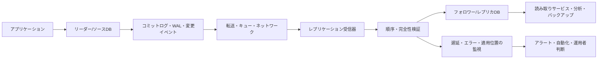
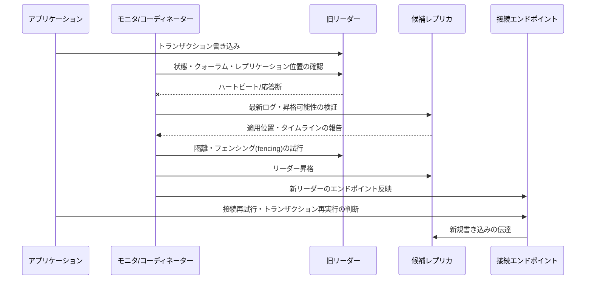

# データベースレプリケーション(Replication)と高可用性設計

## 1. 概要

> **定義**: データベースレプリケーション(Replication)とは、一つの論理的なデータ変更を別のデータベースインスタンスへ伝達・再生し、複数の複製を維持する技術であり、高可用性(High Availability)とは、障害が発生しても合意された時間とデータ損失の限度内でサービスを継続提供する運用目標である。

オンラインサービスが単一のデータベースに依存すると、サーバ故障、ストレージ破損、ネットワーク断、運用者のミス、過負荷がそのまま業務停止につながる。レプリケーションはデータを複数の場所に置くことで障害ドメインを分離し、読み取り負荷を分散する手段であるが、レプリケーションを構成しただけで自動的に高可用性が達成されるわけではない。レプリケーション遅延、障害検知、リーダー選出、接続切替、データ整合性、バックアップと復旧の検証を併せて設計しなければならない。

技術士の答案では、「プライマリサーバとスタンバイサーバを置く」という羅列を超えて、どの障害をどの時間内に検知し、どの時点のデータをどの程度まで保全するのかをまず定義する必要がある。例えば金融元帳の目標がRPO 0に近ければ同期レプリケーションが適している場合があるが、広域ネットワークを挟んだ同期レプリケーションは遅延と可用性の間に代償を生む。逆に非同期レプリケーションは性能と地理的分散には有利であるが、障害の瞬間に最後の変更分が失われる可能性がある。

レプリケーションの目的は大きく三つに区分される。第一に、障害時に代替インスタンスへ切り替える**可用性の確保**である。第二に、読み取り専用レプリカや分析用レプリカへ業務負荷を分離する**拡張性の確保**である。第三に、別リージョンに複製を維持して災害に備え、バックアップ・監査・データ活用を支援する**回復力と活用性の確保**である。同じ技術を用いても目的が異なればトポロジと一貫性ポリシーが変わる。

### 1.1 登場背景と必要性

データベースのCPUとメモリを増設する垂直スケーリングは迅速な初期対応であるが、ハードウェアの上限と単一障害点という限界がある。読み取り要求の多いサービスでは、書き込み主体を一つに保ちつつ複数のレプリカへ照会を振り分ける方式が費用対効果に優れる場合がある。ただし、アプリケーションが保存した直後のデータをすぐ読む必要がある場合には、読み取り一貫性を保証する経路が必要である。

サービスの可用性は、データベースプロセスが生きているかどうかだけでは判断しない。アプリケーションが正しいリーダーに接続されるか、トランザクションが重複実行されないか、DNS・コネクションプール・ロードバランサが切替を認識するか、監視とオンコール体制が復旧を完了できるかまで含む。したがってレプリケーションはデータ層の技術であると同時に、運用アーキテクチャと組織手順の問題でもある。

### 1.2 主要目標と評価指標

- **RPO(Recovery Point Objective)**: 障害時に許容されるデータ損失時点の範囲である。非同期レプリケーションの遅延が5秒であれば、最悪の場合直近5秒の変更が失われうるという意味であり、常に5秒が失われるという意味ではない。
- **RTO(Recovery Time Objective)**: 障害認知からサービス正常化までに許容される時間である。自動切替を用いても、接続再試行とキャッシュ無効化の時間を含めて測定しなければならない。
- **レプリケーション遅延(Replication Lag)**: ソースの変更がレプリカに反映されるまでにかかった時間、または未処理の変更量である。時間とログ位置のどちらを測定しているのかを明確にする必要がある。
- **可用性**: 計画・計画外の停止を含むサービス提供率である。レプリカ数よりも障害ドメインと実際の切替成功率の方が重要である。
- **整合性**: 一つの論理データに対して読み取りと書き込みが業務ルールに違反しない度合いである。すべての画面が強い一貫性を必要とするわけではないため、業務ごとのポリシーに分解する。

## 2. レプリケーションの原理と構成要素

### 2.1 論理的な流れ

レプリケーションは一般に、ソースデータベースで変更イベントを記録し、レプリケーション転送層がこれをレプリカへ伝達し、レプリカの適用プロセスが順序と完全性を確認した後に反映するという流れを持つ。実装方式によって、変更イベントはトランザクションログ、変更データキャプチャレコード、論理的な行変更、ドキュメントイベントなどとして表現される。

リーダーは書き込み順序を決定する基準点である。一つのトランザクションが複数のテーブルを変更する場合、レプリカは個々の行を任意の順序で反映してはならず、トランザクション境界とコミット順序を保持しなければならない。この特性が単純なファイルコピーとレプリケーションの違いを生む。

コミットログは障害復旧とレプリケーションの双方の基盤である。リーダーがコミット応答を返す前に、どの位置までレプリカが受信しなければならないかによって同期・非同期の意味が決まる。ログの保持期間が短いと、レプリカが一時停止した際に再同期が不可能となり全体コピーへ移行することがあるため、ディスクと保持ポリシーも容量計画に含める。

レプリケーション受信器はネットワークからイベントを読み取り、適用器はそれを実際のデータファイルやストレージエンジンに反映する。受信位置と適用位置を分離すれば、ネットワークは正常だがCPU・ロック・ディスクI/Oのために適用が遅れている状況を区別できる。運用者は「接続済み」という状態だけを見て正常と判断してはならない。

### 2.2 レプリケーショントポロジの類型

最も一般的な構造は、単一のリーダーと一つ以上のフォロワーを置く**primary-replica**方式である。書き込み競合が単純でリーダー選出手順を設計しやすいが、書き込みの拡張とリーダー障害時の切替が中心的な課題となる。フォロワーを読み取り専用として使う場合には、レプリケーション遅延を考慮してトラフィックルーティングを制御しなければならない。

マルチリーダー構造は複数のノードが書き込みを受け付けられるため、地域別の書き込み受け入れと遅延短縮に有利である。しかし同一キーを異なるリーダーで変更すると競合が発生するため、競合防止のキー設計、競合解決ルール、結果整合性におけるユーザー体験を明示しなければならない。「複数箇所で書き込める」という長所だけを見て適用すると、在庫・残高のように競合コストが大きいデータで問題が大きくなる。

チェーン型または階層型レプリケーションは、リーダーが複数のレプリカへ直接送信せず、中間レプリカが下位レプリカへ伝達する方式である。地域間回線や接続数を削減できるが、中間ノードがボトルネックあるいは追加の障害点となるため、切替時には系譜とログ位置を確認しなければならない。

| 類型 | 書き込み方式 | 長所 | 主なリスク | 適した状況 |
|---|---|---|---|---|
| 単一リーダー-フォロワー | リーダー中心 | 競合が少なく運用モデルが単純 | リーダー障害、レプリケーション遅延 | 一般的なOLTP、読み取り拡張 |
| 同期マルチレプリケーション | コミット前に多数確認 | 低いRPO、強い保護 | 遅延増加、ネットワーク断時の書き込み制限 | 損失コストが大きい基幹業務 |
| 非同期レプリケーション | リーダーのコミット後に伝達 | 低い書き込み遅延、広域分散 | 障害時に未伝達ログが消失 | 分析、災害復旧、読み取り拡張 |
| マルチリーダー | 複数ノードで書き込み | 地域での書き込み受け入れ、地域遅延の低減 | 競合と解決の複雑さ | 競合が限定された分散業務 |
| 階層型レプリケーション | 中間ノードによる中継 | 接続数・回線負担の低減 | 中間障害・遅延の伝播 | リージョン・拠点が多い環境 |

表の類型は製品名ではなく意思決定の軸として理解すべきである。例えば単一リーダー構造でも同期レプリカを置くことができ、非同期レプリカを災害復旧用に別途運用することもできる。したがって一つのシステムに一つのレプリケーションポリシーしか存在しないと断定せず、基幹元帳・照会モデル・分析ストアごとに要件を分離する。

### 2.3 同期レプリケーションと非同期レプリケーション

同期レプリケーションは、リーダーがコミットを確定する前に、指定されたレプリカが変更を受信し記録したという確認を要求する。この方式は、リーダーが突然失われても確認済みのレプリカで最新データを引き継げる可能性を高める。しかし往復のネットワーク遅延がすべての書き込み遅延に影響し、レプリカ障害を許容する設定がなければ、レプリカの問題によってリーダーの書き込みまで停止しうる。

非同期レプリケーションは、リーダーが自身のログ記録後に応答し、その後レプリカへ変更を伝達する。ユーザー応答性が良く長距離レプリケーションに適しているが、リーダー障害時にまだ送信されていないログが失われる可能性がある。「非同期=安全でない」というのは正確ではない。ログ保持、複数レプリカ、災害復旧、アプリケーションの再処理設計を組み合わせれば、業務上許容可能なRPOを達成できる。

準同期方式は、すべてのレプリカではなく、少なくとも一つの指定レプリカがログ受信を確認すればコミットを許容する折衷案である。ここでいう「受信」がメモリ到達なのかディスク永続化なのか、ネットワーク断時に何秒後に非同期へ移行するのかによって保護レベルが変わる。設計書には用語よりも、確認ポイントと障害時の動作を具体的に記述すべきである。

### 2.4 レプリカ読み取りと一貫性

リーダーに書き込みフォロワーから読む構造では、ユーザーが変更した直後の値を再照会したのに以前の値が見える現象が発生しうる。これをread-after-write不整合といい、決済完了画面・注文状態・権限変更のように即時性が求められるフローで特に問題となる。解決策としては、一定時間リーダー読み取りを強制する、セッションの読み取り位置にレプリカが追いつくまで待機する、変更直後の値をアプリケーションが保持する、などがある。

すべての照会をリーダーへ送れば一貫性は単純になるが、読み取り拡張の利点が失われる。逆にすべての照会をレプリカへ送ると、遅延や障害時のstale readが増加する。業務機能ごとに強い一貫性、セッション一貫性、結果整合性の許容範囲を分類し、ルーティングポリシーをコード・ミドルウェア・データアクセス層に一貫して反映しなければならない。

## 3. 高可用性の切替と障害処理

### 3.1 フェイルオーバー構造

高可用性では、正常経路より先に失敗経路を描くべきである。ヘルスチェッカーがリーダーのプロセス、ポート、トランザクション応答、レプリケーション状態を観察し、コーディネーターまたは合意グループが障害を判定した後、候補レプリカの昇格可否を決定する。その後、接続点が新リーダーを指し、アプリケーションのコネクションプールが再接続しなければならず、旧リーダーが復帰した際に再び書き込みを受け付けないよう隔離しなければならない。

障害検知は速ければ良いというものではない。ネットワークが一時的に切れただけでリーダーが生きている場合を障害と誤判定すると、二つのノードがそれぞれ書き込みを受け付けるsplit-brainが発生しうる。したがって単一モニタの判断よりも、クォーラム、リース(lease)、フェンシング装置、クラウドのインスタンス隔離など、相互排他性を確保する手段が必要である。

昇格対象は単に最も近いサーバではなく、データ損失と復旧可能性を総合して選択する。レプリケーションの適用位置が最新か、必要なログが保持されているか、アプリケーションが要求するスキーマバージョンと互換性があるか、他リージョンとのネットワークが正常かを確認しなければならない。自動昇格の基準と手動承認の基準を区別しておけば、緊急時にも統制可能な運用となる。

### 3.2 RPO・RTOとレプリケーション設計

RPOが0に近い業務では、コミット完了と同時に少なくとも一つの障害ドメインにデータが残っていなければならない。だからといってすべてのリージョンに同期レプリケーションを適用すると、広域遅延や断絶時の可用性低下が発生しうる。現実的な設計は、同一リージョン内の同期レプリケーションと別リージョンへの非同期レプリケーションを組み合わせ、災害時に許容するRPOを別途定義することである。

RTOはデータレプリケーションだけでは短縮されない。DNS TTL、サービスディスカバリ、コネクションプールの再試行バックオフ、トランザクションタイムアウト、キャッシュとメッセージコンシューマの再処理、運用者の承認時間がすべて合算された結果である。例えばデータベースの昇格が30秒以内に終わっても、アプリケーションが古いコネクションを2分間保持すれば実際のRTOは2分以上となる。

| 要件 | 設計上の選択 | 検証の問い |
|---|---|---|
| ほぼ無損失 | 同期または準同期レプリケーション、複数の障害ドメイン | 確認済みのコミットポイントはどこで、断絶時に書き込みはどうなるか? |
| 数秒の損失を許容 | 非同期レプリケーション、ログ保持、再処理 | 最大レプリケーション遅延と最悪のログ損失量をどう測定するか? |
| 数分以内の復旧 | 自動切替、固定接続点、短い再接続ポリシー | クライアントとコネクションプールはどれだけ速く新リーダーを見つけるか? |
| 地域災害への対応 | 他リージョンへのレプリケーション・バックアップ・復旧ランブック | リージョン全体の障害を想定した復旧リハーサルを実施したか? |

### 3.3 障害類型別の対応

プロセス障害は同じホストで再起動できるが、ストレージ破損の場合は当該ノードをレプリケーション集合から隔離して再同期しなければならない。ネットワーク分断は最も難しい。ノード同士が互いを見られなくても、クライアントがどちらに接続するかによって書き込み経路が変わりうるため、クォーラムとフェンシングによって書き込み権限を一つだけ残さなければならない。

レプリケーション遅延が増加した場合、直ちにレプリカを除外するよりも原因を分解する。ネットワーク帯域不足なのか、レプリカのディスク書き込み遅延なのか、大規模トランザクション・DDL・ロック競合なのか、インデックスやクエリパターンが異なるのかによって措置が変わる。遅延が閾値を超えたレプリカを読み取りトラフィックから除外するサーキットブレーカーを置けば、ユーザーに古い結果を提供するリスクを下げられる。

障害復旧後は旧リーダーをすぐに再投入しない。旧リーダーが切り離されている間にどのログを受け取ったか、タイムラインが新リーダーと一致しているか、データ完全性チェックを通過したかを確認した後にレプリカとして再接続する。この手順を省くと、旧リーダーが再び書き込みを受け付ける二重リーダー問題が再発しうる。

## 4. 設計および構築手順

### 4.1 業務要件とデータ分類

最初の段階はデータベース製品を選ぶことではなく、業務トランザクションを分類することである。注文・在庫・残高・権限のように損失や重複処理のコストが大きいデータは、強い保護と明確な切替ポリシーを必要とする。レコメンド・検索・統計のように多少の遅延を許容するデータは、非同期レプリケーションや別の分析パイプラインの方が効率的な場合がある。

データオブジェクトごとに、RPO、RTO、読み取り一貫性、地域性、保持期間、個人情報の所在制限を記録する。データベース全体を一つのポリシーで束ねると、重要でない照会のために基幹の書き込み性能が低下したり、基幹元帳に必要な保護レベルが一般ログデータによって希釈されたりしうる。

### 4.2 トポロジと障害ドメインの設計

サーバ2台を同じラックに置くだけでは、ラックの電源・スイッチ・ストレージ障害は防げない。少なくともホスト、アベイラビリティゾーン、リージョン、アカウントまたはプロジェクトの境界を障害ドメインとして分析し、レプリカをどこに配置するかを決定する。物理的に離れた場所は災害保護に有利であるが、ネットワーク遅延と規制・コストを併せて考慮しなければならない。

リーダーとレプリカの数は多ければ良いというものではない。レプリカが増えるとログ転送、監視、パッチ、バックアップ、セキュリティ権限、切替候補の検証といった運用コストが大きくなる。業務の読み取り量と障害許容レベルを根拠に最小構成を定め、容量増加とリージョン拡張のための増設手順を自動化する。

### 4.3 初期同期と再同期

新規レプリカは、基準時点のスナップショットを作成した後、それ以降のログを順に適用する方式で初期化できる。初期化中にリーダーへ負荷がかからないよう、バックアップ・スナップショット・専用のレプリケーションソースを活用し、データベースバージョン・拡張モジュール・エンコーディング・タイムゾーン設定が一致しているかを点検する。

レプリカが一時停止した場合は、保持中のログだけで追いつくことができる。ログが削除されていたりデータファイルが破損していたりする場合は、部分再同期ではなく全体の基準コピーを新たに作成しなければならない。再同期中のノードを読み取りトラフィックに使用すると、一部のテーブルやパーティションだけが最新の状態が露出しうるため、サービス状態を明確に表示する。

### 4.4 接続・ルーティング・再試行の設計

アプリケーションは特定のIPをリーダーとしてハードコーディングせず、論理エンドポイント、プロキシ、サービスディスカバリなど抽象化された接続点を使用すべきである。ただしエンドポイントが変わっても、既に確立されたTCP接続とコネクションプールは自動的には切り替わらないため、接続寿命、アイドル接続の検証、再接続時間、DNSキャッシュを併せて設定する。

再試行は万能ではない。コミット応答を受け取る前に接続が切れた場合、トランザクションが実際には反映されている可能性があり、無条件に再実行すると注文・決済の重複が発生する。リクエスト識別子と冪等キーを使用し、再試行可能なエラー・確認後に再試行すべきエラー・再試行禁止のエラーを区別する。

### 4.5 オブザーバビリティとアラート

必須指標は、レプリケーション接続状態、転送遅延、適用遅延、ログ保持の余裕、レプリカのディスク使用量、リーダー選出回数、切替成功率、読み取りルーティング比率、コネクションエラー率である。単一の値よりも傾向と相関関係を見ることが重要である。例えばCPUが低くてもディスクのfsync遅延が増加すれば、適用遅延が累積しうる。

アラートはレプリケーション遅延の閾値一つだけにせず、業務影響と結び付ける。基幹注文レプリカが10秒遅延したのか、分析レプリカが10分遅延したのかでは深刻度が異なりうる。アラートには現在のリーダー、候補、最終適用位置、予想RPO、担当ランブックへのリンクを含め、運用者がすぐに判断できるようにする。

### 4.6 テストと運用ランブック

本番の正常状態で障害を起こすよりも先に、再現可能なテスト環境で、リーダープロセスの終了、ネットワーク断、ディスクフル、レプリケーション遅延、誤った認証情報、時刻ずれ、リージョン接続断を検証する。テスト結果には検知時間、昇格時間、アプリケーションのエラー率、データ損失量、手動対応と自動対応を記録する。

ランブックには、障害判定、書き込み停止の可否、フェンシング、候補検証、昇格、エンドポイント切替、アプリケーション再接続、データ検証、旧リーダーの隔離解除、事後分析の順序を明記する。自動化が失敗した際に人が介入するポイントと承認者を定めておかなければ、緊急時に異なる判断が同時に実行されうる。

## 5. レプリケーション方式の比較と実務的判断

レプリケーションとバックアップは目的が異なる。レプリカはリーダーの削除・汚染・誤った更新も素早く追随しうるため、論理的エラーに対する保護手段ではない。バックアップは特定時点へ戻すことができる別の復旧経路であり、レプリケーションとバックアップを互いの代替とみなすと、ランサムウェアや運用者のミスに対して脆弱になる。

同期レプリケーションはデータ損失を減らすが、障害ドメイン間のネットワーク品質に依存する。非同期レプリケーションはサービス応答性と地域拡張に有利であるが、レプリケーション遅延をRPOとして管理しなければならない。マルチリーダーは地域のユーザーに近い書き込みポイントを提供できるが、競合解決の業務ルールをデータモデルに反映しなければならない。

| 比較軸 | 同期レプリケーション | 非同期レプリケーション | マルチリーダー |
|---|---|---|---|
| コミット遅延 | レプリケーション確認に応じて増加 | 相対的に低い | 地域ごとに低くなりうる |
| データ損失 | 確認済みポイント以降は低い | 遅延分の損失がありうる | 競合・順序の問題がありうる |
| ネットワーク断 | 書き込み停止またはポリシー切替 | 書き込み継続が可能 | 双方で書き込み後に競合の可能性 |
| 運用の複雑さ | 切替・クォーラム管理 | 遅延・RPO管理 | 競合・再調整の管理 |
| 代表的な判断 | 損失コストが遅延コストより大きい | 遅延コストが一部損失より大きい | 地域の自律性と競合ルールが明確 |

水平方向の読み取り拡張のためにレプリカを使う場合には、データが最新であるという前提を取り除かなければならない。商品一覧のように多少古い値が許容される照会と、決済直前の在庫のように最新性が重要な照会を同じルーティングポリシーで処理してはならない。アプリケーションに読み取り一貫性のヒントを渡すか、強い一貫性の経路と結果整合性の経路を明示的に分離する。

## 6. 産業・業務への適用事例

### 6.1 EC(電子商取引)の注文と在庫

注文生成はリーダーで処理し、注文履歴・商品照会は読み取りレプリカへ分散できる。しかし在庫引当は競合トランザクションに直結するため、レプリカの古い在庫値を根拠に最終的な引当判断をしてはならない。在庫引当トランザクションはリーダーで条件付き更新を行い、その結果イベントを検索・レコメンドシステムへ非同期に伝達する方式が安全である。

切替中に注文リクエストがタイムアウトすると、クライアントが再リクエストすることがある。注文番号や決済承認番号を冪等キーとして保存し、同一キーが既に処理済みかどうかを確認すれば重複注文を減らせる。この事例は、レプリケーション技術とアプリケーションレベルの重複防止の組み合わせが必要であることを示している。

### 6.2 金融元帳と残高照会

元帳と残高は損失・重複・順序誤りのコストが大きいため、同期レプリケーションまたはそれに準ずるコミット確認ポリシーを検討する。元帳への書き込みと顧客画面の照会をすべて一つの強い一貫性経路に送れば安全であるが、照会量が増加するとコストが大きくなりうる。したがって残高照会は、元帳のコミット位置を確認した後、その位置以上を適用したレプリカから読むか、重要な取引の直後はリーダーから読むというポリシーを置く。

災害復旧リージョンへの非同期レプリケーションは地域障害に備えるものであるが、リージョン切替時には最後の未伝達元帳イベントを識別し再処理する手順が必要である。切替後に二つのリージョンが同時に元帳へ書き込まないよう、業務上の権限を一つのリージョンに限定しなければならない。復旧リハーサルで残高合計・元帳の連番・重複取引を検証してこそ、実効性を確認できる。

### 6.3 分析・レポーティングの分離

OLTPリーダーで大規模な集計クエリを実行すると、ロックとI/Oが業務トランザクションを妨げうる。分析専用レプリカや変更データキャプチャベースの分析ストアを使えば、業務DBと照会負荷を分離できる。このとき分析データは最新時点ではないことをダッシュボードに表示し、レポートの締め時点とレプリケーションの基準時点を併せて記録する。

分析レプリカが遅延しても注文サービス自体が停止してはならない。分析パイプラインを業務リクエストの経路から分離し、レプリカ遅延が一定水準を超えたら分析ジョブを遅らせるか別スナップショットへ切り替える隔離ポリシーを適用する。

## 7. 深化: 分散・クラウド環境における最新の設計観点

クラウドでは、マネージドデータベースがレプリケーションと自動切替を提供していても、アプリケーション接続・権限・バックアップ保持・リージョン切替は利用者の責任として残る場合が多い。サービスが提供する「高可用性オプション」の実際の意味が同期レプリケーションなのか、障害検知と自動昇格の範囲はどこまでか、計画メンテナンスとリージョン災害の両方を扱うのかを確認しなければならない。

コンテナ環境では、データベースを単純なステートレスワークロードのように扱ってはならない。永続ボリューム、ノード障害、スケジューリング、ストレージレプリケーション、終了順序、バックアップオペレーターの権限を併せて設計しなければならない。データベースの切替をオーケストレーターの再起動ポリシーだけで解決しようとすると、データの系譜とクォーラムを保証できない可能性がある。

変更データキャプチャは、レプリケーションログをイベントストリームとして活用する方法である。運用DBの変更をデータウェアハウス、検索インデックス、キャッシュ、メッセージングシステムへ伝達できるが、イベントの順序・重複・スキーマ変更・再処理位置を管理しなければならない。「一度だけ伝達」を前提とするより、少なくとも一度の伝達(at-least-once)と冪等な消費を基本として設計し、元帳イベントと派生モデルの再生可能性を確保する。

マルチリージョンのアクティブ-アクティブは遅延と地域障害に強く見えるが、グローバルな順序付けと競合解決のコストが大きい。ユーザーを地域に固定したり、データ所有権をキー範囲ごとに分割したりすれば競合を減らせる。それでもグローバル在庫・残高・権限のように単一の権限主体が必要なデータは、別の調整層や単一書き込みリージョンを維持するのが現実的な場合がある。

## 8. 考慮事項および示唆

### 8.1 可用性目標と整合性の優先順位

可用性・一貫性・遅延を同時に最大化することはできないため、業務ごとの優先順位を意思決定文書に残す。「無停止」という表現を使うよりも、どの障害でどの機能が何秒間制限されうるかを定義する。技術士はレプリケーションモードとユーザー体験を結び付けてトレードオフを説明しなければならない。

### 8.2 障害ドメインとフェンシング

レプリカを複数台置くことよりも、互いに異なる障害ドメインに配置することが重要である。特にネットワーク分断時に旧リーダーの書き込みを確実に禁止するフェンシングがなければ、データ破損が自動化されかねない。フェンシング装置自体の失敗と手動の代替手順も検証する。

### 8.3 レプリケーション遅延をSLOとして管理

レプリケーション遅延は単なる運用指標ではなく、読み取りの正確性とRPOを左右する信頼性指標である。重要なレプリカごとに遅延SLOとアラート、読み取り除外基準、復旧担当者を定める。平均値だけを見るのではなく、最大値・パーセンタイル・遅延の継続時間を併せて見る。

### 8.4 バックアップ・復旧とレプリケーションの分離

レプリカでバックアップを実施すればリーダーの負荷を減らせるが、論理的エラーが既に複製されている場合はともに汚染されうる。オフライン・イミュータブルバックアップ、ポイントインタイムリカバリ、復旧用アカウントの分離、定期的な復旧テストを運用する。復旧テストでは、アプリケーションが実際に業務を処理できるかまで確認しなければならない。

### 8.5 アプリケーションの冪等性と再試行

データベースの切替は境界時点でのタイムアウトを生む。コミットの成否が不明なリクエストを安全に繰り返すには、冪等キー、ビジネス上の重複チェック、イベント重複消費の処理が必要である。再試行回数を増やすだけのアプローチは障害を増幅させるため、指数バックオフとサーキットブレーカーを併用する。

### 8.6 セキュリティとアクセス権限

レプリケーションチャネルには通信経路の暗号化と相互認証を適用し、レプリケーション用アカウントは必要なログ・スキーマ権限だけを持つ最小権限で運用する。レプリカが別リージョンにある場合は、個人情報の国外移転・保持期間・アクセス監査の要件を確認する。レプリカを分析用に開放する際は、元帳より広い範囲のユーザーに機微情報が露出しないよう、マスキングと権限分離を適用する。

### 8.7 変更管理とバージョン互換性

スキーマ変更は、リーダーとレプリカの適用順序、旧アプリケーションと新アプリケーションの互換性を考慮した段階的デプロイが必要である。破壊的なカラム削除や大規模なインデックス作成は、レプリケーション遅延と切替可能性を悪化させうる。オンライン変更、拡張後の切替、ロールバック経路を事前に検討する。

### 8.8 組織・運用能力と自動化

自動昇格は運用者の負担を減らすが、誤った障害判定の波及効果を大きくしうる。自動化には事前条件、承認ステップ、監査ログ、停止スイッチ、事後検証を含める。開発・DBA・インフラ・セキュリティ担当者が同一の障害シナリオと用語を共有できるよう、定期的なゲームデイと復旧訓練を実施する。

## 9. 結論

データベースレプリケーションは、データを複数箇所にコピーする機能を超えて、書き込み権限・コミット確認・レプリケーション遅延・読み取り一貫性・障害切替・復旧検証を一つの運用体系として束ねるアーキテクチャである。同期と非同期、単一リーダーとマルチリーダーのいずれかが常に優れているわけではなく、データの損失コスト、遅延許容度、地域要件、競合可能性に応じて選択しなければならない。

技術士の観点では、RPO・RTOと業務影響度をまず数値化し、障害ドメインの分離、フェンシング、エンドポイント切替、冪等な再試行、バックアップ・ポイントインタイムリカバリ、セキュリティ・規制、運用訓練までを結び付けたロードマップを提示しなければならない。また「レプリカがある」ではなく、「障害時にどのデータをどの時間内に検証済みの状態で提供するか」を成功基準としなければならない。

## 参考資料

- PostgreSQL Documentation, “High Availability, Load Balancing, and Replication”: https://www.postgresql.org/docs/current/high-availability.html
- PostgreSQL Documentation, “Streaming Replication”: https://www.postgresql.org/docs/current/warm-standby.html
- MySQL Documentation, “Replication”: https://dev.mysql.com/doc/refman/8.4/en/replication.html
- MongoDB Documentation, “Replica Set Members”: https://www.mongodb.com/docs/manual/core/replica-set-members/
- NIST, “Contingency Planning Guide for Federal Information Systems (SP 800-34 Rev. 1)”: https://csrc.nist.gov/pubs/sp/800/34/r1/final
- Google SRE Book, “Addressing Cascading Failures”: https://sre.google/sre-book/addressing-cascading-failures/

---

> **一言まとめ**: データベースレプリケーションに基づく高可用性とは、同期・非同期レプリケーションの選択だけでなく、RPO・RTO、障害ドメイン、フェンシング、一貫性、冪等な再試行、バックアップ・復旧と運用訓練を併せて設計するデータサービスの回復力戦略である。
