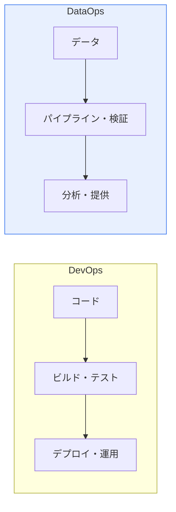

# DataOps(データオプス)とDevOps(デブオプス)

## 1. 概要

### A. 定義
> **DevOps(デブオプス)** は開発(Dev)と運用(Ops)を統合してソフトウェアのデプロイを自動化・加速する方法論であり、**DataOps(データオプス)** はこの原理を**データパイプライン・分析**に適用し、データ提供の速度と品質を高める方法論である。

DataOpsが登場した背景は、DevOpsがコードのデプロイを革新したように、「**データ提供も自動化・協業によって革新する必要**」が生じたためである。データ分析の現場では、データエンジニアがパイプラインを作り、アナリストがそれを受け取って分析し、運用がそれを管理するが、この過程が手作業で分断されていると、データ提供が遅くエラーも頻発する。アナリストが「データがおかしい」と言えば、原因の特定に数日かかることもある。DataOpsはDevOpsのCI/CD・自動化・協業文化をデータパイプラインに導入し、信頼できるデータを迅速に供給する。核心的な違いは管理対象である。DevOpsはアプリケーションコードを扱うが、DataOpsはコードに加えて**絶えず変化するデータ自体の品質**まで管理しなければならないという点が根本的に異なる。

### B. 必要性
データに基づく意思決定・AIが拡散するにつれ、データをどれだけ速く正確に供給できるかが競争力となった。DataOpsなしに手作業に依存すると、データのボトルネックと品質低下が発生し、分析・AIの信頼が崩れる。

## 2. DataOpsとDevOpsの比較

二つの方法論は目標と対象が異なる。DevOpsはアプリケーションコードを速く安定的にデプロイすることが目標であり、DataOpsは信頼できるデータを迅速に提供することが目標である。DevOpsの協業が開発+運用であるのに対し、DataOpsはデータエンジニア+アナリスト+運用へと拡張される。テスト対象も、DevOpsはコード、DataOpsはデータ品質まで含む。

| 区分 | DevOps | DataOps |
|---|---|---|
| **対象** | アプリケーションコード | データ・パイプライン・分析 |
| **目標** | 速く安定したSWデプロイ | 信頼できるデータの迅速な提供 |
| **協業** | 開発+運用 | データエンジニア+アナリスト+運用 |
| **核心** | CI/CD、IaC | データパイプラインの自動化・品質 |
| **テスト** | コードテスト | データ品質・検証 |

## 3. DataOpsのアーキテクチャおよび主要技術

DataOpsアーキテクチャは、データが収集されて分析に提供されるまでのパイプラインを自動化・監視する。データを収集・保存(Kafka・データレイク)し、処理・変換(Spark・dbt)し、品質を検証し、ワークフローをオーケストレーション(Airflow)した後、分析に提供する。この全過程をデータオブザーバビリティ(Observability)で監視し、データの鮮度・品質・リネージ(どこから来てどう変化したか)を追跡する。

| 構成 | 主要技術 |
|---|---|
| **収集・保存** | Kafka、データレイク/ウェアハウス |
| **処理・変換** | Spark、dbt、ETL/ELT |
| **オーケストレーション** | Airflow、ワークフロー自動化 |
| **品質・テスト** | データ検証・プロファイリング、リネージ(Lineage) |
| **監視・ガバナンス** | データオブザーバビリティ(Observability)、カタログ |

## 4. 考慮事項および示唆

1. **DataOpsはDevOpsにデータ品質・ガバナンスを結合**したものである。コードの自動化を超えて、データ検証・品質・リネージ管理が加わってこそ、信頼できるデータを継続的に供給できる。
2. **データオブザーバビリティが信頼性の核心**である。データの鮮度・品質・リネージをリアルタイムに監視し、問題が下流(分析・AI)へ波及する前に早期に捕捉しなければならない。
3. **MLOps・データメッシュと連携**して進化する。DataOpsで確保した高品質なデータパイプラインはMLOpsの基盤となり、データをドメインごとに分散所有・管理するデータメッシュと結合して、データ中心の組織へと発展する。

---

> **一言まとめ**: DevOpsはコードのデプロイを、DataOpsはデータパイプライン・分析を自動化・協業によって革新するものであり、DataOpsは収集→変換→品質検証→オーケストレーション→提供のアーキテクチャとデータオブザーバビリティによって信頼できるデータを迅速に供給し、MLOps・データメッシュの基盤となる。
