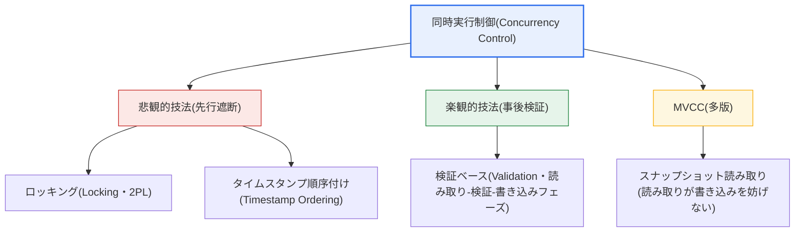
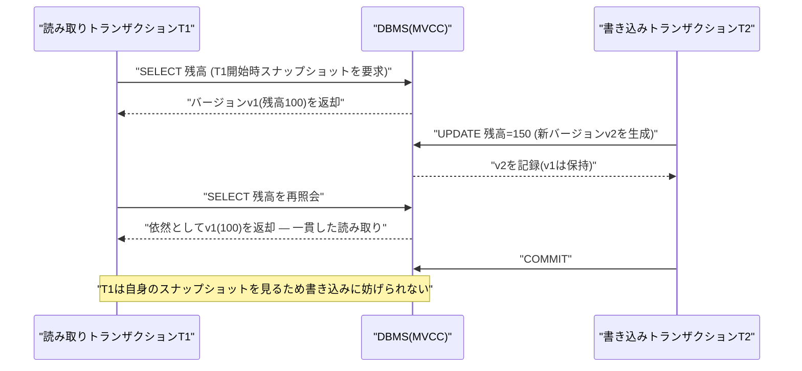

# データベースの同時実行制御(Concurrency Control)

## 1. 概要

### A. 定義および必要性
> 同時実行制御(Concurrency Control)とは、複数のトランザクションが**同時に同じデータへアクセス**する際に生じる相互干渉を統制し、データの**一貫性(Consistency)とトランザクションの隔離性(Isolation)を保証**しつつ、並行性(Concurrency)の利点を最大限に活かす技法である。

同時実行制御が必要な根本的理由は、並行性が「性能」と「整合性」という二つの価値を正面から衝突させるためである。一つのDBMSに複数のユーザー・アプリケーションが同時にアクセスすることを許せば、CPU・ディスクのアイドル時間が減り、スループット(throughput)と応答性が大きく向上する。しかし何の統制もなく操作を混在させると、トランザクション同士が互いの中間結果を侵し、**データ整合性が崩れる**。すなわち同時実行制御の目標は、「可能な限り多くのトランザクションを同時に処理しつつ、あたかも一度に一つずつ順番に実行したのと同じ結果(直列可能性、Serializability)を保証する」という均衡点を見いだすことにある。

代表的な事例が銀行口座の更新消失である。残高100万ウォンの口座に対して、二つの窓口(トランザクションT1・T2)が同時に「残高を読む(100)→50万ウォン出金→50に更新」を実行するとしよう。二つのトランザクションがともに元の残高100を読んだ後、それぞれ50に更新すると、実際には100万ウォンが出金されたにもかかわらず最終残高は50万ウォンとなり、一回分の出金がまるごと消えてしまう。このように並行性は放置すればすぐさま金銭的な誤りにつながるため、同時実行制御はトランザクション処理システムの安全を守る必須の仕組みである。

### B. トランザクションACIDとの関係
同時実行制御は、トランザクションの4大性質である**ACID(原子性・一貫性・隔離性・永続性)**のうち、特に**隔離性(Isolation)**を実現するメカニズムである。原子性がログ・リカバリによって、永続性がディスクへの反映・ログによって保証されるのに対し、隔離性は同時実行制御が担う。隔離性が理想的に守られれば、各トランザクションは自らがシステムを独占しているかのように動作し、その結果として一貫性が維持される。したがって同時実行制御は、隔離性を通じて一貫性を支えるACIDの中核的な軸である。

### C. 同時実行制御がない場合の異常現象
統制のない同時実行は、四つの代表的な異常現象(anomaly)を生む。これらの現象を理解してこそ、なぜ同時実行制御と隔離レベルが必要なのかが明確になる。更新消失は先に見たとおり、ある更新が別の更新に上書きされて消えることであり、ダーティリードはまだコミットされておらずいつでも取り消されうる値を読み、それを根拠に誤った判断を下すことである。反復不能読み取り・ファントムリードは、一つのトランザクション内で同じ条件で二度読んだのに、その間に別のトランザクションが値や行を変更して結果が変わる現象であり、カスケードロールバックは、一つのトランザクションのロールバックが、その中間値を読んだ他のトランザクションの連鎖的なロールバックを引き起こして無駄を増大させる問題である。

| 異常現象 | 内容 | 例示状況 |
|---|---|---|
| **更新消失(Lost Update)** | あるトランザクションの更新が別の更新に上書きされて消える | 同時出金・在庫引当 |
| **ダーティリード(Dirty Read)** | まだコミットされていない(取消可能な)データを読む | 未確定残高に基づく承認 |
| **反復不能・ファントムリード** | 同じ照会を繰り返したのに途中で値・行が変わる | 集計中のデータ変更 |
| **カスケードロールバック(Cascading Rollback)** | 一つのロールバックが他のトランザクションのロールバックを連鎖的に誘発 | 未コミット値を参照した後の取消 |

## 2. 同時実行制御技法の全体構造

同時実行制御には、アプローチの哲学が互いに異なる複数の技法がある。大きく見ると、**競合を事前に防ぐ悲観的(pessimistic)アプローチ**(ロッキング・タイムスタンプ)、**まず進めて後で検査する楽観的(optimistic)アプローチ**、そして**バージョンを分けて読み取りと書き込みを分離する多版(MVCC)アプローチ**に分かれる。以下の構造図はこの分類を示している。

### A. ロッキング(Locking)と2相ロッキング(2PL)
ロッキングは、データにアクセスする前にロックをかけて他のトランザクションのアクセスを統制する、最も直感的な方式である。読み取り用には複数のトランザクションが同時にかけられる**共有ロック(Shared Lock)**、書き込み用には単独でしかかけられない**排他ロック(Exclusive Lock)**を区別する。共有ロック同士は両立するが、排他ロックはいかなるロックとも両立しないため、書き込み中は他のアクセスが待機する。

単にロックをかけて外すだけでは直列可能性が保証されないため、**2相ロッキング(Two-Phase Locking、2PL)**規約を用いる。2PLは、トランザクションがロックを獲得するだけの「成長相(growing phase)」とロックを解放するだけの「縮退相(shrinking phase)」に分かれ、一度ロックを解放し始めたら新しいロックを獲得できないという規則である。この規則が直列可能性を保証する。ただしコミット前にロックを早く解放するとカスケードロールバックが生じうるため、実務ではコミット・ロールバックの時点まですべてのロックを保持する**厳格2PL(Strict 2PL)**を標準として採用する。

ロッキングの代表的な副作用は**デッドロック(Deadlock)**である。二つのトランザクションが互いの保持するロックを待ち続けて永遠に停止する状況であり、例えばT1がAにロックをかけてBを待ち、T2がBにロックをかけてAを待てば、どちらも進行できない。また、ロックの範囲を行・ページ・テーブルのどこに取るか(ロック粒度、granularity)によって、並行性とオーバーヘッドが変わるトレードオフがある。ロック粒度が小さければ並行性は高いが、管理負担が大きくなる。

ロック粒度のトレードオフは実務で頻繁に直面する問題である。行レベルロックは、異なる行を扱うトランザクション同士が妨げられないため並行性が高いが、数十万行を更新するバッチが行ごとにロックを保持すると、ロック管理のオーバーヘッドが大きくなる。このときDBMSは、ロック数が閾値を超えると多数の行ロックを一つのテーブルロックへ昇格させる**ロックエスカレーション(lock escalation)**を実施するが、これは管理コストを減らす代わりに並行性を低下させる。そのため大量更新バッチとオンライン取引が同じテーブルを奪い合う場合には、バッチを細かく分割してコミットしたり実行時間帯を分離したりして、ロック競合を減らす設計が重要である。

### B. タイムスタンプ順序付け(Timestamp Ordering)
タイムスタンプ技法は、各トランザクションに開始時刻(タイムスタンプ)を付与し、データアクセスが常にその時間順序に従うよう強制する方式である。各データには、最後に読んだトランザクションの時刻(read-TS)と書いたトランザクションの時刻(write-TS)が記録され、より遅いトランザクションが既に処理された順序に逆らおうとすると、そのトランザクションを**ロールバック(abort)して再起動**させる。

この方式の長所は、ロックを使わないため**デッドロックが原理的に発生しない**点である。トランザクションが互いを待つことがないからである。しかし順序に違反したトランザクションを即座に巻き戻すため、競合の激しい環境では**ロールバックと再起動が頻発して無駄**が大きくなるという短所がある。また、既にコミットした値に基づいて進行したトランザクションが後から取り消されないよう、管理(カスケードロールバックの防止)が必要である。

### C. 楽観的検証(Optimistic Validation)
楽観的技法は「競合はまれである」という仮定から出発する。トランザクションをまず自由に実行し(読み取りフェーズ)、実際のDBには即座に反映せずローカルコピー上で作業した後、コミット直前に他のトランザクションと競合したかを確認し(検証フェーズ)、競合がない場合にのみ結果を実際に反映する(書き込みフェーズ)。検証で競合が発見されれば、そのトランザクションをロールバックする。

楽観的技法は、読み取り中心で競合頻度が低い環境において、ロックのオーバーヘッドなしに高い並行性を発揮するという長所がある。逆に書き込み競合が頻繁な環境では、検証失敗による再実行が急増してかえって非効率となる。Web・NoSQL・分散システムでよく使われる「バージョン番号で競合を検知する楽観的ロック(optimistic lock)」が、この思想の実務的な実装である。

具体的には、楽観的ロックは各行にバージョンカラム(例: `version`)を置き、更新時に `UPDATE ... SET version=version+1 WHERE id=? AND version=?` の形で読み取ったバージョンを条件に付ける。別のトランザクションが先に更新してバージョンが上がっていれば、このUPDATEの影響行数が0となって競合を即座に検知し、アプリケーションは最新値を読み直して再試行する。JPA・Hibernateの `@Version` が代表的な実装であり、ユーザーが画面を長く開いたまま保存するWeb環境のように、トランザクションを長時間ロックで保持しにくい状況で特に有用である。これはDBエンジンの物理的なロックの代わりに、アプリケーション層で論理的に競合を扱う方式である。

### D. MVCC(多版同時実行制御)
**MVCC(Multi-Version Concurrency Control)**は、データを修正する際に既存のバージョンを上書きせずに残したまま新しいバージョンを作り、読み取りトランザクションが自らの開始時点の一貫したスナップショット(過去のバージョン)を見られるようにする技法である。その結果、**読み取りが書き込みを妨げず、書き込みが読み取りを妨げない。** 今日ではOracle・PostgreSQL・MySQL InnoDBなど、大多数の商用・オープンソースDBMSがMVCCを基盤としている。

MVCCの核心的な価値は、読み取り中心のワークロードにおける圧倒的な並行性である。ただし古いバージョンを蓄積し続けるため、それを整理するコストがかかる。例えばPostgreSQLは、もはや参照されないデッドタプル(dead tuple)を回収する**VACUUM**作業が必要であり、Oracleは古いイメージを保持する**UNDO(アンドゥ)セグメント**を管理しなければならない。この保存・整理コストが、MVCCが支払う代償である。

## 3. MVCCとトランザクション隔離レベル

同時実行制御は単独で機能するのではなく、**トランザクション隔離レベル(Isolation Level)**と併せて調整される。隔離レベルは「どの程度の異常現象まで許容するか」を定めるポリシーであり、標準SQLは四つの段階を定義している。以下のシーケンス図は、MVCC環境において読み取りトランザクションが書き込みトランザクションに妨げられることなくスナップショットを読む過程を示している。

隔離レベルは低いほど並行性が高く異常現象をより多く許容し、高いほど整合性は強いが並行性が低下する。**Read Uncommitted**はダーティリードまで許容する最も緩い段階、**Read Committed**はコミット済みの値だけを読んでダーティリードを防ぐ段階で、Oracle・PostgreSQLのデフォルトである。**Repeatable Read**は一つのトランザクション内での反復読み取りの一貫性を保証し、MySQL InnoDBのデフォルトであり、**Serializable**はあたかも逐次実行したかのような完全な隔離を提供するが、並行性は最も低い。

| 隔離レベル | ダーティリード | 反復不能読み取り | ファントムリード | 特徴 |
|---|---|---|---|---|
| **Read Uncommitted** | 許容 | 許容 | 許容 | 最も緩い・最高の並行性 |
| **Read Committed** | 防止 | 許容 | 許容 | 実務のデフォルト(Oracle・PG) |
| **Repeatable Read** | 防止 | 防止 | 許容(エンジンにより防止) | InnoDBのデフォルト |
| **Serializable** | 防止 | 防止 | 防止 | 最強の整合性・最低の並行性 |

## 4. デッドロック(Deadlock)の管理

ロッキングベースの同時実行制御において、デッドロックは別途の戦略で扱うべき中核的な課題である。標準的には予防(Prevention)・回避(Avoidance)・検出(Detection)・回復(Recovery)の四つの方向からアプローチする。**予防**は、資源要求の順序をあらかじめ定めたり(資源の順序付け)、すべてのロックを一度に確保させたりして循環待ちを原理的に遮断する方式であり、**回避**はWait-Die・Wound-Waitのように、タイムスタンプによって待機を許すかロールバックするかを決定し、循環を防ぐ方式である。

**検出**は、トランザクション間の待機関係を描いた**待ちグラフ(Wait-for Graph)**の中からサイクルを見つけてデッドロックを発見する方式であり、サイクルがあればその中でロールバックコストが最も小さいトランザクションを**犠牲者(victim)**として選び、巻き戻す(回復)。実務のDBMSは定期的に待ちグラフを検査するか、より単純には一定時間以上ロックを取得できなければトランザクションを自動的に取り消す**ロックタイムアウト(lock timeout)**を併用する。例えば大量バッチとオンライン取引が同じテーブルを逆の順序で更新してデッドロックが繰り返される場合には、アクセス順序を統一するかバッチの時間帯を分離して根本的に解決する。

## 5. 深化: 分散・クラウド環境における同時実行制御

伝統的な同時実行制御が単一ノードのDBMSを前提としていたのに対し、今日の分散・クラウドデータベースはノードをまたぐ並行性を扱わなければならないため、新しい技法が台頭した。Google Spannerは、**TrueTime**という時刻同期(不確実区間を含む)の上でグローバルなタイムスタンプを付与し、地理的に分散したノード間でも外部一貫性(external consistency)を備えた直列可能性を実現する。これはタイムスタンプ順序付けの思想を地球規模に拡張した事例である。

もう一つの流れが**SSI(Serializable Snapshot Isolation)**である。スナップショット隔離(MVCCベース)は性能が良いが、「書き込みスキュー(write skew)」という微妙な異常を許容する。PostgreSQLはスナップショット隔離に競合検知を加えたSSIによって、完全なSerializableを低コストで提供する。分散トランザクションでは**2相コミット(2PC)**によって原子的なコミットを保証しつつ、コーディネーター障害時のブロッキング問題を緩和するための変形・合意プロトコル(Paxos・Raft)が併用される。技術士の観点から重要な洞察は、分散環境では**CAP・PACELC理論**が示すとおり一貫性と可用性・遅延の間のトレードオフが避けられず、そのため多くのシステムが強い直列可能性の代わりに、目的に合った緩和された一貫性モデルを意図的に選択しているという点である。

## 6. 考慮事項および示唆

1. **並行性と整合性の均衡が本質である。** 同時実行制御の目標は無条件に強い隔離ではなく、業務が要求する整合性レベルを満たす範囲で並行性を最大化することである。決済・会計のように強い一貫性が必要ならSerializableを、照会・統計のように性能が重要ならRead Committedなど低い隔離を選択し、トレードオフを調整しなければならない。

2. **デッドロックは設計・運用の次元で先制的に管理する。** 予防・回避・検出・回復とタイムアウトを状況に応じて組み合わせ、アプリケーションで資源アクセス順序を統一し、トランザクションを短く保ってロック保持時間を減らすことが根本的な処方である。デッドロックはアルゴリズムだけでなく、トランザクション設計によって減らす。

3. **MVCCが現代DBMSの主流となった理由を理解する。** 読み取り中心のワークロードで読み取りと書き込みが互いを妨げないため並行性に優れているからであり、その代償として古いバージョンの整理(VACUUM・UNDO管理)コストを支払う。MVCC環境ではロングトランザクションが古いバージョンの蓄積を誘発して性能を低下させうるため、トランザクションの寿命管理が重要である。

4. **隔離レベルをワークロードごとに差別化して適用する。** 一つのシステム内でもトランザクションの性格に応じて隔離レベルを変え、整合性が決定的な少数の取引だけを高い隔離で保護し、残りは低い隔離でスループットを確保する戦略が実務的に有効である。

5. **分散・クラウドへの拡張を念頭に置く。** 単一ノードの技法をそのまま分散環境に適用することはできず、TrueTime・SSI・合意プロトコルとCAP・PACELCのトレードオフを考慮して、目標とする一貫性モデルを意識的に設計しなければならない。アーキテクチャ選択の段階で、同時実行制御・一貫性の要件を併せて定義することが望ましい。

## 参考資料

- PostgreSQL Documentation — Transaction Isolation / Concurrency Control: https://www.postgresql.org/docs/current/mvcc.html
- Oracle Database Concepts — Data Concurrency and Consistency: https://docs.oracle.com/en/database/oracle/oracle-database/
- ANSI/ISO SQL標準の隔離レベル(Read Committed・Repeatable Read・Serializable)概要: https://en.wikipedia.org/wiki/Isolation_(database_systems)

---

> **一言まとめ**: 同時実行制御は、同時トランザクションの干渉による異常現象(更新消失・ダーティリードなど)を防いで隔離性・一貫性を保証する技法であり、*ロッキング(2PL)・タイムスタンプ・楽観的検証・MVCC* によって並行性と整合性の均衡を取り、デッドロック管理と隔離レベルの調整、さらには分散環境の一貫性モデルまで併せて設計しなければならない。
