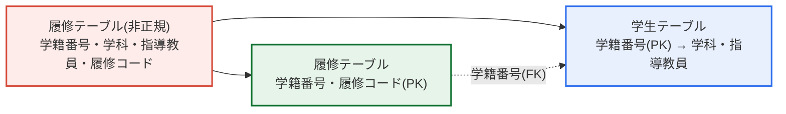
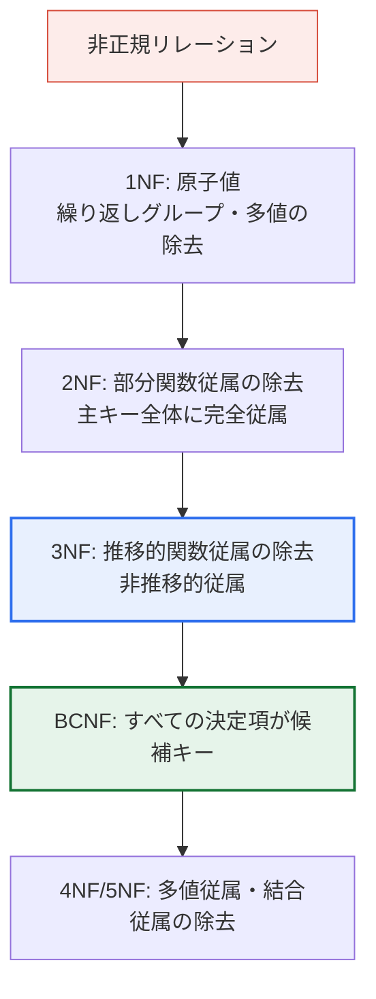

# データベースの正規化(Normalization)

## 1. 概要

### A. 定義
> **正規化**とは、リレーショナルデータベースにおいて**データの重複を排除し更新時異状(Anomaly)を防止**するために、リレーション(テーブル)を**関数従属性(Functional Dependency)**に基づいて複数の小さなリレーションへ無損失分解(Lossless Decomposition)する体系的な設計プロセスである。

正規化が必要な根本的理由は、「**一つのテーブルに異なる主題の情報を詰め込むと重複が生じ、その重複がそのまま更新時異状を招く**」という点にある。例えば学生の学科・指導教員の情報を履修テーブルに一緒に入れると、同じ学生が複数の科目を履修するたびに学科・指導教員の値が行ごとに繰り返し保存される。最初は些細な記憶領域の無駄に見えるが、この重複はデータを挿入・削除・変更するあらゆる瞬間に潜在的なエラーを生み出す。リレーショナルモデルの創始者E. F. Coddが1970年代に正規形(Normal Form)の概念を提示したのも、「データをどう配置すれば更新時に矛盾が生じないか」という完全性の問題を数学的に解決するためであった。

正規化の中核思想は**「一つの事実はただ一か所にのみ保存する(One Fact, One Place)」**に要約される。異なる主題(エンティティ)のデータを別テーブルに分離し外部キー(FK)で結べば、いかなる事実もデータベース全体でただ一度だけ記録される。値を変更するときは一か所だけ直せばよいため、矛盾は原理的に発生しえない。すなわち正規化は単なるテーブル分割の技法ではなく、**データを論理的に正しい位置に配置する設計原則**であり、スキーマの品質を決定する最も基本的な尺度である。

また正規化は、**エンティティの意味を明確にするプロセス**でもある。一つのテーブルに学生・履修という二つの概念が混在していると、そのテーブルが「何を表現しているのか」が曖昧になる。正規化によってテーブルを分解すれば、各テーブルが一つの明確な主題だけを持つようになり、スキーマ自体が業務ドメインの概念構造をそのまま反映するようになる。この点で正規化は、データモデリング(概念→論理設計)の最後の精錬段階と見ることもできる。

### B. 必要性
重複を放置すると、記憶領域の無駄にとどまらず、更新時に複数の行のうち一部だけが変更されて**データが互いに矛盾する深刻な完全性の問題**が発生する。特に口座残高・在庫数量・顧客ランクのように、正確性がそのままサービスの信頼に直結するデータでは、重複は致命的である。正規化は、こうした論理的完全性(Consistency)をスキーマ構造のレベルで保証する、信頼できるデータベース設計の出発点である。逆に照会性能が最優先の分析系では正規化を緩和(非正規化)することもあるが、この均衡点を判断するにはまず正規化の原理を正確に理解しなければならない。

## 2. 更新時異状(Anomaly)の発生原理

正規化を理解する最も早い道は、「正規化しなければ何が起こるか」を見ることである。以下の`<履修テーブル>`(主キー: {学籍番号, 履修コード})は、学生情報と履修情報を一つのテーブルに混在させた非正規の設計である。

| 学籍番号 | 学科 | 指導教員 | 履修コード |
|---|---|---|---|
| 221571 | コンピュータ学科 | K1 | C412 |
| 221571 | コンピュータ学科 | K1 | C511 |
| 221572 | コンピュータ学科 | M1 | C412 |
| 211561 | 数学科 | P2 | C324 |

この表を見ると、学籍番号221571の学生が二科目(C412、C511)を履修しているため、**学科(コンピュータ学科)と指導教員(K1)がまったく同じく二度保存**されている。更新時異状の根本原因はまさにここにある。主キーでない属性である学科・指導教員は、主キー全体{学籍番号, 履修コード}ではなく、**その一部である学籍番号にのみ従属(部分関数従属、Partial Dependency)**しているにもかかわらず、主キーのもう一方の部分(履修コード)が生み出す行数分だけ不必要に繰り返し保存されているのである。この構造的欠陥が、挿入・削除・更新の三つの更新時異状として表出する。

第一に、**挿入時異状(Insertion Anomaly)**は、望まないデータを無理に一緒に入れなければならない問題である。まだどの科目も申し込んでいない新入生の学科情報を保存しようとしても、主キーの一部である履修コードがNULLだと行を作れないため、学生情報そのものを入れられない。すなわち「履修しなければ学生として登録されない」という非現実的な制約が、データ構造のせいで強制される。

第二に、**削除時異状(Deletion Anomaly)**は、一つを消そうとして無関係な情報まで失う問題である。学生211561が唯一受講していたC324の履修を取り消してその行を削除すると、一緒に保存されていた学科(数学科)・指導教員(P2)の情報まで消え、学生の存在そのものがデータベースから消滅する。履修履歴と学生の身上という別個の事実が一つの行に束ねられているためである。

第三に、**更新時異状(Update Anomaly)**は最も危険な類型であり、重複した値のうち一部だけが修正されてデータが矛盾する問題である。学生221571の学科がコンピュータ学科からソフトウェア学科に変わった場合、その学生に関連するすべての行(C412、C511)を漏れなく直さなければならない。もし一行だけ直して他の行を見落とせば、同じ学生の学科が同時に二つ記録され、「どちらが本当なのか」が分からない状態となる。

| 更新時異状 | 症状 | 根本原因 |
|---|---|---|
| **挿入時異状** | 履修なしでは学生情報を挿入できない | 主キーの一部(履修コード)がNULLだと行を生成できない |
| **削除時異状** | 最後の履修を削除すると学生情報まで消滅 | 一つの行に学生・履修の二つの事実が混在 |
| **更新時異状** | 学科変更時に一部の行だけ修正→矛盾 | 学科情報が複数行に重複保存 |

## 3. 解決方策 — 関数従属性に基づく無損失分解

更新時異状の解決策は明確である。**部分関数従属を除去するようにテーブルを分離**することである。学籍番号にのみ従属する学科・指導教員を別の学生テーブルへ切り出し、履修関係テーブルには主キー{学籍番号, 履修コード}だけを残す。以下は、元のテーブルが二つの明確な主題のテーブルへ分解される構造図である。

分解の結果は次のとおりである。**学生テーブル**では学科・指導教員が学生ごとに一度だけ保存され、**履修テーブル**は「誰が何を受講しているか」という関係だけを純粋に表現する。

**学生テーブル** (主キー: 学籍番号)

| 学籍番号 | 学科 | 指導教員 |
|---|---|---|
| 221571 | コンピュータ学科 | K1 |
| 221572 | コンピュータ学科 | M1 |
| 211561 | 数学科 | P2 |

**履修テーブル** (主キー: {学籍番号, 履修コード})

| 学籍番号 | 履修コード |
|---|---|
| 221571 | C412 |
| 221571 | C511 |
| 211561 | C324 |

このように分離すれば、三つの更新時異状が同時に解消される。新入生は学生テーブルに学科だけで登録できるため**挿入時異状**がなくなり、履修をすべて取り消しても学生テーブルの身上は残るため**削除時異状**がなくなり、学科変更は学生テーブルのただ一行を直せばよいため**更新時異状**が原理的に除去される。重要なのは、この分解が**無損失(Lossless)**であるという点である。二つのテーブルを学籍番号で再び結合(JOIN)すれば元の情報を正確に復元でき、データを分けても意味は一つも失われない。これが、正規化が単なる削除ではなく「安全な分解」である理由である。

## 4. 正規化の段階(Normal Forms)と進行手順

正規化は一度に行われるのではなく、除去する従属性の種類に応じて1NF→2NF→3NF→BCNF→4NF→5NFの段階で漸進的に進められる。実務ではほとんどの更新時異状が3NFまたはBCNFで解消されるため、通常は**3NF/BCNFまでを目標**とする。各段階は、前段階を満たした状態で新たな条件を追加で要求する累積的な構造を持つ。

**第1正規形(1NF)**は、すべての属性がそれ以上分割できない原子値(Atomic Value)を持つことを要求する。一つのセルに「C412, C511」のように複数の値をカンマで入れたり、繰り返しカラム(科目1、科目2)を置いたりすると1NF違反である。この場合、各値を別の行に展開して繰り返しグループを除去する。1NFはリレーショナルテーブルの最低限の資格要件に相当する。

**第2正規形(2NF)**は、1NFを満たしつつ**部分関数従属を除去**した状態である。前節の例のように主キーが複合キー({学籍番号, 履修コード})のとき、主キーの一部(学籍番号)にのみ従属する属性(学科・指導教員)を分離すれば2NFとなる。主キーが単一属性であれば部分従属そのものが成立しないため、1NFであれば自動的に2NFである。

**第3正規形(3NF)**は、2NFを満たしつつ**推移的関数従属(Transitive Dependency)を除去**した状態である。例えば(学籍番号→学科)かつ(学科→学部)であれば、学籍番号→学部という推移的従属が存在する。このとき学科が変われば学部も併せて管理しなければならない重複が生じるため、学科-学部を別テーブルに分離する。実務スキーマの目標ラインのほとんどはここにある。

**BCNF(Boyce-Codd Normal Form)**は3NFを強化し、**すべての決定項(Determinant)が候補キー(Candidate Key)**でなければならないという条件を要求する。候補キーが複数あり互いに重なる(入れ子になった)特殊な状況で、3NFを満たしても残る更新時異状を除去するための段階であり、予約システム(学生・科目・講師が絡む割り当てなど)でよく現れる。ただしBCNF分解では関数従属性の保存(Dependency Preservation)が崩れる場合があるため、実務では3NFとBCNFの間のトレードオフを検討したうえで適用レベルを決める。

正規化を実際に行う手順は次のように要約される。第一に、対象リレーションのすべての属性と、それらの間の関数従属性を漏れなく導出する。第二に、候補キーと主キーを確定する。第三に、1NFから始めて各段階の違反従属(繰り返しグループ→部分従属→推移的従属→候補キーでない決定項)を順に見つけ、該当属性を新しいリレーションに分離する。第四に、分離したリレーションを再び結合したときに元が復元されるか(無損失結合)、元の従属性が保存されているかを検証する。この手順を機械的に追うよりも、各分解が業務ルール(ドメインの意味)と一致しているかを併せて確認することが、正しいスキーマを得る鍵である。

| 段階 | 満たすべき条件 | 除去対象 |
|---|---|---|
| **1NF** | すべての属性が原子値 | 繰り返しグループ・多値 |
| **2NF** | 主キー全体に完全関数従属 | 部分関数従属 |
| **3NF** | 推移的従属がない | 推移的関数従属 |
| **BCNF** | すべての決定項が候補キー | 候補キーの重なりによる残存異状 |
| **4NF** | 多値従属がない | 多値従属(MVD) |
| **5NF** | 結合従属がない | 結合従属(PJNF) |

## 5. 深化 — 正規化と非正規化(De-normalization)の実務上のトレードオフ

理論上は正規化の段階が高いほど完全性が良くなるが、実務では無条件に高い正規形が正解というわけではない。正規化はテーブルを細かく分けるため、一つの画面・レポートを作るために複数のテーブルを**結合(JOIN)**しなければならないケースが増える。結合はCPU・メモリを消費し、大容量・高頻度の照会環境では応答遅延の主因となる。そこで登場するのが**非正規化**であり、性能のために意図的に重複を許容したりテーブルを統合したりする逆方向の設計技法である。

代表的な事例がデータウェアハウス(DW)の**スタースキーマ(Star Schema)**である。分析系では「前四半期の地域別・商品別売上合計」のような大量集計照会が中心となるが、正規化された数十のテーブルを毎回結合すると性能が出ない。そこでファクト(Fact)テーブルの周りにディメンション(Dimension)テーブルを配置し、ディメンションテーブル内には地域名・商品分類といった値をあえて重複保存(非正規化)して結合回数を最小化する。ECサイトで商品一覧画面の「レビュー件数」や「平均評価」を商品テーブルにあらかじめ計算して保存しておくのも、同じ原理の非正規化である。照会のたびにレビューテーブルを集計する代わりに、レビューが追加されたときだけカウントを更新することで、読み取り性能を劇的に改善する。

核心は、**非正規化は正規化の失敗ではなく、正規化を前提とした意識的な選択**であるという点である。まず正規化によって正しい論理構造を確保した後、実測された性能ボトルネックが確認された部分に限って非正規化を適用しなければならない。正規化なしに最初から重複を放置することと、正規化後に統制された重複を導入することはまったく異なる。後者の場合、重複した値の一貫性を維持する責任(トリガ・バッチ・アプリケーションロジック)が明確に管理されるからである。性能と完全性という二つの目標は相反するため、技術士はシステムの性格(トランザクション中心のOLTPか、照会中心のOLAPか)に応じてこの均衡点を判断できなければならない。

## 6. 考慮事項および示唆

1. **正規化と性能のトレードオフ判断が設計力の核心である。** 正規化は完全性を高めるが、結合の増加によって照会性能を低下させうる。完全性が最優先の勘定系・元帳システムは3NF/BCNFまで正規化し、照会性能が最優先の分析系・統計系は非正規化(スタースキーマ、集計カラム)を戦略的に適用する二元化アプローチが望ましい。

2. **正確な関数従属性の分析が正しい分解の前提である。** 「どの属性が何によって決定されるか」を業務ルールの次元で正確に識別できなければ、誤ったキーでテーブルを分けて、かえって無損失分解が崩れたり不要な結合が生じたりする。従属性ダイアグラム(FD Diagram)の作成とドメイン専門家による検証を設計手順に含めなければならない。

3. **OLTPは正規化、OLAPは非正規化という基準でアーキテクチャを分離する。** トランザクションの完全性が重要な運用系は正規化されたスキーマでデータを安全に蓄積し、照会・分析はETLで別の非正規化された分析ストア(DW/データマート)に格納して処理する。このようにワークロードを分離すれば、完全性と性能を同時に達成できる。

4. **非正規化の際は重複データの一貫性維持メカニズムを必ず併せて設計する。** 集計カラム・重複カラムを導入したなら、元データの変更時にそれを同期するトリガ・CDC・バッチまたはアプリケーションロジックを明示的に用意しなければならない。同期の責任が不明確な非正規化は、更新時異状を人為的に復活させる結果を招く。

5. **NoSQL・ドキュメント型DBの時代にも正規化の原理は有効である。** MongoDBなどのドキュメント型DBは照会性能のためにデータを埋め込む(Embedding、非正規化)ことを推奨しているが、これは正規化の原理を知らなくてよいという意味ではなく、正規化・非正規化のトレードオフを理解した上で、アクセスパターンに合わせて意図的に選択するという意味である。原理を知ってこそ、参照(Reference)と埋め込み(Embedding)のどちらを選ぶべきかを判断できる。

## 参考資料
- Codd, E. F., "A Relational Model of Data for Large Shared Data Banks", CACM, 1970. https://dl.acm.org/doi/10.1145/362384.362685
- Wikipedia, "Database normalization". https://en.wikipedia.org/wiki/Database_normalization

---

> **一言まとめ**: 正規化とは、*重複の排除と更新時異状(挿入・削除・更新)の防止*のために関数従属性に基づいてテーブルを無損失分解する設計原則(1NF→2NF→3NF→BCNF)であり、部分・推移的従属を除去して完全性を確保しつつ、照会性能が必要な分析系では非正規化と戦略的に均衡を取る。
