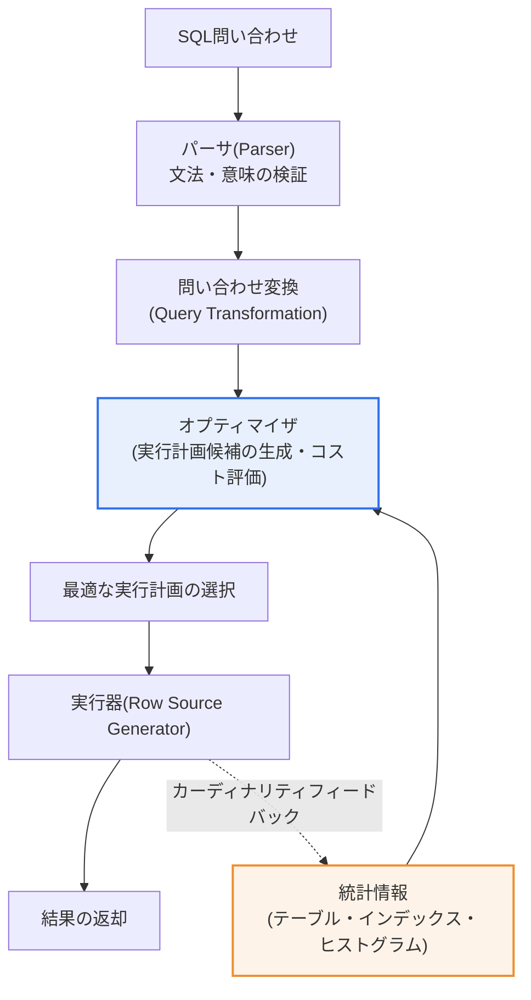
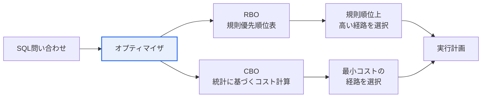

# データベースオプティマイザ(RBO・CBO)

## 1. 概要

### A. 定義
> **オプティマイザ(Optimizer)** とは、SQL問い合わせを実行する際に、**同じ結果を得られる複数の実行経路(access path・join order・join method)の中から最も効率的な実行計画(execution plan)を選択**するDBMSの中核エンジンである。ユーザーが「何を(what)」望むかを宣言型SQLで表現すると、「どのように(how)」処理するかを決定するのがオプティマイザの役割である。

オプティマイザを理解する鍵は、「**一つのSQLには数十~数千通りの実行方法があり、どれを選ぶかによって応答時間が数百~数万倍も異なる**」という点にある。例えばA・B二つのテーブルを結合する単純な問い合わせでも、どちらのテーブルを先に読むか(driving table)、インデックスを使うか全件スキャンをするか(access path)、どの結合方式(Nested Loop・Hash・Sort Merge)を使うかの組み合わせによって、実行時間は極端に分かれる。リレーショナルDBではSQLが「宣言型言語」であるため、ユーザーは処理手順を指定しない。まさにその手順を自動的に決定してくれる知能がオプティマイザである。

オプティマイザがなければ、開発者は問い合わせのたびに最適な物理的実行順序を手作業で組み立て、データ量・分布が変わるたびにチューニングし直さなければならない。オプティマイザはこの負担をDBMS内部に吸収し、ユーザーは論理的な問い合わせだけに集中し、物理的な最適化はエンジンに任せられるようにする。ところが「何を基準に最適と判断するか」によって、オプティマイザは二つの系統に分かれる。定められた規則の優先順位に従う**RBO(Rule Based Optimizer)**と、実際のデータ統計を根拠にコストを計算する**CBO(Cost Based Optimizer)**である。今日の商用・オープンソースDBMSは、事実上すべてCBOを標準として採用している。

### B. 必要性と位置付け
データが大きく問い合わせが複雑になるほど、「実行方法の選択」が性能を左右する。オプティマイザはSQL処理パイプライン(パース → 最適化 → 実行)のうち**最適化段階**を担当する。パーサが文法・意味を検証して論理的に同等な問い合わせ形態を作り出すと、オプティマイザがその中から物理的に最も安価な計画を選び、実行器(row source generator)に渡す。すなわちオプティマイザは、ユーザーが気にしなくても最適経路を見つけて性能を確保する「DBMSの頭脳」に相当する。

オプティマイザの重要性は、システム規模が大きくなるほど非線形に増大する。小規模なデータではどの計画を立てても体感差は小さいが、大容量・高同時実行の環境では、誤った計画一つがCPU・メモリ・I/Oを独占し、システム全体の応答性を崩壊させる。したがってオプティマイザを理解することは単なる性能最適化の知識ではなく、安定したサービス運用と資源効率の根幹を扱う問題であり、DBチューニング・キャパシティ算定・SLA管理に直結する中核的な能力である。

## 2. SQL処理フローにおけるオプティマイザの位置

オプティマイザがいつ・何を根拠に介入するかを理解するには、SQL一文が処理される全体の流れを見る必要がある。以下のプロセス詳細図は、パースから実行・統計フィードバックまでの段階を示している。

オプティマイザが候補計画を作る際に考慮する物理的な選択肢は、大きく三つの軸である。第一は**アクセスパス(access path)**で、テーブルを丸ごと読む全件スキャン(Full Table Scan)とインデックスを経由するインデックススキャンのどちらが安いかを判断する。少量だけ絞り込まれるならインデックスが、大量に絞り込まれるなら全件スキャンが有利である。第二は**結合順序(join order)**で、先に読んで結果集合を絞り込むテーブル(driving table)を何にするかによって以降のコストが変わる。第三は**結合方式(join method)**で、少量の集合に有利なNested Loop、大量の等価結合に有利なHash Join、ソート済みの大量集合に適したSort Mergeの中から、データ規模に合ったものを選ぶ。この三つの軸の組み合わせが実行計画の場合の数を爆発的に増やし、その膨大な空間の中から最低コスト点を見つけるのがオプティマイザの仕事である。

この流れを文章で説明すると、まず**パーサ**がSQLの文法とオブジェクトの存在有無・権限を検証する。続いて**問い合わせ変換(query transformation)**段階で、オプティマイザはサブクエリのマージ(view merging)、条件のプッシュダウン(predicate pushing)、OR展開などにより、論理的には同等だがより最適化しやすい形に問い合わせを書き換える。その後、本格的な**最適化**段階で複数の実行計画候補を生成し、各候補のコストを推定して最低コストの計画を選ぶ。このとき決定的に参照するのが**統計情報**であり、実行後に実際に処理された行数が推定値と大きく異なれば、その情報を再び統計にフィードバックして(カーディナリティフィードバック)次の実行を改善する。要するに、オプティマイザの判断品質は「統計の正確性」に絶対的に依存する。

## 3. RBO vs CBO: 判断基準の違い

オプティマイザの二つの方式は、「何を根拠に実行経路を選ぶか」において本質的に分かれる。以下の構造図は、同じSQLが二つの方式でどのように異なる根拠によって計画に到達するかを示している。

### A. RBO(ルールベースオプティマイザ)
**RBO**は、あらかじめ定められた規則と優先順位リストに従って実行計画を立てる。例えば「単一行インデックスアクセス > ユニークインデックス > 範囲インデックス > 全件テーブルスキャン」のようにアクセスパスごとに順位(rank)が固定されており、オプティマイザはデータの実際の量・分布とは無関係に、順位の高い経路を無条件に選択する。長所は単純で結果が予測可能であることである。統計がなくても動作し、同じSQLは常に同じ計画を生成する。

しかしRBOの致命的な限界は、「**実際のデータを見ない**」という点である。インデックスがあれば無条件にインデックスを使うため、全100万件のうち90万件を読まなければならない問い合わせでもインデックスを使い、かえってランダムI/Oが急増して全件スキャンよりはるかに遅くなるという逆説が生じる。データが少量だった時代には通用したが、大容量・多様な分布を持つ現代の環境では誤った選択が頻発し、事実上廃止された。Oracleの場合、CBO導入後も統計がない場合や明示的な要求があった場合にのみ使われていたが、その後のバージョンで**もはやサポートされない(obsolete・deprecated)**方式として整理された。

RBOが廃止されたより根本的な理由は、「**データは変化するのに規則は固定されている**」という構造的矛盾にある。サービス初期に数千件だったテーブルが運用数年後に数億件に増えても、RBOは依然として同じ規則順位で同じ計画を作る。データの成長・分布の変化に応じて最適経路が変わるべきなのに、RBOにはそれを反映する手段がない。一方CBOは、統計さえ更新すれば、同じSQLでもデータ規模に合った別の計画を自ら立てる。この「変化への適応能力」の有無が二つの方式の運命を分け、そのため現代のDBMSは例外なくCBOをデフォルトとしている。

### B. CBO(コストベースオプティマイザ)
**CBO**は、テーブルサイズ・データ分布・インデックスの選択性・クラスタリングファクタなどの**統計情報を基に各実行経路のコスト(cost)を実際に計算**し、最も安価な計画を選択する。ここでのコストは、おおよそ「CPU使用量 + I/O回数」を正規化した推定値であり、オプティマイザは候補計画ごとに予想処理行数(**カーディナリティ、cardinality**)とコストを推定して比較する。統計に基づくため、データの状況に合った知的な選択が可能であり、これが今日すべての主要DBMSの標準となった理由である。

CBOの性能は「統計の鮮度」にかかっている。統計が古くなって実際のデータとずれる(stale statistics)と、オプティマイザは誤ったカーディナリティを根拠に的外れな計画を立てる。例えば最近急増したテーブルの統計が昔の少量基準のまま残っていると、オプティマイザは「このテーブルは小さい」と誤判断して不適切なNested Loop結合を選択し、その結果、数秒で終わるはずの問い合わせが数十分かかることもある。そのためCBO運用の核心は、定期的・自動化された統計収集である。

| 区分 | RBO(ルールベース) | CBO(コストベース) |
|---|---|---|
| **判断基準** | 固定された規則・優先順位 | 統計に基づくコスト計算 |
| **データの反映** | しない(データを無視) | 反映する(サイズ・分布・統計) |
| **長所** | 単純・予測可能 | データの状況に合った知的な最適化 |
| **短所** | 実際の状況を無視するため非効率が発生 | 統計の正確性に性能が左右される |
| **現在の位置付け** | 廃止(obsolete) | 事実上の標準 |

## 4. CBOのコスト計算と実務上のチューニング要素

CBOがコストを算定する過程は、結局のところ「**カーディナリティ推定の連鎖**」である。条件句(predicate)ごとにどれだけの行が絞り込まれるかを選択性(selectivity)として推定し、その結果の行数を次の演算(結合・ソート)の入力として渡し、再びコストを計算する。この連鎖の最初のボタンである選択性の推定がずれると、以降のすべての推定が連鎖的に狂うため、データ分布を正確に伝える**ヒストグラム(histogram)**が重要である。値の分布が均一でないカラム(例: 特定のコードが全体の95%を占める)では、ヒストグラムがなければオプティマイザは各値を均等分布と誤判断する。最新バージョンでは、頻度(frequency)・高さ均衡(height-balanced)に加えて、上位頻度(top-frequency)・ハイブリッド(hybrid)ヒストグラムをサポートし、偏った分布をより精密に表現する。

実務のチューニング要素は、すべて「オプティマイザが良い計画を立てられるよう支援する」手段として理解すれば一貫して整理できる。以下の表の各項目は互いに独立しておらず、統計を最新化し、実行計画を読んで問題を診断した後、必要なときだけヒントで介入するという一つの流れを成している。

| チューニング要素 | 内容と理由 |
|---|---|
| **統計情報の管理** | CBOは統計に依存 → 自動統計収集で最新状態の維持が必須 |
| **実行計画の分析** | EXPLAIN PLAN・実際の実行統計でボトルネック(過剰なI/O・誤った結合)を診断 |
| **ヒストグラム** | 偏った分布のカラムにおける選択性の誤判断を防止 |
| **ヒント(Hint)** | オプティマイザが誤判断する際に、開発者がアクセスパス・結合方式を明示的に誘導 |
| **バインド変数** | 実行計画の再利用(soft parse)によりハードパースの負担を軽減 |

ここで注意すべきトレードオフが、バインド変数とヒストグラムの相互作用である。バインド変数は実行計画を再利用してパースコストを減らすが、偏った分布のカラムにバインド変数を使うと、「最初に入ってきた値に最適化された計画」がその後の別の値にも再利用され、非効率(bind peekingの副作用)が生じうる。このような場合は、適応型カーソル共有(adaptive cursor sharing)などの機能によって値の分布に応じて計画を分化させて補う。すなわち、ある最適化技法が別の状況では逆効果を生みうるため、実行計画を実際に読んで検証する習慣がチューニングの出発点となる。

### A. 誤ったカーディナリティ推定が招く性能事故(事例)
CBOの誤判断が実際の障害に発展する典型的なシナリオは、「**小さなテーブルと誤認した大容量テーブルにNested Loop結合を選択**」するケースである。例えば夜間バッチで注文テーブルに数百万件がロードされたのに統計が更新されず、オプティマイザが「このテーブルは数千件」と推定したとしよう。オプティマイザは小さな集合に有利なNested Loop(外部の行ごとに内部テーブルを繰り返し探索)を選ぶが、実際には数百万回の繰り返し探索が発生し、数秒で終わるはずの問い合わせが数十分間CPUとI/Oを占有する。日中の業務問い合わせであれば、すぐにサービス遅延につながる。

この事故の診断と処方は、オプティマイザの原理をそのまま辿る。まず実行計画で**推定カーディナリティ(E-Rows)と実際の行数(A-Rows)の乖離**を確認し、オプティマイザがどこで誤判断したかを突き止める。根本原因が古い統計であれば統計を再収集するのが定石であり、特定値への偏りが原因であればヒストグラムを作成して選択性の推定を正す。計画を即座に戻さなければならない緊急事態でのみ、結合方式を強制するヒントで暫定措置を取り、その後統計・インデックスで根本原因を解消してヒントへの依存を取り除く。この事例は、「CBOの性能は統計の正確性にかかっている」という命題と、「実行計画を読んで推定と実際を対照することがチューニングの第一歩である」という原則を同時に示している。

## 5. 深化: 適応型最適化(Adaptive Query Optimization)

CBOの根本的な弱点は、「**実行前に立てた推定が実際と異なりうる**」という点である。統計がいくら良くても、複雑な結合・条件ではカーディナリティ推定が外れ、その結果誤った計画が固定化されうる。これを補うために登場したのが**適応型問い合わせ最適化(Adaptive Query Optimization)**であり、Oracle Database 12cで一つの機能群として整理された。

第一に、**適応型計画(Adaptive Plans)**は、カーディナリティの推定が難しい結合において「計画の決定を実行時点まで遅らせる」方式である。オプティマイザは実行計画に統計コレクタ(statistics collector)を組み込んでおき、実際に処理される行数が推定と大きく異なれば、実行途中で結合方式をNested LoopからHash Joinに切り替えるといった形で計画を転換する。第二に、**自動再最適化(Automatic Reoptimization)**とその前身である**カーディナリティフィードバック(cardinality feedback、11gR2で導入)**は、一度実行した後に実際のカーディナリティを保存し、次回の実行でその値を反映してより良い計画に再コンパイルする。第三に、**SQL計画管理(SQL Plan Management)**は、検証済みの計画をベースラインとして固定し、統計の変化によって計画が突然悪化する「計画の退行(plan regression)」を防止する。

この流れの実務的な含意は明確である。過去のオプティマイザが「実行前に一度立てた計画どおりにのみ」処理していたとすれば、現代のCBOは「実行しながら学習し、自ら補正する」方向へ進化しているということである。さらに最近では、機械学習でカーディナリティを推定したり(learned cardinality estimation)、実行履歴を学習して自動的にチューニングを提案したりする自律運用(autonomous)DB機能が商用化されており、オプティマイザは規則(RBO) → 統計に基づくコスト(CBO) → 実行中の適応(adaptive) → 学習に基づく自律化という軌跡を描いている。

## 6. 考慮事項および示唆(技術士の観点)

1. **統計情報の最新化がCBOの生命線である。** CBOは統計を根拠にコストを計算するため、統計が古かったり(stale)不正確だったりすると、誤った実行計画によって性能が急落する。自動統計収集ジョブを運用し、大量データのロード(バッチ・マイグレーション)直後には手動で統計を更新して、オプティマイザの判断根拠を常に実際のデータと一致させなければならない。
2. **オプティマイザを信頼しつつ必ず検証する。** ほとんどの問い合わせではCBOが最適解を見つけるが、複雑な多重結合・偏った分布では誤判断が発生する。実行計画(EXPLAIN PLAN)と実際の実行統計を比較して推定カーディナリティと実際の行数の乖離を確認し、乖離の大きい箇所をヒストグラム・ヒントで補正する検証手順を、SQLチューニングの標準としなければならない。
3. **ヒントは最後の手段として慎重に使う。** ヒントで計画を強制すれば当面は改善されるが、データ分布が変わればその強制計画がかえって足かせになりうる。根本原因(統計・インデックス設計)をまず解決し、ヒントは原因の補正が難しい例外的な状況にのみ限定的に適用して、保守性を守らなければならない。
4. **計画の安定性と退行防止の体制を整える。** 統計の変化やバージョンアップグレードによって、うまく動いていた問い合わせの計画が突然悪化する「計画の退行」は、運用障害に直結する。SQL計画管理(計画ベースライン)・適応型最適化機能を活用して検証済みの計画を保護し、変更時には性能退行テストを経て切り替えるガバナンスが必要である。
5. **適応型・自律最適化への進化を設計に反映する。** 現代のCBOは実行中に計画を補正し、学習によってチューニングを自動化する方向に発展しているため、新規システムの設計時にはこれらの機能を有効化し、監視指標(計画変更・再最適化の履歴)を確保して、DBAの手作業チューニングへの依存度を下げ、大規模な問い合わせ環境の性能を継続的に管理しなければならない。

## 参考資料
- Oracle, "Query Optimizer Concepts (Database SQL Tuning Guide 19c)", https://docs.oracle.com/en/database/oracle/oracle-database/19/tgsql/query-optimizer-concepts.html
- Oracle Blogs, "Optimizer Adaptive Features in Oracle Database 12c Release 2", https://blogs.oracle.com/optimizer/optimizer-adaptive-features-in-oracle-database-12c-release-2
- ORACLE-BASE, "Cost-Based Optimizer (CBO) And Database Statistics", https://oracle-base.com/articles/misc/cost-based-optimizer-and-database-statistics

---

> **一言まとめ**: オプティマイザは*SQLの複数の実行経路の中から最適な実行計画を選択する*DBMSの頭脳であり、固定規則のRBO(廃止)と統計に基づくコスト計算のCBO(現在の標準)に分かれる。CBOの性能は統計情報の最新化と正確なカーディナリティ推定にかかっており、実行計画の分析・ヒストグラム・ヒントでチューニングし、実行中に自ら補正する適応型・自律最適化へと進化している。
