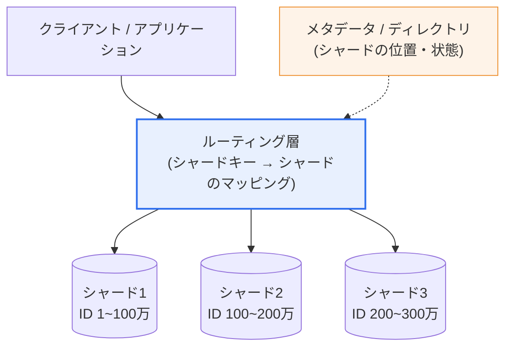
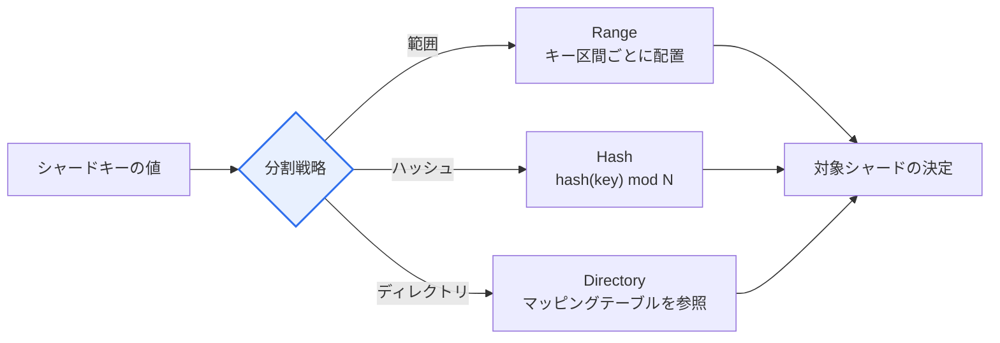

# データベースシャーディング(Sharding)

## 1. 概要

### A. 定義
> **シャーディング(Sharding)** とは、大容量データを複数の**独立したデータベース(シャード、Shard)に水平分割(Horizontal Partitioning)**して保存することで、単一データベースの保存・処理負荷を複数のサーバに分散し、線形的な拡張性(Scale-out)を確保するデータ分散技法である。

シャーディングの中核的な発想は、「**1台のDBでは収まらないデータを複数台に分けて格納しよう**」というものである。サービスが成長してデータとトラフィックが急増すると、一つのデータベースサーバは記憶容量、CPU、メモリ、ディスクI/O、コネクション数など複数の資源で同時に限界に突き当たる。このときサーバの仕様を上げる**垂直スケーリング(Scale-up)**は初期には簡単であるが、高仕様のハードウェアほど価格が指数関数的に上昇し、物理的な上限(1台のサーバが持てるコア・メモリ)が明確であり、結局は単一障害点(SPOF)が残るという根本的な限界がある。

シャーディングはこの限界を**水平スケーリング(Scale-out)**によって乗り越える。データを**行(Row)単位で分割**して複数のサーバに分けて保存するため、安価なサーバを追加し続けることで容量と処理量をほぼ線形に増やせる。例えばユーザーデータをユーザーIDを基準に分け、1~100万はシャード1、100万~200万はシャード2に保存すれば、各シャードは全体の一部だけを担当するため個々の負荷が下がり、サーバを追加するほど全体の処理量が大きくなる。どのデータがどのシャードにあるかは、**シャードキー(Shard Key)**とそれに対するルーティング規則によって決定される。

ただしこの利点には代償が伴う。データが物理的に散らばるため、複数のシャードにまたがる照会・結合・集計が難しく、一つのトランザクションが複数のシャードにまたがると原子性の保証が複雑になり、シャード追加時にはデータの再分配(リバランシング)と運用管理の負担が大きくなる。したがってシャーディングは「もはや単一DBでは対応できないとき」に導入する最後の拡張手段であり、無分別な早期適用はかえって複雑さを増すだけだというのが実務の教訓である。

### B. 登場背景と必要性
シャーディングは、Webサービスが大衆化し、ユーザー・コンテンツのデータがテラバイトを超えるようになって本格化した。初期の大規模サービス(Google Bigtableの思想、FacebookのMySQLシャーディング、InstagramのPostgreSQLシャーディングなど)は、リレーショナルDBをアプリケーションレベルでシャーディングし、急増するトラフィックに対応した。今日ではこのパターンがNoSQL・NewSQL・クラウドのマネージドDBに組み込み機能として吸収され、開発者が低レベルの分散を直接実装しなくても拡張性を得られるよう進化している。

## 2. シャーディングの全体構造

シャーディングシステムは大きく三つの層で構成される。**ルーティング層**は、リクエストに含まれるシャードキーを見てどのシャードへ送るかを決定する。このルーティングを、アプリケーションコード内(クライアントサイド)、別のプロキシ/ミドルウェア(例: MySQLのProxySQL・Vitess、MongoDBのmongos)、あるいはDBエンジン内部のどこに置くかによってアーキテクチャが変わる。**シャード**群は互いに独立した(shared-nothing)DBインスタンスであり、それぞれが自らのデータ部分集合に対する保存・問い合わせを完結的に処理する。**メタデータ/ディレクトリ**は、どのキー範囲がどのシャードにあるか、各シャードの状態・レプリカの位置はどうかを管理し、ルーティングの根拠となる。

ここで重要な設計原則が**shared-nothing**である。各シャードが資源を共有せず独立していてこそ、あるシャードの負荷や障害が他のシャードへ伝播せず、真の線形拡張が可能になる。逆にシャード群が共用ストレージや共用ロックに依存すると、その箇所が新たなボトルネックとなり、シャーディングの利点が失われる。

ルーティング層を**どこに置くか**も、アーキテクチャの性格を決定する。第一に、**クライアントサイドルーティング**は、アプリケーションコードやDBドライバが直接シャードの位置を計算して当該シャードに接続する。中間ホップがないため遅延は低いが、シャードトポロジの変更をすべてのクライアントに反映しなければならず、デプロイの結合度が高い。第二に、**プロキシ/ミドルウェアルーティング**(mongos、ProxySQL、VitessのVTGateなど)は、アプリケーションとシャードの間にルーティング専用の層を置く。アプリケーションは単一のエンドポイントだけを知っていればよいため結合度が下がり、リシャーディングが透過的になるが、プロキシ層自体を冗長化・拡張しなければならない。第三に、**DBエンジン内蔵ルーティング**(Cassandraのコーディネーターノードなど)は、どのノードに接続してもリクエストが正しいノードへ転送されるため運用が単純である。規模が大きくなるほど、クライアントサイドからプロキシ・エンジン内蔵方式へ移行する傾向がある。

## 3. 分割(シャーディング)戦略とルーティング

分割戦略は「データをどのような規則でシャードに配置するか」を定めるものであり、各戦略は明確な長所と短所を持つ。

**A. 範囲ベース(Range)シャーディング。** シャードキーの値の区間ごとにデータを分ける(例: 日付2026-01はシャード1、2026-02はシャード2)。実装が直感的で、範囲問い合わせ(特定期間の照会)が少数のシャードにしか届かないため効率的という長所がある。しかし最新データに書き込みが集中する時系列サービスでは、「最後のシャード」にだけトラフィックが集中する**ホットスポット(Hot Spot)**が発生しやすい。例えばログ・注文データを生成時刻で範囲シャーディングすると、常に最新のシャード一つだけが忙しく、残りは遊んでいる状態となり、分散効果が崩れる。

**B. ハッシュベース(Hash)シャーディング。** シャードキーをハッシュ関数に入れて得られた値でシャードを決定する(例: `hash(user_id) mod N`)。キーの分布が均等になり、ホットスポットを避けやすいことが最大の長所である。一方、隣接するキーが異なるシャードに散らばるため、範囲問い合わせがすべてのシャードに分散して(scatter-gather)非効率であり、何よりも**シャード数Nが変わると(`mod N`)ほぼすべてのデータの所属が変わり、大規模な再分配が発生**する。

この再分配の急増問題を緩和するために、**コンシステントハッシュ法(Consistent Hashing)**が広く使われている。コンシステントハッシュ法は、キーとノードを一つのハッシュリング(0~2³²−1のような円形空間)上に配置し、各キーを時計回りで最も近いノードに割り当てる。ノードを追加・削除する際には隣接区間のデータだけが移動するため、再配置量は平均K/N(全キーK、ノードN)程度に限定される。さらに一つの物理ノードを複数の**仮想ノード(virtual node)**としてリング上に散らばらせれば、ノード間の負荷の偏りまで減らせる。DynamoDB・Cassandra系がこの原理を採用している。

具体的な数値で見ると違いは明らかである。ノードが4台のとき、単純な`mod 4`でノードを5台に増やすと、理論上全キーの約80%が所属シャードを変えなければならない(再配置の急増)。一方コンシステントハッシュ法では、新しいノードがリングの一区間だけを引き受けるため、平均して全体の約1/5(20%)程度しか移動しない。数億件規模では、この差が「無停止での拡張が可能かどうか」を分ける決定的な要素となる。

範囲シャーディングのホットスポットは、実際のサービスでよく観測される。例えば注文データを`order_id`(単調増加)の範囲でシャーディングすると、新規注文は常に最後のシャードにだけ蓄積され、そのシャードの書き込みIOPSだけが100%近くになり、残りのシャードはアイドル状態となる。これを避けるため、実務では連番キーの代わりにユーザーIDのハッシュを先頭に付けるなどキーを再設計したり、時間軸はパーティショニングで、負荷分散はハッシュシャーディングで分担させたりする混合戦略を用いる。

**C. ディレクトリベース(Directory)シャーディング。** 別のルックアップテーブル(ディレクトリ)に「どのキーがどのシャードにあるか」を明示的に管理する。マッピングを自由に変更できるため、再分配・特定顧客の隔離といった運用上の柔軟性が最も大きい。その代わり、すべての問い合わせがまずディレクトリを参照しなければならないため、ディレクトリ自体がボトルネック・単一障害点にならないようキャッシング・冗長化が必須である。特定の大口顧客(テナント)を専用シャードに分離するなど、きめ細かな配置が必要なSaaSで有用である。

三つの戦略は排他的ではなく、組み合わせて使われることもある。代表的には、超大規模サービスは「**論理シャード(仮想バケット)をディレクトリで物理シャードにマッピング**」する2段階構造を用いる。まずシャードキーをハッシュして数千個の固定された論理バケットのいずれかに入れ(均等分散)、そのバケットをどの物理サーバが担当するかをディレクトリで管理する。そうすれば物理サーバを増やす際に、データではなく「バケット担当表」だけを移せばよいため、オンラインリバランシングがはるかに容易になる。Instagramが初期にPostgreSQL上に数千個の論理シャードを置き、少数の物理サーバにマッピングしていた方式が、このパターンのよく知られた例である。

| 戦略 | 長所 | 短所 | 代表事例 |
|---|---|---|---|
| **範囲(Range)** | 範囲問い合わせが効率的、実装が単純 | ホットスポットが発生しやすい | HBase、MongoDB(range) |
| **ハッシュ(Hash)** | 均等分散、ホットスポットの緩和 | 範囲問い合わせが非効率、再分配の負担(→コンシステントハッシュ法) | Cassandra、DynamoDB |
| **ディレクトリ(Directory)** | 柔軟な配置・再分配 | ディレクトリのボトルネック・SPOFのリスク | カスタムシャーディング、一部のSaaS |

表だけでは選択基準が見えないため、実務上の含意を補足する。サービスの**支配的な問い合わせパターン**が戦略の選択を左右する。特定ユーザーのデータを繰り返し照会するワークロード(例: ソーシャルサービスの「自分のタイムライン」)はユーザーIDのハッシュシャーディングが有利であり、期間別のレポーティングが中心のワークロード(例: ログ分析)は範囲シャーディングが有利である。すなわち「どのキーで最も頻繁に照会するか」をシャードキーとし、**ほとんどの問い合わせが単一シャードで完結するよう**設計することが性能の鍵である。

## 4. シャーディングとパーティショニング・レプリケーションの違い

シャーディングとパーティショニングは「データを分ける」という点では同じであるが、**分ける範囲**が異なる。**パーティショニング(Partitioning)**は、一つのDBサーバ内で大きなテーブルを複数の論理パーティションに分割して管理・性能を改善するものであり、**シャーディング**は、その断片を完全に**複数の物理DBサーバへ分散**するものである。すなわちシャーディングは、水平パーティショニングを複数ノードへ拡張した概念と見ることができる。そのためパーティショニングは単一サーバの資源の限界は超えられないが、シャーディングはサーバを増やすことでその限界そのものを超える。

もう一つ区別すべき概念が**レプリケーション(Replication)**である。レプリケーションは同じデータを複数のサーバに**そのまま複製**して可用性と読み取り拡張を得るものであり、シャーディングは互いに**異なるデータ**を分けて格納し、書き込み・容量を拡張するものである。実際の大規模システムはこの二つを組み合わせる。各シャードをさらにレプリケーション(マスター-レプリカ)しておき、シャーディングで書き込み・容量を増やすと同時に、レプリケーションで各シャードの可用性と読み取り性能を確保するのが定石のアーキテクチャである。

例えば4個のシャードにそれぞれレプリカを2個ずつ置くと合計12個のインスタンスとなるが、書き込みは4個のマスターで4倍に拡張され、読み取りは12個のノードに分散され、どのマスターが落ちてもレプリカが昇格して可用性が維持される。このように「シャーディング(書き込み拡張)× レプリケーション(読み取り拡張・可用性)」の積で規模を拡大することが現代の大規模DBアーキテクチャの基本骨格であり、その分、管理すべきインスタンス数と運用の複雑さも積で増えるという点を併せて考慮しなければならない。

| 区分 | パーティショニング | シャーディング | レプリケーション |
|---|---|---|---|
| **データ** | 分割(同一サーバ内) | 分割(複数サーバ) | 複製(同一データ) |
| **物理的分散** | なし(1台のサーバ) | あり(複数サーバ) | あり(複数サーバ) |
| **主目的** | 管理・性能 | 書き込み・容量の拡張 | 可用性・読み取り拡張 |
| **複雑さ** | 低い | 高い(分散ルーティング・トランザクション) | 中程度(レプリケーション遅延・一貫性) |

## 5. 深化 — クロスシャード問題とマネージドDBによる自動化

シャーディング導入後に実務で直面する最も難しい問題は、**クロスシャード(Cross-shard)演算**と**リバランシング**である。

**クロスシャードの結合・集計。** 複数のシャードに散らばったデータを結合したり集計(COUNT、SUM、ORDER BY)したりするには、ルーティング層が関連するすべてのシャードに問い合わせを配り(scatter)、結果を集めてマージ(gather)しなければならない。このscatter-gatherでは、最も遅いシャードが全体の応答時間を左右し(テールレイテンシ)、シャード数に比例して資源消費が大きくなる。そのため実務では、一緒に照会されるデータを同じシャードに集める**データコロケーション**(例: 一つの注文とその注文明細を同じorder_idのシャードに配置)や、照会専用にあらかじめ集計・非正規化したビューを置く設計によって、クロスシャード演算そのものを減らす。

**分散トランザクション。** 一つのトランザクションが複数のシャードを更新しなければならない場合、2相コミット(2PC)のような分散トランザクションが必要となるが、これは性能低下とコーディネーター障害のリスクが大きい。そのため多くのシステムは強い原子性を放棄し、**Saga(サーガ)パターン**のように各段階を補償トランザクションで巻き戻す結果整合性モデルを選択する。これはCAP定理のトレードオフ(分散環境における一貫性と可用性の折衷)を実務に反映した結果である。

**リバランシング。** シャードを追加するとデータの一部を新しいシャードへ移さなければならないが、このときサービスを停止せずに(オンラインで)データを移動しマッピングを更新することは難しい。前述のコンシステントハッシュ法や、論理シャード(仮想バケット)を物理シャードにマッピングする技法(例: MongoDBのchunk、Vitessのvindex)によって、移動範囲を局所化する。

**マネージド・分散DBによる自動化。** 今日、この負担のかなりの部分は製品が吸収している。**MongoDB**はシャードキーに基づく自動チャンク分割・バランサーを内蔵し、**Cassandra**はコンシステントハッシュ法によってノード追加時に自動的に再分配する。**Vitess**(YouTubeがMySQL拡張用に開発、CNCF卒業)は、MySQLの上にシャーディング・ルーティング・リシャーディングを載せ、アプリケーションの変更を最小化する。**CockroachDB・Google Spanner**のようなNewSQLは、自動レンジ分割と分散トランザクション(TrueTimeなど)を提供し、開発者には単一のDBのように見せる。このようにシャーディングは、「開発者が直接実装する低レベル技術」から「プラットフォームが提供するマネージド機能」へと移行しつつある。

## 6. 考慮事項および示唆(技術士の観点)

1. **シャードキーの設計が成否を左右する。** 特定のシャードにデータ・トラフィックが集中するホットスポットを避けるには、カーディナリティが高く、均等に分散され、支配的な照会パターンと整合するキーを慎重に選ばなければならない。誤って選んだシャードキーは後から変更することが非常に難しい(全面的な再分配)ため、初期設計段階の中核的な意思決定である。

2. **クロスシャード演算を最小化するデータモデリング。** 一緒に照会・更新されるデータを同じシャードに集めるコロケーション、非正規化、照会専用の集計テーブルなどにより、ほとんどの問い合わせが単一シャードで完結するよう設計しなければならない。これは正規化原則とのトレードオフであるため、ドメインの特性に合わせて均衡を取る。

3. **一貫性・トランザクション戦略の選択。** 分散環境では、強い一貫性(2PC)と可用性・性能(結果整合性・Saga)の間のCAPトレードオフが避けられない。決済のように強い整合性が必要な領域と、統計のように遅延を許容できる領域を区別し、一貫性レベルを差別化して適用する戦略が現実的である。

4. **運用・オブザーバビリティと導入時期。** シャーディングは、バックアップ・監視・スキーマ変更・障害対応がすべて倍増する運用の複雑さを伴う。したがって垂直スケーリング・読み取りレプリカ・キャッシュでまず持ちこたえ、本当に単一の書き込みノードが限界に達したときに導入する段階的アプローチが望ましい。導入時には、マネージド・分散DBに低レベルの負担を委ねる選択肢を優先的に検討する。

5. **拡張戦略の進化の方向。** NoSQL・NewSQL・サーバーレスDB(Aurora・Spanner・CockroachDB)が自動シャーディング・リバランシング・分散トランザクションを標準提供するようになり、アプリケーションが直接シャーディングする負担は徐々に減少する傾向にある。技術士の観点では、「直接実装 vs マネージドへの委任」のコスト・柔軟性のトレードオフを、データ規模・チームの能力・コスト構造に合わせて判断することが核心である。

## 参考資料
- MongoDB Sharding公式ドキュメント: https://www.mongodb.com/docs/manual/sharding/
- Vitess(Scalable MySQL)ドキュメント: https://vitess.io/docs/
- AWS "Database sharding" 概念説明: https://aws.amazon.com/what-is/database-sharding/

---

> **一言まとめ**: シャーディングとは、*大容量データを複数のDBサーバに水平分割*して書き込み・容量を線形に拡張(Scale-out)する技法であり、範囲・ハッシュ(コンシステントハッシュ法)・ディレクトリ戦略とシャードキーの設計が性能を左右する。単一サーバ内のパーティショニングや同一データのレプリケーションとは区別され、クロスシャード演算・分散トランザクション・リバランシングの管理が中核的な課題である。
