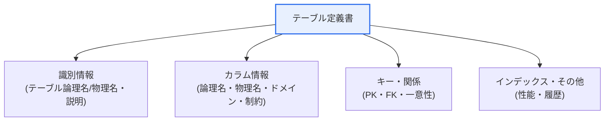
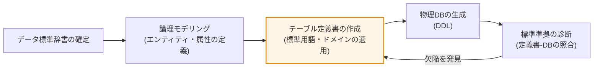
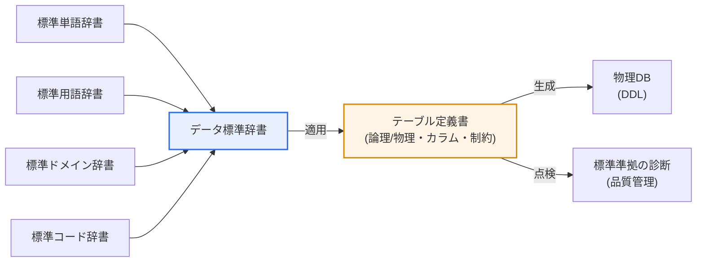

# 公共機関データベース標準化指針 — テーブル定義書

## 1. 概要

### A. 概念
> **テーブル定義書**とは、データベース標準化指針に従い、**テーブルの構造・意味・制約条件を標準様式で文書化**した設計成果物であり、DB構築・保守・品質管理・データ連携の基準となる中核的なメタデータ文書である。

テーブル定義書が重要である理由は、「**データベースの設計意図を公式記録として残し、一貫性とコミュニケーションを保証する**」という点にある。公共機関では、複数の部署・複数の事業者が数年にわたってシステムを作り、改修する。もし標準なしに各自がテーブルを作れば、同じ意味を持つ「住民登録番号」カラムを、あるシステムは`RESIDENT_NO CHAR(13)`、別のシステムは`JUMIN VARCHAR(20)`というように、ばらばらに定義することになる。このように名称・型・長さが食い違うとデータが錯綜し、機関間の連携や統合照会が事実上不可能になる。実際、行政情報の共同利用や公共データの開放において最大の障害となっているのが、まさにこの「標準の不一致」である。

標準化指針はこれを防ぐため、用語・ドメイン・コードをまず標準化し、その結果をテーブル定義書のような標準成果物として記録させる。テーブル定義書を見れば、誰でもそのテーブルが何を格納し、各カラムがどのような意味・形式・制約を持つのかを即座に把握できる。これは開発者間のコミュニケーション、保守時の影響分析、データ品質診断の共通基準となる。すなわちテーブル定義書は、標準化指針が目指すデータの一貫性・相互運用性を現場で実現する文書であり、その後のメタデータ管理とデータガバナンスの出発点である。[[data-standardization]]

### B. 登場背景と制度上の位置付け
公共部門のデータ標準化は、個々の機関の自主性に任せていては達成が難しい。そのため韓国政府は「公共機関のデータベース標準化指針」や「公共データ管理指針」などを通じて、データ標準(用語・ドメイン・コード)の定義と、それを反映した設計成果物の作成を制度的に求めてきた。標準化指針の体系において、テーブル定義書はデータ標準辞書(標準単語・標準用語・標準ドメイン・標準コード)を実際の物理設計に適用した**成果物**の位置を占める。

こうした流れは、データ3法の改正と公共データ法の施行以降、さらに重要になった。データが「開放・連携・活用」の対象となったことで、各機関のテーブルが標準を守って設計されていてこそ、初めてデータセットを信頼性をもって公開し、他機関と連携できるからである。標準化されたテーブル定義書が蓄積されれば、それがそのまま機関のメタデータ資産となり、データカタログ・品質管理の土台となる。

## 2. テーブル定義書の記録項目

テーブル定義書は、一つのテーブルに対する「設計仕様書」である。以下の全体構造図は定義書が扱う情報の大きな系統を、続く詳細図は標準辞書が定義書にどのように反映されるかを示している。

定義書の識別情報は、そのテーブルが何であるかを規定する。**テーブル論理名(ハングル名)**は業務上の意味が表れる標準用語でなければならず、**テーブル物理名(英字名)**は標準略語・命名規則に従って作成した実際のDBMS上の名前である。例えば論理名「ユーザー基本情報」は、物理名`TB_USER_BASE`のように接頭辞・標準単語の組み合わせ規則に従う。これにテーブルが保存するデータの用途と範囲を記述した**説明**が付き、このテーブルを初めて見る人でも文脈を理解できるようにする。

カラム情報は定義書の中核である。各カラムについて、論理名・物理名とともに**ドメイン(データ型・長さ・形式)**を標準辞書から取り出して適用する。ドメイン標準があれば「金額」は常に`NUMBER(15)`、「有無」は常に`CHAR(1)`のように統一され、同じ性格のデータがシステムごとに異なる事態を防ぐ。また各カラムの**制約条件**(NOT NULL、デフォルト値、CHECKなど)と**キー情報**(PK・FK・一意性)を明記し、データ完全性の規則を文書として確定する。

| 項目 | 内容 | 標準化との連携 |
|---|---|---|
| **テーブル論理名** | 業務上の意味が表れる標準用語 | 標準用語辞書 |
| **テーブル物理名** | 標準略語・命名規則に基づく実際の名前 | 標準単語・略語辞書 |
| **テーブル説明** | 保存データ・用途 | — |
| **カラム一覧** | カラムの論理・物理名、ドメイン(型・長さ) | 標準用語・標準ドメイン |
| **キー情報** | 主キー(PK)・外部キー(FK)・一意性 | 完全性規則 |
| **制約条件** | NOT NULL・デフォルト値・CHECK制約 | ドメイン制約 |
| **標準コード** | コード性カラムの許容値 | 標準コード辞書 |
| **インデックス** | 性能のためのインデックス定義 | 物理設計 |

### A. データ標準辞書 — 定義書の材料
テーブル定義書は無から作られるのではない。その材料は、標準化指針が先に確定する四つの**データ標準辞書**である。**標準単語**は名前を付ける最小単位であり、「登録/日付/金額/有無」のように、それ以上分割できない業務語彙とその英字略語(REG、DT、AMT、YNなど)を定義する。**標準用語**はこれらの単語を組み合わせた実際のカラム・項目名(例: 登録日付=REG_DT)であり、**標準ドメイン**は用語が持つデータ型・長さ・形式(例: 「日付」ドメイン=`DATE`または`CHAR(8)`)を規定する。最後に**標準コード**は、コード性項目の許容値の集合(例: 性別=`M/F`)を定める。

この四つの辞書が互いに噛み合っているため、定義書の作成者はカラム名を創作するのではなく、辞書から「組み立てる」。その結果、どのシステムにおいても「登録日付」は同じ名前・同じ型で現れる。これが、標準化がデータの一貫性を保証する根本原理であり、テーブル定義書はこの辞書適用の最終成果物である。

### B. 作成・検証手順
テーブル定義書は通常、論理モデリングから物理モデリングへ移行する段階で作成され、その後物理DBの生成と品質点検へと続く。以下の手順は、標準辞書の確定から品質診断までの流れを示している。

## 3. 作成指針(原則)

テーブル定義書は、個人の感覚ではなく、標準化指針が定めた規則を機械的に守ったときに初めて価値を持つ。作成の第一原則は**標準用語・単語の遵守**である。カラム名は任意に付けず、標準単語(例: 「日付」、「金額」、「有無」)と標準用語を組み合わせて作る。そうすれば「登録日」、「登録日付」、「登録日時」のように、意味は同じなのに表記が異なるカラムが乱立するのを防げる。

第二の原則は**ドメイン・コード標準の適用**である。データ型と長さは必ず標準ドメインに従い、コード性の値(例: 性別・処理状態)は標準コード値を使用する。これは、後で機関間のデータを統合する際に、値の形式と意味が食い違わないようにするための安全装置である。第三の原則は**論理-物理マッピングの一貫性**であり、ハングルの論理名と英字の物理名を1:1で対応させ、そのマッピング規則を全システムに同一に適用する。最後に、標準と設計は時間とともに変化するため、変更時には必ず**履歴・バージョンを管理**し、いつ何がなぜ変わったのかを追跡できなければならない。

| 指針 | 内容 | 違反時の問題 |
|---|---|---|
| **標準用語の遵守** | 標準単語・用語辞書に基づく命名 | 同義語カラムの乱立 |
| **ドメインの適用** | 標準データ型・長さの使用 | 型の不一致による連携失敗 |
| **標準コードの使用** | 共通コード値の適用 | 値の意味解釈の誤り |
| **論理-物理マッピング** | ハングル論理名 ↔ 英字物理名の一貫性 | 設計と実装の乖離 |
| **履歴管理** | 変更履歴・バージョン管理 | 変更の追跡が不可能 |

## 4. 事例と実務上の含意

標準準拠の有無が実際にどのような違いを生むかを例示すると、次のとおりである。A機関とB機関がそれぞれ民願(住民申請)システムを構築したが、標準を守ったA機関は「処理状態」カラムを標準コード(`01:受付, 02:処理中, 03:完了`)と標準ドメイン(`CHAR(2)`)で定義した。一方、標準を守らなかったB機関は、同じ概念を`STATUS VARCHAR(10)`に「受付」、「進行」、「done」といった自由な文字列で格納した。両機関のデータを連携・統合する際、A機関のデータはそのままマッピングされるが、B機関のデータは値のクレンジング(cleansing)とマッピングテーブルを新たに作成しなければならず、その過程で漏れ・誤分類が発生する。このようにテーブル定義書の標準準拠は、連携コストとデータ品質に直接的な影響を与える。

この事例が示す教訓は、標準化の利得が「設計時点のわずかな規律」によって「統合時点の大きなコスト」を防ぐことにあるという点である。標準を守ったA機関は、定義書作成の段階で標準辞書を参照する手間をかけただけだが、その見返りとして連携時のマッピング・クレンジング作業がほとんど発生しない。逆にB機関が節約した初期の手間は、後になってクレンジングスクリプトの開発、マッピングテーブルの維持、誤分類の検証という何倍ものコストとなって返ってくる。データが多くの機関を行き来するほどこの格差は指数関数的に大きくなるため、標準準拠は「文書の形式」ではなく、「総所有コスト(TCO)を下げる投資」として理解すべきである。

また品質管理の観点では、データ品質診断は実際のDBのカラムと、テーブル定義書・データ標準との一致を点検する。定義書では`NOT NULL`となっているのに実データに欠損があったり、標準コードでない値が保存されていたりすれば、「標準不遵守」の欠陥として指摘される。したがってテーブル定義書は文書で終わるのではなく、品質測定の基準線(baseline)の役割を果たす。データモデリングツール(例: 標準化管理ソリューション)を使えば、標準辞書違反を設計段階で自動点検し、モデル・定義書・実際のDDLの一貫性を継続的に維持できる。

## 5. 深化 — データガバナンス・開放との連携

テーブル定義書は単一の成果物を超えて、組織全体のデータガバナンス体系へと拡張される。個々のテーブル定義書が蓄積されれば、それがそのまま機関の**メタデータリポジトリ**となり、そこにデータの出所・担当者・活用履歴を加えれば**データカタログ**へと発展する。最近の公共部門は、こうしたメタデータに基づいてデータマップを構築し、機関が保有するデータを一目で把握し、必要なデータを探して連携・開放するための基盤としている。すなわち、よく作成されたテーブル定義書は、公共データポータルを通じた開放と、マイデータ・行政情報共同利用の礎となる。[[public-db-standardization]]

さらに国際的にも、こうした発想はISO/IEC 11179(メタデータレジストリ)標準と通じている。この標準は、データ要素を明確な名前・定義・値ドメインで登録・管理するよう規定しており、韓国の公共標準化指針における標準単語・用語・ドメイン・コードの体系は、まさにこの原理を国内の実務に実装したものである。したがってテーブル定義書の作成は、単なる国内の行政手続きではなく、国際標準が目指す「データの意味を機械と人間がともに理解できるよう登録・管理する」という原則の現場適用と見ることができる。

技術士試験の観点では、このテーマは「データベース」および「公共データ・データ品質」の領域で、データ標準化・メタデータ・データガバナンスとまとめて出題される傾向がある。答案構成の際には、① テーブル定義書の定義と標準化指針内での位置付け、② 記録項目と標準辞書(単語・用語・ドメイン・コード)との連携、③ 作成指針と違反時の問題、④ 品質診断・連携における実務上の含意、⑤ データカタログ・ガバナンスへの拡張までを階層的に展開すれば、単なる項目の羅列を超えた深さを示すことができる。

## 6. 考慮事項および示唆

1. **標準と成果物の整合性が鍵である。** テーブル定義書は、データ標準(用語・ドメイン・コード)を忠実に反映してこそ意味がある。標準辞書と定義書、実際のDDLが互いに食い違えば品質診断で欠陥として指摘されるため、三つの層の一貫性を継続的に検証する体制が必要である。
2. **自動化ツールで一貫性を確保する。** カラム数百・テーブル数千の規模では、手作業による点検は不可能である。データモデリング・標準化管理ツールを活用して標準違反を設計段階で自動点検し、モデル・定義書・物理DBの整合性を自動的に維持・レポーティングしなければならない。
3. **データガバナンスの基盤として活用する。** テーブル定義書などの標準成果物が蓄積されれば、メタデータ・データカタログ・データマップへと発展する。これを公共データの開放・連携・品質管理の土台とする戦略的な観点が求められる。
4. **変更管理とガバナンス体制を並行させる。** 標準とテーブルは業務の変化に応じて変わる。変更要求・承認・反映・履歴管理の手順(データ標準管理プロセス)と責任組織(データ管理者・標準管理者)を明確に置いてこそ、標準が時間が経っても崩れない。
5. **個人情報・セキュリティ標準と連携する。** 公共のテーブルには住民登録番号などの機微情報が含まれるため、テーブル定義書の段階で個人情報項目を識別・表記し、暗号化・マスキングの対象を指定して、設計時点からプライバシー保護(Privacy by Design)を反映しなければならない。

## 参考資料
- 公共データポータル(data.go.kr) — 公共データ提供・標準の案内: https://www.data.go.kr
- 行政安全部 公共データ管理案内(公共データ制度): https://www.mois.go.kr

---

> **一言まとめ**: テーブル定義書とは、*標準化指針に従ってテーブルの構造・意味・制約を標準様式で文書化*した成果物であり、論理/物理名・カラム・キー・制約を標準単語・用語・ドメイン・コードに合わせて作成することでデータの一貫性・相互運用性を実現し、メタデータ・データガバナンスの基盤となる。
