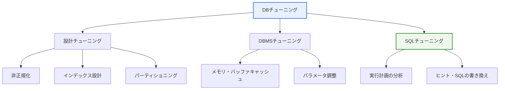

# データベースチューニング(Database Tuning)

## 1. 概要

### A. 概念と目的

> **データベースチューニング**とは、データベースの**性能低下の原因を診断し、設計・DBMS・SQLの複数の階層で最適化することで、応答時間(response time)とスループット(throughput)を改善**する活動である。データ容量が大きくなり同時利用者が増えるほど、その必要性は高まる。

DBチューニングが重要である根本的な理由は、「**同じデータ・同じハードウェアであっても、どのように設計し問い合わせるかによって性能が数十~数百倍も異なる**」という点にある。データが少ないうちは問題なく動いていたシステムも、データが蓄積しユーザーが集中すると応答が急激に遅くなり、サービス障害につながる。このとき闇雲にサーバを増やすハードウェア増設(スケールアップ)はコストが大きく、根本的な解決にはならない。インデックスがないために100万件のテーブルを毎回すべて走査していた(全件テーブルスキャン)問い合わせに適切なインデックスを作成すれば、同じ問い合わせが数千件だけを読んで終わり、応答は一瞬で速くなる。資源(ハードウェア)はそのままで、性能が飛躍的に改善されるのである。

チューニングの目的を性能指標として具体化すると、二つの軸に分かれる。一つは個々の問い合わせがどれだけ速く終わるかを見る応答時間であり、もう一つは単位時間当たりどれだけ多くのトランザクションを処理するかを見るスループットである。オンライン取引(OLTP)では短い応答時間が、大量バッチ・分析(OLAP)では高いスループットがより重要である。目的が異なればチューニングの方向も変わるため、チューニングに先立って「何を改善するのか」という目標を明確に定義することが第一歩である。目標のないチューニングは、一方を改善して他方を犠牲にするという罠に陥りやすい。

### B. チューニングの対象階層

チューニングは大きく三つの階層からアプローチする。第一に、**設計チューニング**は、テーブル構造・インデックス・パーティショニングなど、データ構造そのものを性能に有利なものにすることであり、最も根本的であるが、既に運用中のシステムでは変更コストが大きい。第二に、**DBMSチューニング**は、メモリ割り当て・バッファキャッシュ・各種パラメータを調整し、DBMSエンジンの資源活用を最適化する。第三に、**SQLチューニング**は個々の問い合わせ文とその実行計画を改善することであり、変更範囲が狭くリスクが小さい一方で効果が大きく、費用対効果が最も高い。実務では少数の非効率なSQLが全体負荷の大部分を占めることが多いため、この「問題SQL」を見つけて改善することがチューニングの核心となる。

## 2. チューニングの階層と全体構造

DBチューニングはどこか一か所を直す単発の作業ではなく、診断→分析→改善→検証を繰り返す循環プロセスである。以下の構造図は、三つの階層と各階層の代表的な技法を示している。

三つの階層は相互補完的である。いくらSQLを上手く書いてもインデックスがなければ限界があり、インデックスがあってもバッファキャッシュが不足すればディスクI/Oがボトルネックになる。ただし改善の優先順位は、おおむね「**診断で問題SQLを特定 → SQL・インデックスのチューニング → 必要に応じて設計・DBMSのチューニング → 最後にハードウェア増設**」の順序が経済的である。リスクとコストの小さいものから手を付けるのが原則だからである。

### A. チューニングプロセス: 測定と診断

チューニングは「勘」ではなく「データ」で行わなければならない。ボトルネックを正確に見つけられないままあちこちに手を付けると、効果のない変更ばかりが積み重なり、かえって副作用を生む。そのためチューニングの出発点は常に測定と診断である。代表的なツールが実行計画(Execution Plan)である。実行計画とは、オプティマイザ(Optimizer)が問い合わせを処理するために立てた処理経路であり、どのインデックスを使うか、結合をどの方式・順序で行うか、予想処理件数はどれくらいかを示す。

診断で注目すべきシグナルはいくつかに絞られる。大容量テーブルに対する全件テーブルスキャン(Full Table Scan)、インデックスを作ってあるのに使われない現象、結合順序が逆転して中間結果が肥大化するケース、そして統計情報が古くなりオプティマイザが実際のデータ分布を誤って推定するケースなどである。これにSQLトレースやAWR・性能ビューといったツールで、どのSQLが資源(CPU・I/O・時間)を多く消費しているかを順位付けすれば、改善効果の大きい上位の問い合わせから集中的に扱うことができる。このように「測定→上位の問題の特定→改善→再測定」の循環がチューニングの骨格である。

## 3. 設計段階のチューニング技法

設計段階のチューニングは、データ構造そのものを性能に有利なものにすることであり、最も根本的で効果が大きいが、その分慎重でなければならない。既にデータが蓄積された運用システムで構造を変更することは、マイグレーションコストと整合性のリスクを伴うからである。

| 技法 | 内容 | トレードオフ |
|---|---|---|
| **非正規化** | 結合を減らすために意図的に重複を許容(照会性能↑) | 更新時の整合性管理の負担↑ |
| **インデックス設計** | 頻繁に照会するカラムにインデックスを作成 | 挿入・更新時のインデックス更新コスト↑ |
| **パーティショニング** | 大きなテーブルを分割してアクセス範囲を縮小 | パーティションキーの設計に失敗すると効果なし |
| **適切なデータ型** | サイズ・形式の最適化で保存・I/O効率↑ | 過度な縮小は拡張性を阻害 |

### A. 非正規化(Denormalization)

非正規化は、正規化によって細かく分けられたテーブルを、照会性能のために意図的に再び統合したり、重複カラムを置いたりする技法である。正規化はデータの重複を排除して整合性を高めるが、照会のたびに複数のテーブルを結合しなければならず、大量照会ではコストが大きくなる。例えば注文一覧画面で毎回顧客・商品テーブルを結合して名前を取得しなければならないなら、注文テーブルに顧客名・商品名を重複保存して結合をなくすことができる。ただしこれは、元データが変わると重複分も併せて更新しなければならない負担を生むため、「照会は頻繁で更新はまれな」データに選別的に適用すべきである。非正規化は照会性能と整合性管理コストの間の明白なトレードオフであり、無分別な適用はデータ不整合というより大きな問題を招く。

### B. インデックス設計

インデックスは本の索引のようにデータの位置を素早く見つけられるようにする構造であり、ほとんどがB-木(B-Tree)の形をとる。インデックスがあれば条件に合う少数の行だけを選んで読むため、全体を走査するフルスキャンに比べて照会が劇的に速くなる。インデックス設計で重要な概念が、カーディナリティ(cardinality、値の多様性)と選択性(selectivity)である。性別のように値の種類が少ない(カーディナリティが低い)カラムはインデックスの効果が小さく、住民番号・口座番号のように値がほぼ一意なカラムはインデックスの効果が大きい。複数のカラムをまとめる複合インデックスではカラムの順序が重要であり、条件によく使われ選択性の高いカラムを先頭に置くべきである。インデックスだけで問い合わせを処理する(テーブルにアクセスせずインデックスだけを読む)カバリングインデックス(covering index)は、追加の性能上の利点をもたらす。

### C. パーティショニング(Partitioning)

パーティショニングは、一つの大きなテーブルを、論理的には一つのまま物理的には複数の断片に分ける技法である。例えば数年分の注文データを月別にパーティション化すれば、特定の月のデータを照会する際に該当パーティションだけにアクセスし、残りは読み飛ばす(パーティションプルーニング、partition pruning)。範囲(Range)・リスト(List)・ハッシュ(Hash)などの分割基準を、ワークロードに合わせて選ぶ。パーティショニングの効果はパーティションキーとクエリ条件が一致するときに最大化され、条件がパーティションキーを使わなければすべてのパーティションを探索することになり、効果が失われる。また古いパーティションを丸ごと削除・アーカイブしやすいため、大容量の履歴データ管理にも有利である。

### D. DBMS階層のチューニング(メモリ・資源)

設計・SQLチューニングが「何をどのように読むか」を扱うのに対し、DBMS階層のチューニングは「読み込んだデータをどれだけ効率的に保持しておくか」を扱う。核心はメモリとディスクI/Oの均衡である。DBMSは頻繁に使うデータブロックをバッファキャッシュ(buffer cache)に載せてディスクアクセスを減らすが、このキャッシュが不足すると、既に読んだデータを繰り返しディスクから読み直さなければならず(キャッシュミス)、性能が低下する。逆に無制限に大きくすることもできないため、キャッシュヒット率(cache hit ratio)などの指標を見ながら適正なサイズを見つけることがDBMSチューニングの要諦である。

ソート・ハッシュ結合のように中間作業領域が必要な演算は、作業メモリ(sort/hash area)が不足するとディスクに一時領域を作って処理する(ディスクソート)が、これはメモリ内処理よりはるかに遅い。したがって大量のソート・集計が頻繁なバッチ系ワークロードでは、作業メモリを十分に確保するのが有利である。このようにDBMSのパラメータチューニングは、ワークロードの性格(OLTPかOLAPか)に合わせてメモリ・並列度・コミット方式などを調整する作業であり、アプリケーションコードに手を入れずに全般的な性能を引き上げられるという長所がある。ただしパラメータ一つがシステム全体に影響するため、本番環境に反映する前に十分な負荷テストで検証しなければならない。

## 4. SQLチューニングとオプティマイザ・ヒント

SQLチューニングは問い合わせ文と実行計画を改善する活動であり、変更範囲が狭くリスクが小さい一方で効果が大きいため、チューニングの中核である。ここで中心的な役割を果たすのがオプティマイザである。現代のDBMSのほとんどはコストベースオプティマイザ(CBO、Cost-Based Optimizer)を使っており、これは統計情報(テーブル件数、カラム値の分布など)を根拠に複数の処理経路のコストを推定し、最も安価な経路を選ぶ。したがって統計情報が実際のデータとずれると、オプティマイザは的外れな計画を立てる。データが大量に変更された後に統計情報を更新しなかったために性能が急落する事例がよくあるのは、このためである。

オプティマイザが常に最適な経路を見つけるわけではない。統計の不正確さ、複雑な結合、偏ったデータ分布などによってオプティマイザが誤った計画を立てた場合、開発者が**ヒント(Hint)**で実行方式を直接指示して正す。ただしヒントはオプティマイザの判断を強制的に上書きするものであるため、データ分布が変わるとかえって毒になりうるので、乱用は禁物である。可能であれば統計情報の更新・SQLの書き換えによってオプティマイザが自ら良い計画を立てるよう誘導し、ヒントは最後の手段として使うのが望ましい。

| ヒントの類型 | 内容 | 使用する文脈 |
|---|---|---|
| **アクセスパス** | インデックスの使用/不使用を指定(INDEX、FULL) | オプティマイザがインデックスを使わない、または誤って使うとき |
| **結合方式** | 結合方法を指定(Nested Loop、Hash、Sort Merge) | データサイズに合った結合を強制 |
| **結合順序** | テーブルの結合順序を指定(ORDERED、LEADING) | 中間結果を小さく保ちたいとき |
| **並列処理** | 並列実行を指定(PARALLEL) | 大量バッチ・集計でスループット↑ |

### A. 結合方式とSQLの書き換え(具体的事例)

結合方式の選択は、データ規模に応じて性能を大きく左右する。小さなテーブルと、インデックスが適切に張られた大きなテーブルを結合する場合は、Nested Loop結合が有利である。一方、両方とも大容量であれば、一方をハッシュテーブルにしてマッチングするHash結合の方がはるかに速い。オプティマイザが統計の誤りにより大容量の結合でNested Loopを選び、問い合わせに数十分かかっていたものを、Hash結合のヒントに変えて数秒に短縮するのが、典型的なチューニング事例である。

SQLの書き換えも強力な技法である。例えば相関サブクエリ(行ごとにサブクエリを繰り返し実行)を結合に変えたり、インデックスカラムに関数をかけて(`WHERE SUBSTR(col,1,2)='AB'`)インデックスが無効化されていた条件を、関数なしで(`WHERE col LIKE 'AB%'`)書き直してインデックスが使われるようにしたりする。このように「結果は同じだが、オプティマイザがより良い計画を立てられるように」問い合わせを整えることが、SQLチューニングの本質である。

## 5. 深化: インデックスの二面性と実務上のチューニング戦略

インデックスはしばしば「チューニングの万能キー」とみなされるが、実務で最も誤解の多い点でもある。インデックスは照会(SELECT)を速くする代わりに、挿入・更新・削除(INSERT/UPDATE/DELETE)のたびにインデックスも併せて更新しなければならないコストを誘発する。一つのテーブルにインデックスを五つ張っておくと、そのテーブルに行を一つ入れるたびに五つのインデックスをすべて更新しなければならず、書き込み性能が大きく低下する。したがって照会が圧倒的に多いテーブルではインデックスを積極的に使い、書き込みが頻繁なテーブルでは本当に必要なインデックスだけを選別しなければならない。「インデックスは多いほど良い」という通念は誤りであり、使われていないインデックス(unused index)は記憶領域と書き込みコストを消耗するだけなので、定期的に点検して削除しなければならない。

実務上のチューニング戦略を整理すると次のとおりである。第一に、パレートの法則に従い、全体負荷の大部分を占める上位少数のSQLに集中する。性能ビューで資源消費上位の問い合わせを抽出して改善すれば、少ない労力で大きな効果が得られる。第二に、統計情報を最新に保つ。大量のデータ変更・ロードの後には必ず統計を更新し、オプティマイザが正しい判断を下せるようにする。第三に、チューニングの前後を必ず定量的に比較する。実行計画・応答時間・論理読み取りブロック数を改善前後で測定して効果を検証し、副作用(他の問い合わせの性能低下)がないかを確認する。第四に、アプリケーション層の問題も併せて見る。N+1クエリ(ループの中で問い合わせを一件ずつ発行するアンチパターン)やコネクションプールの不足はDBチューニングだけでは解決しないため、アプリケーションとDBを統合的に診断しなければならない。

## 6. 考慮事項および示唆

技術士の観点では、DBチューニングは断片的な技法の羅列ではなく、診断に基づく体系的・経済的な性能管理戦略としてアプローチしなければならない。

1. **測定・診断がチューニングの出発点である。** 実行計画の分析・SQLトレース・性能ビューでボトルネック(遅い問い合わせ・フルスキャン・統計の誤り)を正確に見つけてから手を付けなければならない。勘によるチューニングは効果がないか、副作用を生む。「測定しなければ改善できない」という原則がチューニング全般を貫いている。

2. **インデックスは諸刃の剣である。** 照会は速くなるが更新の負担が増えるため、照会・更新のパターンとカーディナリティ・選択性を総合して、本当に必要なインデックスだけを選別しなければならない。過剰なインデックスは書き込み性能を損ない、未使用のインデックスは資源を浪費するだけなので、定期的な点検が必要である。

3. **ハードウェア増設よりもチューニングを優先する。** 非効率(フルスキャン・非効率なSQL)を放置したままサーバだけを増やせば、コストだけが膨らみ、すぐに限界に突き当たる。SQL・インデックスのチューニングで資源を最大限に活用した後、それでも不足する場合に増設するのが経済的である。特にクラウド環境では、非効率な問い合わせがそのまま課金(コンピューティング・I/Oコスト)に直結するため、チューニングの経済的価値はさらに大きい。

4. **統計情報とオプティマイザを管理する。** コストベースオプティマイザは統計情報に依存するため、大量変更後の統計更新を自動化・定例化し、オプティマイザが常に正確な判断を下せるよう維持しなければならない。ヒントは最後の手段として限定的に使い、根本的には統計・SQLの書き換えによってオプティマイザを誘導することが持続可能である。

5. **アプリケーションとDBを統合的に見る。** N+1クエリ・コネクションプール・キャッシュ戦略などアプリケーション層の要因は、DBチューニングだけでは解決しない。ORM使用時に発生する非効率なクエリ、不要な繰り返し照会などを併せて診断してこそ、全体の性能を根本的に改善できる。

## 参考資料

- Oracle Database SQL Tuning Guide: https://docs.oracle.com/en/database/oracle/oracle-database/
- Use The Index, Luke (インデックス・SQL性能): https://use-the-index-luke.com/

---

> **一言まとめ**: DBチューニングとは、*実行計画の分析に基づく診断でボトルネックを見つけ、設計(非正規化・インデックス・パーティショニング)・DBMS・SQL(問い合わせの書き換え・ヒント)の各階層で最適化する*活動であり、インデックスの照会・更新のトレードオフとオプティマイザの統計管理をバランスよく扱う、ハードウェア増設に先立つ経済的な性能改善策である。
