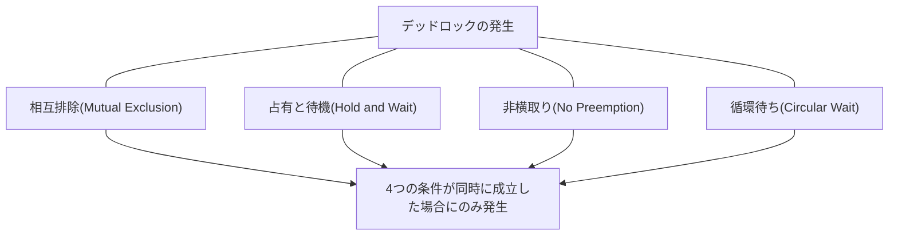
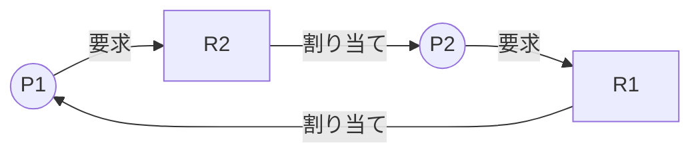
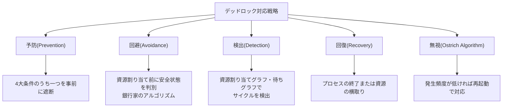

# デッドロック(Deadlock)

## 1. 概要

> **デッドロック(Deadlock)** とは、二つ以上のプロセス(またはスレッド・トランザクション)が、互いに占有している資源を無限に待ち続け、どちらも進行できずに永遠に停止している状態をいう。

マルチプログラミングと並行処理が普及するにつれ、一つのCPU・メモリ・入出力装置・データベースレコードといった有限な資源を、複数の実行フローが同時に分け合って使うことが日常となった。資源を効率的に共有するには、ある実行フローが資源を先に確保し、他のフローはしばらく待たせる**相互排除(mutual exclusion)**が必要であるが、まさにこの「待ち」が複雑に絡み合うと、誰も前に進めない循環待ちが生まれる。デッドロックは単なる性能低下ではなく、システムの一部または全体が停止する可用性の事故に直結するため、オペレーティングシステム・データベース・分散システムの設計において必ず扱わなければならない中核テーマである。

デッドロックが特に厄介な理由は、**非決定的(non-deterministic)**に発生するという点である。同じコードでも、スケジューリングの順序・タイミング・負荷によって、ある時は問題なく通過し、ある時は停止してしまう。テスト環境では再現されず、本番環境の高い同時実行性の下で断続的に発生する典型的な「ハイゼンバグ(Heisenbug)」であるため、事後の検出・回復だけでなく、設計段階での予防が重要である。技術士の観点では、発生条件を正確に理解し、予防・回避・検出・回復という四つの処理戦略のトレードオフを実務の文脈で説明できなければならない。

デッドロックは飢餓状態(Starvation)と区別しなければならない。デッドロックは関係するすべてのフローが互いを待って**永遠に**停止するのに対し、飢餓状態は特定のフローだけが後回しにされ続けて資源を得られない状態であり、残りは正常に進行する。ライブロック(Livelock)も区別の対象である。ライブロックは、フローが停止しているわけではないが、互いに譲り合いを繰り返すだけで実質的な進展がない状態である。三つの現象はいずれも「処理が終わらない」という症状は似ているが、原因と解決策が異なるため、診断段階で正確に見分けなければならない。

デッドロックの波及力は、システム規模が大きいほど大きくなる。実際、EC(電子商取引)の在庫引当、金融の口座振替、予約システムの座席確保のように、複数の資源を同時にロックするトランザクションが集中する瞬間に、デッドロックが集中的に発生する。このとき多数のトランザクションが連鎖的にロールバック・再試行され、応答遅延が急増し、最悪の場合はサービス全体が事実上停止する障害に発展する。したがってデッドロックは単一プロセスのバグではなく、**システムの可用性に直結するアーキテクチャレベルの関心事**として扱わなければならない。

## 2. デッドロック発生の4つの必要条件

デッドロックは、次の四つの条件が**同時にすべて**成立したときにのみ発生する(Coffmanの条件、1971)。すなわち、このうち一つでも崩せばデッドロックは原理的に起こりえず、これが予防(Prevention)戦略の理論的根拠となる。

**A. 相互排除(Mutual Exclusion)。** 資源は一度に一つのフローだけが排他的に使用できなければならない。プリンタや書き込みロックがかかったDBレコードのように、同時に共有できない資源がこれに該当する。読み取り専用で共有可能な資源(共有ロック)はこの条件を満たさないため、デッドロックの原因にはならない。すなわち相互排除は資源の本質的な性質であり、人為的に除去するのが最も難しい条件である。

**B. 占有と待機(Hold and Wait)。** あるフローが既にある資源を占有したまま、別のフローが持つ別の資源を追加で要求して待っている状況である。例えばプロセスP1が資源Aを確保した状態でBを要求し、P2がBを確保した状態でAを要求すると、互いに譲らずに膠着する。必要な資源を最初から一度にすべて確保させれば、この条件を崩すことができる。

**C. 非横取り(No Preemption)。** あるフローが占有した資源は、そのフローが自発的に返却するまで強制的に奪うことができない。もし優先度の高いフローが低いフローの資源を強制的に回収できる(横取り)なら、循環待ちが成立しても資源の回収によってデッドロックを解消できる。ただし、CPU・メモリのように状態の保存・復元が容易な資源は横取りしやすいが、プリンタ出力の途中やDBトランザクションの途中のように、横取りすると一貫性が崩れる資源は横取りが難しい。

**D. 循環待ち(Circular Wait)。** 待機関係をグラフで描いたときに、円形(サイクル)が形成される条件である。P1→P2→P3→…→P1の形で、各フローが次のフローの持つ資源を待つ閉ループが作られる。上の三つの条件が成立しても、この循環さえなければデッドロックは起こらないため、実務では「すべてのフローが資源を同じ順序でのみ獲得するよう強制」して、循環を原理的に遮断する方法が最も多く使われる。

これら四つの条件はすべて**必要条件**であり、四つがそろって初めて十分条件となる点が重要である。一つでも成立しなければ、デッドロックは決して発生しない。予防戦略が「四つのうち一つを崩す」ことに集中する理由がまさにここにある。例えば、相互排除のない純粋な読み取り専用データ、最初に必要な資源をすべて確保するバッチ処理、CPUのようにいつでも横取り可能な資源、グローバルな順番どおりにのみロックを取るコードは、それぞれ一つの条件を崩しており、構造的にデッドロックから自由である。

この四つの条件は、前の三つ(相互排除・占有と待機・非横取り)がデッドロックが**起こりうる環境**を作り、最後の循環待ちが実際にデッドロックを**発生**させる引き金になるという階層構造として理解するとよい。実際の事例として、銀行の口座振替ロジックで、口座A→Bの振替スレッドとB→Aの振替スレッドがそれぞれ相手の口座ロックを先に取ると、典型的な循環待ちが生まれる。実務では、口座番号の小さい方から先にロックをかける**資源の順序付け**によってこれを防ぐ。

## 3. 資源割り当てグラフ(Resource Allocation Graph)

デッドロックを視覚的に判別する代表的なツールが、**資源割り当てグラフ(RAG)**である。プロセス(円)と資源(四角形)を頂点とし、プロセスが資源を要求するとプロセス→資源(要求辺)、資源がプロセスに割り当てられると資源→プロセス(割り当て辺)の有向辺を描く。以下の図は、P1がR1を確保したままR2を要求し、P2がR2を確保したままR1を要求して、サイクル(P1→R2→P2→R1→P1)が形成されたデッドロック状況を示している。

中核となる判別規則は、資源のインスタンス数によって異なる。**各資源のインスタンスが一つずつであれば、グラフにサイクルが存在することがデッドロックの必要十分条件**である。一方、**資源に複数のインスタンスがあれば、サイクルはデッドロックの必要条件にすぎず、十分条件ではない。** サイクルがあっても、その資源の別のインスタンスをまもなく返却するプロセスがあれば、デッドロックではない可能性があるからである。そのため、インスタンスが一つしかないロックには単純なサイクル検出で十分であるが、インスタンスが複数ある資源プールには、銀行家のアルゴリズム系の精密な検出が必要である。待ちグラフ(Wait-for Graph)は、このRAGから資源の頂点を折りたたんで(collapse)プロセス間の待機関係だけを残した縮約形であり、DBMSのデッドロック検出器が実際に使用するデータ構造である。

## 4. デッドロックの処理技法

デッドロックへの対応は、発生を防ぐ静的な戦略(予防・回避)と、発生を許容した上で事後に対応する動的な戦略(検出・回復)に分かれる。これに、まったく無視するダチョウアルゴリズムまで加え、四つの軸で整理する。

**A. 予防(Prevention)。** 4大必要条件のうち一つを、設計段階で成立させないようにする最も強力な戦略である。相互排除は、スプーリング(spooling)のように資源を仮想化して共有可能にすることで緩和し、占有と待機は、必要な資源を一度にすべて要求させるか、何の資源も持っていないときにだけ要求させるよう強制する。非横取りは、追加の資源を得られなければ既に持っている資源を手放させ、循環待ちは、すべての資源にグローバルな順番を付けて昇順でのみ獲得させる。

四つの条件の遮断法のうち、実務で最も広く使われているのは、循環待ちを除去するための**資源の順序付け(グローバルなロック順序の指定)**である。相互排除は資源の物理的な本性であるため除去が難しく、占有と待機の一括要求は実際には使わない資源まで事前に確保して利用率を大きく下げ、非横取りの強制回収はトランザクションの一貫性を崩しやすいからである。一方、循環待ちの除去は「ロックは常に定められた順番の昇順でのみ取る」という規則一つで実装が単純で副作用も少ないため、ほとんどのアプリケーションのコーディングガイドがこの方式を採用している。

ただし予防は、確実である分、代償も大きい。必要になる資源を事前にすべて確保しておくと、実際に使っていない間も資源が遊んで利用率が下がり、グローバルな順序規則が複雑な大規模コードベースでは順序に違反する経路が紛れ込みやすいため、継続的な検証が必要である。したがって予防は、資源の種類が明確でロックの階層が整理されたシステムで特に効果的である。

**B. 回避(Avoidance)。** デッドロックが起こりうる条件は許容するが、資源を割り当てるたびに、その割り当てがシステムを**安全状態(safe state)**に保つかどうかを検査し、危険な割り当てを拒否する戦略である。安全状態とは、すべてのプロセスがデッドロックなしに完了できる資源割り当ての順序(安全系列)が少なくとも一つ存在する状態をいう。代表的な技法が、ダイクストラの**銀行家のアルゴリズム(Banker's Algorithm)**である。

回避の中核的な洞察は、予防のように条件そのものをなくして利用率を犠牲にすることなく、その都度「この割り当てをしても全員が無事に終われる道が残るか」だけを検査し、危険な瞬間にだけ待機を強制するという点である。おかげで資源をまとめて事前に確保する必要がないため、予防より利用率が高い。その代わり、各プロセスが今後必要とする資源の**最大要求量を事前に宣言**しなければならず、割り当てのたびに安全性検査(O(m·n²)程度)を実行しなければならないため、資源の種類・プロセス数が流動的な汎用OSよりも、それらが限定的で予測可能な組込み・リアルタイムシステムに適している。

**C. 検出(Detection)。** デッドロックを防がずに発生を許容した後、定期的にシステムの状態を検査してデッドロックの有無を判別する。資源のインスタンスが一つずつであれば**待ちグラフ(Wait-for Graph)**でサイクルを探し、複数であれば銀行家のアルゴリズムに類似した検出アルゴリズムを実行する。検査周期を短くすれば早く発見できるがオーバーヘッドが大きく、長くすれば発見が遅れ、その間待機中の資源が無駄になる。

検査のタイミングには二つの方式がある。資源要求が即座に満たされないたびに検査する方式は、デッドロックを発生と同時に捕捉でき、原因プロセスも特定しやすいが、検査頻度が高く負担が大きい。逆に一定の時間間隔や、CPU利用率が特定の閾値を下回ったときにだけ検査する方式はオーバーヘッドが低い代わりに、一つの検査周期内に複数のサイクルが絡み合い、どのプロセスが根本原因なのかを見分けにくくなる。データベース管理システム(DBMS)が代表的にこの検出方式を使っており、実務ではロック待機タイムアウトを併せて設定し、検出の失敗や遅延に備える。

**D. 回復(Recovery)。** 検出されたデッドロックを実際に解消する段階である。方法は二つある。一つは**プロセスの終了**で、デッドロックに絡むプロセスをすべて終了させる(確実だが損失が大きい)か、一つずつ終了させながらデッドロックが解消されるまで繰り返す。もう一つは**資源の横取り**で、犠牲者(victim)を選んで資源を奪い、そのプロセスを以前の安全な地点までロールバック(rollback)する。

犠牲者の選定は、単に誰かを終了させることではなく、**総コストを最小化する最適化問題**である。優先度、既に消費したCPU時間、残りの作業量、占有している資源の種類と数、ロールバックに必要なコストなどを総合して、「最も少ない損失でデッドロックを解消できる」対象を選ぶ。例えば、始まったばかりで作業量の少ないトランザクションを終了させればロールバックコストは小さく、ほぼ終わりかけの長時間トランザクションはなるべく生かす。

このとき必ず併せて管理すべきリスクが、**飢餓状態(starvation)**である。ロールバックコストだけを基準にすると、常に同じ低コストのプロセスが繰り返し犠牲になり、永遠に完了できない可能性がある。これを防ぐため、犠牲回数をコスト関数に累積的に反映したり、エージング(aging)によって何度も後回しにされたプロセスの優先度を徐々に高め、いつかは必ず完走できるよう公平性を保証したりする。

## 5. 銀行家のアルゴリズムと処理技法の比較

銀行家のアルゴリズムは、銀行がすべての顧客の要求を常に満たせる範囲でのみ融資を行うという原理から名付けられた。各プロセスが宣言した最大要求量(Max)、現在の割り当て量(Allocation)、今後さらに必要な量(Need = Max − Allocation)と、システムの利用可能資源(Available)を基に、ある資源要求を受け入れたときに依然として安全系列が存在するかを、安全性検査(Safety Algorithm)で確認する。安全であれば割り当て、そうでなければ要求したプロセスを待機させる。

例えば資源の総量が10で、P1・P2・P3の最大要求がそれぞれ7・4・9、現在の割り当てが2・2・2、利用可能量が4であれば、Needは5・2・7となる。利用可能な4でNeedが2のP2を先に終わらせれば資源4個が回収されて利用可能量は6となり、続いてP1(Need 5)を終わらせて利用可能量8、最後にP3(Need 7)を終わらせられるため、<P2, P1, P3>という安全系列が存在する。すなわちこの状態は安全状態である。もしこの状態で、ある要求が安全系列を一つも残さないようにするなら、その要求は拒否される。

| 技法 | タイミング | 事前情報の要求 | 資源利用率 | 代表的な適用 |
|------|------|----------------|-------------|-----------|
| **予防(Prevention)** | 設計時に条件を遮断 | 不要 | 低い | 資源の順序付け(ロックの階層化) |
| **回避(Avoidance)** | 割り当て時に安全性検査 | 最大要求量が必要 | 中程度 | 組込み・リアルタイムシステム |
| **検出・回復(Detection)** | 発生後に検査・解消 | 不要 | 高い | DBMSのトランザクション |
| **無視(Ostrich)** | 対応しない | 不要 | 最高 | 汎用OS(発生がまれ) |

銀行家のアルゴリズムは理論的には優雅であるが、現実への適用には明確な限界がある。第一に、各プロセスが**最大資源要求量を事前に正確に知っていなければならない**が、対話型・サーバのワークロードではこれを事前に把握するのは難しい。第二に、プロセス数と資源数が**動的に変化すると**、毎回の検査コストが大きくなる。第三に、資源が常に利用可能であるという保証がなく(故障・回収)、実際のシステムの前提と合わない場合がある。このため銀行家のアルゴリズムは汎用OSではほとんど使われず、要求量が明示される航空・宇宙・産業制御のような限定された高信頼ドメインで、概念的な土台として活用される。

ここで必ず区別すべき概念が、**安全状態・不安全状態・デッドロック状態**の関係である。安全状態では必ずデッドロックはないが、**不安全状態がすなわちデッドロックというわけではない。** 不安全状態は「安全系列を保証できない」状態にすぎず、プロセスの実際の要求パターンによっては、運良くデッドロックなしに終わることもある。すなわちデッドロック状態は不安全状態の部分集合であり、回避戦略は、この不安全領域にそもそも足を踏み入れないよう保守的に資源割り当てを統制するものである。この保守性のため、回避は実際にはデッドロックにならない要求まで拒否し、資源利用率を下げるという代償を払う。前の例で、もしP3がNeed 7を要求したが利用可能量が4しかなく、どの順序でも完走が不可能であれば、その要求は不安全状態を引き起こすため即座に拒否され、P3は待機する。

予防は安全だが高価であり、無視(ダチョウアルゴリズム)は安価だが危険である。Linux・Windowsのような汎用OSは、カーネルレベルのデッドロックが極めてまれで予防・回避のコストが大きいため、おおむね無視戦略に近い設計をしており、問題が起きれば再起動で解決するようにしている。一方、多数のトランザクションがロックを奪い合うDBMSでは検出・回復が必須であるため、待ちグラフに基づくデッドロック検出器を内蔵し、デッドロックを発見するとロールバックコストが最も小さいトランザクションを自動的に犠牲者として選び、`deadlock victim`としてロールバックする。

## 6. 深化: 実務におけるデッドロック

**A. データベースのデッドロック。** リレーショナルDBMSでは、2相ロッキング(2PL)によって直列可能性を保証する過程でデッドロックがよく発生する。Oracle・SQL Server・MySQL(InnoDB)はいずれも待ちグラフでデッドロックを検出し、自動的に一つのトランザクションをロールバックして、アプリケーションにエラー(例: SQL Server 1205 "deadlock victim")を返す。実務上の対応原則は三つある。第一に、トランザクション内で**テーブル・行にアクセスする順序をアプリケーション全体で統一**し、循環待ちをなくす。第二に、トランザクションを**短く小さく**保ち、ロックの保持時間を減らす。第三に、デッドロックエラーは正常に発生しうるものであるため、アプリケーションに**再試行(retry)ロジック**を入れて回復力を確保する。実際に、大量のバッチ振替・在庫引当システムで、口座・商品IDの昇順でロックを獲得する規則を導入し、デッドロックの頻度を大きく下げた事例は多い。例えば毎秒数千件の振替が集中する決済システムで、ロック順序を統一する前はピーク時間帯にデッドロックによるロールバックが毎分数百件発生していたが、ID昇順の規則と3回の指数バックオフ再試行を併せて適用した後、デッドロックによる最終的な失敗をほぼ0に近いところまで減らした改善事例が報告されている。

**B. アプリケーションスレッドのデッドロック。** Java・C++・Goのようなマルチスレッドアプリケーションでは、二つのスレッドが二つのロックを互いに逆の順序で取るとデッドロックが発生する。Javaは`jstack`やスレッドダンプで「Found one Java-level deadlock」という診断情報を提供し、`tryLock(timeout)`のようにタイムアウト付きのロック獲得で無限待機を防止する。根本的な対策はやはり**一貫したロック順序(lock ordering)**である。Go言語はチャネルベースの通信を推奨して共有状態のロックそのものを減らしているが、すべてのゴルーチンが互いのチャネル応答を待つと、ランタイムが「all goroutines are asleep - deadlock!」を検知してパニックを起こす。

実務でスレッドのデッドロックを予防する具体的な原則としては、① 複数のロックが必要な場合は常に定められたグローバルな順序でのみ獲得する、② ロックの保持区間を最小化し、ロックを握ったまま外部サービスを呼び出さない、③ `tryLock`のタイムアウトによって無限待機を時間制限に変える、④ 可能であればイミュータブルオブジェクト・メッセージパッシング・並行コレクションによって共有可変状態そのものを減らす、がある。これらの原則は、先に見た4大条件をコードレベルで崩す実践的な方法に相当する。

**C. 分散システムの分散デッドロック。** マイクロサービスや分散トランザクションでは、複数のノードに散在する資源の間で循環待ちが生じる**分散デッドロック(distributed deadlock)**が発生し、単一ノードのようにグローバルな待ちグラフを即座に観察することが難しいため、検出ははるかに厄介である。このため、各ノードが待機情報を載せたプローブ(probe)メッセージを伝達して循環を追跡する**エッジチェイシング(edge-chasing)**技法や、トランザクションにタイムスタンプを付与して若いトランザクションを終了させる**Wait-Die・Wound-Wait**方式が使われる。実務では、完璧な検出よりも、**タイムアウトに基づく中断と再試行**や、Saga(サーガ)パターンの補償トランザクションで回避する方が現実的である。

**D. 食事する哲学者の問題に見るデッドロックの本質。** ダイクストラが提示した**食事する哲学者の問題(Dining Philosophers)**は、デッドロックとその解決策を凝縮して示す古典的な例題である。円卓に座った5人の哲学者がそれぞれ左のフォークを先に取り、右のフォークを取ろうとすると、全員が同時に左を持ち上げた瞬間、右を永遠に待つ循環待ち(デッドロック)に陥る。この問題の解決策は、そのまま予防戦略の縮図である。① 奇数番目の哲学者は左から、偶数番目は右から取らせて**資源獲得の順序を非対称に**すれば、循環待ちが崩れる。② 同時に食事できる哲学者の数をN−1人に制限(セマフォ)すれば、占有と待機が緩和される。③ 二本のフォークを原子的に一度に取らせれば、占有と待機そのものがなくなる。実務のコネクションプール枯渇やスレッドプールの相互待ちの問題も本質的にこの構造と同じであり、同じ解決原理がそのまま適用される。

## 7. 考慮事項および示唆(技術士の観点)

1. **戦略の選択はコストとリスクのトレードオフである。** 予防・回避はデッドロックを原理的に封じるが資源利用率とスループットを犠牲にし、検出・回復・無視は性能を活かす代わりに事故の発生を甘受する。システムの可用性要求レベル(SLA)、資源競合の頻度、再試行の可否を総合し、階層ごとに異なる戦略を組み合わせるのが実務的である — 例えばDB層では検出・回復を、アプリケーション層ではロック順序付けによる予防を併せて適用する。

2. **設計段階での予防は事後対応よりも費用対効果が高い。** デッドロックは再現が難しく、運用中のデバッグコストが非常に大きい。ロック獲得順序の標準化、トランザクションの最小化、タイムアウトの強制といった規則を、コーディングガイド・静的解析ツール・コードレビューのチェックリストによって開発初期から強制することが、総所有コスト(TCO)を下げる。

3. **回復力(resilience)の設計は、完璧な予防よりも現実的でありうる。** 分散環境ではデッドロックを完全になくすことは難しい。タイムアウト・再試行・指数バックオフ・サーキットブレーカー・補償トランザクションなど、障害を前提とした回復メカニズムを備えれば、まれに発生するデッドロックをシステムが自ら吸収できるようにできる。

4. **飢餓状態・ライブロックと併せて統合的に管理しなければならない。** デッドロックだけを防いで犠牲者の選定をおろそかにすると、特定のトランザクションが繰り返しロールバックされて飢餓状態に陥ったり、互いに譲り合いを繰り返すライブロックに転じたりしうる。ロールバック回数をコストに反映し、エージング(aging)技法で長く待った要求の優先度を上げるなど、公平性(fairness)まで含めた総合的な資源管理が必要である。

5. **オブザーバビリティ(Observability)の確保が運用の核心である。** デッドロック・ロック待機の指標を監視(例: DBのlock wait、blocking session、アプリケーションのスレッドダンプ)して異常の兆候を早期に捉え、デッドロックのログを事後分析して繰り返しの原因を除去するフィードバックループを、運用プロセスに組み込まなければならない。

6. **クラウド・コンテナの時代には資源の境界が広がり、デッドロックの形態も進化する。** コネクションプール・スレッドプール・分散ロック(Redis Redlock、ZooKeeper)のような論理的資源が、新たなデッドロックの発生地点となる。例えばサービスAがBを同期呼び出しし、Bが再びAを呼び出す循環依存がスレッドプールを枯渇させると、個々のプロセスは生きていてもシステムは事実上デッドロックに陥る。非同期ノンブロッキングアーキテクチャ、バルクヘッド(bulkhead)による隔離、呼び出しグラフの循環除去といった設計原則が予防策となる。

7. **自動化された検証によって潜在的なデッドロックを早期に発見しなければならない。** 静的解析器(例: ロック順序違反の検出)、並行性テストツール、カオスエンジニアリングによる負荷注入によって、運用前にデッドロックの可能性を露呈させることが望ましい。特に再現が難しいという特性上、テストカバレッジだけでは不十分であるため、形式検証・モデル検査(TLA+など)によって並行プロトコルのデッドロックフリー性(deadlock-freedom)を証明するアプローチも、高信頼システムで活用されている。

## 参考資料
- Silberschatz, Galvin, Gagne, "Operating System Concepts" (Deadlocksの章)
- E. G. Coffman et al., "System Deadlocks", ACM Computing Surveys, 1971
- Microsoft SQL Server Docs — Deadlocks guide: https://learn.microsoft.com/en-us/sql/relational-databases/sql-server-deadlocks-guide
- Oracle Database Concepts — Locks and Deadlocks: https://docs.oracle.com/en/database/oracle/oracle-database/
- MySQL Reference Manual — Deadlocks in InnoDB: https://dev.mysql.com/doc/refman/8.0/en/innodb-deadlocks.html
- E. W. Dijkstra, "Hierarchical Ordering of Sequential Processes" (Dining Philosophersの原典)

---
> **一言まとめ**: デッドロックは、相互排除・占有と待機・非横取り・循環待ちの4大条件が同時に成立したときに発生するものであり、予防・回避(銀行家のアルゴリズム)・検出・回復の戦略をシステムの特性に合わせて組み合わせ、ロック順序付け・タイムアウト・再試行といった回復力の設計と併せて扱わなければならない。
