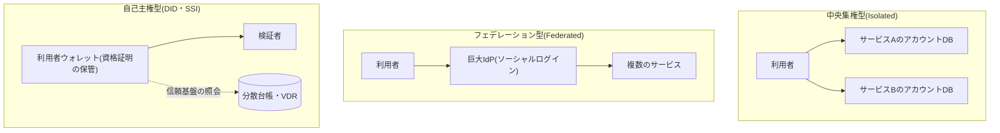
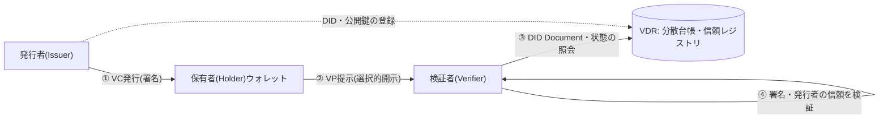

# 分散型アイデンティティ(DID, Decentralized Identity)

## 1. 概要

### A. 定義

> **分散型アイデンティティ(DID, Decentralized Identity)**とは、アイデンティティ情報の発行・保存・提出の権限を、中央機関ではなく**利用者本人**に帰属させるアイデンティティ管理のパラダイムである。利用者は自らの資格証明(Verifiable Credential)を自分のウォレット(デジタルウォレット)に保管し、検証に必要な情報だけを**選択的に**提示し、検証者は発行機関に直接照会することなく、偽造・改ざんの有無を暗号学的に確認する。

DIDは、W3Cが標準化した**分散型識別子(Decentralized Identifier)**の仕様と、これを活用してアイデンティティを「自己主権的(Self-Sovereign)」に扱おうとする**SSI(Self-Sovereign Identity)**の思想を包含する用語である。狭義には`did:method:識別子`形式のURIスキーム一つを指すが、広義には発行者・保有者・検証者の間で検証可能な資格証明をやり取りする**アイデンティティのエコシステム全体**を意味する。従来のログインが「サービスが保管している自分のアカウントをサービスに対して証明する」構造であるのに対し、DIDは「自分が保管している自分の証明を誰にでも提示する」構造であるという点で、アイデンティティの統制権が根本的に移動する。

### B. 登場背景と必要性

デジタルアイデンティティの支配的なモデルは、長らく**中央集権型(Isolated)**と**フェデレーション型(Federated)**であった。中央集権型ではサービスごとに別々のアカウントとパスワードを作らなければならないため、利用者は数十もの資格情報を管理しなければならず、各サービスは個人情報を重複して蓄積する。この蓄積はそのまま大規模漏えいの標的となり、実際に国内外で数千万件規模の個人情報漏えい事故が繰り返されてきた。フェデレーション型(ソーシャルログイン・OIDC)はアカウント数を減らして利便性を高めたが、少数の**巨大なアイデンティティプロバイダ(IdP)**が利用者のログイン履歴を観察・集中させることになるという、プライバシー・依存性の問題を生んだ。

これらのモデルに共通する限界は、アイデンティティ情報が利用者ではなく**機関のデータベースに存在する**という点である。その結果、利用者は自分の情報がいつどのように使われるかを統制できず、成人認証のように「成人かどうか」だけが必要な状況でも、住民登録番号・生年月日全体を渡さなければならない**過剰収集**が常態化する。個人情報保護の規範が強調する**データ最小化(Data Minimization)**と**情報主体の自己決定権**は、このような構造と衝突する。

DIDは、アイデンティティ情報を利用者のウォレットへ移し、元のデータの代わりに**暗号学的に検証可能な証明**だけを流通させることで、この衝突を解消しようとする試みである。発行機関は一度資格証明を発行すると、その後の検証プロセスには関与しないため利用者の活動を追跡できず(発行者-検証者の非連結性)、検証者は必要な属性だけを要求できるため、過剰収集が構造的に抑制される。最近、韓国でモバイル運転免許証・モバイル身分証がDIDベースで展開され、EUが**eIDAS 2.0**を通じて全加盟国にデジタルアイデンティティウォレット(EUDI Wallet)を義務付ける流れは、DIDが実験段階を超えて国家のアイデンティティ基盤へと参入しつつあることを示している。

## 2. アイデンティティ管理モデルの進化と全体構造

DIDの位置付けを理解するには、アイデンティティモデルの進化の軸の上から俯瞰するのが有用である。中央集権型は統制とプライバシーの両面で利用者に不利であり、フェデレーション型は利便性を得る代わりに少数のIdPへの依存を生んだ。DID(自己主権型)は、統制権を利用者に返しつつ、信頼の根拠を特定の機関ではなく**分散型の信頼基盤(ブロックチェーン・分散台帳など)**に置くという点で、二つのモデルと区別される。

DIDエコシステムの実際の動作は、三つの主体と二つの成果物に要約される。三つの主体とは、資格証明を発行する**発行者(Issuer)**、それを保管・提出する**保有者(Holder)**、そしてそれを確認する**検証者(Verifier)**であり、一般に**信頼のトライアングル(Trust Triangle)**と呼ばれる。二つの成果物とは、発行者が署名して発行する**検証可能な資格証明(VC、Verifiable Credential)**と、保有者が必要な部分だけを選んで再構成して提出する**検証可能なプレゼンテーション(VP、Verifiable Presentation)**である。

この構造の核心は、検証者が**発行者に直接問い合わせない**という点である。発行者は自らのDIDと公開鍵を分散台帳などの**検証可能データレジストリ(VDR、Verifiable Data Registry)**に登録しておき、検証者はVPに含まれる署名をVDRの公開鍵で検証する。そのおかげで発行者は検証のタイミングを知ることができず、利用者の追跡が原理的に遮断され、検証者はオフラインでもリアルタイム照会の負担なく信頼を確認できる。

## 3. 中核構成要素の詳細

### A. 分散型識別子(DID)とDID Document

DIDは`did:method-name:method-specific-id`形式のURIである。例えば`did:web:example.com`や`did:ion:EiClk...`のように、中央の**メソッド(method)**が、そのDIDをどのような信頼基盤で生成・解決するかを規定する。DIDを解決(resolve)すると**DID Document**が得られ、この文書にはそのDIDを統制する主体の**公開鍵(認証手段)**、署名・認証に使われる検証方法、そして相互作用の接点を知らせる**サービスエンドポイント**が含まれる。すなわちDIDは「名札」であり、DID Documentは「その名札の所有者が自らを証明する方法を記した仕様書」に相当する。

DIDの重要な性質は**自己証明性(self-certifying)**である。識別子そのものが公開鍵(またはそのハッシュ)と結び付けて生成されるため、そのDIDの統制者であることを証明するには対応する秘密鍵で署名すればよく、それを発行してくれる中央の登録機関は必要ない。この点が、メールアドレス・電話番号といった従来の識別子との決定的な違いである。

### B. 検証可能な資格証明(VC)と選択的開示

VCは、発行者が保有者の特定の属性(氏名・生年月日・資格・所属など)を主張(claim)し、自らの秘密鍵で**デジタル署名**したデータ構造である。署名が付いているため偽造・改ざんされれば検証が失敗し、発行者のDIDを通じて「誰が保証したか」が明らかになる。VCの真価は、保有者がそれをそのまま渡すのではなく、**VPとして再構成**するときに発揮される。保有者は複数のVCから必要な項目だけを抜き出して一つの提示にまとめ、そこに自らの秘密鍵で署名して「この提示が自分のものであること」を併せて証明する。

特に**選択的開示(Selective Disclosure)**と**ゼロ知識証明(ZKP)**の技法を組み合わせれば、元のデータを露出せずに条件を満たしていることだけを証明できる。代表的にはSD-JWTやBBS+署名を利用すれば、「生年月日」そのものを明かさずに「満19歳以上」という事実だけを証明することが可能である。これは酒・たばこの購入や成人向けコンテンツへのアクセスのように、**属性一つだけが必要な**実際の状況で、個人情報の露出を劇的に減らす。

| 区分 | 従来の本人確認 | DIDベースのVC |
|------|---------------|-------------|
| 情報の保管 | サービス・機関のDB | 利用者のウォレット |
| 検証方式 | 発行機関へのリアルタイム照会 | 署名・VDRに基づくオフライン検証 |
| 開示範囲 | 身分証全体(過剰) | 必要な属性のみ(選択的開示) |
| 発行者による追跡 | 可能(照会ログ) | 不可能(非連結性) |
| 漏えいリスク | 中央DBに集中 | 分散・最小化 |

上の表は比較の要旨を整理したものであるが、違いが生じる根本的な理由は、「元のデータを移すのか、検証可能な証明を移すのか」という設計思想にある。従来の方式は信頼のためにデータを移動・集中させ、DIDはデータを移動させずに**信頼だけを移動**させる。その結果、漏えいの攻撃対象領域(attack surface)とプライバシーリスクが構造的に異なるものとなる。

### C. VDRと信頼基盤

VDRは、発行者のDID・公開鍵、そして資格証明の**失効状態(revocation)**などを、検証者が確認できるよう共有するレジストリである。必ずしもブロックチェーンである必要はないが、改ざん耐性と分散型の信頼のために分散台帳が広く使われている。ただし個人情報(VCの原本)をブロックチェーンに載せると削除権の行使が不可能になるため、実務では**個人情報はオンチェーンに保存せず**(オフチェーンのウォレットに保管)、検証に必要な公開鍵・ハッシュ・状態値だけをオンチェーンに置くことが原則である。

## 4. 比較 — フェデレーション型アイデンティティ(OIDC)とDID

DIDはしばしばソーシャルログイン(OAuth 2.0/OIDC)と比較される。OIDCではログインのたびにIdPが介在して利用者をサービスに接続するため、IdPは利用者の接続先・時点を知ることができ、IdPの障害時には連鎖的にログインが麻痺する。一方DIDでは、発行後に発行者が検証に関与しないため、こうした観察・単一障害点の問題がない。ただしその代償として、利用者が**秘密鍵・ウォレットを自ら安全に管理**しなければならない責任が生じる。要するに、OIDCは「利便性のために信頼をIdPに委任」し、DIDは「統制権を得る代わりに管理責任を利用者が負う」という相反するトレードオフを持つ。そのため現実には、OIDCとDIDを対立ではなく**補完**の関係とみなし、OIDCの上にVCの提示を組み合わせるハイブリッド(OpenID for Verifiable Credentials、OID4VC)方式が広がっている。

## 5. 深化 — 標準・政策の動向と実務への適用

技術・標準の面では、W3Cが**DID Core 1.0(2022年勧告)**と**Verifiable Credentials Data Model**によって相互運用の骨格を提供し、最近ではVC 2.0とSD-JWT VC、そしてOpenID陣営の**OID4VCI(発行)・OID4VP(提示)**プロトコルが、発行・提示手順の事実上の標準として定着しつつある。政策の面では、EUが**eIDAS 2.0**によって2026年までに加盟国ごとのEUDI Walletの提供を義務付け、銀行・通信回線の開通・公共サービスのログインへの適用を推進している。韓国では行政安全部の**モバイル身分証(モバイル運転免許証)**がDIDベースで発行され、実物の身分証と同等の効力を持つなど、公共領域で実証が進められている。

実務への適用事例を見ると、金融業界では複数の銀行が参加するコンソーシアム型DIDによって**非対面の口座開設・資格確認**を簡素化し、大学・資格機関では卒業証明書・資格証をVCとして発行し、偽造・改ざんのない即時検証を支援している。採用時の学歴・職歴の確認に数日かかっていた手続きが、ウォレットの提示一回に短縮されることが代表的な効用である。予想される出題方向としては、「DIDの信頼のトライアングルとVC/VPの手順の記述」、「従来のPKI・フェデレーション型アイデンティティとの比較」、「ブロックチェーンに個人情報を載せてはならない理由とGDPRの忘れられる権利との衝突」、「選択的開示・ZKPによるデータ最小化の方策」が、答案構成の中核的な軸となりうる。

## 6. 考慮事項および示唆

技術士の観点では、DIDの導入は次のような戦略的判断とともに検討されなければならない。

- **秘密鍵・ウォレットの復旧戦略(可用性 vs 自己主権)**: 秘密鍵の紛失はすなわちアイデンティティの喪失である。ニーモニックによるバックアップ、ソーシャルリカバリ(social recovery)、ハードウェアウォレット、鍵分割(MPC・Shamir Secret Sharing)などの復旧手段を用意しつつ、復旧を容易にするほど自己主権性・安全性が弱まるというトレードオフを、事業の特性に合わせてバランスよく設計しなければならない。
- **プライバシー規制との整合性(オンチェーン保存禁止の原則)**: 個人情報を分散台帳に記録すると、GDPR・個人情報保護法の破棄・訂正義務を履行できない。原本はオフチェーンのウォレットに、オンチェーンには公開鍵・ハッシュ・失効状態などの最小限のメタデータだけを置く設計と、失効(revocation)メカニズムの確保が必須である。
- **相互運用性とエコシステムへのロックイン回避**: 特定ベンダーのDIDメソッド・ウォレットに固定されると、自己主権の趣旨が形骸化する。W3C DID Core・VC 2.0・OID4VCなどの国際標準への準拠と信頼フレームワーク(Trust Framework)との整合を通じて、発行者・検証者・ウォレット間の相互運用を確保し、信頼できる発行者リスト(Trusted Issuer List)のガバナンスも併せて整備しなければならない。
- **段階的移行とハイブリッド運用**: 全面的な置き換えよりも、既存の認証(OIDC・PKI)と並行するハイブリッドから始め、成人認証・資格検証のようにデータ最小化の効用が大きい領域から優先的に適用する漸進的なロードマップが現実的である。利用者の受容性・検証者インフラの普及速度を併せて考慮したエコシステムの醸成が成否を左右する。
- **耐量子性・法的効力**: 署名に基づく信頼が核心である以上、長期的には耐量子暗号(PQC)へのアルゴリズム移行の柔軟性を確保しなければならず、VCが実物の証明と同等の法的効力を持つよう、電子署名法・関連制度との連携も並行して進めなければならない。

## 参考資料

- W3C, "Decentralized Identifiers (DIDs) v1.0", https://www.w3.org/TR/did-core/
- W3C, "Verifiable Credentials Data Model v2.0", https://www.w3.org/TR/vc-data-model-2.0/
- European Commission, "European Digital Identity (eIDAS 2.0)", https://commission.europa.eu/strategy-and-policy/priorities-2019-2024/europe-fit-digital-age/european-digital-identity_en
- OpenID Foundation, "OpenID for Verifiable Credentials", https://openid.net/sg/openid4vc/

---

> **一言まとめ**: DIDとは、アイデンティティ情報の統制権を機関から利用者に返す自己主権型アイデンティティモデルであり、発行者・保有者・検証者の信頼のトライアングルとVC/VP・選択的開示によって、過剰収集なしに偽造・改ざんを暗号学的に検証する。
