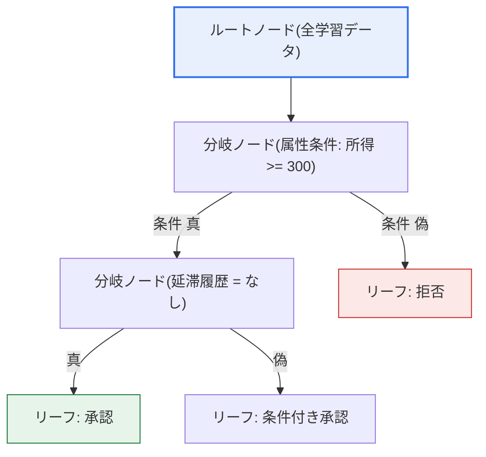
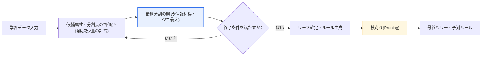

# 決定木(Decision Tree)

## 1. 概要

### A. 定義
> データを**属性(変数)を基準に再帰的に分割(recursive partitioning)**してツリー形式のルール集合を構築し、それによって分類(Classification)・回帰(Regression)を行う教師あり学習ベースの機械学習モデル。学習結果が人間がそのまま読めるif-thenルールとして表現される点が核心である。

決定木の最大の強みは「**解釈可能性(説明力、interpretability)**」にある。「月収が300万ウォン以上で、直近12か月に延滞履歴がなければ融資承認」のように、モデルがなぜその決定を下したのかがルールの形で透明に示される。これは、数百万個の重みが非線形に絡み合い判断根拠を事後的に追跡することが難しい深層ニューラルネットワーク(ブラックボックス)とは正反対の性質である。判断根拠を規制・監督・訴訟に備えて必ず説明しなければならない金融(融資・信用評価)、医療(診断支援)、法律・公共(行政処分)分野で決定木が継続的に好まれる理由がここにある。

動作方式が「二十の扉」に似ている点も実務的価値が大きい。ルートから始めて質問(属性条件)を一つずつ投げかけながらデータを絞り込み最終的な答えに到達するため、統計や機械学習に詳しくない現場担当者でもツリーをたどって結果に納得できる。ルールをそのまま業務マニュアルや審査基準表に移すことができ、モデルと運用規定との間のギャップが小さいことも他のモデルと区別される特徴である。

### B. 登場背景および必要性
データに基づく意思決定が広がるにつれ、「何を予測したか」と同じくらい「なぜそう予測したか」という**説明責任(accountability)**が重要となる領域が増えている。EU GDPRの「自動化された意思決定に対する説明要求権」、韓国の信用情報法・個人情報保護法の自動化された決定に対する説明・異議申し立て規定などは、予測結果に対する根拠提示を事実上義務化している。決定木は予測と説明を同時に提供する代表的なモデルとして、近年注目される**説明可能AI(XAI、eXplainable AI)**の理論的・実務的基礎を成す。

また、構造化(テーブル型)データが支配的な金融・製造・流通ドメインでは、ツリーベースのモデル(特に後述するアンサンブル)はディープラーニングより少ないデータ・前処理でも高い性能を出す場合が多い。Kaggleなど構造化データコンペティションの上位ソリューションの相当数がXGBoost・LightGBMのようなツリーアンサンブルであることは、この系統が単なる教育用モデルを超えた産業標準ツールであることを示している。

## 2. 全体構造および学習原理

決定木はルートノードで全データから始め、各分岐(内部)ノードで特定の属性条件によりデータを二つ以上に分け、それ以上分けないリーフ(終端)ノードで最終予測(クラスまたは数値)を算出する。学習の本質は「**どの属性を、どの閾値で分けるとデータが最もよく区別されるか**」を貪欲的(greedy)に繰り返し探索することである。分けた後に各子グループができるだけ純粋になる(一つのクラスに偏る)ような分割を各段階で選択する。

上の構造図における各要素の意味は次のとおりである。**ルートノード**は分割される前の全標本を含み、ここで最初の質問(最も情報量の大きい属性)を投げかける。**分岐ノード**は一つの属性条件でデータを分ける地点であり、**枝(branch)**はその条件の結果(真/偽、またはカテゴリ値)を表す。**リーフノード**はそれ以上分けずに予測を確定する地点であり、分類では当該ノードに残った標本の多数決クラスを、回帰では標本平均値を予測とする。

| 構成要素 | 役割 | 予測における意味 |
|---|---|---|
| **ルート/分岐ノード** | データを分ける属性条件 | ルールの条件部(if) |
| **枝(Branch)** | 条件の結果(真/偽・カテゴリ) | ルールの分岐 |
| **リーフノード** | 分割終了・最終予測 | ルールの結論部(then) |

学習手順を順に見ると、① 現在のノードのすべての候補属性・分割点について分割後の不純度減少量を計算し、② 減少量が最も大きい分割を採用して子ノードを作成し、③ 各子ノードについて終了条件(純粋ノード、最小標本数未満、最大深さ到達など)を満たすまで①~②を再帰的に繰り返す。このように各段階で局所最適を選択する貪欲的戦略であるため、常に大域最適なツリーを保証するわけではないが、計算効率と性能のバランスが良く実務で広く用いられる。

上のプロセス詳細図が示すように、ツリー成長(growing)段階と枝刈り(pruning)段階は明確に区別される。成長段階では不純度をできるだけ減らす方向にツリーを大きくし、その後の枝刈り段階で過度に細分化された枝を切り落として汎化性能を回復させる。この二段階の分離は、後述する過学習問題に直結する核心的な設計である。

## 3. 分割基準(Split Criterion)

ノードをどの属性で分けるかを選ぶ基準がアルゴリズムのアイデンティティを決定する。分割基準の共通目標は「**分けた後の各子ノードの不純度(impurity)を最小化**」することであり、不純度をどう定義するかによって代表的なアルゴリズムが分かれる。

**エントロピーベースの情報利得(Information Gain)**は、情報理論のエントロピー(不確実性)を不純度の尺度とし、分割前のエントロピーから分割後の加重エントロピーを差し引いた減少量が最も大きい属性を選ぶ。初期のアルゴリズムであるID3がこの方式を用いる。ただし情報利得は値の種類が多い属性(例: 顧客ID)を過大評価するバイアスがあるため、後継アルゴリズムC4.5はこれを分割情報量で正規化した**利得比(Gain Ratio)**で補正する。C4.5は連続型・カテゴリ型属性を併せて扱い、欠損値処理と枝刈りを内蔵して実務的な完成度を高めた。

**ジニ係数(Gini Index)**は、無作為に抽出した二つの標本が互いに異なるクラスである確率で不純度を定義し、これを最も低下させる分割を選択する。CART(Classification And Regression Trees)がこの方式を採用しており、対数演算がないためエントロピーより計算が軽く、常に二分割(binary split)を生成するという特徴がある。**回帰木**では不純度の代わりに分散(または平均二乗誤差、MSE)の減少量を基準とし、子ノード内の目的値のばらつきが最も小さくなる分割を選ぶ。

| アルゴリズム | 分割基準 | ツリー形態 | 特徴 |
|---|---|---|---|
| **ID3** | 情報利得(エントロピー) | 多分岐分割 | カテゴリ型専用、バイアスあり |
| **C4.5** | 利得比(Gain Ratio) | 多分岐分割 | 連続型・欠損・枝刈りをサポート |
| **CART** | ジニ係数 / 分散減少 | 二分割 | 分類・回帰を統合、計算が軽量 |

三つの基準の実務的含意は単純な性能の優劣ではなく、「どのようなデータ・要求に適合するか」にある。例えば、カテゴリが非常に多様な属性が多いデータであればID3の情報利得は歪みやすいため利得比やジニを用いるのが安全であり、予測値が連続型であれば分類用のジニではなく分散減少基準(回帰木)を用いなければならない。scikit-learnの`DecisionTreeClassifier`がデフォルト値としてジニを採用しているのも、計算効率と無難な性能のためである。

## 4. 特徴(長所・短所)と過学習

決定木は解釈が容易で、正規化・スケーリングのような前処理がほとんど不要であり(分割は順序情報のみを使用)、数値型とカテゴリ型のデータを併せて扱えるという長所がある。一方、ツリーを制約なく深く成長させると、学習データのノイズまでルールとして記憶してしまう**過学習(overfitting)**に非常に脆弱である。極端な場合、各リーフに標本が一つずつ残るまで成長して学習精度は100%となるが、新しいデータに対する性能は急激に低下する。

もう一つの弱点は**不安定性(instability)**である。学習データが少し変わるだけでも上位の分割が変われば、その下のツリー構造全体が大きく変化しうる。これはルールの信頼性と再現性を損なう要因であり、単一ツリーをそのまま運用に用いることを難しくする。

| 区分 | 内容 |
|---|---|
| **長所** | ルールベースで解釈が容易、前処理最小、数値・カテゴリの混在、特徴量重要度の算出 |
| **短所** | 過学習に脆弱、データ変化に敏感(不安定)、軸平行分割による斜め境界表現の限界 |
| **対応** | 事前・事後枝刈り、深さ・最小標本の制約、アンサンブル(ランダムフォレスト・ブースティング) |

過学習への対応は大きく二つの方向がある。第一は**枝刈り**であり、成長をあらかじめ止める事前枝刈り(pre-pruning: 最大深さ・リーフ最小標本数の制限)と、一旦大きく成長させた後に検証性能を基準に枝を切り落とす事後枝刈り(post-pruning: CARTのコスト複雑度枝刈りなど)がある。第二は複数のツリーを結合する**アンサンブル**であり、次の発展節で扱う。

## 5. 適用事例および数値例

決定木・アンサンブルの実務的価値は、具体的な事例で見ると明確になる。

**事例1 — 金融信用評価(融資審査).** ある銀行が融資承認の可否を予測するモデルを作るとしよう。単一ツリーは「所得300万ウォン以上 → 延滞履歴なし → 負債比率40%未満 → 承認」のようなルールをそのまま算出するため、監督機関に提出する審査基準と拒否理由(adverse action)の通知にそのまま使える。実務では精度を高めるためにXGBoostのようなブースティングを用いつつ、個別の拒否案件についてはSHAP値で「負債比率が承認確率を12%p低下させた」のように変数ごとの寄与度を定量化して説明責任を果たす。

**事例2 — 通信・サブスクリプションサービスの解約予測(Churn).** 直近3か月の利用量減少率、カスタマーセンターへの問い合わせ回数、料金プラン変更履歴などを入力して解約確率を予測する。ランダムフォレストで数百個のツリーを結合すると単一ツリーの不安定性が緩和され、データが毎月更新されても予測が大きく変動しない。特徴量重要度分析で「カスタマーセンター問い合わせの急増」が解約の核心シグナルであることを発見すれば、当該顧客層に先制的なリテンションオファーを送るマーケティングアクションにつなげられる。

**事例3 — 製造工程の品質予測.** 温度・圧力・速度など数十個のセンサー値で不良の有無を予測する際、LightGBMはヒストグラムベースの分割とリーフ中心の成長により大規模なセンサーデータを高速に学習する。ディープラーニングと比べて学習時間が短くハイパーパラメータのチューニングが容易であるため、工程条件が頻繁に変わる現場で再学習・デプロイの周期を短縮できる。この場合も特徴量重要度によってどの工程変数が不良と強く関連するかを提示し、現場の改善活動にフィードバックする。

これらの事例が共通して示すのは、単一ツリーの「ルール解釈力」とアンサンブルの「予測精度」がそれぞれ異なる局面で必要とされ、実務では目的に応じて両者を選択するか、SHAPで組み合わせるという点である。

## 6. 発展 — アンサンブルと説明可能AI(XAI)の動向

単一の決定木の限界を克服するために登場した**アンサンブル(Ensemble)**は、今日の構造化データ分野における事実上の標準である。大きく二つの系統に分かれる。**バギング(Bagging)系**の代表である**ランダムフォレスト(Random Forest)**は、データをブートストラップ標本として何度も復元抽出し、分割時の候補属性も無作為に制限して互いに異なるツリーを数百個作った後、その予測を多数決・平均で結合する。ツリーごとに誤りの方向が異なるため、結合すると分散が減り、単一ツリーの不安定性が大きく緩和される。

**ブースティング(Boosting)系**はツリーを逐次的に作成するが、前のツリーが誤った部分(残差)を次のツリーが集中的に補正するように学習する。勾配ブースティング(GBM)を実務規模に最適化した**XGBoost**(2016、正則化・二次近似・並列化)、リーフ中心(leaf-wise)の成長とヒストグラムベースの分割で速度・メモリを改善した**LightGBM**(Microsoft)、カテゴリ型処理を強化した**CatBoost**(Yandex)が代表的である。これらは構造化データにおいてディープラーニングに匹敵するか上回る性能をしばしば示し、信用評価・解約予測・需要予測などに広く用いられている。

アンサンブルは性能を大きく引き上げる代わりに、数百個のツリーの集合となるため単一ツリーの解釈力をかなりの部分失う。このジレンマを埋めるため、**特徴量重要度(Feature Importance)**、**部分依存プロット(PDP)**、そしてゲーム理論のシャープレイ値に基づき個別予測に対する各変数の寄与度を定量化する**SHAP**のような事後説明(post-hoc explanation)手法が併用される。特にツリーアンサンブルにはSHAP値を効率的に計算するTreeSHAPアルゴリズムがあり、「性能はブースティングで、説明はSHAPで」確保する組み合わせが産業界で広く定着した。結局、決定木はそれ自体としてはホワイトボックスモデルでありながら、アンサンブル・XAIと結合して性能と説明を同時に確保する軸へと発展している。

## 7. 考慮事項および示唆点(技術士の観点)

1. **過学習の制御が実戦の成否を左右する.** 単一ツリーは深さ・リーフ最小標本数の制限とコスト複雑度枝刈りを、アンサンブルはツリー数・学習率・サブサンプリング比率を交差検証で調整して汎化性能を確保しなければならない。学習精度だけを見てデプロイすれば、必ず性能低下に直面する。

2. **性能と説明力のトレードオフを目的に合わせて設計する.** 規制・監督が厳しくルール自体を提示しなければならない領域(融資審査基準、医療プロトコル)では浅い単一ツリーが、予測精度が最優先の領域ではブースティングアンサンブル+SHAPの組み合わせが適している。唯一の正解ではなく、要件に基づく選択が鍵である。

3. **データ品質・バイアス管理がルールの公平性を決定する.** 学習データに性別・地域などセンシティブ属性のバイアスがあると、ツリーがこれをルールとして固定化し差別的な決定を再生産しうる。センシティブ属性の除去・代理変数(proxy)の点検・公平性指標のモニタリングを併せて運用しなければならず、これはAI倫理・ガバナンスに直結する。

4. **構造化データにおける優先検討対象として位置づける.** 画像・音声・自然言語ではディープラーニングが圧倒的であるが、テーブル型データではツリーアンサンブルが依然として強力なベースライン(baseline)である。新規の予測課題ではディープラーニングより先にXGBoost・LightGBMを試し、費用対効果を検証するのが実務的に合理的である。

5. **MLOpsの観点からの運用・再現性の確保が必要である.** ツリー構造は学習データ・乱数シードに敏感であるため、シード固定・バージョン管理・特徴量重要度のドリフトモニタリングを通じてモデルが時間とともにどう変化するかを追跡し、再学習の時期を判断しなければならない。

## 参考資料
- scikit-learn, "Decision Trees" — https://scikit-learn.org/stable/modules/tree.html
- XGBoost Documentation, "Introduction to Boosted Trees" — https://xgboost.readthedocs.io/en/stable/tutorials/model.html
- LightGBM Documentation — https://lightgbm.readthedocs.io/en/stable/
- SHAP Documentation — https://shap.readthedocs.io/en/latest/

---

> **一言まとめ**: 決定木は*属性基準の再帰的分割によってif-thenルールのツリー*を構築する解釈可能な(ホワイトボックス)モデルであり、情報利得・利得比・ジニで分割し、過学習・不安定性に脆弱であるため枝刈りとアンサンブル(ランダムフォレスト・XGBoost・LightGBM)で精度・安定性を補完し、SHAPなどのXAI手法と結合して性能と説明力を同時に確保する。
