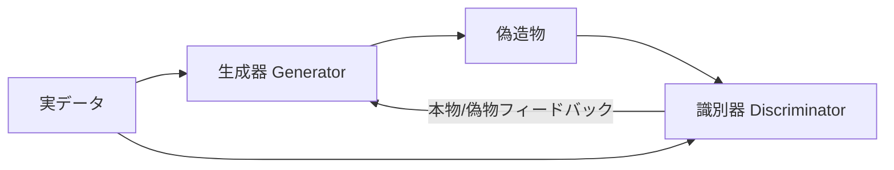
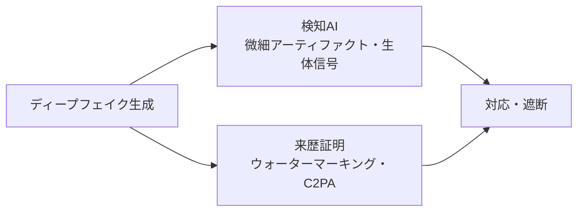

# ディープフェイク(Deepfake)

## 1. 概要

### A. 定義
> **ディープラーニング(Deep Learning)+偽物(Fake)**の合成語であり、GAN・拡散モデルなどの生成AIを用いて特定人物の顔・音声・行動を本物と区別が難しいほど精巧に合成・改ざんする技術。

ディープフェイクの本質は、膨大な元データ(顔画像・音声)からその人物の**特徴分布を学習した後、学習した分布に従う新たな偽造物を生成**することにある。かつての合成(Photoshop)が人間がピクセルを手作業で操作するものであったとすれば、ディープフェイクはAIが「本物らしく見えるものとは何か」を自ら学習して自動生成するという点で質的に異なり、それだけ精巧かつ大量生産が可能である。

### B. 登場背景および必要性
ディープフェイクが社会問題として浮上した背景には二つの軸がある。一つはGAN(2014)・拡散モデルの登場により生成品質が人間の肉眼による識別を超えた**技術的成熟**であり、もう一つはオープンソースツールやアプリによって誰もが手軽に作れるようになった**アクセス性の爆発的拡大**である。ここにSNSという超高速の拡散チャネルが結合したことで、精巧な偽造物が作られるや否や検証なしに伝播し、**世論操作・金融詐欺・性的搾取物**といった深刻な被害につながる。このためディープフェイクは、技術そのものよりも「生成-拡散-悪用」の連鎖をいかに断ち切るかが核心的な課題となる。

## 2. 生成原理

最も代表的な原理は**GAN(敵対的生成ネットワーク)**であり、偽造物を作る**生成器(Generator)**と本物・偽物を見分ける**識別器(Discriminator)**を競わせる。生成器は識別器を欺こうとしてますます精巧な偽造物を作り、識別器はそれをより的確に見抜こうと発展するが、この**敵対的学習(minimaxゲーム)**の均衡点において識別器ですら区別できない偽造物が生まれる。顔の入れ替え(Face Swap)には、二人の人物の顔をそれぞれ圧縮・復元しながら特徴を入れ替える**オートエンコーダ**が用いられ、近年ではノイズを段階的に除去しながら画像を生成する**拡散モデル(Diffusion)**がより高い品質とテキストベースの制御を提供し主流となりつつある。例えば、数秒分の音声サンプルだけで特定人物の声を複製し「至急送金せよ」という通話を偽造する音声ディープフェイクが、実際の金融詐欺に悪用された事例が報告されている。

| 技術 | 原理 |
|---|---|
| **GAN** | 生成器-識別器の敵対的学習により偽造物を精巧化 |
| **オートエンコーダ** | 顔の特徴抽出・復元による顔の入れ替え(Face Swap) |
| **拡散モデル(Diffusion)** | ノイズ除去過程による高品質・テキスト制御の生成 |

## 3. 活用と悪用

同一の技術が使い方によって順機能と逆機能に分かれるという点が、ディープフェイクのジレンマである。順機能の面では、映画のディエイジング・多言語吹き替え、故人の復元、バーチャルヒューマンによるマーケティング、教育・医療シミュレーションのように創作・産業上の価値を生み出す。一方、逆機能は**本人の同意なくアイデンティティを盗用**することに起因し、虚偽情報で選挙・世論を操作したり、音声複製で金融詐欺を働いたり、顔合成で名誉毀損・違法な性的搾取物を作ったりするなど、被害が直接的で回復が困難である。特に著名人だけでなく一般人もSNS上の写真数枚があれば被害対象となりうるという点で、リスクが一般化した。

| 順機能 | 逆機能(悪用) |
|---|---|
| 映画・吹き替え・復元、バーチャルヒューマン | 虚偽情報・フェイクニュース、選挙・世論操作 |
| 教育・医療シミュレーション | 音声複製フィッシング(金融詐欺) |
| 広告・コンテンツ制作 | 名誉毀損・違法な性的搾取物 |

## 4. 検知・対応技術

対応は大きく**事後検知**と**事前の来歴証明**の二つの方向に分かれる。検知技術は、偽造過程で残る微細な痕跡、例えば瞬きの不自然さ、皮膚の微細な血流信号(rPPG)の欠如、周波数領域のアーティファクトをAIで捉える。しかし検知は本質的に**後追いの防御**であり、生成技術が進化すれば再び突破されるという限界がある。そこで根本的な代替策として浮上したのが**来歴証明**である。コンテンツの生成・撮影段階で真正性を暗号学的に署名しておく**C2PA・デジタルウォーターマーキング**は、「偽物を見つけ出す」代わりに「本物を証明する」方式へと発想を転換する。ここに表示義務・処罰を盛り込んだ法制度とメディアリテラシー教育が加わってこそ、実効的な対応が完成する。

| 区分 | 対応策 |
|---|---|
| **技術(検知)** | ディープフェイク検知AI(生体信号・周波数アーティファクト) |
| **技術(来歴証明)** | デジタルウォーターマーク、コンテンツ来歴認証(**C2PA**) |
| **制度** | 生成物の表示義務・処罰の法制化、プラットフォームの削除義務 |
| **意識** | メディアリテラシー教育による無批判な拡散の遮断 |

## 5. 考慮事項および示唆点(技術士の観点)
- **矛と盾の非対称な競争**: 生成が検知より速く進化するため、検知のみに依存すれば必敗する。原本に署名を埋め込む**来歴証明(Provenance)**中心へと戦略を転換すべきである。
- **生成AI規制との連携**: EU AI Actなどはディープフェイク生成物の表示義務を規定する傾向にあり、韓国の公職選挙法・性暴力処罰法の改正とともに表示・処罰・削除の制度整備が必要である。
- **プラットフォーム責任と国際協調**: 拡散の経路であるプラットフォームに迅速な検知・削除義務を課すべきであるが、国境を越える特性上、国際協調なしには実効性が低い。
- **AI信頼性の観点**: ディープフェイク対応はすなわち「何が本物かを信頼できる社会」を守る問題であり、技術・制度・教育を包括する社会的対応体制の構築が求められる。

---

> **一言まとめ**: ディープフェイクは*GAN・拡散モデルなどの生成AIで人物の顔・音声を精巧に偽造*する技術であり、生成-検知の非対称な競争の中で検知AIだけでは限界があるため、**来歴証明(C2PA・ウォーターマーキング)・法制度・メディアリテラシー**を並行する多層的な対応が必要である。
