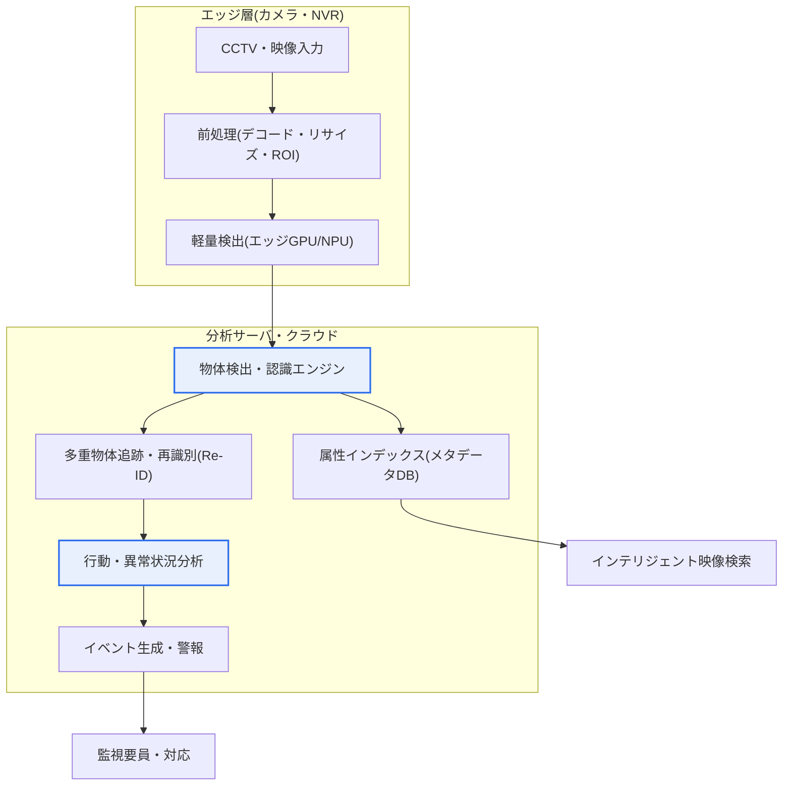
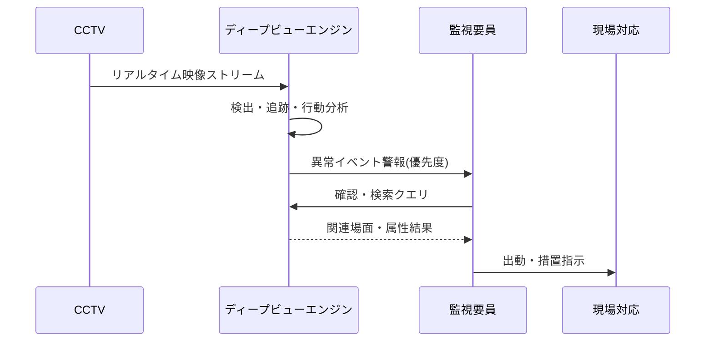

# ディープビュー(DeepView)

## 1. 概要

### A. 定義
> ディープビュー(DeepView)はディープラーニングベースの**映像・物体認識インテリジェント分析技術**であり、CCTVなどの大規模映像ストリームから人・車両・行動・異常状況を自動的に検知・認識・検索・予測するインテリジェント映像監視(VCA、Video Content Analysis)系の技術である。

ディープビューの核心的価値は、「**人間が見きれない膨大な映像をAIが代わりに監視・分析**」することにある。今日、地方自治体の統合監視センター1か所が数千~数万台のCCTVを担当しているが、監視要員1人が同時に有意に注視できる画面は通常数十個にすぎないというのが現場の長年の課題であった。人間の注意力は20~40分を過ぎると急激に低下し、複数の画面を同時に監視する場合には異常状況を見逃す確率が大きく高まる。結局、大半の映像は「事件が起きた後に事後的に巻き戻して見る」受動的な録画装置としてのみ機能してきた。

ディープビューはこの構造を根本的に変える。ディープラーニングのニューラルネットワークが映像フレーム内の物体と、その物体が生み出す時間的な行動パターンを「理解」し、侵入・徘徊・置き去り・群集・転倒といった状況をリアルタイムに検知して即座に警報を発する。また、「赤い上着を着た成人男性」や「黒いSUV」のように属性(attribute)ベースで膨大な映像を秒単位で検索し、かつて数時間を要していた容疑者・容疑車両の追跡を劇的に短縮する。すなわちディープビューは、CCTVを「録画する装置」から「**状況を自ら認知し判断する監視主体**」へと転換する技術であり、防犯・交通・産業安全・災害分野において事件を未然に防ぎ、対応速度を引き上げることを目標とする。

### B. 登場背景および必要性
ディープビューが台頭した背景は、三つの流れの交差によって説明される。第一に、**CCTVの爆発的増加**である。韓国の公共機関のCCTVは2010年代以降毎年二桁の割合で増え、現在は数百万台規模に達すると推定されており、ここに民間CCTVや車載ドライブレコーダーまで加えると、人間が対応できる限界をはるかに超えている。「設置は増えるのに監視人員はそのまま」という構造的不均衡が、自動分析の必要性を切実なものにした。

第二に、**ディープラーニングによる映像認識性能の飛躍**である。2012年のImageNetコンテストでCNN系モデルが従来手法を大差で上回って以降、映像分類・物体検出・再識別の性能が急激に向上し、特定条件下では人間レベルの認識精度に近づいた。ルールベース(背景差分、オプティカルフロー)では照明変化・影・群衆状況で誤検知が多く実用性が低かったが、データから学習するディープラーニングはこうしたノイズにはるかに頑健であり、実戦適用の敷居を越えた。

第三に、**国家R&Dレベルでの戦略的投資**である。ディープビューは韓国において科学技術情報通信部・ETRI(韓国電子通信研究院)などが主導したインテリジェント映像分析の国家R&D課題の代表的ブランドとして知られており、大規模な実環境CCTVを対象としたリアルタイム多重物体分析技術を国産化するという目標のもとで推進された。このようにディープビューは単なる商用製品名ではなく、「インテリジェント映像分析」という技術カテゴリと国家研究開発の成果をあわせて指す用語として使われる。

## 2. 全体構造および処理パイプライン

ディープビューの全体構造は、「映像収集 → 前処理 → ディープラーニング分析エンジン → イベント/警報 → 検索・保存」へと続くパイプラインとして理解できる。以下の構造図は、カメラ側(エッジ)とサーバ・クラウドが役割を分担し、リアルタイム性と精度を同時に確保する典型的な配置を示している。

このパイプラインにおいて前段(エッジ)は、帯域幅と遅延を減らすためにカメラやNVRで一次的な軽量検出を行い、意味のあるフレーム・物体のみをサーバに送る。サーバ・クラウドは重い認識・追跡・行動分析と大容量のインデックス作成を担当する。このように階層を分ける理由は、後述の「考慮事項」で扱うリアルタイム性とコストのトレードオフに直結する。

### A. 物体検出(Object Detection)
物体検出はディープビューの出発点であり、1枚のフレームから人・車両・自転車・カバンなど関心物体の「位置(バウンディングボックス)」と「種類(クラス)」を同時に見つけ出す段階である。初期の2段階(two-stage)方式(R-CNN系)は候補領域をまず抽出してから分類する構造で正確であったが、遅かった。その後登場した1段階(one-stage)方式であるYOLO(You Only Look Once)・SSD系は、画像を一度にグリッドに分割して位置とクラスを同時に回帰予測することで、精度を大きく犠牲にせずに毎秒数十フレームのリアルタイム処理を可能にした。

ディープビューが扱う実環境の映像では、照明変化、逆光、雨天・霧、遠距離の小型物体、群衆の中での激しい遮蔽(occlusion)といった悪条件が常態的である。そのため、公開データセットで良好なモデルを単に持ってくるだけでは不十分であり、実際のCCTVの画角・解像度・設置角度に合わせたドメイン特化の再学習とデータ拡張が性能を左右する。例えば、交差点の上部に斜めに設置されたカメラでは人が上から見下ろす形で撮影されるため、正面の歩行者中心に学習したモデルの精度が急落する、といった具合である。

### B. 物体追跡および再識別(Tracking & Re-ID)
検出が「1フレームの写真」を見る作業だとすれば、追跡は「時間軸に沿って同じ物体をつなぎ合わせる」作業である。多重物体追跡(MOT)は、連続フレームで検出されたボックスを同一物体同士で結びつけて移動軌跡を作成する。この軌跡があってこそ、「どこに現れてどこへ移動したか」「どれだけ長く滞在したか」といった行動分析が可能になる。

再識別(Re-Identification、Re-ID)はさらに一歩進んで、互いに重ならない複数のカメラにまたがって同じ人・車両を再認識する技術である。例えば、Aカメラから消えた対象が200m離れたBカメラに再び映ったとき、服の色・体型・歩き方といった外見特徴ベクトルの類似度によって同一人物かどうかを推定する。Re-IDは顔が見えなくても動作するため広域追跡に有用であるが、照明・画質の差や類似した服装に弱いため、誤マッチングの管理が重要である。

### C. 行動・異常状況分析(Behavior/Anomaly Analysis)
ディープビューの付加価値が最も大きい段階である。個々のフレームの物体情報だけでは分からない「時間にわたるパターン」を解釈し、意味のある事象として判断する。代表的なものとして、定められた線を越える侵入(virtual line crossing)、特定区域に長く留まる徘徊(loitering)、カバン・物体を置いて立ち去る置き去り(abandoned object)、人が床に倒れる転倒、突然の群集・分散といった異常密集がある。

この分析は二系統のアプローチを併用する。一つは管理者がルール(例:「このポリゴン内に30秒以上留まれば徘徊と判断」)を定義するルールベースであり、もう一つは正常パターンを学習してそこから逸脱するものを異常として捉える学習ベース(anomaly detection)である。ルールベースは理解と制御が容易な反面、予想外の異常を見逃し、学習ベースは未知の異常まで捕捉するが「なぜ異常なのか」の説明が難しいという相互補完の関係にある。近年では、骨格推定(pose estimation)で人の関節の動きを抽出し、暴行・転倒といった行動をより精密に判定する方式が広がっている。

### D. インテリジェント映像検索(Intelligent Search)
検出・認識結果を「メタデータ」としてインデックス化しておけば、元の映像を再生し直さなくても条件検索が可能になる。「昨日14~16時の間、正門カメラ、赤い上着の成人、カバン所持」といったクエリに対し、システムはインデックス化された属性を照会して該当場面のみを秒単位で抽出する。かつての捜査実務では特定の人物・車両を探すために監視要員が数十時間分の映像を目視で巻き戻していた作業が、ディープビュー導入後は数分レベルに短縮された事例が、複数の自治体統合監視センターから報告されている。これはディープビューの実効性を最も直接的に示す点である。

以下の表は上記の技術要素を整理したものである。表はあくまで補助手段であり、各要素の「なぜ」は上の段落で述べたとおりである。

| 技術要素 | 核心機能 | 代表的手法 | 実務上の難点 |
|---|---|---|---|
| 物体検出 | 位置+種類の検出 | YOLO・SSD・R-CNN | 小型・遮蔽・悪天候 |
| 追跡・再識別 | 軌跡連結・広域での同一性 | MOT・Re-ID | 類似外見の誤マッチング |
| 行動・異常分析 | 時間的パターンの判定 | ルール+異常検知・pose | 誤検知/見逃しのバランス |
| インテリジェント検索 | 属性ベースの照会 | メタデータインデックス | インデックス精度 |
| エッジ・加速処理 | リアルタイム大容量処理 | GPU・NPU・エッジ | コスト・発熱・帯域幅 |

## 3. 活用分野および事例

ディープビューの処理フローを事件対応の観点から見ると、以下のようなプロセスに要約される。この詳細フロー図は、「検知がそのまま対応につながる」閉ループを強調している。

防犯・治安分野では、学校周辺・犯罪多発地域における侵入・徘徊・暴行の兆候を検知して先制的な巡回・出動を促し、事件発生時には容疑者・容疑車両を広域カメラ網で迅速に追跡する。例えば、行方不明児童の捜索において人相・服装の属性で多数のカメラを同時に検索し、移動経路を復元する活用が代表的である。

交通分野では、車両の流れ・渋滞・逆走・違法駐停車・交通事故を自動検知し、信号制御・緊急対応と連携する。特定交差点の方向別通行量をリアルタイムに集計して信号周期を最適化すれば渋滞が緩和されるというように、スマートシティ交通インフラの中核センサーの役割を担う。

産業安全分野では、建設・製造現場においてヘルメット・安全帯の未着用、危険区域(重機の旋回半径)への進入、転落・挟まれの兆候を検知して重大災害を予防する。近年、重大災害の処罰に関する規制が強化されるにつれ、こうしたインテリジェント安全監視の需要が急速に増えている。このほか小売分野では、来店客の動線・滞在時間・年齢/性別推定(非識別統計)を分析し、売場レイアウトとマーケティングに活用する。

| 分野 | 代表的活用 | 期待効果 |
|---|---|---|
| 防犯・治安 | 侵入・徘徊・暴行検知、容疑者追跡 | 予防・検挙時間の短縮 |
| 交通 | 渋滞・事故・違法駐停車・逆走の検知 | 信号最適化・事故対応 |
| 産業安全 | 保護具未着用・危険区域進入の検知 | 重大災害の予防 |
| 災害・環境 | 火災・煙・水位・群集危険の検知 | 早期警報 |
| 小売 | 動線・滞在・人口統計分析 | 店舗運営の最適化 |

## 4. 発展: 最新動向と従来のルールベースとの差別性

技術動向の面で、ディープビュー系はいくつかの方向に進化している。第一に、**エッジAIへの移行**である。初期はすべての映像を中央サーバに集めて分析していたが、帯域幅・ストレージコストと遅延の問題から、カメラ自体にNPUを搭載して現場で一次推論を行う「エッジインテリジェントカメラ」が広がっている。これは個人情報を含む元映像の送信を最小限に抑えるというプライバシー面の利点も持つ。

第二に、**視覚言語モデル(VLM)と生成AIの結合**である。近年、映像場面を自然言語で要約・質問する研究が活発である。「この1時間に特異な状況はあったか」という自然言語の質問にシステムが要約回答を生成する形で、監視業務の使い勝手が大きく改善される可能性がある。ただし、ハルシネーション(hallucination)や誤判断のリスクがあるため、治安・安全のように誤りのコストが大きい領域では、検証を経た限定的な適用が慎重に議論されている段階と理解するのが妥当である。

第三に、**標準・ガバナンスの整備**である。インテリジェント映像分析の性能を客観的に評価するための試験・認証体系と、顔・行動認識に対する社会的受容性・法制度の議論が並行している。欧州連合のAI Actが公共空間でのリアルタイム生体認識を高リスク・制限カテゴリとして扱うなど規制環境が形成されつつあり、ディープビュー系の技術も「技術的精度」と「法的・倫理的正当性」を同時に確保しなければならない局面に入った。

従来のルールベースVCAとの根本的な違いは、「何を人間が定義するか」にある。ルールベースは背景差分・モーション閾値のような特徴を人間が設計したため、照明・影・木の葉の揺れで誤検知が多く、環境が変わると再調整が必要であった。一方、ディープラーニングベースは膨大なデータから特徴そのものを学習するため環境変化に頑健であり、新しい状況にもデータの追加学習で対応できる。この違いが実環境での誤検知率を下げ、「アラーム疲れ(alarm fatigue)」によって無力化していたインテリジェント監視を実際に使えるものにした決定的要因である。

## 5. 考慮事項および示唆点(技術士の観点)

1. **プライバシー・人権と技術のバランス**: ディープビューは顔・行動・動線を大規模に認識・追跡するため、個人情報の侵害と監視社会への懸念が本質的に伴う。目的制限・最小収集の原則のもと、常時マスキング(非識別)と必要時にのみ権限者が復元する選択的非識別化、アクセス制御・監査ログ、保存期間の制限を設計段階から(privacy by design)反映しなければならない。技術導入の正当性は「どれだけよく捉えるか」ではなく「どのように濫用を防ぐか」によって決まる。

2. **リアルタイム性とコストのトレードオフ(エッジ vs クラウド)**: 毎秒数十フレームの多数カメラ映像を低遅延で処理するには、相当な演算資源が必要である。すべてをクラウドに送れば帯域幅・ストレージコストと遅延が問題となり、エッジに寄せればカメラ単価・発熱・保守が増える。カメラ密度、要求遅延、分析の難度に応じてエッジ-クラウドの役割を配分するハイブリッドアーキテクチャの設計が、核心的な意思決定となる。

3. **精度・バイアス・説明可能性の管理**: 誤検知(false alarm)が多いと監視要員が警報を無視するようになりシステムが無力化し、見逃し(miss)は事件の放置に直結する。二つの誤りの均衡点は、適用ドメインのリスクコストに合わせて調整されなければならない。また、特定の人種・性別・年齢に対する認識バイアスは社会的差別につながりうるため、多様な実環境データで学習・検証し、なぜその判断をしたのかを説明可能な(XAI)根拠を残して責任性を確保しなければならない。

4. **標準・相互運用性と国産化戦略**: カメラ・NVR・分析エンジン・監視プラットフォームがばらばらな環境でベンダーロックインを避けるには、ONVIFなどのインタフェース標準とオープンなメタデータ連携が重要である。あわせて、ディープビューが国家R&Dの成果であるという点から、中核となる認識エンジンの国産化と性能検証体系の構築は、技術主権・サプライチェーン安定性の面でも戦略的な意味を持つ。

5. **運用ガバナンスと継続的改善(MLOpsの観点)**: ディープビューはデプロイで終わるシステムではなく、季節・照明・設置環境の変化に応じて性能が低下(model drift)する生きたモデルである。誤検知事例を継続的に収集・再学習し、性能指標をモニタリングしてモデルのバージョンを管理する運用体制がなければ、初期性能は急速に劣化する。「一度の構築」ではなく「継続的運用」の観点が不可欠である。

## 参考資料
- ETRI, インテリジェント映像分析(ディープビュー)関連研究の紹介, https://www.etri.re.kr
- 韓国インターネット振興院(KISA), 知能型CCTV認証制度の案内, https://www.kisa.or.kr
- 個人情報保護委員会, 映像情報処理機器の運営・管理方針, https://www.pipc.go.kr
- Redmon et al., "You Only Look Once (YOLO): Unified, Real-Time Object Detection," https://arxiv.org/abs/1506.02640

---

> **一言まとめ**: ディープビューは*ディープラーニングベースのインテリジェント映像分析技術*であり、物体検出・追跡/再識別・行動分析・インテリジェント検索を通じてCCTVを能動的な監視主体へと転換し、防犯・交通・産業安全に活用されるが、プライバシー保護・リアルタイム性/コストのバランス・精度とバイアスの管理・継続的運用が核心的な課題である。
