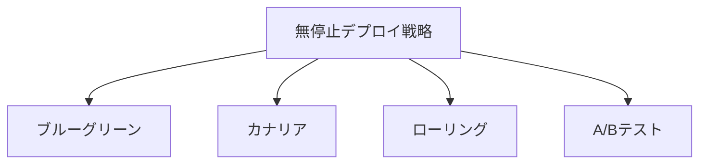

# 稼働中のアプリケーションのデプロイ戦略およびテスト戦略

## 1. 概要

### A. 定義
> 運用中(無停止)のアプリケーションに新バージョンを**サービスへの影響なく安全に反映**し、デプロイ前後に欠陥・性能を検証してリリースリスクを制御する戦略。CI/CD・DevOps実践の中核となる軸である。

### B. 登場背景および必要性
かつてのようにサービスを停止して新バージョンを丸ごと入れ替える方式は、24/365で稼働する今日のサービスにおいては、すなわち売上・信頼の損失を意味する。さらに、デプロイ周期が短くなり(1日に何度も)、マイクロサービスによってデプロイ単位が細かく分かれるにつれ、「一度にすべて変更し、問題が起きたら元に戻す」というアプローチはリスクが大きすぎる。そこで、**変更を少数のユーザー・少数のインスタンスにまず公開してリスクを早期に検知し、問題があれば即座に元に戻す(Zero-downtime・迅速なロールバック)**段階的なデプロイ戦略が必要となった。核心思想は**影響範囲(Blast Radius)の最小化**、すなわち問題が発生しても影響を受ける範囲を可能な限り狭く保つことである。

## 2. デプロイ戦略

無停止デプロイ戦略は「新バージョンをどのように公開するか」で分かれ、それぞれロールバック速度・リソースコスト・リスク検知力のバランスが異なる。

| 戦略 | 方式 | 長所 | トレードオフ |
|---|---|---|---|
| **ブルーグリーン** | 新(グリーン)・旧(ブルー)環境を同時に運用した後、トラフィックを一度に切り替え | 即時ロールバック(切り替えを戻すだけ) | インフラコストが2倍 |
| **カナリア** | 一部のトラフィックにのみ新バージョンを公開した後、段階的に拡大 | リスクの早期検知、影響最小 | デプロイ時間が長い、バージョン共存の管理 |
| **ローリング** | インスタンスを順次入れ替え | 追加リソース最小 | ロールバックが遅い、一時的なバージョン混在 |
| **A/Bテスト** | バージョンごとにトラフィックを振り分けて成果を比較 | 機能・ビジネス成果の実験 | 統計的設計が必要 |

**ブルーグリーン**は、同一の運用環境をもう一つ立ち上げて新バージョンを完成させておき、ロードバランサでトラフィックを一度に移す方式であるため、問題が生じれば再び旧環境に切り替えるだけでよく、ロールバックが即時である。その代わり二つの環境を同時に維持するため、リソースが2倍かかる。**カナリア**は、鉱夫が有毒ガスを検知するためにカナリアを先に立てたことに由来する名前のとおり、新バージョンを全体の5%→25%→100%と少しずつ公開しながら指標を観察する方式であり、リスクを最も早く捉えることができる。**ローリング**はインスタンスを一つずつ新バージョンに入れ替えるため追加インフラがほとんど不要であるが、問題が遅れて発見されると、すでに入れ替えたインスタンスを戻すのに時間がかかる。**A/Bテスト**はデプロイ手法というより、二つのバージョンのコンバージョン率などビジネス成果を比較する実験目的が強い。

## 3. テスト戦略(デプロイ段階との連携)

デプロイ戦略がいかに精巧であっても、各段階で何を検証するかが裏付けられていなければ、リスクを取り除くことはできない。そこでテストを**デプロイ前–中–後**に分けて配置する。

| 段階 | テスト | 目的 |
|---|---|---|
| **デプロイ前** | 単体・結合・回帰テスト(CI)、性能・セキュリティテスト | リリース候補の欠陥を事前に遮断 |
| **デプロイ中** | カナリア分析(エラー率・遅延のモニタリング)、スモークテスト | 実ユーザーへの公開中に異常を早期検知 |
| **デプロイ後(運用)** | シャドー/ダークローンチ、機能トグル、カオステスト、A/B成果測定 | 運用環境での検証・成果確認 |

デプロイ前段階の核心は**回帰テスト**であり、変更が既存機能を壊していないかを確認してリリース候補の信頼性を確保する。デプロイ中は**カナリア分析**が新バージョンと旧バージョンのエラー率・応答遅延をリアルタイムに比較し、統計的に有意な悪化が見られれば拡大を止めてロールバックを促す。デプロイ後の手法のうち**シャドー(ダークローンチ)**は、実トラフィックを複製して新バージョンにも流すが、その応答はユーザーに返さないため、ユーザーへの影響なく運用負荷下での動作を検証する。**機能トグル(Feature Flag)**は、コードをデプロイしておきつつ機能の公開はスイッチで別途制御して**デプロイ(Deploy)とリリース(Release)を分離**するため、問題発生時には再デプロイなしにスイッチを切るだけで即座に対応できる。

## 4. 安全なデプロイを支える要素

段階的なデプロイとテストが効果を発揮するには、異常を「見ることができ」、問題発生時に「自動で元に戻せる」基盤が前提となる。

| 要素 | 役割 |
|---|---|
| **オブザーバビリティ(Observability)** | ログ・メトリクス・トレーシングで異常を早期検知 |
| **自動ロールバック** | エラー率・遅延が閾値を超えると自動的に前バージョンへ復帰 |
| **機能トグル** | デプロイとリリースを分離して公開を独立制御 |
| **段階的デプロイ** | 影響範囲の最小化による事故影響の縮小 |

特に**オブザーバビリティと自動ロールバックは安全なデプロイの前提条件**である。カナリアで5%に公開したとしても、その5%でエラー率が急増していることをメトリクスで検知できなければ、リスクの早期検知という目的そのものが崩れ、検知できても人が手動で対応すればその間に被害が拡大する。そのため、閾値違反時に自動でトラフィックを元に戻す仕組みが必要である。

## 5. 考慮事項および示唆点
- **オブザーバビリティ+自動ロールバックが前提**: 指標に基づく判断と自動復旧がなければ、いかなる段階的デプロイ戦略も安全を保証できない。
- **プログレッシブデリバリーの自動化**: GitOpsとArgo Rollouts・Flaggerのようなツールで、カナリアの拡大・分析・ロールバックを宣言的に自動化する方向へ発展している。
- **DBスキーマ変更の無停止処理**: アプリケーションが無停止でも、DBスキーマ変更では旧・新バージョンが一時的に共存するため、カラムを先に追加し後で削除する**Expand-Contract(拡張-収縮)**パターンで下位互換性を維持してこそ、デプロイ中の障害を防ぐことができる。

---

> **一言まとめ**: 無停止デプロイは*ブルーグリーン・カナリア・ローリング・A/B*で影響範囲を最小化してリスクを制御し、*デプロイ前(回帰)–中(カナリア分析)–後(シャドー・機能トグル)*のテストを段階的に連携させ、オブザーバビリティ・自動ロールバックを前提にプログレッシブデリバリーとExpand-ContractのDB変更によって安全なリリースを実現する。
