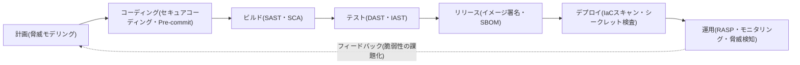
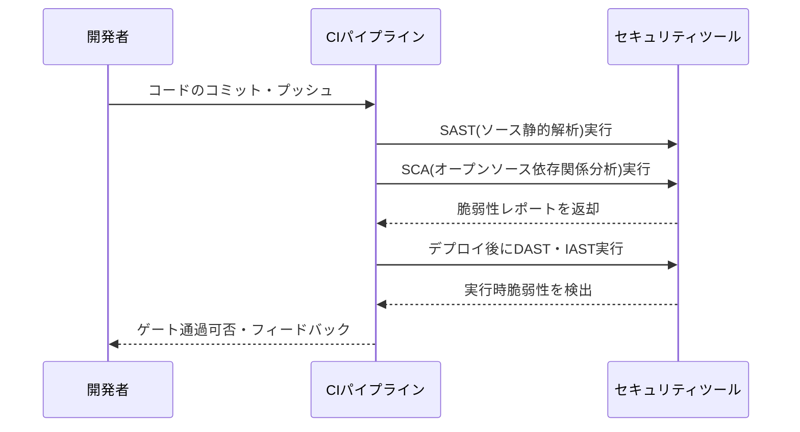

# DevSecOps(デブセックオプス)

## 1. 概要

> **DevSecOps**とは、開発(Development)・セキュリティ(Security)・運用(Operations)を一つの連続した流れに統合し、セキュリティをソフトウェアライフサイクル(SDLC)の**全過程に自動化された形で内在化**する開発・運用の文化であり方法論である。核心思想は「セキュリティを開発の最後の関門ではなく、最初から全員の責任(Security as Code、Shift-Left)にする」ことである。

DevSecOpsが登場した背景は、従来のDevOpsと伝統的なセキュリティ体制との間の構造的な衝突にある。DevOpsがCI/CDパイプラインによってデプロイ周期を日単位・時間単位に短縮する間も、セキュリティは依然として開発終了後のリリース直前に別のセキュリティチームが手動で点検する**後追い(後行)のゲート**のままであった。その結果、セキュリティ点検は迅速なデプロイのボトルネックとなるか、スケジュールに押されて形式的に省略された。発見された脆弱性を本番デプロイ直前に修正するコストは、設計段階で修正するコストの数十倍に達するという点(欠陥の早期発見の経済性)から、セキュリティを後回しにする構造はコストとリスクを同時に増大させた。

また、オープンソース・コンテナ・クラウドが普及するにつれ、攻撃対象領域が爆発的に増加した。一つのアプリケーションが数百のオープンソース依存関係とコンテナイメージ、IaCスクリプトで構成される今日、人間がリリースのたびにこれらを手動で点検することは物理的に不可能である。DevSecOpsはこうした問題を、**セキュリティ活動をコード化・自動化してパイプラインの中に押し込む(Shift-Left)**方式で解決する。すなわち、セキュリティを別組織による統制ではなく、開発者がコミットのたびに即座にフィードバックを受ける品質特性へと転換することがDevSecOpsの本質である。

## 2. DevSecOpsパイプラインアーキテクチャ

DevSecOpsの骨格は、既存のCI/CDパイプラインの各段階に対応するセキュリティ活動を配置し、その結果をゲート(Gate)として通過可否を自動判定する構造である。以下の概念図は、計画から運用までの各段階にセキュリティが組み込まれる全体の流れを示している。

このパイプラインの各段階は、それぞれ異なる観点からセキュリティを検証する。**計画段階**では、設計図レベルで脅威を識別する脅威モデリング(STRIDEなど)を行い、コードが書かれる前に構造的欠陥を取り除く。**コーディング段階**では、IDEプラグインとPre-commitフックにより、開発者がタイピングした瞬間に脆弱なパターンやハードコードされたシークレットを警告する。このように左側(初期)に行くほど発見コストが低くなるため、DevSecOpsは可能な活動をできるだけ前段へ移すことを志向する。

**ビルド・テスト段階**は、自動分析ツールが集中する区間である。ソースコードの静的解析(SAST)とオープンソース構成分析(SCA)がビルド時に実行され、デプロイ可能な成果物が作られると、稼働中のアプリケーションを外部から攻撃してみる動的解析(DAST)と、実行時の内部計測を組み合わせたインタラクティブ解析(IAST)が続く。**リリース・デプロイ段階**では、コンテナイメージの脆弱性スキャンとデジタル署名、構成要素明細書(SBOM)の生成、IaC(Terraformなど)の設定ミス検査が行われる。最後の**運用段階**では、ランタイム自己防御(RASP)と継続的モニタリングによってデプロイ後の脅威を検知し、発見された問題を再び計画段階へフィードバックして循環構造を完成させる。

## 3. 中核となるセキュリティ解析手法(SAST・DAST・IAST・SCA)

DevSecOps自動化の中心には四つのアプリケーションセキュリティテスト(AST)手法があり、これらは異なる時点と観点から相互補完的に機能する。以下のシーケンス図は、一つのコミットがパイプラインを通過しながら各解析を経る過程を示している。

**SAST(Static Application Security Testing)**は、ソースコードやバイトコードを実行せずに解析し、SQLインジェクション・バッファオーバーフローのようなコーディング上の脆弱性を見つける。開発初期から適用可能で、脆弱な箇所をコード行単位で指摘できるという長所があるが、実際の悪用可能性とは無関係に警告を大量に出す**誤検知(False Positive)**が多いという限界がある。反対に**DAST(Dynamic AST)**は、稼働中のアプリケーションを実際の攻撃者のように外部からスキャンするため誤検知が少なく、実際のエクスプロイト可能性を確認できるが、脆弱性のソースコード上の位置を示すことができず、テストカバレッジが画面・エンドポイントに依存する。

**IAST(Interactive AST)**はこの両者の折衷であり、アプリケーション内部に計測センサー(エージェント)を埋め込み、テストの実行中にデータフローを観察する。その結果、「外部入力が実際に脆弱なコードパスに到達したか」を判断できるため誤検知が低く、位置も特定できる。**SCA(Software Composition Analysis)**は観点が異なり、自ら記述したコードではなく、プロジェクトが取り込んで使用する**オープンソース・サードパーティライブラリの既知の脆弱性(CVE)とライセンス違反**を検出する。今日のコードの70~90%がオープンソースで構成されているという点で、SCAは事実上必須であり、SBOMと組み合わせてサプライチェーンセキュリティの基盤となる。

| 手法 | 解析対象 | 実行有無 | 強み | 限界 |
|------|-----------|-----------|------|------|
| SAST | ソース・バイトコード | 静的(非実行) | 早期適用、位置特定 | 誤検知が多い |
| DAST | 稼働中のアプリ(外部) | 動的(実行) | 低い誤検知、実際の悪用確認 | 位置不明、後追い |
| IAST | アプリ内部の計測 | 動的(実行) | 精度・位置特定ともに優秀 | 性能負荷、言語の制約 |
| SCA | オープンソース依存関係 | 静的(メタ分析) | サプライチェーン・ライセンス管理 | 自社コードの脆弱性は未検出 |

## 4. DevOpsとの比較および文化的転換

DevSecOpsはしばしば「DevOpsにセキュリティツールを追加したもの」と誤解されるが、本質はツールではなく**責任モデルの転換**にある。伝統的なモデルでは、セキュリティは別チームの専有物であり、開発者は機能実装のみに集中していた。DevSecOpsは「セキュリティは全員の責任(Everyone is responsible for security)」という原則のもと、開発者にセキュリティの能力を付与し、セキュリティチームは統制者から**ガードレールの提供者・支援者(Enabler)**へと役割を変える。すなわちセキュリティチームは、毎回のリリースを直接止める代わりに、開発者が自ら安全に作れるような自動化されたツール・ポリシー(Policy as Code)・標準テンプレートを提供する。

| 区分 | DevOps | DevSecOps |
|------|--------|-----------|
| セキュリティの位置 | リリース直前の後追い点検 | 全段階への内在化(Shift-Left) |
| セキュリティ責任 | 別のセキュリティチーム | 開発・運用・セキュリティの共同 |
| 実施方式 | 手動ゲート | 自動化(Security as Code) |
| 目標 | 迅速なデプロイ | 迅速かつ安全なデプロイ |

こうした転換の現実的な難しさは、ツール導入よりも**文化・プロセスの定着**にある。自動化ツールが誤検知を乱発すると開発者は警告を無視するようになり(アラート疲れ、Alert Fatigue)、ゲートが厳しすぎるとデプロイ速度というDevOps本来の価値が損なわれる。したがって、成功するDevSecOpsはリスクベースでゲートの強度を差別化し(致命的な脆弱性のみデプロイを遮断)、セキュリティチャンピオン(Security Champion)制度によって開発チーム内部にセキュリティの伝道者を置くなど、段階的なアプローチをとる。

## 5. 適用事例

ある大手金融フィンテック企業の事例を見ると、以前は四半期ごとに外部のペネトレーションテストで脆弱性を一括点検しており、発見から措置まで平均40日以上かかっていた。DevSecOpsへの転換後、GitHubのコミットごとにSAST・SCAを自動実行し、コンテナイメージスキャンをデプロイゲートに設定したところ、脆弱性の約80%が開発段階で自動検出・遮断され、平均措置時間は40日から2日以下に短縮された。特に、オープンソースライブラリのCritical CVE(例: Log4Shell型のリモートコード実行)が公開された直後、SBOMの照会だけで影響を受けるサービスを数時間以内に特定して緊急パッチをデプロイした点は、サプライチェーンセキュリティにおけるDevSecOpsの実質的な効用を示している。

## 6. 考慮事項および示唆点

技術士の観点から、DevSecOpsの導入は次の戦略的要素を総合的に考慮しなければならない。

- **段階的導入戦略**: すべてのセキュリティツールを一度にパイプラインへ組み込むと、誤検知と遅延によって開発組織の抵抗を招く。まずSCA・シークレットスキャンのように誤検知が少なく効果が確実なツールから適用し、ゲートも「警告の後に遮断」の2段階で緩やかに導入するのが現実的である。
- **速度-セキュリティのトレードオフ管理**: DevSecOpsの成否は、デプロイ速度を損なわずにセキュリティを確保するバランスにかかっている。フルスキャンは夜間パイプラインに分離し、コミット単位のパイプラインには増分(Incremental)解析のみを置いて、開発者へのフィードバック遅延を最小化する。
- **ガバナンス・規制との連携**: ISMS-P、個人情報保護法、そして米国大統領令以降に強化されたSBOM要求などの規制とパイプラインを連携させなければならない。Policy as Codeで規制要件を自動検証ルールとしてコード化すれば、監査(Audit)証跡も自動的に蓄積される。
- **サプライチェーンセキュリティへの拡張**: 自社コードだけでなく、オープンソース・コンテナ・CIツール自体も攻撃対象となる(SolarWinds型サプライチェーン攻撃)。SBOM・イメージ署名・アーティファクトの完全性検証(SLSAフレームワーク)まで含めてこそ、実質的な防御が完成する。
- **展望**: 今後DevSecOpsは、AIを活用した脆弱性の自動検出・自動パッチ生成、クラウドネイティブ環境のランタイム脅威検知(CNAPP)と結合しながら発展する見通しであり、ゼロトラストアーキテクチャと結合して「設計から運用まで信頼を検証する」統合セキュリティ体制へと収束していくとみられる。

---

> **一言まとめ**: DevSecOpsはセキュリティをSDLCの全過程に自動化(Security as Code)によって内在化し、できるだけ前段へ移動(Shift-Left)させることで、迅速なデプロイと安全を同時に達成する開発・セキュリティ・運用の統合方法論である。
