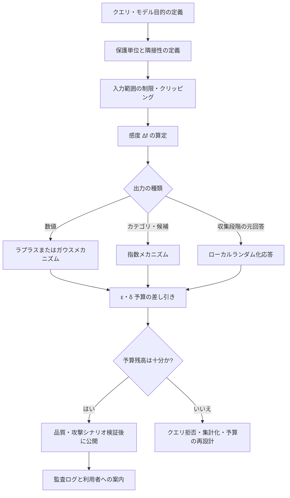

# 差分プライバシー(Differential Privacy)とプライバシー予算

## 1. 概要

> **定義**: 差分プライバシー(Differential Privacy、DP)は、個人1人のデータが含まれても除外されても分析結果の確率分布が大きく変わらないよう、無作為化されたメカニズムと数学的保証を提供するプライバシー強化技術(PET)である。

データに基づく意思決定は個人データを多く活用するほど正確になるが、生データの公開や反復的な問い合わせは再識別と属性推論のリスクを高める。
単に氏名・住民登録番号を削除するだけの非識別化は外部データとの結合攻撃に脆弱であり、公開後に新たな攻撃知識が登場すれば安全性を改めて判断しなければならない。
差分プライバシーは攻撃者の背景知識を制限せず、1人の個人の参加有無が結果に及ぼす影響そのものを確率比で制限するという点で、従来の手法とは出発点が異なる。

DPの核心はデータを永久に消去することではなく、データから結果を算出する公開メカニズムに保証条件を付与することである。
したがって、同一の源泉データであっても、クエリの種類、感度、許容可能な精度、反復公開の回数に応じて異なるノイズと予算を設計しなければならない。
個人情報保護担当者はプライバシー予算をセキュリティ設定値のように管理し、データサイエンティストは統計的有用性と誤差を併せて検証しなければならない。
技術士はアルゴリズムを提示するだけでなく、個人情報の処理目的、保護単位、結果の利用者、監査証跡、運用中の予算消費の統制を含むガバナンスを設計しなければならない。

### 1.1 登場背景と必要性

大規模な統計公開で最も難しい問題は、有用な集計結果を提供しながらも特定個人の寄与分を推論できないようにすることである。
例えば特定地域の平均所得を公開する際、1世帯が追加または除外されることで結果が大きく変わるならば、その世帯の存在や特性が明らかになりうる。
クエリ結果に一定の無作為性を導入すれば個々の寄与の影響は希釈されるが、無作為性は恣意的に加えるのではなく、関数の感度とプライバシーパラメータによって計算されなければならない。

DPはデータセット自体が匿名であるという主張ではなく、公開された分析過程が個人データについて限定された情報しか漏洩しないという主張である。
したがって、DPを適用した結果であっても、センシティブな集団の存在、既に公開された事実、モデルのバイアスをすべて取り除いてくれるわけではない。
保護単位が人なのか、世帯なのか、アカウントなのか、イベントなのかを先に決めなければ、同じ数値のεであっても実際の保護水準は異なる。

## 2. 差分プライバシーの原理と形式的定義

### 2.1 隣接データセットとメカニズム

DPは互いに隣接する二つのデータセットを比較する。
隣接データセットとは、1人のレコードが追加または削除された、あるいは適用ポリシーに応じて1人の値が変更されたデータセットである。
このとき、データベース全体を公開する代わりに無作為化関数であるメカニズム \(M\) にクエリを入力し、その出力のみを外部に提供する。

メカニズムの出力は、同じクエリを繰り返しても変わりうる。
重要なのは、二つの隣接データセットにおいて特定の出力が現れる確率の差を制限することであり、特定の個人がどちらのデータセットに属するかを出力だけ見て判別しにくくすることである。
この確率的観点は、攻撃者がどのような補助資料を持っているかを事前に仮定しなくてもよい最悪条件の保証につながる。

源泉データは権限のある統制領域に残しておき、クエリと感度を計算した後、保護された結果のみを境界の外へ渡すのが基本構造である。
予算管理者は個々のクエリのコストを記録し、累積コストが上限を超えればクエリを拒否するか、より強い保護設定を適用する。
結果の利用者は生レコードではなく統計結果を使用するため、データ最小化とアクセス制御がともに機能する。

### 2.2 ε-DPの正式な定義

無作為メカニズム \(M\) が、すべての隣接データセット \(D_1,D_2\) と可能な出力事象 \(S\) について次の条件を満たすとき、ε-差分プライバシーを満たすという。

\[
Pr[M(D_1) \in S] \le e^{\varepsilon} Pr[M(D_2) \in S]
\]

εはプライバシー損失またはプライバシー予算を表し、小さいほど二つの出力分布がより類似し、保護が強くなる。
ただしεは絶対的な安全等級やあらゆるリスクの確率ではなく、メカニズム・保護単位・クエリ集合とともに解釈しなければならない。
εが大きくなると一般に必要なノイズが減って精度が高まるが、個人1人の影響が結果により多く残りうる。

実務ではδを許容する(ε,δ)-DPも広く用いられる。
この定義は大部分の出力事象について確率比を制限しつつ、ごく小さな例外確率δを追加で許容することで、ガウスメカニズムや高度な合成を使用可能にする。
δは恣意的に大きな値に設定してはならず、データ規模・攻撃モデル・規制上の期待水準に合わせて文書化しなければならない。

### 2.3 DPが保証するものと保証しないもの

DPは参加有無による出力分布の変化を制限するため、特定個人のデータが結果に及ぼす追加的なリスクを低減する。
攻撃者が他の公開データと結合したとしても、定義自体が成立する限り保証の論理は維持され、複数の処理結果に対する累積損失も計算できる。
また、DPの結果に後処理を行ってもプライバシー保護の保証が弱まらないという後処理不変性(post-processing immunity)がある。

一方、DPは源泉データのバイアス、少数集団の統計的代表性、結果の公平性、システムのアクセス権限の問題を自動的に解決するわけではない。
分析結果が既に公開された情報と結合されて集団のセンシティブな特性を推定できてしまう問題も、別途のリスク評価が必要である。
したがってDPは、アクセス制御、暗号化、セキュリティログ、目的制限、保存期間の統制と代替関係にあるのではなく、多層防御の一つの層である。

|区分|説明|技術士の観点からの核心的な問い|
|---|---|---|
|保護単位|人・世帯・アカウント・イベントのうち何を1単位とみなすかを決定|1人が複数のレコードを生成する場合、寄与をどのようにまとめるか?|
|ε|確率比を制限する純粋プライバシーパラメータ|サービス全体で累積εをどのようなポリシーで制限するか?|
|δ|ごく小さな例外確率を許容する緩和パラメータ|δは保護対象数と攻撃可能性に比べて十分に小さいか?|
|感度|1人の個人データの変化がクエリ結果に及ぼす最大の影響|入力範囲の制限とクリッピングで感度を統制したか?|
|有用性|ノイズ付加後に結果が意思決定に使用できる程度|誤差・信頼区間・部分集団の品質をどのように検証するか?|

## 3. 感度と無作為化メカニズム

### 3.1 感度の設計

関数 \(f\) の大域感度は、隣接データセットにおいて出力が変化しうる最大の大きさとして定義される。
カウントクエリは1人の追加で最大1だけ変化するため感度が小さいが、合計クエリは個人の値の範囲が制限されていなければ感度が大きくなる。
したがって、合計・平均を公開する前には、所得や使用量のように大きな値の上限を定め、値を範囲内にクリッピングしなければならない。

クリッピングは外れ値を捨てる措置ではなく、1人の個人の影響力を一定範囲内に閉じ込めて保護コストを計算可能にする措置である。
しかし上限を低くしすぎると実際の分布の裾が切られて統計的バイアスが生じ、高くしすぎるとノイズが大きくなって有用性が低下する。
上限はドメイン知識、事前分布、感度分析、ポリシー基準を根拠に選択し、変更履歴を残さなければならない。

### 3.2 ラプラスメカニズム

ラプラスメカニズムは数値クエリにラプラス分布のノイズを加える。
代表的には \(M(D)=f(D)+Lap(Δf/ε)\) のように、感度に比例しεに反比例する尺度を用いる。
カウント、合計、平均のように出力が数値型で、純粋ε-DPを適用しようとする場合に理解しやすい選択肢である。

感度が1のカウントクエリに小さなεを適用するとノイズの分散が大きくなり、結果が負数になるなどドメイン制約を逸脱しうる。
このとき、負数の切り捨てや丸めのような後処理はDP保証を維持できるが、精度とバイアスは別途測定しなければならない。
複数の統計を同時に公表する場合は各統計にεを分割して割り当てる必要があるため、クエリ数が増えるほど個々の結果が不正確になりうる。

### 3.3 ガウスメカニズム

ガウスメカニズムは一般に(ε,δ)-DPを目標として正規分布のノイズを加える。
ベクトル形式の統計や機械学習の訓練のように、多次元と反復演算を扱う際に高度な合成分析と組み合わせやすい。
しかしδという例外確率を導入するため、データセットの規模と保護単位に比べてδが適切かを検討し、予算の計算モデルを明示しなければならない。

### 3.4 ランダム化応答と指数メカニズム

ランダム化応答は、アンケート回答者が自分の実際の回答を一定の確率で反転させて送信させる方式である。
収集段階で個人の元の回答を隠すローカルDPに適しているが、ノイズが累積するため多くの標本と慎重な推定手順が必要である。
中央サーバが生データを保有しない状況では、運用上の利便性よりも統計誤差と回答操作の可能性を先に検討しなければならない。

指数メカニズムは、出力が数値ではなく候補・ポリシー・推薦項目である場合に、効用スコアの高い候補を確率的に選択する。
例えば、個人を直接露出させずに業務の優先順位候補を選択するには、候補ごとのスコアの感度を求めた後に選択確率を調整できる。
この方式は、推薦品質を高めたいという要求とプライバシー保護の要求が衝突する意思決定システムに活用される。

### 3.5 合成とプライバシー会計

同一データセットに複数のクエリを実行すると、各クエリのプライバシー損失が累積する。
最も単純な逐次合成では、クエリごとのεを合算して全体予算を上限として計算する。
高度な合成はクエリ回数とパラメータを活用してより小さな上限を提供できるが、実装した会計方式と仮定が検証されていなければならない。

プライバシー会計には、データパイプラインの呼び出し量、ダッシュボードの更新、モデル訓練の反復、失敗後の再試行をすべて含めなければならない。
キャッシュされた結果を再利用すれば不要な予算の差し引きを減らせるが、キャッシュ結果が生データの変更と不整合を起こしていないかを確認しなければならない。
予算の枯渇を運用障害として扱うのではなく正常な保護統制として扱い、利用者に集計水準の変更や遅延を説明しなければならない。

## 4. 適用手順と運用アーキテクチャ

### 4.1 分析目的と脅威モデルの定義

最初の段階は、誰のどのような意思決定を支援するためにどのような結果を公開するのかを具体化することである。
内部の運用ダッシュボードなのか、外部の公的統計なのか、モデル訓練用の特徴量なのかによって、公開範囲と攻撃者の能力が異なる。
攻撃者が結果を繰り返し要求できるか、複数アカウントで迂回できるか、他のデータセットを結合できるかを脅威モデルに記録する。

分析目的が不明確な状態で先にノイズを加えると、保護水準を説明することが難しく、精度が低下した原因も追跡できない。
必要最小限の集計水準と公開周期を先に定め、生データへのアクセスを許可しなくても済むかを確認しなければならない。
保護対象と利害関係者について、個人情報保護責任者、データオーナー、統計専門家、サービス運用者とともに合意する。

### 4.2 予算配分とクエリポリシー

全体のε予算をサービス・部署・データセット・期間ごとに分離すれば、一つの機能の過剰なクエリが他の機能の保護を侵害することを防げる。
クエリテンプレートを事前承認し任意のSQLを禁止すれば、感度の算定と会計が単純になる。
ダッシュボードの自動更新周期を延ばしたり同一結果をキャッシュしたりすることは、精度を維持しながら予算を節約する運用手法である。

予算配分は数値を一つ宣言する問題ではなく、リスク受容基準と精度目標を調整する意思決定である。
少数集団の統計が重要な場合は全体平均の精度だけを見て配分してはならず、最小標本数と信頼区間の幅を併せて基準としなければならない。
予算変更は、承認者、変更理由、影響を受けるレポート、再現可能性を監査ログに残す。

### 4.3 品質検証と公開ゲート

保護された結果は元の正解と比較し、平均絶対誤差、相対誤差、分布の歪み、順位の保存、部分集団ごとの品質を点検する。
カウントが0未満になっていないか、確率の合計が1になるか、合計と部分和の関係が維持されているかといったドメインの不変条件をテストする。
不変条件の補正は後処理として実施できるが、補正が結果間の相関を生んで攻撃対象領域を拡大していないかを分析しなければならない。

再識別の観点では、1回の結果だけでなく、複数の期間と複数の次元の結果を組み合わせた攻撃をシミュレーションする。
予算会計が計算した理論的上限と実際のシステムログの呼び出し回数が一致するかを照合する。
品質・保護・運用の検証をすべて通過した場合にのみ公開し、不合格の場合は集計水準を上げるかクエリを拒否する。

## 5. 手法の比較と選択基準

非識別化は、直接識別子を削除または仮名化するデータ中心のアプローチである。
DPはデータセットに対する分析結果の感度を制限する出力中心のアプローチであるため、両手法は競合関係ではなく併用できる。
仮名化された源泉データであっても、DPなしに反復集計すれば個人の寄与分が推論されうるという点が核心的な違いである。

k-匿名性は準識別子の組み合わせが最低k件のレコードと同じに見えるよう一般化・抑制するが、同質性攻撃や背景知識攻撃を十分に防げない場合がある。
DPは攻撃者の知識と無関係な確率的保証を提供するが、予算を誤って設定したり有用性の要求が過大であったりすると、実務適用が難しくなる。
準同型暗号は暗号化された状態で計算する機密性技術であり、計算コストと実装の複雑さが高いが、サーバが平文を見なくてもよいという長所がある。
連合学習はデータを移動させずに複数の参加者がモデルを共同学習するが、更新情報自体からの情報漏洩を防ぐには、DPや安全な集約が追加で必要である。

|手法|保護の位置|長所|限界とDPとの関係|
|---|---|---|---|
|仮名化・マスキング|保存データ・識別子|実装が容易で業務上の識別性を一部維持|結合・推論攻撃に脆弱で、DPを代替しない|
|k-匿名性・l-多様性|公開テーブル|構造的な識別リスクを直感的に説明|背景知識・同質性攻撃と反復公開に脆弱な場合がある|
|差分プライバシー|クエリ・モデル出力|定量的かつ合成可能な最悪条件保証|ノイズによる精度低下と予算設計が必要|
|準同型暗号|計算中のデータ|サーバが平文を見ずに演算可能|コストが高く、結果公開時にはDPが依然として有用でありうる|
|連合学習|分散学習過程|生データを中央に集めない|更新情報の漏洩を防ぐためDP・安全な集約が必要|

選択基準は、センシティブな源泉データの保管場所、分析結果の公開範囲、リアルタイム性、計算コスト、反復クエリ数、規制上の説明可能性である。
公的統計のように結果を繰り返し公開する場合は、DPの予算会計が強みを発揮する。
少数の参加者による協業分析では、連合学習と安全な集約を組み合わせ、最終統計をDPで保護する多層構造が現実的である。

## 6. 産業適用事例

### 6.1 公的な人口・経済統計

国勢調査や地域別統計は、個人単位の原資料を公開せず、地域・年齢・世帯形態別の集計を提供しなければならない。
地域を細分化しすぎると少数世帯の存在が明らかになり、大きくまとめすぎると政策での活用度が低くなる。
DPを適用すれば詳細なクロス集計表ごとに予算を配分し、小さなセルにはより強い保護や公開抑制を適用できる。

公表機関は統計利用者に対して、ε、δ、保護単位、誤差範囲、公開バージョンを説明しなければならない。
また、異なる表の合計が正確に一致しない場合があるため、一貫性補正とそれに伴う統計的バイアスを併せて公開しなければならない。
この事例の教訓は、単一データセットにDPを一度適用するのではなく、公開プログラム全体を予算単位で運用しなければならないという点である。

### 6.2 サービス利用分析と製品改善

オンラインサービスは、クリック・検索・購入イベントを活用して機能別の利用率と離脱率を計算する。
個々のユーザーの行動順序をそのまま共有せず、期間・機能別のカウントと比率をDPで保護すれば、製品チームはトレンドを確認できる。
同一ユーザーが複数のイベントを発生させる場合、イベント単位の保護は実際の個人保護より弱くなりうるため、ユーザー単位の寄与上限を設けなければならない。

例えば、1人のユーザーが1日に数千回イベントを発生させうる場合、ユーザーごとのイベント数を制限し超過分をクリッピングしてから、カウントの感度を計算する。
こうすることで、ヘビーユーザー1人が結果と予算を同時に支配する問題を軽減できる。
製品チームは実験群ごとの差を判断する際にDPノイズの信頼区間を含めて考え、小さな改善を性急に有意と結論づけてはならない。

### 6.3 プライバシー保護機械学習

機械学習の訓練では個人レコードの影響がモデルパラメータに残りうるため、勾配をクリッピングしノイズを加えるDP-SGD系のアプローチを用いることができる。
各訓練ステップのクリッピングノルムとノイズの大きさ、サンプリング率、反復回数に基づいて、訓練全体のεとδを推定する。
保護水準が強くなるほど訓練の収束と精度が低下しうるため、モデル性能だけでなくメンバーシップ推論攻撃に対する露出度も評価しなければならない。

小さなデータセットで同じ予算を使用すると、ノイズの相対的な影響が大きくなる。
したがって、モデルをDPで訓練する前に、公開・非センシティブな事前学習済みモデルを活用するか、訓練目標と保護単位を再設計するほうが費用対効果が高い場合がある。
DP訓練がモデルのあらゆるバイアスや生成結果の有害性を取り除くわけではないため、公平性・安全性の評価は別途実施する。

## 7. 発展: NISTの評価ガイドラインと最新の実務動向

NISTは差分プライバシー保証を評価するためのガイドラインにおいて、DPを個人データが分析結果に現れる際のプライバシーリスクを定量化する数学的フレームワークとして説明している。
このガイドラインは、定義を満たしていると宣言することから一歩進んで、保護単位と隣接性、メカニズム、パラメータ、合成、実装上の仮定を評価対象とみなす。
したがって組織は、製品説明書に単に「DP適用」と書くのではなく、どのデータ処理段階にどのような保証を適用したかの証跡を残さなければならない。

近年の実務の方向性は、ε一つを宣伝することから、プライバシー保証と有用性を併せて測定することへと移行している。
予算会計サービス、自動クエリ拒否、モデル訓練ログ、公開バージョンごとのパラメータ管理が、プラットフォーム機能として統合されなければならない。
特に同一データを複数のチームが共有する場合、中央の会計なしに各チームが独立して予算を使用すると全体の保証が崩れうるため、組織単位の予算台帳が必要である。

技術士の答案では、定義式だけを暗記するよりも、保護単位の設定から公開ゲートまでのライフサイクルを提示するのが効果的である。
問題で公的統計、推薦、機械学習、データ共有のいずれの文脈が与えられても、感度・メカニズム・予算・有用性・監査を結びつけて説明しなければならない。
また、DPの限界も併せて明らかにすれば、非識別化万能論を避け、アクセス制御と暗号技術を組み合わせる設計の観点を示すことができる。

## 8. 考慮事項および示唆点

### 8.1 保護単位と寄与度

1人が複数のレコードを生成するサービスでは、レコード単位の隣接性だけを用いると実際の個人保護が弱くなる。
ユーザー・世帯単位で寄与を制限し、セッション・期間ごとの最大イベント数を先に定義しなければならない。
保護単位の変更はεの数値変更よりも実質的な影響が大きい場合があるため、プライバシー影響評価とともに検討する。

### 8.2 予算のポリシー化

εとδを開発者が恣意的に選択しないよう、データ等級、公開対象、期間、使用目的に応じた基準表を作成する。
予算は機能ごとに分離し、再利用・再試行・バッチ処理をすべて会計に含める。
予算残高と消費理由を運用ダッシュボードに表示すれば、分析チームは保護統制を迂回せずにクエリを計画できる。

### 8.3 有用性と公平性

ノイズは全体平均よりも少数集団の結果により大きな相対誤差を生じさせうる。
部分集団ごとの誤差と信頼区間、意思決定閾値の変動を点検し、保護のために特定集団が体系的に不利になっていないかを確認する。
精度を高めるためにεを大きくする前に、集計水準、公開周期、クエリの重複を減らす設計を優先する。

### 8.4 実装・検証と再現性

乱数生成器、クリッピング、サンプリング、合成の計算は実装ごとに異なりうるため、検証済みのライブラリとバージョン固定を用いる。
シード固定はテストの再現性に役立つが、運用上の公開結果が予測可能にならないよう、テスト用と運用用の乱数を分離する。
パラメータと源泉データのアクセス権限、結果の生成時刻、予算の差し引き履歴を監査ログとして保存する。

### 8.5 組み合わせによる防御

DPが出力の追加リスクを制限するとしても、源泉データのアクセス・転送・保存の過程には暗号化と権限統制が必要である。
原本には最小限の人員のみがアクセスし、仮名化・保存期間・鍵管理・侵害対応を別途の統制として運用する。
DP、安全な集約、準同型暗号、連合学習のいずれを選択するかは攻撃対象領域とコストを基準に決定し、流行の技術を一律に適用しない。

### 8.6 説明可能性と利用者への告知

非専門の利用者はεを保護確率と誤解しうるため、パラメータの意味と統計誤差を平易な言葉で併せて告知する。
公開結果のバージョン、集計範囲、ノイズ適用位置、再利用制限、問い合わせ窓口をデータカタログに記録する。
内部承認者は、保護が十分であるという宣言よりも、計算根拠と品質測定結果を確認しなければならない。

### 8.7 展望と連携技術

生成AIと分析プラットフォームが自然言語クエリを通じて複数の統計を自動実行するようになれば、プライバシー会計とクエリの重複排除がさらに重要になる。
AIエージェントに任意のクエリ権限を与えるのではなく、許可されたテンプレート、予算トークン、結果等級、監査イベントをポリシーエンジンで強制しなければならない。
今後は、DP保証の数値とモデルの安全性・公平性・データ品質の指標を一つのAIガバナンスダッシュボードで併せて管理する方向が望ましい。

## 参考資料

1. NIST, “Guidelines for Evaluating Differential Privacy Guarantees,” https://nvlpubs.nist.gov/nistpubs/SpecialPublications/NIST.SP.800-226.pdf
2. NIST, “NIST Finalizes Guidelines for Evaluating ‘Differential Privacy’ Guarantees,” https://www.nist.gov/news-events/news/2025/03/nist-finalizes-guidelines-evaluating-differential-privacy-guarantees-de
3. NIST, “Differential Privacy for Privacy-Preserving Data Analysis,” https://www.nist.gov/blogs/cybersecurity-insights/differential-privacy-privacy-preserving-data-analysis-introduction-our
4. NIST, “Differential Privacy: Future Work & Open Challenges,” https://www.nist.gov/blogs/cybersecurity-insights/differential-privacy-future-work-open-challenges
5. Dwork, C., “Differential Privacy,” International Colloquium on Automata, Languages, and Programming, https://link.springer.com/chapter/10.1007/11787006_1

---

> **一言まとめ**: 差分プライバシーは、個人1人の寄与が分析結果を変える程度をε・δとプライバシー予算で制限し、有用性と定量的なプライバシー保護を併せて設計する出力中心のPETである。
