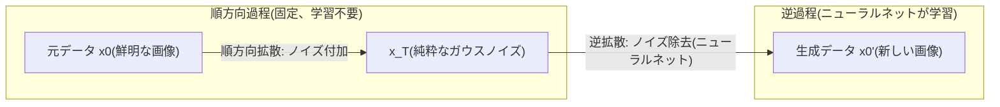
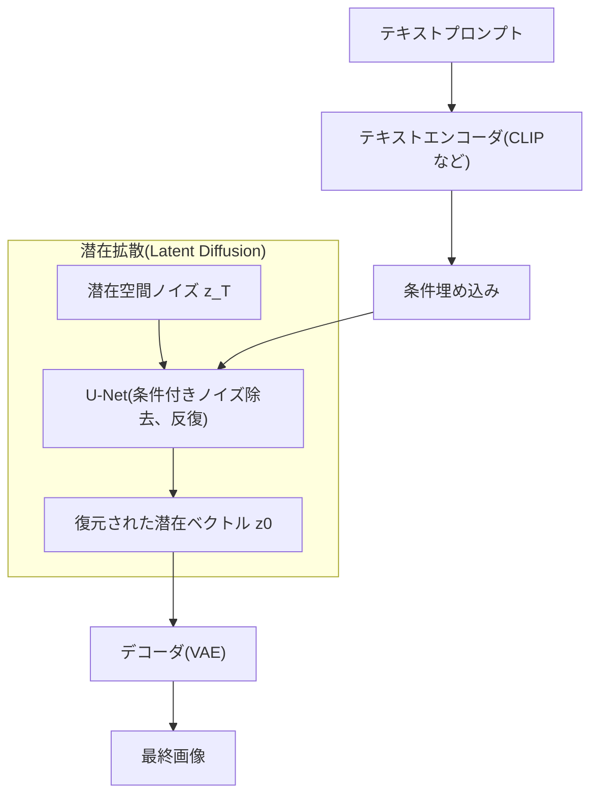

# 拡散モデル(Diffusion Model)

## 1. 概要

> **拡散モデル(Diffusion Model)**とは、データにノイズ(noise)を段階的に加えて純粋なガウスノイズにする**順方向拡散過程(Forward Diffusion)**と、その逆過程をニューラルネットワークで学習してノイズからデータを復元・生成する**逆拡散過程(Reverse Denoising)**で構成される生成型(Generative)ディープラーニングモデルである。

生成AIの目標は、学習データの確率分布p(x)を近似し、その分布から新たな標本を抽出することである。2014年に登場したGAN(Generative Adversarial Network)は、生成器と識別器の敵対的競争によって高品質な画像を生成したが、学習が不安定でモード崩壊(mode collapse、多様性の喪失)に脆弱であった。VAE(変分オートエンコーダ)は学習が安定しているが、生成画像がぼやけるという限界があった。拡散モデルは「生成を一度に行わず、ノイズを少しずつ取り除く数百段階の漸進的な復元問題に分解する」という発想でこのジレンマを解いた。各段階が小さく扱いやすい問題に分割されるため学習が安定し、標本の多様性と写実性(fidelity)を同時に確保する。

拡散モデルが注目される根本的な理由は、**品質・多様性・安定性のバランス**である。2020年のDDPM(Denoising Diffusion Probabilistic Models)論文がGANに匹敵する画像品質を示して以降、2021~2022年を経て、Stable Diffusion・DALL·E 2・Imagen・Midjourneyなどテキスト-画像生成サービスの事実上の標準基盤技術となった。今日では画像だけでなく、オーディオ(音声合成)、動画、3D、タンパク質構造生成などへと応用が広がっており、技術士の観点から生成AIの核心原理として必ず理解すべきテーマである。

## 2. 順方向・逆拡散過程の原理

**順方向拡散過程**は、元データx0に各ステップtごとに小さなガウスノイズを加えてx1, x2, …, x_Tとするマルコフ連鎖(Markov chain)である。ノイズの強さは事前に定めたスケジュール(β1…βT、variance schedule)によって決まり、通常Tは数百~数千ステップに及ぶ。この過程は学習パラメータを持たない**固定された過程**であるという点が核心である。また、再パラメータ化(reparameterization)によって任意のステップtの状態x_tをx0から一度に計算できるため、学習時に各ステップを逐次シミュレーションしなくてもよいという計算上の利点をもたらす。十分に大きなTでは、x_Tは元データの痕跡が消えた標準正規分布に収束する。

**逆拡散過程**は、ノイズが混入したx_tから一つ前のx_(t-1)を推定する過程をニューラルネットワークで学習する。直感的には「このぼやけた画像にどのようなノイズが混ざっているかを予測し、その分だけ取り除け」という問題である。実際のDDPMでは、ニューラルネットワークは各ステップで加えられたノイズεを予測するように学習され、損失は予測ノイズと実際のノイズとの平均二乗誤差(MSE)という非常に単純な形をとる。この単純さが学習安定性の秘訣である。学習が終われば、純粋なノイズx_Tから始めてニューラルネットワークでノイズをT回取り除きながら新たなデータを生成する。

逆過程のニューラルネットワークの構造としては**U-Net**が広く用いられる。U-Netはエンコーダ-デコーダ間にスキップ接続(skip connection)を設けて画像の大域的構造と局所的ディテールを同時に保持し、各層に現在のステップtを時間埋め込みとして注入することで、「今どれだけノイズの多い段階か」をニューラルネットワークに認識させる。近年ではU-Netの代わりにトランスフォーマーベースのDiT(Diffusion Transformer)をバックボーンとする方式も広がっており、代表的にはOpenAI Soraの動画生成がこの系統を採用したとされる。

## 3. 条件付き生成と潜在拡散

初期の拡散モデルは無条件(unconditional)生成、すなわち「任意の画像」を作るにとどまっていた。実用化の鍵は「望むもの」を作る**条件付き生成(Conditional Generation)**である。テキスト-画像生成では、プロンプトをCLIPのようなテキストエンコーダで埋め込み、U-Netのアテンション(cross-attention)層に注入して、ノイズ除去の各ステップがテキスト条件に従うよう誘導する。ここに**分類器不要ガイダンス(Classifier-Free Guidance、CFG)**の手法を組み合わせると、条件を与えた予測と与えない予測の差を増幅してプロンプトへの忠実度を大きく高めることができる。CFGの強度(guidance scale)を上げるとプロンプトにより忠実に従うが、多様性と自然さが低下するというトレードオフがある。

拡散モデルの実用化を決定づけたもう一つの革新は、**潜在拡散モデル(Latent Diffusion Model、LDM)**である。ピクセル空間で直接拡散を行うと(例: 512×512×3)、演算量が膨大になる。LDMはまずVAEエンコーダで画像を低次元の潜在空間(例: 64×64)に圧縮し、**その潜在空間で拡散・復元を行った後**、VAEデコーダで元の解像度の画像を復元する。これにより計算量を数十分の一に削減し、一般的なGPUでも高解像度の生成が可能となったのであり、これこそがStable Diffusionの中核構造である。潜在空間への圧縮によって知覚的に重要な情報に集中し、微細な高周波ノイズの処理負担を軽減する効果もある。

| 区分 | ピクセル空間拡散(DDPM) | 潜在拡散(LDM/Stable Diffusion) |
|------|------|------|
| 拡散を行う空間 | 元のピクセル(高次元) | 圧縮された潜在ベクトル(低次元) |
| 演算量・メモリ | 非常に大きい | 大幅に減少(数十分の一) |
| 高解像度生成 | 困難 | 消費者向けGPUでも可能 |
| 代表モデル | DDPM, ADM | Stable Diffusion, SDXL |

## 4. GANなど他の生成モデルとの比較

生成モデルの特性を比較すると、拡散モデルがなぜ主流となったのか、その理由が明確になる。GANは単一の順伝播(one-shot)で生成するため**推論が速い**が、識別器とのバランスが崩れると学習が発散したり、モード崩壊によって特定のパターンばかりを繰り返し生成したりする問題がある。拡散モデルは逆に学習が安定し標本の多様性に優れるが、生成時に数十~数百ステップを繰り返す必要があるため、**推論速度が遅いこと**が根本的な弱点である。これは拡散が「多数の小さな問題に分解」した代償であり、品質・安定性と速度が相反することを示している。

この速度の問題を緩和するため、サンプリングステップを大幅に削減する手法が発展した。DDIM(決定論的な非マルコフサンプラー)は数十ステップでも十分な品質を実現し、さらに潜在一貫性モデル(LCM)・蒸留(distillation)手法はわずか1~4ステップでの生成まで実現して、リアルタイム生成に近づいている。すなわち、初期の「遅い」という通念は急速に解消されつつある。

| 比較項目 | GAN | VAE | 拡散モデル |
|-----------|-----|-----|-------------|
| 生成品質(写実性) | 高い | 中程度(ぼやける) | 非常に高い |
| 標本の多様性 | 低い(モード崩壊のリスク) | 高い | 高い |
| 学習の安定性 | 低い | 高い | 高い |
| 推論速度 | 速い(1-step) | 速い | 遅い(多段階、改善中) |
| 代表的な活用 | 顔・超解像 | 表現学習 | テキスト-画像・映像・オーディオ |

実際の産業適用事例として、新薬・素材開発では拡散モデルで所望の物性を持つ分子構造を生成し(RFdiffusionなどのタンパク質設計)、製造では欠陥画像が不足する場合に学習用の欠陥データを拡張し、メディア・広告ではコンセプトアートや試案の制作時間を短縮する。一例として、テキスト-画像サービスはデザイナーの初期試案の作業時間を数時間から数分単位に短縮すると報告されている。

## 5. 考慮事項および示唆点

拡散モデルを導入・活用する際には、技術士の観点から次の点を考慮しなければならない。

- **性能-コストのトレードオフ管理**: 生成品質(ステップ数・解像度・guidance scale)と推論遅延・GPUコストは直結する。リアルタイムサービスであればDDIM・LCM・モデル蒸留でステップ数を減らし、バッチ生成であれば品質を優先するなど、目的別の最適点を設計しなければならない。潜在拡散の採用によってインフラコストを構造的に下げることも核心的な戦略である。

- **著作権・データガバナンス**: 大規模なWebクローリングデータで学習するため、著作権侵害、特定作家の画風の模倣、学習データ汚染(data poisoning)の問題が常に存在する。データ出所の管理、ライセンス遵守、オプトアウトの反映、生成物の商用利用ポリシーを事前に確立しなければならない。

- **悪用への対応とウォーターマーキング**: 写実的な生成能力は、ディープフェイク・虚偽情報の生成に悪用されうる。生成物に不可視のウォーターマーク(例: SynthID)を埋め込み、来歴(provenance)標準(C2PAなど)を適用し、コンテンツフィルタ・安全分類器で有害な生成を遮断する多層防御が必要である。

- **評価指標の選定**: 生成品質はFID(Fréchet Inception Distance、実分布との距離)・ISなどで定量評価しつつ、テキスト整合度はCLIP Scoreで、ユーザー満足度は定性評価で併せて評価してこそ、信頼できる判断が可能となる。

- **展望と連携技術**: 拡散ベースの動画・3D・ワールドモデルへと拡張され、トランスフォーマーバックボーン(DiT)と結合してスケーラビリティ(scaling)が強化されている。RAG・マルチモーダルLLM・エージェントと結合して生成-検証-編集を自動化するパイプラインへと発展する見通しであるため、ファウンデーションモデル・マルチモーダルAIと連携して統合的に理解する必要がある。

## 参考資料

- Ho et al., "Denoising Diffusion Probabilistic Models"(DDPM), 2020: https://arxiv.org/abs/2006.11239
- Rombach et al., "High-Resolution Image Synthesis with Latent Diffusion Models", 2022: https://arxiv.org/abs/2112.10752
- Stability AI, Stable Diffusion: https://stability.ai/

---

> **一言まとめ**: 拡散モデルは、データにノイズを段階的に加える順方向過程とそれをニューラルネットワークで元に戻す逆過程から構成される生成モデルであり、学習の安定性と品質・多様性を同時に確保し、潜在拡散・条件付き生成の手法によってテキスト-画像・映像生成の標準基盤技術として定着した。
