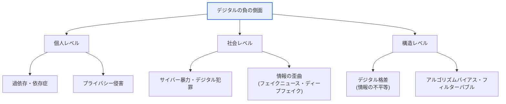
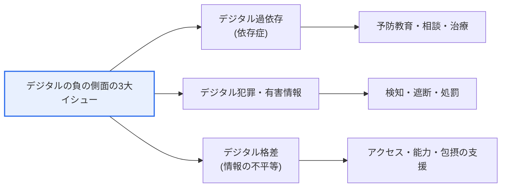

# デジタルの負の側面(Digital Dysfunction)

## 1. 概要

### A. 定義
> **デジタルの負の側面(Digital Dysfunction)**とは、デジタル技術の普及がもたらす便益の裏側で発生する**社会的・個人的な弊害**の総称である。スマートフォン・インターネットへの過依存(依存症)、サイバー暴力・デジタル犯罪、フェイクニュース・ディープフェイクのような情報の歪曲、デジタル格差、プライバシー侵害などを包括する概念である。

デジタルの負の側面が今日深刻な社会問題として浮上した根本的な理由は、**技術の便益が大きくなるほど、その副作用もともに拡大し高度化する**ためである。スマートフォン・SNS・生成AIが日常の奥深くまで入り込むにつれ、利便性とつながりの裏側で過依存・サイバー暴力・虚偽情報・プライバシー侵害が個人の健康と人間関係を損ない、さらには社会全体の信頼と安全を脅かしている。技術はそれ自体としては中立的であるが、利用と普及の影を管理しなければデジタルトランスフォーメーションがもたらす利益そのものが侵食されるという点で、負の側面の管理はデジタル社会の持続可能性の問題へと格上げされる。

特に近年は、負の側面の**様相そのものが質的に変化した**。かつての負の側面が個人の過剰利用や単純な悪質コメント程度のものであったとすれば、現在は生成AIが作ったディープフェイク・虚偽情報が本物と区別しにくいほど精巧になり、推薦アルゴリズムが利用者の好む情報だけを選んで見せる**フィルターバブル(filter bubble)・エコーチェンバー(echo chamber)**が社会的分極化を助長している。すなわち、負の側面が個人のレベルを超えて**世論・民主主義・社会統合**といった構造的な層へと広がっている。このため対応もまた、個人の節制や断片的な規制ではなく、制度・技術・教育・社会的セーフティネットを包括する総合対策へと進化しなければならない。

### B. 登場背景と必要性
デジタルの負の側面が注目された背景には、三つの構造的変化がある。第一に、スマートフォンの普及によってオンライン接続が**常時化・個人化**し、過依存の物理的障壁が消えた。第二に、プラットフォーム企業の収益モデルが**利用者の滞在時間(engagement)**に依存するようになり、刺激的・依存的な設計(無限スクロール、通知、推薦)が構造的に強化された。第三に、コンテンツの生産・流通コストがゼロに収束し、虚偽情報と有害コンテンツが**爆発的に拡散**する経路が開かれた。

こうした背景のもとで、デジタルの負の側面への対応が必要な理由は明確である。デジタルトランスフォーメーションが加速するほど負の側面も比例して大きくなるため、これを放置すれば個人の精神的健康の悪化・犯罪被害を超えて、**社会的な信頼コストと対立が蓄積**する。結局のところ、デジタル技術がもたらす便益を十分に活かすためにも、その影を最小化するバランスの取れた管理が前提とならなければならない。

## 2. デジタルの負の側面の類型と事例

デジタルの負の側面は単一の現象ではなく、複数の層で同時に現れる。以下の概念図は、負の側面を個人・社会・構造のレベルに分けて全体像を俯瞰したものである。

**個人レベル**の代表的な負の側面は、過依存とプライバシー侵害である。スマートフォン・ゲーム・SNSへの過度の没入は睡眠・学業・対人関係を損ない、深刻な場合にはうつ・不安といった精神的健康の問題につながる。これは先に指摘したとおり、プラットフォームの滞在時間最大化の設計とかみ合っており、個人の意志だけでは抜け出しにくいという点で構造的な性格を帯びる。プライバシー侵害は、位置・検索・消費の履歴が広範に収集・結合されることで、個人が自分の情報がどのように使われているかを制御できない状況を生む。

**社会レベル**では、サイバー暴力と情報の歪曲が際立っている。悪質コメント・集団いじめ・デジタル性犯罪は、匿名性と拡散性が結びついて被害が瞬く間に増幅され、回復が困難である。情報の歪曲は、フェイクニュース・ディープフェイク・操作された統計が真実のように流通して世論を誤らせる問題であり、特に選挙・災害といった局面で社会的混乱を拡大させる。

**構造レベル**の負の側面は、デジタル格差とアルゴリズムバイアスである。アクセス・活用能力の差が教育・経済・福祉の機会の不平等として固定化し、推薦アルゴリズムが偏った情報のみを提示することで確証バイアスと分極化を深める。これは個人の努力では解消されない、社会システムレベルの問題である。

これら三つのレベルは互いに独立しておらず、**相乗作用**を起こすという点が重要である。例えば、デジタルリテラシーの低い脆弱層(構造レベルの格差)はフェイクニュース・ディープフェイク(社会レベルの情報の歪曲)により騙されやすく、その結果、誤った情報に基づく判断で経済的被害を受けて格差がさらに広がる。逆に、情報活用能力の高い集団はアルゴリズムのバイアスまで認知して取り除く。このように個人・社会・構造の弊害が互いに原因であり結果として絡み合っているため、いずれか一つの層だけを狙った対策は効果が限定的であり、統合的なアプローチが求められる。

| 類型 | 代表的事例 | 性格 |
|---|---|---|
| **過依存・依存症** | スマートフォン・ゲーム・SNSへの過度の没入 | 個人の健康・日常の毀損 |
| **プライバシー侵害** | 個人情報の流出・過剰収集・監視 | 自己情報コントロールの喪失 |
| **サイバー暴力** | 悪質コメント・いじめ・デジタル性犯罪 | 匿名性・拡散性による被害 |
| **情報の歪曲** | フェイクニュース・ディープフェイク・フィルターバブル | 世論の誤導・信頼の崩壊 |
| **デジタル格差** | 世代・階層間のアクセス・活用格差 | 構造的な機会の不平等 |

## 3. デジタルの負の側面の3大イシュー

行政・政策の観点から、デジタルの負の側面はしばしば**3大イシュー**に集約して扱われる。前述の類型論が現象を広く展開したものであるとすれば、3大イシューは政策対応の焦点を定めるための分類である。

**デジタル過依存**は、スマートフォン・インターネットに過度に没入して自己調整能力を失い、日常・健康が損なわれる問題である。特に成長期の児童・青少年の脆弱性が大きく、予防教育・相談・治療プログラムといった個人支援とともに、依存を誘発するサービス設計そのものを規律しようとする議論(過没入防止機能の義務化など)が続いている。核心は、利用者の意志の問題だけに還元せず、**環境・設計要因**をあわせて扱うことである。

**デジタル犯罪・有害情報**は、サイバー暴力・デジタル性犯罪・違法コンテンツ・ディープフェイクのように、他者と社会に直接害を及ぼす問題である。対応は、有害情報を**検知・遮断**する技術と、加害行為を**処罰**する法・制度が両輪となる。ただし表現の自由と衝突する余地があるため、何をどこまで規制するかについての社会的合意が併せて求められる。

**デジタル格差(情報の不平等)**は、アクセス・活用・参加能力の差が人生の機会格差につながる問題である。インフラの普及(アクセス)だけでなく、デジタル能力教育(活用)、脆弱層のサービス参加(包摂)までを包括してこそ、実質的な解消が可能となる。三つのイシューはそれぞれ個人・社会・構造レベルの弊害を代表し、互いに絡み合って相乗作用を起こすという点で、統合的なアプローチが必要である。

| イシュー | 核心内容 | 対応の焦点 |
|---|---|---|
| **デジタル過依存** | 過没入・自己調整の喪失 | 予防教育・相談・設計の規律 |
| **デジタル犯罪・有害情報** | サイバー暴力・ディープフェイク・違法コンテンツ | 検知・遮断・処罰 |
| **デジタル格差** | アクセス・活用・参加の不平等 | アクセス・能力・包摂の支援 |

## 4. 対応策と実際の事例

デジタルの負の側面は**一つの手段では解決できない**。技術的遮断だけでは迂回が容易であり、規制だけでは表現の自由・イノベーションと衝突し、教育だけでは即時の被害を防げない。したがって、**制度・技術・教育・社会的セーフティネット**が相互補完的に機能する多層的対応が定石である。以下では四つの軸をそれぞれ分けて、なぜその手段が必要であり、どのような限界を持つのかを併せて検討する。

### A. 制度・政策的対応
制度は他のあらゆる対応の骨格となる。サイバー暴力・デジタル性犯罪・ディープフェイク・個人情報侵害に対する処罰根拠とプラットフォームの管理義務を法で明確にしてこそ、技術的・教育的な努力が実効性を持つ。同時に、脆弱層が取り残されないようインフラ・機器・料金を支援する**デジタルインクルージョン(digital inclusion)**政策を並行する。

ただし制度的対応には、**表現の自由・産業イノベーションと衝突**する余地が常に存在する。有害情報の定義が曖昧であったり規制が過度であったりすると正当な表現まで萎縮させ、国内法だけでは国境を越えるグローバルプラットフォームを規律しにくいという限界がある。そのため規制には、社会的合意に基づく**比例的・透明な設計**が求められる。

### B. 技術的対応
技術は、大量に流れ込む有害コンテンツを一次的にふるい落とす現実的な防御線である。有害情報・ディープフェイクを自動検知・遮断するAIフィルタリング、児童有害物の識別、AI生成物であることを知らせる**ウォーターマーキング・来歴表示(provenance)**技術が代表的である。人間が一件ずつ検査することが不可能な規模に対応するという点で、技術的対応は必須である。

しかし技術は、**矛と盾の競争**において常に先行できるわけではない。生成技術が精巧になるほど検知が難しくなり、迂回・再アップロードが容易であるため、完全な遮断は不可能に近い。したがって技術は万能ではなく、他の軸と組み合わせてこそ効果を発揮するという点を前提に活用しなければならない。

### C. 教育・社会的対応
最も根本的でありながら効果が現れるのに時間がかかる軸が、教育と社会的セーフティネットである。情報の真偽を自ら見極め、技術を分別をもって使う**デジタルリテラシー・デジタル倫理教育**を児童から高齢者までライフサイクル別に提供すれば、利用者自身が負の側面に対する免疫力を持つようになる。ここに過依存の予防・相談・治療のインフラと官民協力のガバナンスが、社会的セーフティネットとして支えなければならない。

この軸の強みは**持続可能性**である。規制・技術が外部的な統制であるとすれば、教育は利用者内部の判断力を育て、根本的なレジリエンスを生み出す。ただし効果が即時的ではないため、短期的な被害を防ぐ制度・技術と必ず並行しなければならない。

実際の事例を見ると、欧州連合(EU)は大規模オンラインプラットフォームに有害・違法コンテンツの管理義務を課す**デジタルサービス法(DSA)**を施行してプラットフォームの社会的責任を制度化し、AIのリスクを等級化して規律する**AI法(AI Act)**の議論を通じてディープフェイクの表示義務などを扱っている。韓国でも韓国知能情報社会振興院(NIA)などを通じたインターネット・スマートフォン過依存の予防・相談事業、脆弱層向けのデジタル能力教育が継続されている。これらの事例の共通点は、**プラットフォームの責任、技術的対応、利用者の能力強化を一体として束ねる**点である。

| 区分 | 対応策 | 例 |
|---|---|---|
| **制度・政策** | 法・規制、デジタルインクルージョン政策 | EU DSA・AI Act、韓国の過依存予防政策 |
| **技術** | 有害情報・ディープフェイクの検知、AI生成物の表示 | AIフィルタリング、ウォーターマーキング |
| **教育** | デジタルリテラシー・倫理教育 | ライフサイクル別メディア教育 |
| **社会・相談** | 予防・相談、官民協力 | 過依存相談センター、ガバナンス |

## 5. 発展 — 生成AI時代における負の側面の高度化

デジタルの負の側面をめぐる議論において最も喫緊の最新の争点は、**生成AIが負の側面の規模と精巧さを同時に引き上げた**という点である。かつてディープフェイクの制作には相当の技術・時間が必要であったが、今や誰もが手軽に写実的な偽の映像・音声・画像を作れるようになり、**ディープフェイク性犯罪、著名人・政治家のなりすまし、音声偽造によるボイスフィッシング**が急増している。真偽の判別が難しくなるにつれ、「見たものを信じられない」状況、すなわち社会的信頼の根幹が揺らぐ問題が浮上している。

これに対する対応技術もともに進化している。AIが作ったコンテンツに不可視の**ウォーターマーク**を埋め込んだり生成履歴を記録したりする**来歴・由来の標準(例: C2PAコンテンツクレデンシャル)**、ディープフェイクを逆検知するAIが開発されている。しかし生成技術と検知技術が矛と盾のように競争する構図であるため、技術だけで完全に解決することは難しい。結局、**表示義務のような制度、プラットフォームの流通責任、利用者の批判的受容能力**がともに進まなければならないという点が強調される。

また、推薦アルゴリズムが引き起こす**フィルターバブル・依存的設計**に対する規律の議論も深まっている。利用者を特定の情報に閉じ込めたり過没入を誘導したりする設計を透明に公開し、選択権を保障するよう求める流れは、負の側面の責任を個人から**サービス設計の主体(プラットフォーム)へと移す**重要な観点の転換である。

## 6. 考慮事項および示唆点

1. **技術的統制だけでは限界**がある。有害情報の遮断・ディープフェイク検知の技術は必須であるが迂回が可能であるため、根本的な解決は利用者の分別力を育てるデジタルリテラシー教育と社会的セーフティネットを並行することにある。
2. **生成AIによって脅威が質的に高度化**している。ディープフェイク・虚偽情報が精巧になり真偽の判別が難しくなるため、検知技術とともにAI生成物の表示義務・来歴検証の標準といった制度的装置を併せて整備しなければならない。
3. **負の側面に対する責任の重心を個人からプラットフォームへ**移す観点が必要である。依存的設計・アルゴリズムバイアスのように構造的に誘発される問題は個人の節制だけでは解決しないため、サービス設計の透明性と事業者の社会的責任を制度化しなければならない。
4. **デジタルインクルージョンと安全のバランス**を追求する。格差を縮めて誰もがデジタルの恩恵を享受できるようにする包摂と、有害なものから保護する安全を同時に達成することが、デジタル社会の持続可能性の核心である。
5. **規制と表現の自由・イノベーションとのバランス**が鍵である。有害情報の規制が過度であれば表現の自由と産業イノベーションを萎縮させうるため、社会的合意に基づく比例的・透明な規律の設計が求められる。

## 参考資料
- 韓国知能情報社会振興院(NIA) デジタル負の側面への対応: https://www.nia.or.kr/
- EU デジタルサービス法(DSA)の概要: https://commission.europa.eu/strategy-and-policy/priorities-2019-2024/europe-fit-digital-age/digital-services-act_en
- C2PA(コンテンツの来歴・由来の標準): https://c2pa.org/

---

> **一言まとめ**: デジタルの負の側面は*過依存・デジタル犯罪(有害情報)・デジタル格差*の3大イシューとして現れ、生成AIによってディープフェイク・虚偽情報が高度化する今日、技術的統制だけでは不十分であるため、制度・技術・教育・社会的セーフティネットを並行し、責任をプラットフォームにまで拡張しなければならないデジタル社会の持続可能性の課題である。
