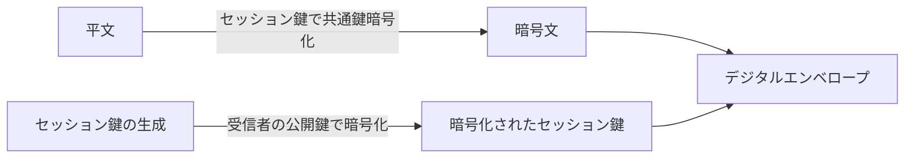

# デジタルエンベロープ(Digital Envelope)の生成・開封手順

## 1. 概要

### A. 定義
> **共通鍵の高速な暗号化性能**と**公開鍵の安全な鍵配送**を組み合わせ、データは共通鍵であるセッション鍵で暗号化し、そのセッション鍵のみを受信者の公開鍵で暗号化して一緒に送る**ハイブリッド暗号**方式。

デジタルエンベロープは、その名のとおり「封筒」の比喩で理解すると明快である。手紙の本文(平文)は安価で高速な錠(共通鍵のセッション鍵)で施錠し、その錠の鍵(セッション鍵)は受信者だけが開けられる特殊な封筒(受信者の公開鍵)に入れて一緒に送る。こうすれば、大量のデータは高速な共通鍵で処理しながら、肝心の難しい**鍵の受け渡し問題は公開鍵で安全に解決**できる。

### B. 登場背景および必要性
共通鍵暗号(AESなど)は高速で大容量に適しているが、送信者・受信者が同じ鍵を事前に共有しなければならない**鍵配送問題**が根本的な弱点である。ネットワーク上で共通鍵をそのまま送れば盗聴され、あらかじめ安全に分け合っておくことは大規模な通信では非現実的である。反対に公開鍵暗号(RSAなど)は相手の公開鍵さえ知っていればよいため鍵配送は洗練されているが、演算が重く**大容量データを直接暗号化するには遅すぎる**。デジタルエンベロープは「高速な暗号化は共通鍵が、安全な鍵交換は公開鍵が」という役割分担によって、両方式の短所を互いに相殺する。この構造により、実際に暗号化されるデータ量がどれほど大きくても、公開鍵演算は**短いセッション鍵1回分**にしか使われないため、性能上の負担が最小化される。

## 2. 生成手順(送信者)

核心は、**セッション鍵を毎回新たに生成**する点である。セッション鍵は当該通信1回だけに使って破棄する一時的な共通鍵であり、漏洩したとしても過去・未来の通信に影響を与えないため、安全性を高める。

| 順序 | 内容 | 理由 |
|---|---|---|
| 1 | 任意の**セッション鍵(共通鍵)**を生成 | 通信ごとに使い捨て → 漏洩被害の最小化 |
| 2 | セッション鍵で平文を**共通鍵暗号化** → 暗号文 | 大容量を高速に処理 |
| 3 | **受信者の公開鍵**でセッション鍵を暗号化 | 受信者だけが秘密鍵で解けるように |
| 4 | 暗号文 + 暗号化されたセッション鍵 = **デジタルエンベロープ**を送信 | データと鍵を一緒に送る |

## 3. 開封手順(受信者)

開封は生成の逆順である。受信者は自分だけが持つ**秘密鍵**で封筒の中のセッション鍵をまず取り出し、そのセッション鍵で暗号文を共通鍵復号して平文を復元する。公開鍵で施錠したものは対となる秘密鍵でしか開けられないため、途中で封筒を横取りした第三者は秘密鍵を持たずセッション鍵を得られない。

| 順序 | 内容 |
|---|---|
| 1 | **受信者の秘密鍵**で暗号化されたセッション鍵を復号 → セッション鍵を取得 |
| 2 | セッション鍵で暗号文を**共通鍵復号** → 平文を復元 |

## 4. デジタル署名との組み合わせ(セキュリティサービス)

デジタルエンベロープだけでは**機密性**(内容の秘匿)しか確保されない。実際のセキュア通信は、「このメッセージは偽造・改ざんされていないか(完全性)」、「本当にその人が送ったのか(認証)」、「送った事実を否認できないか(否認防止)」までを要求する。そのため、送信者はメッセージのハッシュを**自分の秘密鍵で署名**したデジタル署名をエンベロープとともに送る。受信者は送信者の公開鍵で署名を検証し、署名が成立すればその秘密鍵の所有者が送ったこと(認証・否認防止)と、ハッシュが一致するため改ざんがないこと(完全性)を同時に確認する。

| サービス | 実現方法 |
|---|---|
| **機密性** | デジタルエンベロープ(セッション鍵を受信者の公開鍵で暗号化) |
| **完全性** | メッセージハッシュの比較 |
| **認証・否認防止** | 送信者の秘密鍵でデジタル署名、公開鍵で検証 |

このように、デジタルエンベロープ(受信者の鍵を使用)とデジタル署名(送信者の鍵を使用)を組み合わせれば、**機密性・完全性・認証・否認防止の4大セキュリティサービス**を一つのメッセージで提供できる。

## 5. 考慮事項および示唆点
デジタルエンベロープは抽象的な理論ではなく、我々が日々使っているセキュア通信の実際の骨格である。**TLSの鍵交換**(RSA方式)、**S/MIME・PGPの電子メール暗号化**はいずれもこの構造に従っている。技術士の観点からの核心は、信頼の根源の管理である。第一に、受信者の公開鍵が本当にその人のものであることを保証するには、**PKI・証明書(CA)**に基づく信頼体系が前提とならなければならず、そうでなければ中間者攻撃によってセッション鍵が奪取される。第二に、秘密鍵・セッション鍵の生成・保管・破棄を安全に行うには、**HSMと鍵ライフサイクル管理**が不可欠である。第三に、RSA方式はサーバの秘密鍵が漏洩すると過去のトラフィックまで復号されるリスクがあるため、最新のTLSは**前方秘匿性(PFS)**を提供するDH系の鍵交換へと移行している。さらに、量子コンピュータがRSAを脅かす時代には、封筒を開ける公開鍵の部分を**耐量子計算機暗号(PQC)**に置き換える移行が課題として浮上する。

---

> **一言まとめ**: デジタルエンベロープは*平文を使い捨てのセッション鍵で高速に共通鍵暗号化し、そのセッション鍵のみを受信者の公開鍵で暗号化*して一緒に送るハイブリッド方式であり、受信者は秘密鍵でセッション鍵を解いて復元し、デジタル署名と組み合わせれば機密性・完全性・認証・否認防止のすべてを提供する。
