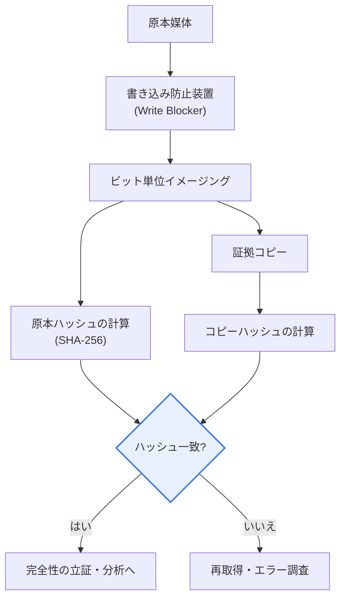

# デジタルフォレンジック(Digital Forensics)

## 1. 概要

### A. デジタルフォレンジックの概念と登場背景

> **デジタルフォレンジック(Digital Forensics)**は、コンピュータ・モバイル・ネットワーク・クラウドなど**デジタル機器に保存・流通したデータを法的証拠として収集・保全・分析・提出**する科学捜査手法である。犯罪捜査だけでなく、企業の内部監査、インシデント対応(DFIR)、訴訟における電子証拠開示(e-Discovery)に幅広く活用される。

デジタルフォレンジックの核心は、「**証拠能力(admissibility、法廷で証拠として認められる力)**」にある。いかに決定的なデータを見つけ出しても、それを収集・分析する過程が不適切であれば、法廷で証拠として採用されない。例えば、捜査官が押収したノートPCの原本ディスクをそのまま起動してファイルを開いてみると、その瞬間にアクセス時刻(atime)・一時ファイル・ログが変わり、「誰かが証拠を改ざんしたかもしれない」という疑いを招く。その結果、実際には真犯人の資料であっても証拠価値を失う。そのためデジタルフォレンジックは、**原本をそのまま保全しコピー(イメージ)で分析し(完全性)**、証拠が取得されて法廷に提出されるまでのすべての移動・保管・取り扱いの履歴を漏れなく記録し(**証拠保全の連続性、Chain of Custody**)、同じ手順を繰り返せば同じ結果が得られるようにする(**再現性**)という厳格な手順を守る。

この分野が台頭した背景には、犯罪と紛争の「デジタル化」がある。金融詐欺・技術流出・性犯罪・内部不正など、ほぼすべての事件において決定的な手がかりがスマートフォン・PC・クラウド・メッセンジャーに残る。同時にデータは物理的証拠と異なり、**不可視であり、容易に改ざん・削除・隠匿され、揮発性**を持つ。電源を切るとメモリ(RAM)上の暗号鍵・実行痕跡が消え、一度上書きされれば削除データの復元は難しくなる。こうした特性のために、「いかにして証拠を損なわずに確保するか」という手順の厳正さが、学問・実務の中心テーマとなった。韓国でも、刑事訴訟法上の電子情報の押収・捜索における適正手続、そして大検察庁・警察のデジタル証拠処理標準手順を通じて、これらの原則を制度化している。

### B. 基本原則 — 五つの要件

デジタル証拠は前述の特性のため、証拠能力確保のための原則遵守がまさに生命線である。五つの原則は互いに独立しておらず、一つが崩れると証拠能力全体が揺らぐ鎖の関係にある。

| 原則 | 内容 | 実務上の手段 |
|---|---|---|
| **正当性(適法性)** | 令状など適法な手続きで収集 | 押収・捜索令状、立会権の保障 |
| **完全性(Integrity)** | 原本が変更されていないことを立証 | ハッシュ値(SHA-256)の取得・比較、書き込み防止装置 |
| **証拠保全の連続性(Chain of Custody)** | 取得~提出の全過程の履歴追跡 | 封印・引き継ぎ記録、アクセスログ |
| **再現性(Reproducibility)** | 同一手順で同一結果を再現 | 検証済みのツール・手順の文書化 |
| **迅速性(Timeliness)** | 揮発性証拠を迅速に確保 | RAM・ネットワークセッションを優先収集 |

このうち**完全性と証拠保全の連続性**が法廷での争いの核心である。完全性は、収集時点で原本とコピーのハッシュ値(例: SHA-256)をそれぞれ計算しておき、その後いつでもコピーのハッシュを再計算して最初の値と一致することを示すことで、「その間に1ビットたりとも変わっていない」ことを数学的に証明する。証拠保全の連続性は、「この証拠が誰の手を経てどこに保管されたか」を封印・署名・引き継ぎ記録として途切れなく残し、途中ですり替え・改ざんされる余地がなかったことを示す。正当性はこれらすべての前提である。違法に収集された証拠は、いわゆる**違法収集証拠排除法則**により、内容がいかに決定的であっても証拠能力が否定されうる。

## 2. 類型と手順

### A. 対象媒体別の類型

デジタルフォレンジックは、扱う媒体の物理的・論理的特性が異なるため、対象ごとに技術と手順が分かれる。記憶装置を扱う**ディスクフォレンジック**、閉鎖的なOSとアプリデータが絡み合う**モバイルフォレンジック**、流れるトラフィック・ログを捕捉する**ネットワークフォレンジック**、電源が切れると消える揮発性メモリ(RAM)を扱う**メモリフォレンジック**、そして物理的押収が不可能で管轄・所有関係が複雑な**DB・クラウドフォレンジック**がある。

| 類型 | 対象 | 特有の難点 |
|---|---|---|
| **ディスクフォレンジック** | HDD・SSDなどの記憶媒体 | SSDのTRIM・ウェアレベリングにより削除データの復元が困難 |
| **モバイルフォレンジック** | スマートフォン・タブレット | 暗号化・ロック・アプリ別の保存構造、ベンダー依存 |
| **ネットワークフォレンジック** | トラフィック・ファイアウォール/プロキシログ | 揮発性が高い、暗号化トラフィック |
| **メモリフォレンジック** | 揮発性メモリ(RAM) | 電源遮断で消失、リアルタイムでの確保が必要 |
| **DB・クラウドフォレンジック** | DB・クラウド保存データ | 物理的押収が不可能、国外管轄・マルチテナント |

各類型が別個の技術に分かれる理由は、「証拠がどこに、どれだけ長く残るか」が異なるためである。例えば、メモリフォレンジックでは、ランサムウェア・ファイルレスマルウェアの復号鍵や実行中のプロセスがRAMにしか存在しないため、電源を切る前にライブでダンプしなければならない。一方、SSDはTRIMコマンドによって削除ブロックが即座に空にされる特性のため、従来のディスク復元手法があまり通用せず、削除の即時性がかえって証拠消失のリスクとなる。こうした違いが、「揮発性の順序(order of volatility)に従って何から収集するか」という実務上の判断につながる。

### B. 標準手順

手順は、現場で証拠を確保・保全し(揮発性優先)、原本の完全性を維持したコピーを作成して移送し(イメージング・ハッシュ検証)、データを復元・分析した後、結果を文書化して提出するという流れに従う。以下は手順全体の概念図である。

| 手順 | 内容 | 完全性の統制 |
|---|---|---|
| **収集・保全** | 現場の証拠確保、揮発性の順序を遵守 | 封印・撮影・現場記録 |
| **取得・移送** | ビット単位のイメージング(コピー作成) | 書き込み防止・原本/コピーのハッシュ照合 |
| **分析** | データ復元・タイムライン・キーワード分析 | コピーのみを分析、原本には非アクセス |
| **報告** | 分析結果の文書化・証拠提出 | 再現可能な手順の明示 |

手順の核心的な統制点を図でさらに掘り下げると、「原本にどう触れずにコピーを作り、その完全性をどう証明するか」が全過程を貫いている。以下は取得・検証段階の詳細アーキテクチャである。

ここで**書き込み防止装置(Write Blocker)**は、原本媒体に書き込みコマンドが届かないよう物理的・論理的に遮断し、イメージング過程で原本が1ビットたりとも変化しないことを保証する。イメージングはファイル単位ではなく**ビット単位(sector-by-sector)**で取得し、削除領域・スラック領域まで含める。その後、原本とコピーのハッシュが一致することを確認して初めて次の段階へ進む。この一連の流れこそが、完全性・再現性・証拠保全の連続性を同時に満たす実務の骨格である。

## 3. 中核技術および活用分野

デジタルフォレンジックは複数の専門技術を動員する。原本の完全性を維持しながらコピーを作成する**イメージング・複製**、削除・損傷したデータを蘇らせる**データ復元(カービング)**、ファイルシステムのメタデータを時系列に組み立てて事件を再構成する**タイムライン分析**、そして隠匿・暗号化・削除によって証拠を消そうとする**アンチフォレンジックに対応**する技術である。

| 技術 | 内容 | 活用例 |
|---|---|---|
| **イメージング・複製** | 原本の完全性を維持したコピーの作成 | 押収ディスクの法的コピー |
| **データ復元(カービング)** | 削除・損傷データのシグネチャベースの復旧 | 削除された写真・文書の復元 |
| **タイムライン分析** | ファイル・ログの時刻情報の再構成 | 侵害経路・行為順序の解明 |
| **アンチフォレンジック対応** | 隠匿・削除・暗号化の回避・検知 | ステガノグラフィ・ワイピングの検知 |

**データ復元(ファイルカービング)**は、ファイルシステムの情報が消去されていても、ファイル固有のシグネチャ(例: JPEGのヘッダ・フッタのパターン)をディスク全体でスキャンし、断片をつなぎ合わせて復旧する。**タイムライン分析**は、ファイルの作成・変更・アクセス時刻(MAC time)と各種ログを一つの時間軸に載せ、「いつ何が実行・送信・削除されたか」を再構成する。インシデントにおいて、攻撃者の最初の侵入から権限昇格・横展開・データ流出までの順序を明らかにするうえで決定的である。**アンチフォレンジック対応**は、証拠を消そうとする試み — ログ削除、ファイルの完全消去(ワイピング)、ステガノグラフィによる隠匿、タイムスタンプの改ざん — を逆に検知・復元する技術である。

活用分野も広い。刑事犯罪捜査が代表的であるが、企業では営業秘密・技術流出の調査、内部不正・横領の監査、そしてハッキング・ランサムウェアに対する**インシデント対応(DFIR、Digital Forensics & Incident Response)**に用いられる。民事・刑事訴訟では、大量の電子文書をレビュー・提出する**e-Discovery**が独立した専門領域として発展した。例えば、ランサムウェアのインシデント対応では、メモリフォレンジックで復号鍵・悪性プロセスを確保し、ネットワークフォレンジックでC2(コマンド&コントロール)通信と流出経路を明らかにし、ディスクフォレンジックで最初の感染ベクトルを解明するというように、複数の技術がともに動員される。

## 4. 発展 — クラウド・モバイルの普及とAI時代の課題

デジタルフォレンジックの最新の流れは、「証拠はどこにでもあるが、捕まえることはより難しく」散在するという点に由来する。第一に、**クラウドフォレンジック**の台頭である。データが特定の物理サーバではなく複数のリージョン・マルチテナント(multi-tenant)環境に分散保存され、サービス提供者しかアクセスできない場合が多いため、従来の「物理的押収」が成立しない。国外サーバに保存されたデータの管轄・主権の問題、ログ保存期間の短さ、スナップショットの揮発性などが新たな難点である。これに伴い、提供者の協力手続、API・アカウントベースの収集、ログの信頼性検証が重要となった。

第二に、**モバイル・メッセンジャー・IoT**の急増である。スマートフォンは強力なフルディスク暗号化とアプリ別のサンドボックスで保護されており、ロック解除とアプリデータの解釈が大きな技術的障壁となった。メッセンジャーのエンドツーエンド暗号化、自動削除メッセージ、クラウドバックアップの混在は、証拠の確保をさらに複雑にする。ウェアラブル・車両・スマートホームなどのIoT機器にまで証拠源が広がるにつれ、収集対象機器の種類とデータフォーマットが爆発的に増えている。

第三に、**大容量・自動化とAIの両面性**である。事件ごとに分析すべきデータがテラバイト規模に膨らむにつれ、人間が一つずつ目を通す方式は限界に突き当たった。そのため、キーワード・画像分類・異常行動検知にAI・機械学習を適用して分析を自動化・高速化する流れが顕著である。ただし、AIが判断根拠を説明しにくい場合(ブラックボックス)には法廷で証拠の信頼性を争いにくいという問題、そして**ディープフェイクなどAIで改ざんされた証拠**を見分けなければならないという新たな課題が同時に生じる。すなわちAIは、分析ツールであると同時に対応対象ともなる両面性を帯びる。こうした流れの中で、ツールの信頼性・検証(例: 標準化されたツールテスト)の必要性がさらに強調されている。

## 5. 考慮事項および示唆点(技術士の観点)

1. **手順の遵守とツールの信頼性が証拠能力の前提である.** 完全性・証拠保全の連続性を守り、結果が検証された(再現可能な)ツールを使用してこそ、法廷で証拠として認められる。いかに優れた分析であっても手順が崩れれば無用の長物となるため、組織は標準手順(SOP)とツール検証体系を整備しなければならない。

2. **適正手続(正当性)とプライバシーのバランスが必要である.** 電子情報は範囲が膨大であるため、無関係な個人情報までともに収集されるリスクが大きい。令状の範囲内での選別押収、立会権の保障、無関係な情報の即時廃棄などの適正手続を守れなければ、違法収集証拠として排除されうる。プライバシー保護と捜査の実効性のバランスの設計が鍵である。

3. **クラウド・モバイル・IoTの普及に対応する能力の確保が急務である.** データが分散・暗号化・国外保存されるにつれ、収集範囲と技術的難度が急増した。クラウド提供者との協力体制、国際協力(管轄)、新技術機器への対応能力を先制的に確保してこそ、証拠の死角を減らすことができる。

4. **アンチフォレンジックと大容量への技術的対応が必要である.** 隠匿・ワイピング・タイムスタンプ改ざんなどの証拠隠滅手法が高度化し、分析対象データは急増している。アンチフォレンジック検知技術とAIベースの自動分析を導入しつつ、AIの説明可能性・信頼性を併せて確保し、証拠の法的価値を維持しなければならない。

5. **専門人材の育成と標準・認証体系が持続可能性を左右する.** フォレンジックは法・技術の融合領域であるため、熟練した専門人材と標準化された手順・ツール認証の裏付けが必要である。組織レベルの教育・資格体系と、国家・国際標準との整合が長期的な競争力を決定する。

## 参考資料
- NIST SP 800-86, "Guide to Integrating Forensic Techniques into Incident Response": https://csrc.nist.gov/pubs/sp/800/86/final
- NIST Computer Forensics Tool Testing (CFTT) プログラム: https://www.nist.gov/itl/ssd/software-quality-group/computer-forensics-tool-testing-program-cftt
- ISO/IEC 27037(デジタル証拠の識別・収集・保全の指針)概要: https://www.iso.org/standard/44381.html
- 大検察庁 デジタルフォレンジック(デジタル捜査)案内: https://www.spo.go.kr/

---

> **一言まとめ**: デジタルフォレンジックは*デジタル証拠を完全性・証拠保全の連続性を守って収集・保全・分析・提出*する科学捜査であり、正当性・完全性・証拠保全の連続性・再現性・迅速性の原則の上に、ディスク・モバイル・ネットワーク・メモリ・クラウドの類型と、収集→取得→分析→報告の手順で遂行され、クラウド・モバイルの普及とAI時代の新たな課題の中で、手順の遵守とツールの信頼性が証拠能力の生命線である。
