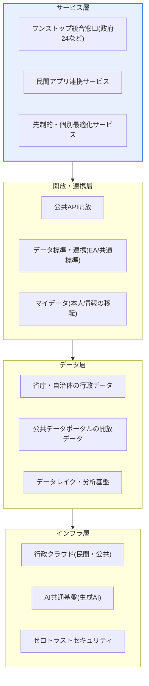
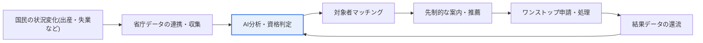

# デジタルプラットフォーム政府(Digital Platform Government)

## 1. 概要

### A. 定義
> 政府のすべてのデータとサービスを**一つのデジタルプラットフォーム上に統合**し、国民・企業・政府が共に社会課題を解決し新たな価値を創出できるようにする政府運営パラダイムであり、政府を「サービス提供者」から「プラットフォーム運営者・データ開放者」へと転換する政府革新モデルである。

デジタルプラットフォーム政府(DPG)の核心的な発想は、政府を「**サービス提供者(Service Provider)**」から「**プラットフォーム運営者(Platform Operator)**」へ転換することである。過去の電子政府(e-Government)が省庁ごとに個別のシステムを構築し、国民が複数のサイトを渡り歩かなければならなかったのに対し、デジタルプラットフォーム政府はデータとサービスを一つの論理的プラットフォームに集約し、民間がその上で革新的なサービスを生み出せるよう開放する。いわばスマートフォンのアプリストアのように、政府がデータ・機能を標準APIで開放し、民間がそれらを組み合わせて国民が望むカスタマイズされたサービスを作る構造である。

この転換が持つ意味は、単なるシステム統合ではなく**行政の作動原理そのものを変える**点にある。従来の電子政府は「申請主義」に基づき、国民が自らの資格を把握し、自ら出向いて申請しなければサービスを受けられなかった。これに対しDPGは、データを省庁間で共有・連携することで、政府が国民の状況変化(出産・失業・災害など)を先に把握し、**先制的(Proactive)にサービスを推薦・提供**する。国民は複数の機関を訪れることなく一か所ですべてを解決でき(ワンストップ)、政府は省庁の縦割りを越えてデータを共有し、科学的・個別最適化された行政を実現する。

### B. 登場背景と必要性
DPGが台頭した背景には、三つの構造的圧力が重なっている。第一に、**省庁別サイロ(Silo)によるサービスの断絶**である。これまで各省庁・自治体が独自に情報システムを構築し、データが機関の境界内に閉じ込められたため、国民は同じ書類を複数の機関に繰り返し提出しなければならず、省庁間の協働行政は事実上不可能であった。第二に、**国民のデジタル体験への期待の高まり**である。民間プラットフォーム(金融・ショッピング・モビリティ)が提供する超パーソナライズ・即時性の水準を、国民が公共サービスにも求めるようになった。第三に、**データ・AI・クラウド技術の成熟**である。大規模なデータ連携、生成AIベースの相談、クラウドネイティブな拡張が技術的に可能となり、統合・開放型政府を実際に実装する基盤が整った。

韓国の場合、世界最高水準の電子政府(国連電子政府ランキング上位)を長く維持してきたにもかかわらず、個別システムの優秀さが「国民が実感する統合体験」につながっていないという限界が指摘されてきた。DPGは、このギャップをデータ中心の統合・開放アーキテクチャで埋めようとする国家的な試みと理解できる。

## 2. 全体構造と構成要素

デジタルプラットフォーム政府は、データ層、開放・連携層、サービス層、インフラ層が垂直に積み重なった多層構造として捉えることができる。以下の概念図はその全体構造を示す。

**データ層**は、省庁・自治体に分散した行政データと公共データポータル(data.go.kr)の開放データ、そしてそれらを分析可能な形で集約するデータレイク・分析基盤で構成される。DPGのすべての価値は結局データから出発するため、この層の**品質・標準・連携可能性**が全体の成否を左右する。データが標準化されていなかったり、機関の外に出せなかったりすれば、上位層は機能しない。

**開放・連携層**は、データと機能を外部から利用可能にする「接点」である。公共APIを標準的な方式で開放し、機関ごとに異なるデータモデルを共通標準・エンタープライズアーキテクチャ(EA)で整合させ、マイデータ(本人情報移転要求権)によって国民が自らの行政情報を望む場所へ移せるようにする。この層が厚いほど、民間イノベーションの余地が大きくなる。

**サービス層**は、国民が実際に接する地点である。政府24のような統合窓口でワンストップ処理を行い、民間アプリが公共APIを組み合わせて新たなサービスを作り、データ分析に基づいて資格のある国民に先回りしてサービスを案内する。**インフラ層**は、これらすべてを支えるクラウドネイティブ基盤、AI共通基盤、そして開放とともに必然的に高まるリスクを統制するゼロトラストセキュリティから成る。

| 構成要素 | 核心内容 | 代表的手段 |
|---|---|---|
| **データ基盤** | 省庁データの連携・標準化・開放 | 公共データポータル、データ標準、EA |
| **開放エコシステム** | API開放、官民協力によるサービス創出 | Open API、マイデータ |
| **サービス** | ワンストップ・先制的・個別最適化の国民サービス | 政府24、統合ログイン |
| **インフラ** | クラウドネイティブ、AI、セキュリティ | 行政クラウド、生成AI、ゼロトラスト |

## 3. 核心原理 — データフローとサービス生成プロセス

DPGが実際に「先制的な個別最適化サービス」を生み出す過程は、データが収集・連携・分析されてサービスとして還流される循環として説明される。以下のプロセス詳細図は、国民の状況変化がどのようにサービスへつながるかを示す。

このフローの出発点は**イベント(状況変化)**である。例えば出生届が受理されると、その事実が複数省庁のデータと連携され、「この家庭が受けられる支援」が自動的に導き出される。以前は親が出産支援金・児童手当・電気料金減免などをそれぞれ別の機関に個別に申請しなければならなかったが、DPGが目指す姿では一度の届出が関連サービス全体をトリガーする。実際に韓国政府はこうしたライフサイクル単位の束ねサービス(「幸福出産」「安心相続」などのワンストップサービス)を拡大してきており、DPGはこれをデータ連携によってより広範に自動化しようとする方向である。

第二段階の**AI分析・資格判定**では、連携されたデータを根拠に、国民がどのサービスの受給資格を持つかを判定する。ここで重要なのは「判断の根拠となるデータの正確性と最新性」である。所得・世帯・居住情報が省庁ごとに異なって管理されていれば誤った資格判定が生じうるため、データ標準化と品質管理がこの段階の信頼性を決定する。

第三段階の**マッチング・案内・処理**は、判定結果を実際のサービスへ結びつける。対象者に先に案内(Push)し、国民が同意すればワンストップで申請・処理する。最後の**還流(Feedback)**段階では、処理結果が再びデータとして蓄積され、次の分析の精度を高める。このようにDPGは一回限りの電算化ではなく、**データがサービスを生み、サービスが再びデータを生む好循環構造**を志向する点で、電子政府と根本的に異なる。

## 4. 電子政府との比較 — 違いが生じる理由

DPGはしばしば「電子政府の次の段階」と呼ばれるが、両者の違いは技術世代の問題ではなく**運営哲学の問題**である。電子政府は「政府業務の電算化・オンライン化」に焦点を当て、オフラインで行っていた行政手続をWebで処理できるようにすることが目標であった。その結果、各機関は自らの業務をうまく電算化したが、機関間の境界はそのまま残った。これに対しDPGは「データとサービスの統合・開放」に焦点を当て、機関の境界そのものをデータフローによって取り払うことを目標とする。

| 区分 | 電子政府(e-Gov) | デジタルプラットフォーム政府(DPG) |
|---|---|---|
| **観点** | 政府業務の電算化・オンライン化 | データ・サービスの統合・開放 |
| **構造** | 省庁別の個別システム(サイロ) | 一つの論理的プラットフォーム |
| **サービス方式** | 申請主義(国民が出向く) | 先制・個別最適化(政府が先に案内) |
| **民間の役割** | 利用者(サービス利用) | 協力者(サービスの共同創出) |
| **インフラ** | 自前構築(オンプレミス) | クラウドネイティブ |
| **データ** | 機関内で閉鎖 | 連携・標準・開放 |

この違いが実務上重要なのは、DPGへ移行するには**技術よりもガバナンスと制度を先に変えなければならない**からである。例えば省庁Aのデータを省庁Bが使うには、個人情報保護法上の根拠、データの所有・責任関係、標準の整合が先行しなければならない。すなわちDPGのボトルネックは多くの場合「技術実装」ではなく、「データを共有可能にする法・制度・標準」にある。この点を理解しなければ、いかに優れたクラウド・AIを導入しても、結果はもう一つの電子政府にとどまる。

**具体的事例**として、公共データポータルを通じて開放されたデータは数万種に達し、民間はこれを活用して不動産・交通・天気・創業など多様なアプリを作ってきた。また「政府24」は複数機関の行政手続を一つの窓口で処理する統合サービスとして定着し、国税庁ホームタックスの年末調整簡素化サービスは、分散した所得・支出資料を自動収集して提供することで「資料を集めてくれる政府」の代表例に挙げられる。これらはいずれも、DPGが目指す「データ連携・開放による国民の便益」の初期形態と見ることができる。

## 5. 深掘り — 推進方向と最新動向

DPGは特定のシステム一つではなく、**複数の政策・標準・インフラが結合した中長期の国家戦略**であるため、最新動向はいくつかの系統に分かれる。ただし詳細な推進日程・予算規模は時点によって変わりうるため、ここでは方向性を中心に一般化して整理する。

第一に、**行政のクラウドネイティブ転換**である。省庁ごとの老朽化システムを単にクラウドへ移す(Lift & Shift)ことを越え、APIベースで再設計してデータ・機能が相互に呼び出せる構造へ変えることが核心である。この過程で、公共・民間クラウドの役割分担、ネットワーク分離政策の緩和・調整、クラウドセキュリティ認証(CSAP)との整合が論点となる。

第二に、**生成AIの行政への適用**である。最近では、国民が自然言語で質問すると複数省庁のサービスを横断して答えを探してくれる「AI行政アシスタント・チャットボット」形態の試みが広がっている。これはDPGのデータ・API開放が先行して初めて可能となる応用であり、「開放されたデータの上でAIが統合体験を完成させる」という構図に当たる。ただし生成AIのハルシネーション(Hallucination)・責任所在の問題から、行政領域では根拠データに基づく検証可能な回答(RAGなど)と人による最終確認が重視される。

第三に、**マイデータの公共分野への拡張**である。金融分野で始まったマイデータ(本人情報移転要求権)を行政・医療などへ広げ、国民が自らの行政情報を望む機関・アプリへ直接移して活用できるようにする流れである。これは「データのコントロール権を国民に返す」という点でDPGの開放哲学の中核であり、同時に強力な個人情報保護措置を要求する。

## 6. 考慮事項と示唆(技術士の観点)

1. **データ標準化・ガバナンスが成功の前提である。** 省庁ごとに異なるデータを連携するには、データ標準、品質管理、所有・責任(データオーナーシップ)体系、参照・マスターデータ管理がまず整っていなければならない。ガバナンスなき開放は「つながらないデータの羅列」に終わる。技術士の観点からは、EA・データアーキテクチャとデータ品質管理体系をDPGの先行課題として提示できる。

2. **開放と個人情報保護のバランスが鍵である。** データを統合・開放するほど、プライバシー・再識別リスクは大きくなる。マイデータによる同意ベースの移転、仮名・匿名化処理、ゼロトラスト(内部でも検証)、アクセス制御・監査ログを通じて「開放しつつ安全な」構造を設計しなければならない。開放の便益と保護のコストの間のトレードオフを、データの機微度に応じて差別化して設計することが実務戦略である。

3. **レガシー移行とクラウドネイティブな再設計が必要である。** 単純な移設ではなく、マイクロサービス・APIゲートウェイベースで再設計してこそ真のプラットフォームとなる。その際、全面再構築のリスクを減らすため、ストラングラーパターン(Strangler Fig)などの段階的移行戦略と、移行中のサービス継続性を保証する移行計画が併せて求められる。

4. **官民協力エコシステムの持続可能性を設計しなければならない。** 政府がAPIを開放しても、民間が参加するインセンティブ(安定したSLA、明確な利用規約、収益モデル)がなければエコシステムは形成されない。APIのバージョン管理・品質保証・開発者支援(開発者ポータル、サンドボックス)まで含む「プラットフォーム運営能力」が政府に求められる点が、電子政府と決定的に異なる。

5. **デジタルインクルージョン(Digital Inclusion)を並行して進めなければならない。** 先制・個別最適化サービスが高度化するほど、高齢者・障害者・デジタル弱者が取り残される危険がある。オンラインチャネルとともにオフライン・対面・相談チャネルを維持し、アクセシビリティ(Webアクセシビリティ指針)の遵守と使いやすい設計を並行してこそ「すべての人のためのプラットフォーム」となる。

## 参考資料
- 公共データポータル: https://www.data.go.kr
- 政府24: https://www.gov.kr
- デジタルプラットフォーム政府委員会: https://www.dpg.go.kr

---

> **一言まとめ**: デジタルプラットフォーム政府は、*政府のデータ・サービスを一つのプラットフォームに統合・開放* して官民が共に価値を創出し、先制的・個別最適化された行政を実現するパラダイムであり、データ標準・ガバナンスと個人情報保護のバランス、クラウドネイティブな再設計、持続可能な官民エコシステムの設計が成否を分ける。
