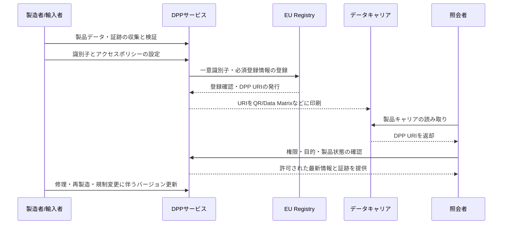

# デジタル製品パスポート(DPP, Digital Product Passport)

## 1. 概要

> **デジタル製品パスポート(DPP)**は、製品・部品・素材に関する情報を製品ごとのデジタル識別子と結び付け、電子的に照会・交換できるようにするデータ体系である。

欧州連合のエコデザイン規則(ESPR, Regulation (EU) 2024/1781)は、持続可能な製品の設計と流通を促進するための制度的基盤としてDPPを導入した。

DPPの目的は、単にQRコードに製品説明書を載せることではない。

製品の原産地、材料、耐久性、修理可能性、環境性能、再使用・リサイクル情報のように、製品ライフサイクル全般で必要となる情報を、利害関係者に標準化された方式で提供することが核心である。

消費者は購入と使用の段階で製品のサステナビリティ情報を確認できる。

修理業者は分解方法と部品情報を確認し、修理可能性を高めることができる。

リサイクル業者は素材構成と有害物質情報を用いて、解体・分別・リサイクル工程を最適化できる。

公的機関と税関は、製品の登録有無と規制遵守状況を確認できる。

DPPが登場した背景には、サプライチェーンの多段階化と製品情報の断絶がある。

製造者が保有する素材・工程情報が流通業者、消費者、修理業者、リサイクル業者にまで伝わらなければ、循環経済を設計することは難しい。

紙の文書や製造者ごとの閉鎖的なポータルには、情報更新と相互運用性の面で限界がある。

したがってDPPは、物理的な製品とデジタル情報を、識別子・データキャリア・アクセスポリシーによって結び付ける情報管理アーキテクチャとして理解すべきである。

## 2. 法的背景と導入の必要性

### A. ESPRと製品別委任法

ESPRは、すべての製品に同一の情報を一度に要求する包括的データベースではない。

欧州委員会が製品群ごとの委任法(delegated act)を制定すると、当該製品群のDPP情報項目とアクセス権限が具体化される。

バッテリー、繊維、鉄鋼、建設製品など、製品群ごとに環境影響とサプライチェーン構造が異なるため、同一のスキーマをそのまま適用することはできないからである。

したがって企業は、法律の一般原則を確認するだけにとどまらず、自社が販売する製品群の委任法と個別の産業法を併せて確認しなければならない。

ESPR以外にも、バッテリー規則、包装・包装廃棄物規則、重要原材料法、玩具安全規則、建設製品規則などがDPPと結び付く可能性がある。

このようにDPPは、単一ソリューションの名称というよりも、製品規制とデータインフラが結合した制度・技術フレームワークである。

### B. 導入の必要性

第一に、環境性能を製品ライフサイクルで管理するには、設計・調達・製造・流通・使用・修理・廃棄のデータがつながっていなければならない。

第二に、規制当局が求める資料を製品ごとに迅速に提出するには、原データと証跡資料のトレーサビリティが必要である。

第三に、サプライチェーンの参加者がそれぞれ異なるシステムを使用するため、標準識別子と交換ルールがなければデータの再入力と誤りが蓄積する。

第四に、製品が中古・修理・再製造の段階へ移る際にも、同一製品の履歴と状態を引き継がなければ循環型ビジネスは成立しない。

第五に、製品情報の公開範囲を消費者向け・事業者向け・規制当局向けに分けてこそ、営業秘密と透明性を両立して管理できる。

## 3. DPPの全体概念図と構成要素

次の概念図は、物理的な製品からデータ提供と規制確認までの全体構造を示す。

### A. 製品とデータキャリア

データキャリアは、製品とデジタル記録を結び付ける物理的な接点である。

QRコードやData Matrixは低コストで印刷でき、スマートフォンで容易に読み取れる。

RFIDとNFCは非可視での読み取りや自動化された物流処理に有利だが、タグのコストとインフラが追加で必要となる。

重要なのは、キャリアにすべての製品情報を直接格納しないという点である。

キャリアには製品またはDPPを探すための識別子・URIを格納し、詳細データは適切なサービスで管理する方式が一般的である。

したがって、ラベルが損傷したり製品が再包装されたりした場合にも、識別子の永続性と再発行ポリシーを設計しておく必要がある。

### B. 識別子とURI

製品識別子は、特定製造者の内部管理番号とは異なり、サプライチェーン全体で衝突せず、可能な限り製品のライフサイクルを通じて維持されなければならない。

製品単位識別子、モデル・バッチ識別子、構成部品識別子、経済事業者識別子を分離すると、製品と構成部品の関係を表現しやすくなる。

Registryは、登録された一意識別子と必須登録メタデータに基づいて、DPPのURIを提供または連結する。

このときURIは単なるWebアドレスではなく、識別、認証、バージョン、アクセスポリシー、リダイレクトを含む運用上の契約として扱うべきである。

製品がリファービッシュされたり構成部品が交換されたりした場合、既存の記録を削除するよりも、新たな状態・イベント・バージョンを連結して履歴を保存するほうが、監査と紛争対応に有利である。

### C. Registryと詳細データストア

EU DPP Registryは、各DPPの一意識別子と法で定められた登録情報を管理する中央登録ポイントである。

一方、詳細な製品データは、経済事業者またはDPPサービス提供者が保有する分散型の保存構造をとることができる。

この構造により、中央機関がすべての製造データと営業秘密を直接保存しなくても、製品ごとの登録と一意性の確認が可能となる。

すなわちDPPは、中央集権化と分散化を二者択一で選ぶ構造ではなく、登録・探索は中央集権化し、詳細データの保有・統制は分散化するハイブリッド構造である。

詳細データサービスが変更されてもURIの解決と過去データの可用性が維持されなければならないため、事業者の変更・倒産・サービス終了に備えたバックアップと移行手順が必要である。

### D. 利害関係者と権限

製造者や輸入者などの経済事業者は、DPPを作成し、情報の正確性・完全性・最新性を管理する一次的な責任を負う。

流通業者とオンラインマーケットプレイスは、製品が有効な識別子と必要な情報を備えているかを確認する役割を担うことができる。

消費者は、製品のサステナビリティと使用・修理・廃棄情報を、わかりやすい画面で照会する。

専門修理業者は、製品別の分解・修理手順と互換部品の情報を、制限された権限で照会する。

リサイクル業者は素材構成と処理時の注意事項を確認するが、製造者の機微な製造工程情報にはアクセスすべきでない。

市場監視当局と税関は、登録識別子、適合性の証跡、関連規制情報を検証する。

## 4. データモデルと動作手順

### A. 情報の階層

DPPデータは、公開範囲と変更周期を基準に階層化するのが望ましい。

公開情報には、製品識別、基本仕様、修理・リサイクル案内、環境関連の主要指標を含めることができる。

事業者情報には、サプライチェーンの証跡、バッチ別品質資料、監査ログ、詳細な素材明細を含めることができる。

規制当局専用情報には、適合性評価と税関確認に必要な原本証跡、試験成績書、責任者情報を置くことができる。

この階層を分離しなければ、消費者に過剰な情報を露出したり、逆に規制当局の検証に必要な証跡が不足したりする。

### B. 核心データ要素

次の表は、一般的なDPP設計で考慮すべきデータ要素を整理したものである。

| 区分 | 主要データ | 管理の観点 |
|---|---|---|
| 識別 | 製品・モデル・バッチ・構成部品・事業者ID | グローバルな一意性、永続性、関係表現 |
| 製品 | 素材、原産地、性能、安全、規格 | 原システムおよび基準情報との連携 |
| 循環性 | 修理可能性、分解性、再使用、リサイクル、部品 | ライフサイクル段階ごとの更新 |
| 環境性 | 炭素・エネルギー・資源・有害物質指標 | 算定方法と証跡の追跡 |
| 証跡 | 試験成績書、適合宣言、監査資料 | 改ざん防止と保存期間 |
| アクセス | 消費者・事業者・当局別の権限 | 最小権限と目的制限 |
| 履歴 | 修理、交換、再製造、所有・状態イベント | バージョンと時系列の完全性 |

表の項目は単なるフィールド一覧ではなく、データ責任と品質ルールに結び付けられなければならない。

例えば炭素排出量は、数値を一つ保存するだけでなく、算定境界、基準年、排出係数、検証主体、単位と併せて保存してこそ、比較と監査が可能になる。

素材情報についても、全重量の合計が製品総重量と一致するか、素材分類体系がリサイクル業者の分類体系と互換性があるかを確認しなければならない。

### C. 登録・照会・更新の手順

最初の段階は、製品データの収集ではなく、データ責任者の指定である。

どの組織が素材データを提供し、どの組織が環境性能を検証するのかを決めておかなければ、後で情報が変わったときに修正責任を追跡できない。

第二に、製品・バッチ・構成部品の識別子を生成し、原システムの内部キーとマッピングする。

第三に、必須登録情報と詳細DPPデータを品質検査したうえでRegistryに登録する。

第四に、返却されたURIを、データキャリアによって製品・包装・同梱文書に結び付ける。

第五に、照会時にはユーザーの役割と製品状態に応じて、必要なデータのみを提供する。

第六に、修理・部品交換・再製造・規制変更を、新たなバージョンまたはイベントとして記録する。

この手順において登録と詳細データの保存を分離すれば、Registryの障害が詳細データ全体の障害へ波及することを抑えられる。

## 5. データガバナンスと技術的考慮事項

### A. データ品質

DPPの信頼性は、画面のデザインよりも原データの品質によって決まる。

正確性は実際の製品と記録が一致しているかの問題であり、完全性は規定上の必須項目が欠落していないかの問題である。

適時性は、製品の変更や規制の変更が適切な時間内に反映されるかの問題である。

相互運用性は、異なる事業者のデータが同一の意味体系と単位で交換されるかの問題である。

したがって、データカタログ、共通コード、単位標準、検証ルール、担当者、品質指標をデータ契約として明示しなければならない。

例えば部品重量をkgとgで混用すれば合計検証が失敗し、リサイクル判断に必要な素材コードが事業者ごとに異なれば自動分別は機能しない。

### B. セキュリティとプライバシー

DPPは公開データと営業秘密が共存するシステムであるため、すべての情報を公開することが透明性なのではない。

消費者には最小限の製品・環境情報を提供し、修理業者には安全な分解に必要な情報のみを提供し、規制当局には法定検証に必要な証跡を提供するという、目的に基づくアクセスが必要である。

サービス間通信は転送区間の暗号化と相互認証で保護し、管理者と事業者のアカウントには多要素認証と細分化された権限を適用しなければならない。

登録・変更・照会のイベントは監査ログとして残し、誰がいつどのデータを変更・閲覧したかを確認できるようにしなければならない。

悪意ある事業者が環境配慮の数値や原産地を改ざんする可能性があるため、データの出所、署名、検証主体、変更履歴を併せて保存しなければならない。

ブロックチェーンを用いれば一部の完全性の問題を補助できるが、誤って入力された原データの真実性を自動的に保証するものではない。

したがって、電子署名、検証可能な証明、独立監査、原データの検証が、ブロックチェーン導入よりも優先される。

### C. 可用性と事業者の変更

DPPは製品の想定寿命の間アクセス可能でなければならないため、製品を販売した事業者がサービスを中止する状況を考慮しなければならない。

第三者のサービス提供者にバックアップを委ねたり、移行可能なフォーマットと保存ポリシーを整備したりして、事業者変更時にデータを移管しなければならない。

キャリアが結び付けるURIのドメインやサービスが変われば既存製品のラベルが無用となるため、リダイレクト、ドメイン委任、災害復旧、サービスレベル目標を設計しなければならない。

可用性とは、24時間Web画面が開くことだけを意味しない。

オフラインの物流やリサイクルの現場でも最低限の識別と安全情報を確保できるよう、キャッシュ・バックアップ・再試行ポリシーを整備しなければならない。

## 6. 既存技術との比較

### A. バーコード・QRコードとDPP

バーコードとQRコードはデータを表現し読み取るための媒体であり、DPPは識別子・データ・ガバナンス・アクセスポリシーを含む体系である。

したがって、QRコードがあるからといって自動的にDPPになるわけではない。

一般的なQRは製造者のWebページへつながるだけにとどまりうるが、DPPは製品の一意性とライフサイクルデータ、権限別アクセス、登録・監査ルールを併せて定義する。

逆にDPPはQRやData Matrixを活用できるため、既存の物流インフラと組み合わせることができる。

### B. 製品トレーサビリティとDPP

トレーサビリティ(traceability)は、製品がサプライチェーンのどの段階にあったかを追跡することに焦点を当てる。

DPPはトレーサビリティに加えて、製品の環境性能、修理可能性、リサイクル可能性、適合性の証跡を多様なユーザーに提供する。

すなわちトレーサビリティはDPPの重要なデータソースであるが、DPP全体と同一ではない。

### C. ブロックチェーンベースの履歴とDPP

ブロックチェーンは参加者間で合意された台帳を提供できるが、すべての詳細データをオンチェーンに載せると、コスト・性能・削除権・営業秘密の問題が大きくなる。

DPPは、中央Registryと事業者ごとの詳細ストアを組み合わせるハイブリッド構造が可能である。

したがってブロックチェーンは選択的な完全性アンカーや証明ログに活用し、製品データの主ストアとして必ずしも採用する必要はない。

| 比較項目 | 一般的なQR/バーコード | サプライチェーン・トレーサビリティ | DPP | ブロックチェーン履歴 |
|---|---|---|---|---|
| 中心目的 | 識別・リンク | 移動・状態の追跡 | サステナビリティ・規制・循環性情報 | 合意された変更履歴 |
| データの所在 | リンク先サービス | 企業ごとのシステム | Registryと分散型詳細ストア | 分散台帳または外部ストア |
| 権限モデル | 単純な公開が多い | 参加者ごとの契約 | 役割・目的ベースのアクセス | 台帳・スマートコントラクトのポリシー |
| 製品ライフサイクル | 限定的 | サプライチェーン中心 | 設計から廃棄まで | 記録されたイベント中心 |
| 主要リスク | リンク切れ・複製 | サイロ・整合性 | 標準・品質・可用性 | 個人情報・コスト・入力の信頼性 |

この比較から分かるように、技術選択よりも先にデータの責任と目的を定義しなければならない。

## 7. 適用事例

### A. 電気自動車・産業用バッテリー

バッテリーは、素材構成、容量、状態、再使用可能性、安全情報が修理・再使用・リサイクルに直接影響する代表的な製品群である。

製造者はセル・モジュール・パックの識別子を連結し、バッテリーの主要性能と素材・安全情報を管理できる。

使用中に交換や性能劣化が発生すれば状態イベントを追加し、中古バッテリーの再使用可能性を評価できる。

リサイクル業者は残存エネルギーと化学系統、分解時の注意事項を確認し、作業者のリスクを低減できる。

ただしバッテリーデータは製造者の中核技術と結び付きうるため、消費者公開項目と専門処理業者向け項目を分離しなければならない。

### B. 繊維製品

繊維DPPは、原糸と素材の混用率、染色・加工情報、修理・洗濯の指示、リサイクル可能性を結び付けることができる。

衣類一着が複数の素材と副資材で構成される場合、素材ごとの識別子と製品識別子の関係を表現するデータモデルが必要である。

消費者は再生繊維の比率と手入れ方法を確認でき、リサイクル業者は混紡の有無に基づいて分別工程を選択できる。

しかしサプライチェーンの生地・染色・縫製の段階が複数の国にまたがるため、協力会社のデータ品質と証跡の信頼性を段階的に高めていかなければならない。

### C. 公共調達と内部資産管理

公的機関は、DPPをグリーン調達の証跡と資産ライフサイクル管理に活用できる。

購入時点の認証情報だけでなく、保守履歴と交換部品、廃棄経路を結び付ければ、総所有コストと資源効率を併せて評価できる。

ただし調達機関の追加入力が供給業者の重複業務とならないよう、電子調達・資産管理・環境情報システムのインターフェースをまず整備しなければならない。

## 8. 深掘り:2026年の制度・標準動向と技術士答案のポイント

欧州委員会はDPP Registryを製品ごとの登録と一意性確認のための基盤として運用しており、2026年7月の案内では、製品データは分散型で保有できるが、各DPPのRegistry登録は必須であると説明している。

Registryは詳細な製品情報全体を一か所に集めるデータレイクではなく、一意識別子と必須登録メタデータを管理し、詳細データの所在へ連結する役割として理解するのが正確である。

委員会のFAQはRegistryの法定運用期限を2026年7月19日としており、バッテリーなどの製品群から製品別ルールに従って段階的に導入されると案内している。

また製品別委任法の採択後、経済事業者には最低18か月の移行期間が与えられうるため、企業は法の施行日を待つのではなく、今のうちに原データと識別子体系を整備しなければならない。

2026年には、CENとCENELECが一意識別子、データキャリア、API、相互運用性、データ交換プロトコルなどを扱うDPP水平標準群を提示している。

この標準化の流れは、DPPを単なるESG報告書ではなく、識別子・キャリア・データサービス・API・アクセス制御が結合したエンタープライズアーキテクチャとして捉えるべきであることを示している。

技術士答案では「QRを貼れば終わり」という表現を避け、**識別子→Registry→分散型詳細データ→権限別サービス→ライフサイクルイベント**の流れを概念図として提示するのがよい。

また、法・制度、データガバナンス、相互運用性、セキュリティ・プライバシー、運用の持続性という五つの観点を、一つの段階的導入ロードマップとして結び付けなければならない。

例えば第1段階では製品・バッチの基準情報とデータ責任者を定め、第2段階ではサプライチェーンの原データと証跡を連携し、第3段階ではRegistry・API・アクセスポリシーを統合し、第4段階では修理・リサイクルデータによって循環性を検証する。

## 9. 考慮事項と示唆

### A. 規制マッピングと責任体系

製品群ごとの委任法と産業法の要件を、データ項目・責任者・証跡・保存期間にマッピングしなければならない。

法務・品質・環境・調達・IT部門がそれぞれ別々に解釈すると同一項目の定義が食い違うため、データガバナンス委員会と単一の用語集が必要である。

### B. 段階的導入と投資の優先順位

最初からすべての製品とすべてのサプライチェーンを統合しようとすると、データ品質が低い状態のままプラットフォームコストだけが膨らむ。

規制の施行が早く循環効果の大きい製品群をパイロットとして選定し、識別子・データ品質・照会率・更新時間を測定したうえで拡張すべきである。

### C. 相互運用性とベンダーロックイン

特定のDPPサービス提供者の独自スキーマとURIに依存すると、事業者の変更や海外サプライチェーンとの連携が困難になる。

機械可読な開放型データフォーマット、標準API、データ移管フォーマット、URI移転ポリシーを、契約とアーキテクチャに盛り込まなければならない。

### D. セキュリティと営業秘密のバランス

透明性を理由に原価・工程・調達先をすべて公開すれば、競争力と個人情報が侵害されうる。

公開・事業者・修理・規制当局別のビューを分離し、フィールドレベルの権限・マスキング・監査ログ・鍵管理によって、目的に応じた最小限の公開を実現しなければならない。

### E. データ品質とグリーンウォッシング防止

環境指標を保存するだけでは環境配慮性を証明できない。

算定方法、原データ、検証主体、バージョン、不確実性、更新日を併せて記録し、独立検証とサンプル監査を運用しなければならない。

### F. 運用レジリエンスと長期保存

製品の寿命よりもDPPサービスが先に終了しうるため、バックアップ、冗長化、サービス提供者の変更、災害復旧、保存フォーマットを契約上の義務として定めなければならない。

技術士は機能一覧よりも、障害・倒産・ドメイン変更・キャリア損傷・誤ったデータの修正といった失敗シナリオをまず提示すべきである。

## 参考資料

- European Commission, Digital Product Passport: https://single-market-economy.ec.europa.eu/single-market/digital-product-passport_en
- European Commission, Digital Product Passport FAQs: https://single-market-economy.ec.europa.eu/single-market/digital-product-passport/explore-our-faqs_en
- European Commission, DPP Registry now live: https://single-market-economy.ec.europa.eu/news/digital-product-passport-registry-now-live-2026-07-20_en
- EUR-Lex, Regulation (EU) 2024/1781: https://eur-lex.europa.eu/eli/reg/2024/1781/oj/eng
- CEN-CENELEC, Digital Product Passport standards: https://www.cencenelec.eu/news-events/news/2026/en-in-the-spotlight/2026-07-15-dpp/

---

> **一言まとめ**: DPPはQRコードではなく、製品の一意識別子とRegistry、分散型の詳細データ、権限・証跡・ライフサイクルのガバナンスを結合して、サステナビリティと規制遵守を管理する製品データアーキテクチャである。
